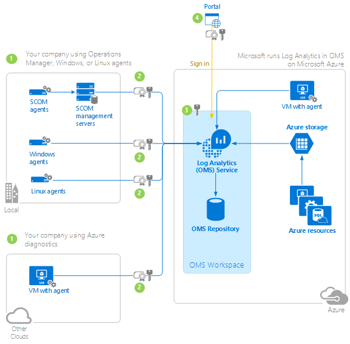

<properties
    pageTitle="記錄分析資料安全性 |Microsoft Azure"
    description="進一步瞭解記錄分析如何保護您的隱私權，保護您的資料。"
    services="log-analytics"
    documentationCenter=""
    authors="bandersmsft"
    manager="jwhit"
    editor=""/>

<tags
    ms.service="log-analytics"
    ms.workload="na"
    ms.tgt_pltfrm="na"
    ms.devlang="na"
    ms.topic="article"
    ms.date="09/23/2016"
    ms.author="banders"/>

# 記錄分析資料的安全性

Microsoft 致力於保護您的隱私權，而保護您的資料進行軟體和服務時協助您管理組織的 IT 基礎結構。 我們辨識時過程您的資料時，該信任需要嚴格的安全性。 Microsoft 遵循嚴格規範與安全性的指導方針，從編碼操作服務。

保護及保護資料是在 Microsoft 的上方的優先順序。 請與我們連絡任何問題，建議或問題下列資訊，包括我們在[Azure 的支援選項](http://azure.microsoft.com/support/options/)的安全性原則的相關資訊。

本文說明如何收集、 處理及記錄分析作業管理套件 (OMS) 中受保護資料。 您可以使用代理程式連線至 web 服務、 使用系統管理中心 Operations Manager 收集操作的資料，或從 Azure 診斷記錄分析使用擷取資料。 收集的資料是透過網際網路傳送記錄檔分析服務中，裝載於 Microsoft Azure 中使用憑證驗證與 SSL 3。 傳送之前，資料會自動壓縮代理程式。

記錄檔分析服務管理您以雲端為基礎的資料安全地使用以下兩種方法︰

- 資料責任分隔
- 資料保留資料
- 實體安全性
- 事件管理
- 法規遵循
- 安全性標準認證

## 資料責任分隔

客戶資料保留邏輯方式將另一個在整個 OMS 服務的每個元件。 每個組織已標記的所有資料。 此標記整個資料生命週期仍然存在，且執行服務的每個層級。 每一位客戶具有專屬的 Azure blob 來存放您長期資料

## 資料保留資料

索引的記錄檔搜尋資料會儲存，並保留根據您價格的方案。 如需詳細資訊，請參閱[記錄分析價格](https://azure.microsoft.com/pricing/details/log-analytics/)。

Microsoft 刪除客戶資料 30 天後 OMS 工作區已關閉。 Microsoft 也會刪除資料所在的儲存空間 Azure 帳戶。 移除客戶資料後，便會毀損沒有實體磁碟機。

下表列出一些 OMS 和範例的資料類型收集中可用的解決方案。

| **解決方案** | **資料類型** |
| --- | --- |
| 設定評估 | 設定資料、 中繼資料和狀態資料 |
| 容量計劃 | 效能資料及中繼資料 |
| 反惡意程式碼 | 設定資料及中繼資料 |
| 系統更新評估 | 中繼資料和狀態的資料 |
| 記錄管理 | 使用者定義事件記錄檔，Windows 事件記錄檔及/或 IIS 記錄檔 |
| 追蹤修訂 | 軟體庫存和 Windows 服務中繼資料 |
| SQL 與 Active Directory 評定 | WMI 資料、 登錄資料、 效能資料和 SQL Server 動態管理檢視結果 |

下表顯示的資料類型的範例︰

| **資料類型** | **欄位** |
| --- | --- |
| 提醒 | 提醒名稱、 警示描述、 BaseManagedEntityId、 問題識別碼、 IsMonitorAlert、 RuleId、 ResolutionState、 優先順序、 嚴重性、 類別、 擁有者、 ResolvedBy、 TimeRaised、 TimeAdded、 上次修改、 LastModifiedBy、 LastModifiedExceptRepeatCount、 TimeResolved、 TimeResolutionStateLastModified、 TimeResolutionStateLastModifiedInDB、 RepeatCount |
| 設定 | [客戶編號、 AgentID、 EntityID、 ManagedTypeID、 ManagedTypePropertyID、 CurrentValue，ChangeDate |
| 事件 | EventId、 EventOriginalID、 BaseManagedEntityInternalId、 RuleId、 PublisherId、 PublisherName、 FullNumber、 數字、 類別、 ChannelLevel、 LoggingComputer、 EventData、 EventParameters、 TimeGenerated、 TimeAdded  **附註︰**當您使用的自訂欄位登事件到 Windows 事件記錄檔時，OMS 收集它們。 |
| 中繼資料 | BaseManagedEntityId、 ObjectStatus、 OrganizationalUnit、 ActiveDirectoryObjectSid、 PhysicalProcessors、 NetworkName、 IPAddress、 ForestDNSName、 NetbiosComputerName、 VirtualMachineName、 LastInventoryDate、 HostServerNameIsVirtualMachine、 IP 位址、 NetbiosDomainName、 LogicalProcessors、 DNSName、 顯示名稱、 DomainDnsName、 ActiveDirectorySite、 PrincipalName、 OffsetInMinuteFromGreenwichTime |
| 效能 | 從 CounterName、 PerfmonInstanceName、 PerformanceDataId、 PerformanceSourceInternalID、 SampleValue、 TimeSampled、 TimeAdded |
| 狀態 | StateChangeEventId、 StateId、 NewHealthState、 OldHealthState、 內容、 TimeGenerated、 TimeAdded、 StateId2、 BaseManagedEntityId、 MonitorId、 HealthState、 上次修改、 LastGreenAlertGenerated、 DatabaseTimeModified |

## 實體安全性

在 OMS 服務記錄檔分析由 Microsoft 人員 manned 和所有活動記錄，並可稽核。 執行完全 Azure 中及符合 Azure 常見工程準則的服務。 您可以檢視實體資產的安全性 Azure 的詳細資料頁面上 18 的[Microsoft Azure 安全性概觀](http://download.microsoft.com/download/6/0/2/6028B1AE-4AEE-46CE-9187-641DA97FC1EE/Windows%20Azure%20Security%20Overview%20v1.01.pdf)。 安全性區域的實體的存取權限會變更一個工作天內負責 OMS 服務，包括傳輸和終止已不再擁有的任何人。 您可以瞭解[Microsoft 資料中心](https://www.microsoft.com/en-us/server-cloud/cloud-os/global-datacenters.aspx)，我們使用全域實際基礎結構。

## 事件管理

OMS 有遵守所有 Microsoft 服務事件管理程序。 若要簡言之，我們︰

- 使用共用的責任模型屬於客戶的某些部分時安全性責任部分所屬 Microsoft 的位置
- 管理 Azure 安全性事件
  - 偵測在第一個的指示，即可開始法律調查證據的事件
  - 評估影響和事件的電話上的事件回應小組成員的嚴重性。 根據證據，評估可能，或可能不會導致進一步提升安全性回應小組。
  - 診斷安全性回應專家，以進行技術或法庭調查，找出內含項目、 降低及因應措施策略事件。 如果安全性小組認為的客戶資料可能會變得公開非法或未經授權的人員，平行執行客戶事件通知的處理序開始平行。  
  - 穩定，並從事件中復原。 事件回應小組會建立一個修復計劃，以減少問題。 立即和診斷與平行，可能會發生危機內含項目步驟，例如隔離受影響的系統。 較長的字詞降低可能規劃就會發生之後立即風險。  
  - 關閉事件，然後進行事後。 事件回應小組建立事後會概述的事件，以意圖修訂原則、 程序，以及處理程序，以防止經過事件的詳細資料。
- 通知客戶安全性事件
  - 判斷範圍的受影響的客戶，並提供詳細盡可能通知都會影響的人
  - 建立提供客戶的詳細資訊不足，好讓他們可以對其結束執行法律調查證據和開會時不不當延遲通知程序所做的其使用者任何承諾通知。
  - 確認，然後宣告為必要的事件。
  - 通知與事件的通知，而不會合理的延遲，並根據任何法律或契約認可的客戶。 安全性事件的通知會傳遞給一或多個客戶的系統管理員，使用任何 Microsoft 選取，包括透過電子郵件的方法。
- 進行小組整備及訓練課程
  - Microsoft 的人員，才能完成安全性，並可協助他們找出並報告可疑的安全性問題的線上狀態訓練。  
  - 使用 Microsoft Azure 服務的運算子有加法訓練保密義務周圍其機密的系統管理客戶資料的存取權。
  - Microsoft 安全性回應人員會收到特殊的訓練課程的角色

發生資料遺失的任何客戶，我們會通知每一位客戶一天內。 不過，OMS 並未發生客戶資料遺失。 此外，我們維護資料所建立的複本，它將依地理區域。

如需瞭解 Microsoft 如何回應安全性事件的詳細資訊，請參閱[在雲端的 Microsoft Azure 安全性回應](https://gallery.technet.microsoft.com/Azure-Security-Response-in-dd18c678/file/150826/1/Microsoft Azure Security Response in the cloud.pdf)。

## 法規遵循

OMS 軟體開發和服務小組的資訊的安全性與管理程式支援其商務需求，並遵守法規所述， [Microsoft Azure 信任中心](https://azure.microsoft.com/support/trust-center/)與[Microsoft 信任中心規範](https://www.microsoft.com/en-us/TrustCenter/Compliance/default.aspx)。 OMS 建立的安全性需求的方式，識別的安全性控制項、 管理和監視風險也那里說明。 每年，我們進行檢閱原則、 標準、 程序和準則。

每個 OMS 開發小組成員接收正式的應用程式的安全性訓練課程。 在內部，我們的軟體開發使用版本控制系統。 每個軟體專案受到版本控制系統。

Microsoft 具有監督和評估 Microsoft 中的所有服務的安全性和法規遵循小組。 資訊的安全性長構成小組，而且不是開發 OMS 工程部門與相關聯。 安全人員自己管理鏈並進行產品和服務，以確保安全性和法規遵循的獨立評量。

Microsoft 的董事會通知，在 Microsoft 程式的相關的所有資訊安全性的年度報告。

OMS 軟體開發和服務小組正在使用的 Microsoft 法律和法規遵循的小組與其他業界合作夥伴擷取各種不同的認證。

## 安全性標準認證

在 OMS 記錄分析目前符合下列安全性標準︰

- [ISO/IEC 27001](http://www.iso.org/iso/home/standards/management-standards/iso27001.htm)和[ISO/IEC 27018:2014](http://www.iso.org/iso/home/store/catalogue_tc/catalogue_detail.htm?csnumber=61498)相容
- 付款卡產業 (PCI 相容) 的資料安全性標準 (PCI DSS) 來 PCI 安全標準會議。
- [服務組織控制項 (SOC) 1，輸入 1 和 2 輸入 1，SOC](https://www.microsoft.com/en-us/TrustCenter/Compliance/SOC1-and-2)相容性
- Windows 常見工程準則
- Microsoft 值得信任運算認證
- 為 Azure 服務中，使用 OMS 元件遵守 Azure 規範要求。 您可以閱讀更多在[Microsoft 信任中心規範](https://www.microsoft.com/en-us/TrustCenter/Compliance/default.aspx)。

## 雲端運算的安全性資料流程
下圖顯示的資訊流程為雲端安全性架構，從您的公司，如何進行保護現狀會移到記錄分析服務，最後 OMS 入口網站中看到您。 深入瞭解每一個步驟追蹤的圖表。

## 1.註冊記錄分析及收集資料

為您的組織傳送資料至記錄的分析，您可以設定 Windows Azure 虛擬機器或 OMS 代理程式上執行的 Linux 代理程式代理程式。 如果您使用 Operations Manager 代理程式，然後您會使用設定精靈作業主控台中檢視設定。 （這可能是您、 其他個別的使用者或一組人員） 的使用者建立一或多個 OMS 帳戶 （OMS 工作區），並使用其中一個下列帳戶登錄代理程式︰

- [組織識別碼](../active-directory/sign-up-organization.md)

- [Microsoft 帳戶-Outlook Office Live MSN](http://www.microsoft.com/account/default.aspx)

OMS 區是位置資料收集、 彙總、 分析，以及呈現。 工作區主要使用做為資料分割的資料，而且每個工作區是唯一的。 比方說，您可能要實際執行資料管理 OMS 工作區和您與另一個工作區受管理的測試資料。 工作區資料也有助於系統管理員控制使用者存取權。 每個工作區可以有多個使用者帳戶相關聯，而且每個使用者帳戶可以存取多個 OMS 工作區。 您建立根據區域資料中心的工作區。 每個工作區會複寫到其他地理區域，主要供 OMS 服務使用。

For Operations Manager 設定精靈完成後，每個 Operations Manager 管理群組會建立與記錄分析服務的連線。 然後，您會使用 [新增電腦精靈，選擇 [管理] 群組中的電腦允許傳送資料至服務。 對於其他代理程式類型，每個連線安全地 OMS 服務。

已加密連線的系統和記錄分析服務之間的所有通訊。  TLS (HTTPS) 通訊協定用於加密。  Microsoft SDL 處理程序會遵循以確保記錄分析是最新的最新先進的密碼編譯通訊協定。

每一種代理程式會收集記錄分析資料。 收集的資料類型是使用解決方案的類型而定。 您可以看到 solutions[從方案庫新增記錄分析](log-analytics-add-solutions.md)的資料收集的摘要。 此外，集合的詳細的資訊也適用於大部分的解決方案。 解決方法是套件的預先定義的檢視、 記錄搜尋查詢，資料集合規則與處理邏輯。 只有系統管理員可以使用記錄分析匯入解決方案。 在匯入解決方案之後，就會移到 Operations Manager 管理伺服器 （如果使用），然後以您選擇任何代理程式。 之後，代理程式收集的資料。

## 2.傳送資料從代理程式

您註冊所有代理程式類型註冊鍵並代理程式，使用連接埠 443 的 SSL 憑證驗證] 和記錄分析服務之間建立安全連線。 OMS 使用私人存放區來產生和維護鍵。 私密金鑰會旋轉每隔 90 天 Azure 中的儲存和管理的人員，請遵循嚴格法規和法規遵循準則的 Azure 作業。

Operations Manager 您記錄分析服務註冊工作區與 Operations Manager 管理伺服器之間建立安全 HTTPS 連線。

Windows Azure 虛擬機器上執行代理程式，唯讀的儲存空間索引鍵用來讀取診斷 Azure 資料表中的事件。

如果任何代理程式無法基於任何原因服務進行通訊，收集的資料會儲存在本機的暫時快取及管理伺服器嘗試重新傳送資料 2 小時每 8 分鐘。 代理程式的快取的資料受到作業系統的認證存放區。 如果服務無法處理資料 2 小時後，請代理程式會佇列資料。 如果已滿佇列中，OMS 會啟動卸除資料類型，效能資料開始著手。 代理程式佇列中限制為登錄機碼，讓您可以修改，如有必要。 收集的資料是壓縮，傳送至服務]，讓它不會新增至任何載入略過內部部署資料庫。 傳送收集的資料後，就會從快取中移除。

如上所述，就會透過 SSL 從您的代理程式的資料傳送至 Microsoft Azure 資料中心。 或者，您可以使用 ExpressRoute 提供額外的安全性的資料。 ExpressRoute 是直接從您現有的 WAN 網路連線至 Azure 的方式，例如多重通訊協定標籤切換 (MPLS) VPN、 服務提供者提供的網路。 如需詳細資訊，請參閱[ExpressRoute](https://azure.microsoft.com/services/expressroute/)。

## 3.記錄分析服務接收，並處理資料

記錄檔分析服務可確保內送的資料是從信任的來源來驗證憑證和 Azure 驗證資料完整性。 未處理的原始資料都會儲存成[Microsoft Azure 儲存體](../storage/storage-introduction.md)中 blob，不加密。 不過，每個儲存 Azure blob 具有組唯一的索引鍵只給該使用者可存取的設定。 儲存的資料類型是解決方案所匯入和用來收集資料的類型而定。 然後，記錄分析服務處理 Azure 儲存部落格的原始資料。

## 4.使用記錄分析來存取資料

您可以登入記錄檔分析 OMS 入口網站中使用組織帳戶或您先前設定的 Microsoft 帳戶。 透過安全 HTTPS 通道傳送 OMS 入口網站和記錄分析中 OMS 之間的所有流量。 使用者用戶端 （網頁瀏覽器） 當使用 OMS 入口網站，就會產生的工作階段識別碼，資料會儲存在本機快取，直到已結束工作階段。 結束時，會刪除快取。 用戶端 cookie，不會包含個人識別資訊，不會自動移除。 工作階段 cookie 標示 HTTPOnly，及保護。 預定的空閒時間之後, 便會終止 OMS 入口網站工作階段。

使用 [OMS 入口網站，您可以將資料匯出為 CSV 檔案，您可以存取使用搜尋 Api 的資料。 CSV 匯出限制為每個匯出 50000 列，而 API 資料會限制為每個搜尋 5000 個資料行。

## 後續步驟

- [開始使用記錄分析](log-analytics-get-started.md)，以進一步了解記錄分析及取得啟動和執行以分鐘為單位。
