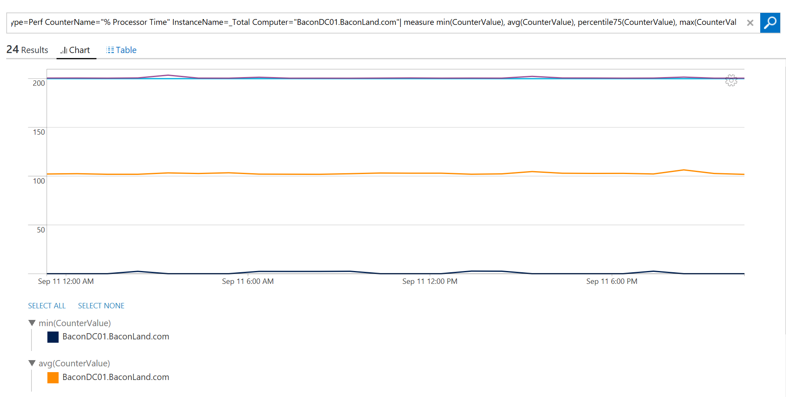
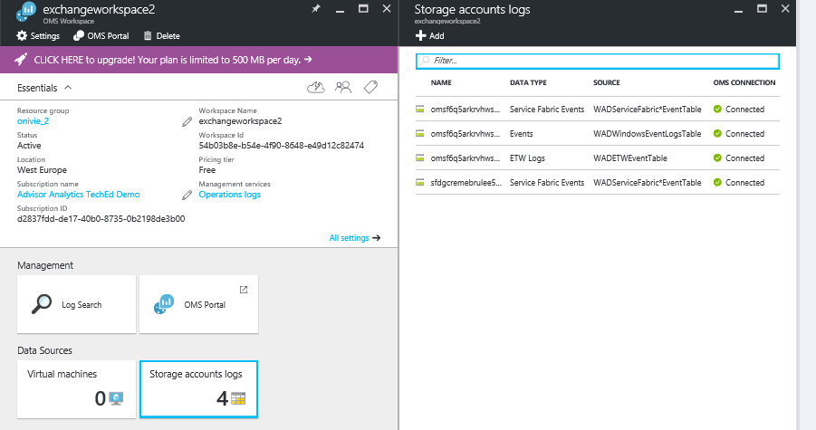

<properties
    pageTitle="最佳化您的環境中記錄分析服務布料的轉印圖樣解決方案 |Microsoft Azure"
    description="若要評估的風險和健康情況的服務布料的轉印圖樣應用程式、 微服務、 節點和叢集，您可以使用服務布料的轉印圖樣解決方案。"
    services="log-analytics"
    documentationCenter=""
    authors="niniikhena"
    manager="jochan"
    editor=""/>

<tags
    ms.service="log-analytics"
    ms.workload="na"
    ms.tgt_pltfrm="na"
    ms.devlang="na"
    ms.topic="article"
    ms.date="09/21/2016"
    ms.author="nini"/>


# <a name="service-fabric-solution-in-log-analytics"></a>在記錄檔分析服務布料的轉印圖樣解決方案

> [AZURE.SELECTOR]
- [資源管理員](log-analytics-service-fabric-azure-resource-manager.md)
- [PowerShell](log-analytics-service-fabric.md)

本文將說明如何在記錄檔分析中使用服務布料的轉印圖樣解決方案，以協助找出並在您的服務布料的轉印圖樣叢集疑難排解問題。

服務布料的轉印圖樣解決方案會使用您的服務布料的轉印圖樣 Vm Azure 診斷資料從 Azure WAD 表格收集此資料。 記錄檔分析然後讀取服務結構架構事件，包括**可靠的服務事件**、**動作項目事件**、**作業事件**，以及**自訂 ETW 事件**。 使用解決方案儀表板，也可以檢視您的服務布料的轉印圖樣環境中的主要問題和相關的事件。

若要開始使用解決方案，您必須將您的服務布料的轉印圖樣叢集連線到記錄分析工作區。 以下是三個案例︰

1. 如果您有沒有部署服務布料的轉印圖樣叢集，使用***部署服務布料的轉印圖樣叢集連線到記錄分析工作區***中的步驟，部署新的叢集並將其設定為記錄分析報表。

2. 如果您要從您的主機服務布料的轉印圖樣叢集上使用其他 OMS 解決方案，例如安全性收集效能計數器，請遵循的步驟，在***部署服務布料的轉印圖樣叢集 VM 副檔名安裝連線至 OMS 的工作區。***

3. 如果您已經部署您服務布料的轉印圖樣叢集，若要將其連線至記錄的分析，請依照下列中的步驟***將現有的儲存空間帳戶新增至記錄分析。***


##<a name="deploy-a-service-fabric-cluster-connected-to-a-log-analytics-workspace"></a>部署服務布料的轉印圖樣叢集記錄分析工作區連線。
此範本執行下列動作︰


1. 部署已經連線到記錄分析工作區 Azure 服務布料的轉印圖樣叢集。 您可以同時部署範本，建立新的工作區的選項，或輸入現有的日誌分析工作區的名稱。
2. 新增記錄分析工作區診斷儲存帳戶。
3. 可讓您記錄分析工作區中的服務布料的轉印圖樣方案。

[](https://portal.azure.com/#create/Microsoft.Template/uri/https%3A%2F%2Fraw.githubusercontent.com%2Fazure%2Fazure-quickstart-templates%2Fmaster%2Fservice-fabric-oms%2F%2Fazuredeploy.json)


一旦您選取 [部署] 按鈕上方時，您將會送達您編輯的參數的 Azure 入口網站上。 請務必建立新的資源群組，如果您輸入新的記錄檔分析工作區名稱︰


接受法律，然後按下 「 建立 「 啟動部署。 一旦完成部署，您應該會看到新的工作區和叢集建立，WADServiceFabric * 事件與 WADWindowsEventLogs WADETWEvent 新增的表格︰


##<a name="deploy-a-service-fabric-cluster-connected-to-an-oms-workspace-with-vm-extension-installed"></a>部署服務布料的轉印圖樣叢集安裝 VM 副檔名與連線至 OMS 的工作區。
此範本執行下列動作︰

1. 部署已經連線到記錄分析工作區 Azure 服務布料的轉印圖樣叢集。 您可以建立新的工作區，或使用現有的項目。
2. 會將診斷儲存帳戶記錄分析工作區。
3. 啟用記錄分析工作區中的服務布料的轉印圖樣方案。
4. 安裝 MMA 代理程式副檔名中設定您的服務布料的轉印圖樣叢集中每個 VM 小數位數。 已安裝 MMA 代理程式的情況下，您就可以檢視您的節點的相關的效能指標。


[](https://portal.azure.com/#create/Microsoft.Template/uri/https%3A%2F%2Fraw.githubusercontent.com%2Fazure%2Fazure-quickstart-templates%2Fmaster%2Fservice-fabric-vmss-oms%2F%2Fazuredeploy.json)


依照上述相同步驟，輸入必要的參數，並開始進行部署。 同樣地，您應該會看到新的工作區、 叢集及所有建立的 WAD 資料表︰


###<a name="viewing-performance-data"></a>檢視效能資料

若要從您的節點檢視效能資料︰
</br>
- 啟動記錄分析工作區，從 Azure 入口網站。


- 在左窗格中，移至 [設定]，然後選取 [資料 >> Windows 效能計數器 >> [新增選取的效能計數器]:

- 在記錄檔搜尋，使用下列查詢，深入瞭解您的節點的索引鍵指標︰
</br>

    。 比較平均的 CPU 使用率您所有的節點中的最後一個小時若要查看哪些節點時發生問題，及哪些的時間間隔節點有特殊圖文集︰

    ``` Type=Perf ObjectName=Processor CounterName="% Processor Time"|measure avg(CounterValue) by Computer Interval 1HOUR. ```

    


    b。 此查詢中的每個節點上檢視類似折線圖的可用的記憶體︰

    ```Type=Perf ObjectName=Memory CounterName="Available MBytes Memory" | measure avg(CounterValue) by Computer Interval 1HOUR.```

    若要檢視您的所有節點，其中的確切的平均值顯示每個節點，可用 Mb 的清單中，使用下列查詢︰

    ```Type=Perf (ObjectName=Memory) (CounterName="Available MBytes") | measure avg(CounterValue) by Computer ```

    


    c。 在您想要向下切入至特定的節點檢查每小時平均值、 最小值、 最大值和 75 個百分位數的 CPU 使用率的情況下，您無法使用此查詢 （取代電腦欄位） 進行這項操作︰

    ```Type=Perf CounterName="% Processor Time" InstanceName=_Total Computer="BaconDC01.BaconLand.com"| measure min(CounterValue), avg(CounterValue), percentile75(CounterValue), max(CounterValue) by Computer Interval 1HOUR```

    

    閱讀有關中記錄分析 here。 效能指標(https://blogs.technet.microsoft.com/msoms/tag/metrics/)


##<a name="adding-an-existing-storage-account-to-log-analytics"></a>將現有的儲存空間帳戶新增至記錄的狀況分析

此範本僅將現有的儲存空間帳戶加入新的或現有記錄分析工作區。
</br>

[](https://portal.azure.com/#create/Microsoft.Template/uri/https%3A%2F%2Fraw.githubusercontent.com%2FAzure%2Fazure-quickstart-templates%2Fmaster%2Foms-existing-storage-account%2Fazuredeploy.json)

>[AZURE.NOTE] 中選取 [資源] 群組中，如果您使用現有的日誌分析工作區，選取 [使用現有 」，然後搜尋包含 OMS 工作區的資源群組。 建立新的一個 if 否則。


此範本部署後，您可以看到儲存帳戶連線到您記錄分析工作區。 在此情況下，我可以新增更多儲存空間帳戶先前所建立的 Exchange 工作區。


## <a name="view-service-fabric-events"></a>檢視服務布料的轉印圖樣事件

一旦完成部署服務布料的轉印圖樣方案已啟用您的工作區中，選取 [**服務布料的轉印圖樣**磚記錄分析入口網站，以啟動的服務布料的轉印圖樣儀表板中。 儀表板包含下列表格中的欄。 每個資料行清單上方的十個事件來計算符合指定的時間範圍的欄的準則。 您可以執行記錄搜尋提供整個清單，即可**查看所有**底部右邊的每個資料行，或按一下資料行標頭。

| **服務布料的轉印圖樣事件** | **描述** |
| --- | --- |
| 主要問題 | 顯示的問題，例如 RunAsyncFailures RunAsynCancellations 和節點清單中。 |
| 作業事件 | 主要作業事件，例如應用程式升級及部署。 |
| 可靠的服務事件 | 主要可靠的服務事件這類 Runasyncinvocations。 |
| 動作項目事件 | 您微-的服務，例如動作項目方法、 動作項目已啟用和停用和等等擲回例外狀況所產生的主要的動作項目事件。 |
| 應用程式的事件 | 所有自訂 ETW 所產生的事件應用程式。 |


下表顯示資料集合方法和其他詳細資料收集的服務布料的轉印圖樣的方式。

| 平台 | 直接代理程式 | 是 SCOM 代理程式 | Azure 儲存體 | 必要時，是 SCOM 嗎？ | 透過管理群組傳送是 SCOM 代理程式的資料 | 集合頻率 |
|---|---|---|---|---|---|---|
|Windows||| ![[是]](./media/log-analytics-malware/oms-bullet-green.png)|            ||10 分鐘的時間 |


>[AZURE.NOTE] 您可以變更這些事件服務布料的轉印圖樣方案中的範圍，即可在儀表板頂端的 [**過去 7 天為基礎的資料**。 您也可以顯示過去 7 天，1 天或六個小時內所產生的事件。 或者，您可以選取**自訂**指定自訂日期範圍。


## <a name="next-steps"></a>後續步驟

- 您可以使用[記錄分析中的記錄檔搜尋](log-analytics-log-searches.md)來檢視服務布料的轉印圖樣事件的詳細的資料。
