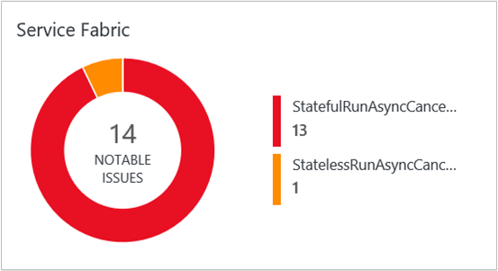

<properties
    pageTitle="最佳化您的環境中記錄分析服務布料的轉印圖樣解決方案 |Microsoft Azure"
    description="若要評估的風險和健康情況的服務布料的轉印圖樣應用程式、 微服務、 節點和叢集，您可以使用服務布料的轉印圖樣解決方案。"
    services="log-analytics"
    documentationCenter=""
    authors="niniikhena"
    manager="jochan"
    editor=""/>

<tags
    ms.service="log-analytics"
    ms.workload="na"
    ms.tgt_pltfrm="na"
    ms.devlang="na"
    ms.topic="article"
    ms.date="09/21/2016"
    ms.author="nini"/>


# <a name="service-fabric-solution-in-log-analytics"></a>在記錄檔分析服務布料的轉印圖樣解決方案

> [AZURE.SELECTOR]
- [資源管理員](log-analytics-service-fabric-azure-resource-manager.md)
- [PowerShell](log-analytics-service-fabric.md)

本文將說明如何在記錄檔分析中使用服務布料的轉印圖樣解決方案，以協助找出並在您的服務布料的轉印圖樣叢集疑難排解問題來開始可見度如何執行的您的服務布料的轉印圖樣節點，與您的應用程式和微服務正在執行。

服務布料的轉印圖樣解決方案會使用您的服務布料的轉印圖樣 Vm Azure 診斷資料從 Azure WAD 表格收集此資料。 記錄檔分析然後讀取服務結構架構事件，包括**可靠的服務事件**、**動作項目事件**、**作業事件**，以及**自訂 ETW 事件**。 服務布料的轉印圖樣解決方案儀表板服務布料的轉印圖樣環境中，顯示您主要問題和相關的事件。

## <a name="installing-and-configuring-the-solution"></a>安裝及設定解決方案

請遵循下列三個簡單的步驟安裝和設定方案︰

1. 請確定您使用的 OMS 工作區與您用來建立所有叢集資源，包括儲存帳戶的相同 Azure 訂閱相關聯。 如需建立 OMS 工作區的資訊，請參閱[開始使用記錄分析](log-analytics-get-started.md)。
2. 設定 OMS 來收集及檢視服務布料的轉印圖樣記錄。
3. 啟用您的工作區中的服務布料的轉印圖樣方案。

## <a name="configure-oms-to-collect-and-view-service-fabric-logs"></a>設定 OMS 來收集及檢視服務布料的轉印圖樣記錄
在 [此節]，您將學習如何設定 OMS 擷取服務布料的轉印圖樣記錄。 記錄檔可讓您檢視、 分析和疑難排解問題叢集或應用程式與服務的叢集，在執行中使用 [OMS 入口網站。

>[AZURE.NOTE] Azure 診斷副檔名必須設定上傳至儲存資料表符合 OMS 看起來的記錄。 如需有關如何收集記錄，請參閱[如何收集 Azure 診斷記錄檔](../service-fabric/service-fabric-diagnostics-how-to-setup-wad.md)。 設定設定中的範例這份文件顯示哪些儲存資料表的名稱，應該。 診斷設定叢集上，並會將上傳至儲存帳戶的記錄下, 一步是設定 OMS 收集這些記錄。

請確定您更新為新 EventSources 新增項目之前執行**deploy.ps1**套用設定更新**template.json**檔案中的 [ **EtwEventSourceProviderConfiguration** ] 區段。 [上傳] 資料表已 (ETWEventTable) 相同。 此時，OMS 只可以讀取應用程式 ETW 事件從該資料表。 不過，支援自訂 ETW 資料表會在開發。

下列工具用來執行此節中的某些操作︰

-   Azure PowerShell
-   [作業管理套件](http://www.microsoft.com/oms)

### <a name="configure-an-oms-workspace-to-show-the-cluster-logs"></a>設定要顯示叢集記錄 OMS 工作區

如上所述 OMS 工作區建立之後下, 一步是設定，它們會由診斷延伸上載的工作區來擷取 Azure 儲存資料表中的記錄。 若要這麼做，請執行下列 PowerShell 指令碼︰

```
<#
    This script will configure an Operations Management Suite workspace (previously called an Operational Insights workspace) to read Diagnostics from an Azure Storage account.
    It will enable all supported data types (currently Service Fabric Events, ETW Events and IIS Logs).
    It supports Resource Manager storage accounts.
    If you have more than one Azure Subscription, you will be prompted for the subscription to configure.
    If you have more than one OMS workspace you will be prompted for the workspace to configure.
    It will then look through your Service Fabric clusters, and configure your OMS workspace to read Diagnostics from storage accounts that are connected to that cluster and have diagnostics enabled.
#>

try
{
    Get-AzureRMContext
}
catch [System.Management.Automation.PSInvalidOperationException]
{
    Add-AzureRmAccount
}

$validTables = "WADServiceFabric*EventTable", "WADETWEventTable"
function Select-Subscription {
      $subscription = ""
      $allSubscriptions = Get-AzureRmSubscription
      switch ($allSubscriptions.Count) {
             0 {Write-Error "No Operations Management Suite workspaces found"}
             1 {return $allSubscriptions}
        default {
            $uiPrompt = "Enter the number corresponding to the Azure subscription you would like to work with.`n"

            $count = 1
            foreach ($subscription in $allSubscriptions) {
                $uiPrompt += "$count. " + $subscription.SubscriptionName + " (" + $subscription.SubscriptionId + ")`n"
                $count++
            }
            $answer = (Read-Host -Prompt $uiPrompt) - 1
            $subscription = $allSubscriptions[$answer]
             Write-Host $subscription.SubscriptionId
        }  
    }
    return $subscription
}

function Select-Workspace {
    $workspace = ""
    $allWorkspaces = Get-AzureRmOperationalInsightsWorkspace  

    switch ($allWorkspaces.Count) {
        0 {Write-Error "No Operations Management Suite workspaces found. `n"}
        1 {return $allWorkspaces}
        default {
            $uiPrompt = "Enter the number corresponding to the workspace you want to configure.`n"
            $count = 1
            foreach ($workspace in $allWorkspaces) {
                $uiPrompt += "$count. " + $workspace.Name + " (" + $workspace.CustomerId + ")`n"
                $count++
            }
            $answer = (Read-Host -Prompt $uiPrompt) - 1
            $workspace = $allWorkspaces[$answer]
             Write-Host $workspace.WorkspaceName
        }  
    }
    return $workspace
}

function Check-ETWProviderLogging {
     param(
     [string]$id,
     [string]$provider,
     [string]$expectedTable,
     [string]$table
    )       
         Write-Debug ("ID: $id Provider: $provider ExpectedTable $expectedTable ActualTable $table")
         if ( ($table -eq $null) -or ($table -eq ""))  
         {
             Write-Warning ("$id No configuration found for $provider. Configure Azure diagnostics to write to $expectedTable.")
         }  
         elseif ( $table -ne $expectedTable )
         {
             Write-Warning ("$id $provider events are being written to $table instead of WAD$expectedTable. Events will not be collected by OMS")
         }  
         else
         {
             Write-Verbose "$id $provider events are being written to WAD$expectedTable (Correct configuration.)"
         }
 }

function Check-ServiceFabricScaleSetDiagnostics {
     param(
          [psobject]$scaleSetDiagnostics
   )
     $storageAccountsFound = @()
     Write-Verbose ("Checking " + $scaleSetDiagnostics)
     $sfReliableActorTable = $null
     $sfReliableServiceTable = $null
     $sfOperationalTable = $null

     Write-Debug $scaleSetDiagnostics
     $serviceFabricProviderList = ""
     $etwManifestProviderList = ""

     if ( $scaleSetDiagnostics.xmlCfg )  
      {
             Write-Debug ("Found XMLcfg")
             $xmlCfg = [System.Text.Encoding]::UTF8.GetString([System.Convert]::FromBase64String($scaleSetDiagnostics.xmlCfg))
             Write-Debug $xmlCfg
             $etwProviders = Select-Xml -Content $xmlCfg -XPath "//EtwProviders"                 
             $serviceFabricProviderList = $etwProviders.Node.EtwEventSourceProviderConfiguration
             $etwManifestProviderList = $etwProviders.Node.EtwManifestProviderConfiguration
      } elseif ($scaleSetDiagnostics.WadCfg )  
     {
         Write-Debug ("Found WADcfg")
         Write-Debug $scaleSetDiagnostics.WadCfg
         $serviceFabricProviderList = $scaleSetDiagnostics.WadCfg.DiagnosticMonitorConfiguration.EtwProviders.EtwEventSourceProviderConfiguration
         $etwManifestProviderList = $scaleSetDiagnostics.WadCfg.DiagnosticMonitorConfiguration.EtwProviders.EtwManifestProviderConfiguration
     } else
     {
         Write-Error "Unable to parse Azure Diagnostics setting for $id"
             Write-Warning ("$id does not have diagnostics enabled")
     }
     foreach ($provider in $serviceFabricProviderList)  
     {
         Write-Debug ("Event Source Provider: " + $provider.Provider + " Destination: " + $provider.DefaultEvents.eventDestination)
         if ($provider.Provider -eq "Microsoft-ServiceFabric-Actors")
         {
             $sfReliableActorTable = $provider.DefaultEvents.eventDestination  
         } elseif ($provider.Provider -eq "Microsoft-ServiceFabric-Services")  
         {  
             $sfReliableServiceTable = $provider.DefaultEvents.eventDestination  
         } else  
         {
             Check-ETWProviderLogging $id $provider.Provider "ETWEventTable" $provider.DefaultEvents.eventDestination
         }
     }
     foreach ($provider in $etwManifestProviderList)
     {
         Write-Debug ("Manifest Provider: " + $provider.Provider + " Destination: " + $provider.DefaultEvents.eventDestination)
         if ($provider.Provider -eq "cbd93bc2-71e5-4566-b3a7-595d8eeca6e8")
         {
             $sfOperationalTable = $provider.DefaultEvents.eventDestination  
         } else  
         {
             Check-ETWProviderLogging $id $provider.Provider "ETWEventTable" $provider.DefaultEvents.eventDestination
         }
     }

     Check-ETWProviderLogging $id "Microsoft-ServiceFabric-Actors" "ServiceFabricReliableActorEventTable" $sfReliableActorTable
     Check-ETWProviderLogging $id "Microsoft-ServiceFabric-Services" "ServiceFabricReliableServiceEventTable" $sfReliableServiceTable
     Check-ETWProviderLogging $id "cbd93bc2-71e5-4566-b3a7-595d8eeca6e8 (System events)" "ServiceFabricSystemEventTable" $sfOperationalTable

     Write-Verbose ("StorageAccount: " + $scaleSetDiagnostics.StorageAccount)
     $storageAccountsFound += ($scaleSetDiagnostics.StorageAccount)
     return ($storageAccountsFound)
 }

function Select-StorageAccount {
    $allResources = Get-AzureRmResource #pulls in all resources
    $serviceFabricClusters = $allResources.Where({$_.ResourceType -eq "Microsoft.ServiceFabric/clusters"}) #pulls in all service fabric clusters in the resource
    $storageAccountList = @()
    foreach($cluster in $serviceFabricClusters) {
        Write-Host("Checking cluster: " + $cluster.Name)
         $scaleSet = $allResources.Where({($_.ResourceType -eq "Microsoft.Compute/virtualMachineScaleSets") -and ($_.ResourceGroupName -eq $cluster.ResourceGroupName)})

         foreach($set in $scaleSet) {
             $resource = Get-AzureRmResource -ResourceId $set.ResourceId
             $extensions = $resource.Properties.VirtualMachineProfile.ExtensionProfile.Extensions

             foreach($ext in $extensions) {
                 if ($ext.Properties.Publisher -eq "Microsoft.Azure.Diagnostics" -and $ext.Properties.Type -eq "IaaSDiagnostics") {
                     $storageAccountList += (Check-ServiceFabricScaleSetDiagnostics $ext.Properties.Settings)
                 }
             }
          }

         $storageAccountsToCheck = $allResources.Where({($_.ResourceType -eq "Microsoft.Storage/storageAccounts") -and ($_.ResourceName -in $storageAccountList)})

         if ($storageAccountsToCheck.Count -eq "0") {
                Write-Error "No storage accounts found"
           }
           else {
                    foreach ($storageAccount in $storageAccountsToCheck) {
                        Write-Host("Checking Storage Account: " + $storageAccount.Name)
                        $insightsName = $storageAccount.Name + $workspace.Name
                        $existingConfig = ""
                        try
                            {
                                $existingConfig = Get-AzureRmOperationalInsightsStorageInsight -Workspace $workspace -Name $insightsName -ErrorAction Stop
                            }
                        catch [Hyak.Common.CloudException]
                            {
                                # HTTP Not Found is returned if the storage insight doesn't exist
                            }
                        if ($existingConfig) {                         
                                  [array]$Tables = $existingConfig.Tables
                                   foreach($table in $validTables) {
                                         if($Tables -notcontains $table) {
                                               $Tables += $table
                                               $dirty = $true;
                                               Write-Host "Adding Table: $table";
                                         }
                                         else {
                                               Write-Host "$table is already configured.`n";
                                             }
                                      }
                                      # If any of the tables from the table list are not already monitored, then we add them
                                   if($dirty -eq $true) {
                                           Set-AzureRmOperationalInsightsStorageInsight -Workspace $workspace -Name $insightsName -Tables $Tables
                                           Write-Host "Updating Storage Insight. `n"
                                    }
                                    else {
                                           Write-Host "Storage Insight already updated."
                                  }
                          }
                     else {
                            $key = (Get-AzureRmStorageAccountKey -ResourceGroupName $storageAccount.ResourceGroupName -Name $storageAccount.Name)[0].Value
                           New-AzureRmOperationalInsightsStorageInsight -Workspace $workspace -Name $insightsName -StorageAccountResourceId $storageAccount.ResourceId -StorageAccountKey $key -Tables $validTables
                            Write-Host "New Azure Storage Insight Configured. `n"
                           }
                    }
             }
      }
      return
     }

$subscription = Select-Subscription
$subscriptionId = $subscription.SubscriptionId
$subscription = Select-AzureRmSubscription -SubscriptionId $subscriptionId
$workspace = Select-Workspace
$storageAccount = Select-StorageAccount
```

之後您已設定 OMS 工作區閱讀 Azure 資料表中您儲存的帳戶，登入 Azure 入口網站，以及從**所有資源**選取 OMS 工作區。 選取後，您應該會看到帳戶連線到該 OMS 工作區的記錄數字的儲存空間。 選取 [**儲存帳戶記錄**的方塊，並確認清單中的儲存空間帳戶記錄您儲存的帳戶已連線至該 OMS 工作區︰


## <a name="enable-the-service-fabric-solution"></a>啟用服務布料的轉印圖樣解決方案
使用下列指令碼新增到 OMS 工作區的解決方案。 使用您想要啟用的服務布料的轉印圖樣解決方案 OMS 工作區與相關聯的 Azure 訂閱 PowerShell 執行的指令碼。

```
function Select-Subscription {
      $subscription = ""
      $allSubscriptions = Get-AzureRmSubscription
      switch ($allSubscriptions.Count) {
             0 {Write-Error "No Operations Management Suite workspaces found"}
             1 {return $allSubscriptions}
        default {
            $uiPrompt = "Enter the number corresponding to the Azure subscription you would like to work with.`n"
            $count = 1
            foreach ($subscription in $allSubscriptions) {
                $uiPrompt += "$count. " + $subscription.SubscriptionName + " (" + $subscription.SubscriptionId + ")`n"
                $count++
            }
            $answer = (Read-Host -Prompt $uiPrompt) - 1
            $subscription = $allSubscriptions[$answer]
             Write-Host $subscription.SubscriptionId
        }  
    }
    return $subscription
}

function Select-Workspace {
    $workspace = ""
    $allWorkspaces = Get-AzureRmOperationalInsightsWorkspace  
    switch ($allWorkspaces.Count) {
        0 {Write-Error "No Operations Management Suite workspaces found"}
        1 {return $allWorkspaces}
        default {
            $uiPrompt = "Enter the number corresponding to the workspace you want to configure.`n"
            $count = 1
            foreach ($workspace in $allWorkspaces) {
                $uiPrompt += "$count. " + $workspace.Name + " (" + $workspace.CustomerId + ")`n"
                $count++
            }
            $answer = (Read-Host -Prompt $uiPrompt) - 1
            $workspace = $allWorkspaces[$answer]
                           Write-Host $workspace.WorkspaceName
        }  
    }
    return $workspace
}
$subscription = Select-Subscription
$subscriptionId = $subscription.SubscriptionId
$subscription = Select-AzureRmSubscription -SubscriptionId $subscriptionId
$workspace = Select-Workspace
Set-AzureRmOperationalInsightsIntelligencePack -ResourceGroupName $workspace.ResourceGroupName -WorkspaceName $workspace.Name -IntelligencePackName "ServiceFabric" -Enabled $true
```

啟用方案之後，[服務布料的轉印圖樣] 方塊會新增至您 OMS 概觀] 頁面，例如 runAsync 失敗及取消過去 24 小時中所發生的主要問題的檢視中。



### <a name="view-service-fabric-events"></a>檢視服務布料的轉印圖樣事件

按一下 [**服務布料的轉印圖樣**磚來開啟 [服務布料的轉印圖樣儀表板]。 儀表板包含下列表格中的欄。 每個資料行清單上方的十個事件來計算符合指定的時間範圍的欄的準則。 您可以執行記錄搜尋提供整個清單，即可**查看所有**底部右邊的每個資料行，或按一下資料行標頭。

| **服務布料的轉印圖樣事件** | **描述** |
| --- | --- |
| 主要問題 | 顯示的問題，例如 RunAsyncFailures RunAsynCancellations 和節點清單中。 |
| 作業事件 | 主要作業事件，例如應用程式升級及部署。 |
| 可靠的服務事件 | 主要可靠的服務事件這類 Runasyncinvocations。 |
| 動作項目事件 | 您微-的服務，例如動作項目方法、 動作項目已啟用和停用和等等擲回例外狀況所產生的主要的動作項目事件。 |
| 應用程式的事件 | 所有自訂 ETW 所產生的事件應用程式。 |


下表顯示資料集合方法和其他詳細資料收集的服務布料的轉印圖樣的方式。

| 平台 | 直接代理程式 | 是 SCOM 代理程式 | Azure 儲存體 | 必要時，是 SCOM 嗎？ | 透過管理群組傳送是 SCOM 代理程式的資料 | 集合頻率 |
|---|---|---|---|---|---|---|
|Windows||| ![[是]](./media/log-analytics-malware/oms-bullet-green.png)|            ||10 分鐘的時間 |


>[AZURE.NOTE] 您可以變更這些事件服務布料的轉印圖樣方案中的範圍，即可在儀表板頂端的 [**過去 7 天為基礎的資料**。 您也可以顯示過去 7 天，1 天或 6 小時內所產生的事件。 或者，您可以選取**自訂**指定自訂日期範圍。


## <a name="troubleshoot-your-service-fabric-and-oms-configuration"></a>疑難排解您服務布料的轉印圖樣及 OMS 設定

如果您要驗證您的 OMS 設定，因為您無法在 OMS 中檢視事件資料，請使用下列的指令碼。 讀取您的服務布料的轉印圖樣診斷設定，檢查寫入到表格的資料，並確認 OMS 已閱讀的資料表。

```
<#
    Verify Service Fabric and OMS configuration
    1. Read Service Fabric diagnostics configuration
    2. Check for data being written into the tables
    3. Verify OMS is configured to read from the tables

    Supported tables:
    WADServiceFabricReliableActorEventTable
    WADServiceFabricReliableServiceEventTable
    WADServiceFabricSystemEventTable
    WADETWEventTable

    Script will write a warning for every misconfiguration detected
    To see items that are correctly configured set $VerbosePreference="Continue"
#>
Param
(
    [Parameter(Mandatory=$true,
    ValueFromPipeline=$true,
    Position=1)]
    [string]$workspaceName
)

$WADtables = @("WADServiceFabricReliableActorEventTable",
               "WADServiceFabricReliableServiceEventTable",
               "WADServiceFabricSystemEventTable",
               "WADETWEventTable"
               )

<#
    Check if OMS Log Analytics is configured to index service fabric events from the specified table
#>

function Check-OMSLogAnalyticsConfiguration {
    param(
    [psobject]$workspace,
    [psobject]$storageAccount,
    [string]$id
    )

    $existingInsights = Get-AzureRmOperationalInsightsStorageInsight -ResourceGroupName $workspace.ResourceGroupName -WorkspaceName $workspace.Name

    if ($existingInsights)
    {
        $currentStorageAccountInsight = $existingInsights.Where({$_.StorageAccountResourceId -eq $storageAccount.ResourceId})

        if ("WADServiceFabric*EventTable" -in $currentStorageAccountInsight.Tables)
        {
            Write-Verbose ("OMS Log Analytics workspace " + $workspace.Name + " is configured to index service fabric actor, service and operational events from " + $storageAccount.Name)
        } else
        {
            Write-Warning ("OMS Log Analytics workspace " + $workspace.Name + " is not configured to index service fabric actor, service and operational events from " + $storageAccount.Name)
        }
        if ("WADETWEventTable" -in $currentStorageAccountInsight.Tables)
        {
            Write-Verbose ("OMS Log Analytics workspace " + $workspace.Name + " is configured to index service fabric application events from " + $storageAccount.Name)
        } else
        {
            Write-Warning ("OMS Log Analytics workspace " + $workspace.Name + " is not configured to index service fabric application events from " + $storageAccount.Name)
        }
    } else
    {
        Write-Warning ("OMS Log Analytics workspace " + $workspace.Name + "is not configured to read service fabric events from " + $storageAccount.Name)
    }    
}

<#
    Check Azure table storage to confirm there is recent data written by Service Fabric
#>

function Check-TablesForData {
    param(
    [psobject]$storageAccount
    )

    $ctx = (Get-AzureRmStorageAccount -ResourceGroupName $storageAccount.ResourceGroupName -Name $storageAccount.ResourceName).Context

    $createdTables = Get-AzureStorageTable -Context $ctx

    $recently = Get-Date -Format s ((Get-Date).AddMinutes(-20).ToUniversalTime())
    $recently = $recently + "Z"

    foreach ($table in $WADtables)
    {
        if ($table -in $createdTables.Name)
        {
            $tbl = Get-AzureStorageTable -Name $table -Context $ctx
            $query = New-Object Microsoft.WindowsAzure.Storage.Table.TableQuery
            $list = New-Object System.Collections.Generic.List[string]
            $list.Add("RowKey")
            $list.Add("ProviderName")
            $list.Add("Timestamp")
            $query.FilterString = "Timestamp gt datetime'$recently'"
            $query.SelectColumns = $list
            $query.TakeCount = 20
            $entities = $tbl.CloudTable.ExecuteQuery($query)
            Write-Debug $entities
            if ($entities.Count -gt 0)
            {
                Write-Verbose ("Data was written to $table in " + $storageAccount.ResourceName + "after $recently")
            } else
            {
                Write-Warning ("No data after $recently is in  $table in " + $storageAccount.ResourceName)
            }
        } else
        {
            Write-Warning ("$table does not exist in storage account " + $storageAccount.ResourceName)
        }
    }
}

<#
    Check if ETW provider is configured to log events to the expected table storage
#>
function Check-ETWProviderLogging {
    param(
    [string]$id,
    [string]$provider,
    [string]$expectedTable,
    [string]$table
    )      
        Write-Debug ("ID: $id Provider: $provider ExpectedTable $expectedTable ActualTable $table")
        if ( ($table -eq $null) -or ($table -eq ""))
        {
            Write-Warning ("$id No configuration found for $provider. Configure Azure diagnostics to write to $expectedTable.")
        }
        elseif ( $table -ne $expectedTable )
        {
            Write-Warning ("$id $provider events are being written to $table instead of WAD$expectedTable. Events will not be collected by OMS")
        }
        else
        {
            Write-Verbose "$id $provider events are being written to WAD$expectedTable (Correct configuration.)"
        }
}

<#
    Check Azure Diagnostics Configuration for a Service Fabric cluster
#>
function Check-ServiceFabricScaleSetDiagnostics {
    param(
    [psobject]$scaleSetDiagnostics
    )

    $storageAccountsFound = @()
    Write-Verbose ("Checking " + $scaleSetDiagnostics)
    $sfReliableActorTable = $null
    $sfReliableServiceTable = $null
    $sfOperationalTable = $null
    Write-Debug $scaleSetDiagnostics
    $serviceFabricProviderList = ""
    $etwManifestProviderList = ""

    if ( $scaleSetDiagnostics.xmlCfg )
    {
        Write-Debug ("Found XMLcfg")
        $xmlCfg = [System.Text.Encoding]::UTF8.GetString([System.Convert]::FromBase64String($scaleSetDiagnostics.xmlCfg))
        Write-Debug $xmlCfg
        $etwProviders = Select-Xml -Content $xmlCfg -XPath "//EtwProviders"                
        $serviceFabricProviderList = $etwProviders.Node.EtwEventSourceProviderConfiguration
        $etwManifestProviderList = $etwProviders.Node.EtwManifestProviderConfiguration
    } elseif ($scaleSetDiagnostics.WadCfg )
    {
        Write-Debug ("Found WADcfg")
        Write-Debug $scaleSetDiagnostics.WadCfg
        $serviceFabricProviderList = $scaleSetDiagnostics.WadCfg.DiagnosticMonitorConfiguration.EtwProviders.EtwEventSourceProviderConfiguration
        $etwManifestProviderList = $scaleSetDiagnostics.WadCfg.DiagnosticMonitorConfiguration.EtwProviders.EtwManifestProviderConfiguration 
    } else
    {
        Write-Error "Unable to parse Azure Diagnostics setting for $id"
        Write-Warning ("$id does not have diagnostics enabled")
    }

    foreach ($provider in $serviceFabricProviderList)
    {
        Write-Debug ("Event Source Provider: " + $provider.Provider + " Destination: " + $provider.DefaultEvents.eventDestination)
        if ($provider.Provider -eq "Microsoft-ServiceFabric-Actors")
        {
            $sfReliableActorTable = $provider.DefaultEvents.eventDestination
        } elseif ($provider.Provider -eq "Microsoft-ServiceFabric-Services")
        {
            $sfReliableServiceTable = $provider.DefaultEvents.eventDestination
        } else
        {
            Check-ETWProviderLogging $id $provider.Provider "ETWEventTable" $provider.DefaultEvents.eventDestination
        }
    }
    foreach ($provider in $etwManifestProviderList)
    {
        Write-Debug ("Manifest Provider: " + $provider.Provider + " Destination: " + $provider.DefaultEvents.eventDestination)
        if ($provider.Provider -eq "cbd93bc2-71e5-4566-b3a7-595d8eeca6e8")
        {
            $sfOperationalTable = $provider.DefaultEvents.eventDestination
        } else
        {
            Check-ETWProviderLogging $id $provider.Provider "ETWEventTable" $provider.DefaultEvents.eventDestination
        }
    }

    Check-ETWProviderLogging $id "Microsoft-ServiceFabric-Actors" "ServiceFabricReliableActorEventTable" $sfReliableActorTable
    Check-ETWProviderLogging $id "Microsoft-ServiceFabric-Services" "ServiceFabricReliableServiceEventTable" $sfReliableServiceTable
    Check-ETWProviderLogging $id "cbd93bc2-71e5-4566-b3a7-595d8eeca6e8 (System events)" "ServiceFabricSystemEventTable" $sfOperationalTable

    Write-Verbose ("StorageAccount: " + $scaleSetDiagnostics.StorageAccount)

    $storageAccountsFound += ($scaleSetDiagnostics.StorageAccount)
    return ($storageAccountsFound)
}

# This script uses Get-AzureRmVMDiagnosticsExtension and needs a version where -Name is not a required parameter
Import-Module AzureRM.Compute -MinimumVersion 1.2.2

try
{
    Get-AzureRmContext
}
catch [System.Management.Automation.PSInvalidOperationException]
{
    Login-AzureRmAccount
}

$allResources = Get-AzureRmResource

$OMSworkspace = $allResources.Where({($_.ResourceType -eq "Microsoft.OperationalInsights/workspaces") -and ($_.ResourceName -eq $workspaceName)})

if ($OMSworkspace.Name -ne $workspaceName)
{
    Write-Error ("Unable to find OMS Workspace " + $workspaceName)
}

$serviceFabricClusters = $allResources.Where({$_.ResourceType -eq "Microsoft.ServiceFabric/clusters"})
$storageAccountList = @()
foreach($cluster in $serviceFabricClusters) {
    Write-Verbose ("Checking cluster: " + $cluster.Name)
    $scaleSet = ($allResources.Where({($_.ResourceType -eq "Microsoft.Compute/virtualMachineScaleSets") -and ($_.ResourceGroupName -eq $cluster.ResourceGroupName)}))

    foreach($set in $scaleSet) {
        $resource = Get-AzureRmResource -ResourceId $set.ResourceId
        $extensions = $resource.Properties.VirtualMachineProfile.ExtensionProfile.Extensions
        foreach($ext in $extensions) {
            if ($ext.Properties.Publisher -eq "Microsoft.Azure.Diagnostics" -and $ext.Properties.Type -eq "IaaSDiagnostics") {
                $storageAccountList += (Check-ServiceFabricScaleSetDiagnostics $ext.Properties.Settings)
            }
        }
    }
}

$storageAccountList = $storageAccountList | Sort-Object | Get-Unique
$storageAccountsToCheck = ($allResources.Where({($_.ResourceType -eq "Microsoft.Storage/storageAccounts") -and ($_.ResourceName -in $storageAccountList)}))

foreach($storageAccount in $storageAccountsToCheck)
{
    Check-TablesForData $storageAccount
    Check-OMSLogAnalyticsConfiguration $OMSworkspace $storageAccount
}
 ```


## <a name="next-steps"></a>後續步驟

- 您可以使用[記錄分析中的記錄檔搜尋](log-analytics-log-searches.md)來檢視服務布料的轉印圖樣事件的詳細的資料。
