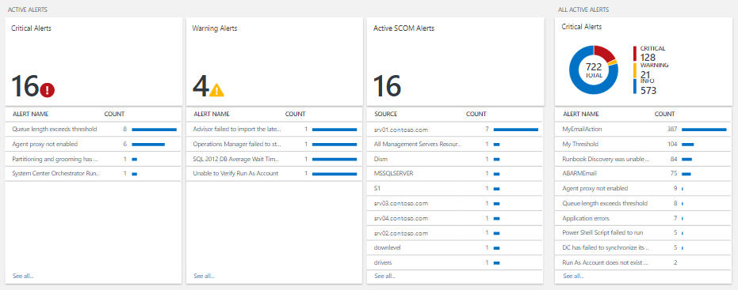

<properties
   pageTitle="提醒管理解決方案中作業管理套件 (OMS) |Microsoft Azure"
   description="提醒管理解決方案中記錄分析可協助您分析所有您的環境中的警示。  除了 OMS 中所產生的通知，將其匯入通知從連線的是系統管理中心的作業管理員 (SCOM) 管理群組記錄分析。"
   services="log-analytics"
   documentationCenter=""
   authors="bwren"
   manager="jwhit"
   editor="tysonn" />
<tags
   ms.service="operations-management-suite"
   ms.devlang="na"
   ms.topic="article"
   ms.tgt_pltfrm="na"
   ms.workload="infrastructure-services"
   ms.date="10/06/2016"
   ms.author="bwren" />

# 通知管理解決方案中作業管理套件 (OMS)

![管理通知] 圖示](media/log-analytics-solution-alert-management/icon.png) 通知管理方案可協助您分析所有您的環境中的警示。  除了 OMS 中所產生的通知，將其匯入通知從連線的是系統管理中心的作業管理員 (SCOM) 管理群組記錄分析。  在環境中使用多個管理群組，提醒管理解決方案會提供所有的管理群組的提醒合併的檢視。

## 必要條件

- 若要匯入是 SCOM 通知，此方案需要 OMS 工作區與使用[連線至記錄分析的 Operations Manager](log-analytics-om-agents.md)所述的程序的是 SCOM 管理群組之間的連線。  

## 設定

新增提醒管理解決方案到使用中[新增解決方案](log-analytics-add-solutions.md)所述的程序 OMS 工作區。  有不需要進行其他設定。

## 管理組件

如果您是 SCOM 管理群組連線到您 OMS 工作區，然後下列管理組件將會安裝中是 SCOM 當您新增此方案。  沒有任何設定或的必要這些管理組件進行的維修作業。  

- Microsoft 系統管理中心顧問通知管理 (Microsoft.IntelligencePacks.AlertManagement)

如需有關解決方案管理套件的更新方式的詳細資訊，請參閱[連線至記錄分析的 Operations Manager](log-analytics-om-agents.md)。

## 資料收集

### 代理程式

下表說明此方案所支援的連線的來源。

| 連線的來源 | 支援 | 描述 |
|:--|:--|:--|
| [Windows 代理程式](log-analytics-windows-agents.md) | 無 | 直接在 Windows 代理程式不會產生是 SCOM 通知。 |
| [Linux 代理程式](log-analytics-linux-agents.md) | 無 | 直接 Linux 代理程式不會產生是 SCOM 通知。 |
| [是 SCOM 管理群組](log-analytics-om-agents.md) | [是] | 是 SCOM 代理程式會產生的通知傳送至 [管理] 群組中，而且再轉寄給記錄分析。  不需要直接從是 SCOM 代理程式連線到記錄分析。 通知的資料是從管理群組轉寄至 OMS 存放庫。 |
| [Azure 儲存體帳戶](log-analytics-azure-storage.md) | 無 | 是 SCOM 通知不會儲存在 Azure 儲存體帳戶。 |

### 集合頻率

OMS 中所產生的通知，可進行解決方案立即。  通知的資料會傳送是 SCOM 管理群組至記錄分析每 3 分鐘。  

## 使用解決方案

當您新增提醒管理解決方案到 OMS 工作區時，[**管理通知**] 方塊便會新增至您 OMS 儀表板。  此圖磚顯示的計數與目前使用中的通知過去 24 小時內所產生的數字的圖形化表示。  您無法變更此時間範圍。

![管理通知] 磚](media/log-analytics-solution-alert-management/tile.png)

按一下 [**提醒管理**] 方塊，以開啟 [**通知管理**儀表板。  儀表板包含下列表格中的欄。  每個資料行清單上方的十個通知來計算符合指定的範圍和時間範圍內的資料行的準則。  您可以執行記錄搜尋提供整個清單，即可**查看所有**資料行的底部，或按一下資料行標頭。

| 資料行| 描述 |
|:--|:--|
| 要徑的通知 | 所有的要徑分組警示名稱嚴重性通知。  按一下要執行傳回該警示的所有記錄的記錄檔搜尋提醒名稱。 |
| 警告通知 | 所有的警告分組警示名稱嚴重性通知。  按一下要執行傳回該警示的所有記錄的記錄檔搜尋提醒名稱。 |
| 使用的是 SCOM 通知 | 所有使用的是 SCOM 通知狀態不是*已關閉*來源產生提醒的分組。 |
| 所有使用中的通知 | 分組警示名稱任何嚴重性的所有通知。 只包含*已關閉*以外的任何狀態是 SCOM 通知。|

如果您向右捲動時，儀表板會列出幾個常見的查詢，您可以按一下通知資料執行[記錄搜尋](log-analytics-log-searches.md)。

## 搜尋範圍和時間範圍

根據預設，分析提醒管理解決方案的警示範圍是從產生過去 7 天內的所有連線的管理群組。  

- 若要變更分析中包含的管理群組，按一下 [儀表板頂端的**範圍**]。  您可以選擇所有連線的管理群組的**全域**或**來管理群組**，若要選取單一管理群組]。

- 若要變更的提醒的時間範圍，請選取儀表板頂端的 [**基礎的資料**。  您可以選取過去 7 天，1 天或 6 小時內所產生的通知。  或者，您可以指定自訂日期範圍、 選取**自訂**。

## 記錄狀況分析

提醒管理解決方案分析任何記錄類型的**通知**。  它也會從是 SCOM 匯入通知，並建立各有一種**通知**，SourceSystem **OpsManager**的相對應的記錄。  這些記錄下表中包含的內容。  

| 屬性 | 描述 |
|:--|:--|
| 類型 | *提醒* |
| SourceSystem | *OpsManager* |
| AlertContext | 警示中的 XML 格式會產生資料項目的詳細資訊。 |
| AlertDescription | 提醒詳細的描述。 |
| AlertId | GUID 的提醒。 |
| AlertName | 提醒的名稱。 |
| AlertPriority | 提醒優先順序層級。 |
| AlertSeverity | 提醒的重要性層級。 |
| AlertState | 最新的解析度狀態的警示。 |
| LastModifiedBy | 上次修改提醒的使用者名稱。 |
| ManagementGroupName | 提醒產生的位置管理群組的名稱。 |
| RepeatCount | 數相同的提醒產生的相同時間自解決監視物件。 |
| ResolvedBy | 解決提醒的使用者名稱。 清空如果提醒尚未解析。 |
| SourceDisplayName | 產生提醒的監控物件的顯示名稱。 |
| SourceFullName | 產生提醒的監控物件的完整名稱。 |
| TicketId | 如果是 SCOM 環境整合指派票證通知的處理程序的票證識別碼。  空白的沒有票證會被指派識別碼。 |
| TimeGenerated | 日期及建立提醒的時間。 |
| TimeLastModified | 日期及上次變更提醒的時間。 |
| TimeRaised | 日期及時間產生提醒。 |
| TimeResolved | 日期及解決提醒的時間。 清空如果提醒尚未解析。 |

## 範例記錄搜尋

下表提供範例記錄搜尋提醒此方案所收集到的記錄。  

| 查詢 | 描述 |
|:--|:--|
| 輸入 = 通知 SourceSystem = OpsManager AlertSeverity = 錯誤 TimeRaised > 現在 24 小時 | 過去 24 小時的時間期間引發的要徑通知 |
| 輸入 = 通知 AlertSeverity = 警告 TimeRaised > 現在 24 小時 | 過去 24 小時的時間期間引發的警告通知  |
| 輸入 = 通知 SourceSystem = OpsManager AlertState ！ = 關閉的 TimeRaised > 現在 24 小時制及 #124;為 SourceDisplayName 來計算量值 count （) | 使用期間過去 24 小時引發作用中的通知 |
| 輸入 = 通知 SourceSystem = OpsManager AlertSeverity = 錯誤 TimeRaised > 現在 24 小時制 AlertState ！ = 已關閉 | 乘冪期間過去 24 小時會仍在使用中的要徑通知 |
| 輸入 = 通知 SourceSystem = OpsManager TimeRaised > 現在 24 小時制 AlertState = 關閉 | 過去 24 小時的現在關閉期間引發的通知 |
| 輸入 = 通知 SourceSystem = OpsManager TimeRaised > 現在-1 天 & #124;為 AlertSeverity 來計算量值 count （) | 乘冪期間分組嚴重性過去 1 天的通知 |
| 輸入 = 通知 SourceSystem = OpsManager TimeRaised > 現在-1 天 & #124;排序 RepeatCount 遞減 | 依其重複次數值排序過去 1 天期間引發的通知 |

## 後續步驟

- 深入了解[記錄分析的警示](log-analytics-alerts.md)，如從記錄分析產生通知的詳細資訊。
