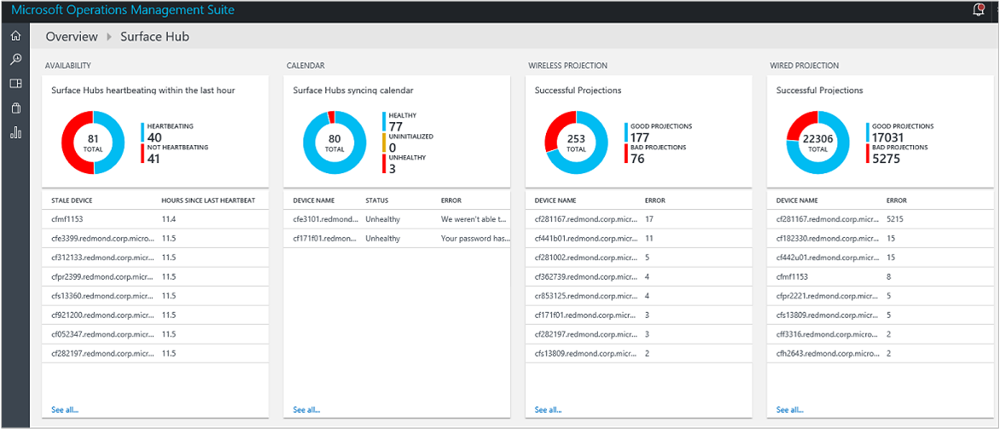

<properties
    pageTitle="監視與記錄分析曲面集線器 |Microsoft Azure"
    description="使用追蹤您曲面圖集線器的狀況，並瞭解如何在使用曲面圖中心解決方案。"
    services="log-analytics"
    documentationCenter=""
    authors="bandersmsft"
    manager="jwhit"
    editor=""/>

<tags
    ms.service="log-analytics"
    ms.workload="na"
    ms.tgt_pltfrm="na"
    ms.devlang="na"
    ms.topic="article"
    ms.date="08/11/2016"
    ms.author="banders"/>

# 監視器曲面集線器與記錄狀況分析

本文將說明如何使用曲面圖中心解決方案中記錄分析監控 Microsoft 曲面圖中心裝置與 Microsoft 作業管理套件 (OMS)。 記錄檔分析可協助您追蹤您曲面圖集線器的狀況，以及瞭解如何在使用。

每個曲面圖中心有 Microsoft 監控安裝代理程式。 其透過您可以傳送資料從您曲面圖中心以 OMS 代理程式。 讀取您曲面圖集線器與記錄檔]，然後會傳送至 OMS 服務。 問題伺服器離線，行事曆未同步，或如果裝置帳戶無法登入 Skype 所示 OMS 曲面圖中心儀表板中。 使用儀表板中的資料，您可以找出的裝置沒有執行，或的時發生其他問題，而可能套用偵測到問題的修正。

## 安裝及設定解決方案

安裝和設定方案，請使用下列資訊。 如要管理您的介面集線器從 Microsoft 作業管理套件 (OMS)，您會需要下列項目︰

- [OMS](http://www.microsoft.com/oms)有效訂閱。
- 您想要監視將支援的裝置[OMS 訂閱](https://azure.microsoft.com/pricing/details/log-analytics/)層級。 OMS 價格異多少裝置註冊，及資料量，處理程序。 您需要考慮這一點規劃曲面圖中心範圍時。

接下來，您會將 OMS 訂閱新增至您現有的 Microsoft Azure 訂閱，或建立新的工作區直接透過 OMS 入口網站。 [開始使用記錄分析](log-analytics-get-started.md)位於使用任何一種方法的詳細的指示。 一旦 OMS 訂閱設定時，有兩種方式註冊曲面圖中心裝置︰

- 自動透過 InTune
- 手動透過曲面圖中心裝置上的**設定**。

## 設定監控

您可以監視健康狀況與 OMS 中使用記錄分析曲面圖中心的活動。 使用 InTune，或在本機使用曲面圖中心**] 設定**，您可以註冊 OMS 中的 [介面] 中心。

## 連接到 InTune OMS 曲面集線器

您需要的工作區 ID 與工作區金鑰管理您的介面集線器 OMS 工作區。 您可以取得這些從 OMS 入口網站。

InTune 是 Microsoft 產品，可讓您集中管理套用至一或多個裝置的 OMS 組態設定。 請遵循下列步驟，設定您的裝置，透過 InTune:

1. 登入 InTune。
2. 瀏覽至 [**設定** > **連線來源**。
3. 建立或編輯曲面圖中心範本為基礎的原則。
4. 瀏覽至 [OMS （Azure 操作的深入見解）] 區段的原則，並將*工作區 ID*和*工作區鍵*加入原則。
5. 儲存原則。
6. 關聯的裝置適當的群組原則。

  

InTune 然後同步 OMS 設定，使用目標群組中，您 OMS 工作區中註冊其裝置。

## 曲面圖集線器連線至 OMS 使用設定應用程式

您需要的工作區 ID 與工作區金鑰管理您的介面集線器 OMS 工作區。 您可以取得這些從 OMS 入口網站。

如果您沒有使用 InTune 來管理您的環境，您可以註冊手動裝置上每個曲面圖中樞的**設定**︰

1. 從您曲面圖] 中心上，開啟 [**設定**]。
2. 輸入當畫面提示您的裝置管理員認證。
3. 按一下 [**此裝置**，並**監控**，按一下 [**設定 OMS 設定**]。
4. 選取 [**啟用監控**。
6. 在 [OMS 設定] 對話方塊中，輸入**工作區識別碼**，再輸入**工作區鍵**。  
  
7. 按一下**[確定**] 完成設定。

出現確認訊息會告訴您 OMS 設定已順利套用至裝置。 如果是，則會顯示訊息代理程式成功連線至 OMS 服務。 裝置便會開始傳送資料至 OMS，您可以在此檢視，並在其上執行動作。

## 監視器曲面集線器

監控您的介面集線器使用 OMS 很像監控其他註冊的裝置。

1. 登入 OMS 入口網站。
2. 瀏覽至曲面圖中心解決方案套件儀表板。
3. 會顯示您裝置的狀況。

  

您可以建立根據現有或自訂的記錄檔搜尋的[通知](log-analytics-alerts.md)。 使用 OMS 會從您的介面集線器的資料，您可以搜尋問題和通知的條件來定義您的裝置。

## 後續步驟

- 您可以使用[記錄分析中的記錄檔搜尋](log-analytics-log-searches.md)來檢視曲面圖中心的詳細的資料。
- 建立與您的介面集線器發生問題時通知您的[通知](log-analytics-alerts.md)。
