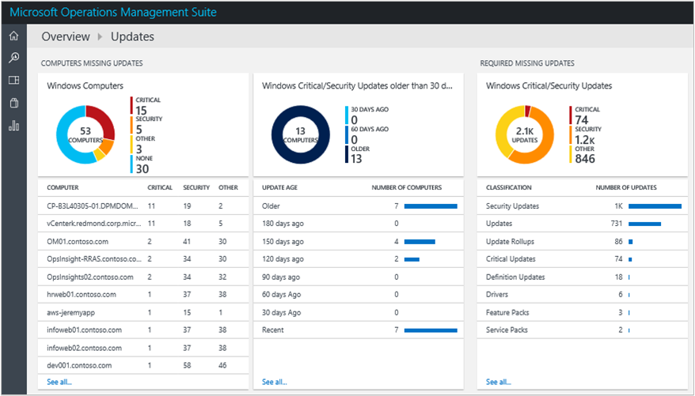

<properties
    pageTitle="在記錄檔分析系統更新評估方案 |Microsoft Azure"
    description="您可以使用系統更新解決方案中記錄分析，可協助您將遺失更新套用至您的基礎結構中的伺服器。"
    services="log-analytics"
    documentationCenter=""
    authors="bandersmsft"
    manager="jwhit"
    editor=""/>

<tags
    ms.service="log-analytics"
    ms.workload="na"
    ms.tgt_pltfrm="na"
    ms.devlang="na"
    ms.topic="article"
    ms.date="08/11/2016"
    ms.author="banders"/>

# 在記錄檔分析系統更新評估方案

您可以使用系統更新解決方案中記錄分析，可協助您將遺失更新套用至您的基礎結構中的伺服器。 安裝解決方案之後，您可以檢視使用 OMS 中的 [**概觀**] 頁面上的 [**系統更新評估**] 方塊會遺失您受監控伺服器的更新。

如果找到遺失的更新，**更新**儀表板上顯示詳細資料。 您可以使用 [**更新**儀表板使用遺漏的更新及開發計劃以將其套用到需要的伺服器。

## 安裝及設定解決方案
安裝和設定方案，請使用下列資訊。

- 新增到使用中[新增記錄分析解決方案從方案庫](log-analytics-add-solutions.md)所述的程序 OMS 工作區系統更新評估解決方案。  有不需要進行其他設定。

## 系統更新資料集合詳細資料

系統更新評估會使用您已啟用的代理程式的中繼資料和狀態資料。

下表顯示資料集合方法和其他詳細資料的系統更新評估會收集的資料。

| 平台 | 直接代理程式 | 是 SCOM 代理程式 | Azure 儲存體 | 必要時，是 SCOM 嗎？ | 透過管理群組傳送是 SCOM 代理程式的資料 | 集合頻率 |
|---|---|---|---|---|---|---|
|Windows|![[是]](./media/log-analytics-system-update/oms-bullet-green.png)|![[是]](./media/log-analytics-system-update/oms-bullet-green.png)||            |![[是]](./media/log-analytics-system-update/oms-bullet-green.png)| 至少 2 乘以每日] 及 [安裝更新後的 15 分鐘|

下表顯示由系統更新評估收集的資料類型的範例︰

|**資料類型**|**欄位**|
|---|---|
|中繼資料|BaseManagedEntityId、 ObjectStatus、 OrganizationalUnit、 ActiveDirectoryObjectSid、 PhysicalProcessors、 NetworkName、 IPAddress、 ForestDNSName、 NetbiosComputerName、 VirtualMachineName、 LastInventoryDate、 HostServerNameIsVirtualMachine、 IP 位址、 NetbiosDomainName、 LogicalProcessors、 DNSName、 顯示名稱、 DomainDnsName、 ActiveDirectorySite、 PrincipalName、 OffsetInMinuteFromGreenwichTime|
|狀態|StateChangeEventId、 StateId、 NewHealthState、 OldHealthState、 內容、 TimeGenerated、 TimeAdded、 StateId2、 BaseManagedEntityId、 MonitorId、 HealthState、 上次修改、 LastGreenAlertGenerated、 DatabaseTimeModified|

### 若要使用的更新

1. 在 [**概觀**] 頁面上，按一下 [**系統更新評估**磚。  
    
2. **更新**儀表板上檢視更新類別。  
    
3. 捲動到右邊的頁面檢視**Windows 要徑/安全性更新**刀，然後按一下 [**分類**下的 [**安全性更新**。  
    
4. 在記錄檔搜尋頁面上，各種不同的資訊會顯示相關的安全性更新，在基礎結構發現遺失的伺服器。 按一下**清單**以檢視有關更新的詳細的資訊。  
    
5. 在 [搜尋記錄] 頁面會顯示每個更新的詳細的資訊。 編號數字、 旁按一下 [**檢視**]，檢視 Microsoft 支援網站上的對應的文件]。  
    
6. 網頁瀏覽器開啟 Microsoft 支援網頁，更新為新的索引標籤中。 檢視未更新的相關資訊。  
    
7. 使用資訊您找到，您可以建立計劃以手動套用遺失的更新，或您可以繼續其餘的步驟會自動套用 [更新追蹤。
8. 如果您想要自動套用 [遺失的更新，請返回 [**更新**儀表板，然後按一下 [**更新就會執行**的 [**按一下以排程執行的更新**。  
    ![更新就會執行-[排程] 索引標籤](./media/log-analytics-system-update/sys-updates07.png)
9. **更新執行**在頁面上 [**排程**] 索引標籤上，按一下 [**新增**]，以建立新的更新執行。  
    ![排程] 索引標籤-新增](./media/log-analytics-system-update/sys-updates08.png)
10. 在**新的更新執行**頁面上，輸入 [執行更新的名稱，新增個別的電腦或電腦群組定義的排程，再按一下**儲存**。  
    
11. [**排程**] 索引標籤上新的更新執行的 [**更新執行**頁面會顯示您已進行排程。  
    ![排程] 索引標籤](./media/log-analytics-system-update/sys-updates10.png)
12. 更新執行啟動時，您會看到資訊，請在 [**執行**] 索引標籤上。  
    ![執行] 索引標籤](./media/log-analytics-system-update/sys-updates11.png)
13. 執行更新完成之後，[**已完成**] 索引標籤會顯示狀態。
14. 如果更新已套用更新執行，請在**Windows 的要徑/安全性更新**刀中，您會看到更新數目會減少。  
    

## 後續步驟

- 若要檢視詳細的系統更新資料[搜尋記錄](log-analytics-log-searches.md)。
