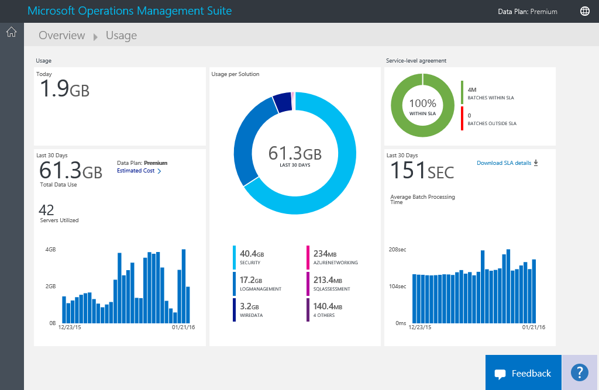

<properties
    pageTitle="分析中記錄分析的資料使用 |Microsoft Azure"
    description="您可以使用記錄分析中使用頁面檢視 OMS 服務傳送的資料量。"
    services="log-analytics"
    documentationCenter=""
    authors="bandersmsft"
    manager="jwhit"
    editor=""/>

<tags
    ms.service="log-analytics"
    ms.workload="na"
    ms.tgt_pltfrm="na"
    ms.devlang="na"
    ms.topic="get-started-article"
    ms.date="08/11/2016"
    ms.author="banders"/>

# 分析中記錄分析的資料使用方式

記錄檔分析作業管理套件 (OMS) 中收集的資料，並將其定期傳送 OMS 服務。  若要檢視的資料量正在傳送給 OMS 服務，您可以使用 [**使用狀況**] 頁面。 **使用**頁面也會顯示您的資料量傳送每天的方案，您的伺服器頻率傳送資料。

>[AZURE.NOTE] 如果您有使用[OMS 網站](http://www.microsoft.com/oms)建立的免費的帳戶，您會限制您每日 OMS 服務傳送 500 MB 的資料。 如果您到達每日的限制，資料分析會停止，且繼續下一天的開頭。 您也需要重新傳送任何不接受或由 OMS 處理資料。

您可以利用 OMS 的**概觀**儀表板上的 [**使用方式**] 方塊來檢視您的使用方式。

![使用狀況] 磚](./media/log-analytics-usage/usage-tile.png)

如果您有超過每日使用限制，或如果您是靠近您的限制，您可以選擇性地移除解決方案，若要減少您傳送至 OMS 服務的資料。 如需有關如何移除解決方案的詳細資訊，請參閱[從方案庫新增記錄分析解決方案](log-analytics-add-solutions.md)。

[**使用狀況**] 頁面會顯示下列資訊︰

- 每日平均使用量
- 資料使用的每個方案過去 30 天
- 您的環境中的伺服器的資料量 OMS 服務傳送過去 30 天
- 價格層和估計的成本資料計劃
- 包括 OMS 處理您的資料所需的時間您服務等級協定 (SLA)，相關資訊

## 若要使用的使用情況資料

1. 在 [**概觀**] 頁面中，按一下 [**使用方式**] 方塊。
2. 在 [**使用狀況**] 頁面上檢視顯示區域您擔心使用類別目錄。
3. 如果您正在使用的您每日的上傳配額太多的方案，建議您移除該方案。

## 若要檢視您的估計的成本和帳單資訊
1. 在 [**概觀**] 頁面中，按一下 [**使用方式**] 方塊。
2. 按一下 [**使用情況**下的 [**使用方式**] 頁面上的 [> 形箭號 (**>**) 旁**估計成本**。
3. 展開的**資料計劃**的詳細資訊，您可以看到您估計每月費用。  
    
4. 如果您要檢視您的付款資訊，請按一下 [**檢視帳單**若要檢視您的訂閱資訊。
    - 在 [訂閱] 頁面上，按一下您的訂閱，若要檢視詳細資料] 與 [明細項目清單的使用方式。  
        
    - 在 [訂閱的 [摘要] 頁面中，您可以執行各種工作，可用於管理及檢視您的訂閱的更多詳細資料。  
        

## 若要檢視您 SLA 的資料批次
1. 在 [**概觀**] 頁面中，按一下 [**使用方式**] 方塊。
2. 在**服務等級協定**，按一下 [**下載 SLA 詳細資料**。
3. 您可以檢閱，系統會下載 Excel XLSX 檔案。  
    

## 後續步驟

- 請參閱[記錄搜尋記錄分析中的](log-analytics-log-searches.md)檢視收集解決方案的詳細的資訊。
