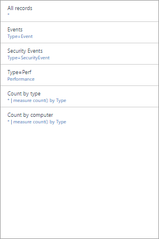

<properties
    pageTitle="登入分析檢視設計工具 |Microsoft Azure"
    description="檢視設計工具中記錄分析，可讓您在 OMS 主控台包含 OMS 存放庫中的資料的不同視覺效果中建立自訂檢視。 本文提供每個視覺效果部分供您在檢視模式中使用的設定的參考。"
    services="log-analytics"
    documentationCenter=""
    authors="bwren"
    manager="jwhit"
    editor=""/>

<tags
    ms.service="log-analytics"
    ms.workload="na"
    ms.tgt_pltfrm="na"
    ms.devlang="na"
    ms.topic="article"
    ms.date="10/20/2016"
    ms.author="bwren"/>

# 登入分析檢視設計工具視覺效果部分參考
檢視設計工具中記錄分析，可讓您在 OMS 主控台包含資料的不同視覺效果從 OMS 存放庫中建立自訂檢視。 本文提供每個視覺效果部分供您在檢視模式中使用的設定的參考。

其他可用的檢視設計工具的文件是︰

- [檢視設計工具](log-analytics-view-designer.md)-檢視設計工具] 和 [建立和編輯自訂檢視的程序的概觀。
- [並排顯示參照](log-analytics-view-designer-tiles.md)-參照的每個並排供您在檢視模式中使用的設定。 

下表說明不同類型的並排檢視設計工具中使用。  下列各節說明每個詳細資料和及其屬性中的並排類型。

| 檢視類型 | 描述 |
|:--|:--|
| [查詢的清單](#list-of-queries-part) | 顯示記錄搜尋查詢的清單。  使用者可以按一下每個查詢來顯示其結果。  |
| [數字與清單](#number-amp-list-part) | 頁首會有單一記錄搜尋查詢的記錄的數字顯示計數。  清單顯示前十個查詢結果的圖形表示相對數值的資料行或其變更一段時間的值。 |
| [兩個的數字與清單](#two-numbers-amp-list-part) | 頁首會有兩個數字，顯示的不同記錄搜尋查詢記錄的計數。  清單顯示前十個查詢結果的圖形表示相對數值的資料行或其變更一段時間的值。 |
| [甜甜圈與清單](#donut-amp-list-part) | 頁首會顯示彙總從記錄查詢中的值] 欄的單一數字。  甜甜圈以圖形方式顯示的頂端的三筆記錄的結果。 |
| [兩個時間表與清單](#two-timelines-amp-list-part) | 頁首會顯示一段時間為直條圖的兩個記錄查詢結果，有圖說文字顯示彙總從記錄查詢中的值] 欄的單一數字。  清單顯示前十個查詢結果的圖形表示相對數值的資料行或其變更一段時間的值。 |   
| [資訊](#information-part) | 頁首顯示靜態文字和選擇性的連結。  清單會顯示具有靜態文字和標題的一或多個項目。 |
| [折線圖、 註標與清單](#line-chart-callout-amp-list-part) | 頁首會顯示含記錄查詢中的多個數列中的折線圖時間和彙總的值圖說文字。  清單顯示前十個查詢結果的圖形表示相對數值的資料行或其變更一段時間的值。 |
| [折線圖及清單](#line-chart-amp-list-part) | 頁首會顯示一段時間記錄查詢中的多個連續折線圖。  清單顯示前十個查詢結果的圖形表示相對數值的資料行或其變更一段時間的值。 |
| [堆疊的線條圖組件](#stack-of-line-charts-part) | 會有記錄查詢中的多個數列的三個不同的線條圖顯示一段時間。 |

## 查詢組件的清單

顯示記錄搜尋查詢的清單。  使用者可以按一下每個查詢來顯示其結果。  檢視會依預設，包含單一的查詢，您可以按一下**+ 查詢**以新增額外的查詢。

| 設定 | 描述 |
|:--|:--|
| **一般** |
| 標題 | 若要檢視的頂端顯示的文字。 |
| 新的群組 | 選取 [開始於目前的檢視] 檢視中建立新的群組。 |
| 預先選取的篩選 | 以逗號分隔包含在左側的篩選] 窗格中，當使用者選取查詢的屬性的清單。 |
| 轉譯模式 | 初始選取查詢時顯示的檢視。  使用者可以將任何可用的檢視選取之後開啟查詢。 |
| **查詢** |
| 搜尋查詢 | 若要執行的查詢。 |
| 好記的名稱 | 若要顯示給使用者的查詢的描述性名稱。 |

## 數字與清單的組件

頁首會有單一記錄搜尋查詢的記錄的數字顯示計數。  清單顯示前十個查詢結果的圖形表示相對數值的資料行或其變更一段時間的值。

| 設定 | 描述 |
|:--|:--|
| **一般** |
| 群組標題 | 若要檢視的頂端顯示的文字。 |
| 新的群組 | 選取 [開始於目前的檢視] 檢視中建立新的群組。 |
| 圖示 | 頁首中的結果旁顯示的圖像檔案。
| 使用圖示 | 選取後，讓圖示顯示。 |
| **標題** |
| 圖例 | 若要顯示在頂端的標題的文字。 |
| 查詢 | 頁首中執行查詢。  將會顯示的查詢所傳回的記錄數目的計數。 |
| **清單** |
| 查詢 | 清單中執行查詢。  在結果中的第一次十個記錄的前兩個屬性隨即出現。  第一個屬性應該文字值及第二個屬性的數值。  列會自動建立根據相對數值的資料行的值。  使用查詢中的 [排序] 命令來排序清單中的記錄。  使用者可以按一下 [查看所有執行查詢傳回的所有記錄。 |
| 隱藏圖形 | 選取 [停用該圖表右邊的數字的資料行。 |
| 啟用走勢圖 | 選取要顯示，而不是水平軸的走勢圖。  如需詳細資訊，請參閱[常見的設定](#sparklines)。 |
| 色彩 | 長條或走勢圖的色彩。 |
| 名稱與值分隔符號 | 如果您想要將多個值剖析 [text] 屬性的單一字元分隔符號。  如需詳細資訊，請參閱[常見的設定](#name-value-separator)。 |
| 瀏覽查詢 | 使用者在清單中選取項目時要執行的查詢。  如需詳細資訊，請參閱[常見的設定](#navigation-query)。 |
| **清單** | **> 欄標題** |
| 名稱 | 若要顯示在頂端的清單] 的第一欄的文字。 |
| 值 | 若要顯示在頂端的清單] 的第二欄的文字。 |
| **清單** | **> 臨界值** |
| 啟用臨界值 | 選取要啟用臨界值。  如需詳細資訊，請參閱[常見的設定](#thresholds)。 |

## 兩個數字與清單組件

頁首會有兩個數字，顯示的不同記錄搜尋查詢記錄的計數。  清單顯示前十個查詢結果的圖形表示相對數值的資料行或其變更一段時間的值。

| 設定 | 描述 |
|:--|:--|
| **一般** |
| 群組標題 | 若要檢視的頂端顯示的文字。 |
| 新的群組 | 選取 [開始於目前的檢視] 檢視中建立新的群組。 |
| 圖示 | 頁首中的結果旁顯示的圖像檔案。
| 使用圖示 | 選取後，讓圖示顯示。 |
| **標題** |
| 圖例 | 若要顯示在頂端的標題的文字。 |
| 查詢 | 頁首中執行查詢。  將會顯示的查詢所傳回的記錄數目的計數。 |
| **清單** |
| 查詢 | 清單中執行查詢。  在結果中的第一次十個記錄的前兩個屬性隨即出現。  第一個屬性應該文字值及第二個屬性的數值。  列會自動建立根據相對數值的資料行的值。  使用查詢中的 [排序] 命令來排序清單中的記錄。  使用者可以按一下 [查看所有執行查詢傳回的所有記錄。 |
| 隱藏圖形 | 選取 [停用該圖表右邊的數字的資料行。 |
| 啟用走勢圖 | 選取要顯示，而不是水平軸的走勢圖。  如需詳細資訊，請參閱[常見的設定](#sparklines)。 |
| 色彩 | 長條或走勢圖的色彩。 |
| 作業 | 若要執行的走勢圖的作業。  如需詳細資訊，請參閱[常見的設定](#sparklines)。 |
| 名稱與值分隔符號 | 如果您想要將多個值剖析 [text] 屬性的單一字元分隔符號。  如需詳細資訊，請參閱[常見的設定](#name-value-separator)。 |
| 瀏覽查詢 | 使用者在清單中選取項目時要執行的查詢。  如需詳細資訊，請參閱[常見的設定](#navigation-query)。 |
| **清單** | **> 欄標題** |
| 名稱 | 若要顯示在頂端的清單] 的第一欄的文字。 |
| 值 | 若要顯示在頂端的清單] 的第二欄的文字。 |
| **清單** | **> 臨界值** |
| 啟用臨界值 | 選取要啟用臨界值。  如需詳細資訊，請參閱[常見的設定](#thresholds)。 |

## 甜甜圈與清單的組件

頁首會顯示彙總從記錄查詢中的值] 欄的單一數字。  甜甜圈以圖形方式顯示的頂端的三筆記錄的結果。

| 設定 | 描述 |
|:--|:--|
| **一般** |
| 群組標題 | 若要顯示在頂端的磚的文字。 |
| 新的群組 | 選取 [開始於目前的檢視] 檢視中建立新的群組。 |
| 圖示 | 頁首中的結果旁顯示的圖像檔案。 |
| 使用圖示 | 選取後，讓圖示顯示。 |
| **頁首** |
| 標題 | 若要顯示在頂端的標題的文字。
| 副標題 | 若要顯示在頂端的頁首標題下的文字。
| **甜甜圈** |
| 查詢 | 若要執行的甜甜圈查詢。  第一個屬性應該文字值及第二個屬性的數值。 |
| **甜甜圈** |  **> 中心** |
| 文字 | 若要顯示的甜甜圈內的值] 下的文字。 |
| 作業 | 若要合併彙算到單一值的 [值] 屬性上執行的操作。  -總和︰ 新增的所有記錄的值。 -在查詢中的總記錄**中心作業中所使用的結果值**的值傳回記錄百分比︰ 百分比。 |
| 使用管理中心的作業的結果值 | 您也可以按一下加號以新增一或多個值。  查詢的結果會限制您指定的屬性值的記錄。  如果沒有值會新增，查詢中會包含所有記錄。 |
| **其他選項** | **> 色彩** |
| 色彩 1 色彩 2 色彩 3 | 選取每個甜甜圈中顯示之值的色彩。 |
| **其他選項** | **> [進階色彩對應** |
| 欄位值 | 輸入要顯示為不同的色彩，如果甜甜圈中所包含的欄位的名稱。 |
| 色彩 | 選取 [唯一] 欄位的色彩。 |
| **清單** |
| 查詢 | 清單中執行查詢。  將會顯示的查詢所傳回的記錄數目的計數。 |
| 隱藏圖形 | 選取 [停用該圖表右邊的數字的資料行。 |
| 啟用走勢圖 | 選取要顯示，而不是水平軸的走勢圖。  如需詳細資訊，請參閱[常見的設定](#sparklines)。 |
| 色彩 | 長條或走勢圖的色彩。 |
| 作業 | 若要執行的走勢圖的作業。  如需詳細資訊，請參閱[常見的設定](#sparklines)。 |
| 名稱與值分隔符號 | 如果您想要將多個值剖析 [text] 屬性的單一字元分隔符號。  如需詳細資訊，請參閱[常見的設定](#name-value-separator)。 |
| 瀏覽查詢 | 使用者在清單中選取項目時要執行的查詢。  如需詳細資訊，請參閱[常見的設定](#navigation-query)。 |
| **清單** | **> 欄標題** |
| 名稱 | 若要顯示在頂端的清單] 的第一欄的文字。 |
| 值 | 若要顯示在頂端的清單] 的第二欄的文字。 |
| **清單** | **> 臨界值** |
| 啟用臨界值 | 選取要啟用臨界值。  如需詳細資訊，請參閱[常見的設定](#thresholds)。 |

## 兩個時間表與清單的組件

頁首會顯示一段時間為直條圖的兩個記錄查詢結果，有圖說文字顯示彙總從記錄查詢中的值] 欄的單一數字。  清單顯示前十個查詢結果的圖形表示相對數值的資料行或其變更一段時間的值。

| 設定 | 描述 |
|:--|:--|
| **一般** |
| 群組標題 | 若要顯示在頂端的磚的文字。 |
| 新的群組 | 選取 [開始於目前的檢視] 檢視中建立新的群組。 |
| 圖示 | 頁首中的結果旁顯示的圖像檔案。 |
| 使用圖示 | 選取後，讓圖示顯示。 |
| **第一次圖表 第二個圖表** |
| 圖例 | 若要顯示於] 下的第一個數列註標的文字。 |
| 色彩 | 使用一系列中的資料行的色彩。 |
| 查詢 | 若要執行的第一個數列的查詢。  圖表的直條代表每個時間間隔內的記錄數目的計數。 |
| 作業 | 在 [值] 屬性來合併彙算到單一值的圖說文字上執行的操作。  -總和︰ 加總的所有記錄的值。 從所有記錄之值的平均︰ 平均值。 的在圖表中所包含的最後一個時間間隔最後一個範例︰ 值。 的在圖表中所包含的第一個時間間隔第一個範例︰ 值。 計數︰ 查詢所傳回的所有記錄的計數。|
| **清單** |
| 查詢 | 清單中執行查詢。  將會顯示的查詢所傳回的記錄數目的計數。 |
| 隱藏圖形 | 選取 [停用該圖表右邊的數字的資料行。 |
| 啟用走勢圖 | 選取要顯示，而不是水平軸的走勢圖。  如需詳細資訊，請參閱[常見的設定](#sparklines)。 |
| 色彩 | 長條或走勢圖的色彩。 |
| 作業 | 若要執行的走勢圖的作業。  如需詳細資訊，請參閱[常見的設定](#sparklines)。 |
| 瀏覽查詢 | 使用者在清單中選取項目時要執行的查詢。  如需詳細資訊，請參閱[常見的設定](#navigation-query)。 |
| **清單** | **> 欄標題** |
| 名稱 | 若要顯示在頂端的清單] 的第一欄的文字。 |
| 值 | 若要顯示在頂端的清單] 的第二欄的文字。 |
| **清單** | **> 臨界值** |
| 啟用臨界值 | 選取要啟用臨界值。  如需詳細資訊，請參閱[常見的設定](#thresholds)。 |

## 資訊的組件

頁首顯示靜態文字和選擇性的連結。  清單會顯示具有靜態文字和標題的一或多個項目。

![資訊] 檢視](media/log-analytics-view-designer/view-information.png)

| 設定 | 描述 |
|:--|:--|
| **一般** |
| 群組標題 | 若要顯示在頂端的磚的文字。 |
| 新的群組 | 選取 [開始於目前的檢視] 檢視中建立新的群組。 |
| 色彩 | 頁首的背景色彩。 |
| **頁首** |
| 圖像 | 若要顯示在頁首中的圖像檔案。 |
| 標籤 | 在頁首中顯示的文字。 |
| **頁首** | **> 連結** |
| 標籤 | 連結文字。 |
| Url | 連結 Url。 |
| **資訊的項目** |
| 標題 | 若要顯示的每個項目的的標題的文字。 |
| 內容 | 若要顯示每個項目的文字。 |

## 折線圖、 註標與清單組件

頁首會顯示含記錄查詢中的多個數列中的折線圖時間和彙總的值圖說文字。  清單顯示前十個查詢結果的圖形表示相對數值的資料行或其變更一段時間的值。

| 設定 | 描述 |
|:--|:--|
| **一般** |
| 群組標題 | 若要顯示在頂端的磚的文字。 |
| 新的群組 | 選取 [開始於目前的檢視] 檢視中建立新的群組。 |
| 圖示 | 頁首中的結果旁顯示的圖像檔案。 |
| 使用圖示 | 選取後，讓圖示顯示。 |
| **頁首** |
| 標題 | 若要顯示在頂端的標題的文字。 |
| 副標題 | 若要顯示在頂端的頁首標題下的文字。 |
| **折線圖** |
| 查詢 | 折線圖中執行查詢。  第一個屬性應該文字值及第二個屬性的數值。  這通常是使用**量值**關鍵字摘要結果的查詢。  如果查詢所使用的**間隔**關鍵字在 x 座標軸的圖表會使用此時間間隔。  如果查詢不包括**間隔**關鍵字每小時的時間間隔用於 x 軸。 |
| **折線圖** | **> 圖說文字** |
| 圖說文字的標題 | 若要顯示上方的圖說文字值的文字。 |
| 數列名稱 | 若要使用的圖說文字值的數列的屬性值。  如果提供沒有數列，則可從查詢的所有記錄。 |
| 作業 | 在 [值] 屬性來合併彙算到單一值的圖說文字上執行的操作。  從所有記錄之值的平均︰ 平均值。 查詢所傳回的所有記錄的計數計數。 的在圖表中所包含的最後一個時間間隔最後一個範例︰ 值。 的從圖表中所包含的時間間隔最大值︰ 最大值。 的從圖表中所包含的時間間隔最小值︰ 最小值]。 -總和︰ 加總的所有記錄的值。 |
| **折線圖** | **> Y 軸** |
| 使用對數刻度 | 選取要使用對數刻度 y 軸]。 |
| 單位 | 指定查詢所傳回的值的單位。  這項資訊會用來顯示標籤，表示值類型的圖表和轉換的值 （選擇性）。  單位類型指定單位的類別，並定義目前單位輸入值，可供使用。  如果您選取的值，轉換成數值會從目前的單位類型轉換至 [轉換成輸入然後。 |
| 自訂標籤 | 若要顯示為 Y 軸] 旁的單位類型的標籤文字。  如果有不指定任何標籤，會顯示單位類型。 |
| **清單** |
| 查詢 | 清單中執行查詢。  將會顯示的查詢所傳回的記錄數目的計數。 |
| 隱藏圖形 | 選取 [停用該圖表右邊的數字的資料行。 |
| 啟用走勢圖 | 選取要顯示，而不是水平軸的走勢圖。  如需詳細資訊，請參閱[常見的設定](#sparklines)。 |
| 色彩 | 長條或走勢圖的色彩。 |
| 作業 | 若要執行的走勢圖的作業。  如需詳細資訊，請參閱[常見的設定](#sparklines)。 |
| 名稱與值分隔符號 | 如果您想要將多個值剖析 [text] 屬性的單一字元分隔符號。  如需詳細資訊，請參閱[常見的設定](#name-value-separator)。 |
| 瀏覽查詢 | 使用者在清單中選取項目時要執行的查詢。  如需詳細資訊，請參閱[常見的設定](#navigation-query)。 |
| **清單** | **> 欄標題** |
| 名稱 | 若要顯示在頂端的清單] 的第一欄的文字。 |
| 值 | 若要顯示在頂端的清單] 的第二欄的文字。 |
| **清單** | **> 臨界值** |
| 啟用臨界值 | 選取要啟用臨界值。  如需詳細資訊，請參閱[常見的設定](#thresholds)。 |

## 線條的圖表與清單的組件

頁首會顯示一段時間記錄查詢中的多個連續折線圖。  清單顯示前十個查詢結果的圖形表示相對數值的資料行或其變更一段時間的值。

| 設定 | 描述 |
|:--|:--|
| **一般** |
| 群組標題 | 若要顯示在頂端的磚的文字。 |
| 新的群組 | 選取 [開始於目前的檢視] 檢視中建立新的群組。 |
| 圖示 | 頁首中的結果旁顯示的圖像檔案。 |
| 使用圖示 | 選取後，讓圖示顯示。 |
| **頁首** |
| 標題 | 若要顯示在頂端的標題的文字。 |
| 副標題 | 若要顯示在頂端的頁首標題下的文字。 |
| **折線圖** |
| 查詢 | 折線圖中執行查詢。  第一個屬性應該文字值及第二個屬性的數值。  這通常是使用**量值**關鍵字摘要結果的查詢。  如果查詢所使用的**間隔**關鍵字在 x 座標軸的圖表會使用此時間間隔。  如果查詢不包括**間隔**關鍵字每小時的時間間隔用於 x 軸。 |
| **折線圖** | **> Y 軸** |
| 使用對數刻度 | 選取要使用對數刻度 y 軸]。 |
| 單位 | 指定查詢所傳回的值的單位。  這項資訊會用來顯示標籤，表示值類型的圖表和轉換的值 （選擇性）。  單位類型指定單位的類別，並定義目前單位輸入值，可供使用。  如果您選取的值，轉換成數值會從目前的單位類型轉換至 [轉換成輸入然後。 |
| 自訂標籤 | 若要顯示為 Y 軸] 旁的單位類型的標籤文字。  如果有不指定任何標籤，會顯示單位類型。 |
| **清單** |
| 查詢 | 清單中執行查詢。  將會顯示的查詢所傳回的記錄數目的計數。 |
| 隱藏圖形 | 選取 [停用該圖表右邊的數字的資料行。 |
| 啟用走勢圖 | 選取要顯示，而不是水平軸的走勢圖。  如需詳細資訊，請參閱[常見的設定](#sparklines)。 |
| 色彩 | 長條或走勢圖的色彩。 |
| 作業 | 若要執行的走勢圖的作業。  如需詳細資訊，請參閱[常見的設定](#sparklines)。 |
| 名稱與值分隔符號 | 如果您想要將多個值剖析 [text] 屬性的單一字元分隔符號。  如需詳細資訊，請參閱[常見的設定](#name-value-separator)。 |
| 瀏覽查詢 | 使用者在清單中選取項目時要執行的查詢。  如需詳細資訊，請參閱[常見的設定](#navigation-query)。 |
| **清單** | **> 欄標題** |
| 名稱 | 若要顯示在頂端的清單] 的第一欄的文字。 |
| 值 | 若要顯示在頂端的清單] 的第二欄的文字。 |
| **清單** | **> 臨界值** |
| 啟用臨界值 | 選取要啟用臨界值。  如需詳細資訊，請參閱[常見的設定](#thresholds)。 |

## 堆疊的線條圖組件

會有記錄查詢中的多個數列的三個不同的線條圖顯示一段時間。

| 設定 | 描述 |
|:--|:--|
| **一般** |
| 群組標題 | 若要顯示在頂端的磚的文字。 |
| 新的群組 | 選取 [開始於目前的檢視] 檢視中建立新的群組。 |
| 圖示 | 頁首中的結果旁顯示的圖像檔案。 |
| **圖 1 圖表 2 圖表 3** | **> 標頭** |
| 標題 | 若要在圖表的頂端顯示的文字。 |
| 副標題 | 若要顯示 [頂端的 [圖表標題] 底下的文字。 |
| **圖 1 圖表 2 圖表 3** | **折線圖** |
| 查詢 | 折線圖中執行查詢。  第一個屬性應該文字值及第二個屬性的數值。  這通常是使用**量值**關鍵字摘要結果的查詢。  如果查詢所使用的**間隔**關鍵字在 x 座標軸的圖表會使用此時間間隔。  如果查詢不包括**間隔**關鍵字每小時的時間間隔用於 x 軸。 |
| **圖表** | **> Y 軸** |
| 使用對數刻度 | 選取要使用對數刻度 y 軸]。 |
| 單位 | 指定查詢所傳回的值的單位。  這項資訊會用來顯示標籤，表示值類型的圖表和轉換的值 （選擇性）。  單位類型指定單位的類別，並定義目前單位輸入值，可供使用。  如果您選取的值，轉換成數值會從目前的單位類型轉換至 [轉換成輸入然後。 |
| 自訂標籤 | 若要顯示為 Y 軸] 旁的單位類型的標籤文字。  如果有不指定任何標籤，會顯示單位類型。 |

## 一般設定
下列各節說明多個視覺效果的組件的通用的設定。

### <a name="name-value-separator">名稱與值分隔符號</a>
如果您想要剖析 [text] 屬性，從清單中的查詢，將多個值的單一字元分隔符號。  如果您指定的分隔符號，您可以提供相同的分隔符號，在 [名稱] 方塊中以分隔每個欄位的名稱。

例如，請考慮稱為*位置*包含*雷蒙市建置 41* ] 和 [ *Bellevue Building12*等值的屬性。  您可以指定 – 名稱及值分隔符號和*縣/市建置*名稱。  這會將兩個屬性*縣/市*] 和 [*建置*剖析的每個值。 

### <a name="navigation-query">瀏覽查詢</a>
使用者在清單中選取項目時要執行的查詢。  使用*{選取的項目}*包含的語法，使用者選取的項目。

例如，如果查詢*的電腦*] 和 [瀏覽查詢的資料行例如是*{選取的項目}*，查詢*電腦 = 「 我 」*會在使用者選取電腦時執行。  如果功能查詢*類型 = 事件 {選取的項目}*然後查詢*類型 = 事件電腦 = 「 我 」*會執行。

### <a name="sparklines">走勢圖</a>
走勢圖是說明的清單項目值一段時間的小型折線圖。  使用清單的視覺效果組件，您可以選取是否要顯示水平列指出相對數值欄或一段時間表示其值走勢圖的值。

下表說明走勢圖的設定。

| 設定 | 描述 |
|:--|:--|
| 啟用走勢圖 | 選取要顯示，而不是水平軸的走勢圖。 |
| 作業 | 如果您啟用走勢圖，這是要計算走勢圖的值] 清單中的每個屬性上執行的作業。  -最後一個範例︰ 最後一段時間的數列值。 -數列段時間最大值︰ 最大值。 -數列段時間最小值︰ 最小值]。 -總和︰ 加總的值落在該時間間隔的數列。 摘要︰ 使用相同的量值] 命令，為標頭中的查詢。 |

### <a name="thresholds">臨界值</a>
臨界值可讓您可讓您快速的視覺指標，超過特定的值或落在特定範圍內的項目清單中顯示每個項目旁的彩色的圖示。  例如，您無法顯示的綠色圖示，可接受的值，如果該值為警告，指出某範圍內的黃色及紅色的項目它超過錯誤值。

當您啟用臨界值的一部分時，您必須指定一個或多個臨界值。  如果某個項目的值大於閾值與下一個臨界值，則會使用該色彩。  如果項目大於然後最高臨界值，則會設定的色彩。   

每個閾值有一個臨界值的**預設**值。  這是設定如果超過沒有其他值的色彩。  您可以新增或移除臨界值即可**+**或 [ **x** ] 按鈕。

下表說明 tresholds 的設定。

| 設定 | 描述 |
|:--|:--|
| 啟用臨界值 | 選取左邊的每個值，指出其相對於指定臨界值的健康情況顯示色彩圖示。 |
| 名稱 | 若要識別臨界值的名稱。 |
| 閥值 | 臨界值的值。  每個清單項目的狀況色彩已設為最高臨界值的項目值超出的色彩。  有一個預設臨界值的色彩如果超過沒有臨界值。 |
| 色彩 | 臨界值的色彩。 |

## 後續步驟

- 瞭解[記錄搜尋](log-analytics-log-searches.md)支援視覺效果部分中的查詢。