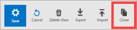

<properties
    pageTitle="登入分析檢視設計工具 |Microsoft Azure"
    description="檢視設計工具中記錄分析，可讓您在 OMS 主控台包含 OMS 存放庫中的資料的不同視覺效果中建立自訂檢視。 本文包含檢視設計工具建立和編輯自訂檢視的程序的概觀。"
    services="log-analytics"
    documentationCenter=""
    authors="bwren"
    manager="jwhit"
    editor=""/>

<tags
    ms.service="log-analytics"
    ms.workload="na"
    ms.tgt_pltfrm="na"
    ms.devlang="na"
    ms.topic="article"
    ms.date="09/27/2016"
    ms.author="bwren"/>

# 記錄檔分析檢視設計工具
檢視設計工具中記錄分析，可讓您在 OMS 主控台包含 OMS 存放庫中的資料的不同視覺效果中建立自訂檢視。 本文包含檢視設計工具建立和編輯自訂檢視的程序的概觀。

其他可用的檢視設計工具的文件是︰

- [並排顯示參照](log-analytics-view-designer-tiles.md)-參照的每個並排供您在檢視模式中使用的設定。 
- [視覺效果部分參照](log-analytics-view-designer-parts.md)-參照的每個並排供您在檢視模式中使用的設定。 

## 概念
檢視以檢視設計工具建立包含下列表格中的項目。

| 組件 | 描述 |
|:--|:--|
| 磚 | 顯示在主要記錄分析概觀儀表板上。  包含視覺摘要的 [自訂] 檢視中所包含的資訊。  不同的磚類型會提供 OMS 存放庫中的記錄其他視覺效果。  按一下磚來開啟 [自訂] 檢視。 |
| 自訂檢視 | 當使用者按下圖磚上顯示。  包含一或多個視覺效果部分。 |
| 視覺效果的組件 | 根據一或多個[記錄搜尋](log-analytics-log-searches.md)OMS 存放庫中的資料視覺效果。  大部分的組件會包含頁首，提供高層級的視覺效果和清單的頂端的結果。  不同的組件型別提供 OMS 存放庫中的記錄其他視覺效果。  按一下組件來執行記錄搜尋提供詳細的記錄中的項目。 |

## 新增至工作區的 [檢視設計工具
在預覽檢視設計工具時，您必須將其新增至您的工作區 OMS 入口網站的 [**設定**] 區段中選取**預覽功能**。

## 建立和編輯檢視

### 建立新的檢視
**檢視設計工具**中的新的檢視開啟，請按一下主 OMS 儀表板中的 [檢視設計工具] 方塊中。

![檢視設計工具] 磚](media/log-analytics-view-designer/view-designer-tile.png)

### 編輯現有的檢視
若要編輯檢視設計工具中的檢視，請按一下其主要 OMS 儀表板中的圖磚上來開啟檢視。  然後按一下 [**編輯**] 按鈕，檢視設計工具中開啟檢視。

### 複製現有檢視
當您複製檢視時，它會建立新的檢視，並檢視設計工具中開啟。  新的檢視會有相同的名稱為與原始 「 複製 」 附加到的結尾。  若要複製檢視，其主要 OMS 儀表板中的圖磚上按一下 [開啟現有檢視。  然後按一下 [開啟檢視以檢視設計工具中的 [**複製**] 按鈕。

### 刪除現有檢視
若要刪除現有的檢視，請按一下其主要 OMS 儀表板中的圖磚上來開啟檢視。  接著按一下 [開啟檢視以檢視設計工具中的 [**編輯**] 按鈕，然後按一下 [**刪除的檢視**。

### 匯出現有檢視
您可以將檢視匯出至 JSON 檔案，您可以匯入另一個工作區，或在[Azure 資源管理員範本](../resource-group-authoring-templates.md)中使用。  若要匯出的現有檢視，請按一下其主要 OMS 儀表板中的圖磚上來開啟檢視。  然後按一下 [**匯出**] 按鈕，在瀏覽器的 [下載] 資料夾中建立的檔案。  檔案的名稱會使用副檔名*omsview*檢視的名稱。

### 匯入現有的檢視
您可以匯入您從另一個管理群組匯出的*omsview*檔案。  若要匯入現有的檢視，請先建立新的檢視。  然後按一下 [**匯入**] 按鈕，然後選取*omsview*檔案。  檔案中的設定將會複製到現有的檢視。

## 使用檢視設計工具
檢視設計工具中有三個窗格。  [**設計**] 窗格代表自訂檢視。  當從 [**控制項**] 窗格中將磚和組件新增至 [**設計**] 窗格即會新增到檢視。  [**屬性**] 窗格會顯示磚或選取的組件的屬性。

### 設定檢視方塊
自訂檢視可以有單一並排顯示。  若要檢視目前的圖或選取其他行事曆的 [**控制項**] 窗格中，選取 [**並排顯示**] 索引標籤。  [**屬性**] 窗格會顯示目前的磚的屬性。  設定[磚參照](log-analytics-view-designer-tiles.md)中的磚內容，根據的詳細資訊，然後按一下 [**套用]**以儲存變更]。

### 設定視覺效果的組件
檢視可以包含視覺效果部分的任何數字。  選取 [**檢視**] 索引標籤，然後視覺效果組件新增至檢視。  [**屬性**] 窗格會顯示選取的組件的屬性。  設定[視覺效果部分參照](log-analytics-view-designer-parts.md)中的檢視內容，根據的詳細資訊，然後按一下 [**套用]**以儲存變更]。

### 刪除視覺效果的組件
按一下 [ **X** ] 按鈕，在右上角的組件中，您可以從檢視移除視覺效果的一部分。

### 重新排列視覺效果的組件
檢視只能有一列的視覺效果的組件。  重新排列檢視中現有的組件，只要按一下並拖曳至新的位置。

## 後續步驟

- 新增至您的自訂檢視的[方塊](log-analytics-view-designer-tiles.md)。
- 將[視覺效果的組件](log-analytics-view-designer-parts.md)新增至您的自訂檢視。
