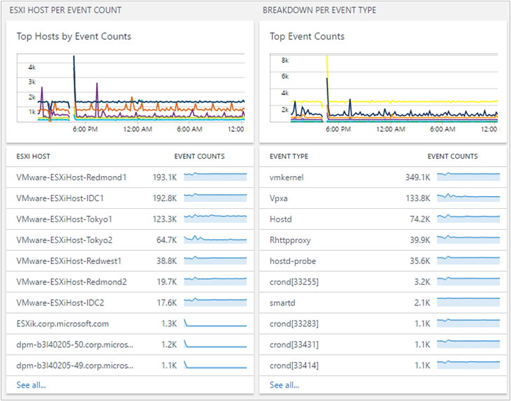

<properties
    pageTitle="記錄檔分析 VMware 監控解決方案 |Microsoft Azure"
    description="深入了解如何 VMware 監控方案可協助管理記錄，並監控 ESXi 主機。"
    services="log-analytics"
    documentationCenter=""
    authors="bandersmsft"
    manager="jwhit"
    editor=""/>

<tags
    ms.service="log-analytics"
    ms.workload="na"
    ms.tgt_pltfrm="na"
    ms.devlang="na"
    ms.topic="article"
    ms.date="10/28/2016"
    ms.author="banders"/>

# <a name="vmware-monitoring-preview-solution-in-log-analytics"></a>在記錄檔分析 VMware 監控 （預覽版本） 的解決方案

記錄檔分析 VMware 監控解決方案是解決方案，可協助您建立的集中的記錄與監視大型 VMware 記錄的方法。 本文將說明如何疑難排解、 擷取並管理 ESXi 主機，在單一位置使用方案。 解決方案，您可以看到您所有的單一位置的 ESXi 主機的詳細的資料。 您可以看到上方的事件計數、 狀態及 VM 和 ESXi 主機透過 ESXi 主機記錄所提供的趨勢。 您可以檢視及搜尋集中的 ESXi 主機記錄進行疑難排解。 然後，您可以建立記錄檔搜尋查詢為基礎的通知。

方案使用 ESXi 主機推入資料至目標 VM，具有 OMS 代理程式的原生系統功能。 不過，方案不寫入檔案系統中的目標 VM。 OMS 代理程式會開啟連接埠 1514年與此接聽。 後收到的資料，OMS 代理程式將 OMS 資料。

## <a name="installing-and-configuring-the-solution"></a>安裝及設定解決方案

安裝和設定方案，請使用下列資訊。

- 新增到使用中[新增記錄分析解決方案從方案庫](log-analytics-add-solutions.md)所述的程序 OMS 工作區 VMware 監控解決方案。

#### <a name="supported-vmware-esxi-hosts"></a>支援的 VMware ESXi 主機
vSphere ESXi 主機 5.5 和 6.0

#### <a name="prepare-a-linux-server"></a>準備 Linux 伺服器
建立 Linux 作業系統 VM 從 ESXi 主機收到系統的所有資料。 [OMS Linux 代理程式](log-analytics-linux-agents.md)是所有 ESXi 主機系統資料集合點。 您可以使用多個 ESXi 主機轉寄到單一 Linux 伺服器，如下列範例所示的記錄。  

   

### <a name="configure-syslog-collection"></a>設定系統集合

1. 設定 VSphere 系統轉寄功能。 可協助您設定系統轉寄功能的詳細資訊，請參閱[ESXi 上設定系統 5.x 和 6.0 (2003322)](https://kb.vmware.com/selfservice/microsites/search.do?language=en_US&cmd=displayKC&externalId=2003322)。 移至 [ **ESXi 主機設定** > **軟體** > **進階設定** > **系統**。
    

2. 在 [ *Syslog.global.logHost* ] 欄位中，新增您的 Linux 伺服器和連接埠號碼*1514年*。 例如，`tcp://hostname:1514`或`tcp://123.456.789.101:1514`

3. 開啟系統的 ESXi 主機防火牆。 **ESXi 主機設定** > **軟體** > **安全性設定檔** > **防火牆**，再開啟**內容**。  

      

      

4. 核取 vSphere 主控台] 以確認該系統正確地設定妥當。 確認 ESXI 主機上的連接埠**1514年**設定。

5. 使用以測試 Linux 伺服器與 ESXi 主機之間的連線`nc`ESXi 主機上的命令。 例如︰

    ```
    [root@ESXiHost:~] nc -z 123.456.789.101 1514
    Connection to 123.456.789.101 1514 port [tcp/*] succeeded!
    ```

6. 下載並安裝 OMS 代理程式版 Linux Linux 伺服器上。 如需詳細資訊，請參閱[Linux OMS 代理程式的文件](https://github.com/Microsoft/OMS-Agent-for-Linux)。

7. 安裝 Linux OMS 代理程式之後，請移至 /etc/opt/microsoft/omsagent/sysconf/omsagent.d 目錄，然後 vmware_esxi.conf 將檔案複製 /etc/opt/microsoft/omsagent/conf/omsagent.d 目錄，並變更的擁有者/群組及權限的檔案。 例如︰

    ```
    sudo cp /etc/opt/microsoft/omsagent/sysconf/omsagent.d/vmware_esxi.conf /etc/opt/microsoft/omsagent/conf/omsagent.d
sudo chown omsagent:omiusers /etc/opt/microsoft/omsagent/conf/omsagent.d/vmware_esxi.conf
    ```

8.  重新啟動後，OMS 代理程式 Linux 執行`sudo /opt/microsoft/omsagent/bin/service_control restart`。

9. 在 OMS 入口網站執行記錄搜尋`Type=VMware_CL`。 當 OMS 收集系統資料時，它會保留系統格式。 在入口網站中會擷取某些特定欄位，例如*主機名稱*和*ProcessName*。  

      

    檢視記錄檔搜尋結果會類似於上方的圖片，如果您是將其設定為使用 OMS VMware 監控解決方案儀表板。  

## <a name="vmware-data-collection-details"></a>VMware 集合詳細資料

VMware 監控方案會從您已啟用的 Linux 使用 OMS 代理程式的 ESXi 主機收集各種效能指標和記錄資料。

下表顯示資料集合方法和其他詳細資料收集的方式。

| 平台 | Linux OMS 代理程式 | 是 SCOM 代理程式 | Azure 儲存體 | 必要時，是 SCOM 嗎？ | 透過管理群組傳送是 SCOM 代理程式的資料 | 集合頻率 |
|---|---|---|---|---|---|---|
|Linux|![[是]](./media/log-analytics-vmware/oms-bullet-green.png)|||            || 每 3 分鐘|


下表顯示 VMware 監控方案所收集的資料欄位的範例︰

| 欄位名稱 | 描述 |
| --- | --- |
| Device_s| VMware 存放裝置 |
| ESXIFailure_s | 錯誤類型 |
| EventTime_t | 事件發生時間 |
| HostName_s | ESXi 主機名稱 |
| Operation_s | 建立 VM 或刪除 VM |
| ProcessName_s | 事件名稱 |
| ResourceId_s | VMware 主機名稱 |
| ResourceLocation_s | VMware |
| ResourceName_s | VMware |
| ResourceType_s | Hyper-v |
| SCSIStatus_s | VMware SCSI 狀態 |
| SyslogMessage_s | 系統資料 |
| UserName_s | 建立或刪除 VM 使用者 |
| VMName_s | VM 名稱 |
| 電腦 | host （主機） 的電腦 |
| TimeGenerated | 資料所產生的時間 |
| DataCenter_s | VMware 資料中心 |
| StorageLatency_s | 儲存延遲 （毫秒） |

## <a name="vmware-monitoring-solution-overview"></a>VMware 監控解決方案概觀

VMware 方塊會出現在 OMS 入口網站。 會提供任何失敗的高層級檢視。 當您按一下磚時，您會移至 [儀表板檢視中。


#### <a name="navigate-the-dashboard-view"></a>瀏覽儀表板檢視

在**VMware**儀表板檢視中，以組織刀︰

- 失敗狀態計數
- 依據 [Event 上方主機字數統計
- 上方的事件計數
- 虛擬機器活動
- ESXi 主磁碟事件


按一下 [開啟記錄分析搜尋窗格中顯示特定刀的詳細的資訊的任何刀]。

從這裡開始，您可以編輯搜尋查詢加以修改特定項目。 在 OMS 搜尋的基本概念的教學課程，請參閱[OMS 記錄搜尋教學課程。](log-analytics-log-searches.md)

#### <a name="find-esxi-host-events"></a>尋找 ESXi 主事件

單一 ESXi 主機會產生多個記錄檔，根據其程序。 VMware 監控解決方案集中它們，並摘要列出事件計數。 此集中式的檢視可協助您瞭解哪些 ESXi 主機有大量事件，以及您的環境中最常發生什麼事件。



您可以向切入進一步即可 ESXi 主機] 或 [事件類型。

當您按一下 ESXi 主機名稱時，您可以檢視 ESXi 裝載的資訊。 如果您想要縮小結果與事件類型，新增`“ProcessName_s=EVENT TYPE”`在搜尋中。 您可以搜尋篩選器中選取**ProcessName** 。 縮小您的資訊。


#### <a name="find-high-vm-activities"></a>尋找高 VM 活動

您可以建立及刪除任何 ESXi 主機上虛擬機器。 很有幫助以找出多少 Vm ESXi 主機建立系統管理員。 瞭解效能與容量計劃的依次，幫助。 管理您的環境時，追蹤的 VM 活動事件很重要。


如果您想要查看其他 ESXi 主機 VM 建立資料，請按一下 [ESXi 主機名稱]。


#### <a name="common-search-queries"></a>一般搜尋查詢

方案包含其他有用的查詢可協助您管理您的 ESXi 主機，例如高的儲存空間、 儲存空間延遲和路徑失敗。


#### <a name="save-queries"></a>儲存的查詢

儲存搜尋查詢中 OMS 的標準功能，而可以協助您保持找到有幫助的任何查詢。 建立您有用的查詢之後，請將其儲存，按一下**[我的最愛]**。 已儲存的查詢可讓您輕鬆地重複使用它稍後從 [[我的儀表板](log-analytics-dashboards.md)頁面，您可以在其中建立您自己自訂的儀表板。


#### <a name="create-alerts-from-queries"></a>從查詢中建立提醒

建立您的查詢之後，您可能會想要使用查詢以特定的事件發生時，請通知您。 如需如何建立提醒的資訊，請參閱[記錄分析的警示](log-analytics-alerts.md)。 範例警示查詢和其他查詢範例，請參閱[監視器 VMware 使用 OMS 記錄分析](https://blogs.technet.microsoft.com/msoms/2016/06/15/monitor-vmware-using-oms-log-analytics)部落格文章。

## <a name="frequently-asked-questions"></a>常見問題集

### <a name="what-do-i-need-to-do-on-the-esxi-host-setting-what-impact-will-it-have-on-my-current-environment"></a>我需要執行 ESXi 上裝載設定什麼？ 它會我目前的環境上有何影響？
方案使用原生 ESXi 主機系統轉接機制。 您不需要在 ESXi 主機擷取記錄其他的 Microsoft 軟體。 應該影響您現有的環境很低。 不過，您需要設定系統轉寄，這是 ESXI 功能。

### <a name="do-i-need-to-restart-my-esxi-host"></a>我需要重新啟動我的 ESXi 主機？
[否]。 此程序時，不需要重新啟動電腦。 有時候，vSphere，並不會正確更新系統。 在這種情況下，請登入 ESXi host （主機），然後重新載入系統。 同樣地，您不需要讓此程序不會干擾到您的環境，請重新啟動主機。

### <a name="can-i-increase-or-decrease-the-volume-of-log-data-sent-to-oms"></a>我可以增加或減少的記錄資料傳送至 OMS 音量？
您可以的 [是]。 您可以使用 ESXi 主機記錄層級設定 vSphere 中。 記錄檔集合為基礎的*資訊*層級。 因此，如果您想要稽核 VM 建立或刪除，您需要保留 Hostd 中的*資訊*層級。 如需詳細資訊，請參閱[VMware 知識庫](https://kb.vmware.com/selfservice/microsites/search.do?&cmd=displayKC&externalId=1017658)。

### <a name="why-is-hostd-not-providing-data-to-oms-my-log-setting-is-set-to-info"></a>為什麼 Hostd 不提供資料給 OMS？ 我記錄設定為 [資訊]。
沒有系統時間戳記 ESXi 主機錯誤。 如需詳細資訊，請參閱[VMware 知識庫](https://kb.vmware.com/selfservice/microsites/search.do?language=en_US&cmd=displayKC&externalId=2111202)。 在套用因應措施之後，Hostd 應該正常運作。

### <a name="can-i-have-multiple-esxi-hosts-forwarding-syslog-data-to-a-single-vm-with-omsagent"></a>我能有多個 ESXi 主機 omsagent 與單一 vm 轉接系統資料？
[是]。 您可以有多個 ESXi 主機轉寄給 omsagent 與單一 VM。

### <a name="why-dont-i-see-data-flowing-into-oms"></a>為什麼看資料傳送到 OMS？

可以有多個原因︰

- ESXi 主機不正確推入資料執行 omsagent vm。 若要測試，請執行下列步驟︰
    1. 若要確認，請登入使用 ssh ESXi 主機並執行下列命令︰`nc -z ipaddressofVM 1514`

        如果沒有成功，則可能在 [進階設定中的 vSphere 設定不正確。 如需如何設定系統轉寄的 ESXi 主應用程式的資訊，請參閱[設定系統集合](#configure-syslog-collection)。

    2. 如果系統連接埠連線已成功，但您仍然沒有看到任何資料，然後使用重新載入 ESXi 主機上的系統 ssh 執行下列命令︰` esxcli system syslog reload`

- VM OMS 代理程式的設定不正確。 若要測試此問題，請執行下列步驟︰
    1. OMS 接聽的連接埠 1514年，並將 OMS 資料。 若要確認，表示已開啟，請執行下列命令︰`netstat -a | grep 1514`
    2. 您應該會看到連接埠`1514/tcp`開啟。 如果您不這麼做，請確認 omsagent 安裝正確。 如果您沒有看到的連接埠資訊，則無法開啟 VM 上系統連接埠。
        1. 確認 OMS 代理程式正在執行使用`ps -ef | grep oms`。 如果未執行，請先程序執行命令` sudo /opt/microsoft/omsagent/bin/service_control start`
        2. 開啟`/etc/opt/microsoft/omsagent/conf/omsagent.d/vmware_esxi.conf`檔案。

            確認適當的使用者和群組] 設定正確，就像︰`-rw-r--r-- 1 omsagent omiusers 677 Sep 20 16:46 vmware_esxi.conf`

            如果不存在的檔案，或使用者和群組] 設定有誤，請採取矯正準備[Linux 伺服器](#prepare-a-linux-server)。

## <a name="next-steps"></a>後續步驟

- 使用記錄分析中的[記錄檔的搜尋](log-analytics-log-searches.md)，來檢視 VMware host （主機） 的詳細的資料。
- [建立您自己的儀表板](log-analytics-dashboards.md)顯示 VMware 主機資料。
- [建立提醒](log-analytics-alerts.md)特定 VMware 主機事件發生時。
