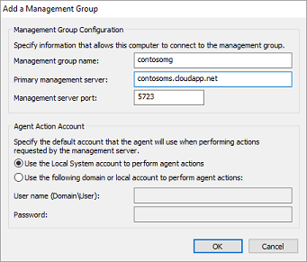

<properties
    pageTitle="在 Windows 電腦連線到記錄分析 |Microsoft Azure"
    description="本文說明的步驟，在您的內部部署基礎結構中的 Windows 電腦直接連接到 OMS 使用自訂的版本的 Microsoft 監控代理程式 (MMA)。"
    services="log-analytics"
    documentationCenter=""
    authors="bandersmsft"
    manager="jwhit"
    editor=""/>

<tags
    ms.service="log-analytics"
    ms.workload="na"
    ms.tgt_pltfrm="na"
    ms.devlang="na"
    ms.topic="article"
    ms.date="08/11/2016"
    ms.author="banders"/>


# <a name="connect-windows-computers-to-log-analytics"></a>在 Windows 電腦連線到記錄狀況分析

本文說明的步驟，在您的內部部署基礎結構中的 Windows 電腦直接連接到 OMS 工作區使用自訂的版本的 Microsoft 監控代理程式 (MMA)。 您需要安裝，並將所有您想要的電腦的代理程式連線至建 OMS 才中傳送資料至 OMS，以檢視和回應 OMS 入口網站中該資料。 每個代理程式可以回報至多個工作區。

您可以安裝代理程式使用 [設定] 命令，或使用所需的狀態設定 (DSC) 中 Azure 自動化。  

>[AZURE.NOTE] 虛擬機器中 Azure 執行可簡化安裝藉由使用[虛擬機器副檔名](log-analytics-azure-vm-extension.md)。

在電腦上使用網際網路連線，代理程式會使用連線至網際網路傳送資料至 OMS。 沒有網際網路連線的電腦上，您可以使用 proxy 或 OMS 記錄分析轉寄。

您的 Windows 電腦連線至 OMS 是直接使用 3 個簡單步驟︰

1. 下載代理程式的 [安裝] 檔案
2. 安裝代理程式使用您選擇的方法
3. 設定代理程式，或新增額外的工作區，如有必要

安裝並設定代理程式後下, 圖顯示您的 Windows 電腦和 OMS 之間的關聯。


## <a name="system-requirements-and-required-configuration"></a>系統需求與必要的設定
您在安裝或部署代理程式前，請檢閱下列詳細資料，以確保您符合需求。

- 您只可以安裝 OMS MMA 在執行 Windows Server 2008 SP 1 或更新版本的電腦或 Windows 7 SP1 或更新版本。
- 您需要的 OMS 訂閱。  如需詳細資訊，請參閱[開始使用記錄分析](log-analytics-get-started.md)。
- 每個 Windows 電腦必須能夠連上網際網路使用 HTTPS。 您可以直接，透過 proxy]，或 OMS 記錄分析轉寄站此連線。
- 您可以在獨立的電腦、 伺服器及虛擬機器上安裝 OMS MMA。 如果您要連線 OMS 裝載 Azure 虛擬機器，請參閱[連線 Azure 虛擬機器記錄分析](log-analytics-azure-vm-extension.md)。
- 代理程式必須使用各種資源的 TCP 連接埠 443。 如需詳細資訊，請參閱[設定 proxy 和防火牆設定中記錄分析](log-analytics-proxy-firewall.md)。

## <a name="download-the-agent-setup-file-from-oms"></a>從 OMS 下載代理程式的 [安裝] 檔案
1. 在 [OMS 入口網站，在 [**概觀**] 頁面上按一下 [**設定**] 方塊。  按一下頂端的 [**連線來源**] 索引標籤。  
    ![連線的來源] 索引標籤](./media/log-analytics-windows-agents/oms-direct-agent-connected-sources.png)
2. **直接附加的電腦**，按一下 [**下載 Windows 代理程式**適用於您的電腦的處理器類型下載 [安裝] 檔案。
3. 在**工作區 ID**的右側，按一下 [複製] 圖示並貼入識別碼記事本。
4. **主索引鍵**的右側，按一下 [複製] 圖示並貼入按鍵記事本。     
    

## <a name="install-the-agent-using-setup"></a>安裝代理程式使用設定
1. 執行您想要管理的電腦上安裝代理程式的安裝程式。
2. 在 [歡迎] 頁面上，按一下 [**下一步**]。
3. 在 [授權條款] 頁面中，閱讀授權，然後按一下 [**我同意**。
4. 在目的地資料夾] 頁面中，變更或保留預設的 [安裝] 資料夾，然後按 [**下一步**。
5. 在 [代理程式的安裝選項] 頁面中，您可以選擇將代理程式連線至 Azure 記錄分析 (OMS)，Operations Manager，或可以選項保留為空白如果您想要稍後設定代理程式。 按一下 [**下一步**]。   
    - 如果您選擇要連線至 Azure 記錄分析 (OMS)，請貼上的**工作區 ID**和您要複製到 [記事本] 在上述程序中的**工作區鍵 （主索引鍵）** ，然後按一下 [**下一步**。  
        
    - 如果您選擇要連線至 Operations Manager，輸入**管理群組的名稱**、**管理伺服器**名稱，以及**管理伺服器連接埠**，然後再按 [**下一步**。 在 [代理程式動作帳戶] 頁面中，選擇 [本機系統帳戶] 或 [本機的網域帳戶，然後按 [**下一步**。  
        

6. 在 [準備好安裝] 頁面，檢閱您的選擇，然後按一下 [**安裝**]。
7. 已順利完成設定頁面上，按一下 [**完成]**。
8. 完成時， **Microsoft 監控代理程式**會出現在**[控制台]**中。 您可以檢閱您的設定，並確認代理程式連線至操作的深入見解 (OMS)。 代理程式連線至 OMS 時，會顯示訊息，說明︰ **Microsoft 監控代理程式成功連線到 Microsoft 作業管理套件服務。**

## <a name="install-the-agent-using-the-command-line"></a>安裝代理程式使用命令列
- 修改，然後使用下列範例，安裝代理程式使用命令列。

    >[AZURE.NOTE] 如果您想要升級代理程式，您需要使用指令碼 API 記錄分析。 請參閱升級代理程式的 [下一步] 區段。

    ```
    MMASetup-AMD64.exe /Q:A /R:N /C:"setup.exe /qn ADD_OPINSIGHTS_WORKSPACE=1 OPINSIGHTS_WORKSPACE_ID=<your workspace id> OPINSIGHTS_WORKSPACE_KEY=<your workspace key> AcceptEndUserLicenseAgreement=1"
    ```

## <a name="upgrade-the-agent-and-add-a-workspace-using-a-script"></a>升級代理程式，並新增使用指令碼工作區
您可以升級代理程式，並新增使用下列 PowerShell 範例執行指令碼 API 記錄分析工作區。

```
$mma = New-Object -ComObject 'AgentConfigManager.MgmtSvcCfg'
$mma.AddCloudWorkspace($workspaceId, $workspaceKey)
$mma.ReloadConfiguration()
```

>[AZURE.NOTE] 如果您先前使用過的命令列或指令碼來安裝或設定代理程式，`EnableAzureOperationalInsights`換成`AddCloudWorkspace`。

## <a name="install-the-agent-using-dsc-in-azure-automation"></a>安裝在 Azure 自動化使用 DSC 代理程式

>[AZURE.NOTE] 此程序和指令碼範例會升級現有的代理程式。

1. 匯入 xPSDesiredStateConfiguration DSC 模組[http://www.powershellgallery.com/packages/xPSDesiredStateConfiguration](http://www.powershellgallery.com/packages/xPSDesiredStateConfiguration)從 Azure 自動化。  
2.  建立 Azure 自動化變數資產*OPSINSIGHTS_WS_ID*和*OPSINSIGHTS_WS_KEY*。 設定*OPSINSIGHTS_WS_ID*您 OMS 記錄分析資料的工作區 id，設定*OPSINSIGHTS_WS_KEY*為您的工作區的主索引鍵。
3.  使用下列的指令碼，並將其儲存為 MMAgent.ps1
4.  修改，然後使用下列範例，安裝 Azure 自動化中使用 DSC 代理程式。 匯入 MMAgent.ps1 Azure 自動化使用 Azure 自動化介面或指令程式。
5.  指定設定節點。 在 15 分鐘內節點將會檢查其設定並 MMA 會被傳送至節點。

```
Configuration MMAgent
{
    $OIPackageLocalPath = "C:\MMASetup-AMD64.exe"
    $OPSINSIGHTS_WS_ID = Get-AutomationVariable -Name "OPSINSIGHTS_WS_ID"
    $OPSINSIGHTS_WS_KEY = Get-AutomationVariable -Name "OPSINSIGHTS_WS_KEY"


    Import-DscResource -ModuleName xPSDesiredStateConfiguration

    Node OMSnode {
        Service OIService
        {
            Name = "HealthService"
            State = "Running"
            DependsOn = "[Package]OI"
        }

        xRemoteFile OIPackage {
            Uri = "http://download.microsoft.com/download/0/C/0/0C072D6E-F418-4AD4-BCB2-A362624F400A/MMASetup-AMD64.exe"
            DestinationPath = $OIPackageLocalPath
        }

        Package OI {
            Ensure = "Present"
            Path  = $OIPackageLocalPath
            Name = "Microsoft Monitoring Agent"
            ProductId = "8A7F2C51-4C7D-4BFD-9014-91D11F24AAE2"
            Arguments = '/C:"setup.exe /qn ADD_OPINSIGHTS_WORKSPACE=1 OPINSIGHTS_WORKSPACE_ID=' + $OPSINSIGHTS_WS_ID + ' OPINSIGHTS_WORKSPACE_KEY=' + $OPSINSIGHTS_WS_KEY + ' AcceptEndUserLicenseAgreement=1"'
            DependsOn = "[xRemoteFile]OIPackage"
        }
    }
}  


```


## <a name="configure-an-agent-manually-or-add-additional-workspaces"></a>手動設定代理程式，或新增額外的工作區
如果您已安裝代理程式，但未設定或如果您想要報表至多個工作區的代理程式，您可以使用下列資訊，以啟用代理程式，或重新設定。 您已設定代理程式之後，它會將登錄代理程式服務，並會取得所需的設定資訊及管理套件包含解決方案資訊。

1. 您已安裝 Microsoft 監控代理程式之後，開啟**[控制台]**。
2. 開啟**Microsoft 監控代理程式**，然後按一下 [ **Azure 記錄分析 (OMS)** ] 索引標籤。   
3. 按一下 [**新增**] 以開啟 [**新增記錄分析工作區**] 方塊。
4. 貼上**區 ID**和**工作區鍵 （主索引鍵）** ，您複製到 [記事本] 中的上一個處理程序的工作區，您想要新增，然後按一下**[確定]**。  
    

從 [監控代理程式的電腦收集資料之後，電腦監視 OMS 的數目會出現在 OMS 入口網站**設定**] 中的 [**連線來源**] 索引標籤上，為**伺服器連線**。


## <a name="to-disable-an-agent"></a>若要停用代理程式
1. 安裝後代理程式，開啟**[控制台]**。
2. 開啟 Microsoft 監控代理程式，然後按一下 [ **Azure 記錄分析 (OMS)** ] 索引標籤。
3. 選取工作區，然後再按一下 [**移除**]。 重複此步驟的所有其他工作區。


## <a name="optionally-configure-agents-to-report-to-an-operations-manager-management-group"></a>或者，您可以設定 [回報 Operations Manager 管理群組的代理程式

如果您使用 Operations Manager 在您的 IT 基礎結構時，您也可以使用 MMA 代理程式以 Operations Manager 代理程式。

### <a name="to-configure-mma-agents-to-report-to-an-operations-manager-management-group"></a>若要設定報告對 Operations Manager 管理群組 MMA 代理程式
1.  在電腦上安裝代理程式的位置，開啟**[控制台]**。
2.  開啟**Microsoft 監控代理程式**，然後按一下 [ **Operations Manager** ] 索引標籤。
    ![Microsoft 監控代理程式 Operations Manager] 索引標籤](./media/log-analytics-windows-agents/om-mg01.png)
3.  如果您 Operations Manager 伺服器與 Active Directory 整合，請按一下 [**自動更新 AD DS 從管理群組工作分派**。
4.  按一下 [**新增**] 以開啟 [**新增管理群組**] 對話方塊。  
    
5.  在 [**管理群組名稱**] 方塊中，輸入您的管理群組的名稱。
6.  在 [**主要管理伺服器**] 方塊中，輸入 「 主要管理伺服器的電腦名稱。
7.  在 [**管理伺服器連接埠**] 方塊中，輸入 TCP 連接埠號碼。
8.  **代理程式動作帳戶**] 下選擇 [本機系統帳戶或本機的網域帳戶]。
9.  按一下**[確定]**關閉 [**新增管理群組**] 對話方塊，然後按一下**[確定**] 關閉 [ **Microsoft 監控代理程式屬性**] 對話方塊。

## <a name="optionally-configure-agents-to-use-the-oms-log-analytics-forwarder"></a>或者，您可以設定使用 OMS 記錄分析轉寄站的代理程式

如果您有伺服器或沒有連線至網際網路的用戶端，您仍可以讓他們使用 OMS 記錄分析轉寄站，傳送給 OMS 的資料。  當您使用轉寄站時，代理程式的所有資料會都傳送到已連線到網際網路的單一伺服器。 轉寄站將資料從代理程式 OMS 以直接沒有分析的任何資料傳輸。

請參閱[OMS 記錄分析轉寄站](https://blogs.technet.microsoft.com/msoms/2016/03/17/oms-log-analytics-forwarder)，若要進一步瞭解轉寄站，包括設定及設定。

如需如何設定為使用 proxy 伺服器，在本例中是 OMS 轉寄站，您代理程式的資訊，請參閱[設定中記錄分析 proxy 和防火牆設定](log-analytics-proxy-firewall.md)。

## <a name="optionally-configure-proxy-and-firewall-settings"></a>或者，您可以設定 proxy 和防火牆設定
如果您使用 proxy 伺服器或您的環境中限制存取網際網路的防火牆，請參閱[proxy 和防火牆設定記錄分析中的](log-analytics-proxy-firewall.md)啟用您的代理程式 OMS 服務進行通訊。

## <a name="next-steps"></a>後續步驟

- 若要新增的功能和收集資料[從方案庫新增記錄分析解決方案](log-analytics-add-solutions.md)。
- [Proxy 和防火牆設定中記錄分析](log-analytics-proxy-firewall.md)如果貴組織使用 proxy 伺服器或防火牆，讓代理程式可以通訊記錄分析服務。
