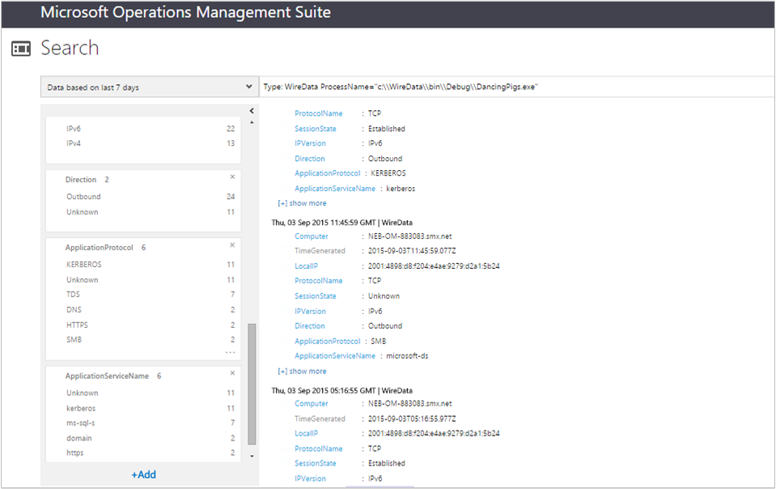

<properties
    pageTitle="電線記錄分析的資料解決方案 |Microsoft Azure"
    description="網路資料是合併彙算的網路和效能資料從 OMS 代理程式，包括 Operations Manager 和 Windows 連線代理程式的電腦。 網路資料就會合併記錄資料可協助您建立資料的關聯。"
    services="log-analytics"
    documentationCenter=""
    authors="bandersmsft"
    manager="jwhit"
    editor=""/>

<tags
    ms.service="log-analytics"
    ms.workload="na"
    ms.tgt_pltfrm="na"
    ms.devlang="na"
    ms.topic="article"
    ms.date="08/11/2016"
    ms.author="banders"/>

# <a name="wire-data-solution-in-log-analytics"></a>電線記錄分析的資料解決方案

網路資料是合併彙算的網路和效能資料從 OMS 代理程式，包括 Operations Manager 和 Windows 連線代理程式的電腦。 網路資料就會合併記錄資料可協助您建立資料的關聯。 IT 基礎結構監視器網路資料傳送從那些電腦上與網路層級 2-3 中包括各種不同的通訊協定和使用連接埠[OSI 模型](https://en.wikipedia.org/wiki/OSI_model)中的電腦上安裝 OMS 代理程式。

>[AZURE.NOTE] 無法新增至工作區目前使用線資料解決方案。 已經有啟用線上資料解決方案的客戶可以繼續使用連線資料解決方案。

根據預設，OMS 會收集記錄的資料從計數器 Windows 的內建的 CPU、 記憶體、 磁碟和網路效能資料。 網路和其他資料收集是在即時每一個代理程式，包括子網路和電腦正在使用的應用程式層級通訊協定。 您可以在 [記錄] 索引標籤上的 [設定] 頁面上新增其他效能計數器。

如果您已使用[sFlow](http://www.sflow.org/)或其他軟體[Cisco NetFlow](http://www.cisco.com/c/en/us/products/collateral/ios-nx-os-software/ios-netflow/prod_white_paper0900aecd80406232.html)通訊協定，則統計資料和資料就會從連線的資料將會是您熟悉。

內建的記錄檔搜尋查詢類型的包括︰

- 提供連線資料的代理程式
- 提供連線資料的代理程式的 IP 位址
- 連外通訊的 IP 位址
- 傳送應用程式通訊協定的位元組數字
- 應用程式服務所傳送的位元組數
- 接收到不同的通訊協定的位元組
- 傳送及接收 IP 位元組總計
- 代理程式 10.0.0.0/8 子網路上有通訊的 IP 位址
- 平均延遲測量了可靠的連線
- 啟動或收到網路流量的電腦程序
- 網路流量的程序

當您搜尋使用線的資料時，您可以篩選及群組資料檢視的頂端代理程式和上方的通訊協定的相關資訊。 您可以查詢時或傳達彼此的方式時間有多長，某些電腦 （IP 位址/MAC 地址），並資料量傳送-基本上，檢視是以搜尋為基礎的網路流量的中繼資料。

不過，因為您正在檢視的中繼資料，不一定適合您採取進階的疑難排解。 OMS 線資料不完整，擷取網路資料。 因此，它不是深封包層級疑難排解。
使用其他集合的方法，比較的代理程式的優點是您沒有安裝裝置、 重新設定您的網路切換或 preform 複雜的設定。 網路資料是直接代理程式為基礎，您的電腦上安裝代理程式，並將其會監控自己網路流量。 另一個優點是，當您想要監視在雲端提供者代管服務提供者或 Microsoft Azure，使用者無法擁有自己的布料的轉印圖樣圖層中執行的工作量。

相反地，您沒有完整的如果您沒有在所有電腦上安裝代理程式的網路基礎結構中的什麼出現在網路上。

## <a name="installing-and-configuring-the-solution"></a>安裝及設定解決方案
安裝和設定方案，請使用下列資訊。

- 網路資料解決方案的取得從執行 Windows Server 2012 R2、 Windows 8.1 及更新版本的作業系統的電腦上的資料。
- 您想要擷取的資料連線的電腦上需要 Microsoft.NET Framework 4.0 或更新版本。
- 新增到使用中[新增記錄分析解決方案從方案庫](log-analytics-add-solutions.md)所述的程序 OMS 工作區線資料解決方案。  有不需要進行其他設定。
- 如果您想要檢視特定解決方案的網路資料，您必須已新增至您的 OMS 工作區的解決方案。

## <a name="wire-data-data-collection-details"></a>電線資料集合詳細資料

網路資料會使用您已啟用代理程式的網路流量的中繼資料。

下表顯示資料集合方法和其他詳細資料收集連線資料的方式。


| 平台 | 直接代理程式 | 是 SCOM 代理程式 | Azure 儲存體 | 必要時，是 SCOM 嗎？ | 透過管理群組傳送是 SCOM 代理程式的資料 | 集合頻率 |
|---|---|---|---|---|---|---|
|Windows (2012 R2 / 8.1 或更新版本)|![[是]](./media/log-analytics-wire-data/oms-bullet-green.png)|![[是]](./media/log-analytics-wire-data/oms-bullet-green.png)||            || 每個 1 分鐘|


## <a name="combining-wire-data-with-other-solution-data"></a>使用其他方案資料結合網路資料

如上所示的內建查詢所傳回的資料可能會感興趣本身。 不過，當您合併其他 OMS 解決方案中的資訊不會得出連線資料的實用性。 例如，您可以使用收集的安全性和稽核解決方案的安全性事件資料，並將其命名的處理程序異常的網路登入您要的網路資料與結合。  在此範例中，您會使用 IN 和相異運算子加入您的搜尋查詢中的資料點。

[需求]: 若要使用下列範例中，您必須安裝的安全性和稽核解決方案。 不過，您可以使用其他方案的資料合併使用連線資料來達成同樣的結果。

### <a name="to-combine-wire-data-with-security-events"></a>若要合併線的資料與安全性事件

1. 在 [概觀] 頁面上，按一下 [ **WireData**磚。
2. 在**一般 WireData 查詢**清單中，按一下 [**量的網路流量中處理程序**，查看所傳回的程序的清單。
    
3. 如果處理程序的清單，輕鬆地檢視太長，您可以修改類似於搜尋查詢︰

    ```
    Type WireData | measure count() by ProcessName | where AggregatedValue <40
    ```
    下列範例所示的程序名為 DancingPigs.exe，可能會出現可疑郵件
    

4. 使用資料傳回清單中，按一下 [具名的程序。 在此範例中，按一下 [DancingPigs.exe。 下方所顯示的結果會說明透過各種不同的通訊協定的網路流量，例如輸出通訊類型。
    

5. 已安裝的安全性和稽核方案，因為您可以探查修改您使用 IN 和相異搜尋查詢運算子的搜尋查詢時，可以將相同的 ProcessName 欄位值的安全性事件。 然後您的網路資料和其他方案記錄具有的值相同的格式時，可以進行的動作。 修改您的搜尋查詢，類似於︰

    ```
    Type=SecurityEvent ProcessName IN {Type:WireData "DancingPigs.exe" | distinct ProcessName}
    ```    

    
6. 在上述結果中，您會看到帳戶資訊會顯示。 現在，您可以改善您的搜尋查詢，找出帳戶，並顯示安全性和稽核資料頻率使用查詢類似的處理程序︰        

    ```
    Type=SecurityEvent ProcessName IN {Type:WireData "DancingPigs.exe" | distinct ProcessName} | measure count() by Account
    ```

    


## <a name="next-steps"></a>後續步驟

- 若要檢視詳細的網路資料搜尋記錄中[搜尋記錄](log-analytics-log-searches.md)。
- 請參閱關於頻率收集資料，以及如何修改集合內容 Operations Manager 代理程式 Dan 的[使用連線資料作業管理套件記錄搜尋部落格文章](http://blogs.msdn.com/b/dmuscett/archive/2015/09/09/using-wire-data-in-operations-management-suite.aspx)有的其他資訊。
