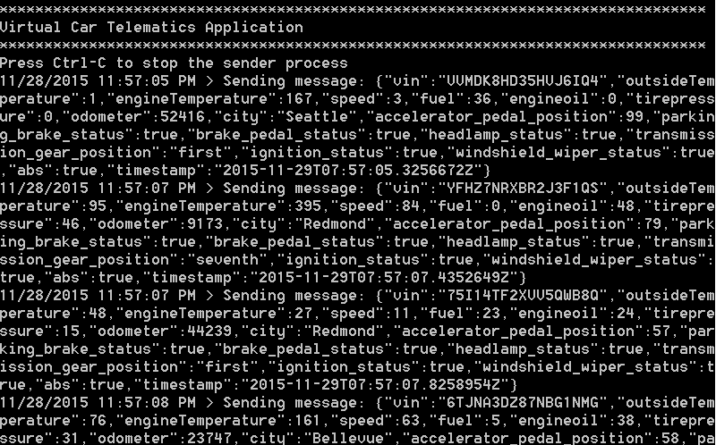
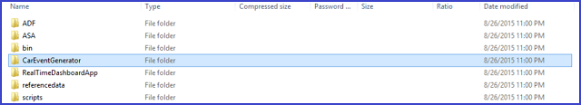
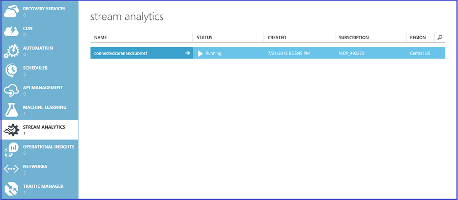
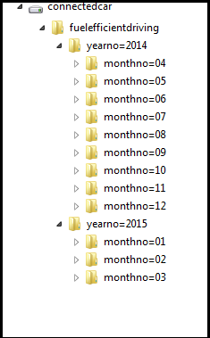
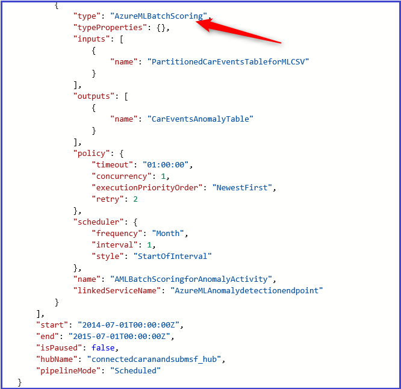

<properties 
    pageTitle="車輛遙測分析解決方案 playbook︰ 到解決方案深度剖析 |Microsoft Azure" 
    description="使用的 Cortana 智慧功能來取得即時及預測的深入見解，車輛健康狀況和開車郵件的習慣。" 
    services="machine-learning" 
    documentationCenter="" 
    authors="bradsev" 
    manager="jhubbard" 
    editor="cgronlun" />

<tags 
    ms.service="machine-learning" 
    ms.workload="data-services" 
    ms.tgt_pltfrm="na" 
    ms.devlang="na" 
    ms.topic="article" 
    ms.date="09/12/2016" 
    ms.author="bradsev" />

# 車輛遙測分析解決方案 playbook︰ 深度剖析到解決方案

此**功能表**會連結到此 playbook 區段︰ 

[AZURE.INCLUDE [cap-vehicle-telemetry-playbook-selector](../../includes/cap-vehicle-telemetry-playbook-selector.md)]

此區段中向下切入至每個階段的解決方案架構指示和自訂指標中所述。 

## 資料來源

方案使用兩個不同的資料來源︰

- **模擬的車輛訊號和診斷資料集**和 
- **車輛目錄**

車輛車用通訊模擬器是此方案的一部分。 它會發出的診斷資訊，並通知時間對應的車輛狀態，並在指定的點的行駛模式。 按一下 [下載**車輛車用通訊模擬器 Visual Studio 方案**根據您的需求自訂[車輛車用通訊模擬器](http://go.microsoft.com/fwlink/?LinkId=717075)。 車輛目錄包含與模型對應至 VIN 參考資料集。

*圖 2-車輛車用通訊模擬器*

這是包含下列的結構描述 JSON 格式化資料集。

資料行 | 描述 | 值 
 ------- | ----------- | --------- 
VIN | 隨機產生的車輛識別碼 | 這被取自 10000 的隨機產生的車輛識別碼主清單。
外部的溫度 | 外部溫度車輛開車的位置 | 從 0 到 100 的隨機產生的號碼
引擎溫度 | 量的車輛引擎的溫度 | 從 0 500 的隨機產生的號碼
速度 | 用以推動車輛引擎速度 | 從 0 到 100 的隨機產生的號碼
燃料 | 油料量的車輛 | 從 0 到 100 （表示燃料層級的百分比） 的隨機產生的號碼
EngineOil | 車輛引擎石油層級 | 從 0 到 100 （表示引擎石油程度百分比） 的隨機產生的號碼
Tire 壓力 | 量的車輛 tire 的沉重 | 隨機產生數字 0-50 （表示 tire 壓力層級百分比）
里程計數 | 里程計數讀取的工具 | 從 0 200000 的隨機產生的號碼
Accelerator_pedal_position | Accelerator 踏板位置的車輛 | 從 0 到 100 （表示 accelerator 層級的百分比） 的隨機產生的號碼
Parking_brake_status | 指出是否車輛直接把它停或不 | True 或 False
Headlamp_status | 指出位置 headlamp 上 | True 或 False
Brake_pedal_status | 指出是否要在是否，按煞車油門 | True 或 False
Transmission_gear_position | 傳輸齒輪的位置車輛 | 狀態︰ 首先，第二個，第三個、 第四，第五，第六，第七個，第八個
Ignition_status | 指出是否車輛執行時或停止 | True 或 False
Windshield_wiper_status | 指出是否已開啟擋風玻璃挪移 | True 或 False
ABS | 指出是否或不進行 ABS | True 或 False
時間戳記 | 時建立的資料點的時間戳記 | 日期
縣/市 | 車輛的位置 | 在本方案中的 4 個城市︰ Bellevue、 雷蒙市、 Sammamish 西雅圖

車輛模型參考資料集的模型對應至包含 VIN。 

VIN | 模型 |
--------------|------------------
FHL3O1SA4IEHB4WU1 | 轎車 |
8J0U8XCPRGW4Z3NQE | 混合式部署 |
WORG68Z2PLTNZDBI7 | 家庭 Saloon |
JTHMYHQTEPP4WBMRN | 轎車 |
W9FTHG27LZN1YWO0Y | 混合式部署 |
MHTP9N792PHK08WJM | 家庭 Saloon |
EI4QXI2AXVQQING4I | 轎車 |
5KKR2VB4WHQH97PF8 | 混合式部署 |
W9NSZ423XZHAONYXB | 家庭 Saloon |
26WJSGHX4MA5ROHNL | 轉換 |
GHLUB6ONKMOSI7E77 | 站台車 |
9C2RHVRVLMEJDBXLP | 精簡的汽車 |
BRNHVMZOUJ6EOCP32 | 小型休閒越野車 |
VCYVW0WUZNBTM594J | 蝴蝶結的跑車 |
HNVCE6YFZSA5M82NY | 中型休閒越野車 |
4R30FOR7NUOBL05GJ | 站台車 |
WYNIIY42VKV6OQS1J | 大型休閒越野車 |
8Y5QKG27QET1RBK7I | 大型休閒越野車 |
DF6OX2WSRA6511BVG | 雙門轎 |
Z2EOZWZBXAEW3E60T | 轎車 |
M4TV6IEALD5QDS3IR | 混合式部署 |
VHRA1Y2TGTA84F00H | 家庭 Saloon |
R0JAUHT1L1R3BIKI0 | 轎車 |
9230C202Z60XX84AU | 混合式部署 |
T8DNDN5UDCWL7M72H | 家庭 Saloon |
4WPYRUZII5YV7YA42 | 轎車 |
D1ZVY26UV2BFGHZNO | 混合式部署 |
XUF99EW9OIQOMV7Q7 | 家庭 Saloon
8OMCL3LGI7XNCC21U | 轉換 |
…….  |   |

### 若要產生模擬的資料
1.  若要下載資料模擬器套件，請按一下右上角的車輛車用通訊模擬器節點上的箭號。 儲存並擷取您電腦上的本機檔案。 *圖 3-車輛遙測分析解決方案藍圖*

2.  在您的本機電腦，移至資料夾解壓縮車輛車用通訊模擬器套件的位置。 *圖 4 – 車輛車用通訊模擬器資料夾*

3.  執行**CarEventGenerator.exe**的應用程式。

### 參照

[車輛車用通訊模擬器 Visual Studio 方案](http://go.microsoft.com/fwlink/?LinkId=717075) 

[Azure 事件中心](https://azure.microsoft.com/services/event-hubs/)

[Azure 資料工廠](https://azure.microsoft.com/documentation/learning-paths/data-factory/)

## Ingestion
Azure 事件集線器串流分析與資料工廠的組合用來內嵌車輛訊號，診斷的事件，和即時和批次分析。 所有的元件建立並設定為解決方案部署的一部分。 

### 即時分析
車輛車用通訊模擬器所產生的事件發佈至 [事件] 中心內使用事件中心 SDK。 資料流分析工作 ingests 這些事件，從 [事件] 中心，和程序以分析的車輛狀況的即時資料。 

 

*圖 5-事件中心儀表板*

 

*圖 6-串流分析工作處理資料*

資料流分析作業。

- ingests [事件] 中心內的資料 
- 執行的聯結車輛 VIN 對應至對應的模型的參考資料 
- 持續進行到 rtf 批次分析 Azure blob 儲存體。 

下列資料流分析查詢用來將 Azure blob 儲存體保存資料。 

 

*圖 7-資料 ingestion 串流分析工作查詢*

### 批次分析
我們也會產生的模擬的車輛訊號和診斷更豐富的批次分析的資料集的其他音量。 這是為了確保批次處理良好的代表資料音量。 達到這個目的，我們使用名為 「 PrepareSampleDataPipeline 」 的管線 Azure 資料工廠工作流程中產生的模擬的車輛訊號和診斷資料集的一年的內容。 按一下 [下載資料工廠自訂 DotNet 活動 Visual Studio 解決方案，根據您的需求自訂[資料工廠自訂活動](http://go.microsoft.com/fwlink/?LinkId=717077)]。 

 

*圖 8-批次處理工作流程的準備範例資料*

管線組成的自訂 ADF.Net 以下顯示的活動︰

 

*圖 9-PrepareSampleDataPipeline*

一旦管線執行成功 」 RawCarEventsTable 「 資料集，並且標示 「 準備好 」 一年值得的模擬的車輛訊號和診斷所產生的資料。 您會看到下列資料夾和您在 「 connectedcar 」 容器的儲存空間帳戶中建立的檔案︰

 

*圖 10-PrepareSampleDataPipeline 輸出*

### 參照

[Azure 事件中心 SDK 串流 ingestion](../event-hubs/event-hubs-csharp-ephcs-getstarted.md)

[Azure 資料工廠資料移動功能](../data-factory/data-factory-data-movement-activities.md)
[Azure 資料工廠 DotNet 活動](../data-factory/data-factory-use-custom-activities.md)

[Azure 資料工廠 DotNet 活動 visual studio 方案，準備範例資料](http://go.microsoft.com/fwlink/?LinkId=717077) 

## 分割資料集

轉換為年/月格式的資料準備步驟中分割原始半結構化的車輛訊號及診斷資料集。 這項分割升階為更有效率的查詢和調整長期儲存為第一個帳戶填滿，讓故障暫留在上一個 blob 帳戶至下一步]。 

>[AZURE.NOTE] 此方案中的步驟是僅適用於批次處理。

輸入與輸出資料的資料管理︰

- 若要保留的長為基礎 / 「 rawest 「 客戶 」 資料湖 」 中的資料表單是時間的**輸出資料**（標示為*PartitionedCarEventsTable*）。 
- 為輸出資料已輸入完整的精確度-只儲存 （分割） 更佳的後續使用，通常是想要捨棄**輸入的資料**以這個管線。

*圖 11 – 分割汽車事件工作流程*

使用 「 PartitionCarEventsPipeline 」 中的登錄區 HDInsight 活動分割的原始資料。 步驟 1 中產生一年的範例資料會依年/月分割。 磁碟分割區用來產生車輛訊號和診斷資料一年的每個月 （總 12 分割）。 

*圖 12-PartitionCarEventsPipeline*

下列登錄區指令碼，名為 「 partitioncarevents.hql 」，用於分割，並且位於 「 \demo\src\connectedcar\scripts 」 的資料夾下載 zip。 

    SET hive.exec.dynamic.partition=true;
    SET hive.exec.dynamic.partition.mode = nonstrict;
    set hive.cli.print.header=true;

    DROP TABLE IF EXISTS RawCarEvents; 
    CREATE EXTERNAL TABLE RawCarEvents 
    (
                vin                             string,
                model                           string,
                timestamp                       string,
                outsidetemperature              string,
                enginetemperature               string,
                speed                           string,
                fuel                            string,
                engineoil                       string,
                tirepressure                    string,
                odometer                        string,
                city                            string,
                accelerator_pedal_position      string,
                parking_brake_status            string,
                headlamp_status                 string,
                brake_pedal_status              string,
                transmission_gear_position      string,
                ignition_status                 string,
                windshield_wiper_status         string,
                abs                             string,
                gendate                         string
                
    ) ROW FORMAT DELIMITED FIELDS TERMINATED BY ',' LINES TERMINATED BY '10' STORED AS TEXTFILE LOCATION '${hiveconf:RAWINPUT}'; 

    DROP TABLE IF EXISTS PartitionedCarEvents; 
    CREATE EXTERNAL TABLE PartitionedCarEvents 
    (
                vin                             string,
                model                           string,
                timestamp                       string,
                outsidetemperature              string,
                enginetemperature               string,
                speed                           string,
                fuel                            string,
                engineoil                       string,
                tirepressure                    string,
                odometer                        string,
                city                            string,
                accelerator_pedal_position      string,
                parking_brake_status            string,
                headlamp_status                 string,
                brake_pedal_status              string,
                transmission_gear_position      string,
                ignition_status                 string,
                windshield_wiper_status         string,
                abs                             string,
                gendate                         string
    ) partitioned by (YearNo int, MonthNo int) ROW FORMAT DELIMITED FIELDS TERMINATED BY ',' LINES TERMINATED BY '10' STORED AS TEXTFILE LOCATION '${hiveconf:PARTITIONEDOUTPUT}';

    DROP TABLE IF EXISTS Stage_RawCarEvents; 
    CREATE TABLE IF NOT EXISTS Stage_RawCarEvents 
    (
                vin                             string,
                model                           string,
                timestamp                       string,
                outsidetemperature              string,
                enginetemperature               string,
                speed                           string,
                fuel                            string,
                engineoil                       string,
                tirepressure                    string,
                odometer                        string,
                city                            string,
                accelerator_pedal_position      string,
                parking_brake_status            string,
                headlamp_status                 string,
                brake_pedal_status              string,
                transmission_gear_position      string,
                ignition_status                 string,
                windshield_wiper_status         string,
                abs                             string,
                gendate                         string,
                YearNo                          int,
                MonthNo                         int) 
    ROW FORMAT delimited fields terminated by ',' LINES TERMINATED BY '10';

    INSERT OVERWRITE TABLE Stage_RawCarEvents
    SELECT
        vin,            
        model,
        timestamp,
        outsidetemperature,
        enginetemperature,
        speed,
        fuel,
        engineoil,
        tirepressure,
        odometer,
        city,
        accelerator_pedal_position,
        parking_brake_status,
        headlamp_status,
        brake_pedal_status,
        transmission_gear_position,
        ignition_status,
        windshield_wiper_status,
        abs,
        gendate,
        Year(gendate),
        Month(gendate)

    FROM RawCarEvents WHERE Year(gendate) = ${hiveconf:Year} AND Month(gendate) = ${hiveconf:Month}; 

    INSERT OVERWRITE TABLE PartitionedCarEvents PARTITION(YearNo, MonthNo) 
    SELECT
        vin,            
        model,
        timestamp,
        outsidetemperature,
        enginetemperature,
        speed,
        fuel,
        engineoil,
        tirepressure,
        odometer,
        city,
        accelerator_pedal_position,
        parking_brake_status,
        headlamp_status,
        brake_pedal_status,
        transmission_gear_position,
        ignition_status,
        windshield_wiper_status,
        abs,
        gendate,
        YearNo,
        MonthNo
    FROM Stage_RawCarEvents WHERE YearNo = ${hiveconf:Year} AND MonthNo = ${hiveconf:Month};

*圖 13-PartitionConnectedCarEvents 登錄區指令碼*

一旦管線執行成功，您會看到下列 「 connectedcar 」 容器下您儲存的帳戶所產生的磁碟分割。

*圖 14-分割輸出*

資料現在最佳化，更容易管理且準備好進行進一步處理取得豐富批次的深入見解。 

## 資料分析

在此區段中，您可以瞭解如何合併 Azure 資料流分析、 Azure 電腦學習、 Azure 資料工廠和 Azure HDInsight 的 rtf 車輛狀況進階分析及行駛路線郵件的習慣。 有以下三個面子區段︰

1.  **電腦學習**︰ 這個小節包含異常偵測實驗我們在本方案中用來預測要求服務進行的維修作業的車輛車輛要求恢復基於安全性問題的資訊。
2.  **即時分析**︰ 這個小節包含有關使用串流分析查詢語言及電腦學習實驗中使用自訂的應用程式的即時另尋高就的即時分析的資訊。
3.  **批次分析**︰ 這個小節包含有關轉換，以及處理批次資料 Azure HDInsight 和 Azure 電腦學習 operationalized Azure 資料工廠所使用的資訊。

### 電腦學習

我們的目標是預測車輛，需要進行的維修作業或回收根據特定的健康情況統計資料。 我們會將下列假設

- 如果其中一個下列三個條件為真，則車輛需要**服務進行的維修作業**︰
    - Tire 壓力太低
    - 引擎石油層級太低
    - 較高的溫度引擎

- 如果其中一個下列條件為真，則車輛可能會有**安全性問題**的，並要求**回收**︰
    - 引擎溫度高，但之外的溫度太低
    - 引擎溫度低但之外的溫度高

根據先前的需求，我們會建立偵測異常，一個用於車輛進行的維修作業偵測，一個用於車輛回收偵測兩個不同的模型。 在下列兩種模型中的內建的主要元件分析 (PCA) 演算法用於異常偵測。 

**進行的維修作業偵測模型**

如果其中一個三個指標 tire 壓力、 引擎石油或引擎溫度-符合其個別的條件，進行的維修作業偵測模型報表異常。 如此一來，我們只需要考慮以下三個變數建立模型。 在我們的實驗中 Azure 電腦學習，我們先使用**資料集中的 [選取資料行**模組擷取下列三個變數。 接下來我們使用 PCA 型異常檢查模組建立異常偵測模型。 

主要元件分析 (PCA) 是中可套用至] 功能選取項目、 分類和異常偵測的電腦學習建立的技術。 PCA 轉換成一組值稱為主要元件包含可能相關聯的變數的大小寫的一組。 PCA 型模型的重要概念就是將專案資料至較低維度的空間，讓功能和異常可以更輕鬆地通過身分驗證。
 
偵測模型每個新輸入，異常偵測器會先計算上 eigenvectors，其投影，然後計算標準化的重建錯誤。 此標準化的錯誤是異常分數。 較高的錯誤、 更多異常的執行個體是。 

在進行的維修作業偵測問題後，每一筆記錄可以被視為所定義的輪胎壓力與引擎石油引擎溫度座標的維度 3 的空間中的點。 若要擷取這些異常，我們可以使用 PCA 2 維空間到專案中的維度 3 的空間的原始資料。 因此，我們將參數設定為 2，用於 PCA 元件的數字。 這個參數會播放套用 PCA 型異常偵測重要的角色。 後使用 PCA 投射的資料，我們可以更輕鬆地識別這些異常。

**回收異常偵測模型**回收異常偵測模型] 中，我們使用選取資料行中資料集和 PCA 型異常偵測模組中以類似的方式。 具體來說，我們先擷取三個變數-引擎溫度與外部溫度速度-使用**資料集中的 [選取資料行**模組。 我們也包含速度變數，因為搜尋引擎溫度通常是相關的速度。 接下來我們使用 PCA 型異常檢查模組至 2 維專案中的維度 3 的空間的資料。 滿足回收準則時，因此車輛需要回收時引擎溫度之外的溫度高度負面相互關聯。 使用 PCA 型異常偵測演算法，我們可以執行 PCA 後擷取異常。 

訓練任一模型，我們需要使用標準的資料，不需要進行的維修作業或回收訓練 PCA 型異常偵測模型的輸入資料。 在分項實驗中，我們會使用訓練的異常偵測模型偵測車輛需要進行的維修作業或回收。 

### 即時分析

下列資料流分析 SQL 查詢用於取得車輛速度、 等油料、 引擎溫度、 里程計數讀取、 tire 壓力、 引擎石油層級，其他人的重要車輛參數的平均值。 平均可偵測異常發出通知，並決定整體狀況條件的車輛營運的特定區域中，然後將其與統計資料。 

圖 15 – 即時處理資料流分析查詢

所有平均值的計算都方式在 3 秒 TumblingWindow。 因為我們所需的非重疊] 和 [連續時間間隔，我們會在此情況下使用 TubmlingWindow。 

若要進一步瞭解 Azure 資料流分析中的所有 「 視窗化 」 功能，請按一下[視窗 （Azure 資料流分析）](https://msdn.microsoft.com/library/azure/dn835019.aspx)。

**即時預測**

應用程式是解決方案的 operationalize 電腦學習模型中進行即時的一部分。 建立名為 「 RealTimeDashboardApp 「 此應用程式，並為解決方案部署的一部分。 應用程式就會執行下列動作︰

1.  接聽位置串流分析已發佈的事件模式中持續事件中心執行個體。 *圖 16 – 資料流分析查詢輸出發佈資料事件中心執行個體* 

2.  針對此應用程式會收到每一個事件︰ 

    - 處理使用電腦學習要求回應計分 （給） 結束點的資料。 給端點自動發佈部署的一部分。
    - 給輸出發佈至使用推入 Api 中資料集。

此模式也適用於您要的線條商務 (LoB) 應用程式整合即時分析流程，例如通知、 通知，及訊息的案例分析藍本。

按一下 [下載 RealtimeDashboardApp Visual Studio 解決方案，自訂 [ [RealtimeDashboardApp 下載](http://go.microsoft.com/fwlink/?LinkId=717078)]。 

**若要執行即時儀表板應用程式**

1.  按一下 [圖表檢視] 中的節點，然後按一下 [屬性] 窗格中的 「 下載即時儀表板應用程式] 連結。 *圖 17 – 儀表板中的設定指示*
2.  解壓縮並儲存至本機*圖 18 – RealtimeDashboardApp 資料夾*
3.  執行 RealtimeDashboardApp.exe 應用程式
4.  提供有效的 Power BI 認證，登入，然後按一下 [接受]  

*圖 19 – RealtimeDashboardApp︰ 登入中*

>[AZURE.NOTE] 如果您要清除中資料集，請執行 RealtimeDashboardApp 和 「 flushdata 」 參數︰ 

    RealtimeDashboardApp.exe -flushdata

### 批次分析

在以下的目標是要顯示 Contoso 馬達如何利用 Azure 計算功能來管理大型資料，以取得上圖樣、 使用方式的行為，以及車輛狀況豐富視覺效果與深入資訊。 這可以讓您︰

- 改善的客戶體驗，並將其便宜提供的深入見解郵件的習慣以及燃料有效行駛行為
- 瞭解如何主動客戶和其行駛詳述管理商務決策，提供最適合的課程產品及服務

在本方案中，我們的目標下列指標︰

1.  **積極行駛行為**︰ 識別的模型、 位置、 行駛條件和時間，以取得深入見解積極行駛模式一年中的趨勢。 Contoso 馬達可以使用這些獲得深入見解行銷活動，推動個人化的新功能及使用狀況。
2.  **燃料有效行駛行為**︰ 識別的模型、 位置、 行駛條件和時間，以取得深入見解燃料有效行駛模式一年中的趨勢。 Contoso 馬達可以使用這些獲得深入見解的行銷活動，推動新功能與積極報告的驅動程式成本有效和環境易記行駛郵件的習慣。 
3.  **回收模型**︰ 識別要求恢復由另尋高就異常偵測電腦學習實驗的模型

讓我們來看的每個下列指標，詳細資料

**積極行駛圖樣**

名為 「 AggresiveDrivingPatternPipeline 」 來判斷模型、 位置、 車輛、 行駛條件，以及其他參數使用登錄區表現積極行駛圖樣的管線中處理的分割的車輛訊號和診斷資料。

 
*圖 20-加強開車圖樣工作流程*

名為 「 aggresivedriving.hql 」 分析積極行駛條件的圖樣所用的登錄區指令碼位於 「 \demo\src\connectedcar\scripts 」 資料夾的下載 zip。 

    DROP TABLE IF EXISTS PartitionedCarEvents; 
    CREATE EXTERNAL TABLE PartitionedCarEvents
    (
                vin                             string,
                model                           string,
                timestamp                       string,
                outsidetemperature              string,
                enginetemperature               string,
                speed                           string,
                fuel                            string,
                engineoil                       string,
                tirepressure                    string,
                odometer                        string,
                city                            string,
                accelerator_pedal_position      string,
                parking_brake_status            string,
                headlamp_status                 string,
                brake_pedal_status              string,
                transmission_gear_position      string,
                ignition_status                 string,
                windshield_wiper_status         string,
                abs                             string,
                gendate                         string
                                
    ) ROW FORMAT DELIMITED FIELDS TERMINATED BY ',' LINES TERMINATED BY '10' STORED AS TEXTFILE LOCATION '${hiveconf:PARTITIONEDINPUT}';

    DROP TABLE IF EXISTS CarEventsAggresive; 
    CREATE EXTERNAL TABLE CarEventsAggresive
    (
                vin                         string, 
                model                       string,
                timestamp                   string,
                city                        string,
                speed                       string,
                transmission_gear_position  string,
                brake_pedal_status          string,
                Year                        string,
                Month                       string
                                
    ) ROW FORMAT DELIMITED FIELDS TERMINATED BY ',' LINES TERMINATED BY '10' STORED AS TEXTFILE LOCATION '${hiveconf:AGGRESIVEOUTPUT}';

    INSERT OVERWRITE TABLE CarEventsAggresive
    select
    vin,
    model,
    timestamp,
    city,
    speed,
    transmission_gear_position,
    brake_pedal_status,
    "${hiveconf:Year}" as Year,
    "${hiveconf:Month}" as Month
    from PartitionedCarEvents
    where transmission_gear_position IN ('fourth', 'fifth', 'sixth', 'seventh', 'eight') AND brake_pedal_status = '1' AND speed >= '50'

*圖 21-加強開車圖樣登錄區查詢*

它會偵測魯莽/積極行駛的行為，根據煞車快速模式使用車輛的傳輸齒輪位置、 煞車踏板狀態及速度的組合。 

一旦管線執行成功，您會看到下列 「 connectedcar 」 容器下您儲存的帳戶所產生的磁碟分割。

 

*圖 22 – AggressiveDrivingPatternPipeline 輸出*

**燃料有效行駛圖樣**

分割的車輛訊號和診斷資料的處理管道名為 「 FuelEfficientDrivingPatternPipeline 」。 登錄區用來決定模型、 位置、 車輛、 行駛條件，以及展示燃料有效行駛圖樣其他屬性。

 

*圖 23 – 燃料有效行駛圖樣工作流程*

名為 「 fuelefficientdriving.hql 」 分析積極行駛條件的圖樣所用的登錄區指令碼位於 「 \demo\src\connectedcar\scripts 」 資料夾的下載 zip。 

    DROP TABLE IF EXISTS PartitionedCarEvents; 
    CREATE EXTERNAL TABLE PartitionedCarEvents
    (
                vin                             string,
                model                           string,
                timestamp                       string,
                outsidetemperature              string,
                enginetemperature               string,
                speed                           string,
                fuel                            string,
                engineoil                       string,
                tirepressure                    string,
                odometer                        string,
                city                            string,
                accelerator_pedal_position      string,
                parking_brake_status            string,
                headlamp_status                 string,
                brake_pedal_status              string,
                transmission_gear_position      string,
                ignition_status                 string,
                windshield_wiper_status         string,
                abs                             string,
                gendate                         string
                                
    ) ROW FORMAT DELIMITED FIELDS TERMINATED BY ',' LINES TERMINATED BY '10' STORED AS TEXTFILE LOCATION '${hiveconf:PARTITIONEDINPUT}';

    DROP TABLE IF EXISTS FuelEfficientDriving; 
    CREATE EXTERNAL TABLE FuelEfficientDriving
    (
                vin                         string, 
                model                       string,
                city                        string,
                speed                       string,
                transmission_gear_position  string,                
                brake_pedal_status          string,            
                accelerator_pedal_position  string,                             
                Year                        string,
                Month                       string
                                
    ) ROW FORMAT DELIMITED FIELDS TERMINATED BY ',' LINES TERMINATED BY '10' STORED AS TEXTFILE LOCATION '${hiveconf:FUELEFFICIENTOUTPUT}';

    INSERT OVERWRITE TABLE FuelEfficientDriving
    select
    vin,
    model,
    city,
    speed,
    transmission_gear_position,
    brake_pedal_status,
    accelerator_pedal_position,
    "${hiveconf:Year}" as Year,
    "${hiveconf:Month}" as Month
    from PartitionedCarEvents
    where transmission_gear_position IN ('fourth', 'fifth', 'sixth', 'seventh', 'eight') AND parking_brake_status = '0' AND brake_pedal_status = '0' AND speed <= '60' AND accelerator_pedal_position >= '50'

*圖 24 – 燃料有效率行駛圖樣登錄區的查詢*

使用車輛的傳輸齒輪位置的組合，煞車踏板狀態、 速度和對應油門偵測燃料有效的行駛行為加速，煞車，所根據的位置並充分圖樣。 

一旦管線執行成功，您會看到下列 「 connectedcar 」 容器下您儲存的帳戶所產生的磁碟分割。

 

*圖 25 – FuelEfficientDrivingPatternPipeline 輸出*

**回收預測**

學習實驗的電腦是佈建後，發佈為 web 服務做為解決方案部署的一部分。 批次計分結束點被運用在此工作流程，註冊為資料連結的工廠服務及 operationalized 使用資料工廠批次計分活動。

 

*圖 26 – 電腦學習端點註冊為連結資料工廠服務*

註冊連結的服務中 DetectAnomalyPipeline 用於分數使用異常偵測模型的資料。 

 

*圖 27 – 資料工廠 Azure 電腦學習批次計分的活動* 

有幾個步驟，讓它可以 operationalized 與批次計分 web 服務資料準備此管線中執行。 

 

*圖 28 – DetectAnomalyPipeline 的預測車輛要求恢復* 

一旦完成分數，HDInsight 活動用來處理和彙總資料分類為異常機率分數為 0.60 模型或更新版本。

    DROP TABLE IF EXISTS CarEventsAnomaly; 
    CREATE EXTERNAL TABLE CarEventsAnomaly 
    (
                vin                         string,
                model                       string,
                gendate                     string,
                outsidetemperature          string,
                enginetemperature           string,
                speed                       string,
                fuel                        string,
                engineoil                   string,
                tirepressure                string,
                odometer                    string,
                city                        string,
                accelerator_pedal_position  string,
                parking_brake_status        string,
                headlamp_status             string,
                brake_pedal_status          string,
                transmission_gear_position  string,
                ignition_status             string,
                windshield_wiper_status     string,
                abs                         string,
                maintenanceLabel            string,
                maintenanceProbability      string,
                RecallLabel                 string,
                RecallProbability           string
                                
    ) ROW FORMAT DELIMITED FIELDS TERMINATED BY ',' LINES TERMINATED BY '10' STORED AS TEXTFILE LOCATION '${hiveconf:ANOMALYOUTPUT}';

    DROP TABLE IF EXISTS RecallModel; 
    CREATE EXTERNAL TABLE RecallModel 
    (

                vin                         string,
                model                       string,
                city                        string,
                outsidetemperature          string,
                enginetemperature           string,
                speed                       string,
                Year                        string,
                Month                       string              
                                
    ) ROW FORMAT DELIMITED FIELDS TERMINATED BY ',' LINES TERMINATED BY '10' STORED AS TEXTFILE LOCATION '${hiveconf:RECALLMODELOUTPUT}';

    INSERT OVERWRITE TABLE RecallModel
    select
    vin,
    model,
    city,
    outsidetemperature,
    enginetemperature,
    speed,
    "${hiveconf:Year}" as Year,
    "${hiveconf:Month}" as Month
    from CarEventsAnomaly
    where RecallLabel = '1' AND RecallProbability >= '0.60'

一旦管線執行成功，您會看到下列 「 connectedcar 」 容器下您儲存的帳戶所產生的磁碟分割。

 

*圖 30 – 圖 30 – DetectAnomalyPipeline 輸出*

## 發佈

### 即時分析

其中一個資料流分析工作中的查詢輸出發佈事件事件] 中心執行個體。 

*圖 31-分析工作發佈至輸出資料流事件] 中心執行個體*

*圖 32 – 發佈輸出至查詢的分析的資料流事件] 中心執行個體*

包含在解決方案 RealTimeDashboardApp 耗用的事件此資料流。 此應用程式會運用即時計分的電腦學習要求回應 web 服務，並將結果的資料發佈到消耗的中資料集。 

### 批次分析

批次及即時處理結果的發佈到消耗 Azure SQL 資料庫資料表。 Azure SQL Server、 資料庫及表格會自動建立安裝指令碼的一部分。 

*圖 33 – 批次處理結果複製資料超市工作流程*

*圖 34 – 分析工作發佈至資料超市串流*

*圖 35 – 資料超市設定中的資料流分析工作*

## 使用

Power BI 提供此方案豐富的儀表板的即時資料和預測分析視覺效果。 

如需設定中報表和儀表板的詳細指示，請按一下這裡。 最終的儀表板看起來像這樣︰

*圖 36-中儀表板*

## 摘要

這份文件包含詳細的向下切入的車輛遙測分析解決方案。 此展示 lambda 架構模式即時和批次分析預測和動作。 此模式適用於各式各樣的需要快速鍵路徑 （即時） 的使用案例和低溫路徑 （批次） 分析。 
