<properties 
    pageTitle="車輛遙測分析方案範本中的儀表板設定指示 |Microsoft Azure" 
    description="使用的 Cortana 智慧功能來取得即時及預測的深入見解，車輛健康狀況和開車郵件的習慣。" 
    services="machine-learning" 
    documentationCenter="" 
    authors="bradsev" 
    manager="jhubbard" 
    editor="cgronlun" />

<tags 
    ms.service="machine-learning" 
    ms.workload="data-services" 
    ms.tgt_pltfrm="na" 
    ms.devlang="na" 
    ms.topic="article" 
    ms.date="09/12/2016" 
    ms.author="bradsev" />

# 車輛遙測分析解決方案範本中的儀表板的設定指示

在此 playbook 章節此**功能表**連結。 

[AZURE.INCLUDE [cap-vehicle-telemetry-playbook-selector](../../includes/cap-vehicle-telemetry-playbook-selector.md)]

車輛遙測分析解決方案展示如何汽車經銷商汽車製造商與保險公司可以運用 Cortana 智慧功能，以取得即時及預測的深入見解，車輛健康和行駛郵件的習慣區域中的磁碟機改良的客戶體驗，R 與 D 和行銷活動。 這份文件包含如何設定中的報表和儀表板部署在您的訂閱方案後的逐步指示。 

## 必要條件
1.  瀏覽至[https://gallery.cortanaanalytics.com/SolutionTemplate/Vehicle-Telemetry-Analytics-3](https://gallery.cortanaanalytics.com/SolutionTemplate/Vehicle-Telemetry-Analytics-3)部署車輛遙測分析方案  
2.  [安裝 Microsoft Power BI Desktop](http://www.microsoft.com/download/details.aspx?id=45331)
3.  [Azure 訂閱](https://azure.microsoft.com/pricing/free-trial/)。 如果您沒有安裝 Azure 的訂閱，開始使用 Azure 免費訂閱
4.  Microsoft 中的帳戶
    

## Cortana 智慧套件元件
車輛遙測分析方案範本的一部分，下列 Cortana 智慧服務會部署在您的訂閱。

- **事件集線器**的 Azure 到 ingesting 數百萬車輛遙測事件。
- 取得即時深入見解車輛健康**串流分析**s 和更豐富的批次分析長期儲存到持續該資料。
- 即時異常偵測**電腦學習**及批次處理取得預測深入資訊。
- **HDInsight**用來在資料轉換
- **資料工廠**控點協調流程的排程，資源管理及監視批次處理管道的郵件。

**Power BI**提供此方案豐富的儀表板的即時資料和預測分析視覺效果。 

方案使用兩個不同的資料來源︰**模擬的車輛訊號和診斷資料集**和**車輛目錄**。

車輛車用通訊模擬器是此方案的一部分。 它會發出的診斷資訊，並通知對應至量的車輛狀態和時間，在指定的點開車圖樣。 

車輛目錄是模型對應的參考資料集包含 VIN

## 中的儀表板準備

### 部署

一旦完成部署，您應該會看到下列圖表與所有標示為 [綠色這些元件。 

- 若要瀏覽至對應的服務，以驗證是否所有這些已成功部署，請按一下右上角的綠色節點上的箭號。
- 若要下載資料模擬器套件，請按一下 [上**車輛車用通訊模擬器**節點 upper 上的箭號。 儲存並擷取您電腦上的本機檔案。 

現在，您已準備好設定取得即時的豐富視覺效果中的儀表板，然後在車輛健康狀況與開車預測獲得深入見解郵件的習慣。 若要建立的所有報表，並設定儀表板小時花關於 45 分鐘。 

### 設定 Power BI 的即時儀表板

**產生模擬的資料**

1. 在您的本機電腦上移至 [解壓縮車輛車用通訊模擬器套件的資料夾
2.  執行***CarEventGenerator.exe***的應用程式。
3.  它會發出的診斷資訊，並通知對應至量的車輛狀態和時間，在指定的點開車圖樣。 這是已發佈至 Azure [事件] 中心執行個體設定您的部署的一部分。

     
**啟動即時儀表板應用程式**

方案包含產生即時儀表板中的應用程式。 這個應用程式接聽事件] 中心執行個體，從資料流分析發佈事件持續。 針對每一個此應用程式收到的事件，它會處理使用電腦學習要求回應計分結束點的資料。 結果集已發行至視覺效果中推入 Api。 

若要下載應用程式︰

1.  按一下 [圖表檢視] 中的節點，按一下 [**下載即時儀表板應用程式**' [屬性] 窗格上的連結。
2.  解壓縮並儲存在本機的應用程式

3.  執行**RealtimeDashboardApp.exe**應用程式
4.  提供有效的 Power BI 認證，登入，然後按一下 [**接受**]
    
    
    
    

### 設定中的報表
即時報表和儀表板需要花 30 45 分鐘，才能完成。 瀏覽至[http://powerbi.com](http://powerbi.com)與登入。

Power BI 中則會產生新的資料集。 按一下 [ **ConnectedCarsRealtime**資料集]。

空白報表，使用**Ctrl + s**儲存。

提供*車輛遙測分析即時-報表*的報告名稱。

## 即時報表
在本方案中有三個即時報表︰

1.  車輛作業
2.  車輛需要進行的維修作業
3.  車輛狀況統計資料

您可以選擇設定所有三個即時報表或停止任何階段之後，繼續進行批次報表的下一節。 我們建議您建立的所有三個報表，呈現完整的深入見解即時路徑的解決方案。  

### 1.車輛作業
  
按兩下**第 1 頁**，然後重新命名為 「 車輛運算中 」  
      

選取**vin**欄位從**欄位**，然後選擇**「 卡片 」**視覺效果類型。  

如下圖所示，會建立卡片視覺效果。  
    

按一下 [新增新的視覺效果的空白區域]。  

從欄位中，選取**縣/市**及**vin** 。 變更**「 地圖 」**視覺效果。 拖曳**vin**值] 區域中。 將**城市**從欄位拖曳至**圖例**] 區域。   
    
  
選取**格式**] 區段的**視覺效果**，按一下**標題**，將**文字**變更為**「 車輛作業依據縣市 」**。  
       

最後一個視覺效果的外觀如下圖所示。    
    

按一下 [新增新的視覺效果的空白區域]。  

選取 [**縣/市**和**vin**，視覺效果類型] 變更為**直條圖**。 請確定**座標軸區域**和**vin** **值] 區域**中的 [**城市**] 欄位  

排序圖表的**「 vin 計數 」**  
    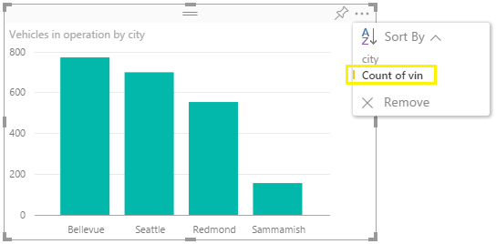  

變更為**「 車輛作業依據縣市 」**的 [圖表**標題**  

按一下 [**格式**] 區段中，然後選取**資料色彩**]，按一下**」 在 「** **全部顯示]**  
      

按一下 [色彩] 圖示上變更個別縣/市的色彩。  
      

按一下 [新增新的視覺效果的空白區域]。  

選取**群組直條圖**視覺效果的視覺效果，拖曳**城市**] 欄位中**軸**] 區域中，在 [**圖例**] 區域的**模型**和**vin** **值**] 區域中。  
      
    
  
重新排列在此頁面上的所有視覺效果，如下圖所示。  
    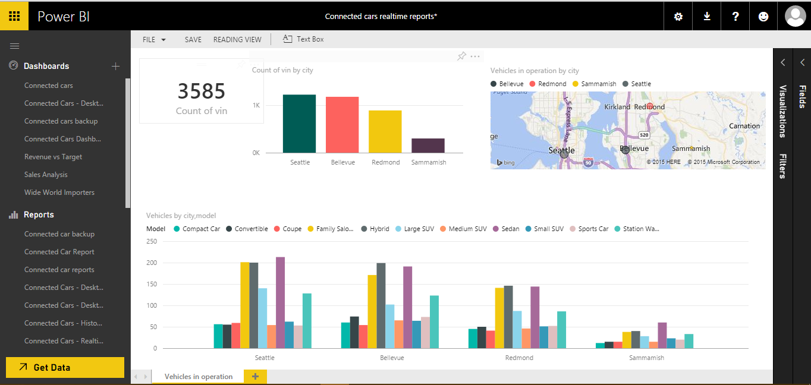

您已成功設定 「 作業車輛 」 即時報表。 您可以前往建立下一個即時報表或停止以下並設定儀表板。 

### 2.車輛需要進行的維修作業
  
按一下 [若要新增新的報表，它重新命名為**「 車輛需要進行的維修作業]**

  

選取**vin**欄位，然後將視覺效果類型變更為 [**卡片**]。  
    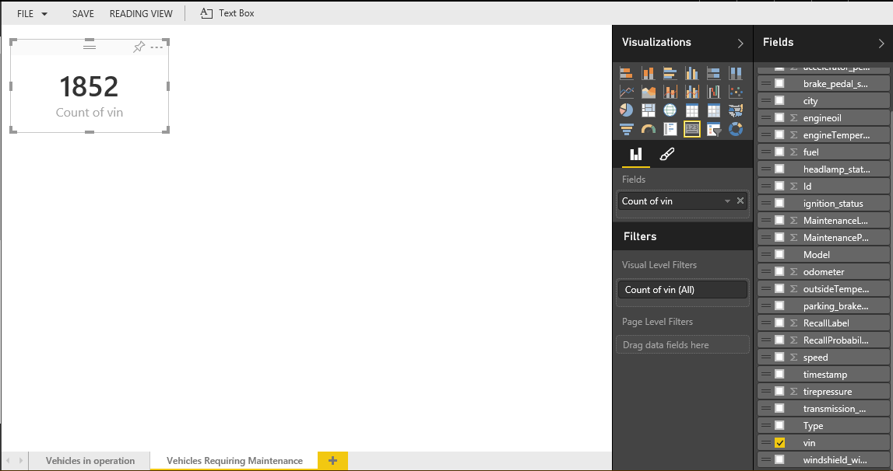  

我們有名為 「 MaintenanceLabel 」，在資料集中的欄位。 此功能變數可以有值為 「 0 」 或 「 1 」。 」 將 Azure 電腦學習模型解決方案佈建後，整合即時的路徑。 「 1 」 這個值表示車輛需要進行的維修作業。 

若要新增的**網頁層級**篩選器顯示車輛資料，需要進行的維修作業︰ 

1. **「 MaintenanceLabel 」**將欄位拖曳到**頁面層級篩選**。  
  

2. 按一下簡報 MaintenanceLabel 頁面層級篩選底部的 [**基本篩選**功能表。  
  

3.  設定其篩選值為**「 1 」**    
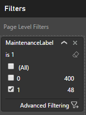  

按一下 [新增新的視覺效果的空白區域]。  

從 [視覺效果中選取 [**群組直條圖**  
  
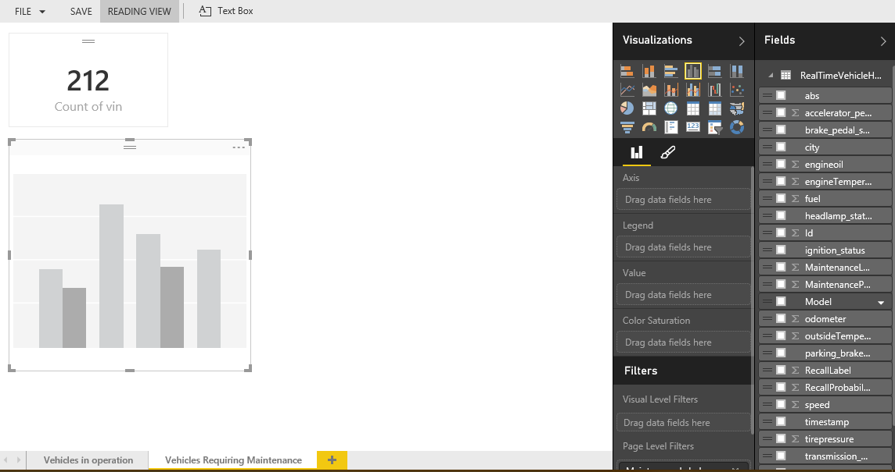

將欄位**模型**拖曳到 [**軸**] 區域， **Vin**至**值**] 區域。 然後排序依據**vin 的計數**的視覺效果。  將圖表**標題**變更為**「 車輛需要進行的維修作業模型 」**  

將**vin**欄位拖曳到**[色彩飽和度**存在於**欄位**的**視覺效果**] 索引標籤] 區段  
  

在 [**格式**] 區段中的視覺效果中變更**資料的色彩**  
變更最小值色彩︰ **F2C812**  
變更色彩最大值︰ **FF6300**  
  
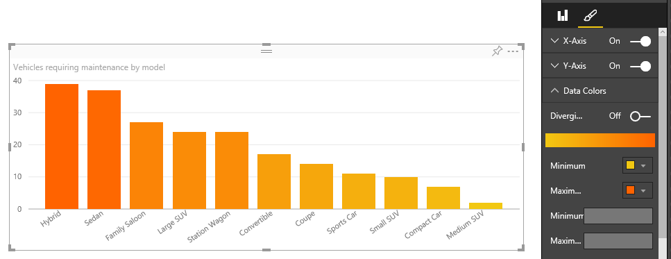  

按一下 [新增新的視覺效果的空白區域]。  

從 [視覺效果中選取**叢集直條圖**、 將**vin**欄位拖曳到 [**值**] 區域，將**縣/市**] 欄位拖曳到 [**軸**] 區域。 排序圖表的**「 vin 計數 」**。 變更為**「 車輛需要進行的維修作業依據縣市 」**的 [圖表**標題**   
  

按一下 [新增新的視覺效果的空白區域]。  

選取**多個資料列的卡片**視覺效果的視覺效果，將**模型**和**vin**拖曳到 [**欄位**] 區域。  
    

重新排列所有視覺效果的最終報表看起來，如下所示︰  
  

您已成功設定 「 車輛需要進行的維修作業] 即時報表。 您可以前往建立下一個即時報表或停止以下並設定儀表板。 

### 3.車輛狀況統計資料
  
按一下 [若要新增新的報表，它重新命名為**「 車輛狀況統計資料 」**  

選取**量測**視覺效果的視覺效果，然後將 [**速度**] 欄位拖曳到**值、 最小值、 最大值**] 區域。  
  

變更預設彙總的**值] 區域**中的**速度****平均** 

變更預設彙總**速度****最小值] 區域**中的**最小值**

變更預設彙總**速度****最大值] 區域**中的**最大值**

  

重新命名為**「 平均速度 」**的**量測標題** 
 
  

按一下 [新增新的視覺效果的空白區域]。  

同樣地加入**平均引擎石油**、**平均燃料**，和**平均引擎 temperate****儀表**。  

變更**「 平均速度 」**步驟中上方的每個儀表為每個欄位的預設彙總評量。

按一下 [新增新的視覺效果的空白區域]。

選取**線條與群組直條圖**視覺效果，然後拖曳**城市**] 欄位到**共用的座標軸**，拖曳**速度** **tirepressure 和 engineoil 欄位**至**資料行的值**] 區域中，從其彙總類型變更為**平均值**。 

將 [ **engineTemperature** ] 欄位拖曳到**線條值**] 區域，彙總類型變更為**平均值**。 

您可以變更圖表**標題**為**「 平均速度、 tire 壓力、 引擎石油和引擎溫度 」**。  

按一下 [新增新的視覺效果的空白區域]。

選取**樹狀結構圖**視覺效果，從視覺效果，將 [**模型**] 欄位拖曳到 [**群組**] 區域中，並將 [ **MaintenanceProbability** ] 欄位拖曳到 [**值**] 區域。

您可以變更圖表**標題**為**「 需要進行的維修作業車輛模型 」**。

按一下 [新增新的視覺效果的空白區域]。

選取**100%堆疊橫條圖**的視覺效果，將 [**城市**] 欄位拖曳到 [**座標軸**] 區域中，並拖曳**MaintenanceProbability**， **RecallProbability**欄位至 [**值**] 區域。

按一下 [**格式]**，選取**資料色彩**]，並設定**MaintenanceProbability**色彩至**「 F2C80F 」**的值。

變更圖表的**標題** **「 機率的車輛進行的維修作業和回收依縣/市 」**。

按一下 [新增新的視覺效果的空白區域]。

從視覺效果中的視覺效果選取**區域圖**，將 [**模型**] 欄位拖曳到 [**座標軸**] 區域中，並將**engineOil、 tirepressure、 速度和 MaintenanceProbability**欄位拖曳到 [**值**] 區域。 **「 平均 」**變更其彙總類型。 

您可以變更圖表的標題為**「 平均引擎石油，對壓力、 速度和維護機率模型 」**。

按一下要新增新的視覺效果的空白區域︰

1. 從 [視覺效果中選取**的散佈圖**視覺效果。
2. 將 [**模型**] 欄位拖曳到 [**詳細資料**] 和 [**圖例**] 區域。
3. 將**燃料**欄位拖曳到 [ **x 軸**] 區域，變更**平均**彙總。
4. 將**engineTemparature**拖曳到**直線與 y 軸] 區域**，變更**平均**彙總
5. **Vin**將欄位拖曳到 [**大小**] 區域。

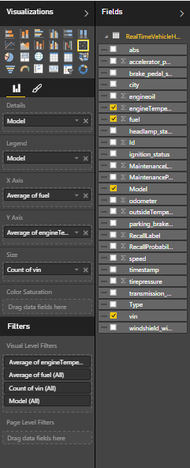

變更圖表**標題** **「 燃料的平均值，引擎溫度模型 」**。

最終報表外觀如下所示。

### 釘選即時儀表板從報表視覺效果
  
按一下 [儀表板] 旁的加號圖示，以建立空白的儀表板。 您可以將其命名 「 車輛遙測分析儀表板 」

釘選至儀表板從上述報表視覺效果。 
 

儀表板應如下時建立的所有三個報表，以及相對應的視覺效果釘選到儀表板。 如果您還沒有建立的所有報表，您的儀表板可能看起來一樣。 

恭喜您 ！ 您已成功建立即時儀表板。 繼續執行 CarEventGenerator.exe 和 RealtimeDashboardApp.exe 時，您應該會看到即時更新儀表板上。 應該需要關於 10 到 15 分鐘才能完成下列步驟。

 
##  設定 Power BI 批次處理儀表板

>[AZURE.NOTE] 花關於兩個小時 （從成功完成的部署） 的端對端批次處理管線，完成執行並處理值得一年的產生的資料。 因此，請等候處理接下來的步驟進行之前，先完成。 

**下載設計工具中的檔案**

-   預先設定的中設計工具檔案已部署的一部分
-   按一下 [圖表檢視] 中的節點，然後按一下 [屬性] 窗格上的 [**下載設計工具中的檔案**連結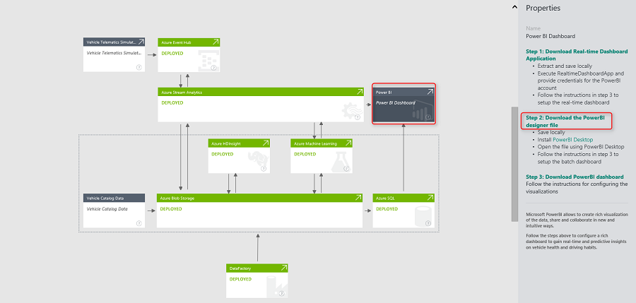

-   儲存至本機

**設定中的報表**

-   開啟 「 VehicleTelemetryAnalytics-桌面 Report.pbix 」 的設計工具檔案使用中的桌面。 如果您還沒有，安裝中桌面從[中桌面安裝](http://www.microsoft.com/download/details.aspx?id=45331)。 

-   按一下 [**編輯查詢**]。

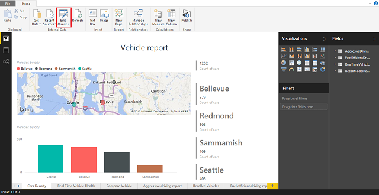

- 按兩下 [**來源**]。

- 更新伺服器的連接字串 Azure SQL server 取得佈建部署的一部分。 按一下 [在圖表上的 Azure SQL 節點，並檢視 [屬性] 窗格的伺服器名稱。

- 將**資料庫**保留為 [ *connectedcar*。

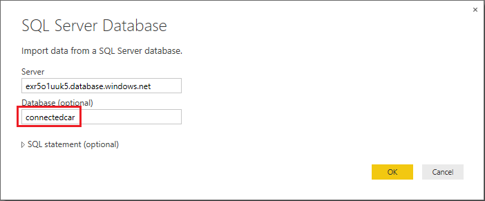

- 按一下**[確定]**。
- 您會看到**Windows 認證**] 索引標籤上選取的預設值，即可在右側的**資料庫**] 索引標籤上變更資料庫**的認證**。
- 提供**使用者名稱**和**密碼**在其部署安裝期間所指定的 Azure SQL 資料庫。

- 按一下 [**連線**]
- 在右窗格中的三個剩餘查詢的每個重複上述步驟，然後更新詳細資料來源連線。
- 按一下 [**關閉並載入**]。 Power BI Desktop 檔案資料集連線至 SQL Azure 資料庫資料表。
- **關閉**Power BI Desktop 檔案。

- 按一下 [**儲存**] 按鈕以儲存變更]。 
 
您現在已設定對應至批次處理路徑方案中的所有報表。 

## 上傳到*powerbi.com*
 
1.  瀏覽至中 web http://powerbi.com 和登入入口網站。
2.  按一下 [**取得資料**  
3.  Power BI Desktop 檔案上傳。  
4.  若要上傳，請按一下 [**取得資料]-> [檔案]-> [本機檔案**  
5.  瀏覽至**「 VehicleTelemetryAnalytics – 桌面 Report.pbix 」**  
6.  上傳檔案後您將會瀏覽回 Power BI 的工作空間。  

將建立您的資料集]、 [報表及 [空白儀表板。  
 

固定至現有的儀表板**車輛遙測分析儀表板** **Power BI**中的圖表。 按一下 [空白先前所建立的儀表板，然後瀏覽至 [**報表**] 區段按一下新上傳的報表。  

 

**報表有六個頁面，請注意︰**  
第 1 頁︰ 車輛密度  
第 2 頁︰ 即時車輛健康狀況  
第 3 頁︰ 積極導向車輛   
第 4︰ 回收車輛  
有效率地導向車輛頁面 5︰ 燃料  
頁面 6: Contoso 標誌  

 

**從第 3 頁**，釘選下列動作︰  

1.  VIN 的計數  
     

2.  積極導向車輛模型瀑布圖  
    

**從第 5 頁**、 釘選下列動作︰ 
 
1.  Vin 的計數    
      
2.  模型油料有效車輛︰ 群組直的條圖  
    

**從第 4 頁**，釘選下列動作︰  

1.  Vin 的計數  
     

2.  依縣 / 市回收的車輛模型︰ 樹狀結構圖  
    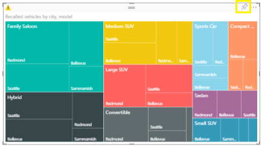  

**從頁面 6**，pin 下列動作︰  

1.  Contoso 馬達標誌  
    

**組織儀表板**  

1.  瀏覽至儀表板
2.  將游標移到每個圖表和重新命名]，以完成的儀表板下方圖像中所提供的命名。 也移動圖表看起來像下面的儀表板。  
      
    
3.  如果您已建立的所有報表，此文件所述，最後一個已完成的儀表板看起來應該像下圖。 

恭喜您 ！ 您已成功建立報表和儀表板，取得即時、 預測和批次車輛健康狀況與開車上郵件的習慣。  
