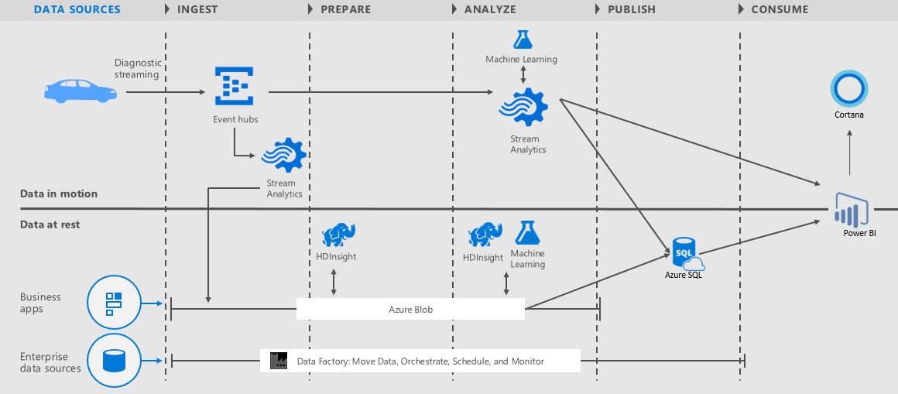

<properties 
    pageTitle="車輛遙測分析解決方案 playbook |Microsoft Azure" 
    description="使用的 Cortana 智慧功能來取得即時及預測的深入見解，車輛健康狀況和開車郵件的習慣。" 
    services="machine-learning" 
    documentationCenter="" 
    authors="bradsev" 
    manager="jhubbard" 
    editor="cgronlun" />

<tags 
    ms.service="machine-learning" 
    ms.workload="data-services" 
    ms.tgt_pltfrm="na" 
    ms.devlang="na" 
    ms.topic="article" 
    ms.date="09/12/2016" 
    ms.author="bradsev" />

# 車輛遙測分析解決方案 playbook

在此 playbook 章節此**功能表**連結。 

[AZURE.INCLUDE [cap-vehicle-telemetry-playbook-selector](../../includes/cap-vehicle-telemetry-playbook-selector.md)]

## 概觀
進階的電腦已登出實驗室移動和駐留中我們車庫 ！ 這些尖端汽車包含各種感應器加以追蹤，並監控事件數百萬每秒的能力。 我們預期，以 2020，大部分的這些汽車會已連接至網際網路。 假設此豐富的資料提供最佳類別安全性、 可靠性和行駛體驗到點選 ！ 成為 Microsoft 夢與 Cortana 智慧現實。

Microsoft 的 Cortana 智慧是完全受管理的大型資料和進階的分析套件可讓您將資料轉換成智慧的動作。 我們想要向您介紹 Cortana 智慧車輛遙測分析解決方案範本。 此方案示範如何汽車經銷商、 汽車製造商和保險公司可以使用 Cortana 智慧的功能，取得即時和預測的深入見解車輛健康狀況和開車郵件的習慣。 

解決方案實作為[lambda 架構模式](https://en.wikipedia.org/wiki/Lambda_architecture)顯示完整的潛在 Cortana 智慧平台版的即時和批次處理。 解決方案︰ 

- 提供車輛車用通訊模擬器
- 運用事件集線器的 Azure 到 ingesting 數百萬模擬的車輛遙測事件 
- 若要取得即時深入見解車輛健康使用串流分析
-  更豐富的批次分析長期儲存到會保留資料。 
- 利用電腦學習異常偵測中的即時和批次處理取得預測深入資訊。
- 運用 HDInsight 轉換資料比例 」 和 「 資料工廠處理協調流程、 排程、 資源管理和監視批次處理管線 
- 提供此方案即時資料和使用 Power BI 的預測狀況分析視覺效果豐富的儀表板

## 架構

*圖 1 – 車輛遙測分析解決方案架構*

此方案包含下列**Cortana 智慧元件**，展示他們的端對端整合

- **事件集線器**的 Azure 到 ingesting 數百萬車輛遙測事件。
- 取得即時深入見解車輛健康**串流分析**及更豐富的批次分析長期儲存到持續該資料。
- 即時異常偵測**電腦學習**及批次處理取得預測深入資訊。
- **HDInsight**用來在資料轉換
- **資料工廠**控點協調流程的排程，資源管理及監視批次處理管道的郵件。
- **Power BI**提供此方案豐富的儀表板的即時資料和預測分析視覺效果。

此方案存取兩個不同**資料來源**︰ 

- **模擬車輛訊號和診斷**︰ 車輛車用通訊模擬器發出時間的診斷資訊和訊號對應以車輛和指定的點的行駛模式的狀態。 
- **車輛目錄**︰ 包含模型對應至 VIN 參考資料集。
