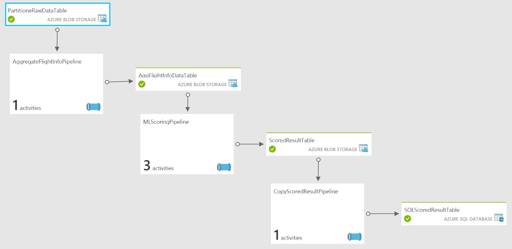

<properties
    pageTitle="技術指南太空及其他企業版中的預測維護 Cortana 智慧解決方案範本 |Microsoft Azure"
    description="使用 Microsoft Cortana 智慧方案範本中太空、 公用程式及交通預測維護技術指南。"
    services="cortana-analytics"
    documentationCenter=""
    authors="fboylu"
    manager="jhubbard"
    editor="cgronlun"/>

<tags
    ms.service="cortana-analytics"
    ms.workload="data-services"
    ms.tgt_pltfrm="na"
    ms.devlang="na"
    ms.topic="article"
    ms.date="09/13/2016"
    ms.author="fboylu" />

# 技術指南太空及其他企業版中的預測維護 Cortana 智慧解決方案範本

## **通知**
本文是由資料科學家 Yan 丈 （中國），Gauher Shaheen Fidan Boylu 代表與軟體工程師 microsoft Dan Grecoe 撰寫。

## **概觀**

方案範本的設計加速建置上方 Cortana 智慧套件 E2E 示範程序。 部署的範本會佈建您具有必要的 Cortana 智慧元件的訂閱，並建立他們之間的關聯性。 它也設資料管線，您將下載並部署解決方案範本後，您的本機電腦上安裝的資料產生器應用程式所產生的範例資料。 從產生器所產生的資料會產生的資料管線和開始產生然後視覺化 Power BI 儀表板上的電腦學習預測。 部署程序會引導您完成設定您的方案認證的幾個步驟。 請確定您錄製這些認證，例如方案名稱、 使用者名稱和部署期間所提供的密碼。  

這份文件的目標是要說明的參考架構與佈建在您的訂閱，屬於此方案範本中的不同元件。 文件也會說明如何使用您自己能看到的深入見解及預測從您自己的資料的實際資料要取代範例資料。 此外，在文件將告訴您需要修改，如果您想要自訂您自己的資料與解決方案的解決方案範本組件。 如何建立此方案範本的 [Power BI 儀表板上的指示會提供結尾。

>[AZURE.TIP] 您可以下載及列印[這份文件的 PDF 版](http://download.microsoft.com/download/F/4/D/F4D7D208-D080-42ED-8813-6030D23329E9/cortana-analytics-technical-guide-predictive-maintenance.pdf)。

## **一窺全貌**

部署解決方案時，會啟用 Cortana 分析套件中的各種 Azure 服務 (*亦即*事件] 中心內，*串流分析、 HDInsight、 資料工廠、 電腦學習等*)。 上述架構圖表會顯示，高層級的如何從端對端建構航太方案範本預測進行的維修作業。 您可以為此服務佈建後在需要時相關的管線活動之後，才能執行與刪除，但 HDInsight 方案的部署以建立的解決方案範本圖表上按一下這些調查 azure 入口網站中的這些服務。
您可以下載[完整大小的圖表](http://download.microsoft.com/download/1/9/B/19B815F0-D1B0-4F67-AED3-A40544225FD1/ca-topologies-maintenance-prediction.png)。

下列各節說明每一段。

## **資料來源並 ingestion**

### 綜合資料來源

此範本所使用的資料來源產生從桌面及應用程式，您會下載成功部署在本機上執行。 您會發現下載並安裝這個應用程式屬性列中，當您選取第一個節點稱為預測維護資料產生器解決方案範本圖上的指示進行。 這個應用程式摘要[Azure 事件中心](#azure-event-hub)服務的資料點或將會用於解決方案流程的其餘部分中的事件。 這個資料來源是組成，或從使用[Turbofan 引擎降低模擬資料集](http://ti.arc.nasa.gov/tech/dash/pcoe/prognostic-data-repository/#turbofan) [NASA 資料存放庫](http://ti.arc.nasa.gov/tech/dash/pcoe/prognostic-data-repository/)的公用資料。

事件產生應用程式會填入 Azure 事件中心，只有在您的電腦上執行時，只。

### Azure 事件中心

[Azure 事件中心](https://azure.microsoft.com/services/event-hubs/)服務會提供綜合上述的資料來源所輸入的收件者。

## **資料準備及分析**

### Azure 資料流狀況分析

[Azure 資料流分析](https://azure.microsoft.com/services/stream-analytics/)服務用來提供附近[Azure 事件中心](#azure-event-hub)服務輸入資料流即時分析及發佈到[Power BI](https://powerbi.microsoft.com)儀表板，以及封存所有原始的連入事件[Azure 儲存體](https://azure.microsoft.com/services/storage/)服務稍後處理[Azure 資料工廠](https://azure.microsoft.com/documentation/services/data-factory/)服務的結果。

### HD 獲得深入見解自訂彙總

Azure HD 充分服務用來執行[登錄區](http://blogs.msdn.com/b/bigdatasupport/archive/2013/11/11/get-started-with-hive-on-hdinsight.aspx)（Azure 資料工廠協調） 的指令碼提供的彙總所使用的 Azure 資料流分析服務封存的原始事件。

### Azure 機器學習

使用[Azure 電腦學習](https://azure.microsoft.com/services/machine-learning/)服務 （Azure 資料工廠協調） 剩餘年限 (RUL) 指定收到的輸入特定飛機引擎上進行預測。

## **資料發佈**

### Azure SQL 資料庫服務

[Azure SQL 資料庫](https://azure.microsoft.com/services/sql-database/)服務用來儲存 （受管理的 Azure 資料工廠） 將會用在[Power BI](https://powerbi.microsoft.com)儀表板 Azure 電腦學習服務接收預測。

## **資料使用**

### Power BI

[Power BI](https://powerbi.microsoft.com)服務用來顯示包含彙總和[Azure 資料流分析](https://azure.microsoft.com/services/stream-analytics/)服務所提供的通知，以及儲存在[Azure SQL 資料庫](https://azure.microsoft.com/services/sql-database/)中使用[Azure 電腦學習](https://azure.microsoft.com/services/machine-learning/)服務製作 RUL 預測的儀表板。 如需如何建立此方案範本的 [Power BI 儀表板上的指示，請參閱下方的一節。

## **如何以將在自己的資料**

本節說明如何將 Azure 自己的資料，您匯入此架構的資料區域需要變更。

不太任何資料集，您將會比對用來使用此方案範本的[Turbofan 引擎降低模擬資料集](http://ti.arc.nasa.gov/tech/dash/pcoe/prognostic-data-repository/#turbofan)的資料集。 瞭解您的資料，需求會在您修改此範本，使用您自己的資料的方式很重要。 如果這是您第一份揭露 Azure 電腦學習服務，您可以取得的簡介[如何建立您的第一個實驗](machine-learning-create-experiment.md)中使用範例。

下列各節將討論的章節會引入新的資料集時，需要修改的範本。

### Azure 事件中心

Azure 事件中心服務，是非常一般，資料發佈中樞 CSV 或 JSON 格式。 沒有特殊的處理會發生在 Azure 事件中心內，但瞭解送入的資料。

這份文件不說明如何內嵌您的資料，但您可以輕鬆地事件或傳送資料到 Azure 事件集線器使用事件中心 API。

### Azure 資料流狀況分析

Azure 資料流分析服務用來提供附近即時分析，以資料流讀取和輸出資料來源的任何數字。

Azure 資料流分析查詢預測進行的維修作業航太解決方案範本，包含四個子查詢，每個耗用的事件，從 Azure 事件中心服務，以及需要輸出四個不同的位置。 這些輸出包含三個 Power BI 資料集和一個 Azure 儲存位置。

可以找到 Azure 資料流分析查詢︰

-   登入 Azure 入口網站

-   尋找資料流分析工作解決方案部署時產生的 （*例如*， **maintenancesa02asapbi**和**maintenancesa02asablob**預測進行的維修作業方案）

-   選取

    -   若要檢視查詢輸入的***輸入***

    -   若要檢視查詢本身的***查詢***

    -   若要檢視不同的輸出會***將輸出***

MSDN 上的[資料流分析查詢參照](https://msdn.microsoft.com/library/azure/dn834998.aspx)中找 Azure 資料流分析查詢建築的相關資訊。

在本方案中，查詢輸出使用三個資料集內送資料流提供為此方案範本的一部分的 Power BI 儀表板的即時分析資訊附近。 因為沒有明確瞭解相關的內送的資料格式，這些查詢需要更改根據您的資料格式。

在第二個資料流分析工作**maintenancesa02asablob**查詢只將輸出至[Azure 儲存體](https://azure.microsoft.com/services/storage/)的所有[事件中心](https://azure.microsoft.com/services/event-hubs/)事件，並為完整的事件資訊會傳送至儲存空間，因此需要不論您資料的格式為何沒有變更。

### Azure 資料工廠

[Azure 資料工廠](https://azure.microsoft.com/documentation/services/data-factory/)服務協調移動及處理資料。 預測航太解決方案範本進行的維修作業中資料 factory 是組成的三個[管線](../data-factory/data-factory-create-pipelines.md)移動及處理使用各種不同的技術資料。  您可以存取您的資料工廠開啟底部的 [方案範本圖表資料工廠節點建立的解決方案部署。 這會將您帶往您 Azure 入口網站上的資料工廠。 如果您看到錯誤，在您的資料集，都可以略那些，因為它們是因為資料工廠部署之前開始的資料產生器。 這些錯誤不會使您資料的工廠無法運作。

本節將討論的必要的[管線](../data-factory/data-factory-create-pipelines.md)和[Azure 資料工廠](https://azure.microsoft.com/documentation/services/data-factory/)中所包含的[活動](../data-factory/data-factory-create-pipelines.md)。 以下是方案的 [圖表] 檢視。

兩個管線這個工廠包含用來分割和彙總資料的[登錄區](http://blogs.msdn.com/b/bigdatasupport/archive/2013/11/11/get-started-with-hive-on-hdinsight.aspx)指令碼。 當所述，指令碼會位於在安裝期間所建立的[Azure 儲存體](https://azure.microsoft.com/services/storage/)帳戶。 其位置會是︰ maintenancesascript\\\\指令碼\\\\登錄區\\\\ （或 https://[Your 解決方案 name].blob.core.windows.net/maintenancesascript）。

類似於[Azure 資料流分析](#azure-stream-analytics-1)查詢，[登錄區](http://blogs.msdn.com/b/bigdatasupport/archive/2013/11/11/get-started-with-hive-on-hdinsight.aspx)指令碼隱含瞭解內送的資料格式，這些查詢所需變更根據您的資料格式及[功能工程](machine-learning-feature-selection-and-engineering.md)需求。

#### *AggregateFlightInfoPipeline*

此[管道的郵件](../data-factory/data-factory-create-pipelines.md)包含單一活動-使用執行[登錄區](http://blogs.msdn.com/b/bigdatasupport/archive/2013/11/11/get-started-with-hive-on-hdinsight.aspx)指令碼來分割資料放在[Azure 儲存體](https://azure.microsoft.com/services/storage/)中[Azure 資料流分析](https://azure.microsoft.com/services/stream-analytics/)工作期間[HDInsightLinkedService](https://msdn.microsoft.com/library/azure/dn893526.aspx) [HDInsightHive](../data-factory/data-factory-hive-activity.md)活動。

此分割任務的[登錄區](http://blogs.msdn.com/b/bigdatasupport/archive/2013/11/11/get-started-with-hive-on-hdinsight.aspx)指令碼是***AggregateFlightInfo.hql***

#### *MLScoringPipeline*

此[管道的郵件](../data-factory/data-factory-create-pipelines.md)包含多個活動與其最後的結果是從[Azure 電腦學習](https://azure.microsoft.com/services/machine-learning/)scored 的預測嘗試此方案範本。

包含在此活動有︰

-   使用執行[登錄區](http://blogs.msdn.com/b/bigdatasupport/archive/2013/11/11/get-started-with-hive-on-hdinsight.aspx)指令碼來執行彙總和[Azure 電腦學習](https://azure.microsoft.com/services/machine-learning/)實驗所需的功能工程[HDInsightLinkedService](https://msdn.microsoft.com/library/azure/dn893526.aspx) [HDInsightHive](../data-factory/data-factory-hive-activity.md)活動。
    此分割任務的[登錄區](http://blogs.msdn.com/b/bigdatasupport/archive/2013/11/11/get-started-with-hive-on-hdinsight.aspx)指令碼是***PrepareMLInput.hql***。

-   將結果從[HDInsightHive](../data-factory/data-factory-hive-activity.md)活動移至單一[Azure 儲存體](https://azure.microsoft.com/services/storage/)blob 的可存取[AzureMLBatchScoring](https://msdn.microsoft.com/library/azure/dn894009.aspx)活動的[複製](https://msdn.microsoft.com/library/azure/dn835035.aspx)活動。

-   通話[Azure 電腦學習](https://azure.microsoft.com/services/machine-learning/)的[AzureMLBatchScoring](https://msdn.microsoft.com/library/azure/dn894009.aspx)活動嘗試而導致放在單一[Azure 儲存體](https://azure.microsoft.com/services/storage/)blob 的結果。

#### *CopyScoredResultPipeline*

此[管道的郵件](../data-factory/data-factory-create-pipelines.md)包含單一活動-將[Azure 電腦學習](#azure-machine-learning)的結果嘗試從***MLScoringPipeline***移至[Azure SQL 資料庫](https://azure.microsoft.com/services/sql-database/)佈解決方案範本安裝的一部分的[複製](https://msdn.microsoft.com/library/azure/dn835035.aspx)活動。

### Azure 機器學習

[Azure 電腦學習](https://azure.microsoft.com/services/machine-learning/)實驗用於此方案範本提供剩餘有用生活 (RUL) 的飛機引擎。 實驗特定到消耗資料集，因此需要修改或取代特殊帶中的資料。

Azure 電腦學習實驗的建立方式的相關資訊，請參閱[預測進行的維修作業︰ 第 3 資料準備工作及功能工程的步驟 1](http://gallery.cortanaanalytics.com/Experiment/Predictive-Maintenance-Step-1-of-3-data-preparation-and-feature-engineering-2)。

## **監控進度**
 啟動資料產生器，管線開始取得 hydrated 後解決方案的不同元件啟動動作下列資料工廠所發出的命令將選定。 有兩種方法您可以監視管道的郵件。

1. 其中一個資料流分析工作的原始的內送資料寫入 blob 儲存體。 如果您按一下 Blob 儲存體元件，您的方案從畫面上您已成功部署解決方案和右側面板，然後按一下 [開啟，會將您帶往[管理入口網站](https://portal.azure.com/)。 一次，按一下二進位大型物件。 在下一步] 面板中，您會看到容器的清單。 按一下**maintenancesadata**。 在下一步] 面板中，您會看到 [ **rawdata** ] 資料夾。 在 rawdata] 資料夾中，您會看到資料夾的名稱，例如小時 = 17 小時 = 18 等。如果您看到這些資料夾時，就表示的原始資料成功所產生的電腦上與儲存在 blob 儲存體。 您應該會看到這些資料夾中 mb 應有有限大小的 csv 檔案。

2. 管線的最後一個步驟是將 SQL 資料庫撰寫資料 （例如從電腦學習預測）。 您可能必須等候最大值的資料顯示在 SQL 資料庫中的三個小時。 監控資料量有 SQL 資料庫中的其中一個方法是透過[azure 入口網站](https://manage.windowsazure.com/)。在 [左] 面板上找出 SQL 資料庫並按一下它。 接著找出您的資料庫**pmaintenancedb** ，然後按一下它。 在下一個頁面底部，按一下 [on 管理

    .

    在這裡，您可以按一下新的查詢和資料列 (例如從 PMResult 選取 count(*)) 數目的查詢。 當您的資料庫規模擴大時，應該增加的資料表中的列數。

## **Power BI 儀表板**

### 概觀

本節說明如何設定 Power BI 儀表板，若要從 Azure 資料流分析 （熱門的路徑） 的即時資料視覺化，以及從 Azure 電腦學習 （低溫路徑） 的批次預測結果。

### 設定低溫路徑儀表板

在低溫路徑資料管線，不可或缺的目標是取得每個飛機引擎預測 RUL （剩餘生命週期），一旦完成飛行 （循環圖）。 預測結果就會更新，可預測過去 3 的時間完成飛行飛機引擎每 3 小時。

Power BI 連線至 Azure SQL 資料庫作為資料來源，預測結果的儲存位置。 附註︰ 1） 在部署您的方案，實數的預測會顯示在資料庫 3 小時內。
隨附產生器下載 pbix 檔案包含一些種子資料，讓您可能會立即建立 Power BI 儀表板。 2） 在此步驟中，前提是下載並安裝免費的軟體[Power BI desktop](https://powerbi.microsoft.com/documentation/powerbi-desktop-get-the-desktop/)。

下列步驟將引導您如何開始一次包含資料 （*例如*解決方案部署的 SQL 資料庫連線 pbix 檔案。 預測結果） 視覺效果。

1.  取得資料庫認證。

    移至下一個步驟之前，您會需要**資料庫伺服器的名稱、 資料庫名稱、 使用者名稱和密碼**。 以下是指導您如何找到這些步驟。

    -   後**Azure SQL 資料庫 '**解決方案範本圖表上開啟綠色，請按一下它，然後按一下 [ **」 開啟 「**。

    -   您會看到新瀏覽器] 索引標籤/視窗顯示於 Azure 入口網站頁面。 按一下 [左] 面板**」 資源群組]** 。

    -   選取您所使用的部署解決方案的訂閱，然後選取**' YourSolutionName\_ResourceGroup'**。

    -   在 [新快顯] 面板中，按一下 [圖示就能存取您的資料庫。 您的資料庫名稱是旁這個圖示 （*例如*， **「 pmaintenancedb 」**），以及**資料庫伺服器的名稱**會列在 [伺服器] 名稱屬性和看起來應該像**YourSoutionName.database.windows.net**。

    -   您的資料庫**的使用者名稱**和**密碼**是相同的使用者名稱和密碼先前錄製期間部署方案。

2.  使用 Power BI Desktop 中更新低溫路徑報表檔案的資料來源]。

    -   在您的電腦，您下載並解壓縮產生器檔案的位置上的資料夾，按兩下 [**中\\PredictiveMaintenanceAerospace.pbix**檔案。 如果您開啟檔案時，您會看到任何警告訊息，請忽略這些錯誤。 上方的檔案]，按一下 [**編輯查詢**]。

        

    -   您會看到兩個資料表， **RemainingUsefulLife**和**PMResult**。 選取第一個資料表，然後按一下右側的**[查詢設定]**面板上的 [**套用步驟**底下的**[來源]**旁。 略過任何顯示的警告訊息]。

    -   在快顯視窗中，您自己的伺服器和資料庫名稱取代**[伺服器]**和**[資料庫]** ，然後按一下**[確定]**。 伺服器名稱，請確定您指定的連接埠 1433 (**YourSoutionName.database.windows.net，1433年**)。 將資料庫欄位保留為**pmaintenancedb**。 略過的畫面顯示的警告訊息]。

    -   中的下一個快顯視窗，您會看到這兩個選項，在左窗格 （**Windows**和**資料庫**）。 按一下**[資料庫]**中，填寫您的**「 使用者名稱]**和**[密碼]** （這是使用者名稱和密碼，您可以輸入當您第一次部署解決方案，並建立 Azure SQL 資料庫）。 在 [***選取要套用至這些設定的層級***，請核取資料庫層級的選項。 然後按一下**[連線]**。

    -   在第二個資料表**PMResult**上按一下，然後按一下 [  **「 來源 」**在右側的**[查詢設定]**面板中，**套用步驟**旁和更新的伺服器和資料庫的名稱，如上述步驟，然後按一下 [確定]。

    -   一旦您引導至前一頁，請關閉視窗。 就會出現一則訊息分門別類-按一下 [**套用**]。 最後，按一下 [**儲存**] 按鈕，以儲存變更]。 Power BI 檔案現在已建立連線到伺服器。 如果是空的視覺效果，請確定清除圖例的右上角的 [橡皮擦] 圖示，即可呈現的所有資料的視覺效果上的選擇。 使用 [重新整理] 按鈕，以反映新的資料視覺效果。 開始時，您只會看到種子資料對視覺效果為資料 factory 排程重新整理每 3 小時。 3 小時後，您會看到時重新整理的資料，反映在您的視覺效果中的新預測。

3.  （選用）[Power](http://www.powerbi.com/)bi 線上發佈低溫路徑儀表板。 請注意此步驟中需要 Power BI 帳戶 （或 Office 365 帳戶）。

    -   按一下**[發行]** ，然後幾秒鐘稍後會出現一個視窗顯示 「 發佈至 Power BI 成功 ！ 」 綠色核取記號。 按一下下列 「 開啟 PredictiveMaintenanceAerospace.pbix 在 Power BI 」 連結。 若要尋找的詳細的指示，請參閱[從 Power BI Desktop 發佈](https://support.powerbi.com/knowledgebase/articles/461278-publish-from-power-bi-desktop)。

    -   若要建立新的儀表板︰ 按一下 [**+**旁在左窗格的 [**儀表板**] 區段的符號。 輸入此新儀表板的名稱 「 預測進行的維修作業示範 」。

    -   一旦您開啟報表，請按一下 [釘選至您的儀表板的所有視覺效果。 若要尋找的詳細的指示，請參閱[從報表的 Power BI 儀表板方塊的 Pin](https://support.powerbi.com/knowledgebase/articles/430323-pin-a-tile-to-a-power-bi-dashboard-from-a-report)。
    移至儀表板頁面與調整大小和位置的視覺效果和編輯其標題。 若要尋找如何編輯磚的詳細的指示，請參閱[編輯磚，以調整大小、 移動、 重新命名、 pin、 刪除、 新增超連結](https://powerbi.microsoft.com/documentation/powerbi-service-edit-a-tile-in-a-dashboard/#rename)。 以下是範例儀表板與釘選到其部分低溫路徑視覺效果。  根據多久您執行您的資料產生器，請在視覺效果上的數字可能會不同。
     
    
 
    -   排程重新整理的資料，將游標移**PredictiveMaintenanceAerospace**資料集，請按一下 [  ]，然後選擇 [**重新整理排程**。
 
        **附註︰**如果您看到警告操作，按一下 [**編輯認證**，請確定您的資料庫認證是所步驟 1 所述的相同。
 
    
 
    -   展開 [**重新整理排程**] 區段。 開啟 「 保留您的資料保持最新狀態]。
     
    -   排定的重新整理，根據您的需求。 若要尋找詳細資訊，請參閱[Power BI 中的資料重新整理](https://support.powerbi.com/knowledgebase/articles/474669-data-refresh-in-power-bi)。

### 設定快速鍵路徑儀表板

下列步驟會引導您以視覺化方式呈現資料流分析作業所產生的解決方案部署次的即時資料輸出的方式。 [Power BI 線上](http://www.powerbi.com/)帳戶，才能執行下列步驟。 如果您沒有帳戶，您可以[建立一個](https://powerbi.microsoft.com/pricing)。

1.  新增 Power BI 輸出中 Azure 資料流分析 (ASA)。

    -  您必須遵循中的指示[Azure 資料流分析及 Power BI︰ 串流資料的即時掌握即時分析儀表板](stream-analytics-power-bi-dashboard.md)設定為 Power BI 儀表板 Azure 資料流分析工作的成果。
    - ASA 查詢有三個輸出**aircraftmonitor**、 **aircraftalert**，且**flightsbyhour**。 按一下 [查詢] 索引標籤上，您可以檢視查詢。 對應至每一個表格，您必須將輸出至 ASA。 當您新增第一個輸出 (*例如* **aircraftmonitor**) 請確認的**輸出別名**、**資料集的名稱**及**表格名稱**相同 (**aircraftmonitor**)。 重複步驟以新增輸出**aircraftalert**，和**flightsbyhour**。 一旦您已新增三種輸出資料表，並使用 ASA 工作，您應收到的確認訊息 （*例如*，「 開始串流分析工作 maintenancesa02asapbi 成功 」）。

2. 登入[Power BI 線上](http://www.powerbi.com)

    -   在左側面板資料集] 區段中 [我的工作區]***資料集***名稱**aircraftmonitor**、 **aircraftalert**及**flightsbyhour**應該會出現。這是您從 Azure 資料流分析推入前一個步驟的串流資料。資料集**flightsbyhour**可能不會顯示為因為其後面的 SQL 查詢的性質的其他兩個資料集同時中。 不過，它應該顯示後小時。
    -   請確定已開啟 [***視覺效果***] 窗格，而且會顯示在螢幕右側。

3. Power BI 將傳送的資料之後，您就可以開始視覺化串流的資料。 以下是以某些快速鍵路徑視覺效果範例儀表板釘選到它。 您可以建立其他根據適當的資料集的儀表板方塊。 根據多久您執行您的資料產生器，請在視覺效果上的數字可能會不同。

    

4. 以下是建立其中一個磚上述步驟 – 」 艦隊檢視的感應器 11 和比較臨界值 48.26 」 磚︰

    -   按一下 [資料集**aircraftmonitor**左邊面板資料集一節]。

    -   按一下 [**折線圖**] 圖示。

    -   以便在**視覺效果**] 窗格中顯示在 [座標軸] 下，請按一下 [**欄位**] 窗格中的**處理**。

    -   按一下 「 s11 」 和 「 s11\_通知 」，使其同時出現在 [值] 底下。 按一下 [ **s11** ] 旁的小箭號和**s11\_提醒**，將 [加總] 變更為 「 平均 」。

    -   在頂端按一下 [**儲存**並命名報表 」 aircraftmonitor 」。 名為 「 aircraftmonitor 」 報表會顯示在左側的 [**導覽**] 窗格中的 [**報表**] 區段中。

    -   按一下右上角的這個折線圖上的 [**視覺釘選**圖示。 供您選擇儀表板，可能會顯示 「 釘選至儀表板] 視窗。 選取 「 預測進行的維修作業示範 」，然後按一下 「 固定 」。

    -   將滑鼠停留在這個並排顯示在儀表板上，按一下 [若要變更其標題至 「 艦隊檢視的感應器 11 和比較臨界值 48.26 」 和 「 跨艦隊一段時間的平均值 」 的子標題右上角的 [「 編輯 」] 圖示。

## **如何刪除您的方案**
請確定您未使用方案，如下所執行的資料產生器會產生更高的成本時停止資料產生器。 請如果您不使用它，刪除方案。 刪除您的方案，會刪除部署解決方案時，在您的訂閱佈建的所有元件。 若要刪除您的方案名稱解決方案範本的 [左] 面板中的方案按一下，然後按一下 [刪除]。

## **成本估計工具**

下列兩種工具可協助您進一步瞭解在您的訂閱中，執行航太解決方案範本的預測所進行的維修作業所需的總成本︰

-   [Microsoft Azure 成本估算程式工具 （線上）](https://azure.microsoft.com/pricing/calculator/)

-   [Microsoft Azure 成本估算程式工具 （桌面）](http://www.microsoft.com/download/details.aspx?id=43376)
