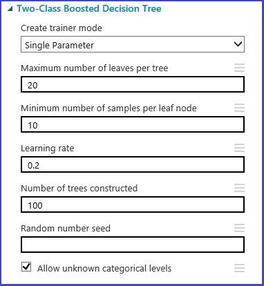

<properties
    pageTitle="選擇參數，以最佳化您的演算法在 Azure 機器學習 |Microsoft Azure"
    description="說明如何選擇最佳參數設為 Azure 機器學習中演算法。"
    services="machine-learning"
    documentationCenter=""
    authors="bradsev"
    manager="jhubbard"
    editor="cgronlun"/>

<tags
    ms.service="machine-learning"
    ms.workload="data-services"
    ms.tgt_pltfrm="na"
    ms.devlang="na"
    ms.topic="article"
    ms.date="09/12/2016"
    ms.author="bradsev" />

# 選擇參數，以最佳化您的 Azure 機器學習演算法

本主題說明如何選擇設定在 Azure 機器學習演算法右 hyperparameter。 大部分的機器學習演算法有設定的參數。 當您訓練模型時，您需要提供這些參數的值。 訓練模型的功效取決於您選擇的模型參數。 尋找最佳的參數集的程序稱為*模型選取項目*。

[AZURE.INCLUDE [machine-learning-free-trial](../../includes/machine-learning-free-trial.md)]

有各種方法來執行模型選取項目。 在機器學習跨驗證是其中一個最廣泛使用方法的模型選取項目，而是預設的模型選取範圍機制在 Azure 機器學習。 Azure 機器學習支援 R 和 Python，因為您可以一律使用 R 或 Python 實作他們自己的模型選取項目機制。

有收件人尋找最佳的參數組的程序的四個步驟：

1.  **定義參數空間**： 的演算法，先決定您想要考慮的確切參數值。
2.  **定義跨驗證設定**： 決定如何選擇跨驗證折資料集。
3.  **定義衡量標準**： 決定要用於決定最佳的參數，例如正確性集何種評量、 根平均數平方錯誤、 precision、 重新叫用或 f 分數。
4.  **訓練評估，並比較**： 針對每個唯一的參數值的組合，跨驗證是由執行並根據您定義的 [錯誤] 計量。 評估及之後比較，您可以選擇的效能最佳的模型。

下圖說明如何達成這 Azure 機器學習中的顯示。

## 定義參數空間
您可以定義在模型初始化步驟設定的參數。 [參數] 窗格的所有機器學習演算法有兩種量身模式：*單一參數*和*參數範圍*。 選擇參數範圍模式。 在參數範圍模式中，您可以輸入多個值的每個參數。 您可以在文字方塊中輸入逗點分隔值。

 或者，您可以定義格線及指向產生搭配**使用的範圍產生器**的總數的最大和最小的點。 根據預設，在線性刻度產生的參數值。 但如果會檢查**對數刻度做**、 值所產生的對數刻度做 （亦即相鄰資料點的比例為而不是其差異常數）。 整數參數，您可以定義範圍使用連字號。 例如，"1-10"表示所有介於 1 到 10 （兩者皆 （含）） 之間的整數表單的參數組。 也支援混合的模式。 例如，此參數設定"1-10 20 50 」 將包括整數 1-10 20 及 50。

## 定義跨驗證折
[分割區和範例][partition-and-sample]模組可用來隨機指派折到資料。 在模組的下列範例設定，我們會定義五個折及隨機摺卡號碼指派給範例執行個體。

## 定義評量
[調整模型 Hyperparameters] [tune-model-hyperparameters]模組提供支援法則選擇最佳一組參數指定的演算法和資料集。 除了其他資訊有關訓練此模型中，[**內容**] 窗格的本單元包括決定最佳的參數組的計量。 分別有兩種不同的下拉式清單方塊的分類與迴歸演算法。 如果考量下的演算法是分類演算法，會忽略迴歸衡量標準，反之亦然。 在本例特定評量是**正確性**。   

## 訓練、 評估及比較  
相同的[調整模型 Hyperparameters] [tune-model-hyperparameters]模組訓練對應的參數組的所有模型、 評估各種評量，並接著會建立根據您選擇評量的最受過訓練的模型。 本單元有兩個必要項目輸入：

* 非專業學習者
* 資料集

模組也有輸入選用的資料集。 必要的資料輸入至式摺卡資訊連線資料集。 如果資料集未指派任何摺卡資訊，然後 10-fold 跨驗證自動以執行預設值。 如果未完成摺卡工作分派及驗證資料集提供選擇性的資料集連接埠，然後選擇訓練測試模式並的第一個資料集用來訓練每一個參數組合的模型。

模型則會評估上驗證資料集。 左的輸出連接埠模組的顯示不同的評量函數的參數值。 右輸出連接埠提供對應的訓練的模型根據所選擇的評量 （在此例中的**正確性**） 的效能最佳模型。  

您可以看到選擇將視覺化右輸出連接埠的確切參數。 此模型可用計分測試組或 operationalized 的 web 服務中做為受過訓練的模型儲存之後。

<!-- Module References -->
[partition-and-sample]: https://msdn.microsoft.com/library/azure/a8726e34-1b3e-4515-b59a-3e4a475654b8/
[tune-model-hyperparameters]: https://msdn.microsoft.com/library/azure/038d91b6-c2f2-42a1-9215-1f2c20ed1b40/
