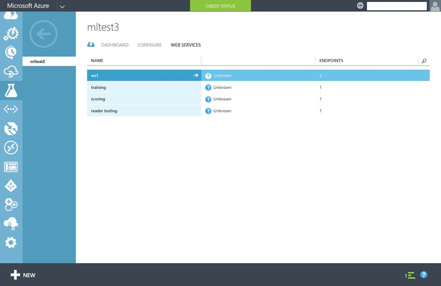

<properties
    pageTitle="在電腦學習建立 Web 服務端點 |Microsoft Azure"
    description="在 Azure 電腦學習建立 Web 服務端點"
    services="machine-learning"
    documentationCenter=""
    authors="hiteshmadan"
    manager="padou"
    editor="cgronlun"/>

<tags
    ms.service="machine-learning"
    ms.devlang="multiple"
    ms.topic="article"
    ms.tgt_pltfrm="na"
    ms.workload="tbd"
    ms.date="10/04/2016"
    ms.author="himad"/>

# 建立端點

>[AZURE.NOTE] 本主題將說明適用於傳統的 Web 服務的技巧。

當您建立 Web 服務的銷售轉寄給您的客戶時，您需要提供訓練的模型給每個仍會連結至 Web 服務建立的實驗的客戶。 此外，任何實驗的更新則應該套用選擇性地端點不覆寫自訂項目。

若要這麼做，Azure 電腦學習可讓您建立多個端點部署 Web 服務。 Web 服務中的每個端點是獨立收件者、 經流速控制，及管理。 每個端點是唯一的 URL 和發佈給客戶的授權鍵。

[AZURE.INCLUDE [machine-learning-free-trial](../../includes/machine-learning-free-trial.md)]

## 新增 Web 服務端點

有三種方式可以新增到 Web 服務的端點。

* 以程式設計方式
* 透過 Azure 機器學習 Web 服務入口網站
* 雖然 Azure 傳統入口網站

端點建立後，您可以使用它透過同步 Api，批次的 Api，並 excel 工作表。 除了加入透過這個 UI 的端點，您也可以使用端點管理 Api 以程式設計方式加入結束點。

 >[AZURE.NOTE] 如果您已新增額外的結束點到 Web 服務，您無法刪除的預設端點。

## 以程式設計方式加入端點

您可以新增端點，您使用以程式設計方式[AddEndpoint](https://github.com/raymondlaghaeian/AML_EndpointMgmt/blob/master/Program.cs)範例程式碼的 Web 服務。

## 新增端點，使用 [Azure 機器學習 Web 服務入口網站

1. 在電腦學習 Studio 中，[左方瀏覽] 欄中，按一下 [Web 服務。
2. 在 [Web 服務儀表板底部，按一下 [**管理結束點**]。 Azure 機器學習 Web 服務入口網站會開啟至 Web 服務的結束點] 頁面。
3. 按一下 [**新增**]。
4. 輸入的名稱和描述新的結束點。 結束點名稱必須是 24 字元或更少的長度，而且必須組成的英文小寫字母或數字。 選取記錄層級，以及是否啟用範例資料。 如需記錄的詳細資訊，請參閱[啟用電腦學習 Web 服務的記錄](machine-learning-web-services-logging.md)。

## 新增端點，使用 [Azure 傳統入口網站

1. 登入至[Azure 傳統入口網站](http://manage.windowsazure.com)，按一下左欄中的 [**電腦學習**。 按一下 [工作區，其中包含您感興趣的 Web 服務]。

    

2. 按一下 [ **Web 服務**]。

    

3. 按一下您想要查看可用的端點清單的 Web 服務。

    

4. 在頁面底部，按一下 [**新增結束點**]。 輸入的名稱與描述，請確定沒有其他端點具有相同名稱在此 Web 服務。 離開流速層級的預設值，除非您有特殊需求。 若要進一步瞭解節流，請參閱[縮放 API 結束點](machine-learning-scaling-webservice.md)。

    

## 後續步驟

[如何使用已發佈的 Azure 電腦學習 Web 服務](machine-learning-consume-web-services.md)。
