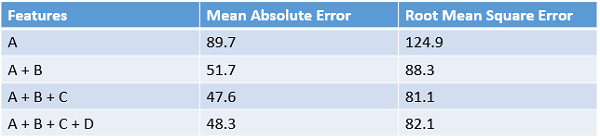

<properties
    pageTitle="工程 Cortana 分析程序中的功能 |Microsoft Azure" 
    description="說明的功能工程，並提供其角色的電腦學習資料增強程序中的範例。"
    services="machine-learning"
    documentationCenter=""
    authors="bradsev"
    manager="jhubbard"
    editor="cgronlun"/>

<tags
    ms.service="machine-learning"
    ms.workload="data-services"
    ms.tgt_pltfrm="na"
    ms.devlang="na"
    ms.topic="article"
    ms.date="09/19/2016"
    ms.author="zhangya;bradsev" />

# 工程 Cortana 分析程序中的功能 

本主題說明的功能工程，並提供其角色的電腦學習資料增強程序中的範例。 Azure 電腦學習 Studio 繪製用來說明此程序的範例。 

[AZURE.INCLUDE [cap-create-features-data-selector](../../includes/cap-create-features-selector.md)]

說明如何建立資料的功能，在不同環境中的主題此**功能表**連結。 這項工作是[小組資料科學程序 (TDSP)](https://azure.microsoft.com/documentation/learning-paths/cortana-analytics-process/)中的步驟。

工程嘗試預測提高學習演算法從原始資料，可協助進行學習程序建立功能的功能。 工程和，選取範圍的功能是一組件的大綱 TDSP[小組資料科學程序為何？](data-science-process-overview.md) 功能工程和選取範圍是 TDSP 的**開發功能**步驟的部分。 

* **工程功能**︰ 從現有的原始功能的資料，建立其他的相關功能，以增加學習演算法的預測 power，嘗試此程序。

* **功能選項**︰ 此程序選取原始資料功能鍵子集，以減少訓練問題的維度。

正常**功能工程**會先套用至產生其他功能，而且然後**功能選擇**步驟以利消除無關、 多餘或高度的關聯的功能。

電腦學習的訓練資料經常增強型所擷取的功能收集的原始資料。 學習如何分類的手寫字元圖像的內容中進行反向工程功能的範例是從原始元分佈資料建構有點密度對應的建立。 地圖可以協助您找出字元的邊緣效率只要直接使用原始的通訊群組。

[AZURE.INCLUDE [machine-learning-free-trial](../../includes/machine-learning-free-trial.md)]

## 建立功能從您的資料-工程的功能

矩陣組成的範例 （記錄或儲存在列中的觀察值），每一個都有一組的功能變數的儲存在欄中包含訓練資料。 指定實驗設計中的功能都必須描述資料中的模式。 雖然許多原始資料欄位可直接納入用來訓練模型的所選的功能集，通常是大小寫 （工程） 的其他功能需要建構從產生增強型的訓練資料集的原始資料中的功能。

當訓練模型時，提升資料集建立哪一類的功能？ 工程增強訓練課程的功能，可提供更佳的差異資料中的模式的資訊。 我們預期，提供不清楚擷取或原始的或現有的功能集輕鬆明顯的其他資訊的新功能。 但是這個程序圖案的項目。 音效和生產力的決策通常需要一些網域專業知識。

開始使用 Azure 電腦學習，時最簡單的方法掌握具體使用 Studio 中所提供的範例此程序。 此處所提供兩個範例︰

* 迴歸中的範例[safetystockllevel 租金數目的預測](http://gallery.cortanaintelligence.com/Experiment/Regression-Demand-estimation-4)受監督的實驗稱為目標值
* 使用[功能雜湊](https://msdn.microsoft.com/library/azure/c9a82660-2d9c-411d-8122-4d9e0b3ce92a/)文字採礦分類範例

### 範例 1︰ 新增暫時功能迴歸模型 ###

現在就讓我們使用實驗 」 Demand 預測的自行車 」 Azure 電腦學習 Studio 中示範如何工程迴歸分析任務的功能。 這項實驗的目標是預測的 bikes，也就是在特定月/日/小時內的 safetystockllevel 租金數目。 資料集 」 Safetystockllevel 租賃 UCI 資料集 」 會用來作為原始的輸入資料。 此資料集根據會保留在 [美國華盛頓州 DC safetystockllevel 租賃網路首都 Bikeshare 公司的實際資料。 資料集表示的 safetystockllevel 租金一天的年數 2011年 2012 年中的特定小時內，並包含 17379 列和 17 的欄。 原始的功能集包含天氣 （溫度/濕度/風速）]，然後輸入每日 (假日/weekday)。 預測該欄位為 「 計數通知: 「，表示在特定的小時內 safetystockllevel 租金和其範圍範圍從 1 到 977 計數。

以建構更有效率功能訓練資料模型所使用的相同演算法內建的四個迴歸分析，但四個不同的訓練資料集的目標。 四個資料集代表相同的原始輸入的資料，但功能的遞增數字設定。 這些功能會分組為四種類別︰

1. A = 天氣 + 假日 + weekday + 週末功能預測的日期
2. B = 已在每一個先前 12 小時出租的自行車的數字
3. C = 已出租在每一個在同一個小時前 12 天的自行車的數字
4. D = 自行車的已出租在每一個在同一個小時] 及 [的同一天之前 12 週數

功能設定 A 已存在於原始的原始資料，除了其他三個功能組會建立透過工程程序的功能。 功能設定 B 擷取 bikes 最新的需求。 功能設定在特定的小時 C 擷取自行車的要求。 功能在特定的小時] 及 [一週的特定日期設定 bikes D 擷取需求。 四個訓練資料集每個包含功能設定 A、 A + B、 A + B + C 及 A + B + C + D，分別。

Azure 電腦學習實驗中，這些四個訓練資料集的正確透過從預先處理輸入資料集的四個分支。 除了大部分分支，每個這些分支包含的左邊分別的建構及附加至匯入的資料集[執行 R 指令碼](https://msdn.microsoft.com/library/azure/30806023-392b-42e0-94d6-6b775a6e0fd5/)的模組，請在其中一組衍生 （功能設定 B、 C 和 D） 的功能。 下圖示範用來建立第二個左分支中的功能集 B R 指令碼。

下表摘要列出的四個模型效能結果的比較。 獲得最佳的結果會顯示由功能 A + B + C。 注意錯誤工資率會減少何時訓練資料中包含其他的功能集。 確認我們 presumption 功能集 B，C，提供迴歸分析任務的其他相關資訊。 但新增 D 功能似乎不提供任何其他減少錯誤工資率。

### 範例 2︰ 在文字採礦建立功能  

功能工程廣泛會套用文字採礦，例如 [文件分類和舉動分析相關的基本工作。 例如，我們要將文件分類成多個類別，一般的假設時，word/片語包含在一個文件類別是較不可能會發生在另一個文件中的類別。 中的另一個字，文字/片語分配的頻率是能夠特性不同的文件的類別。 文字採礦應用程式中的文字內容的各個部分通常作為輸入資料，因為工程程序的功能是建立所需涉及 word/片語頻率的功能。

若要完成這項工作，稱為**功能雜湊**技術會套用至有效率地變成索引中的任意文字功能。 而非特定的索引，此方法的功能套用雜湊函數的功能，並直接使用其雜湊值為索引關聯每個文字功能 （文字/片語）。

Azure 電腦學習，在有建立這些[功能雜湊](https://msdn.microsoft.com/library/azure/c9a82660-2d9c-411d-8122-4d9e0b3ce92a/)模組 word/片語功能方便。 下圖顯示使用本單元的範例。 輸入資料集包含兩個資料行︰ 範圍從 1 到 5、 書籍評等和實際檢閱內容。 此[功能雜湊](https://msdn.microsoft.com/library/azure/c9a82660-2d9c-411d-8122-4d9e0b3ce92a/)模組的目標是新增擷取一堆功能會顯示對應的單字的項目頻率 / 特定活頁簿內的離開檢閱。 若要使用此模組，我們需要完成下列步驟︰

* 首先，請選取 [包含輸入的文字的資料行 (「 欄 2 」 在這個範例中)。
* 第二，「 Hashing bitsize 」 設定為 8，這表示 2 ^8 = 256 功能將會建立。 會以 256 索引雜湊 word/階段中的所有文字。 這個參數 」 Hashing bitsize 」 的範圍從 1 到 31。 單字 / 離開比較不會進行雜湊到相同的索引設定設為較大的數字。
* 第三，將參數設定 「 N 克 「 2。 這會取得 unigrams （每個單字的功能） 和 bigrams （一對相鄰文字功能） 的項目頻率所輸入的文字。 參數 」 N 克 」 範圍從 0 到 10，亦即指出連續的文字功能中所包含的最大數目。  

下圖顯示什麼這些新功能看起來像。

## 結束時

工程和所選的功能會增加訓練程序以嘗試擷取資料中所包含的重要資訊的效率。 他們也改善 power，這些模型對於分類輸入的資料與其他強行預測感興趣的結果。 功能工程和選取範圍也可以讓更多運算容易處理學習合併。 它會以增強與然後減少的校正或訓練模型所需的功能。 以數學方式讀出]，選取訓練模型的功能是變數的一組最小獨立說明資料中的模式和成功預測結果。

請注意，它不一定不必執行功能工程或功能的選項。 是否需要或不取決於我們有或收集的資料與我們挑選，演算法的實驗目標。
 
