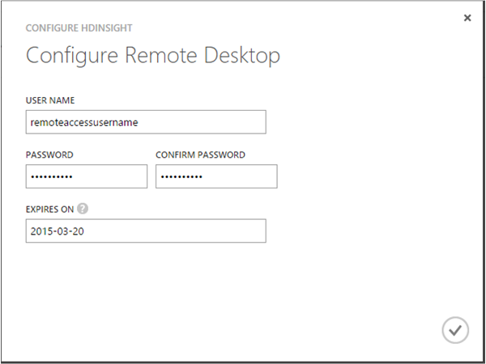

<properties 
    pageTitle="自訂小組資料科學程序 Hadoop 叢集 |Microsoft Azure" 
    description="自訂 Azure HDInsight Hadoop 叢集中提供的常用 Python 模組。"
    services="machine-learning" 
    documentationCenter="" 
    authors="bradsev" 
    manager="jhubbard" 
    editor="cgronlun"  />

<tags 
    ms.service="machine-learning" 
    ms.workload="data-services" 
    ms.tgt_pltfrm="na" 
    ms.devlang="na" 
    ms.topic="article" 
    ms.date="09/19/2016" 
    ms.author="hangzh;bradsev" />

# 自訂 Azure HDInsight Hadoop 叢集小組資料科學程序 

本文將說明如何自訂 HDInsight Hadoop 叢集安裝 64 位元 Anaconda (Python 2.7) 來每個節點時叢集已佈建為 HDInsight 服務。 也會顯示如何存取 headnode 提交到叢集自訂的工作。 這個自訂使許多熱門的 Python 模組所含的 Anaconda 此便利地為可供使用的設計用來處理登錄區記錄叢集使用者定義函數 (Udf)。 在這個案例中使用的程序指示，請參閱[如何送出登錄區查詢](machine-learning-data-science-move-hive-tables.md#submit)。

說明如何設定[小組資料科學程序 (TDSP)](data-science-process-overview.md)所使用的各種資料科學環境的主題連結下方的功能表。

[AZURE.INCLUDE [data-science-environment-setup](../../includes/cap-setup-environments.md)]

## 自訂 Azure HDInsight Hadoop 叢集

若要建立自訂的 HDInsight Hadoop 叢集，使用者需要登入[**傳統 Azure 入口網站**](https://manage.windowsazure.com/)，按一下 [**新增**]，請在左下角，，然後選取 [資料服務]-> [HDINSIGHT]-> [**建立自訂**叫出 [**叢集詳細資料**] 視窗。 

輸入要在設定第 1 頁，建立叢集的名稱，並接受其他欄位的預設值。 按一下 [箭號以移至下一個 [設定] 頁面上。 

在設定第 2 頁，輸入**資料的節點**數目、 選取**地區/虛擬網路**，然後選取**不對節點**和**資料節點**的大小。 按一下箭號，以移至下一個 [設定] 頁面。

>[AZURE.NOTE] **地區/虛擬網路**有相同的前往用於 HDInsight Hadoop 叢集儲存帳戶的區域。 否則，請在第四個的 [設定] 頁面，使用者想要使用的儲存空間帳戶不會出現在**帳戶名稱**的下拉式清單。

在設定第 3 頁，提供使用者名稱和密碼 HDInsight Hadoop 叢集。 **請不要**選取 [ _Enter 登錄區/Oozie Metastore_。 然後按一下箭號，以移至下一個 [設定] 頁面。 

在設定第 4 頁，指定儲存體帳戶名稱，預設的容器的 HDInsight Hadoop 叢集。 如果使用者選取_建立預設容器_**預設容器**下拉式清單中，將會建立叢集相同的名稱與容器。 按一下 [移到最後一個設定] 頁面上的箭號。

在最後一個**指令碼動作**設定] 頁面中，按一下**新增指令碼動作**] 按鈕，然後填入下列的值中的 [文字] 欄位。
 
* **名稱**的任何字串做為此指令碼動作的名稱。 
* **節點類型**︰ 選取**所有的節點**。 
* **指令碼 URI** - *http://getgoing.blob.core.windows.net/publicscripts/Azure_HDI_Setup_Windows.ps1* 
    * *publicscripts*是公用容器中儲存的帳戶 
    * 我們使用共用 PowerShell 指令碼檔，以促進 Azure 中的使用者公司*getgoing* 。 
* **參數**（保留空白）

最後，按一下要開始建立自訂的 HDInsight Hadoop 叢集的核取記號。 

## 存取 Hadoop 叢集的標頭節點

使用者必須啟用遠端存取 Hadoop 叢集 Azure 中，才能透過 RDP 存取 Hadoop 叢集主節點。 

1. [**傳統 Azure 入口網站**](https://manage.windowsazure.com/)登入選取左邊的**HDInsight** 、 Hadoop 叢集從清單中選取的叢集、 按一下 [**設定**] 索引標籤，再按一下 [**啟用遠端**的圖示，在頁面底部。
    
    

2. 在 [**設定遠端桌面**] 視窗中，輸入使用者名稱和密碼] 欄位中，然後選取 [遠端存取的到期日。 然後按一下 [啟用主節點 Hadoop 叢集的遠端存取的核取記號。

    
    
>[AZURE.NOTE] 使用者名稱和密碼遠端存取不的使用者名稱與建立 Hadoop 叢集時所使用的密碼。 這些是認證的一組個別。 此外，遠端存取的到期日必須是在目前的日期 7 天內。

啟用遠端存取後，按一下 [**連線**遠端頁面底部到主節點。 您登入 Hadoop 叢集主節點您先前指定遠端存取使用者輸入認證。

進階的分析程序中的下一個步驟對應[小組資料科學程序 (TDSP)](https://azure.microsoft.com/documentation/learning-paths/cortana-analytics-process/)中，也可能包括步驟，將資料移到 HDInsight、 [處理程序和範例並準備資料學習 Azure 電腦學習。

如需如何存取 Python 模組中包含的 Anaconda 從主節點叢集使用者定義函數 (Udf)，用來處理儲存在叢集登錄區記錄中的指示，請參閱[如何送出登錄區查詢](machine-learning-data-science-move-hive-tables.md#submit)。

 
