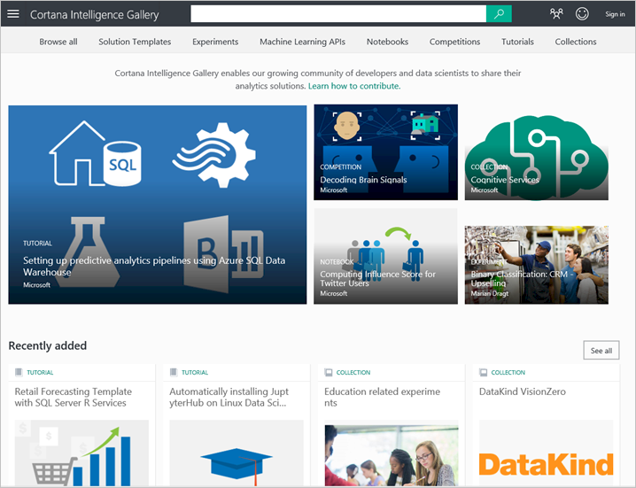

<properties
   pageTitle="複製其他人的資料科學工時-電腦學習範例 |Microsoft Azure"
   description="營業秘密的資料科學︰ 讓其他人為您進行工作。 請參閱叢集演算法範例例如 Cortana [分析] 庫中的範例。"
   keywords="資料科學範例，電腦學習範例中，叢集演算法，叢集演算法範例"
   services="machine-learning"
   documentationCenter="na"
   authors="cjgronlund"
   manager="jhubbard"
   editor="cjgronlund"/>

<tags
   ms.service="machine-learning"
   ms.devlang="na"
   ms.topic="article"
   ms.tgt_pltfrm="na"
   ms.workload="na"
   ms.date="10/20/2016"
   ms.author="cgronlun;garye"/>

# 複製執行資料科學將其他人的工作

## 初學者系列的影片 5︰ 資料科學

商業機密資料科學的其中一項取得其他人為您進行工作。 尋找要用於您的電腦學習實驗叢集演算法範例。

若要取得善用數列，請觀看所有。 [移至清單的視訊](#other-videos-in-this-series)

> [AZURE.VIDEO data-science-for-beginners-series-copy-other-peoples-work-to-do-data-science]

## 本系列中的其他影片

*資料科學初學者*是五個簡短的視訊中的資料科學的快速簡介。

  * 影片 1: [5 問題資料科學答案](machine-learning-data-science-for-beginners-the-5-questions-data-science-answers.md) *（5 分鐘 14 秒）*
  * 影片 2:[是您的資料供資料科學？](machine-learning-data-science-for-beginners-is-your-data-ready-for-data-science.md) *（4 min 56 秒）*
  * 影片 3︰[提出您的資料，您可以回答的問題](machine-learning-data-science-for-beginners-ask-a-question-you-can-answer-with-data.md) *（4 min 17 秒）*
  * 影片 4︰[預測答案的簡單的模型](machine-learning-data-science-for-beginners-predict-an-answer-with-a-simple-model.md) *（7 min 42 秒）*
  * 影片 5︰ 複製執行資料科學將其他人的工作

## 字幕︰ 複製執行資料科學將其他人的工作

歡迎使用一系列中的第五個視訊 」 資料科學初學者 」。

在此項目，您會發現位置]，尋找範例，您可以借用開始算起的您自己的工作。 如果您第一次觀看先前本系列影片，您可能會收到充分發揮這段影片。

商業機密資料科學的其中一項取得其他人為您進行工作。

## Cortana 智慧庫中找到範例

Microsoft 具有稱為[Azure 電腦學習]( https://azure.microsoft.com/services/machine-learning/)您嘗試免費歡迎使用雲端服務。 會提供您在工作區，便可嘗試使用不同的電腦學習演算法，以及當您擁有適合您執行的解決方案時，您可以在 web 服務為啟動。

這項服務的一部分是項目稱為**[Cortana 智慧圖庫](http://aka.ms/CortanaIntelligenceGallery)**。 包含各種不同的資源，一個是 Azure 電腦學習實驗或模型的人員已內建與其他人使用所提供的集合。 這些實驗可以運用想法與其他人可以讓您開始在自己的方案努力完成的工作的好方法。

您可以找到[aka.ms/CortanaIntelligenceGallery]( http://aka.ms/CortanaIntelligenceGallery)在圖庫。 每個人都歡迎使用，請瀏覽它。

如果您按一下頂端的**實驗**，您會看到最新且最常用的實驗圖庫中的數字。 您可以按一下 [**瀏覽所有**的畫面頂端搜尋其餘的實驗，並那里，您可以輸入搜尋字詞，然後選擇 [搜尋篩選。

## 尋找及使用叢集演算法範例

因此，例如，假設您想要查看如何叢集運作正常，範例，讓您搜尋的**「 「 叢集 」 「**實驗。

以下是最感興趣的項目某人提供給圖庫。

按一下該實驗，並取得說明此參與者並未，以及一些其結果的工時的網頁。

請注意，指出**Studio 中開啟**連結。

我可以按一下的且我從右至**Azure 電腦學習 Studio**。 它會建立實驗的複本，並將其放在自己的工作區中。 這包含參與者的資料集，所有的處理一樣，所有演算法的對方使用，以及如何將它們儲存出結果。

然後得到的起點。 我可以更換自己的資料，並執行模型自己變化。 這會提供我開始，並可讓我建立的使用者知道他們所執行的工作。

## 尋找實驗的示範電腦學習技巧

有其他實驗[Cortana 智慧圖庫](http://aka.ms/CortanaIntelligenceGallery)中的人員新增至資料科學提供使用方法範例，以便於。 例如，是將示範如何處理遺漏的值 （[處理遺漏值的方法](https://gallery.cortanaintelligence.com/Experiment/Methods-for-handling-missing-values-1)） 圖庫中的實驗。 它會逐步引導您完成 15 的不同方式的替代空值，並瞭解每一種方法，使用時機的優點。

[Cortana 智慧圖庫](http://aka.ms/CortanaIntelligenceGallery)是找出您可以用自己的方案，開始使用的工作實驗的位置。

請務必取出 」 資料科學的初學者 」 從 Microsoft Azure 電腦學習中的其他影片。

## 後續步驟

  * [請嘗試將第一個資料科學實驗 Azure 電腦學習](machine-learning-create-experiment.md)
  * [Microsoft Azure 上取得電腦學習的簡介](machine-learning-what-is-machine-learning.md)
