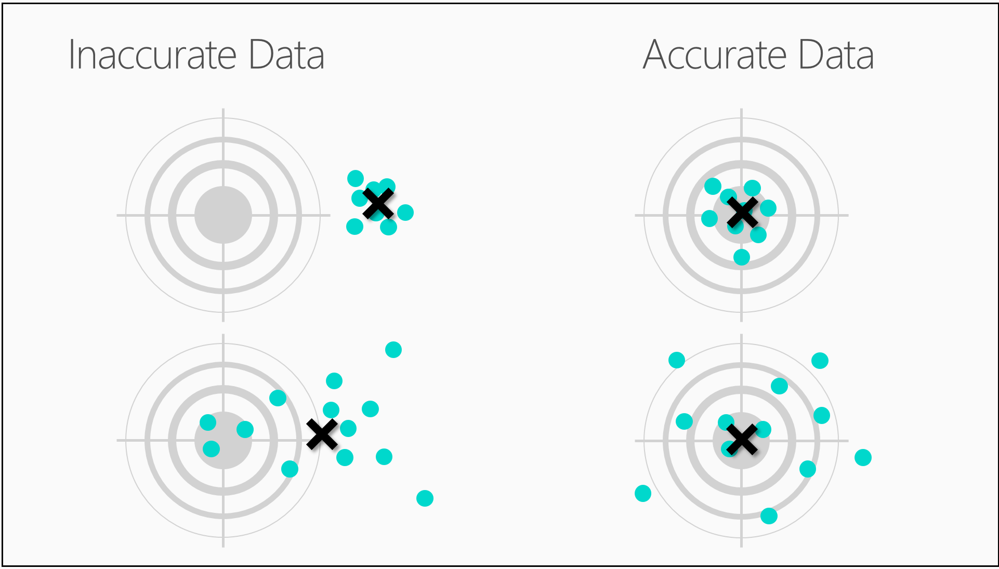

<properties
   pageTitle="是您的資料供資料科學？ 資料評估 |Microsoft Azure"
   description="瞭解資料以供資料科學的 4 準則。 初學者影片 2 的資料科學有具體的範例，以協助進行基本資料評估。"
   keywords="相關的資料，評估資料、 準備資料、 資料的準則資料準備"
   services="machine-learning"
   documentationCenter="na"
   authors="cjgronlund"
   manager="jhubbard"
   editor="cjgronlund"/>

<tags
   ms.service="machine-learning"
   ms.devlang="na"
   ms.topic="article"
   ms.tgt_pltfrm="na"
   ms.workload="na"
   ms.date="10/20/2016"
   ms.author="cgronlun;garye"/>

# 是您的資料供資料科學？

## 初學者系列的影片 2︰ 資料科學

瞭解如何評估您的資料，以確保其符合基本的準則，準備好進行資料科學。

若要取得善用數列，請觀看所有。 [移至清單的視訊](#other-videos-in-this-series)

> [AZURE.VIDEO data-science-for-beginners-series-is-your-data-ready-for-data-science]

## 本系列中的其他影片

*資料科學初學者*是五個簡短的視訊中的資料科學的快速簡介。

  * 影片 1: [5 問題資料科學答案](machine-learning-data-science-for-beginners-the-5-questions-data-science-answers.md) *（5 分鐘 14 秒）*
  * 影片 2︰ 資料，則您準備好進行資料科學嗎？
  * 影片 3︰[提出您的資料，您可以回答的問題](machine-learning-data-science-for-beginners-ask-a-question-you-can-answer-with-data.md) *（4 min 17 秒）*
  * 影片 4︰[預測答案的簡單的模型](machine-learning-data-science-for-beginners-predict-an-answer-with-a-simple-model.md) *（7 min 42 秒）*
  * 影片 5︰[複製執行資料科學將其他人的工作](machine-learning-data-science-for-beginners-copy-other-peoples-work-to-do-data-science.md) *（3 min 18 秒）*

## 字幕︰ 資料，則您準備好進行資料科學嗎？

歡迎使用 「 資料，則您準備好進行資料科學？ 」 數列*資料科學初學者*中的第二個影片。  

資料科學可以讓您要的答案之前，您可以讓它使用一些高品質要素。 如同 pizza，更好用越最終產品的元素。

## 資料的準則

因此，如果資料科學有我們需要合併某些因素。

我們需要的資料︰

  * 相關
  * 連線
  * 正確
  * 足以使用

## 您的資料是有用的？

因此，第一個成分-我們會需要與相關資料。

查看 [左側表格。 我們符合七波士頓列以外的人員，以其含酒精層級，在他們的最後一個遊戲，紅色 Sox 打擊牛奶接近便利性存放區中的價格。

這是完全合法的所有資料。 它的唯一錯誤是不相關。 這些個數字之間有明顯的關聯性。 如果帶給您的目前的價格，牛奶和 [紅色 Sox 打擊，沒有方法您可以猜測含酒精內容。

現在看看資料表右側。 我們開始計算的每位人員這次本文質量和計算的飲料他們透過數。  現在相關彼此每個資料列中的數字。 如果我本文提供您質量 Margaritas 我有數，您可能會讓推測我含酒精內容。

## 您已連線的資料？

下一步成分有連線的資料。

這裡有一些相關的資料上漢堡品質︰ grill 溫度、 patty 粗細]，並在本機的食物雜誌的評等。 但是請注意差距左側資料表中的功能。

大部分的資料集遺失部分值。 通常會有如下的文章並有方法可以解決辦法。 但您的資料是否有太多遺失，請開始瑞士凸圓的外觀。

如果您在左側查看表格有是多資料遺失，就會得到任何一種關聯之間 grill 溫度和 patty 粗細。 這是中斷連線資料的範例。

在右側的資料表，已滿，完成-連線資料的範例。

## 您的資料是正確的？

我們需要的下一個成分是精確度。 以下是我們想要的箭號的四個目標。

查看右上角的目標。 我們已緊密群組右周圍 （靶心）。 然後，當然，正確無誤。 有，在資料科學語言中，我們在其下的目標右側的效能是也將被視為正確。

如果您是要安排這些箭號的中心，您會看到非常接近 （靶心）。 箭號分散所有目標，周圍，被視為不精確，但它們圍繞 （靶心），因此視為正確。

現在看看左上角目標。 以下我們箭號非常接近點擊緊密群組。 已明確，但因為中心是關閉 （靶心） 的方式是不正確。 然後在左下方目標的箭號當然，都不正確且不精確。 此弓需要更多的練習。

## 您是否有足夠的資料使用？

最後，成分 #4-我們需要有足夠的資料。

將筆刷筆劃中繪製為資料表中每個資料點。 如果您有其中幾個，繪製可以很模糊-很難辨別功能。

如果您新增一些更多筆刷筆劃時，便會開始以取得更清晰您繪製。

如果您有足夠幾乎筆劃時，您可以看到可以進行一些主要的決策。 這是他可能要瀏覽？ 看起來明亮，看起來像 clean 水 – 是的我就輕假期的。

當您新增更多資料時，會更清晰，您可以更詳細的決策。 現在我可以查看在左側的銀行三個旅館。 好您知道，喜歡架構在前景中的項目的功能。 我留在那裡，第三個樓層。

與相關、 連線正確的資料，我們有所有這些因素我們需要執行一些高品質資料科學。

請務必取出*資料科學初學者*從 Microsoft Azure 電腦學習中其他四個的視訊。

## 後續步驟

  * [請嘗試電腦學習 Studio 第一個資料科學體驗](machine-learning-create-experiment.md)
  * [Microsoft Azure 上取得電腦學習的簡介](machine-learning-what-is-machine-learning.md)
