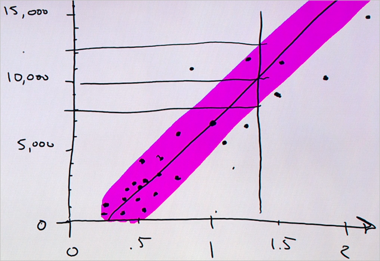

<properties
   pageTitle="預測的簡單模型-迴歸模型答案 |Microsoft Azure"
   description="如何建立簡單的迴歸模型預測資料科學初學者視訊 4 中的價格。 包含線性迴歸目標資料。"                                  
   keywords="建立模型、 簡單的模型、 價格預測、 簡單的迴歸模型"
   services="machine-learning"
   documentationCenter="na"
   authors="cjgronlund"
   manager="jhubbard"
   editor="cjgronlund"/>

<tags
   ms.service="machine-learning"
   ms.devlang="na"
   ms.topic="article"
   ms.tgt_pltfrm="na"
   ms.workload="na"
   ms.date="10/20/2016"
   ms.author="cgronlun;garye"/>

# 預測答案的簡單的模型

## 初學者系列的影片 4︰ 資料科學

瞭解如何建立簡單的迴歸模型預測資料科學初學者視訊 4 中菱形的價格。 我們會繪製目標資料的迴歸模型。

若要取得善用數列，請觀看所有。 [移至清單的視訊](#other-videos-in-this-series)

> [AZURE.VIDEO data-science-for-beginners-series-predict-an-answer-with-a-simple-model]

## 本系列中的其他影片

*資料科學初學者*是五個簡短的視訊中的資料科學的快速簡介。

  * 影片 1: [5 問題資料科學答案](machine-learning-data-science-for-beginners-the-5-questions-data-science-answers.md) *（5 分鐘 14 秒）*
  * 影片 2:[是您的資料供資料科學？](machine-learning-data-science-for-beginners-is-your-data-ready-for-data-science.md) *（4 min 56 秒）*
  * 影片 3︰[提出您的資料，您可以回答的問題](machine-learning-data-science-for-beginners-ask-a-question-you-can-answer-with-data.md) *（4 min 17 秒）*
  * 影片 4︰ 預測答案的簡單的模型
  * 影片 5︰[複製執行資料科學將其他人的工作](machine-learning-data-science-for-beginners-copy-other-peoples-work-to-do-data-science.md) *（3 min 18 秒）*

## 字幕︰ 預測答案的簡單的模型

歡迎使用中 」 資料科學的初學者 「 第四個視訊系列。 在此項目，我們將會建立一個簡單的模型，來預測。

*模型*是簡化的本文我們資料的相關資訊。 我會顯示我有何意義。

## 收集相關、 精確連線，足夠的資料

假設我要店菱形。 我有屬於設定的 1.35 克拉記號菱形，我祖母撥打，我想要瞭解如何的成本。 我的 [記事本] 和 [畫筆列入珠寶 store]，並我記下所有的大小寫和多少他們衡量中 carats 菱形的價格。 第一個菱形-則 1.01 carats 和 $7,366 開始著手。

現在我瀏覽並的存放區中的所有其他菱形執行這個動作。

請注意，我們清單有兩個資料行。 每個資料行具有不同的屬性-carats 和價格-以及每個資料列中的權重是單一資料點，代表單一菱形。

我們已確實建立一個小型資料以下-設定表格。 請注意，符合品質我們準則︰

* 資料**相關**的粗細成長相關價格
* 它不**正確**-我們重複檢查我們寫下的價格
* 則**連線**-這些資料行中沒有任何空白的空間
* 而我們所見，它是**不夠**可回答我們問題的資料

## 井字發問

現在，我們會引發我們問題以井字的方式: 「 多少成本購買 1.35 克拉記號菱形？ 」

我們清單沒有 1.35 克拉記號菱形，因此我們將使用其餘的資料，以取得問題的回答。

## 繪製現有的資料

我們就會先繪製水平的數字列，稱為 [座標軸] 圖表線寬]。 我們會繪製線條涵蓋的範圍，並將每個半克拉記號的刻度的權重範圍是 0 到 2。

接下來我們會繪製垂直軸，錄製的價格，並將其連線至粗細水平座標軸。 這樣就會在金額的單位。 現在，我們會有一組的座標軸。

我們要立即讓此資料，並使其成為*繪製的散佈圖*。 這是以視覺化方式呈現數值資料集的絕佳方式。

第一個資料點，我們可以看出 1.01 carats 垂直線條。 然後，我們看出 $7,366 在水平線。 在其符合，我們繪製一個點。 這表示我們的第一個方塊。

現在我們檢查每個菱形此清單上，執行相同的動作。 如果我們可以透過，這就是我們的取得︰ 多個點，為每個菱形。

## 繪製資料點的模型

現在您查看點及 squint，如果集合就像 fat、 模糊線條。 我們可以採取我們標記，並繪製一條直線瀏覽。

繪製線條，我們建立*模型*。 將此為時間的真實，讓它的簡單卡通版本。 現在卡通錯誤-行不會移到所有的資料點。 不過，有助於簡化。

所有的點，完全沒有穿過線條的是 [確定]。 資料科學家說明這說出的模型-線條-，然後每個點有一些*噪音*或與其相關聯的*變異數*。 基礎完美關聯性，並有接下來開始看、 真實世界加入雜音及不確定性。

因為我們嘗試來回答問題*多少？*稱為*迴歸分析*。 然後，我們使用的一條直線，因為它是*線性迴歸*。

## 若要尋找答案使用模型

現在我們擁有一個模型，我們要求，我們的問題︰ 將 1.35 克拉記號菱形費用是多少？

若要接聽我們的問題，我們可以看出 1.35 carats，並繪製一條垂直線。 我們其相交模型線條，看出水平線至美元座標軸。 叫 10000 在右側。 發展 ！ 這是答案︰ 1.35 克拉記號菱形成本關於 $10000。

## 建立的信賴區間

則不知道如何精確此預測是。 它會很有幫助是否 1.35 克拉記號菱形會非常接近 $10000，或更高或較低。 若要圖時，讓我們來繪製周圍迴歸線包含大多數的點信封。 此信封稱為我們*的信賴區間*︰ 我們可以很自信價格落此信封，因為這些過去最有。 從 1.35 克拉記號直線相交頂端和底部的信封，我們可以繪製兩個以上的水平的線條。

現在我們可以說一下我們的信賴區間︰ 我們可以假設充滿信心地 1.35 克拉記號菱形的價格是關於 $10000，但可能很低 $8000 而可能為 $12000 調高。

## 我們完成後，無數學或電腦

我們哪些資料科學家取得支付待辦事項]，然後我們，只要繪圖︰

* 我們詢問問題，我們無法接聽資料
* 我們建立*模型*使用*線性迴歸*
* 我們所做的*預測*，請完成*的信賴區間*

我們處理未使用數學或電腦。

現在若有詳細資訊，例如...

* 剪下的菱形
* （如何關閉菱形是白色） 的色彩變化
* 包含項目到方塊中的數字

...然後，我們都需要更多的欄。 在此情況下，數學變得很有幫助的。 如果您有兩個以上的欄，很難繪製的紙張上的點。 數學可讓您完全符合的列或資料的平面非常。

此外，如果，而不是只少數幾個菱形，我們有兩位分節點或兩個百萬，然後您可以更快速執行該工作的電腦。

現在，我們已討論如何線性迴歸，並我們做預測，使用資料。

請務必取出 」 資料科學的初學者 」 從 Microsoft Azure 電腦學習中的其他影片。

## 後續步驟

  * [請嘗試電腦學習 Studio 第一個資料科學體驗](machine-learning-create-experiment.md)
  * [Microsoft Azure 上取得電腦學習的簡介](machine-learning-what-is-machine-learning.md)
