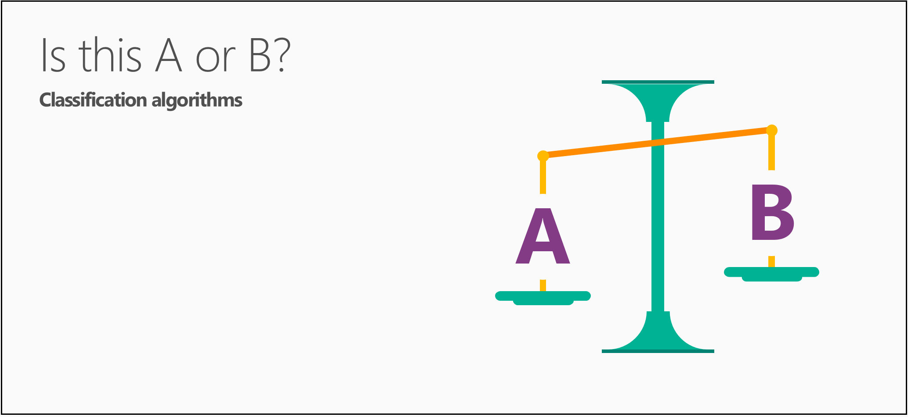

<properties
   pageTitle="5 的資料科學問題-初學者資料科學 |Microsoft Azure"
   description="取得初學者，開始 5 問題資料科學答案的五個短片資料科學從資料科學的快速簡介。"
   keywords="執行資料科學資料科學初學者、 資料科學初學者、 問題、 資料科學問題資料科學視訊的類型"
   services="machine-learning"
   documentationCenter="na"
   authors="cjgronlund"
   manager="jhubbard"
   editor="cjgronlund"/>

<tags
   ms.service="machine-learning"
   ms.devlang="na"
   ms.topic="article"
   ms.tgt_pltfrm="na"
   ms.workload="na"
   ms.date="10/20/2016"
   ms.author="cgronlun;garye"/>

# 資料科學初學者視訊 1: 5 問題資料科學解答

從上方的資料科學家取得的快速簡介資料科學從*資料科學初學者*五個簡短的視訊。 無論您感興趣執行資料科學或使用資料科學家，這些影片是基本但非常有用。

這段影片中第一個是何種資料科學可以回答的問題。 若要取得善用數列，請觀看所有。 [移至清單的視訊](#other-videos-in-this-series)

> [AZURE.VIDEO data-science-for-beginners-series-the-5-questions-data-science-answers]

## 本系列中的其他影片

*資料科學初學者*是資料科學取得關於 25 分鐘的總的快速簡介。 請查看的四個的視訊︰

  * 影片 1: 5 問題資料科學解答
  * 影片 2:[是您的資料供資料科學？](machine-learning-data-science-for-beginners-is-your-data-ready-for-data-science.md) *（4 min 56 秒）*
  * 影片 3︰[提出您的資料，您可以回答的問題](machine-learning-data-science-for-beginners-ask-a-question-you-can-answer-with-data.md) *（4 min 17 秒）*
  * 影片 4︰[預測答案的簡單的模型](machine-learning-data-science-for-beginners-predict-an-answer-with-a-simple-model.md) *（7 min 42 秒）*
  * 影片 5︰[複製執行資料科學將其他人的工作](machine-learning-data-science-for-beginners-copy-other-peoples-work-to-do-data-science.md) *（3 min 18 秒）*

## 字幕︰ 5 問題資料科學解答

好 ！ 歡迎使用視訊系列*資料科學初學者*。

資料科學可容納，所以我將介紹基本概念以下沒有任何方程式或電腦程式設計術語。

在第一段影片中，我們將討論 」 5 問題資料科學答案 」。

資料科學使用數字和名稱 （也稱為類別或標籤） 來預測問題的答案。

它可能會意外，但*有五問題該資料科學答案*︰

  * 此 A 或 B 是？
  * 這是怪異嗎？
  * 多少-或者 – 多少？
  * 此組織方式？
  * 我該怎麼辦下一步？

  這些問題的每一個是個別家庭電腦學習方法，稱為演算法的回答。

還是有幫助考量下列事項演算法食譜為與您為這些因素的資料。 演算法會告訴您如何合併及混合的資料，若要取得答案。 電腦就像是混合。 他們執行大部分的演算法的努力完成的工作，為您與他們執行很快。

## 第 1 題︰ 是此 A 或 B？使用分類演算法

現在就讓我們開始問題︰ 此 A 或 B 嗎？

本系列演算法稱為兩個類別分類。

很有用的任何具有兩個可能的答案的問題。

例如︰

  * 在下一個 1000 英哩會失敗此 tire: [是] 或 [否嗎？
  * 這會顯示在多個客戶: $5 優待券或 25%折扣？

此問題也可以包含兩個以上的選項來重新解析︰ 是此 A B 或 C 或 D，等等。 嗎？  這稱為 multiclass 分類和它的實用當您有多個，或多個千 — 可能的答案。 Multiclass 分類選擇最有可能的項目。

## 第 2 題︰ 這是怪異嗎？使用異常偵測演算法

下一個資料科學可以回答的問題是︰ 為此奇怪吧？ 此問題的回答稱為異常偵測演算法的家庭。

如果您有信用卡，您已經已 benefitted 從異常偵測。 信用卡公司分析您購買圖樣，讓他們可以通知您可能網路詐騙。 「 怪異 」 的費用可能購買，您通常不購物的商店或購買異常橫行項目。

此問題會有多個方法幫助的。 例如︰

  * 如果您有使用壓力規格買車，您可能會想要知道︰ 是讀取標準此壓力表嗎？
  * 如果您監視網際網路，您想要知道︰ 通常是從網際網路這則訊息？

以旗標異常偵測非預期或異常的事件或行為。 讓線索到哪裡尋找問題。

## 第 3 題︰ 多少？或如何許多嗎？使用迴歸演算法

電腦學習也可以很預測將如何回答嗎？或如何許多嗎？ 回答這個問題的演算法系列稱為迴歸分析。

迴歸演算法進行數字的預測，如下所示︰

  * 哪些溫度會下星期二？  
  * 我的第四個季銷售額是什麼？

他們協助回答任何要求數字的問題。

## 第 4 題︰ 此組織方式？使用叢集演算法

現在最後兩個問題是更進階的位元。

有時候您想要了解資料集-結構此組織方式？ 針對這個問題，您不需要您已經知道的結果的範例。

有許多方法 tease 出資料的結構。 叢集其中一個方法。 此運算子分隔資料到自然 」 clumps，「 進行更容易解譯。 叢集，就不正確的答案。

以下是叢集問題的常見範例︰

  * 哪些檢視器等相同類型的影片？
  * 哪些印表機機型失敗相同的方式？

了解如何組織資料，您可以更有效地瞭解-並預測的行為和事件。  

## 5 的問題︰ 我該怎麼辦現在？使用增援學習演算法

上次問題 – 應該我現在該做什麼？ – 使用一系列演算法稱為增援學習。

增援學習已由 rat 和人類大腦如何回應懲罰和回報啟發。 這些演算法的結果，了解，以及決定上的 [下一步] 動作。

一般而言，增援學習是適合用自動執行系統需要進行的多個小的決策，而不需要人力指引。

它會回答的問題一律是相關的動作應該採取-通常以一台電腦或人類。 以下是範例︰

  * 如果我房屋溫度控制系統︰ 調整溫度，或將它位於何處？  
  * 如果我自我行駛買車︰ 在黃色的光線，煞車或加速嗎？  
  * 針對機器人真空︰ 保留清理或回到充電站嗎？

為它們移，請從試用版和錯誤學習增援學習演算法會收集資料。

是的可回答 5 問題資料科學。

## 後續步驟

  * [請嘗試電腦學習 Studio 第一個資料科學體驗](machine-learning-create-experiment.md)
  * [Microsoft Azure 上取得電腦學習的簡介](machine-learning-what-is-machine-learning.md)
