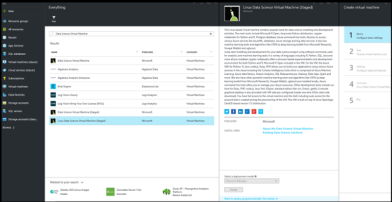

<properties
    pageTitle="佈建 Linux 資料科學虛擬機器 |Microsoft Azure"
    description="設定並建立 Linux 資料科學虛擬機器上執行分析及電腦學習 Azure。"
    services="machine-learning"
    documentationCenter=""
    authors="bradsev"
    manager="jhubbard"
    editor="cgronlun"  />

<tags
    ms.service="machine-learning"
    ms.workload="data-services"
    ms.tgt_pltfrm="na"
    ms.devlang="na"
    ms.topic="article"
    ms.date="09/12/2016"
    ms.author="bradsev" />

# <a name="provision-the-linux-data-science-virtual-machine"></a>佈建 Linux 資料科學虛擬機器

Linux 資料科學虛擬機器會提供許多預先安裝工具 Azure 虛擬機器。 這些工具常用的執行資料分析及電腦學習。 包含索引鍵的軟體元件如下︰

- Microsoft R 伺服器開發人員版本
- Anaconda Python 分配 （版本 2.7 和 3.5），包括常用的資料分析文件庫
- JupyterHub-多使用者 Jupyter 筆記本伺服器支援 R，Python Julia 核心
- Azure 儲存檔案總管
- 管理 Azure 資源 azure 的命令列介面 (CLI)
- PostgresSQL 資料庫
- 電腦學習工具
    - [計算網路工具組 (CNTK)](https://github.com/Microsoft/CNTK): 學習軟體工具組，從 Microsoft Research 深度。
    - [Vowpal Wabbit](https://github.com/JohnLangford/vowpal_wabbit)︰ 快速電腦學習支援技巧，例如線上、 雜湊，allreduce、 大幅降低、 learning2search、 使用中時，系統與互動式學習。
    - [XGBoost](https://xgboost.readthedocs.org/en/latest/)︰ 提供快速而正確提高樹狀實作的工具。
    - [祕](http://rattle.togaware.com/)（R 分析工具來瞭解輕鬆）︰ 可讓您快速入門資料分析及電腦學習中 R 簡單，GUI 為基礎的資料探索與模型與自動產生的 R 程式碼的工具。
- Azure SDK Java Python、 node.js，在 [注音標示、 PHP
- R 和 Python 的文件庫中使用 Azure 電腦學習和其他 Azure 服務
- 開發工具和編輯器 (蝕，Emacs，gedit，六)

資料科學包含重複上一系列的工作︰

1. 尋找、 載入，及預先處理資料
2. 建置和測試模型
3. 部署消耗智慧應用程式中的模型

資料科學家使用各種工具完成這些工作。 將它相當費時尋找適當的軟體、 版本，然後若要下載，編譯，並安裝這些版本。

Linux 資料科學虛擬機器可以大幅減輕負擔。 用來協助您快速分析專案。 讓您處理的工作，包括 R、 Python、 SQL、 Java，以及 c + + 使用不同語言。 蝕提供 IDE 開發及測試您很容易使用的程式碼。 Azure SDK VM 中包含可讓您建立您的應用程式使用 Microsoft 雲端平台上 Linux 的各項服務。 此外，您可以為 [注音標示、 Perl、 PHP 及 node.js 等也預先安裝的其他語言的存取。

不有任何軟體費用，此資料科學 VM 圖像。 您是付款只 Azure 硬體使用費用，會評估根據您使用 VM 圖像佈建虛擬機器的大小。 在計算費用更多詳細資料可以找到[VM 列出 Azure marketplace] 頁面](https://azure.microsoft.com/marketplace/partners/microsoft-ads/linux-data-science-vm/)上。


## <a name="prerequisites"></a>必要條件

您可以建立 Linux 資料科學虛擬機器之前，您必須具備下列項目︰

- **Azure 訂閱**︰ 若要取得一個，請參閱[取得 Azure 免費試用版](https://azure.microsoft.com/free/)。
- **Azure 儲存體帳戶**︰ 若要建立一個，請參閱[建立 Azure 儲存體帳戶](storage-create-storage-account.md#create-a-storage-account)。 或者，儲存帳戶會建立建立 VM 的程序的一部分上，如果您不想要使用現有的帳戶。


## <a name="create-your-linux-data-science-virtual-machine"></a>建立 Linux 資料科學虛擬機器

若要建立執行個體的 Linux 資料科學虛擬機器步驟如下︰

1.  瀏覽至虛擬機器[Azure 入口網站](https://portal.azure.com/#create/microsoft-ads.linux-data-science-vmlinuxdsvm)上的清單。
2.   按一下 [（下方） 的 [**建立**]，以顯示精靈。
3.   下列各節提供用來建立 Microsoft 資料科學虛擬機器的輸入的每個 （右側先前的圖表中的列舉） 精靈中的步驟。 以下是設定每一個步驟所需的輸入︰

    。 **基本功能**︰

  - **名稱**︰ 建立資料科學伺服器的名稱。
  - **使用者名稱**︰ 第一個帳戶登入 id。
  - **密碼**: （您可以使用 SSH 公開金鑰而密碼） 的第一個帳戶密碼。
  - **訂閱**︰ 如果您有多個訂閱，請選取其中一個所建立和帳單的電腦。 您必須擁有此訂閱的資源建立權限。
  - **資源群組**︰ 您可以建立新的或使用現有的群組。
  - **位置**︰ 選取最適合資料中心。 通常是資料中心大部分的資料，或最接近您實際的位置，最快的網路存取。

    b。 **大小**︰

  - 選取其中一個符合您的功能需求和成本限制式伺服器類型]。 選取 [**檢視全部]**以查看更多的 VM 大小的選擇。

    c。 **設定**︰

  - **磁碟類型**︰ 如果您想要將實心狀態磁碟機 (SSD)，選擇 [**進階版**。 否則，請選擇 [**標準**]。
  - **儲存帳戶**︰ 您可以在您的訂閱，建立一個新的 Azure 儲存體帳戶，或使用所選的同一個位置的現有在精靈的 [**基本**步驟。
  - **其他參數**︰ 在大多數情況下，您就是使用預設值。 若要考慮使用非預設值，請將游標停留在特定欄位的說明資訊的連結。

    d。 **摘要**︰

  - 請確認您輸入的所有資訊都都正確。

    e。 **購買**︰

  - 若要開始佈建，按一下 [**購買**]。 連結提供交易的條款。 VM 沒有任何額外的費用，除了您選擇在 [**大小**] 步驟中的伺服器大小的計算。

佈建應該需要花 10-20 分鐘。 佈建的狀態會顯示在 Azure 入口網站。

## <a name="how-to-access-the-linux-data-science-virtual-machine"></a>如何存取 Linux 資料科學虛擬機器

建立 VM 之後，您可以登入以便使用 SSH。 使用您在步驟 3 的文字命令介面介面的**基本概念**一節中建立帳戶認證。 在 Windows 上，您可以下載像[Putty](http://www.putty.org)SSH 用戶端工具。 如果您偏好的圖形化的桌面 （X Windows 系統），您可以使用 X11 上 Putty 轉寄，或是安裝 X2Go 用戶端。

>[AZURE.NOTE] X2Go 用戶端大幅執行更多 X11 在測試。 我們建議用圖形桌面介面 X2Go 用戶端。


## <a name="installing-and-configuring-x2go-client"></a>安裝及設定 X2Go 用戶端

Linux VM 已經能夠與 X2Go 伺服器並準備好接受用戶端連線。 若要連線到 Linux VM 圖形的桌面中,，執行下列動作用戶端上︰

1. 下載並安裝 X2Go 用戶端的用戶端的平台從[X2Go](http://wiki.x2go.org/doku.php/doc:installation:x2goclient)。    
2. 執行 X2Go 的用戶端，並選取**新的工作階段**。 它會設定] 視窗中開啟多個索引標籤。 輸入下列設定參數︰
    * [**工作階段] 索引標籤**中︰
        - **Host （主機)**: 主機名稱或您 Linux 資料科學 VM IP 位址。
        - **登入**︰ Linux VM 上的使用者名稱。
        - **SSH 連接埠**︰ 將其保留在 22，預設值。
        - **工作階段類型**︰ 將值變更為 XFCE。 目前 Linux VM 只支援 XFCE 桌面。
    * **媒體] 索引標籤**︰ 您可以將其關閉音效支援與用戶端列印如果您不需要的使用方式。
    * **共用資料夾**︰ 如果您想從用戶端電腦上 Linux VM 裝載的目錄，請新增您想要與此索引標籤上的 VM 共用的用戶端電腦目錄。

您登入 VM 使用 SSH 用戶端或 XFCE 透過 X2Go 用戶端的圖形化桌面之後，您就可以準備開始使用安裝並設定 VM 上的工具。 在 XFCE，您可以看見應用程式] 功能表的捷徑桌面圖示的工具]。


## <a name="tools-installed-on-the-linux-data-science-virtual-machine"></a>安裝在 Linux 資料科學虛擬機器中的工具

### <a name="microsoft-r-open"></a>Microsoft R 開啟
R 是其中一個最常用的資料分析及電腦學習語言。 如果您想要使用您的狀況分析 R，VM 會有 Microsoft R 開啟 (MRO) 使用數學核心文件庫 (MKL)。 MKL 最佳化常見分析演算法的數學運算子。 MRO 相容於 CRAN R、 100%，而任何 R 文件庫的 CRAN 可以安裝在 MRO。 您可以編輯預設編輯器，例如六、 Emacs 或 gedit 的其中一種 R 程式。 您也可以下載及使用其他 Ide，例如[RStudio](http://www.rstudio.com)。 您方便時觀看，安裝 RStudio **/dsvm/tools**目錄提供簡單的指令碼 (installRStudio.sh)。 如果您使用的 [Emacs 編輯器] 中，注意 Emacs 封裝 ESS （Emacs Speaks 統計值），可簡化使用 [Emacs 編輯器] 中的 R 檔案已預先安裝。

若要啟動 R，您只需要輸入**R**中。 會帶您到互動式環境。 若要開發 R 程式，方法，您可以通常是使用 Emacs 或六 gedit，例如編輯器，並執行的指令碼中。如果您安裝 RStudio 時，您會有完整圖形 IDE 環境開發 R 程式。

也是您安裝的[頂端 20 R 封包](http://www.kdnuggets.com/2015/06/top-20-r-packages.html)，如果您想要 R 指令碼。 R 互動式介面，可輸入**R**中輸入 （如上所述） 後，可以執行這個指令碼。  

### <a name="python"></a>Python
使用 Python 開發，已安裝 Anaconda Python 分配 2.7 和 3.5。 此分配包含關於 300 個最常用的數學運算、 工程和資料分析封包以及基底 Python。 您可以使用預設文字編輯器。 此外，您可以使用 Spyder，就會與 Anaconda Python 散佈搭配 Python IDE。 Spyder 需要圖形的桌面或 X11 轉接。 圖形化桌面應用程式中提供 Spyder 的捷徑。

我們擁有 Python 2.7 和 3.5，因為您需要特別啟動您想要在目前的工作階段中處理所需的 Python 版本。 啟動程序將路徑變數設定所需的 Python 版本。

若要啟動 Python 2.7，執行下列命令介面從命令︰

    source /anaconda/bin/activate root

Python 2.7 已安裝在*/anaconda/bin*。

若要啟動 Python 3.5，執行下列命令介面從命令︰

    source /anaconda/bin/activate py35


已安裝*/anaconda/envs/py35/bin*Python 3.5。

要叫用 Python 互動式工作階段，只要輸入**python**中。 如果您是以圖形化介面，或是已 X11 設定轉接設定，您可以輸入**spyder**若要啟動 Python。

### <a name="jupyter-notebook"></a>Jupyter 筆記本

Anaconda 分配也會隨附 Jupyter 筆記本中，若要共用的程式碼及分析的環境。 透過 JupyterHub 存取 Jupyter 筆記本。 您使用登入您的本機 Linux 使用者名稱和密碼。

Jupyter 筆記本伺服器已預先設定 Python 2、 Python 3 與 R 核心。 有一個名為 「 Jupyter 筆記本 」 啟動的瀏覽器存取筆記本伺服器的桌面圖示。 如果您是透過 SSH 或 X2Go 用戶端 VM，您也可以瀏覽[https://localhost:8000 /](https://localhost:8000/)存取 Jupyter 筆記本伺服器。

>[AZURE.NOTE] 繼續如果您收到任何憑證警告。

您可以從任何主機存取 Jupyter 筆記本伺服器。 只需要輸入*https://\<VM DNS 名稱或 IP 位址\>: 8000 /*

>[AZURE.NOTE] 連接埠 8000 預設會開啟防火牆中時 VM 也會佈建後。

我們有封裝範例筆記本-一個在 Python，一個。使用您的本機 Linux 使用者名稱和密碼驗證 Jupyter 筆記本之後，可以在筆記本的 [首頁] 頁面上看到範例的連結。 您可以選取 [**新增**]，然後按一下 [適當的語言核心建立新的筆記本。 如果您沒有看到 [**新增**] 按鈕，按一下左上角以移至筆記本伺服器的 [首頁] 頁面上的 [ **Jupyter** ] 圖示。


### <a name="ides-and-editors"></a>Ide 和編輯器

您有多個程式碼編輯器可供選擇。 這包含六/VIM 與 Emacs、 gEdit 蝕。 gEdit 和蝕，圖形化編輯器，以及需要您登入圖形桌面的使用方式。 這些編輯器有桌面及應用程式啟動] 功能表的捷徑。

**VIM**和**Emacs**是以文字為基礎的編輯器。 在 Emacs，我們已安裝稱為 Emacs Speaks 統計資料 (ESS) 能方便使用 R Emacs 編輯器中的附加套件。 在[ESS](http://ess.r-project.org/)，就可以找到詳細的資訊。

**蝕**是開啟來源] 可延伸 IDE 支援多種語言。 Java 開發人員 edition 是 VM 上所安裝的執行個體。 有適用於數個常用的語言可以延伸蝕環境中安裝的增益集。 我們也有安裝蝕稱為**Azure 工具組蝕的**外掛程式。 其可讓您建立、 開發、 測試和部署 Azure 使用支援的語言，如 Java 蝕的開發環境的應用程式。 此外，還有**Java Azure SDK** ，可讓不同 Azure 服務從 Java 環境中存取。 在[Azure 工具組的蝕](../azure-toolkit-for-eclipse.md)找 Azure 工具組蝕的詳細資訊。

**LaTex**是透過 texlive 套件，以及可簡化撰寫 LaTex 文件中 Emacs Emacs 附加[auctex](https://www.gnu.org/software/auctex/manual/auctex/auctex.html)套件進行安裝。  

### <a name="databases"></a>資料庫

#### <a name="postgres"></a>Postgres
開啟來源資料庫**Postgres**位於 VM 上執行的服務與 initdb 已完成。 您仍需要建立資料庫及使用者。 如需詳細資訊，請參閱[Postgres 文件](https://www.postgresql.org/docs/)。  

####  <a name="graphical-sql-client"></a>圖形化 SQL 用戶端
若要連接到不同的資料庫 （例如 Microsoft SQL Server、 Postgres 和 MySQL），並執行 SQL 查詢已經提供**松鼠 SQL**，圖形的 SQL 用戶端。 您可以執行此從 （例如，使用 X2Go 用戶端） 的圖形化桌面工作階段。 若要叫用松鼠 SQL，您可以從桌面圖示啟動，或命令介面上執行下列命令。

    /usr/local/squirrel-sql-3.7/squirrel-sql.sh

先設定您的驅動程式和資料庫別名第一次使用。 JDBC 驅動程式位於︰

*/usr/share/java/jdbcdrivers*

如需詳細資訊，請參閱[松鼠 SQL](http://squirrel-sql.sourceforge.net/index.php?page=screenshots)。

#### <a name="command-line-tools-for-accessing-microsoft-sql-server"></a>用來存取 Microsoft SQL Server 的命令列工具

SQL Server ODBC 驅動程式套件也提供兩種命令列工具︰

**bcp**: bcp 公用程式大量之間複製資料的 Microsoft SQL Server 執行個體和資料檔案中的使用者指定的格式。 若要將 SQL Server 資料表匯入新的列數或不在表格的資料匯出到資料檔，可 bcp 公用程式。 若要將資料匯入資料表，您必須使用該資料表中，建立格式檔案，或瞭解資料表和有效的資料行的資料類型的結構。

如需詳細資訊，請參閱[連線 bcp](https://msdn.microsoft.com/library/hh568446.aspx)。

**sqlcmd**︰ 您可以輸入 SQL 陳述式 sqlcmd 公用程式，以及系統程序和指令碼在命令提示字元的檔案。 此公用程式會使用 ODBC 來執行 TRANSACT-SQL 批次。

如需詳細資訊，請參閱[連線的 sqlcmd](https://msdn.microsoft.com/library/hh568447.aspx)。

>[AZURE.NOTE] 有一些此公用程式中 Linux 和 Windows 平台之間的差異。 如需詳細資訊的文件，請參閱。


#### <a name="database-access-libraries"></a>資料庫存取文件庫

有適用於 R 和 Python 至 access 資料庫的文件庫。

- 在 R， **RODBC**套件或**dplyr**套件可讓您的查詢，或在資料庫伺服器上執行 SQL 陳述式。
- 在 Python **pyodbc**文件庫會提供 ODBC 資料庫存取為基礎的圖層。  

若要存取**Postgres**:

- 從︰ 使用封裝**RPostgreSQL**。
- 從 Python︰ 使用**psycopg2**文件庫。


### <a name="azure-tools"></a>Azure 工具
VM 上安裝下列 Azure 工具︰

- **Azure 命令列介面**︰ Azure CLI 可讓您建立及管理命令介面指令透過 Azure 資源。 若要叫用 Azure 工具，只要輸入**azure 說明**。 如需詳細資訊，請參閱[Azure CLI 文件的頁面](../virtual-machines-command-line-tools.md)。
- **Microsoft Azure 儲存檔案總管**︰ Microsoft Azure 儲存 Explorer 是用來瀏覽的物件，您有儲存在您 Azure 儲存的帳戶，然後上傳及下載的資料與 Azure blob 的圖形化工具。 您可以從桌面捷徑] 圖示，以存取儲存的檔案總管。 您可以輸入叫用它從命令介面提示**StorageExplorer**。 您需要從 X2Go 用戶端登入，或有 X11 轉接設定的設定。
- **Azure 文件庫**︰ 以下是一些預先安裝的文件庫。

 - **Python**: Azure 相關文件庫中已安裝的 Python 是**azure**、 **azureml**、 **pydocumentdb**， **pyodbc**。 使用前三個文件庫中，您可以存取 Azure 儲存服務、 Azure 電腦學習和 Azure DocumentDB （Azure 上的 NoSQL 資料庫）。 第四個文件庫，pyodbc （以及 Microsoft ODBC 驅動程式的 SQL Server），可讓您存取 SQL Server Azure SQL 資料庫]，與 Azure SQL Data Warehouse 從 Python ODBC 介面，來。 輸入**pip 清單**以查看所有列出文件庫。 請務必 Python 2.7 與 3.5 環境中執行此命令。
 - **R**: Azure 相關文件庫中 R 一起安裝的是**AzureML**和**RODBC**。
 - **Java**: Azure Java 文件庫的清單，請參閱目錄**/dsvm/sdk/AzureSDKJava** VM 上。 索引鍵的文件庫是 Azure 儲存和管理的 Api，DocumentDB 及 JDBC 驅動程式的 SQL Server。  

您可以從預先安裝的 Firefox 瀏覽器存取[Azure 入口網站](https://portal.azure.com)。 Azure 入口網站，您可以建立、 管理及監視 Azure 資源。

### <a name="azure-machine-learning"></a>Azure 機器學習

Azure 電腦學習是完全受管理的雲端服務可讓您建立、 部署及共用預測分析解決方案。 從 Azure 電腦學習 Studio 建立您的實驗和模型。 它可以從存取資料科學虛擬機器上的網頁瀏覽器造訪[Microsoft Azure 電腦學習](https://studio.azureml.net)。

登入 Azure 電腦學習 Studio 之後，必須試驗畫布上的存取您可以在其中建立邏輯流程學習演算法的電腦。 您也可以存取裝載於 Azure 電腦學習 Jupyter 筆記本，並可以順暢完美地使用電腦學習 Studio 中實驗。 Operationalize 電腦學習建立 web 服務介面中包圍的模型。 這可讓任何語言撰寫的用戶端叫用從電腦學習模型的預測。 如需詳細資訊，請參閱[電腦學習文件](https://azure.microsoft.com/documentation/services/machine-learning/)。

您可以也 VM 上建立您的模型中 R 或 Python，然後再將它部署 Azure 電腦學習生產環境中。 我們已安裝的文件庫中 R (**AzureML**) 和 Python (**azureml**) 若要啟用此功能。

如何將 Azure 電腦學習部署模型 R 和 Python 中的資訊，請參閱[您可以在 [資料科學虛擬機器執行的 10 個項目](machine-learning-data-science-vm-do-ten-things.md)(特別是區段 」 建立模型使用 R 或 Python 以及 Operationalize 他們使用 Azure 電腦學習 」)。

>[AZURE.NOTE] 為 Windows 版本的資料科學 VM 撰寫這些指示。 但有部署模型至 Azure 電腦學習適用於 Linux VM 所提供的資訊。

### <a name="machine-learning-tools"></a>電腦學習工具

VM 隨附一些電腦學習工具和演算法的已預先編譯及已預先安裝至本機。 這些功能包括︰

* **CNTK**（計算網路工具組從 Microsoft 參考資料）︰ 深度，學習工具組。
* **Vowpal Wabbit**︰ 快速線上學習演算法。
* **xgboost**︰ 提供最佳化、 提高樹狀演算法的工具。
* **Python**: Anaconda Python 隨附搭售電腦學習演算法使用文件庫，例如 Scikit 瞭解。 您可以用來安裝其他文件庫`pip install`] 命令。
* **R**︰ 豐富的電腦學習函數是用於。部分文件庫預先安裝的是 lm、 glm、 randomForest rpart。 以執行安裝其他文件庫︰

        install.packages(<lib name>)

以下是一些其他清單中的第三個電腦學習工具相關資訊。

#### <a name="cntk"></a>CNTK
這是開啟來源，深入瞭解工具組。 它命令列工具 (cntk)，並已在路徑。

若要執行基本的範例，請執行下列命令中︰

    # Copy samples to your home directory and execute cntk
    cp -r /dsvm/tools/CNTK-2016-02-08-Linux-64bit-CPU-Only/Examples/Other/Simple2d cntkdemo
    cd cntkdemo/Data
    cntk configFile=../Config/Simple.cntk

模型輸出位於*~/cntkdemo/Output/Models*。

如需詳細資訊，請參閱[GitHub](https://github.com/Microsoft/CNTK)及[CNTK wiki](https://github.com/Microsoft/CNTK/wiki)的 CNTK 一節。


#### <a name="vowpal-wabbit"></a>Vowpal Wabbit

Vowpal Wabbit 是電腦學習技巧，例如線上、 雜湊，allreduce、 大幅降低、 learning2search、 使用中時，會使用的系統與互動式學習。

若要執行工具上的基本的範例中，執行下列動作︰

    cp -r /dsvm/tools/VowpalWabbit/demo vwdemo
    cd vwdemo
    vw house_dataset

該目錄中有其他，較大的示範。 如需有關 vw 為的詳細資訊，請參閱[GitHub 的此區段](https://github.com/JohnLangford/vowpal_wabbit)中和[Vowpal Wabbit wiki](https://github.com/JohnLangford/vowpal_wabbit/wiki)。

#### <a name="xgboost"></a>xgboost
這是設計和最佳化提高 （樹） 演算法的文件庫。 此文件庫的目標是發送計算限制的電腦需要提供大型樹狀促進的多種來調整可攜式且正確。

它會提供命令列，以及 R 文件庫。

若要使用此文件庫中的，您可以開始互動式 R 工作階段 （只**R**中），並載入文件庫。

以下是您可以在 R 提示中執行的簡單範例︰

    library(xgboost)

    data(agaricus.train, package='xgboost')
    data(agaricus.test, package='xgboost')
    train <- agaricus.train
    test <- agaricus.test
    bst <- xgboost(data = train$data, label = train$label, max.depth = 2,
                    eta = 1, nthread = 2, nround = 2, objective = "binary:logistic")
    pred <- predict(bst, test$data)

若要執行 xgboost 命令列，以下是執行中的命令︰

    cp -r /dsvm/tools/xgboost/demo/binary_classification/ xgboostdemo
    cd xgboostdemo
    xgboost mushroom.conf


.Model 檔案會寫入到指定的目錄。 此範例中示範的相關資訊位於[GitHub](https://github.com/dmlc/xgboost/tree/master/demo/binary_classification)。

如需有關 xgboost 的詳細資訊，請參閱[xgboost 文件] 頁面](https://xgboost.readthedocs.org/en/latest/)上和其[Github 存放庫](https://github.com/dmlc/xgboost)。

#### <a name="rattle"></a>祕
祕 （ **R** **A**nalytical **T**ool **T**o **L**贏得**E**asily） 使用 gui 資料瀏覽和建立模型。 它會顯示的資料，可以輕易地模型，建立不和受監督從資料模型，以圖形方式呈現的模型效能的轉換資料的統計和視覺合併彙算，分數新資料集。 也會產生 R 程式碼中，複製的使用者介面中的作業，可以直接在 R 執行或作為起點，以進一步分析。

若要執行祕，您必須圖形桌面登入工作階段。 在 terminal 中，輸入```R```輸入 R 環境。 R 系統提示時，輸入下列命令︰

    library(rattle)
    rattle()

目前的圖形化介面開啟的索引標籤的集合。 以下是快速入門步驟中祕需要使用範例天氣資料集和建立模型。 在某些執行下列步驟，會提示您以自動安裝並載入尚未系統某些必要的 R 套件。

>[AZURE.NOTE] 如果您沒有安裝套件系統目錄 （預設） 中的存取權，您可能會看到您的個人文件庫至安裝套件 R 主控台視窗上的提示。 如果您看到這些提示，請接聽*y* 。

1. 按一下 [**執行**]。
2. 對話方塊彈出，詢問您要使用範例天氣資料集。 按一下 [****載入範例。
3. 按一下 [**模型**] 索引標籤。
4. 按一下 [**執行**] 來建立決策樹。
5. 按一下 [顯示決策樹的 [**繪製**]。
6. 按一下 [**樹系**選項] 按鈕，然後按一下 [**執行**] 來建立的隨機樹系。
7. 按一下 [**評估**] 索引標籤。
8. 按一下 [**風險**] 選項按鈕，然後按一下 [**執行**]，以顯示兩個風險 （積存） 效能繪圖。
9. 按一下 [**記錄**] 索引標籤顯示產生 R 程式碼進行上述作業。
(祕的目前版本中的錯誤，因為您需要插入*#*前面*匯出...這個記錄檔*中的登入文字字元。)
10. 按一下 [**匯出**] 按鈕，以儲存 R 指令碼檔名為*weather_script]。R*常用的資料夾。

您可以結束祕和。現在您可以修改產生的 R 指令碼，或如何執行隨時祕使用者介面中完成的所有項目重複使用它。 特別為初學者中 R，這是輕鬆快速地執行分析及電腦時自動產生修改及/或瞭解 R 中的 [程式碼以簡單的圖形化介面，學習。


## <a name="next-steps"></a>後續步驟
以下是如何繼續您的學習及探索︰

* [資料科學上 Linux 資料科學虛擬機器](machine-learning-data-science-linux-dsvm-walkthrough.md)逐步解說示範如何佈建以下 Linux 資料科學 VM 與執行幾個常見的資料科學工作。 
* 探索資料科學 VM 上各種資料科學工具試用本文中所描述的工具。 您也可以執行基本的簡介和指標虛擬機器中的命令介面上的*dsvm 更多資訊*工具 VM 上所安裝的相關詳細資訊。  
* 瞭解如何使用[小組資料科學程序](https://azure.microsoft.com/documentation/learning-paths/cortana-analytics-process/)，系統化地建立端對端分析解決方案。
* 請造訪的電腦學習及資料分析的範例使用 Cortana 分析套件[Cortana [分析] 庫](http://gallery.cortanaanalytics.com)。
