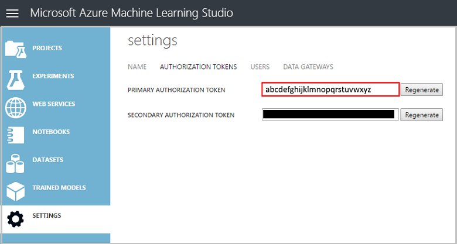

<properties 
    pageTitle="資料科學上 Linux 資料科學虛擬機器 |Microsoft Azure" 
    description="如何執行多個資料科學工作與 Linux 資料科學 VM。" 
    services="machine-learning"
    documentationCenter="" 
    authors="bradsev" 
    manager="jhubbard" 
    editor="cgronlun"/>

<tags 
    ms.service="machine-learning" 
    ms.workload="data-services" 
    ms.tgt_pltfrm="na" 
    ms.devlang="na" 
    ms.topic="article" 
    ms.date="09/12/2016" 
    ms.author="bradsev;paulsh" />

# 資料科學上 Linux 資料科學虛擬機器

這個逐步解說示範如何執行多個資料科學工作與 Linux 資料科學 VM。 Linux 資料科學虛擬機器 (DSVM) 是提供許多常用的資料分析及電腦學習工具已預先安裝的 Azure 虛擬機器圖像。 [佈建 Linux 資料科學虛擬機器](machine-learning-data-science-linux-dsvm-intro.md)主題中，是分項主要軟體元件。 VM 圖像容易開始執行資料科學以分鐘為單位，而不需要安裝與設定的工具] 的每個個別。 可以輕鬆地不按比例縮放設定 VM，如有需要並將它在不使用時停止。 因此，此資源是彈性及成本有效。 

資料科學工作示範此逐步解說追蹤[小組資料科學程序](https://azure.microsoft.com/documentation/learning-paths/data-science-process/)中所述的步驟。 此程序提供系統化，讓資料科學家進行有效率地共同作業的建置智慧型應用程式的生命週期的小組可以資料科學方式。 資料科學程序也提供後面可以個別的資料科學反覆運算架構。

我們分析[spambase](https://archive.ics.uci.edu/ml/datasets/spambase)中的資料集此逐步解說。 這是一組的電子郵件標示為 [垃圾郵件] 或 [ham （亦即不垃圾郵件），也包含 [部分的電子郵件內容的統計資料。 下一步，但一節中討論所包含的統計資料。 

## 必要條件

您可以使用 Linux 資料科學虛擬機器之前，您必須具備下列項目︰

- **Azure 訂閱**。 如果您還沒有其中一個，請參閱[建立您的免費 Azure 帳戶今天](https://azure.microsoft.com/free/)。
- [**Linux 資料科學 VM**](https://azure.microsoft.com/marketplace/partners/microsoft-ads/linux-data-science-vm)。 佈建此 VM 的詳細資訊，請參閱[佈建 Linux 資料科學虛擬機器](machine-learning-data-science-linux-dsvm-intro.md)。 
- [X2Go](http://wiki.x2go.org/doku.php)您電腦上安裝並開啟 XFCE 工作階段。 安裝和設定**X2Go 用戶端**上的資訊，請參閱[安裝及設定 X2Go 用戶端](machine-learning-data-science-linux-dsvm-intro.md#Installing-and-configuring-X2Go-client)。 
- **AzureML 帳戶**。 如果您還沒有一個註冊[AzureML 首頁](https://studio.azureml.net/)上的新節。 有可用的使用狀況層可協助您開始使用。

## 下載 spambase 資料集

[Spambase](https://archive.ics.uci.edu/ml/datasets/spambase)資料集是一組較小包含只 4601 範例的資料。 這是示範的一些重要功能的資料科學 VM 時，會保留資源需求太大時要使用方便的大小。

>[AZURE.NOTE] 此逐步解說建立上 D2 v2 大小 Linux 資料科學虛擬機器。 此大小 DSVM 足以處理此逐步解說中的程序。

如果您需要更多儲存空間，您可以建立其他磁碟，並將其附加至您 VM。 這些磁碟會使用常設 Azure 儲存空間，讓他們的資料會保留伺服器 reprovisioned 因為調整大小或關閉時，即使。 若要將磁碟新增並附加至您 VM，遵循中的指示[新增 Linux vm 磁碟](../virtual-machines/virtual-machines-linux-add-disk.md)。 下列步驟使用 Azure 的命令列介面 (Azure CLI)，其中已安裝 DSVM。 因此，可以完全從 VM 本身完成這些程序。 若要增加儲存空間的另一個選項是使用[Azure 檔案](../storage/storage-how-to-use-files-linux.md)。

若要下載的資料，請開啟終端機視窗，然後執行此命令時︰

    wget http://archive.ics.uci.edu/ml/machine-learning-databases/spambase/spambase.data

下載的檔案沒有標題列，所以讓我們建立具有標頭的另一個檔案。 執行此命令來建立適當的標頭的檔案︰

    echo 'word_freq_make, word_freq_address, word_freq_all, word_freq_3d,word_freq_our, word_freq_over, word_freq_remove, word_freq_internet,word_freq_order, word_freq_mail, word_freq_receive, word_freq_will,word_freq_people, word_freq_report, word_freq_addresses, word_freq_free,word_freq_business, word_freq_email, word_freq_you, word_freq_credit,word_freq_your, word_freq_font, word_freq_000, word_freq_money,word_freq_hp, word_freq_hpl, word_freq_george, word_freq_650, word_freq_lab,word_freq_labs, word_freq_telnet, word_freq_857, word_freq_data,word_freq_415, word_freq_85, word_freq_technology, word_freq_1999,word_freq_parts, word_freq_pm, word_freq_direct, word_freq_cs, word_freq_meeting,word_freq_original, word_freq_project, word_freq_re, word_freq_edu,word_freq_table, word_freq_conference, char_freq_semicolon, char_freq_leftParen,char_freq_leftBracket, char_freq_exclamation, char_freq_dollar, char_freq_pound, capital_run_length_average,capital_run_length_longest, capital_run_length_total, spam' > headers

然後串連兩個檔案與命令︰

    cat spambase.data >> headers
    mv headers spambaseHeaders.data

資料集有許多種類型的統計資料，每個電子郵件︰ 

- 資料行等***word\_頻率\_WORD***指出文字的電子郵件中，符合*WORD*的百分比。 例如，如果*word\_頻率\_進行*是 1，1%的電子郵件中的所有文字已*進行*。 
- 資料行等***char\_頻率\_CHAR***指示的電子郵件中的所有字元*CHAR*的百分比。 
- ***首都\_執行\_長度\_最長***最長的大寫字母一系列的長度。 
- ***首都\_執行\_長度\_平均***平均所有大寫字序列的長度。 
- ***首都\_執行\_長度\_總***是所有大寫字序列的總長度。 
- ***垃圾郵件***，指出電子郵件是否被視為垃圾郵件 (1 = 0 垃圾郵件 = [非垃圾郵件)。

## 探索 Microsoft R 開啟資料集

讓我們來檢查資料，並執行一些基本的電腦，學習使用。資料科學 VM 隨附[Microsoft R 開啟](https://mran.revolutionanalytics.com/open/)已預先安裝。 在這個版本的 R 的多執行緒的數學文件庫提供更佳的效能比各種單一階層式的版本。 開啟 Microsoft R 也提供重現性使用 CRAN 套件存放庫的快照。

若要在此逐步解說中使用的程式碼範例複本，請複製使用給，這 VM 上預先安裝**Azure-機器-學習-資料-科學**存放庫。 從給命令列執行︰

    git clone https://github.com/Azure/Azure-MachineLearning-DataScience.git

開啟終端機視窗，然後 R 互動式主控台中開始新的 R 工作階段。

>[AZURE.NOTE] 您也可以使用 RStudio 下列程序。 若要安裝 RStudio，執行此命令在 terminal 中︰`./Desktop/DSVM\ tools/installRStudio.sh`

若要匯入資料，並設定環境，請執行︰

    data <- read.csv("spambaseHeaders.data")
    set.seed(123)

若要查看每個資料行的相關的摘要統計資料︰

    summary(data)

取得資料的不同檢視︰

    str(data)

可以顯示您的每個變數，第一個的幾個數值類型，在資料集。 

[*垃圾郵件*] 欄已讀取的整數，但實際分類變數 （或因子變異數）。 若要設定其類型︰

    data$spam <- as.factor(data$spam)

若要執行的一些探分析，使用[ggplot2](http://ggplot2.org/)套件，VM 上已安裝的的常用圖形文件庫。 請注意，從先前所顯示的摘要資料的摘要統計資料 technet 上有驚嘆號字元的頻率。 讓我們來繪製這些頻率以下的下列命令︰

    library(ggplot2)
    ggplot(data) + geom_histogram(aes(x=char_freq_exclamation), binwidth=0.25)

由於零列扭曲繪圖，讓我們來移除其︰

    email_with_exclamation = data[data$char_freq_exclamation > 0, ]
    ggplot(email_with_exclamation) + geom_histogram(aes(x=char_freq_exclamation), binwidth=0.25)

有上方，看起來有趣的 1 的非一般密度。 讓我們來看，只要該資料︰

    ggplot(data[data$char_freq_exclamation > 1, ]) + geom_histogram(aes(x=char_freq_exclamation), binwidth=0.25)

然後分割的垃圾郵件與 ham:

    ggplot(data[data$char_freq_exclamation > 1, ], aes(x=char_freq_exclamation)) +
    geom_density(lty=3) +
    geom_density(aes(fill=spam, colour=spam), alpha=0.55) +
    xlab("spam") +
    ggtitle("Distribution of spam \nby frequency of !") +
    labs(fill="spam", y="Density")

這些範例應該讓您將類似繪圖的其他資料行，瀏覽所含的資料。

## 訓練並測試毫升模型

現在讓我們來訓練幾個電腦學習模型分類為包含 [範圍] 或 [ham 資料集內的電子郵件。 我們會訓練決策樹模型和本節中的隨機樹系模型，然後再測試其預測的精確度。 

>[AZURE.NOTE] 在下列程式碼中使用 rpart （遞迴分割和迴歸樹） 套件已安裝在資料科學 VM。

首先，我們將資料集分散訓練及測試集︰

    rnd <- runif(dim(data)[1])
    trainSet = subset(data, rnd <= 0.7)
    testSet = subset(data, rnd > 0.7)

然後建立決策樹分類的電子郵件。

    require(rpart)
    model.rpart <- rpart(spam ~ ., method = "class", data = trainSet)
    plot(model.rpart)
    text(model.rpart)

以下是結果︰

若要判斷以及它對訓練設定，請使用下列程式碼︰

    trainSetPred <- predict(model.rpart, newdata = trainSet, type = "class")
    t <- table(`Actual Class` = trainSet$spam, `Predicted Class` = trainSetPred)
    accuracy <- sum(diag(t))/sum(t)
    accuracy

若要決定如何以及它對測試設定︰

    testSetPred <- predict(model.rpart, newdata = testSet, type = "class")
    t <- table(`Actual Class` = testSet$spam, `Predicted Class` = testSetPred)
    accuracy <- sum(diag(t))/sum(t)
    accuracy

現在就讓我們也請嘗試隨機樹系模型。 隨機樹系訓練的決策樹，並輸出的模式的個別的決策樹的全部分類的類別。 提供更快速的電腦，因為他們修正決策樹模型容易 overfit 訓練資料集的學習方式。 

    require(randomForest)
    trainVars <- setdiff(colnames(data), 'spam')
    model.rf <- randomForest(x=trainSet[, trainVars], y=trainSet$spam)

    trainSetPred <- predict(model.rf, newdata = trainSet[, trainVars], type = "class")
    table(`Actual Class` = trainSet$spam, `Predicted Class` = trainSetPred)

    testSetPred <- predict(model.rf, newdata = testSet[, trainVars], type = "class")
    t <- table(`Actual Class` = testSet$spam, `Predicted Class` = testSetPred)
    accuracy <- sum(diag(t))/sum(t)
    accuracy

## 部署模型至 Azure 毫升

[Azure 電腦學習 Studio](https://studio.azureml.net/)(AzureML) 是雲端服務，可讓您輕鬆建立及部署預測分析資料模型。 AzureML 不錯的功能是發佈為 web 服務的任何 R 函數的能力。 AzureML R 套件很容易部署直接從我們的 R 工作階段，DSVM 上執行。 

若要部署前一節的決策樹程式碼，必須先登入 Azure 電腦學習 Studio。 您需要您的工作區的識別碼，並授權權杖 sigh 中。 若要找出這些值並初始化與其 AzureML 變數︰

在左功能表上選取 [**設定**]。 請注意您的**工作區識別碼**。 

從經常性功能表選取 [**授權權杖**，並注意您**主要的授權權杖**。

載入**AzureML**套件，然後設定您的權杖和工作區識別碼變數值您 R 工作階段 DSVM:

    require(AzureML)
    wsAuth = "<authorization-token>"
    wsID = "<workspace-id>"

讓我們來簡化輕鬆實作此示範模型。 挑選最接近根目錄決策樹狀目錄中的三個變數，然後建立新的樹狀目錄使用只三個變數︰

    colNames <- c("char_freq_dollar", "word_freq_remove", "word_freq_hp", "spam")
    smallTrainSet <- trainSet[, colNames]
    smallTestSet <- testSet[, colNames]
    model.rpart <- rpart(spam ~ ., method = "class", data = smallTrainSet)

我們需要功能的輸入，然後傳回預測的值的預測函數︰

    predictSpam <- function(char_freq_dollar, word_freq_remove, word_freq_hp) {
        predictDF <- predict(model.rpart, data.frame("char_freq_dollar" = char_freq_dollar,
        "word_freq_remove" = word_freq_remove, "word_freq_hp" = word_freq_hp))
        return(colnames(predictDF)[apply(predictDF, 1, which.max)])
    }

若要使用**publishWebService**函數 AzureML 發佈 predictSpam 函數︰ 

    spamWebService <- publishWebService("predictSpam",
        "spamWebService",
        list("char_freq_dollar"="float", "word_freq_remove"="float","word_freq_hp"="float"),
        list("spam"="int"),
        wsID, wsAuth)

此函數會使用**predictSpam**函數、 建立名為 [已定義的輸入與輸出， **spamWebService** web 服務，然後傳回新的結束點的相關資訊。

檢視已發佈的 web 服務，包括其 API 端點的詳細資料，及便捷鍵命令︰

    spamWebService[[2]]

在第一個嘗試了 10 個資料列的測試設定︰

    consumeDataframe(spamWebService$endpoints[[1]]$PrimaryKey, spamWebService$endpoints[[1]]$ApiLocation, smallTestSet[1:10, 1:3])

## 使用其他可用的工具

其他章節會顯示如何使用一些 Linux 資料科學 VM 上所安裝的工具。以下是工具討論清單︰

- XGBoost
- Python
- Jupyterhub
- 祕
- PostgreSQL 與松鼠 SQL
- SQL Server Data Warehouse

## XGBoost

[XGBoost](https://xgboost.readthedocs.org/en/latest/)是提供快速而正確提高樹狀實作的工具。

    require(xgboost)
    data <- read.csv("spambaseHeaders.data")
    set.seed(123)

    rnd <- runif(dim(data)[1])
    trainSet = subset(data, rnd <= 0.7)
    testSet = subset(data, rnd > 0.7)

    bst <- xgboost(data = data.matrix(trainSet[,0:57]), label = trainSet$spam, nthread = 2, nrounds = 2, objective = "binary:logistic")

    pred <- predict(bst, data.matrix(testSet[, 0:57]))
    accuracy <- 1.0 - mean(as.numeric(pred > 0.5) != testSet$spam)
    print(paste("test accuracy = ", accuracy))

XGBoost 也可以從 python 或命令列呼叫。

## Python

使用 Python 開發，2.7 和 3.5 Anaconda Python 散佈已安裝在 DSVM。 

>[AZURE.NOTE] Anaconda 分配包含[Condas](http://conda.pydata.org/docs/index.html)，可以用來建立自訂的環境 python，不同版本或已安裝套件。

現在就讓我們閱讀中 spambase 資料集的部分，並將電子郵件與支援向量機器 scikit 中加以分類-瞭解︰

    import pandas
    from sklearn import svm    
    data = pandas.read_csv("spambaseHeaders.data", sep = ',\s*')
    X = data.ix[:, 0:57]
    y = data.ix[:, 57]
    clf = svm.SVC()
    clf.fit(X, y)

若要進行預測︰

    clf.predict(X.ix[0:20, :])

若要顯示如何發佈 AzureML 端點，請讓我們來進行更簡單的模型三個變數我們時一樣我們先前已發佈的 R 模型。 

    X = data.ix[["char_freq_dollar", "word_freq_remove", "word_freq_hp"]]
    y = data.ix[:, 57]
    clf = svm.SVC()
    clf.fit(X, y)

若要以 AzureML 發佈模型︰

    # Publish the model.
    workspace_id = "<workspace-id>"
    workspace_token = "<workspace-token>"
    from azureml import services
    @services.publish(workspace_id, workspace_token)
    @services.types(char_freq_dollar = float, word_freq_remove = float, word_freq_hp = float)
    @services.returns(int) # 0 or 1
    def predictSpam(char_freq_dollar, word_freq_remove, word_freq_hp):
        inputArray = [char_freq_dollar, word_freq_remove, word_freq_hp]
        return clf.predict(inputArray)

    # Get some info about the resulting model.
    predictSpam.service.url
    predictSpam.service.api_key

    # Call the model
    predictSpam.service(1, 1, 1)

>[AZURE.NOTE] 這只適用於 python 2.7 並不支援在 3.5。 透過**/anaconda/bin/python2.7**執行。

## Jupyterhub

在 DSVM Anaconda 分配隨附 Jupyter 筆記本，跨平台的環境共用 Python、 R 或 Julia 的程式碼和分析。 透過 JupyterHub 存取 Jupyter 筆記本。 您使用登入您的本機 Linux 使用者名稱和密碼在***https://\<VM DNS 名稱或 IP 位址\>: 8000 /***。 在 [目錄**/etc/jupyterhub**中找到的 JupyterHub 的所有設定檔。

VM 上已安裝數個範例筆記本︰

- 請參閱[IntroToJupyterPython.ipynb](https://github.com/Azure/Azure-MachineLearning-DataScience/blob/master/Data-Science-Virtual-Machine/Samples/Notebooks/IntroToJupyterPython.ipynb)範例 Python 筆記本。
- 範例**R**筆記本，請參閱[IntroTutorialinR](https://github.com/Azure/Azure-MachineLearning-DataScience/blob/master/Data-Science-Virtual-Machine/Samples/Notebooks/IntroTutorialinR.ipynb) 。
- 請參閱[IrisClassifierPyMLWebService](https://github.com/Azure/Azure-MachineLearning-DataScience/blob/master/Data-Science-Virtual-Machine/Samples/Notebooks/IrisClassifierPyMLWebService.ipynb)另一個範例**Python**筆記本。

>[AZURE.NOTE] Julia 語言也有 Linux 資料科學 VM 上的命令。

## 祕

[祕](https://cran.r-project.org/web/packages/rattle/index.html)（R 分析工具來瞭解輕鬆） 是資料採礦圖形 R 工具。 有直覺式介面，可讓您更容易載入、 探索及轉換資料並建立及評估模型。  本文[祕︰ A 資料採礦 GUI](https://journal.r-project.org/archive/2009-2/RJournal_2009-2_Williams.pdf)提供的逐步解說示範其功能。

安裝並開始祕下列命令︰

    if(!require("rattle")) install.packages("rattle")
    require(rattle)
    rattle()

>[AZURE.NOTE] 安裝並不需要在 DSVM 上。 但祕可能會提示您安裝其他封包時載入。

祕使用] 索引標籤為基礎的介面。 大部分的索引標籤會對應到[資料科學程序](https://azure.microsoft.com/documentation/learning-paths/data-science-process/)，例如載入資料或瀏覽的步驟。 資料科學程序會接續從左到右] 索引標籤。 但是最後一個索引標籤包含 [R] 命令來祕執行的記錄。 

載入並設定資料集︰

- 若要載入的檔案，請選取 [**資料**] 索引標籤然後 
- 選擇 [**檔案名稱**旁的選取器，然後選擇 [ **spambaseHeaders.data**]。 
- 載入的檔案。 選取按鈕的第一列中的 [**執行**]。 您應該會看到每一欄，包括其識別的資料類型，無論它為輸入、 目標或其他類型的變數和數字的唯一值的摘要。
- 祕正確地識別 [**垃圾郵件**] 欄的目標。 選取 [垃圾郵件] 欄中，然後將**目標資料類型**設為**Categoric**]。

探索資料︰ 

- 選取 [**瀏覽**] 索引標籤。 
- 按一下 [**摘要**，然後**執行**，請參閱變數類型資訊與一些摘要的統計資料]。 
- 若要檢視其他類型的每個變數的相關統計資料，請選取 [其他選項，例如**描述**或**基本概念**。

[**瀏覽**] 索引標籤也可讓您產生許多見解繪圖。 若要繪製直方圖的資料︰

- 選取 [**發佈**]。
- 檢查**word_freq_remove**和**word_freq_you****直方圖**。
- 選取 [**執行**]。 您應該會看到兩個的密度繪圖視窗中的單一圖形已清除，word 「 您 」 會出現更經常在電子郵件與 [移除]。

相互關聯繪圖，也會感興趣。 若要建立一個︰

- 為**類型**]，然後選擇 [**相互關聯** 
- 選取 [**執行**]。 
- 祕對您提出警告它建議 40 變數的最大值。 選取 [ **]**以檢視繪圖。 

有一些感興趣的關聯性的: 「 技術 」 非常相互關聯 」 HP 」 和 「 實驗室 」，例如。 它會也非常關聯到 「 650 」，因為區域的程式碼資料集捐贈是 650。

數值字與字之間的關聯性，可在檔案總管] 視窗中。 值得附註，例如，「 技術 」 負面相互關聯具有 「 您 」 和 「 成本 」。

祕可以轉換資料集來處理一些常見的問題。 例如，其可讓您功能、 impute 遺漏值、 處理範數，而移除變數或觀察遺失的資料。 祕也可以識別觀察及/或變數之間的關聯規則。 這些索引標籤為 [不在此逐步解說中簡介的範圍。

祕也可以執行叢集分析。 讓我們來排除一些功能，讓輸出更容易閱讀。 在 [**資料**] 索引標籤中，選擇**略過**旁每個變數，除非這些十個項目︰

- word_freq_hp
- word_freq_technology
- word_freq_george
- word_freq_remove
- word_freq_your
- word_freq_dollar
- word_freq_money
- capital_run_length_longest
- word_freq_business
- 垃圾郵件

然後移至 [**叢集**] 索引標籤中，選擇 [ **KMeans**，設定*叢集數目*至 4。 接著**執行**。 在輸出視窗中顯示結果。 一個叢集"喬治"和"hp"高頻率，可能是正確的公司電子郵件。

若要建立簡單的決策樹電腦學習模型︰ 

- 選取 [**模型**] 索引標籤 
- 選擇**樹狀目錄**的**類型**。 
- 選取 [**執行**]，以文字形式輸出視窗中顯示樹狀結構]。 
- 選取 [**繪圖**] 按鈕，若要檢視圖形的版本。 非常類似樹狀目錄中您先前使用*rpart*我們取得。

祕不錯的功能是它可以執行數個電腦學習方法和快速對其進行評估。 以下是該程序︰

- 選擇 [**全部****類型**。 
- 選取 [**執行**]。 
- 完成後，您可以按一下任何單一**類型**，例如**SVM**，及檢視結果。 
- 您也可以比較使用 [**評估**] 索引標籤集的驗證模型的效能。 例如**錯誤矩陣圖**選取範圍顯示混淆矩陣、 整體錯誤，以及每個模型的平均的類別錯誤在驗證設定。 
- 您也可以繪製巨鵬曲線、 執行敏感性分析及執行其他類型的模型評估。

一旦您完成建立模型，選取 [**記錄**] 索引標籤檢視您的工作階段期間執行以祕 R 程式碼。 您可以選取 [**匯出**] 按鈕，將其儲存。 

>[AZURE.NOTE] 目前版本的祕有錯誤。 若要修改的指令碼或用來稍後重複您的步驟，您必須在記錄的文字中插入 # 字元前面*匯出...此記錄*。 

## PostgreSQL 與松鼠 SQL

DSVM 隨附安裝 PostgreSQL。 PostgreSQL 是複雜、 開啟來源關聯式資料庫。 本節說明如何將 PostgreSQL 載入垃圾郵件資料集，然後查詢。

您可以將資料載入之前，您必須允許從本機密碼驗證。 在命令提示字元︰

    sudo gedit /var/lib/pgsql/data/pg_hba.conf

設定檔的底部附近會允許的連線的詳細資料的多個線條︰

    # "local" is for Unix domain socket connections only
    local   all             all                                     trust
    # IPv4 local connections:
    host    all             all             127.0.0.1/32            ident
    # IPv6 local connections:
    host    all             all             ::1/128                 ident

變更，而不是 ident，使用 md5，因此我們可以登入的使用者名稱和密碼的 「 IPv4 本機連線 」 一行︰

    # IPv4 local connections:
    host    all             all             127.0.0.1/32            md5

然後，重新啟動 postgres 服務︰

    sudo systemctl restart postgresql

若要啟動 psql，PostgreSQL，內建 postgres 使用者的互動式終端機會執行下列命令提示字元中︰

    sudo -u postgres psql

建立新的使用者帳戶，為您目前登入存新檔]，將它密碼 Linux 帳戶使用相同的使用者名稱︰

    CREATE USER <username> WITH CREATEDB;
    CREATE DATABASE <username>;
    ALTER USER <username> password '<password>';
    \quit

然後登入 psql 為您的使用者︰

    psql

並將資料匯入新的資料庫︰

    CREATE DATABASE spam;
    \c spam
    CREATE TABLE data (word_freq_make real, word_freq_address real, word_freq_all real, word_freq_3d real,word_freq_our real, word_freq_over real, word_freq_remove real, word_freq_internet real,word_freq_order real, word_freq_mail real, word_freq_receive real, word_freq_will real,word_freq_people real, word_freq_report real, word_freq_addresses real, word_freq_free real,word_freq_business real, word_freq_email real, word_freq_you real, word_freq_credit real,word_freq_your real, word_freq_font real, word_freq_000 real, word_freq_money real,word_freq_hp real, word_freq_hpl real, word_freq_george real, word_freq_650 real, word_freq_lab real,word_freq_labs real, word_freq_telnet real, word_freq_857 real, word_freq_data real,word_freq_415 real, word_freq_85 real, word_freq_technology real, word_freq_1999 real,word_freq_parts real, word_freq_pm real, word_freq_direct real, word_freq_cs real, word_freq_meeting real,word_freq_original real, word_freq_project real, word_freq_re real, word_freq_edu real,word_freq_table real, word_freq_conference real, char_freq_semicolon real, char_freq_leftParen real,char_freq_leftBracket real, char_freq_exclamation real, char_freq_dollar real, char_freq_pound real, capital_run_length_average real, capital_run_length_longest real, capital_run_length_total real, spam integer);
    \copy data FROM /home/<username>/spambase.data DELIMITER ',' CSV;
    \quit

現在，現在就讓我們探索資料並執行某些查詢中使用**松鼠 SQL**，可讓您的圖形化工具互動透過 JDBC 驅動程式的資料庫。

若要開始，請從 [應用程式] 功能表啟動松鼠 SQL。 若要設定驅動程式︰

- 選取**視窗**，然後**檢視驅動程式**。 
- 以滑鼠右鍵按一下**PostgreSQL** ，然後選取 [**修改驅動程式**。 
- 選取**額外的類別路徑**，然後**新增**。 
- 輸入**檔案名稱** ***/usr/share/java/jdbcdrivers/postgresql-9.4.1208.jre6.jar***和 
- 選取 [**開啟**]。
- 選擇清單驅動程式，然後選取**org.postgresql.Driver** **類別名稱**，然後選取**[確定]**。

若要設定本機伺服器的連線︰
 
- 然後選取 [ **Windows****檢視別名。** 
- 選擇 [ **+** ] 按鈕以進行新的別名。 
- 將其命名為 [*垃圾郵件資料庫*]，選擇**PostgreSQL** **驅動程式**下拉式清單中。
- 將 URL 設*jdbc:postgresql://localhost/spam*。 
- 輸入您的*使用者名稱*和*密碼*。 
- 按一下**[確定]**。 
- 若要開啟 [**連線**] 視窗中，按兩下 [***垃圾郵件資料庫***alias （別名）。 
- 選取 [**連線**]。

若要執行某些查詢︰

- 選取 [ **SQL** ] 索引標籤。
- 輸入簡單的查詢，例如`SELECT * from data;`頂端的 [SQL] 索引標籤的 [查詢] 文字方塊中。 
- 按下**Ctrl 輸入**執行。 預設松鼠 SQL 會從您的查詢傳回的前 100 個資料列。 

有許多更多的查詢，您可以瀏覽此資料執行。 比方說，如何會*讓*word 的頻率差異垃圾郵件和 ham？

    SELECT avg(word_freq_make), spam from data group by spam;

或特性的電子郵件包含經常*3d*有哪些？

    SELECT * from data order by word_freq_3d desc;

大部分的電子郵件的*3d*高項目會明顯並未垃圾郵件，因此很實用的功能來建立預測模型分類的電子郵件。

如果您想要執行電腦學習 PostgreSQL 資料庫中儲存的資料，請考慮使用[MADlib](http://madlib.incubator.apache.org/)。

## SQL Server Data Warehouse

Azure SQL Data Warehouse 是雲端、 擴充能夠處理龐大的大量資料內容，關聯式及非關聯式資料庫。 如需詳細資訊，請參閱[什麼是 Azure SQL Data Warehouse？](../sql-data-warehouse/sql-data-warehouse-overview-what-is.md)

若要連線至資料倉庫並建立表格，請在命令提示字元中執行下列命令︰

    sqlcmd -S <server-name>.database.windows.net -d <database-name> -U <username> -P <password> -I

然後在 sqlcmd 提示︰

    CREATE TABLE spam (word_freq_make real, word_freq_address real, word_freq_all real, word_freq_3d real,word_freq_our real, word_freq_over real, word_freq_remove real, word_freq_internet real,word_freq_order real, word_freq_mail real, word_freq_receive real, word_freq_will real,word_freq_people real, word_freq_report real, word_freq_addresses real, word_freq_free real,word_freq_business real, word_freq_email real, word_freq_you real, word_freq_credit real,word_freq_your real, word_freq_font real, word_freq_000 real, word_freq_money real,word_freq_hp real, word_freq_hpl real, word_freq_george real, word_freq_650 real, word_freq_lab real,word_freq_labs real, word_freq_telnet real, word_freq_857 real, word_freq_data real,word_freq_415 real, word_freq_85 real, word_freq_technology real, word_freq_1999 real,word_freq_parts real, word_freq_pm real, word_freq_direct real, word_freq_cs real, word_freq_meeting real,word_freq_original real, word_freq_project real, word_freq_re real, word_freq_edu real,word_freq_table real, word_freq_conference real, char_freq_semicolon real, char_freq_leftParen real,char_freq_leftBracket real, char_freq_exclamation real, char_freq_dollar real, char_freq_pound real, capital_run_length_average real, capital_run_length_longest real, capital_run_length_total real, spam integer) WITH (CLUSTERED COLUMNSTORE INDEX, DISTRIBUTION = ROUND_ROBIN);
    GO

複製 bcp 的資料︰

    bcp spam in spambaseHeaders.data -q -c -t  ',' -S <server-name>.database.windows.net -d <database-name> -U <username> -P <password> -F 1 -r "\r\n"

>[AZURE.NOTE] 下載之檔案中的行尾 Windows 樣式，但 bcp 預期 UNIX 樣式，因此我們要使用-r 旗標，告知 bcp。

與使用 sqlcmd 的查詢︰

    select top 10 spam, char_freq_dollar from spam;
    GO

您也可以使用松鼠 SQL 查詢。 遵循 PostgreSQL，使用 Microsoft MSSQL 伺服器 JDBC 驅動程式，就可以在***/usr/share/java/jdbcdrivers/sqljdbc42.jar***中找到類似的步驟。

## 後續步驟

主題會引導您完成工作構成 Azure 中的資料科學程序的概觀，請參閱[小組資料科學程序](http://aka.ms/datascienceprocess)。

其他示範特定案例小組資料科學程序中的步驟的端對端逐步解說的說明，請參閱[小組資料科學程序的逐步解說](data-science-process-walkthroughs.md)。 逐步解說也會說明如何將工作流程或建立智慧應用程式的管線合併雲端和內部部署的工具和服務。

