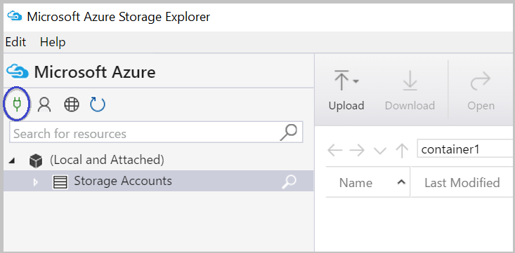
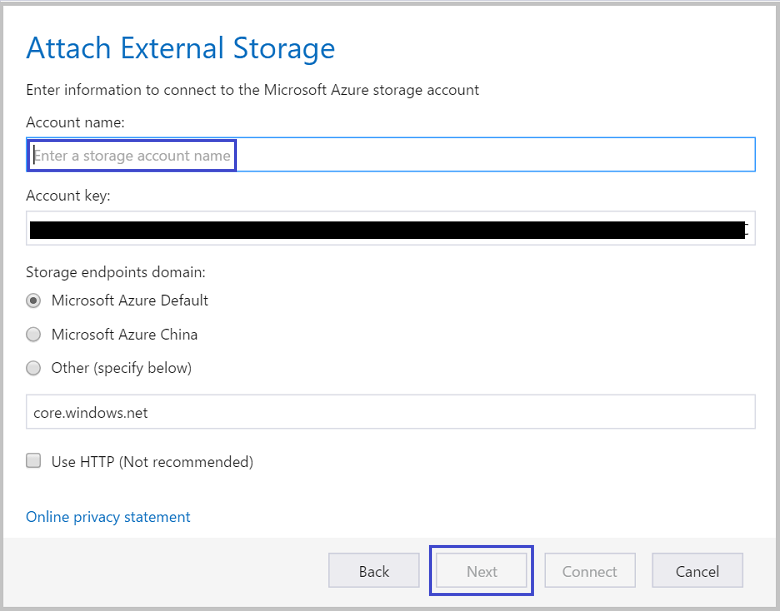
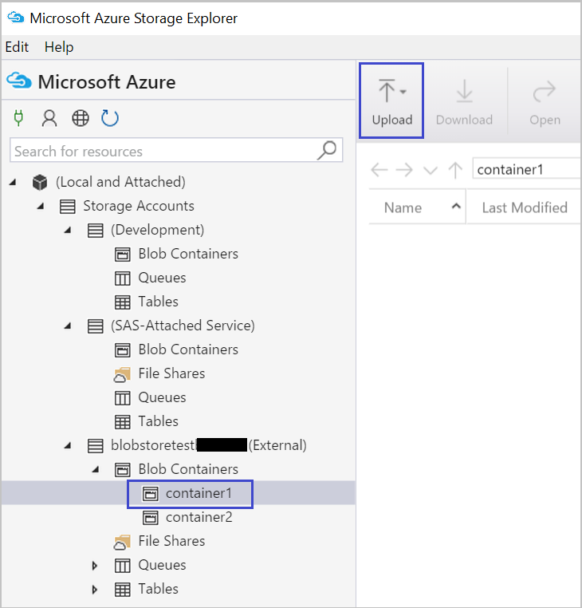
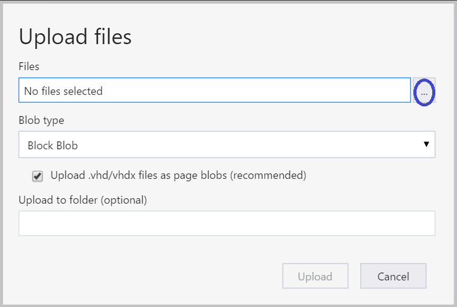

<properties 
    pageTitle="將資料移 Azure Blob 儲存體使用 Azure 儲存檔案總管中往返 |Microsoft Azure" 
    description="移動資料使用 Azure 儲存檔案總管 Azure Blob 儲存體" 
    services="machine-learning,storage" 
    documentationCenter="" 
    authors="bradsev" 
    manager="jhubbard" 
    editor="cgronlun" />

<tags 
    ms.service="machine-learning" 
    ms.workload="data-services" 
    ms.tgt_pltfrm="na" 
    ms.devlang="na" 
    ms.topic="article" 
    ms.date="08/31/2016"
    ms.author="bradsev" />

# 移動資料使用 Azure 儲存檔案總管 Azure Blob 儲存體

Azure 存放裝置總管是 Microsoft，可讓您使用的 Azure 儲存體資料 Windows、 macOS 和 Linux 的免費工具。 本主題說明如何使用它上傳及下載資料從 Azure blob 儲存體。 從[Microsoft Azure 儲存檔案總管](http://storageexplorer.com/)，就可以下載工具。

用來將資料移到及/或從 Azure Blob 儲存體技術指南以下連結︰
 
[AZURE.INCLUDE [blob-storage-tool-selector](../../includes/machine-learning-blob-storage-tool-selector.md)]   

 
> [AZURE.NOTE] 如果您使用的 VM 所設定的[資料科學虛擬機器 Azure 中](machine-learning-data-science-virtual-machines.md)所提供的指令碼，然後 Azure 儲存體 Explorer 已安裝 VM 上。
 
> [AZURE.NOTE] Azure blob 儲存體完成簡介，請參閱[Azure Blob 的基本概念](../storage/storage-dotnet-how-to-use-blobs.md)及[Azure Blob 服務](https://msdn.microsoft.com/library/azure/dd179376.aspx)。   

## 必要條件

這份文件，假設您有 Azure 訂閱儲存的帳戶，與該帳戶的對應的儲存空間鍵。 上傳/下載前的資料，您必須知道您 Azure 儲存體帳戶名稱和帳戶金鑰]。 

- 若要設定的 Azure 訂閱，請參閱[一個月免費的試用版](https://azure.microsoft.com/pricing/free-trial/)。
- 如需建立儲存帳戶的指示及取得帳戶和重要資訊，請參閱[關於 Azure 儲存體帳戶](../storage/storage-create-storage-account.md)。 視需要連線至 Azure 存放裝置總管工具帳戶此按鍵請記下您儲存的帳戶的便捷鍵。
- 從[Microsoft Azure 儲存檔案總管](http://storageexplorer.com/)，就可以下載 Azure 儲存檔案總管] 工具。 在安裝期間接受預設值。

## 使用 Azure 儲存檔案總管 

下列步驟文件上傳下載使用 Azure 存放裝置總管資料的方式。 

1.  啟動 Microsoft Azure 儲存檔案總管]。
2.  若要顯示 [**登入您的帳戶...** ] 精靈，選取**Azure 帳戶設定**] 圖示，然後**新增帳戶]** ，輸入您的認證。 
3.  若要顯示 [**連接至 Azure 儲存體**] 精靈，選取 [**連接至 Azure 儲存體**] 圖示。 
4. 在 [**連接至 Azure 儲存體**精靈]，然後**下一步**，從 Azure 儲存體帳戶輸入便捷鍵。 
5. 在 [**帳戶名稱**] 方塊中輸入儲存體帳戶名稱，然後選取 [**下一步**。 
6. 新增的儲存空間帳戶現在應該會列出。 若要建立容器 blob 儲存體帳戶，以滑鼠右鍵按一下該帳戶**Blob 容器**節點**建立 Blob 容器**，然後選取輸入的名稱。
7. 若要將資料上傳至容器，選取目標容器，然後按一下 [**上傳**] 按鈕。
8. 按一下右邊的 [**檔案**] 方塊的**...**上，選取一或多個檔案上傳檔案系統中，按一下 [開始上傳檔案的 [**上傳**]。
7. 若要下載下載並按一下 [**下載**對應的方塊中選取 blob 的資料。 

