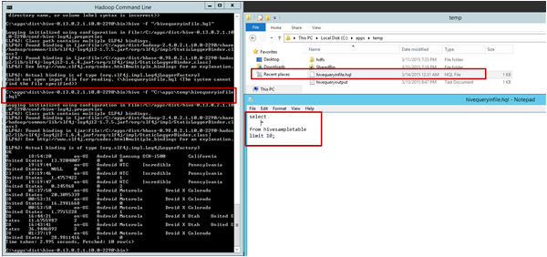
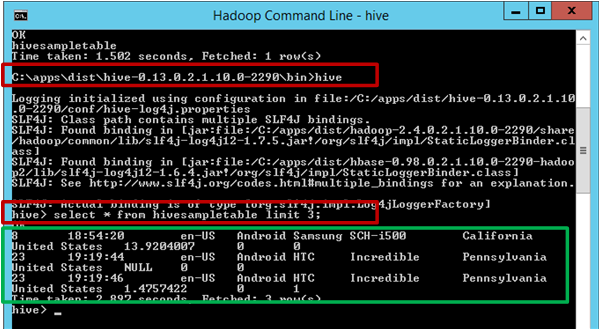
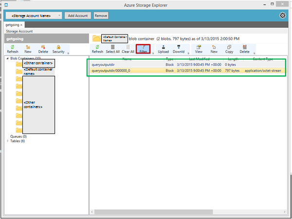

<properties
    pageTitle="建立並將資料載入至 Blob 儲存體的登錄區資料表 |Microsoft Azure"
    description="建立登錄區資料表並載入 blob 至登錄區資料表中的資料"
    services="machine-learning,storage"
    documentationCenter=""
    authors="bradsev"
    manager="jhubbard"
    editor="cgronlun" />

<tags
    ms.service="machine-learning"
    ms.workload="data-services"
    ms.tgt_pltfrm="na"
    ms.devlang="na"
    ms.topic="article"
    ms.date="09/14/2016"
    ms.author="bradsev" />

#建立並將資料載入至登錄區資料表從 Azure blob 儲存體

本主題提供一般建立登錄區資料表，並從 Azure blob 儲存體載入資料的登錄區查詢。 分割登錄區資料表及使用最佳化列欄 (ORC) 格式設定以改善查詢效能，也會提供一些指引。

主題說明如何將內嵌的資料到目標環境可以儲存及處理期間小組資料科學程序 (TDSP) 資料此**功能表**連結。

[AZURE.INCLUDE [cap-ingest-data-selector](../../includes/cap-ingest-data-selector.md)]

## 必要條件
本文假設您有︰

* 建立 Azure 儲存體帳戶。 如果您需要的指示，請參閱[關於 Azure 儲存體帳戶](../storage/storage-create-storage-account.md)。 
* 佈建自訂的 Hadoop 叢集 HDInsight 服務。  如果您需要的指示，請參閱[自訂 Azure HDInsight Hadoop 叢集進階分析](machine-learning-data-science-customize-hadoop-cluster.md)。
* 啟用遠端存取叢集，登入，並開啟 Hadoop 命令列主控台。 如果您需要的指示，請參閱[存取 Hadoop 叢集不對節點](machine-learning-data-science-customize-hadoop-cluster.md#headnode)。

## 上傳至 Azure blob 儲存體的資料
如果您[設定進階分析 Azure 虛擬機器](machine-learning-data-science-setup-virtual-machine.md)中提供的指示建立 Azure 虛擬機器，這個指令碼檔應該已下載到*c:\\使用者\\\<使用者名稱\>\\文件\\資料科學指令碼*目錄虛擬機器上。 這些登錄區查詢只需要，您插入您自己的資料結構描述和 Azure blob 儲存設定為供送出適當的欄位中。

我們假設登錄區資料表的資料是採用**壓縮**表格式格式，並且的資料已上傳至預設的 （或其他），Hadoop 叢集使用的儲存空間帳戶容器。

如果您想要練習**NYC 計程車差旅費資料**，您需要︰

- **下載**24 [NYC 計程車差旅費資料](http://www.andresmh.com/nyctaxitrips)檔案 （12 差旅費檔案和 12 Fare 檔案），
- **將它解壓縮**的所有檔案至.csv 檔案，然後
- 他們 Azure 儲存體帳戶所建立的程序的預設 （或適當的容器）**上傳**所述[的進階分析程序與技術的自訂 Azure HDInsight Hadoop 叢集](machine-learning-data-science-customize-hadoop-cluster.md)主題。 上傳至預設的容器儲存帳戶的.csv 檔案的程序可以在此[頁面](machine-learning-data-science-process-hive-walkthrough.md#upload)上找到。

## 提交登錄區查詢的方式

可以使用送出登錄區查詢︰

1. [送出中 headnode Hadoop 叢集的登錄區查詢透過 Hadoop 命令列](#headnode)
2. [送出登錄區查詢，使用登錄區編輯器](#hive-editor)
3. [送出 Azure PowerShell 命令的登錄區的查詢](#ps)

登錄區查詢 SQL 類似。 如果您是以 SQL 熟悉，您可能會發現[SQL 使用者使用密技工作表的登錄區](http://hortonworks.com/wp-content/uploads/2013/05/hql_cheat_sheet.pdf)有幫助。

當送出登錄區查詢，您也可以在不管是在螢幕上或在本機檔案或 Azure blob 控制的登錄區查詢輸出的目的地。

###1.提交 headnode Hadoop 叢集的登錄區查詢透過 Hadoop 命令列

如果登錄區查詢複雜，直接在 Hadoop 的主節點中送出以叢集通常會更快速開啟比送出以登錄區編輯器或 Azure PowerShell 指令碼。

登入 Hadoop 叢集主節點、 開啟主節點，桌面上 Hadoop 命令列，然後輸入命令`cd %hive_home%\bin`。

您已送出登錄區查詢 Hadoop 命令列中的三種方式︰

* 直接
* 使用.hql 檔案
* 使用登錄區命令主控台

#### 送出登錄區查詢直接在 Hadoop 命令列。

您可以執行命令，例如`hive -e "<your hive query>;`提交簡單的登錄區查詢直接在 Hadoop 命令列。 以下是的範例，紅色方塊概述送出登錄區查詢，命令及綠色方塊將概述登錄區查詢的輸出位置。

#### 送出登錄區.hql 檔案中的查詢

當登錄區查詢較為複雜，並有多個線條時，並不實用編輯命令列或登錄區命令主控台中的查詢。 替代方案是儲存在本機的標頭節點目錄.hql 檔案中的 [登錄區查詢 Hadoop 叢集的標頭節點中使用文字編輯器。 然後登錄區查詢.hql 檔案中的可以使用送出`-f`引數，如下所示︰

    hive -f "<path to the .hql file>"

**隱藏登錄區查詢進度狀態] 畫面的列印**

根據預設，送出登錄區查詢中 Hadoop 命令列中之後, 的地圖/縮減工作進度列印在畫面上。 若要隱藏地圖/縮減工作進度的畫面列印，您可以使用引數`-S`（」 功能 「 大寫） 在命令線條，如下所示︰

    hive -S -f "<path to the .hql file>"
    hive -S -e "<Hive queries>"

#### 送出登錄區命令主控台中的登錄區查詢。

您可以執行命令，以也會先輸入登錄區命令主控台`hive`中 Hadoop 命令列中，然後再將登錄區命令主控台中的登錄區查詢。 以下是範例。 在此範例中，兩個紅色方塊醒目提示的命令來輸入登錄區命令主控台和在登錄區命令主控台中，分別送出登錄區查詢。 綠色方塊會醒目提示登錄區查詢的輸出。

上一個範例直接輸出登錄區查詢結果，畫面上。 您也可以撰寫輸出至本機檔案主節點，或是 Azure blob。 然後，您可以使用其他工具，以進一步分析的登錄區查詢輸出。

**輸出至本機檔案的登錄區查詢結果。**

若要輸出登錄區上的標頭節點的本機目錄的查詢結果，您必須送出登錄區查詢 Hadoop 命令列中，如下所示︰

    hive -e "<hive query>" > <local path in the head node>

在下列範例中，將檔案寫入的登錄區查詢輸出`hivequeryoutput.txt`目錄中`C:\apps\temp`。

**Azure blob 輸出登錄區查詢結果**

您也可以輸出 Hadoop 叢集的預設容器內的 Azure blob 登錄區查詢結果。 此登錄區查詢如下所示︰

    insert overwrite directory wasb:///<directory within the default container> <select clause from ...>

在下列範例中，寫入 blob 目錄的登錄區查詢輸出`queryoutputdir`Hadoop 叢集的預設容器內。 在這裡，您只需要提供目錄的名稱沒有 blob 的名稱。 如果所提供的目錄和 blob 的名稱，例如，錯誤會擲回`wasb:///queryoutputdir/queryoutput.txt`。

如果您開啟 Hadoop 叢集使用 Azure 儲存檔案總管的預設容器，就可以看見登錄區查詢，如下圖所示的輸出。 您可以只擷取以在名稱中的指定字母 blob 套用篩選 （紅色方塊為醒目提示）。

###2.送出登錄區查詢，使用登錄區編輯器

您也可以使用查詢主控台 （登錄區編輯器），以輸入表單*的 URL https://&#60;Hadoop 叢集名稱 >.azurehdinsight.net/Home/HiveEditor*到網頁瀏覽器。 您必須登入，請參閱此主控台和，因此您需要以下 Hadoop 叢集認證。

###3.送出 Azure PowerShell 命令的登錄區的查詢

您也可以使用 PowerShell 來送出登錄區查詢。 如需相關指示，請參閱[使用 PowerShell 提交登錄區工作](../hdinsight/hdinsight-submit-hadoop-jobs-programmatically.md#hive-powershell)。

## 建立登錄區資料庫及表格

登錄區查詢共用[Github 存放庫](https://github.com/Azure/Azure-MachineLearning-DataScience/tree/master/Misc/DataScienceProcess/DataScienceScripts/sample_hive_create_db_tbls_load_data_generic.hql)中，因此您可以從該處下載。

以下是建立登錄區資料表的登錄區查詢。

    create database if not exists <database name>;
    CREATE EXTERNAL TABLE if not exists <database name>.<table name>
    (
        field1 string,
        field2 int,
        field3 float,
        field4 double,
        ...,
        fieldN string
    )
    ROW FORMAT DELIMITED FIELDS TERMINATED BY '<field separator>' lines terminated by '<line separator>'
    STORED AS TEXTFILE LOCATION '<storage location>' TBLPROPERTIES("skip.header.line.count"="1");

以下是您要插入的欄位和其他設定的說明︰

- **& #60; 資料庫名稱 >**︰ 您想要建立資料庫的名稱。 如果您只是要使用預設的資料庫，*建立資料庫...*查詢可以省略。
- **& #60; 資料表名稱 >**︰ 您想要在指定的資料庫中建立資料表的名稱。 如果您想要使用預設的資料庫，可以由直接參照表格*& #60; 資料表名稱 >*不 & #60; 資料庫名稱 >。
- **& #60; 欄位分隔符號 >**︰ 分隔符號，用來分隔上傳至登錄區資料表的資料檔案中的欄位。
- **& #60; 行分隔符號 >**︰ 用來分隔線的資料檔案中的分隔符號。
- **& #60; 儲存位置 >**: Azure 存放位置，以儲存登錄區資料表的資料。 如果您沒有指定*位置 」 及 「 # 」 60; 儲存位置 >*，資料庫及表格會儲存在*登錄區/倉庫/*預設的登錄區叢集預設容器中的目錄。 如果您想要指定儲存位置，資料庫及表格的預設容器內有的儲存位置。 此位置有參照為相對於預設的容器的位置中的格式的叢集*'wasb: / / & #60; 目錄 1 > /'*或*' wasb: / / & #60; 目錄 1 > / & #60; 目錄 2 > /'*等。執行查詢後，相對的目錄會建立預設容器內。
- **TBLPROPERTIES("skip.header.line.count"="1")**︰ 如果資料檔案具有標題列，您必須新增此屬性**結尾處***建立資料表*查詢。 否則，標題列會載入為記錄至資料表。 如果資料檔中沒有標題列，此設定可以省略查詢中。

## 載入登錄區資料表的資料
以下是將登錄區資料表資料載入登錄區查詢。

    LOAD DATA INPATH '<path to blob data>' INTO TABLE <database name>.<table name>;

- **& #60; blob 資料路徑 >**︰ 如果 blob 檔案上傳至登錄區資料表是預設的容器中 HDInsight Hadoop 叢集， *& #60; blob 資料路徑 >*應該格式*' wasb: / / & #60; 容器中的目錄 > / & #60; blob 檔案名稱 >'*。 Blob 檔案，也可以在 HDInsight Hadoop 叢集的額外的容器。 在此情況下， *& #60; blob 資料路徑 >*應該格式*' wasb: / / & #60; 容器name>@&#60;storage帳戶名稱 >.blob.core.windows.net/ 」 及 「 # 」 60; blob 檔案名稱 >'*。

    >[AZURE.NOTE] Blob 資料上傳至登錄區資料表必須是在預設或 Hadoop 叢集儲存帳戶的其他容器。 否則，*載入資料*查詢會失敗抱怨無法存取資料。

## 進階主題︰ 分割表格儲存區中的資料和 ORC 格式

如果資料很大，分割表格是有幫助只需要掃描資料表的幾個磁碟分割區的查詢。 舉例來說，則合理依日期分割記錄資料的網站。

除了分割登錄區資料表，也很有幫助以最佳化列欄 (ORC) 格式儲存的登錄區資料。 如需有關 ORC 格式設定的詳細資訊，請參閱<a href="https://cwiki.apache.org/confluence/display/Hive/LanguageManual+ORC#LanguageManualORC-ORCFiles" target="_blank">使用 ORC 檔案可改善效能時登錄區讀取、 撰寫，以及處理資料</a>。

### 分割的資料表
以下是建立分割的資料表和資料載入登錄區查詢。

    CREATE EXTERNAL TABLE IF NOT EXISTS <database name>.<table name>
    (field1 string,
    ...
    fieldN string
    )
    PARTITIONED BY (<partitionfieldname> vartype) ROW FORMAT DELIMITED FIELDS TERMINATED BY '<field separator>'
         lines terminated by '<line separator>' TBLPROPERTIES("skip.header.line.count"="1");
    LOAD DATA INPATH '<path to the source file>' INTO TABLE <database name>.<partitioned table name>
        PARTITION (<partitionfieldname>=<partitionfieldvalue>);

查詢時分割的資料表，建議將**開頭**的磁碟分割條件`where`為此子句可以改善搜尋大幅的功效。

    select
        field1, field2, ..., fieldN
    from <database name>.<partitioned table name>
    where <partitionfieldname>=<partitionfieldvalue> and ...;

### ORC 格式資料儲存區

您無法直接資料載入從 blob 儲存體中 ORC 格式所儲存的登錄區資料表。 以下是您需要載入採取的步驟資料從 Azure blob ORC 格式儲存在登錄區資料表。

建立外部表格**儲存另存新檔 TEXTFILE**並載入資料 blob 儲存體的資料表。

        CREATE EXTERNAL TABLE IF NOT EXISTS <database name>.<external textfile table name>
        (
            field1 string,
            field2 int,
            ...
            fieldN date
        )
        ROW FORMAT DELIMITED FIELDS TERMINATED BY '<field separator>'
            lines terminated by '<line separator>' STORED AS TEXTFILE
            LOCATION 'wasb:///<directory in Azure blob>' TBLPROPERTIES("skip.header.line.count"="1");

        LOAD DATA INPATH '<path to the source file>' INTO TABLE <database name>.<table name>;

在步驟 1 所使用的相同欄位分隔符號，外部表格的結構描述建立內部表格和儲存登錄區資料以 ORC 格式。

        CREATE TABLE IF NOT EXISTS <database name>.<ORC table name>
        (
            field1 string,
            field2 int,
            ...
            fieldN date
        )
        ROW FORMAT DELIMITED FIELDS TERMINATED BY '<field separator>' STORED AS ORC;

步驟 1 中外部資料表中選取資料，並插入 ORC 資料表

        INSERT OVERWRITE TABLE <database name>.<ORC table name>
            SELECT * FROM <database name>.<external textfile table name>;

>[AZURE.NOTE] 如果 TEXTFILE 表格*& #60; 資料庫名稱 >。 & #60; 外部 textfile 資料表名稱 >*在步驟 3 中，有的磁碟分割`SELECT * FROM <database name>.<external textfile table name>`命令會選取磁碟分割變數為傳回資料集中的欄位。 插入*& #60; 資料庫名稱 >。 & #60; ORC 資料表名稱 >*失敗自*& #60; 資料庫名稱 >。 & #60; ORC 資料表名稱 >*沒有分割變數為資料表結構描述中的欄位。 您需要在此情況下，特別是選取欄位會插入*& #60; 資料庫名稱 >。 & #60; ORC 資料表名稱 >* ，如下所示︰

        INSERT OVERWRITE TABLE <database name>.<ORC table name> PARTITION (<partition variable>=<partition value>)
           SELECT field1, field2, ..., fieldN
           FROM <database name>.<external textfile table name>
           WHERE <partition variable>=<partition value>;

放心地放*& #60; 外部 textfile 資料表名稱 >*時使用下列查詢之後的所有資料隨後便會插入到*& #60; 資料庫名稱 >。 & #60; ORC 資料表名稱 >*:

        DROP TABLE IF EXISTS <database name>.<external textfile table name>;

此程序之後，您應該已準備好使用 ORC 格式的資料的資料表。  
