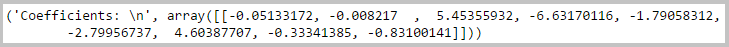
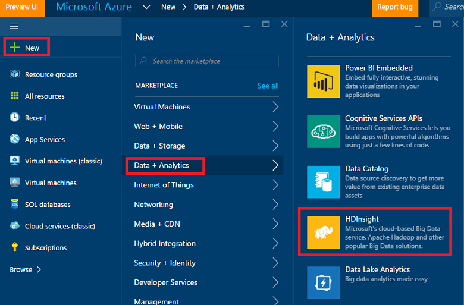
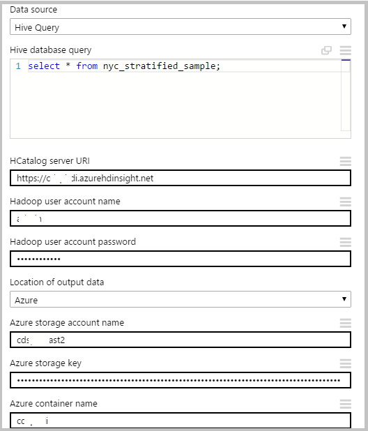

<properties
    pageTitle="調整資料科學中 Azure 資料湖︰ 端對端逐步解說 |Microsoft Azure"
    description="如何使用 Azure 資料湖執行資料集上的資料探索和二進位分類工作。"  
    services="machine-learning"
    documentationCenter=""
    authors="bradsev"
    manager="jhubbard"
    editor="cgronlun" />

<tags
    ms.service="machine-learning"
    ms.workload="data-services"
    ms.tgt_pltfrm="na"
    ms.devlang="na"
    ms.topic="article"
    ms.date="09/19/2016"
    ms.author="bradsev;weig"/>

# 調整資料科學中 Azure 資料湖︰ 端對端逐步解說

這個逐步解說示範如何使用 Azure 資料湖執行資料探索和範例 NYC 計程車差旅費二進位分類工作，最好預測提示會以 fare 所支付的資料集。 它會引導您完成[小組資料科學程序](http://aka.ms/datascienceprocess)的步驟端對端，從資料擷取模型訓練課程，然後與發佈模型的 web 服務的部署。

### Azure 資料湖狀況分析

[Microsoft Azure 資料湖](https://azure.microsoft.com/solutions/data-lake/)有所有的功能，可輕鬆資料科學家必要來儲存資料的任何大小、 圖形以及速度，並進行處理資料、 進階的分析及電腦學習模型高延展性效益的方式。   只有在實際處理資料時，您是為基礎每個工作，付款。 Azure 資料湖分析包含 U SQL，混合生動 power C# 提供可調整的宣告式性質的 SQL 語言分散式查詢功能。 它可讓您處理非結構化的資料，請閱讀在套用結構描述、 插入自訂邏輯和使用者定義函數 (Udf)，並包含擴充功能，使資訊粗略的控制如何在執行。 若要進一步瞭解設計的原理 U SQL 前，請參閱[Visual Studio 部落格文章](https://blogs.msdn.microsoft.com/visualstudio/2015/09/28/introducing-u-sql-a-language-that-makes-big-data-processing-easy/)。

資料湖分析也是 Cortana 分析套件及 Azure SQL Data Warehouse 與 Power BI 資料工廠相關事務的重要部分。 這會提供您的完整雲端的大型資料和進階的分析平台。

此逐步解說開始描述的必要條件和完成工作表單的資料科學程序，以及如何安裝的資料湖分析所需的資源。 描述使用 U SQL 資料處理步驟，並顯示如何使用 Python 和登錄區結束與 Azure 電腦學習 Studio 建立並部署預測的模型。 

### U SQL 和 Visual Studio

此逐步解說建議使用 Visual Studio 編輯 U 指令碼處理資料集。 U SQL 指令碼會此處所述，並提供在不同的檔案。 程序包含 ingesting 與探索，取樣資料。 也會顯示如何從 Azure 入口網站執行指令碼 U SQL 作業。 登錄區資料表建立關聯的 HDInsight 叢集加速建置和二進位分類模型 Azure 電腦學習 Studio 中部署中的資料。  

### Python

此逐步解說也包含說明如何建立並部署 Python 使用 Azure 電腦學習 Studio 預測模型的區段。  我們提供給 Jupyter 筆記本 Python 指令碼這些此程序中的步驟。 筆記本包含的一些其他功能工程步驟與模型建構例如 multiclass 分類和迴歸模型除了此處所述的二進位分類模型的程式碼。 迴歸分析任務是秘訣的預測根據其他秘訣功能。 

### Azure 機器學習
Azure 電腦學習 Studio 用來建立並部署預測的模型。 這是使用兩種方法︰ 第一次使用 Python 指令碼，然後在 HDInsight (Hadoop) 叢集登錄區資料表。

### 指令碼

僅限的主要步驟所述此逐步解說。 您可以從[GitHub](https://github.com/Azure/Azure-MachineLearning-DataScience/tree/master/Misc/AzureDataLakeWalkthrough)下載的完整**U SQL 指令碼**及**Jupyter 筆記本**。

## 必要條件

這些主題之前，您必須具備下列項目︰

- Azure 的訂閱。 如果您還沒有其中一個，請參閱[取得 Azure 免費試用版](https://azure.microsoft.com/documentation/videos/get-azure-free-trial-for-testing-hadoop-in-hdinsight/)。

- [建議]Visual Studio 2013 或 2015年。 如果您還沒有安裝下列版本之一，您可以從 [[在這裡](https://www.visualstudio.com/visual-studio-homepage-vs.aspx)下載免費的社群 edition。 按一下在 Visual Studio] 區段底下的 [**下載社群 2015年**] 按鈕。 

>[AZURE.NOTE] 而不是 Visual Studio 中，您也可以使用 [Azure 入口網站提交 Azure 資料湖查詢。 如何執行此作業同時使用 Visual Studio 及**程序 U SQL 資料**一節的入口網站，我們會提供指示。 

- 註冊 Azure 資料湖預覽

>[AZURE.NOTE] 您需要取得使用 Azure 資料湖儲存區 (ADLS) 和 Azure 資料湖分析 (ADLA)，這些服務和在預覽中的 「 核准 」。 會提示您登入，當您建立您的第一個 ADLS 或 ADLA。 若要 sigh 上，按一下 [**登入，若要預覽**，請閱讀合約，然後按一下**[確定]**。 在這裡，例如，是 ADLS 註冊] 頁面︰

 

## 準備 Azure 資料湖資料科學環境
若要準備資料科學環境此逐步解說，請建立下列資源︰

- Azure 資料湖存放 (ADLS) 
- Azure 資料湖分析 (ADLA)
- Azure Blob 儲存體帳戶
- Azure 電腦學習 Studio 帳戶
- Azure 資料 （建議使用） 的 Visual Studio 湖工具

本節提供如何建立這些資源的每個指示。 如果您選擇使用登錄區資料表與 Azure 電腦學習，而不是 Python，若要建立模型，您也需要佈建 HDInsight (Hadoop) 叢集。 此替代的程序中適當的節所述。
 
>AZURE。請注意**Azure 資料湖存放**可以建立 [分別或當您建立的預設儲存為**Azure 資料湖分析**。 建立下方單獨這些資源的每個所參照的指示，但必須分別建立資料湖儲存帳戶。
 
### 建立 Azure 資料湖存放區

從[Azure 入口網站](http://portal.azure.com)中建立 ADLS。 如需詳細資訊，請參閱[建立資料湖存放 HDInsight 叢集使用 Azure 入口網站](../data-lake-store/data-lake-store-hdinsight-hadoop-use-portal.md)。 請務必設定中所述有**選用設定**刀的**資料來源**刀叢集 AAD 身分識別。 

 

### 建立 Azure 資料湖分析帳戶
從[Azure 入口網站](http://portal.azure.com)中建立 ADLA 帳戶。 如需詳細資訊，請參閱[教學課程︰ 使用 Azure 入口網站 Azure 資料湖分析快速入門](../data-lake-analytics/data-lake-analytics-get-started-portal.md)。 

 

### 建立 Azure Blob 儲存體帳戶
從[Azure 入口網站](http://portal.azure.com)建立 Azure Blob 儲存體帳戶。 如需詳細資訊，請參閱建立[相關 Azure 儲存體帳戶](../storage/storage-create-storage-account.md)中的儲存空間帳戶] 區段。
    
 

### 設定 Azure 電腦學習 Studio 帳戶
從[Azure 電腦學習](https://azure.microsoft.com/services/machine-learning/)頁面，登入向上/Azure 電腦學習 studio。 按一下 [**立即開始**] 按鈕，然後選擇 「 免費的工作區 」 或 「 標準工作區]。 之後您可以建立實驗 Azure 毫升 Studio 中。  

### 安裝 Azure 資料湖工具 [建議]
從[Azure 資料湖工具的 Visual Studio](https://www.microsoft.com/download/details.aspx?id=49504)Visual Studio 的安裝 Azure 資料湖工具。

 

在成功完成安裝之後，開啟 Visual Studio。 您應該會看到資料湖頂端的功能表] 索引標籤。 Azure 資源應該出現在 [左] 面板中，當您登入您的 Azure 帳戶。

 

## NYC 計程車往返資料集
我們在此處所用的資料集是可公開使用資料集- [NYC 計程車往返資料集](http://www.andresmh.com/nyctaxitrips/)。 NYC 計程車差旅費資料包含了關於的 20 GB 壓縮 CSV 檔案 (未壓縮 ~ 48 GB)，錄製超過 173 百萬個別往返與 fares 所支付的每個出差行程井然有序。 每個旅行記錄包含收取和下車位置與時間、 匿名駭客 （驅動程式的） 授權數字及 medallion （計程車的唯一識別碼） 數字。 資料在 2013年年涵蓋所有往返和每個月提供下列兩個資料集︰

 - 「 Trip_data' CSV 包含出差的詳細資訊，例如數乘客、 收取與 dropoff 點、 差旅費工期和旅行長度。 以下是一些範例記錄中︰

        medallion,hack_license,vendor_id,rate_code,store_and_fwd_flag,pickup_datetime,dropoff_datetime,passenger_count, trip_time_in_secs,trip_distance,pickup_longitude,pickup_latitude,dropoff_longitude,dropoff_latitude
        89D227B655E5C82AECF13C3F540D4CF4,BA96DE419E711691B9445D6A6307C170,CMT,1,N,2013-01-01 15:11:48,2013-01-01 15:18:10,4,382,1.00,-73.978165,40.757977,-73.989838,40.751171
        0BD7C8F5BA12B88E0B67BED28BEA73D8,9FD8F69F0804BDB5549F40E9DA1BE472,CMT,1,N,2013-01-06 00:18:35,2013-01-06 00:22:54,1,259,1.50,-74.006683,40.731781,-73.994499,40.75066
        0BD7C8F5BA12B88E0B67BED28BEA73D8,9FD8F69F0804BDB5549F40E9DA1BE472,CMT,1,N,2013-01-05 18:49:41,2013-01-05 18:54:23,1,282,1.10,-74.004707,40.73777,-74.009834,40.726002
        DFD2202EE08F7A8DC9A57B02ACB81FE2,51EE87E3205C985EF8431D850C786310,CMT,1,N,2013-01-07 23:54:15,2013-01-07 23:58:20,2,244,.70,-73.974602,40.759945,-73.984734,40.759388
        DFD2202EE08F7A8DC9A57B02ACB81FE2,51EE87E3205C985EF8431D850C786310,CMT,1,N,2013-01-07 23:25:03,2013-01-07 23:34:24,1,560,2.10,-73.97625,40.748528,-74.002586,40.747868

 - 「 Trip_fare' CSV 包含所支付的每個出差行程井然有序，例如付款類型、 fare 量、 銷售稅和稅金、 秘訣及 tolls，fare 和付款的詳細資料。 以下是一些範例記錄中︰

        medallion, hack_license, vendor_id, pickup_datetime, payment_type, fare_amount, surcharge, mta_tax, tip_amount, tolls_amount, total_amount
        89D227B655E5C82AECF13C3F540D4CF4,BA96DE419E711691B9445D6A6307C170,CMT,2013-01-01 15:11:48,CSH,6.5,0,0.5,0,0,7
        0BD7C8F5BA12B88E0B67BED28BEA73D8,9FD8F69F0804BDB5549F40E9DA1BE472,CMT,2013-01-06 00:18:35,CSH,6,0.5,0.5,0,0,7
        0BD7C8F5BA12B88E0B67BED28BEA73D8,9FD8F69F0804BDB5549F40E9DA1BE472,CMT,2013-01-05 18:49:41,CSH,5.5,1,0.5,0,0,7
        DFD2202EE08F7A8DC9A57B02ACB81FE2,51EE87E3205C985EF8431D850C786310,CMT,2013-01-07 23:54:15,CSH,5,0.5,0.5,0,0,6
        DFD2202EE08F7A8DC9A57B02ACB81FE2,51EE87E3205C985EF8431D850C786310,CMT,2013-01-07 23:25:03,CSH,9.5,0.5,0.5,0,0,10.5

加入出差的唯一索引鍵\_資料和旅行\_fare 由下列三個欄位所組成︰ medallion，具 「 可回復\_授權與收取\_日期時間。 原始的 CSV 檔案可以從公用 Azure 儲存體 blob 存取。 此聯結的 U SQL 指令碼會[加入差旅費和 fare 表格](#join)] 區段中。

## 使用 U SQL 處理資料

說明本節中的資料處理工作包括 ingesting、 檢查品質、 瀏覽，及取樣資料。 我們也會顯示如何加入差旅費和 fare 資料表。 最後一節顯示 U SQL 指令碼的工作從 Azure 入口網站執行。 以下是每個小節的連結︰

- [資料 ingestion︰ 閱讀中公用 blob 的資料](#ingest)
- [資料品質檢查](#quality)
- [資料瀏覽](#explore)
- [加入差旅費和 fare 資料表](#join)
- [取樣資料](#sample)
- [執行 U SQL 作業](#run)

U SQL 指令碼會此處所述，並提供在不同的檔案。 您可以從[GitHub](https://github.com/Azure/Azure-MachineLearning-DataScience/tree/master/Misc/AzureDataLakeWalkthrough)下載完整**U SQL 指令碼**。

若要執行 U SQL，開啟 Visual Studio 中，按一下 [**檔案--> 新增--> [專案**，選擇 [ **U SQL 專案**名稱，並將其儲存至資料夾。

>[AZURE.NOTE] 請可用於執行，而不是 Visual Studio U SQL Azure 入口網站。 您可以瀏覽至 Azure 資料湖分析資源入口網站上，並送出直接為如下圖所示的查詢。

### 閱讀公用 blob 的資料中的資料 Ingestion:

Azure blob 中的資料的位置參照為**wasb://container_name@blob_storage_account_name.blob.core.windows.net/blob_name**，可以使用**Extractors.Csv()**來擷取。 取代您自己的容器名稱和儲存體帳戶名稱中的下列指令碼container_name@blob_storage_account_namewasb 地址。 檔案名稱會位於相同的格式，因此我們可以使用**差旅費\_data_ {\*\}.csv**閱讀 12 出差的所有檔案中。 

    ///Read in Trip data
    @trip0 =
        EXTRACT 
        medallion string,
        hack_license string,
        vendor_id string,
        rate_code string,
        store_and_fwd_flag string,
        pickup_datetime string,
        dropoff_datetime string,
        passenger_count string,
        trip_time_in_secs string,
        trip_distance string,
        pickup_longitude string,
        pickup_latitude string,
        dropoff_longitude string,
        dropoff_latitude string
    // This is reading 12 trip data from blob
    FROM "wasb://container_name@blob_storage_account_name.blob.core.windows.net/nyctaxitrip/trip_data_{*}.csv"
    USING Extractors.Csv();

因為的第一列標題，我們需要移除標題，並變更為適當的欄類型。 我們可以處理的資料使用**swebhdfs://data_lake_storage_name.azuredatalakestorage.net/folder_name/file_name**_ Azure 資料湖儲存或 Azure Blob 儲存體帳戶使用 [儲存**wasb://container_name@blob_storage_account_name.blob.core.windows.net/blob_name**。 

    // change data types
    @trip =
        SELECT 
        medallion,
        hack_license,
        vendor_id,
        rate_code,
        store_and_fwd_flag,
        DateTime.Parse(pickup_datetime) AS pickup_datetime,
        DateTime.Parse(dropoff_datetime) AS dropoff_datetime,
        Int32.Parse(passenger_count) AS passenger_count,
        Double.Parse(trip_time_in_secs) AS trip_time_in_secs,
        Double.Parse(trip_distance) AS trip_distance,
        (pickup_longitude==string.Empty ? 0: float.Parse(pickup_longitude)) AS pickup_longitude,
        (pickup_latitude==string.Empty ? 0: float.Parse(pickup_latitude)) AS pickup_latitude,
        (dropoff_longitude==string.Empty ? 0: float.Parse(dropoff_longitude)) AS dropoff_longitude,
        (dropoff_latitude==string.Empty ? 0: float.Parse(dropoff_latitude)) AS dropoff_latitude
    FROM @trip0
    WHERE medallion != "medallion";

    ////output data to ADL
    OUTPUT @trip   
    TO "swebhdfs://data_lake_storage_name.azuredatalakestore.net/nyctaxi_folder/demo_trip.csv"
    USING Outputters.Csv(); 

    ////Output data to blob
    OUTPUT @trip   
    TO "wasb://container_name@blob_storage_account_name.blob.core.windows.net/demo_trip.csv"
    USING Outputters.Csv();  

同樣地，我們可以讀取 fare 資料集。 以滑鼠右鍵按一下 Azure 資料湖存放區，您可以選擇要查看**Azure 入口網站--> 資料總管**或 Visual Studio 中的**檔案總管]**中的資料。 

 

 

### 資料品質檢查

在已讀取差旅費和 fare 資料表之後，就可以完成資料品質檢查以下列方式。 所產生的 CSV 檔可輸出至 Azure Blob 儲存體] 或 [Azure 資料湖市集。 

尋找 medallions 數] 及 [唯一的數字的 medallions:

    ///check the number of medallions and unique number of medallions
    @trip2 =
        SELECT
        medallion,
        vendor_id,
        pickup_datetime.Month AS pickup_month
        FROM @trip;
    
    @ex_1 =
        SELECT
        pickup_month, 
        COUNT(medallion) AS cnt_medallion,
        COUNT(DISTINCT(medallion)) AS unique_medallion
        FROM @trip2
        GROUP BY pickup_month;
        OUTPUT @ex_1   
    TO "wasb://container_name@blob_storage_account_name.blob.core.windows.net/demo_ex_1.csv"
    USING Outputters.Csv(); 

尋找已超過 100 個往返這些 medallions:

    ///find those medallions that had more than 100 trips
    @ex_2 =
        SELECT medallion,
               COUNT(medallion) AS cnt_medallion
        FROM @trip2
        //where pickup_datetime >= "2013-01-01t00:00:00.0000000" and pickup_datetime <= "2013-04-01t00:00:00.0000000"
        GROUP BY medallion
        HAVING COUNT(medallion) > 100;
        OUTPUT @ex_2   
    TO "wasb://container_name@blob_storage_account_name.blob.core.windows.net/demo_ex_2.csv"
    USING Outputters.Csv(); 

尋找而言 pickup_longitude 不正確的記錄︰

    ///find those invalid records in terms of pickup_longitude
    @ex_3 =
        SELECT COUNT(medallion) AS cnt_invalid_pickup_longitude
        FROM @trip
        WHERE
        pickup_longitude <- 90 OR pickup_longitude > 90;
        OUTPUT @ex_3   
    TO "wasb://container_name@blob_storage_account_name.blob.core.windows.net/demo_ex_3.csv"
    USING Outputters.Csv(); 

某些變數中尋找遺失的值︰

    //check missing values
    @res =
        SELECT *,
               (medallion == null? 1 : 0) AS missing_medallion
        FROM @trip;
    
    @trip_summary6 =
        SELECT 
            vendor_id,
        SUM(missing_medallion) AS medallion_empty, 
        COUNT(medallion) AS medallion_total,
        COUNT(DISTINCT(medallion)) AS medallion_total_unique  
        FROM @res
        GROUP BY vendor_id;
    OUTPUT @trip_summary6
    TO "wasb://container_name@blob_storage_account_name.blob.core.windows.net/demo_ex_16.csv"
    USING Outputters.Csv();

### 資料瀏覽

我們可以執行的一些資料瀏覽，以取得深入瞭解資料。

尋找 （雪人），然後按一下 [非雪人之間的通訊群組︰

    ///tipped vs. not tipped distribution
    @tip_or_not =
        SELECT *,
               (tip_amount > 0 ? 1: 0) AS tipped
        FROM @fare;
    
    @ex_4 =
        SELECT tipped,
               COUNT(*) AS tip_freq
        FROM @tip_or_not
        GROUP BY tipped;
        OUTPUT @ex_4   
    TO "wasb://container_name@blob_storage_account_name.blob.core.windows.net/demo_ex_4.csv"
    USING Outputters.Csv(); 

尋找截止值提示量的通訊群組︰ 0,5,10 及 20 金額。

    //tip class/range distribution
    @tip_class =
        SELECT *,
               (tip_amount >20? 4: (tip_amount >10? 3:(tip_amount >5 ? 2:(tip_amount > 0 ? 1: 0)))) AS tip_class
        FROM @fare;
    @ex_5 =
        SELECT tip_class,
               COUNT(*) AS tip_freq
        FROM @tip_class
        GROUP BY tip_class;
        OUTPUT @ex_5   
    TO "wasb://container_name@blob_storage_account_name.blob.core.windows.net/demo_ex_5.csv"
    USING Outputters.Csv(); 

尋找差旅費距離的基本的統計資料︰

    // find basic statistics for trip_distance
    @trip_summary4 =
        SELECT 
            vendor_id,
            COUNT(*) AS cnt_row,
            MIN(trip_distance) AS min_trip_distance,
            MAX(trip_distance) AS max_trip_distance,
            AVG(trip_distance) AS avg_trip_distance 
        FROM @trip
        GROUP BY vendor_id;
    OUTPUT @trip_summary4
    TO "wasb://container_name@blob_storage_account_name.blob.core.windows.net/demo_ex_14.csv"
    USING Outputters.Csv();

尋找的百分位數的旅行距離︰

    // find percentiles of trip_distance
    @trip_summary3 =
        SELECT DISTINCT vendor_id AS vendor,
                        PERCENTILE_DISC(0.25) WITHIN GROUP(ORDER BY trip_distance) OVER(PARTITION BY vendor_id) AS median_trip_distance_disc,
                        PERCENTILE_DISC(0.5) WITHIN GROUP(ORDER BY trip_distance) OVER(PARTITION BY vendor_id) AS median_trip_distance_disc,
                        PERCENTILE_DISC(0.75) WITHIN GROUP(ORDER BY trip_distance) OVER(PARTITION BY vendor_id) AS median_trip_distance_disc
        FROM @trip;
       // group by vendor_id;
    OUTPUT @trip_summary3
    TO "wasb://container_name@blob_storage_account_name.blob.core.windows.net/demo_ex_13.csv"
    USING Outputters.Csv(); 

### 加入差旅費和 fare 資料表

Medallion、 hack_license，以及 pickup_time 聯結差旅費和 fare 的資料表。

    //join trip and fare table

    @model_data_full =
    SELECT t.*, 
    f.payment_type, f.fare_amount, f.surcharge, f.mta_tax, f.tolls_amount,  f.total_amount, f.tip_amount,
    (f.tip_amount > 0 ? 1: 0) AS tipped,
    (f.tip_amount >20? 4: (f.tip_amount >10? 3:(f.tip_amount >5 ? 2:(f.tip_amount > 0 ? 1: 0)))) AS tip_class
    FROM @trip AS t JOIN  @fare AS f
    ON   (t.medallion == f.medallion AND t.hack_license == f.hack_license AND t.pickup_datetime == f.pickup_datetime)
    WHERE   (pickup_longitude != 0 AND dropoff_longitude != 0 );

    //// output to blob
    OUTPUT @model_data_full   
    TO "wasb://container_name@blob_storage_account_name.blob.core.windows.net/demo_ex_7_full_data.csv"
    USING Outputters.Csv(); 

    ////output data to ADL
    OUTPUT @model_data_full   
    TO "swebhdfs://data_lake_storage_name.azuredatalakestore.net/nyctaxi_folder/demo_ex_7_full_data.csv"
    USING Outputters.Csv(); 

每個層級的旅客計數，計算的記錄、 平均提示量、 提示量的變異數 （雪人） 之間的百分比。

    // contigency table
    @trip_summary8 =
        SELECT passenger_count,
               COUNT(*) AS cnt,
               AVG(tip_amount) AS avg_tip_amount,
               VAR(tip_amount) AS var_tip_amount,
               SUM(tipped) AS cnt_tipped,
               (float)SUM(tipped)/COUNT(*) AS pct_tipped
        FROM @model_data_full
        GROUP BY passenger_count;
        OUTPUT @trip_summary8
    TO "wasb://container_name@blob_storage_account_name.blob.core.windows.net/demo_ex_17.csv"
    USING Outputters.Csv();

### 取樣資料

第一次我們隨機選取的資料的 0.1%聯結的資料表︰

    //random select 1/1000 data for modeling purpose
    @addrownumberres_randomsample =
    SELECT *,
            ROW_NUMBER() OVER() AS rownum
    FROM @model_data_full;
    
    @model_data_random_sample_1_1000 =
    SELECT *
    FROM @addrownumberres_randomsample
    WHERE rownum % 1000 == 0;
    
    OUTPUT @model_data_random_sample_1_1000   
    TO "wasb://container_name@blob_storage_account_name.blob.core.windows.net/demo_ex_7_random_1_1000.csv"
    USING Outputters.Csv(); 

接下來我們的二進位變數 tip_class 執行 stratified 的範例︰

    //stratified random select 1/1000 data for modeling purpose
    @addrownumberres_stratifiedsample =
    SELECT *,
            ROW_NUMBER() OVER(PARTITION BY tip_class) AS rownum
    FROM @model_data_full;
    
    @model_data_stratified_sample_1_1000 =
    SELECT *
    FROM @addrownumberres_stratifiedsample
    WHERE rownum % 1000 == 0;
    //// output to blob
    OUTPUT @model_data_stratified_sample_1_1000   
    TO "wasb://container_name@blob_storage_account_name.blob.core.windows.net/demo_ex_9_stratified_1_1000.csv"
    USING Outputters.Csv(); 
    ////output data to ADL
    OUTPUT @model_data_stratified_sample_1_1000   
    TO "swebhdfs://data_lake_storage_name.azuredatalakestore.net/nyctaxi_folder/demo_ex_9_stratified_1_1000.csv"
    USING Outputters.Csv(); 

### 執行 U SQL 作業

當您完成編輯 U SQL 指令碼時，您可以使用 Azure 資料湖分析帳戶伺服器提交它們。 按一下 [**資料湖****送出工作**，選取您的**狀況分析帳戶**，選擇 [**平行**，然後按一下 [**送出**] 按鈕。  

 

當作業成功符合時，會顯示工作的狀態 Visual Studio 中監視。 工作完成之後，您甚至可以重新執行工作的執行程序，並找出瓶頸步驟，來提升工作效率。 您也可以前往 Azure 入口網站，以檢查 U SQL 工作的狀態。

 

 

現在您可以檢查 Azure Blob 儲存體或 Azure 入口網站中的輸出檔案。 我們會使用 stratified 的範例資料的我們模型中的下一個步驟。

 

 

## 建立並部署模型中 Azure 電腦學習

我們會示範兩種選項可用您拉取資料至 Azure 電腦學習建立和 

- 在第一個選項，您可以使用 （在上方的**資料取樣**步驟） Azure Blob 寫入取樣的資料，並使用 Python 建立並部署模型從 Azure 電腦學習。 
- 在 [第二個選項，您查詢中的資料 Azure 資料湖直接使用登錄區查詢。 這個選項要求您建立新的 HDInsight 叢集，或使用現有的 HDInsight 叢集登錄區資料表指向 Azure 資料湖存放 NY 計程車資料的位置。  我們討論下列兩個這些選項。 

## 選項 1︰ 建立及部署使用 Python 電腦學習模型

若要建立並部署使用 Python 電腦學習模型，建立 Jupyter 筆記本，您的本機電腦或 Azure 電腦學習 Studio 中。 在[GitHub](https://github.com/Azure/Azure-MachineLearning-DataScience/tree/master/Misc/AzureDataLakeWalkthrough)上提供的 Jupyter 筆記本包含探索、 視覺化方式呈現資料、 功能工程、 模型及部署完整的程式碼。 本文中，我們會示範模型和部署。 

### 匯入 Python 文件庫

若要執行此範例 Jupyter 筆記本或 Python 指令碼檔案，下列封包所需的 Python。 如果您使用的 AzureML 筆記本服務，這些套件已預先安裝。

    import pandas as pd
    from pandas import Series, DataFrame
    import numpy as np
    import matplotlib.pyplot as plt
    from time import time
    import pyodbc
    import os
    from azure.storage.blob import BlobService
    import tables
    import time
    import zipfile
    import random
    import sklearn
    from sklearn.linear_model import LogisticRegression
    from sklearn.cross_validation import train_test_split
    from sklearn import metrics
    from __future__ import division
    from sklearn import linear_model
    from azureml import services

### 閱讀中 blob 的資料

- 連線字串   

        CONTAINERNAME = 'test1'
        STORAGEACCOUNTNAME = 'XXXXXXXXX'
        STORAGEACCOUNTKEY = 'YYYYYYYYYYYYYYYYYYYYYYYYYYYY'
        BLOBNAME = 'demo_ex_9_stratified_1_1000_copy.csv'
        blob_service = BlobService(account_name=STORAGEACCOUNTNAME,account_key=STORAGEACCOUNTKEY)
    
- 閱讀中為文字

        t1 = time.time()
        data = blob_service.get_blob_to_text(CONTAINERNAME,BLOBNAME).split("\n")
        t2 = time.time()
        print(("It takes %s seconds to read in "+BLOBNAME) % (t2 - t1))

     
 
- 新增資料行名稱及分隔欄

        colnames = ['medallion','hack_license','vendor_id','rate_code','store_and_fwd_flag','pickup_datetime','dropoff_datetime',
        'passenger_count','trip_time_in_secs','trip_distance','pickup_longitude','pickup_latitude','dropoff_longitude','dropoff_latitude',
        'payment_type', 'fare_amount', 'surcharge', 'mta_tax', 'tolls_amount',  'total_amount', 'tip_amount', 'tipped', 'tip_class', 'rownum']
        df1 = pd.DataFrame([sub.split(",") for sub in data], columns = colnames)
    

- 變更數字的某些資料欄

        cols_2_float = ['trip_time_in_secs','pickup_longitude','pickup_latitude','dropoff_longitude','dropoff_latitude',
        'fare_amount', 'surcharge','mta_tax','tolls_amount','total_amount','tip_amount', 'passenger_count','trip_distance'
        ,'tipped','tip_class','rownum']
        for col in cols_2_float:
            df1[col] = df1[col].astype(float)

### 建立電腦學習模型

以下我們建立預測是否旅行或不 （雪人） 的二進位分類模型。 Jupyter 筆記本中，您可以找到其他兩個模型︰ multiclass 分類，與迴歸模型。

- 首先，我們需要 scikit 中建立可用的虛擬變數-瞭解模型

        df1_payment_type_dummy = pd.get_dummies(df1['payment_type'], prefix='payment_type_dummy')
        df1_vendor_id_dummy = pd.get_dummies(df1['vendor_id'], prefix='vendor_id_dummy')

- 建立模型的資料範圍

        cols_to_keep = ['tipped', 'trip_distance', 'passenger_count']
        data = df1[cols_to_keep].join([df1_payment_type_dummy,df1_vendor_id_dummy])
        
        X = data.iloc[:,1:]
        Y = data.tipped

- 設定及測試 60 40 分割的訓練

        X_train, X_test, Y_train, Y_test = train_test_split(X, Y, test_size=0.4, random_state=0)

- 訓練課程集中後勤迴歸分析

        model = LogisticRegression()
        logit_fit = model.fit(X_train, Y_train)
        print ('Coefficients: \n', logit_fit.coef_)
        Y_train_pred = logit_fit.predict(X_train)

       

- 分數測試資料集

        Y_test_pred = logit_fit.predict(X_test)

- 計算評估度量

        fpr_train, tpr_train, thresholds_train = metrics.roc_curve(Y_train, Y_train_pred)
        print fpr_train, tpr_train, thresholds_train
        
        fpr_test, tpr_test, thresholds_test = metrics.roc_curve(Y_test, Y_test_pred) 
        print fpr_test, tpr_test, thresholds_test
        
        #AUC
        print metrics.auc(fpr_train,tpr_train)
        print metrics.auc(fpr_test,tpr_test)
        
        #Confusion Matrix
        print metrics.confusion_matrix(Y_train,Y_train_pred)
        print metrics.confusion_matrix(Y_test,Y_test_pred)

       

 
### 建立 Web 服務 API，並使用它 Python 中

我們想要 operationalize 學習模型之後已內建的電腦。 以下我們使用二進位後勤模型作為範例。 請確定 scikit-瞭解您的本機電腦中的版本是 0.15.1。 您不必擔心這，如果您是使用 Azure 毫升 studio 服務。

- 從 Azure 毫升 studio 設定尋找您的工作區的認證。 在 Azure 電腦學習 Studio 中，按一下 [**設定** --> **名稱** --> **授權權杖**。 

    

        workspaceid = 'xxxxxxxxxxxxxxxxxxxxxxxxxxx'
        auth_token = 'xxxxxxxxxxxxxxxxxxxxxxxxxxx'

- 建立 Web 服務

        @services.publish(workspaceid, auth_token) 
        @services.types(trip_distance = float, passenger_count = float, payment_type_dummy_CRD = float, payment_type_dummy_CSH=float, payment_type_dummy_DIS = float, payment_type_dummy_NOC = float, payment_type_dummy_UNK = float, vendor_id_dummy_CMT = float, vendor_id_dummy_VTS = float)
        @services.returns(int) #0, or 1
        def predictNYCTAXI(trip_distance, passenger_count, payment_type_dummy_CRD, payment_type_dummy_CSH,payment_type_dummy_DIS, payment_type_dummy_NOC, payment_type_dummy_UNK, vendor_id_dummy_CMT, vendor_id_dummy_VTS ):
            inputArray = [trip_distance, passenger_count, payment_type_dummy_CRD, payment_type_dummy_CSH, payment_type_dummy_DIS, payment_type_dummy_NOC, payment_type_dummy_UNK, vendor_id_dummy_CMT, vendor_id_dummy_VTS]
            return logit_fit.predict(inputArray)

- 取得 web 服務的憑證

        url = predictNYCTAXI.service.url
        api_key =  predictNYCTAXI.service.api_key
        
        print url
        print api_key

        @services.service(url, api_key)
        @services.types(trip_distance = float, passenger_count = float, payment_type_dummy_CRD = float, payment_type_dummy_CSH=float,payment_type_dummy_DIS = float, payment_type_dummy_NOC = float, payment_type_dummy_UNK = float, vendor_id_dummy_CMT = float, vendor_id_dummy_VTS = float)
        @services.returns(float)
        def NYCTAXIPredictor(trip_distance, passenger_count, payment_type_dummy_CRD, payment_type_dummy_CSH,payment_type_dummy_DIS, payment_type_dummy_NOC, payment_type_dummy_UNK, vendor_id_dummy_CMT, vendor_id_dummy_VTS ):
            pass

- 呼叫 Web 服務 API。 您必須等候之後上一個步驟 5 到 10 秒數。

        NYCTAXIPredictor(1,2,1,0,0,0,0,0,1)

       

## 選項 2︰ 建立並部署模型直接在 Azure 電腦學習

Azure 電腦學習 Studio 可以直接從 Azure 資料湖存放讀取資料，然後用來建立並部署模型。 這種方法使用登錄區資料表的 Azure 資料湖存放區。 這需要個別 Azure HDInsight 叢集會佈建後，在建立登錄區資料表。 下列各節會顯示如何進行此動作。 

### 建立 HDInsight Linux 叢集

從[Azure 入口網站](http://portal.azure.com)中建立 HDInsight 叢集 (Linux)。如需詳細資訊，請參閱**建立有權存取 Azure 資料湖存放 HDInsight 叢集**一節中[建立資料湖存放 HDInsight 叢集使用 Azure 入口網站](../data-lake-store/data-lake-store-hdinsight-hadoop-use-portal.md)。

 

### HDInsight 中建立的登錄區資料表

現在我們建立登錄區資料表，以供在電腦學習 Studio 中 Azure HDInsight 叢集使用 Azure 資料湖存放區中儲存在上一個步驟中的資料。 移至剛才建立的 HDInsight 叢集。 按一下 [**設定** --> **屬性** --> **叢集 AAD 身分識別** --> **ADLS 存取**，請確認您 Azure 資料湖儲存的帳戶已讀取清單中新增、 撰寫及執行權限。 

 

然後按一下 [**設定**] 按鈕旁的 [**儀表板**，就會出現在視窗。 按一下 [**登錄區檢視**右上在右上角的頁面，而您會看到**查詢編輯器]**。

 

 

貼上下列的登錄區指令碼來建立資料表。 Azure 資料湖存放參照，以這種方式中的資料來源的位置是︰ **adl://data_lake_store_name.azuredatalakestore.net:443/folder_name/file_name**。

    CREATE EXTERNAL TABLE nyc_stratified_sample
    (
        medallion string,
        hack_license string,
        vendor_id string,
        rate_code string,
        store_and_fwd_flag string,
        pickup_datetime string,
        dropoff_datetime string,
        passenger_count string,
        trip_time_in_secs string,
        trip_distance string,
        pickup_longitude string,
        pickup_latitude string,
        dropoff_longitude string,
        dropoff_latitude string,
      payment_type string,
      fare_amount string,
      surcharge string,
      mta_tax string,
      tolls_amount string,
      total_amount string,
      tip_amount string,
      tipped string,
      tip_class string,
      rownum string
      )
    ROW FORMAT DELIMITED FIELDS TERMINATED BY ',' lines terminated by '\n'
    LOCATION 'adl://data_lake_storage_name.azuredatalakestore.net:443/nyctaxi_folder/demo_ex_9_stratified_1_1000_copy.csv';

執行查詢完成，您會看到的結果如下︰

 

### 建立並部署模型中 Azure 電腦學習 Studio

我們已準備好要建立並部署預測提示已付款 Azure 電腦學習的模型。 Stratified 的範例資料已準備好要用於此二進位分類 （提示或不） 問題。 使用 multiclass 分類 (tip_class) 和迴歸分析 (tip_amount) 預測模型可以也內建及部署 Azure 電腦學習 Studio，但以下我們只顯示如何處理使用二進位分類模型的情況。

1. 進入 Azure 毫升使用**匯入資料**模組，可在 [**資料輸入與輸出**] 區段中的資料。 如需詳細資訊，請參閱[匯入資料模組](https://msdn.microsoft.com/library/azure/4e1b0fe6-aded-4b3f-a36f-39b8862b9004/)參照頁面。
2. 選取作為**資料來源****屬性**] 面板中的 [**登錄區查詢**]。
3. 在**登錄區資料庫查詢**編輯器] 中貼上下列登錄區指令碼

        select * from nyc_stratified_sample;

4. 輸入 URI 的 HDInsight 叢集 （這可找到 Azure 入口網站中）、 Hadoop 認證、 輸出資料和 Azure 儲存體帳戶名稱/鍵容器名稱的位置。

   

讀取登錄區資料表中的資料分類二進位實驗的範例會顯示在下圖中。

 

建立實驗後，按一下 [**設定 Web 服務** --> **預測 Web 服務**

 

執行 [自動建立計分實驗，完成後，按一下 [**部署 Web 服務**

 

將會短時間內顯示的 web 服務儀表板︰

 

## 摘要

完成這個逐步解說您建立了資料來建立具彈性的端對端方案中 Azure 資料湖科學環境。 此環境來分析大型公用資料集，將它從資料擷取模型訓練，然後再做為 web 服務的部署模型的資料科學程序的標準的步驟。 U SQL 用於處理程序與探索範例資料。 Python 和登錄區已與使用 Azure 電腦學習 Studio 建立並部署預測模型。

## 下一步是什麼？

[小組資料科學程序 (TDSP)](http://aka.ms/datascienceprocess)的學習路徑提供進階的分析程序中的每一個步驟的說明主題連結。 有一系列的逐步解說[小組資料科學程序的逐步解說](data-science-process-walkthroughs.md)頁面上分項展示如何使用各種不同的預測狀況分析案例中的資源和服務︰

- [小組資料科學程序中︰ 使用 SQL Data Warehouse](machine-learning-data-science-process-sqldw-walkthrough.md)
- [小組資料科學程序中︰ 使用 HDInsight Hadoop 叢集](machine-learning-data-science-process-hive-walkthrough.md)
- [小組資料科學程序]: 使用 SQL Server](machine-learning-data-science-process-sql-walkthrough.md)
- [Azure HDInsight 上使用火花資料科學程序概觀](machine-learning-data-science-spark-overview.md)

