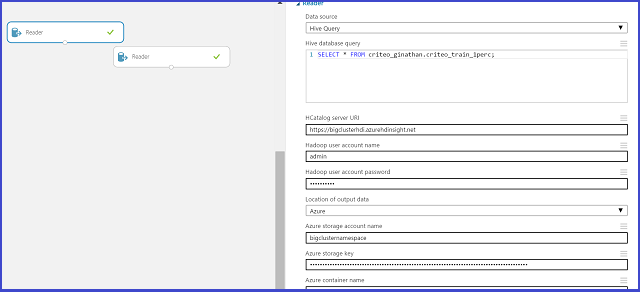
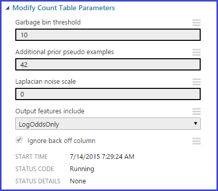
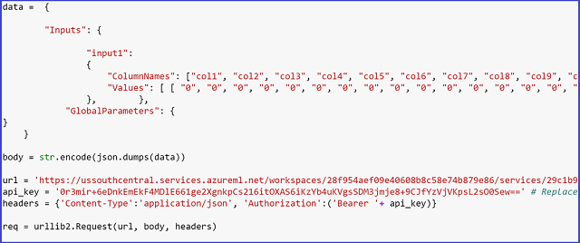

<properties
    pageTitle="小組資料科學程序中︰ 使用 1 TB Criteo 資料集上叢集，HDInsight Hadoop |Microsoft Azure"
    description="使用小組資料科學程序採用 HDInsight Hadoop 叢集，以建立並部署模型，使用大型 (1 TB) 可公開使用資料集的端對端案例"
    services="machine-learning,hdinsight"
    documentationCenter=""
    authors="bradsev"
    manager="jhubbard"
    editor="cgronlun" />

<tags
    ms.service="machine-learning"
    ms.workload="data-services"
    ms.tgt_pltfrm="na"
    ms.devlang="na"
    ms.topic="article"
    ms.date="09/13/2016"
    ms.author="bradsev" />

# 小組資料科學處理程序] 動作的 1 TB 資料集上使用 Azure HDInsight Hadoop 叢集

在此逐步解說，我們會示範使用小組資料科學程序中的[Azure HDInsight Hadoop 叢集](https://azure.microsoft.com/services/hdinsight/)端對端案例來儲存、 瀏覽功能工程和向下一個可公開使用[Criteo](http://labs.criteo.com/downloads/download-terabyte-click-logs/)資料集的範例資料。 我們使用 Azure 電腦學習建立這個資料的二進位分類模型。 我們也會顯示如何將這些模型的其中一個發佈為 Web 服務。

您也可使用 IPython 筆記本來完成工作呈現此逐步解說。 想要嘗試這種方法的使用者，請洽詢[Criteo 逐步解說，使用登錄區 ODBC 連線](https://github.com/Azure/Azure-MachineLearning-DataScience/blob/master/Misc/DataScienceProcess/iPythonNotebooks/machine-Learning-data-science-process-hive-walkthrough-criteo.ipynb)主題。

## Criteo 資料集的描述

資料是按一下預測資料集的 gzip 壓縮 TSV 檔案 (~1.3TB 未壓縮)，大約 370 gb Criteo 可包含多個 4.3 億記錄。 來自 24 天數按一下[Criteo](http://labs.criteo.com/downloads/download-terabyte-click-logs/)所提供的資料。 針對資料科學家方便，我們有解壓縮我們嘗試使用可用的資料。

在此資料集中的每一筆記錄包含 40 個資料行︰

- 第一欄是標籤欄，指出是否使用者按一下 [**新增**（值為 1） 或不按一下其中一個 （值 0）
- 下一步 13 的資料行的數字，和
- 最後一個 26 是類別資料行

資料行匿名，以及使用一系列的列舉名稱: 「 欄 1 」 （適用於標籤] 資料行） 以 「 Col40 」 （適用於最後一個類別資料行）。            

以下是兩個觀察 （列），從這個資料集的前 20 個資料行的摘錄︰

    Col1    Col2    Col3    Col4    Col5    Col6    Col7    Col8    Col9    Col10   Col11   Col12   Col13   Col14   Col15           Col16           Col17           Col18           Col19       Col20

    0       40      42      2       54      3       0       0       2       16      0       1       4448    4       1acfe1ee        1b2ff61f        2e8b2631        6faef306        c6fc10d3    6fcd6dcb           
    0               24              27      5               0       2       1               3       10064           9a8cb066        7a06385f        417e6103        2170fc56        acf676aa    6fcd6dcb                      

遺漏的值數字和類別] 欄中有此資料集。 我們描述簡單的方法處理遺漏的值。 當我們將它們儲存成登錄區資料表探究資料的詳細資料。

**定義︰***點選率 (CTR):*這是可以按一下資料中的百分比。 在此 Criteo 資料集，CTR 會是關於 3.3 百分比] 或 [0.033。

## 預測工作的範例
在此逐步解說收件者有兩個樣本的預測問題︰

1. **二進位分類**︰ 預測使用者按一下 [新增︰
    - 無點選類別 0:
    - 課程 1︰ 按一下

2. **迴歸**︰ 預測 ad 按一下 [從使用者功能的機率。

## 設定設定 HDInsight Hadoop 叢集資料科學

**附註︰**這通常是 「**系統管理**工作。

設定 Azure 資料科學環境建立預測分析解決方案的 HDInsight 叢集三個步驟︰

1. [建立儲存的帳戶](../storage/storage-create-storage-account.md)︰ 此儲存帳戶用來將資料儲存在 Azure Blob 儲存體。 HDInsight 叢集所使用的資料儲存在此處。

2. [自訂 Azure HDInsight Hadoop 叢集資料科學](machine-learning-data-science-customize-hadoop-cluster.md)︰ 此步驟中建立的所有節點上安裝 64 位元 Anaconda Python 2.7 Azure HDInsight Hadoop 叢集。 完成自訂 HDInsight 叢集時有兩個重要的步驟 （如本文所述）。

    * 您必須連結建立時，與您 HDInsight 叢集的步驟 1 中建立的儲存空間帳戶。 此儲存帳戶用來存取可以處理叢集內的資料。

    * 建立後，您必須啟用遠端存取叢集標頭節點。 記住您在這裡指定 （不同於其建立叢集指定） 遠端存取認證︰ 需要完成下列程序。

3. [建立 Azure 毫升工作區](machine-learning-create-workspace.md)︰ 此 Azure 電腦學習工作區用於建立電腦學習模型之後初始資料瀏覽] 及 [下移 HDInsight 叢集上的範例。

## 存取和使用公用來源的資料

[Criteo](http://labs.criteo.com/downloads/download-terabyte-click-logs/)資料集，請按一下連結，接受使用條款，並提供的名稱，可以存取。 快照此外觀如下所示︰

按一下 [**繼續] 以下載**閱讀更多關於資料集及及其可用性。

資料位於公用[Azure blob 儲存體](../storage/storage-dotnet-how-to-use-blobs.md)位置︰ wasb://criteo@azuremlsampleexperiments.blob.core.windows.net/raw/。 「 Wasb 」 指的是 Azure Blob 儲存體位置。 

1. 此公用 blob 儲存體中的資料包含三個的子資料夾的未解壓縮的資料。

    1. 子資料夾*原始/計數/*包含第一個 21 天的日期的資料-\_日 00\_20
    2. 子資料夾*原始/訓練/*組成的資料，一天日期\_21
    3. 子資料夾*原始/測試/*包含的資料，兩天的日期\_22 和日期\_23

2. 那些人想要開始使用原始 gzip 資料，這些，也會出現在主資料夾*原始 /*為 day_NN.gz，從 00 NN 移到 23 位置。

若要存取，請瀏覽的另一種方法和我們建立登錄區資料表時，將會說明在此逐步解說稍後的時，不需要任何本機下載此資料模型。

## 登入叢集 headnode

若要登入叢集的 headnode，使用[Azure 入口網站](https://ms.portal.azure.com)，找出叢集。 按一下左側的 [HDInsight 大象] 圖示，然後按兩下 [叢集的名稱。 瀏覽至 [**設定**] 索引標籤，按兩下頁面底部的 [連線] 圖示，輸入您的遠端存取認證出現提示時。 這會帶您到叢集的 headnode。

以下是一般第一個登入叢集 headnode 看起來像︰

在左側，我們可以看到 「 Hadoop 命令列 」，這是我們 workhorse 的資料瀏覽。 我們也會看到兩個很有用的 Url-「 Hadoop Yarn 狀態 」 與 「 Hadoop 名稱節點 」。 Yarn 狀態 URL 顯示工作進度並名稱節點 URL 詳細說明叢集設定。

現在我們已設定並準備好開始第一個部分的逐步解說︰ 使用登錄區，並準備好進行 Azure 電腦學習中取得資料的資料瀏覽。

## 建立登錄區資料庫及表格

若要建立 Criteo 資料集的登錄區資料表，請開啟***Hadoop 命令列***在桌面上的主節點，並輸入登錄區目錄輸入命令

    cd %hive_home%\bin

>[AZURE.NOTE] 執行這個逐步解說中的所有登錄區命令，從登錄區回收筒 / 目錄提示。 這會自動處理任何路徑問題。 我們使用字詞 「 登錄區目錄提示時，「 「 登錄區回收筒 / 目錄提示 」，並 「 Hadoop 命令列 」 交替。

>[AZURE.NOTE]  若要執行的任何登錄區查詢，其中一個永遠可以使用下列命令︰

        cd %hive_home%\bin
        hive

使用出現的登錄區複寫後 」 登錄區 > 」 登入，只要剪下並貼上執行查詢。

下列程式碼會建立資料庫 」 criteo 」，並接著會產生 4 的表格︰

* 內建於天的日期*資料表產生計數*\_日 00\_20，
* *使用與訓練資料集資料表*內建日期\_21，和
* 兩個*資料表作為測試資料集*內建日期\_22 及日\_23 分別。

因為一天的假日，而且我們想要判斷模型是否偵測和之間的差異假日非假日從點選率，我們可以分割成兩個不同資料表的測試資料集。

指令碼[範例與 #95; 登錄區與 #95; 建立 & #95; criteo & #95; 資料庫及 #95; 並 & #95;tables.hql](https://github.com/Azure/Azure-MachineLearning-DataScience/blob/master/Misc/DataScienceProcess/DataScienceScripts/sample_hive_create_criteo_database_and_tables.hql)方便時觀看以下顯示︰

    CREATE DATABASE IF NOT EXISTS criteo;
    DROP TABLE IF EXISTS criteo.criteo_count;
    CREATE TABLE criteo.criteo_count (
    col1 string,col2 double,col3 double,col4 double,col5 double,col6 double,col7 double,col8 double,col9 double,col10 double,col11 double,col12 double,col13 double,col14 double,col15 string,col16 string,col17 string,col18 string,col19 string,col20 string,col21 string,col22 string,col23 string,col24 string,col25 string,col26 string,col27 string,col28 string,col29 string,col30 string,col31 string,col32 string,col33 string,col34 string,col35 string,col36 string,col37 string,col38 string,col39 string,col40 string)
    ROW FORMAT DELIMITED FIELDS TERMINATED BY '\t'
    LINES TERMINATED BY '\n'
    STORED AS TEXTFILE LOCATION 'wasb://criteo@azuremlsampleexperiments.blob.core.windows.net/raw/count';

    DROP TABLE IF EXISTS criteo.criteo_train;
    CREATE TABLE criteo.criteo_train (
    col1 string,col2 double,col3 double,col4 double,col5 double,col6 double,col7 double,col8 double,col9 double,col10 double,col11 double,col12 double,col13 double,col14 double,col15 string,col16 string,col17 string,col18 string,col19 string,col20 string,col21 string,col22 string,col23 string,col24 string,col25 string,col26 string,col27 string,col28 string,col29 string,col30 string,col31 string,col32 string,col33 string,col34 string,col35 string,col36 string,col37 string,col38 string,col39 string,col40 string)
    ROW FORMAT DELIMITED FIELDS TERMINATED BY '\t'
    LINES TERMINATED BY '\n'
    STORED AS TEXTFILE LOCATION 'wasb://criteo@azuremlsampleexperiments.blob.core.windows.net/raw/train';

    DROP TABLE IF EXISTS criteo.criteo_test_day_22;
    CREATE TABLE criteo.criteo_test_day_22 (
    col1 string,col2 double,col3 double,col4 double,col5 double,col6 double,col7 double,col8 double,col9 double,col10 double,col11 double,col12 double,col13 double,col14 double,col15 string,col16 string,col17 string,col18 string,col19 string,col20 string,col21 string,col22 string,col23 string,col24 string,col25 string,col26 string,col27 string,col28 string,col29 string,col30 string,col31 string,col32 string,col33 string,col34 string,col35 string,col36 string,col37 string,col38 string,col39 string,col40 string)
    ROW FORMAT DELIMITED FIELDS TERMINATED BY '\t'
    LINES TERMINATED BY '\n'
    STORED AS TEXTFILE LOCATION 'wasb://criteo@azuremlsampleexperiments.blob.core.windows.net/raw/test/day_22';

    DROP TABLE IF EXISTS criteo.criteo_test_day_23;
    CREATE TABLE criteo.criteo_test_day_23 (
    col1 string,col2 double,col3 double,col4 double,col5 double,col6 double,col7 double,col8 double,col9 double,col10 double,col11 double,col12 double,col13 double,col14 double,col15 string,col16 string,col17 string,col18 string,col19 string,col20 string,col21 string,col22 string,col23 string,col24 string,col25 string,col26 string,col27 string,col28 string,col29 string,col30 string,col31 string,col32 string,col33 string,col34 string,col35 string,col36 string,col37 string,col38 string,col39 string,col40 string)
    ROW FORMAT DELIMITED FIELDS TERMINATED BY '\t'
    LINES TERMINATED BY '\n'
    STORED AS TEXTFILE LOCATION 'wasb://criteo@azuremlsampleexperiments.blob.core.windows.net/raw/test/day_23';

我們請注意，所有這些表格外部為我們只是指向 Azure Blob 儲存體 (wasb) 的位置。

**有兩種方式執行現在提及的任何登錄區查詢。**

1. **使用命令列登錄區複寫**︰ 第一個是發出的 「 群組 」 命令和複製並貼上在命令列登錄區複寫的查詢。 若要這麼做，請執行︰

        cd %hive_home%\bin
        hive

    現在複寫命令列中，在剪下及貼上查詢會執行它。

2. **儲存檔案的查詢，並執行命令**︰ 第二個是將查詢儲存為.hql 檔案 ([範例與 #95; 登錄區與 #95; 建立 & #95; criteo & #95; 資料庫及 #95; 並 & #95;tables.hql](https://github.com/Azure/Azure-MachineLearning-DataScience/blob/master/Misc/DataScienceProcess/DataScienceScripts/sample_hive_create_criteo_database_and_tables.hql))，然後再下達下列命令以執行查詢︰

        hive -f C:\temp\sample_hive_create_criteo_database_and_tables.hql

### 確認資料庫及表格建立

接下來，我們要確認建立使用下列命令，從登錄區筒資料庫 / 目錄提示︰

        hive -e "show databases;"

這會提供︰

        criteo
        default
        Time taken: 1.25 seconds, Fetched: 2 row(s)

這會確認建立新的資料庫，「 criteo 」。

若要查看我們所建立的資料表，我們只發出命令以下登錄區筒 / 目錄提示︰

        hive -e "show tables in criteo;"

然後，我們就會看到下列輸出︰

        criteo_count
        criteo_test_day_22
        criteo_test_day_23
        criteo_train
        Time taken: 1.437 seconds, Fetched: 4 row(s)

##在群組中的資料瀏覽

現在，我們已準備好在登錄區的一些基本的資料瀏覽。 我們開始計算的訓練中的範例，並測試運算列表。

### 數字的訓練範例

如下所示的[範例與 #95; 登錄區與 #95; 計數與 #95; 訓練與 #95; 資料表與 #95;examples.hql](https://github.com/Azure/Azure-MachineLearning-DataScience/blob/master/Misc/DataScienceProcess/DataScienceScripts/sample_hive_count_train_table_examples.hql)內容︰

        SELECT COUNT(*) FROM criteo.criteo_train;

這會產生︰

        192215183
        Time taken: 264.154 seconds, Fetched: 1 row(s)

或者，其中一個也可能會發出下列命令從登錄區回收筒 / 目錄提示︰

        hive -f C:\temp\sample_hive_count_criteo_train_table_examples.hql

### 數字的中兩個測試資料集的測試範例

現在，我們會計算中兩個測試資料集範例數目。 內容[範例與 #95; 登錄區與 #95; 計數與 #95; criteo & #95; 測試與 #95; 日和 #95; 22 & #95; 資料表與 #95;examples.hql](https://github.com/Azure/Azure-MachineLearning-DataScience/blob/master/Misc/DataScienceProcess/DataScienceScripts/sample_hive_count_criteo_test_day_22_table_examples.hql)這裡︰

        SELECT COUNT(*) FROM criteo.criteo_test_day_22;

這會產生︰

        189747893
        Time taken: 267.968 seconds, Fetched: 1 row(s)

如同以往，我們也可呼叫指令碼登錄區筒 / 目錄提示發出命令︰

        hive -f C:\temp\sample_hive_count_criteo_test_day_22_table_examples.hql

最後，我們檢查測試範例根據天測試資料集內的數字\_23。

要執行此動作的命令會類似只顯示 （參照[範例與 #95; 登錄區與 #95; 計數與 #95; criteo & #95; 測試與 #95; 日和 #95; 23 與 #95;examples.hql](https://github.com/Azure/Azure-MachineLearning-DataScience/blob/master/Misc/DataScienceProcess/DataScienceScripts/sample_hive_count_criteo_test_day_23_examples.hql)）︰

        SELECT COUNT(*) FROM criteo.criteo_test_day_23;

這會提供︰

        178274637
        Time taken: 253.089 seconds, Fetched: 1 row(s)

### 訓練資料集內的標籤通訊群組

訓練資料集內的標籤分配為感興趣。 若要查看此問題，我們會顯示[範例與 #95; 登錄區與 #95; criteo & #95; 標籤與 #95; 通訊與 #95; 訓練與 #95;table.hql](https://github.com/Azure/Azure-MachineLearning-DataScience/blob/master/Misc/DataScienceProcess/DataScienceScripts/sample_hive_criteo_label_distribution_train_table.hql)的內容︰

        SELECT Col1, COUNT(*) AS CT FROM criteo.criteo_train GROUP BY Col1;

這會產生標籤通訊群組︰

        1       6292903
        0       185922280
        Time taken: 459.435 seconds, Fetched: 2 row(s)

請注意，正數的標籤的百分比 （與原始資料集一致） 關於 3.3%。

### 直方圖分配，某些數字中的變數訓練資料集

我們可以使用登錄區的原生 」 直方圖\_數值 」，找出分配的數值變數看起來像函數。 以下是[範例與 #95; 登錄區與 #95; criteo & #95; 直方圖與 #95;numeric.hql](https://github.com/Azure/Azure-MachineLearning-DataScience/blob/master/Misc/DataScienceProcess/DataScienceScripts/sample_hive_criteo_histogram_numeric.hql)的內容︰

        SELECT CAST(hist.x as int) as bin_center, CAST(hist.y as bigint) as bin_height FROM
            (SELECT
            histogram_numeric(col2, 20) as col2_hist
            FROM
            criteo.criteo_train
            ) a
            LATERAL VIEW explode(col2_hist) exploded_table as hist;

這會產生下列動作︰

        26      155878415
        2606    92753
        6755    22086
        11202   6922
        14432   4163
        17815   2488
        21072   1901
        24113   1283
        27429   1225
        30818   906
        34512   723
        38026   387
        41007   290
        43417   312
        45797   571
        49819   428
        53505   328
        56853   527
        61004   160
        65510   3446
        Time taken: 317.851 seconds, Fetched: 20 row(s)

側檢視-分裂登錄區是用來產生類似 SQL 輸出，而不是 [一般] 清單中的組合。 請注意，在此資料表中，第一欄對應至回收筒中心及第二個回收筒頻率。

### 大約某些數字中的變數訓練資料集的百分位數

也數值變數感興趣的是大約的百分位數的計算。 登錄區的原生 」 百分位數\_預估 」 負責這項工作的我們。 內容[範例與 #95; 登錄區與 #95; criteo 與 #95; 大約 & #95;percentiles.hql](https://github.com/Azure/Azure-MachineLearning-DataScience/blob/master/Misc/DataScienceProcess/DataScienceScripts/sample_hive_criteo_approximate_percentiles.hql)是︰

        SELECT MIN(Col2) AS Col2_min, PERCENTILE_APPROX(Col2, 0.1) AS Col2_01, PERCENTILE_APPROX(Col2, 0.3) AS Col2_03, PERCENTILE_APPROX(Col2, 0.5) AS Col2_median, PERCENTILE_APPROX(Col2, 0.8) AS Col2_08, MAX(Col2) AS Col2_max FROM criteo.criteo_train;

這會產生︰

        1.0     2.1418600917169246      2.1418600917169246    6.21887086390288 27.53454893115633       65535.0
        Time taken: 564.953 seconds, Fetched: 1 row(s)

我們在每的百分位數的密切通常相關的任何數字的變數直方圖分配。        

### 尋找某些類別的資料行訓練資料集中唯一值的數目

繼續進行資料探索，我們現在尋找，某些類別的資料行，他們所採取的唯一值的數目。 若要這麼做，我們會顯示的內容[範例與 #95; 登錄區與 #95; criteo 與 #95; 唯一 & #95; 值與 #95;categoricals.hql](https://github.com/Azure/Azure-MachineLearning-DataScience/blob/master/Misc/DataScienceProcess/DataScienceScripts/sample_hive_criteo_unique_values_categoricals.hql):

        SELECT COUNT(DISTINCT(Col15)) AS num_uniques FROM criteo.criteo_train;

這會產生︰

        19011825
        Time taken: 448.116 seconds, Fetched: 1 row(s)

我們請注意，第 15 欄 19 M 唯一值 ！ 使用單純技巧，例如 「 一熱編碼 「 編碼這類高維度的分類變數是不可行。 特別是，我們會說明，並示範強大、 健全技巧，要求[學習使用計算](http://blogs.technet.com/b/machinelearning/archive/2015/02/17/big-learning-made-easy-with-counts.aspx)有效率地處理此問題。

我們查看的一些其他類別資料行以及的唯一值的數目，來結束子本節。 內容[範例與 #95; 登錄區與 #95; criteo 與 #95; 唯一 & #95; 值與 #95; 多 & #95;categoricals.hql](https://github.com/Azure/Azure-MachineLearning-DataScience/blob/master/Misc/DataScienceProcess/DataScienceScripts/sample_hive_criteo_unique_values_multiple_categoricals.hql)是︰

        SELECT COUNT(DISTINCT(Col16)), COUNT(DISTINCT(Col17)),
        COUNT(DISTINCT(Col18), COUNT(DISTINCT(Col19), COUNT(DISTINCT(Col20))
        FROM criteo.criteo_train;

這會產生︰

        30935   15200   7349    20067   3
        Time taken: 1933.883 seconds, Fetched: 1 row(s)

一次我們看到除了第 20 欄，所有的欄有多個唯一值。

### 共同的項目計算的類別中的變數訓練資料集的對數

分類變數組的共同發生次數也會感興趣。 這可以使用中的程式碼來決定[範例與 #95; 登錄區與 #95; criteo 與 #95; 成對 & #95; 分類 & #95;counts.hql](https://github.com/Azure/Azure-MachineLearning-DataScience/blob/master/Misc/DataScienceProcess/DataScienceScripts/sample_hive_criteo_paired_categorical_counts.hql):

        SELECT Col15, Col16, COUNT(*) AS paired_count FROM criteo.criteo_train GROUP BY Col15, Col16 ORDER BY paired_count DESC LIMIT 15;

我們反向計數依其項目，並在此情況下查看前 15。 這會提供我們︰

        ad98e872        cea68cd3        8964458
        ad98e872        3dbb483e        8444762
        ad98e872        43ced263        3082503
        ad98e872        420acc05        2694489
        ad98e872        ac4c5591        2559535
        ad98e872        fb1e95da        2227216
        ad98e872        8af1edc8        1794955
        ad98e872        e56937ee        1643550
        ad98e872        d1fade1c        1348719
        ad98e872        977b4431        1115528
        e5f3fd8d        a15d1051        959252
        ad98e872        dd86c04a        872975
        349b3fec        a52ef97d        821062
        e5f3fd8d        a0aaffa6        792250
        265366bf        6f5c7c41        782142
        Time taken: 560.22 seconds, Fetched: 15 row(s)

## 向下 Azure 電腦學習的範例資料集

讓探索資料集，並示範如何我們可能會執行此類型的任何變數 （包括組合），現在下範例我們探索資料集，讓我們可以建立模型中 Azure 電腦學習。 回收的重點的問題︰ 提供一組範例屬性 （從欄 2-Col40 功能值），我們預測欄 1 是否為 0 （沒有按一下） 或 1 （按一下）。

若要向下範例我們訓練並測試資料集，以原始大小的 1%，我們使用群組的原生 RAND 函數。 下一步的指令碼，[範例與 #95; 登錄區與 #95; criteo & #95; 可以與 #95; 訓練與 #95;dataset.hql](https://github.com/Azure/Azure-MachineLearning-DataScience/blob/master/Misc/DataScienceProcess/DataScienceScripts/sample_hive_criteo_downsample_train_dataset.hql)負責這項工作的訓練資料集︰

        CREATE TABLE criteo.criteo_train_downsample_1perc (
        col1 string,col2 double,col3 double,col4 double,col5 double,col6 double,col7 double,col8 double,col9 double,col10 double,col11 double,col12 double,col13 double,col14 double,col15 string,col16 string,col17 string,col18 string,col19 string,col20 string,col21 string,col22 string,col23 string,col24 string,col25 string,col26 string,col27 string,col28 string,col29 string,col30 string,col31 string,col32 string,col33 string,col34 string,col35 string,col36 string,col37 string,col38 string,col39 string,col40 string)
        ROW FORMAT DELIMITED FIELDS TERMINATED BY '\t'
        LINES TERMINATED BY '\n'
        STORED AS TEXTFILE;

        ---Now downsample and store in this table

        INSERT OVERWRITE TABLE criteo.criteo_train_downsample_1perc SELECT * FROM criteo.criteo_train WHERE RAND() <= 0.01;

這會產生︰

        Time taken: 12.22 seconds
        Time taken: 298.98 seconds

指令碼[範例與 #95; 登錄區與 #95; criteo & #95; 可以與 #95; 測試與 #95; 日和 #95; 22 與 #95;dataset.hql](https://github.com/Azure/Azure-MachineLearning-DataScience/blob/master/Misc/DataScienceProcess/DataScienceScripts/sample_hive_criteo_downsample_test_day_22_dataset.hql)會為測試資料天\_22:

        --- Now for test data (day_22)

        CREATE TABLE criteo.criteo_test_day_22_downsample_1perc (
        col1 string,col2 double,col3 double,col4 double,col5 double,col6 double,col7 double,col8 double,col9 double,col10 double,col11 double,col12 double,col13 double,col14 double,col15 string,col16 string,col17 string,col18 string,col19 string,col20 string,col21 string,col22 string,col23 string,col24 string,col25 string,col26 string,col27 string,col28 string,col29 string,col30 string,col31 string,col32 string,col33 string,col34 string,col35 string,col36 string,col37 string,col38 string,col39 string,col40 string)
        ROW FORMAT DELIMITED FIELDS TERMINATED BY '\t'
        LINES TERMINATED BY '\n'
        STORED AS TEXTFILE;

        INSERT OVERWRITE TABLE criteo.criteo_test_day_22_downsample_1perc SELECT * FROM criteo.criteo_test_day_22 WHERE RAND() <= 0.01;

這會產生︰

        Time taken: 1.22 seconds
        Time taken: 317.66 seconds

最後，指令碼[範例與 #95; 登錄區與 #95; criteo & #95; 可以與 #95; 測試與 #95; 日和 #95; 23 與 #95;dataset.hql](https://github.com/Azure/Azure-MachineLearning-DataScience/blob/master/Misc/DataScienceProcess/DataScienceScripts/sample_hive_criteo_downsample_test_day_23_dataset.hql)會為測試資料天\_23:

        --- Finally test data day_23
        CREATE TABLE criteo.criteo_test_day_23_downsample_1perc (
        col1 string,col2 double,col3 double,col4 double,col5 double,col6 double,col7 double,col8 double,col9 double,col10 double,col11 double,col12 double,col13 double,col14 double,col15 string,col16 string,col17 string,col18 string,col19 string,col20 string,col21 string,col22 string,col23 string,col24 string,col25 string,col26 string,col27 string,col28 string,col29 string,col30 string,col31 string,col32 string,col33 string,col34 string,col35 string,col36 string,col37 string,col38 string,col39 string,col40 srical feature; tring)
        ROW FORMAT DELIMITED FIELDS TERMINATED BY '\t'
        LINES TERMINATED BY '\n'
        STORED AS TEXTFILE;

        INSERT OVERWRITE TABLE criteo.criteo_test_day_23_downsample_1perc SELECT * FROM criteo.criteo_test_day_23 WHERE RAND() <= 0.01;

這會產生︰

        Time taken: 1.86 seconds
        Time taken: 300.02 seconds

使用此，我們已準備好使用我們的向下取樣的訓練及測試資料集來建立模型中 Azure 電腦學習項目。

我們移到 Azure 電腦學習，也就是疑慮計數表格之前有最終的重要元件。 在下一個子區段中，我們討論的一些詳細資料。

##在 [計算] 表格簡短討論

如我們所見，類別的數個變數會有更高的維度。 在我們的逐步解說，我們會提供功能強大的技術稱為[學習使用計算](http://blogs.technet.com/b/machinelearning/archive/2015/02/17/big-learning-made-easy-with-counts.aspx)編碼這些變數有效、 強大的方式。 這項技術的詳細資訊位於提供的連結。

**附註︰**在此逐步解說，我們著重於使用 count 表格產生精簡表示高維度分類的功能。 這不是唯一的方式編碼分類的功能。如需其他技術的詳細資訊，感興趣的使用者可以查看[一熱-編碼](http://en.wikipedia.org/wiki/One-hot)和[雜湊功能](http://en.wikipedia.org/wiki/Feature_hashing)。

若要建立計算資料表上的字數統計資料，我們使用 count 資料夾原始/中的資料。 在 [模型] 區段中，我們會示範使用者如何建立這些計算的資料表分類功能中從頭開始，或者若要使用其 explorations 預先建立的計算的表格。 在下面這樣，我們會將 「 預先建立的計算表格 」 時，我們會表示使用我們所提供的計數資料表。 在下一節中提供如何存取這些表格的詳細的指示。

## 建立與 Azure 電腦學習模型

建立程序中 Azure 電腦學習我們模型遵循下列步驟︰

1. [資料登錄區資料表從全數 Azure 電腦學習](#step1)
2. [建立實驗︰ 讓資料更簡潔、 選擇是型學習者和 featurize 使用 count 表格](#step2)
3. [訓練模型](#step3)
4. [測試資料分數模型](#step4)
5. [評估模型](#step5)
6. [若要使用的 web 服務發佈模型](#step6)

現在，我們已準備好建立模型 Azure 電腦學習 studio 中。 向下取樣的資料會儲存為叢集登錄區資料表。 我們使用 Azure 電腦學習**匯入資料**模組讀取此資料。 以下提供的認證以存取此叢集儲存的帳戶。

### 步驟 1︰ 將 Azure 電腦學習使用匯入資料模組取得登錄區資料表中的資料，並選取電腦，學習實驗

選取 [ **+ 新增**啟動 -> **實驗** -> **空白實驗**。 然後，從左上角的 [**搜尋**] 方塊中，搜尋 「 匯入資料 」。 拖放入實驗畫布 （螢幕的中間名的部分）**匯入資料**模組模組用於資料存取。

這是**匯入資料**時從登錄區資料表取得資料的外觀︰

**匯入資料**模組，圖形中所提供的參數值是排序的只範例值，您需要提供。 以下是如何填寫**匯入資料**模組設定參數一般指引。

1. 針對**資料來源**選擇 「 群組 」 的查詢
2. 在**登錄區資料庫查詢**方塊中，選取 [簡單 * FROM < 您\_資料庫\_name.your\_表格\_名稱 >-即足以。
3. **Hcatalog 伺服器 URI**︰ 如果叢集是 「 abc 」，那麼這只是︰ https://abc.azurehdinsight.net
4. **Hadoop 使用者帳戶名稱**︰ 選擇一次的 commissioning 叢集的使用者名稱。 （不遠端存取使用者名稱 ！）
5. **Hadoop 使用者帳戶的密碼**︰ 選擇一次的 commissioning 叢集的使用者名稱的密碼。 （不是遠端存取密碼 ！）
6. **輸出資料的位置**︰ 選擇 「 Azure 」
7. **Azure 儲存體帳戶名稱**︰ 叢集相關聯的儲存空間帳戶
8. **Azure 儲存體帳戶金鑰]**: 儲存帳戶的索引鍵和叢集關聯。
9. **Azure 容器名稱**︰ 如果叢集名稱是 「 abc 」，那麼這通常是只要 」 abc，」。

一旦將**資料匯入**完成取得 （就會看到模組綠色的刻度） 的資料，儲存此資料以資料集 （使用您所選擇的名稱）。 這樣的呈現方式︰

以滑鼠右鍵按一下 [**匯入資料**] 模組的輸出連接埠。 這會顯示**儲存為資料集**的選項和**視覺效果**選項。 [**視覺效果**] 選項中，按下，如果顯示 100 個資料列的資料，以及右側的面板適用於部分摘要的統計資料。 若要儲存的資料，只要選取 [**儲存為資料集**]，然後依照指示。

若要選取已儲存的資料集，以使用電腦學習實驗中，找出使用 [**搜尋**] 方塊下圖所示的資料集。 直接輸入您要輸入的名稱給部分，若要存取它並拖曳 [主要] 面板中的資料集的資料集。 它放在 [主要] 面板選取用於電腦學習模型中。

>[AZURE.NOTE] 執行此動作訓練] 及 [測試資料集。 此外，請記得要使用的資料庫名稱和供您提供的資料表名稱。 在圖表中的值是單獨圖例 purposes.* *

### 步驟 2︰ 建立簡單的實驗中 Azure 電腦學習預測只要按下 / 未按下滑鼠按鈕

我們 Azure 毫升實驗看起來像這樣︰

現在，我們會檢查這個實驗的主要元件。 提醒，我們需要拖曳我們已儲存的訓練先測試我們實驗畫布上執行的資料集。

#### 清除資料遺失

**清理遺失資料**模組會其名稱的建議︰ 它會遺失的資料，可以是使用者指定的方式。 尋找將本單元中，我們看到以下訊息︰

在這裡，我們選擇所有遺漏的值取代為 0。 還有其他選項，可看見查看模組中的下拉式清單。

#### 在資料] 功能工程

可以有數百萬大型資料集的某些類別功能的唯一值。 使用單純方法，例如一熱編碼代表等高維度的分類功能是完全不可行的。 在此逐步解說，我們會示範如何使用使用內建 Azure 電腦學習模組產生精簡表示這些高維度的分類變數的計數功能。 結束-結果為較小的模型大小、 更快速的訓練課程時間及使用其他技術很相似的效能指標。

##### 建立計算轉換

若要建立計算功能，我們使用用於 Azure 電腦學習**建立計算轉換**模組。 在模組看起來像這樣︰

**重要附註**: [**計算資料行**] 方塊中輸入的欄，我們希望在上執行計算。 一般而言，這些是 （如上所述） 高維度類別資料行。 在開始，我們提及 Criteo 資料集有 26 類別的資料行︰ 從第 Col40 所 15 的欄。 我們計算上所有的內容，並為其索引 （從 15 到 40 並以逗號分隔，如下圖所示)。

若要使用模組 MapReduce 模式中 （適用於大型資料集），我們需要存取 HDInsight Hadoop 叢集 （所使用的功能探索可重複使用的也） 和認證。 上一個數字說明哪些填滿的值看起來像 （取代提供與您的使用案例與相關的圖例中的值）。

在上圖中，我們會示範如何輸入輸入的 blob 位置。 此位置有保留做為計算資料表為基礎的資料。

本單元完成之後，我們可以在更新版本，以滑鼠右鍵按一下 [模組]，選取 [**另存為 [轉換**] 選項中儲存的轉換︰

在我們實驗架構中如上所示，資料集 」 ytransform2 」 會對應確實到已儲存的計數轉換。 剩餘的這項實驗中，我們假設讀者用於**建立計算轉換**模組某些資料產生計數及，可以使用這些計算產生火車上的計算功能，並測試資料集。

##### 選擇要包含的訓練和測試資料集的一部分功能哪些計算

一旦轉換準備的計數，使用者就可以選擇功能要包含在其訓練並測試使用**修改計算表格參數**模組的資料集。 我們只會顯示這個模組以下的完整性，但在興趣簡單的實際中沒有使用，我們實驗。

在此情況下，可以看出，我們已選擇使用只要記錄機率並略過欄關閉後。 我們也可以設定參數回收筒閥值，例如新增平滑法，以及是否要或不使用任何 Laplacian 噪音多少虛擬先前的範例。 全部這些進階功能，則要注意的預設值是很好的功能產生此類型的新使用者的起點。

##### 資料轉換，才會產生的計算功能

現在我們著重於重點轉換我們訓練並測試之前實際產生計算功能的資料。 請注意，我們將 count 轉換套用至我們的資料之前使用過的兩個**執行 R 指令碼**模組。

以下是第一份 R 指令碼︰

在這個 R 指令碼中，我們欄重新命名我們為 「 Col40 「 名稱 」 欄 1 」。 這是因為計數轉換預期此格式的名稱。

在第二個 R 指令碼中，我們平衡負值類別之間的通訊群組 （類別 1 與 0 分別） 來 downsampling 負數的類別。 R 指令碼以下說明如何執行此動作︰

在這個簡單的 R 指令碼，我們使用 「 位置\_協商\_比 「 若要設定的正面和負數的類別平衡量。 這是因為分類問題類別分配的哪裡扭曲 （在本例中，我們已 3.3%正類別和 96.7%負數的類別回收） 通常改善類別不平衡含有效能很重要。

##### 在我們的資料上套用 「 計數 」 轉換

最後，我們可以使用**套用轉換**模組我們火車上套用計數轉換並測試資料集。 本單元儲存的計數轉換為一個輸入和訓練或測試資料集與其他輸入，然後傳回計算功能的資料。 如下所示︰

##### 摘錄計算功能的外觀

是相當有用的計算功能我們的大小寫的外觀。 以下我們會示範這摘錄︰

中看到此我們會示範的是我們在計算欄，我們取得計數並登入任何相關 backoffs 除了的機率。

現在，我們已準備好建立使用這些已轉換的資料集的 Azure 電腦學習模型。 在下一步] 區段中，我們會示範如何完成。

#### Azure 電腦學習模型建置

##### 選擇的是型學習者

首先，我們需要選擇是型學習者。 我們會為我們是型學習者使用兩個類別提高決策樹。 以下是這是型學習者的預設選項︰

針對我們實驗中，我們要選擇預設值。 我們請注意，預設值是通常有意義的好方法可快速的比較基準的效能。 您可以全面參數，如果您選擇要有比較基準後，就可改善效能。

#### 訓練模型

訓練課程，我們只叫用**訓練模型**模組。 它的兩個輸入為兩個類別提高決策樹是型學習者和訓練資料集。 此如下所示︰

#### 分數模型

一旦訓練的模型，我們準備來測試資料集上分數以及評估效能。 我們來使用**分數模型**模組顯示在下圖，以及**評估模型**模組中執行這項︰

### 步驟 5︰ 評估模型

最後，我們想要分析模型效能。 通常的兩個類別 （二進位） 分類的問題，建議的量值是 AUC。 若要以視覺化方式呈現此，我們連結**分數模型**模組至**評估模型**模組這個。 按一下 [**評估模型**模組上的 [**視覺效果**會產生下列所示的圖形︰

二進位 （或兩個類別） 中分類問題，建議的預測精確度量值是區域下曲線 (AUC)。 在以下，我們會示範我們我們測試資料集上使用此模型的結果。 若要取得此問題，請以滑鼠右鍵按一下**評估模型**模組，然後**視覺效果**的輸出連接埠。

### 步驟 6︰ 發佈為 Web 服務的模型
將 Azure 電腦學習模型發佈為 web 服務的複雜的功能很棒的功能，可提供。 完成之後，任何人都可以撥打 web 服務中，輸入所需，預測，且 web 服務使用模型傳回這些預測的資料。

若要這麼做，我們先儲存我們訓練的模型訓練模型物件。 這是以滑鼠右鍵按一下**訓練模型**模組，並使用 [**另存為訓練模型**] 選項。

接下來，我們需要建立的輸入與輸出的 web 服務的連接埠︰

* 輸入的連接埠取得資料的資料，我們需要預測相同的格式
* 輸出連接埠傳回計分標籤和相關聯的機率。

#### 選取資料輸入的連接埠的幾個資料列

會方便使用**套用 SQL 轉換**模組選取要做為輸入連接埠資料的 10 個資料列。 選取 [僅這些資料列的使用此處所示的 SQL 查詢我們輸入連接埠︰

#### Web 服務
現在，我們已準備好執行小型的實驗，可以用來發佈 web 服務。

#### 產生 webservice 的輸入的資料

Zeroth 步驟，計算表很大，因為我們便會花幾行程式測試資料並從中產生輸出資料計算功能。 這可以做為我們的 web 服務的輸入的資料格式。 此如下所示︰

>[AZURE.NOTE] 輸入的資料的格式，我們現在使用**計算 Featurizer**模組的輸出。 一旦執行完成這項實驗中，請從**計數 Featurizer**模組儲存輸出，以資料集。 此資料集用於 web 服務中的輸入資料。

#### 發佈 web 服務的計分實驗

首先，我們會示範這外觀。 基本結構是**分數模型**模組，可接受我們訓練的模型物件和幾行程式我們使用**Count Featurizer**模組的上一個步驟所產生的輸入資料。 我們 Scored 標籤和分數機率專案使用 [選取欄中資料集]。

請注意如何**在資料集中的 [選取資料行**模組可用於 '過濾' 資料從資料集。 我們會顯示以下內容︰

若要取得藍色的輸入與輸出連接埠，您只要按一下右下角的 [**準備 web 服務**。 執行這項實驗也可讓我們發佈 web 服務︰ 按一下 [**發佈 WEB 服務**圖示右下角，此處所示︰

一旦發行 webservice，我們取得重新導向至的頁面，因此如下︰

我們的左邊，請參閱 web 服務的兩個連結︰

* **要求/回應**服務 （或給） 用來單一預測，我們利用此研討會中。
* **批次執行**服務 (BES) 用於批次預測，需要輸入的資料使用進行預測位於 Azure Blob 儲存體。

按一下 [**要求/回應**花我們會提供我們的頁面] 連結上的 [預先定義代碼 C#、 python 和。將此程式碼此便利地可用來撥打電話至 web 服務。 請注意，在此頁面上的 API 金鑰需要使用驗證。

很容易此 python 程式碼複製到新的儲存格 IPython 筆記本中。

以下我們會示範使用正確的 API 金鑰 python 程式碼的區段。

請注意，我們使用我們的 web 服務 API 金鑰取代預設的 API 金鑰。 按一下 [在此 IPython 筆記本中的儲存格上的 [**執行**產生下列回應︰

我們看到兩個測試範例 （在 python 指令碼 JSON 架構） 我們詢問，我們得到答案表單中的 「 Scored 標籤，Scored 機率 」。 請注意，在此情況下，選擇預設值的預先定義的程式碼提供 (0 的數字的所有資料行和字串的所有類別的資料行的 「 值 」)。

這會結束我們顯示如何處理使用 Azure 電腦學習的大型資料集的端對端逐步解說。 我們開始使用 tb 的資料、 建構預測模型，而且部署在雲端的 web 服務。
