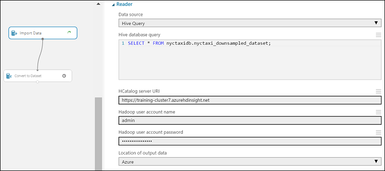
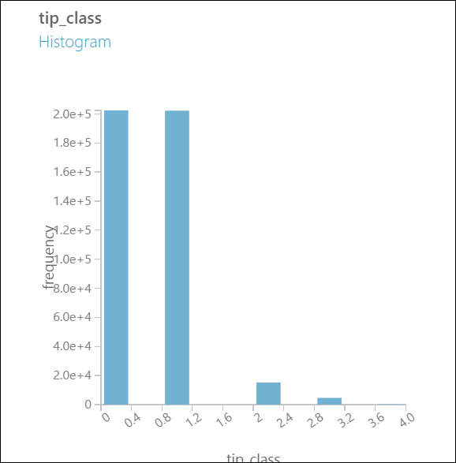
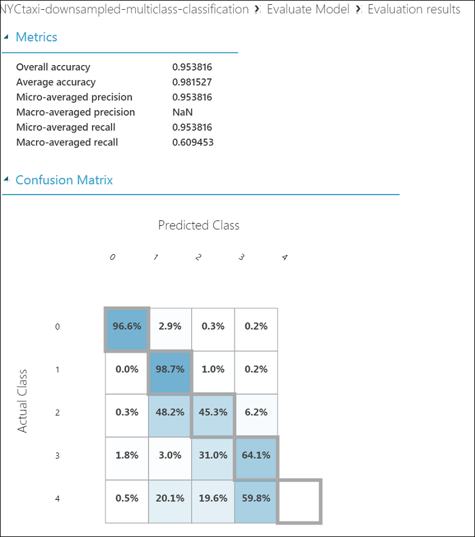

<properties
    pageTitle="小組資料科學程序中︰ 使用 Hadoop 叢集 |Microsoft Azure"
    description="使用小組資料科學程序採用 HDInsight Hadoop 叢集，以建立並部署模型，使用可公開使用資料集的端對端案例。"
    services="machine-learning,hdinsight"
    documentationCenter=""
    authors="bradsev"
    manager="jhubbard"
    editor="cgronlun" />

<tags
    ms.service="machine-learning"
    ms.workload="data-services"
    ms.tgt_pltfrm="na"
    ms.devlang="na"
    ms.topic="article"
    ms.date="09/19/2016"
    ms.author="hangzh;bradsev" />

# 小組資料科學程序中︰ 使用 HDInsight Hadoop 叢集

在此逐步解說，我們會使用[小組資料科學程序 (TDSP)](data-science-process-overview.md)來儲存、 瀏覽和功能工程的資料可公開使用[NYC 計程車往返](http://www.andresmh.com/nyctaxitrips/)集資料，並向下範例資料，請使用[Azure HDInsight Hadoop 叢集](https://azure.microsoft.com/services/hdinsight/)端對端情境中。 資料模型是以處理二進位和 multiclass 分類和迴歸預測工作 Azure 電腦學習建置。

顯示如何處理資料處理使用 HDInsight Hadoop 叢集類似的案例的較大 (1 tb) 資料集的逐步解說，請參閱[小組資料科學程序-使用 Azure HDInsight Hadoop 叢集 1 TB 資料集](machine-learning-data-science-process-hive-criteo-walkthrough.md)。

您也可使用 IPython 筆記本來完成工作所呈現的逐步解說，使用 1 TB 資料集。 想要嘗試這種方法的使用者，請洽詢[Criteo 逐步解說，使用登錄區 ODBC 連線](https://github.com/Azure/Azure-MachineLearning-DataScience/blob/master/Misc/DataScienceProcess/iPythonNotebooks/machine-Learning-data-science-process-hive-walkthrough-criteo.ipynb)主題。

## NYC 計程車往返資料集的描述

NYC 計程車差旅費資料是關於的 20 GB 壓縮的逗點分隔值 (CSV) 檔案 (未壓縮 ~ 48 GB)，可包含多個 173 百萬個別往返和 fares 所支付的每個出差行程井然有序。 每個差旅費記錄包含收取和下車位置與時間、 匿名駭客 （驅動程式的） 授權數字和 medallion （計程車的唯一識別碼） 的數字。 資料在 2013年年涵蓋所有往返和每個月提供下列兩個資料集︰

1. 「 Trip_data' CSV 檔案包含差旅費詳細資料，例如數乘客、 收取和 dropoff 點、 差旅費工期及差旅費長度。 以下是一些範例記錄中︰

        medallion,hack_license,vendor_id,rate_code,store_and_fwd_flag,pickup_datetime,dropoff_datetime,passenger_count,trip_time_in_secs,trip_distance,pickup_longitude,pickup_latitude,dropoff_longitude,dropoff_latitude
        89D227B655E5C82AECF13C3F540D4CF4,BA96DE419E711691B9445D6A6307C170,CMT,1,N,2013-01-01 15:11:48,2013-01-01 15:18:10,4,382,1.00,-73.978165,40.757977,-73.989838,40.751171
        0BD7C8F5BA12B88E0B67BED28BEA73D8,9FD8F69F0804BDB5549F40E9DA1BE472,CMT,1,N,2013-01-06 00:18:35,2013-01-06 00:22:54,1,259,1.50,-74.006683,40.731781,-73.994499,40.75066
        0BD7C8F5BA12B88E0B67BED28BEA73D8,9FD8F69F0804BDB5549F40E9DA1BE472,CMT,1,N,2013-01-05 18:49:41,2013-01-05 18:54:23,1,282,1.10,-74.004707,40.73777,-74.009834,40.726002
        DFD2202EE08F7A8DC9A57B02ACB81FE2,51EE87E3205C985EF8431D850C786310,CMT,1,N,2013-01-07 23:54:15,2013-01-07 23:58:20,2,244,.70,-73.974602,40.759945,-73.984734,40.759388
        DFD2202EE08F7A8DC9A57B02ACB81FE2,51EE87E3205C985EF8431D850C786310,CMT,1,N,2013-01-07 23:25:03,2013-01-07 23:34:24,1,560,2.10,-73.97625,40.748528,-74.002586,40.747868

2. 「 Trip_fare' CSV 檔案包含所支付的每個出差行程井然有序，例如付款類型、 fare 量、 銷售稅和稅金、 秘訣及 tolls，fare 和付款的詳細資料。 以下是一些範例記錄中︰

        medallion, hack_license, vendor_id, pickup_datetime, payment_type, fare_amount, surcharge, mta_tax, tip_amount, tolls_amount, total_amount
        89D227B655E5C82AECF13C3F540D4CF4,BA96DE419E711691B9445D6A6307C170,CMT,2013-01-01 15:11:48,CSH,6.5,0,0.5,0,0,7
        0BD7C8F5BA12B88E0B67BED28BEA73D8,9FD8F69F0804BDB5549F40E9DA1BE472,CMT,2013-01-06 00:18:35,CSH,6,0.5,0.5,0,0,7
        0BD7C8F5BA12B88E0B67BED28BEA73D8,9FD8F69F0804BDB5549F40E9DA1BE472,CMT,2013-01-05 18:49:41,CSH,5.5,1,0.5,0,0,7
        DFD2202EE08F7A8DC9A57B02ACB81FE2,51EE87E3205C985EF8431D850C786310,CMT,2013-01-07 23:54:15,CSH,5,0.5,0.5,0,0,6
        DFD2202EE08F7A8DC9A57B02ACB81FE2,51EE87E3205C985EF8431D850C786310,CMT,2013-01-07 23:25:03,CSH,9.5,0.5,0.5,0,0,10.5

若要加入出差的唯一索引鍵\_資料和旅行\_fare 組成欄位︰ medallion，具 「 可回復\_授權與收取\_datetime。

若要取得詳細資料的所有相關特定的旅行，就可以使用三個機碼加入: 「 medallion 」，「 駭客\_授權 」 和 「 收取\_日期時間 」。

我們將它們儲存成登錄區資料表引進了時，我們會說明一些詳細的資料。

## 預測工作的範例
當接近資料，以決定您想要進行的預測種根據其分析，可協助釐清您將需要程序中所包含的工作。
以下是我們中此其編寫為基礎的逐步解說地址的預測問題的三個範例*提示\_量*:

1. **二進位分類**︰ 預測是否提示付費旅行，亦即*提示\_量*大大於 $0 是正數的範例，時*提示\_量*$0 是負數的範例。

        Class 0 : tip_amount = $0
        Class 1 : tip_amount > $0

2. **Multiclass 分類**︰ 預測費用的旅行提示量的範圍。 將*提示\_量*到五個區間或類別︰

        Class 0 : tip_amount = $0
        Class 1 : tip_amount > $0 and tip_amount <= $5
        Class 2 : tip_amount > $5 and tip_amount <= $10
        Class 3 : tip_amount > $10 and tip_amount <= $20
        Class 4 : tip_amount > $20

3. **迴歸工作**︰ 預測費用的旅行提示的量。  

## 設定進階分析 HDInsight Hadoop 叢集

>[AZURE.NOTE] 這通常是 「**系統管理**工作。

您可以設定的 Azure 環境採用 HDInsight 中的叢集三個步驟的進階分析︰

1. [建立儲存的帳戶](../storage/storage-create-storage-account.md)︰ 此儲存帳戶用來儲存 Azure Blob 儲存體中的資料。 以下也存在於 HDInsight 叢集所使用的資料。

2. [進階分析程序與技術的自訂 Azure HDInsight Hadoop 叢集](machine-learning-data-science-customize-hadoop-cluster.md)。 此步驟建立所有節點安裝 64 位元 Anaconda Python 2.7 叢集 Azure HDInsight Hadoop。 有兩個重要步驟時自訂 HDInsight 叢集記住。

    * 請記得要連結建立時，與您 HDInsight 叢集的步驟 1 中建立的儲存空間帳戶。 此儲存帳戶用來存取處理叢集內的資料。

    * 建立叢集之後，讓遠端存取叢集主節點。 瀏覽至 [**設定**] 索引標籤，然後按一下 [**啟用遠端**]。 此步驟中指定遠端登入所用的使用者認證。

3. [建立 Azure 電腦學習的工作區](machine-learning-create-workspace.md)︰ 此 Azure 電腦學習工作區用來建立電腦學習模型。 完成初始資料探索後] 及 [下移範例使用 HDInsight 叢集，是收件者這項工作。

## 公用來源取得資料

>[AZURE.NOTE] 這通常是 「**系統管理**工作。

若要從其公用位置取得[NYC 計程車往返](http://www.andresmh.com/nyctaxitrips/)資料集，您可能會使用[移動資料與 Azure Blob 儲存體](machine-learning-data-science-move-azure-blob.md)中所描述的方法，將資料複製到您的電腦。

以下我們說明如何使用 AzCopy 傳輸包含資料檔案。 若要下載並安裝 AzCopy 會依照在[開始使用 AzCopy 命令列公用程式](../storage/storage-use-azcopy.md)的指示。

1. 在命令提示字元視窗中發行下列 AzCopy 命令， *< path_to_data_folder >*取代想要的位置︰

        "C:\Program Files (x86)\Microsoft SDKs\Azure\AzCopy\azcopy" /Source:https://nyctaxitrips.blob.core.windows.net/data /Dest:<path_to_data_folder> /S

2. 複製完成後，請 24 壓縮的檔案的總計是選擇 [資料] 資料夾中。 將它解壓縮。 在您的本機電腦上下載的檔案到相同的目錄。 記下未壓縮的檔案所在的資料夾。 此資料夾會被稱為*< 路徑\_至\_unzipped_data\_檔案\>*是什麼後面。

## 上傳至預設的容器的 Azure HDInsight Hadoop 叢集的資料

>[AZURE.NOTE] 這通常是 「**系統管理**工作。

在下列 AzCopy 命令，取代下列參數時建立 Hadoop 叢集所指定的實際值和解壓縮的資料檔案。

* ***& #60; path_to_data_folder >*** （以及路徑） 包含未解壓縮的資料檔案的電腦上的目錄  
* ***& #60; 儲存體帳戶名稱的 Hadoop 叢集 >*** HDInsight 叢集相關聯的儲存空間帳戶
* ***& #60; Hadoop 叢集的預設容器 >***叢集所使用的預設容器。 請注意，通常是預設容器的名稱與叢集本身相同的名稱。 例如，叢集稱為 「 abc123.azurehdinsight.net 」，預設的容器是 abc123。
* ***& #60; 儲存空間的 [帳戶金鑰 >***叢集所使用的儲存空間帳戶的索引鍵

從命令提示字元或在您的電腦中的 Windows PowerShell 視窗，請執行下列兩個 AzCopy 命令。

這個命令的資料上載至差旅費***nyctaxitripraw*** Hadoop 叢集的預設容器中的目錄。

        "C:\Program Files (x86)\Microsoft SDKs\Azure\AzCopy\azcopy" /Source:<path_to_unzipped_data_files> /Dest:https://<storage account name of Hadoop cluster>.blob.core.windows.net/<default container of Hadoop cluster>/nyctaxitripraw /DestKey:<storage account key> /S /Pattern:trip_data_*.csv

這個命令的資料上載至 fare ***nyctaxifareraw*** Hadoop 叢集的預設容器中的目錄。

        "C:\Program Files (x86)\Microsoft SDKs\Azure\AzCopy\azcopy" /Source:<path_to_unzipped_data_files> /Dest:https://<storage account name of Hadoop cluster>.blob.core.windows.net/<default container of Hadoop cluster>/nyctaxifareraw /DestKey:<storage account key> /S /Pattern:trip_fare_*.csv

資料現在應該 Azure Blob 儲存體中並準備好要使用 HDInsight 叢集內。

## 登入 Hadoop 叢集主節點，並且準備探資料分析

>[AZURE.NOTE] 這通常是 「**系統管理**工作。

若要存取叢集探資料分析] 及 [下移範例資料的主節點，請遵循[存取 Hadoop 叢集不對節點](machine-learning-data-science-customize-hadoop-cluster.md#headnode)所述的程序。

在此逐步解說，我們主要使用查詢撰寫[登錄區](https://hive.apache.org/)，類似 SQL 查詢語言]，以執行 explorations 初步的資料。 登錄區查詢會儲存在.hql 檔案。 我們然後向下範例此資料至 Azure 電腦學習中用於建立模型。

若要準備探資料分析叢集，我們可以下載.hql 檔案包含相關登錄區指令碼[github](https://github.com/Azure/Azure-MachineLearning-DataScience/tree/master/Misc/DataScienceProcess/DataScienceScripts)從主節點上的本機目錄 (c:\temp.)。 若要這麼做，請開啟**命令提示字元**中叢集主節點並提交下列兩個命令︰

    set script='https://raw.githubusercontent.com/Azure/Azure-MachineLearning-DataScience/master/Misc/DataScienceProcess/DataScienceScripts/Download_DataScience_Scripts.ps1'

    @powershell -NoProfile -ExecutionPolicy unrestricted -Command "iex ((new-object net.webclient).DownloadString(%script%))"

這兩個命令會下載至主節點中的本機目錄***C:\temp & # 頁，共 92;***此逐步解說中所需的所有.hql 檔案。

## 建立登錄區資料庫及表格分割每月

>[AZURE.NOTE] 這通常是 「**系統管理**工作。

我們已準備好要建立 NYC 計程車資料集的登錄區資料表。
Hadoop 叢集主節點，開啟 [ ***Hadoop 命令列***在桌面上的主節點，然後輸入的登錄區目錄輸入命令

    cd %hive_home%\bin

>[AZURE.NOTE] **從上方的登錄區回收筒執行這個逐步解說中的所有登錄區命令 / 目錄提示。這會負責任何路徑問題自動。我們使用字詞 「 登錄區目錄提示時，「 」 登錄區回收筒 / 目錄提示字元 」，和交替這個逐步解說中的 「 Hadoop 命令列]。**

登錄區目錄提示字元中，輸入下列命令中 Hadoop 命令列的主節點提交登錄區查詢來建立登錄區資料庫及表格︰

    hive -f "C:\temp\sample_hive_create_db_and_tables.hql"

以下是內容***C:\temp\sample\_登錄區\_建立\_db\_和\_tables.hql***登錄區資料庫***nyctaxidb***和表格***差旅費***和***fare***所建立的檔案。

    create database if not exists nyctaxidb;

    create external table if not exists nyctaxidb.trip
    (
        medallion string,
        hack_license string,
        vendor_id string,
        rate_code string,
        store_and_fwd_flag string,
        pickup_datetime string,
        dropoff_datetime string,
        passenger_count int,
        trip_time_in_secs double,
        trip_distance double,
        pickup_longitude double,
        pickup_latitude double,
        dropoff_longitude double,
        dropoff_latitude double)  
    PARTITIONED BY (month int)
    ROW FORMAT DELIMITED FIELDS TERMINATED BY ',' lines terminated by '\n'
    STORED AS TEXTFILE LOCATION 'wasb:///nyctaxidbdata/trip' TBLPROPERTIES('skip.header.line.count'='1');

    create external table if not exists nyctaxidb.fare
    (
        medallion string,
        hack_license string,
        vendor_id string,
        pickup_datetime string,
        payment_type string,
        fare_amount double,
        surcharge double,
        mta_tax double,
        tip_amount double,
        tolls_amount double,
        total_amount double)
    PARTITIONED BY (month int)
    ROW FORMAT DELIMITED FIELDS TERMINATED BY ',' lines terminated by '\n'
    STORED AS TEXTFILE LOCATION 'wasb:///nyctaxidbdata/fare' TBLPROPERTIES('skip.header.line.count'='1');

此登錄區指令碼會建立兩個資料表︰

* 「 出差 」 資料表包含每個賽車 （驅動程式詳細資料、 收取時間、 差旅費距離和時間） 的旅行詳細的資料
* 「 fare 」 資料表包含 fare 詳細資料 （fare 量、 提示量、 tolls 和 surcharges）。

如果您需要使用這些程序的任何其他協助，或要調查替代的文件，請參閱 [[送出登錄區查詢直接從 Hadoop 命令列](machine-learning-data-science-move-hive-tables.md#submit)] 區段。

## 載入的磁碟分割區的登錄區資料表的資料

>[AZURE.NOTE] 這通常是 「**系統管理**工作。

NYC 計程車資料集有自然分割每月，我們使用，以便更快速地處理和查詢的時間。 PowerShell 下方的命令 （從登錄區目錄使用**Hadoop 命令列**發出） 載入分割每月 「 出差 」 和 「 fare 」 登錄區資料表的資料。

    for /L %i IN (1,1,12) DO (hive -hiveconf MONTH=%i -f "C:\temp\sample_hive_load_data_by_partitions.hql")

*範例\_登錄區\_載入\_資料\_以\_partitions.hql*檔案包含下列的**載入**命令。

    LOAD DATA INPATH 'wasb:///nyctaxitripraw/trip_data_${hiveconf:MONTH}.csv' INTO TABLE nyctaxidb.trip PARTITION (month=${hiveconf:MONTH});
    LOAD DATA INPATH 'wasb:///nyctaxifareraw/trip_fare_${hiveconf:MONTH}.csv' INTO TABLE nyctaxidb.fare PARTITION (month=${hiveconf:MONTH});

我們使用以下探索程序中的登錄區查詢的數字涉及來尋找只單一磁碟分割，或只有少數幾磁碟分割區的附註。 但無法執行下列查詢，在整個資料。

### 顯示 HDInsight Hadoop 叢集資料庫

若要顯示在 HDInsight Hadoop 叢集 Hadoop 命令列視窗內建立的資料庫，請執行下列命令 Hadoop 命令列中的商務連絡人︰

    hive -e "show databases;"

### 顯示 nyctaxidb 資料庫中的登錄區資料表

若要顯示 nyctaxidb 資料庫中的資料表，請執行下列命令 Hadoop 命令列中的商務連絡人︰

    hive -e "show tables in nyctaxidb;"

我們可以確認資料表分割發出下列命令︰

    hive -e "show partitions nyctaxidb.trip;"

預期的輸出如下所示︰

    month=1
    month=10
    month=11
    month=12
    month=2
    month=3
    month=4
    month=5
    month=6
    month=7
    month=8
    month=9
    Time taken: 2.075 seconds, Fetched: 12 row(s)

同樣地，我們可以確保 fare 資料表已分割發出下列命令︰

    hive -e "show partitions nyctaxidb.fare;"

預期的輸出如下所示︰

    month=1
    month=10
    month=11
    month=12
    month=2
    month=3
    month=4
    month=5
    month=6
    month=7
    month=8
    month=9
    Time taken: 1.887 seconds, Fetched: 12 row(s)

## 資料瀏覽功能工程和在登錄區

>[AZURE.NOTE] 這通常是**資料科學家**工作。

完成的資料瀏覽及功能工程載入登錄區資料表的資料的工作，可以使用登錄區查詢。 以下是讓我們逐步引導您完成本節中的這類工作範例︰

- 檢視兩個資料表中的前 10 記錄。
- 瀏覽不同的時間 windows 中的幾個欄位的資料發佈。
- 檢查資料品質經緯度欄位。
- 產生二進位和 multiclass 分類的標籤**提示\_量**。
- 計算的直接差旅費距離產生功能。

### 探索︰ 檢視資料表差旅費中的 [前 10 記錄

>[AZURE.NOTE] 這通常是**資料科學家**工作。

若要查看資料的外觀，我們會檢查每個資料表中的 10 筆記錄。 從 Hadoop 命令列主控台檢查記錄中的登錄區目錄提示個別執行下列兩個查詢。

若要將表格 」 差旅費 」 中的前 10 記錄，從第一個月︰

    hive -e "select * from nyctaxidb.trip where month=1 limit 10;"

若要將資料表中的前 10 個記錄 」 fare 」 從第一個月︰

    hive -e "select * from nyctaxidb.fare where month=1 limit 10;"

通常很有用儲存到檔案，以方便檢視的記錄。 上述查詢小型變更這樣的優勢︰

    hive -e "select * from nyctaxidb.fare where month=1 limit 10;" > C:\temp\testoutput

### 探索︰ 檢視每個 12 的磁碟分割區中的記錄數目

>[AZURE.NOTE] 這通常是**資料科學家**工作。

感興趣的是如何往返數目而變化期間日曆年度。 每月的群組，讓我們查看往返此分配的外觀。

    hive -e "select month, count(*) from nyctaxidb.trip group by month;"

這會提供我們輸出︰

    1       14776615
    2       13990176
    3       15749228
    4       15100468
    5       15285049
    6       14385456
    7       13823840
    8       12597109
    9       14107693
    10      15004556
    11      14388451
    12      13971118
    Time taken: 283.406 seconds, Fetched: 12 row(s)

在這裡，第一欄是月份，而第二個是往返數目該月份的。

我們也可以發出下列命令，在登錄區目錄提示字元中，我們差旅費資料集計數記錄總數。

    hive -e "select count(*) from nyctaxidb.trip;"

這會產生︰

    173179759
    Time taken: 284.017 seconds, Fetched: 1 row(s)

使用所示的旅行資料集] 命令，我們可以發行登錄區查詢從 fare 資料集，以驗證的記錄數目的登錄區目錄提示。

    hive -e "select month, count(*) from nyctaxidb.fare group by month;"

這會提供我們輸出︰

    1       14776615
    2       13990176
    3       15749228
    4       15100468
    5       15285049
    6       14385456
    7       13823840
    8       12597109
    9       14107693
    10      15004556
    11      14388451
    12      13971118
    Time taken: 253.955 seconds, Fetched: 12 row(s)

請注意，完全相同數目的每個月，之後會傳回兩個資料集。 這會提供具有正確載入資料的第一個驗證。

計算總數 fare 資料集的記錄可以完成使用登錄區目錄提示以下命令︰

    hive -e "select count(*) from nyctaxidb.fare;"

這會產生︰

    173179759
    Time taken: 186.683 seconds, Fetched: 1 row(s)

兩個資料表中的記錄的總數也是一樣。 這會提供資料有正確載入第二個驗證。

### 探索︰ 出差發佈 medallion

>[AZURE.NOTE] 這通常是**資料科學家**工作。

此範例會識別與超過 100 個往返 medallion （計程車數字），在指定的期間內。 從分割的資料表存取，因為它條件以分割變數**月**查詢優點。 查詢結果會寫入到本機檔案 queryoutput.tsv 中`C:\temp`在。

    hive -f "C:\temp\sample_hive_trip_count_by_medallion.hql" > C:\temp\queryoutput.tsv

以下是內容*範例\_登錄區\_差旅費\_計數\_以\_medallion.hql*檢查檔案。

    SELECT medallion, COUNT(*) as med_count
    FROM nyctaxidb.fare
    WHERE month<=3
    GROUP BY medallion
    HAVING med_count > 100
    ORDER BY med_count desc;

NYC 計程車資料集 medallion 識別唯一封包。 我們可以找出哪些封包了 「 忙碌 」 要求哪些往返數超過在中所做的特定時間範圍。 下列範例會識別封包中的第三個月及儲存至本機檔案]，C:\temp\queryoutput.tsv 的查詢結果進行多個數百往返。

以下是內容*範例\_登錄區\_差旅費\_計數\_以\_medallion.hql*檢查檔案。

    SELECT medallion, COUNT(*) as med_count
    FROM nyctaxidb.fare
    WHERE month<=3
    GROUP BY medallion
    HAVING med_count > 100
    ORDER BY med_count desc;

登錄區目錄提示時，從發出下列命令︰

    hive -f "C:\temp\sample_hive_trip_count_by_medallion.hql" > C:\temp\queryoutput.tsv

### 探索︰ 出差發佈 medallion 和 hack_license

>[AZURE.NOTE] 這通常是**資料科學家**工作。

當探索資料集，我們經常要檢查次數共同-群組的值。 本節提供如何進行此動作的封包和驅動程式的範例。

*範例\_登錄區\_差旅費\_計數\_以\_medallion\_license.hql*檔案群組 fare 資料集 」 medallion 」 和 「 hack_license 」，並傳回計算的每一種組合。 以下是其內容。

    SELECT medallion, hack_license, COUNT(*) as trip_count
    FROM nyctaxidb.fare
    WHERE month=1
    GROUP BY medallion, hack_license
    HAVING trip_count > 100
    ORDER BY trip_count desc;

此查詢會傳回封包和以遞減的往返次數排序的特定驅動程式組合。

從登錄區目錄提示時，執行︰

    hive -f "C:\temp\sample_hive_trip_count_by_medallion_license.hql" > C:\temp\queryoutput.tsv

查詢結果會寫入到 C:\temp\queryoutput.tsv 的本機檔案。

### 探索︰ 評估資料品質檢查無效的經度緯度記錄

>[AZURE.NOTE] 這通常是**資料科學家**工作。

常見的目標探資料分析是快速清除不正確或不正確的記錄。 本節中的範例會決定經度] 或 [緯度欄位是否包含最 NYC 區域外的值。 很可能這類記錄有錯誤的經度緯度值，因為我們想要排除他們的模型使用任何資料。

以下是內容*範例\_登錄區\_品質\_assessment.hql*檢查檔案。

        SELECT COUNT(*) FROM nyctaxidb.trip
        WHERE month=1
        AND  (CAST(pickup_longitude AS float) NOT BETWEEN -90 AND -30
        OR    CAST(pickup_latitude AS float) NOT BETWEEN 30 AND 90
        OR    CAST(dropoff_longitude AS float) NOT BETWEEN -90 AND -30
        OR    CAST(dropoff_latitude AS float) NOT BETWEEN 30 AND 90);

從登錄區目錄提示時，執行︰

    hive -S -f "C:\temp\sample_hive_quality_assessment.hql"

這個命令中包含的*-S*引數會隱藏登錄區地圖/縮減工作狀態] 畫面列印的成品。 這是實用，因為這可讓螢幕登錄區查詢輸出的列印更容易閱讀。

### 探索︰ 二進位類別分配的旅行秘訣

> [AZURE.NOTE] 這通常是**資料科學家**工作。

針對 [[預測工作範例](machine-learning-data-science-process-hive-walkthrough.md#mltasks)] 區段中所述的二進位分類問題，是很有幫助或不是否提供秘訣。 此分配的秘訣為二進位︰

* 提供的秘訣 (課程 1 的提示\_金額 > $0)  
* 沒有提示 (類別 0、 提示\_量 = $0)。

*範例\_登錄區\_雪人\_frequencies.hql*下方所顯示的檔案負責這項工作。

    SELECT tipped, COUNT(*) AS tip_freq
    FROM
    (
        SELECT if(tip_amount > 0, 1, 0) as tipped, tip_amount
        FROM nyctaxidb.fare
    )tc
    GROUP BY tipped;

從登錄區目錄提示時，執行︰

    hive -f "C:\temp\sample_hive_tipped_frequencies.hql"

### 探索︰ 類別分配，multiclass 設定

> [AZURE.NOTE] 這通常是**資料科學家**工作。

[[預測工作範例](machine-learning-data-science-process-hive-walkthrough.md#mltasks)] 區段中的大綱 multiclass 分類問題此資料集也本身以自然分類，我們想要預測的數量提供的秘訣。 若要在查詢中定義提示範圍，我們可以使用區間。 若要針對各種提示範圍課程散佈，我們使用*範例\_登錄區\_提示\_範圍\_frequencies.hql*檔案。 以下是其內容。

    SELECT tip_class, COUNT(*) AS tip_freq
    FROM
    (
        SELECT if(tip_amount=0, 0,
            if(tip_amount>0 and tip_amount<=5, 1,
            if(tip_amount>5 and tip_amount<=10, 2,
            if(tip_amount>10 and tip_amount<=20, 3, 4)))) as tip_class, tip_amount
        FROM nyctaxidb.fare
    )tc
    GROUP BY tip_class;

從 Hadoop 命令列主控台執行下列命令︰

    hive -f "C:\temp\sample_hive_tip_range_frequencies.hql"

### 探索︰ 計算兩個經度緯度位置之間的直接距離

> [AZURE.NOTE] 這通常是**資料科學家**工作。

無法直接距離的量值，可讓我們找出不一致，與實際差旅費距離。 我們來指出旅客可能較不可能秘訣如果他們找出的驅動程式具有刻意他們所採取的較長的路由激勵這項功能。

若要查看實際差旅費距離與兩個經度緯度點 （「 很好圓形 」 距離） 之間的[距離 Haversine](http://en.wikipedia.org/wiki/Haversine_formula)之間的比較，我們使用可用的三角函數內登錄區，因此︰

    set R=3959;
    set pi=radians(180);

    insert overwrite directory 'wasb:///queryoutputdir'

    select pickup_longitude, pickup_latitude, dropoff_longitude, dropoff_latitude, trip_distance, trip_time_in_secs,
    ${hiveconf:R}*2*2*atan((1-sqrt(1-pow(sin((dropoff_latitude-pickup_latitude)
     *${hiveconf:pi}/180/2),2)-cos(pickup_latitude*${hiveconf:pi}/180)
     *cos(dropoff_latitude*${hiveconf:pi}/180)*pow(sin((dropoff_longitude-pickup_longitude)*${hiveconf:pi}/180/2),2)))
     /sqrt(pow(sin((dropoff_latitude-pickup_latitude)*${hiveconf:pi}/180/2),2)
     +cos(pickup_latitude*${hiveconf:pi}/180)*cos(dropoff_latitude*${hiveconf:pi}/180)*
     pow(sin((dropoff_longitude-pickup_longitude)*${hiveconf:pi}/180/2),2))) as direct_distance
    from nyctaxidb.trip
    where month=1
    and pickup_longitude between -90 and -30
    and pickup_latitude between 30 and 90
    and dropoff_longitude between -90 and -30
    and dropoff_latitude between 30 and 90;

上述查詢中 R 中英哩地球半徑，而 pi 會轉換為弧度。 請注意，經度緯度點 」 篩選 「 若要移除不 NYC 區域的值。

在此案例中，我們寫入目錄，稱為 「 queryoutputdir 「 我們的結果。 以下所示的命令的第一次建立此輸出目錄，，，然後執行 [群組] 命令。

從登錄區目錄提示時，執行︰

    hdfs dfs -mkdir wasb:///queryoutputdir

    hive -f "C:\temp\sample_hive_trip_direct_distance.hql"

查詢結果會寫入到 9 Azure blob ***queryoutputdir/000000\_0***至***queryoutputdir/000008\_0*** Hadoop 叢集的預設儲存區。

若要查看個別的二進位大型物件的大小，我們會從登錄區目錄提示執行下列命令︰

    hdfs dfs -ls wasb:///queryoutputdir

若要查看指定檔案的內容，請說出 000000\_0，我們使用 Hadoop 的`copyToLocal`命令，因此。

    hdfs dfs -copyToLocal wasb:///queryoutputdir/000000_0 C:\temp\tempfile

> [AZURE.WARNING] `copyToLocal`可能非常緩慢的大型檔案，並不建議使用它們。  

此資料位於 Azure blob 的主要優點是我們可能探索內 Azure 電腦學習使用[匯入資料]的資料[import-data]模組。

## 向下 Azure 電腦學習中的範例資料和建立模型

> [AZURE.NOTE] 這通常是**資料科學家**工作。

之後探資料分析階段，我們已準備好要向下範例的資料建立模型中 Azure 電腦學習。 在這個區段中，我們會示範如何使用登錄區查詢，向下範例資料，然後從 [[匯入資料]存取[import-data]中 Azure 電腦學習的模組。

### 向下取樣資料

此程序有兩個步驟。 第一次我們加入**nyctaxidb.trip**和**nyctaxidb.fare**資料表中的所有記錄都有的三個機碼: 「 medallion 」，「 駭客\_授權 」，並 」 收取\_datetime 」。 接著產生二進位分類標籤**雪人**與多個類別分類標籤**提示\_課程**。

若要能夠使用向下取樣直接[匯入資料]的資料[import-data]中 Azure 電腦學習模組，就必須儲存至內部登錄區資料表上述查詢的結果。 在以下，我們建立內部的登錄區資料表，然後填入聯結與下取樣資料其內容。

查詢從套用標準登錄區函數直接產生天、 週年、 工作天 （1 單獨星期一或 7 星期日） 的小時 」 收取\_日期時間 」 欄位中，並直接收取和 dropoff 位置之間距離。 使用者可以參照[LanguageManual UDF](https://cwiki.apache.org/confluence/display/Hive/LanguageManual+UDF)的這類函數的完整清單。

查詢然後向下範例資料，讓查詢結果可以配合 Azure 電腦學習 Studio。 Studio 已匯入約 1%的原始資料集。

以下是內容*範例\_登錄區\_準備\_的\_aml\_full.hql*準備資料模型中 Azure 電腦學習建立的檔案。

        set R = 3959;
        set pi=radians(180);

        create table if not exists nyctaxidb.nyctaxi_downsampled_dataset (

        medallion string,
        hack_license string,
        vendor_id string,
        rate_code string,
        store_and_fwd_flag string,
        pickup_datetime string,
        dropoff_datetime string,
        pickup_hour string,
        pickup_week string,
        weekday string,
        passenger_count int,
        trip_time_in_secs double,
        trip_distance double,
        pickup_longitude double,
        pickup_latitude double,
        dropoff_longitude double,
        dropoff_latitude double,
        direct_distance double,
        payment_type string,
        fare_amount double,
        surcharge double,
        mta_tax double,
        tip_amount double,
        tolls_amount double,
        total_amount double,
        tipped string,
        tip_class string
        )
        row format delimited fields terminated by ','
        lines terminated by '\n'
        stored as textfile;

        --- now insert contents of the join into the above internal table

        insert overwrite table nyctaxidb.nyctaxi_downsampled_dataset
        select
        t.medallion,
        t.hack_license,
        t.vendor_id,
        t.rate_code,
        t.store_and_fwd_flag,
        t.pickup_datetime,
        t.dropoff_datetime,
        hour(t.pickup_datetime) as pickup_hour,
        weekofyear(t.pickup_datetime) as pickup_week,
        from_unixtime(unix_timestamp(t.pickup_datetime, 'yyyy-MM-dd HH:mm:ss'),'u') as weekday,
        t.passenger_count,
        t.trip_time_in_secs,
        t.trip_distance,
        t.pickup_longitude,
        t.pickup_latitude,
        t.dropoff_longitude,
        t.dropoff_latitude,
        t.direct_distance,
        f.payment_type,
        f.fare_amount,
        f.surcharge,
        f.mta_tax,
        f.tip_amount,
        f.tolls_amount,
        f.total_amount,
        if(tip_amount>0,1,0) as tipped,
        if(tip_amount=0,0,
        if(tip_amount>0 and tip_amount<=5,1,
        if(tip_amount>5 and tip_amount<=10,2,
        if(tip_amount>10 and tip_amount<=20,3,4)))) as tip_class

        from
        (
        select
        medallion,
        hack_license,
        vendor_id,
        rate_code,
        store_and_fwd_flag,
        pickup_datetime,
        dropoff_datetime,
        passenger_count,
        trip_time_in_secs,
        trip_distance,
        pickup_longitude,
        pickup_latitude,
        dropoff_longitude,
        dropoff_latitude,
        ${hiveconf:R}*2*2*atan((1-sqrt(1-pow(sin((dropoff_latitude-pickup_latitude)
        *${hiveconf:pi}/180/2),2)-cos(pickup_latitude*${hiveconf:pi}/180)
        *cos(dropoff_latitude*${hiveconf:pi}/180)*pow(sin((dropoff_longitude-pickup_longitude)*${hiveconf:pi}/180/2),2)))
        /sqrt(pow(sin((dropoff_latitude-pickup_latitude)*${hiveconf:pi}/180/2),2)
        +cos(pickup_latitude*${hiveconf:pi}/180)*cos(dropoff_latitude*${hiveconf:pi}/180)*pow(sin((dropoff_longitude-pickup_longitude)*${hiveconf:pi}/180/2),2))) as direct_distance,
        rand() as sample_key

        from nyctaxidb.trip
        where pickup_latitude between 30 and 90
            and pickup_longitude between -90 and -30
            and dropoff_latitude between 30 and 90
            and dropoff_longitude between -90 and -30
        )t
        join
        (
        select
        medallion,
        hack_license,
        vendor_id,
        pickup_datetime,
        payment_type,
        fare_amount,
        surcharge,
        mta_tax,
        tip_amount,
        tolls_amount,
        total_amount
        from nyctaxidb.fare
        )f
        on t.medallion=f.medallion and t.hack_license=f.hack_license and t.pickup_datetime=f.pickup_datetime
        where t.sample_key<=0.01

若要執行這個查詢中，從登錄區目錄提示︰

    hive -f "C:\temp\sample_hive_prepare_for_aml_full.hql"

現在我們有 「 nyctaxidb.nyctaxi_downsampled_dataset 」，這可以使用 [[匯入資料]存取的內部資料表[import-data]從 Azure 電腦學習的模組。 此外，我們可能會使用這個資料集建置電腦學習模型。  

### 使用 [匯入資料] 模組中 Azure 電腦學習存取向下取樣的資料

為發出登錄區查詢，在[匯入資料]的必要條件[import-data]Azure 電腦學習模組中的，我們需要存取學習工作區 Azure 機器和存取權的叢集和其相關聯的儲存帳戶認證。

在[匯入資料]的一些詳細資料[import-data]模組，以輸入參數︰

**HCatalog 伺服器 URI**︰ 如果叢集名稱是 abc123，那麼這只是︰ https://abc123.azurehdinsight.net

**Hadoop 使用者帳戶名稱**︰ 選擇叢集 （****遠端存取的使用者名稱） 的使用者名稱

**Hadoop ser 帳戶密碼**︰ 選擇叢集 （****遠端存取密碼） 的密碼

**輸出資料的位置**︰ 這選擇 Azure。

**Azure 儲存體帳戶名稱**︰ 叢集相關聯的預設儲存體帳戶名稱。

**Azure 容器名稱**︰ 這是預設容器名稱叢集，而且通常是叢集名稱相同。 對於叢集，稱為 「 abc123 」，這是只 abc123。

> [AZURE.IMPORTANT] **我們想要查詢的使用[匯入資料]的任何資料表[import-data]模組中 Azure 電腦學習必須是內部的資料表。** 判斷內部資料表 T 資料庫中的資料表 D.db 時提示如下所示。

從登錄區目錄提示時，請輸入命令︰

    hdfs dfs -ls wasb:///D.db/T

如果資料表是內部的資料表，它會填入，就必須以下顯示其內容。 檢查資料表是否內部資料表的另一種方法是使用 [Azure 儲存檔案總管]。 用來瀏覽至預設容器叢集的名稱，然後再篩選的資料表名稱。 如果表格及內容顯示，這可確認它是內部的資料表。

以下是登錄區查詢與[匯入資料]的快照[import-data]模組︰

請注意，因為我們取樣的資料所在的預設容器中的向下，從 Azure 電腦學習的登錄區查詢結果非常簡單只 「 選取 * 從 nyctaxidb.nyctaxi\_downsampled\_資料 」。

現在可能會建立電腦學習模型的起點使用資料集。

### 建立模型中 Azure 電腦學習

現在，我們也可以前往模型建置並中[Azure 電腦學習](https://studio.azureml.net)的模型部署。 資料已準備好進行我們使用中處理上述的預測問題︰

**1。 二進位分類**︰ 預測是否提示付費的出差行程井然有序。

**所用的是型學習者︰**兩個類別後勤迴歸

。 此問題，我們的目標 （或類別） 標籤是 「 雪人 」。 我們原始的向下取樣資料集有這個分類實驗的目標遺漏的幾個資料行。 特別︰ 提示\_類別、 提示\_金額及合計\_金額無法在測試時間目標標籤顯示資訊。 我們將這些資料行移除考慮使用[資料集中的 [選取資料行][select-columns]模組。

快照下方會顯示我們實驗預測提示付費的指定出差行程井然有序。

b。 這項實驗中，我們的目標標籤散佈大約是 1:1。

快照下方會顯示的提示二進位分類問題的類別標籤。

如此一來，我們會取得 0.987 的 AUC 下圖所示。

**2。 multiclass 分類**︰ 預測費用出差，使用先前已定義之的類別的提示量的範圍。

**所用的是型學習者︰**Multiclass 後勤迴歸分析

。 此問題，我們的目標 （或類別） 標籤是 「 秘訣\_課程 「 這可能需要五個值 (0,1,2,3,4) 的其中一個。 二進位分類的大小寫，與我們有這個實驗的目標遺漏的幾個資料行。 特別︰ 雪人，提示\_總金額\_金額無法在測試時間目標標籤顯示資訊。 我們移除這些使用[資料集中的 [選取資料行]的資料欄[select-columns]模組。

下列快照顯示預測哪些回收筒] 中是可能我們實驗 (類別 0︰ 提示 = $0，類別 1︰ 提示 > $0 與提示 < = $5、 類別 2︰ 提示 > $5 和提示 < = $10，課程 3︰ 提示 > $10 和提示 < = $20，課程 4︰ 提示 > $20)

我們現在會顯示我們實際測試課程通訊群組的外觀。 我們可以看到的常見類別 0 和類別 1 時，其他類別很少。

b。 這個實驗中，我們會使用混淆矩陣看我們的預測精確度。 此如下所示。

請注意，我們的類別精確度的常見的類別是很好，模型不會很好的 「 學習 」 少數類別。

**3。 迴歸工作**︰ 預測的旅行付費的秘訣。

**所用的是型學習者︰**提高決策樹

。 此問題，我們的目標 （或類別） 標籤是 「 秘訣\_金額 」。 在此例是我們的目標遺漏︰ 雪人，提示\_類別，總\_金額。這些變數顯示提示數量，通常是無法在測試時間的相關資訊。 我們移除這些使用[資料集中的 [選取資料行]的資料欄[select-columns]模組。

快照 belows 顯示我們實驗預測的指定的秘訣。

b。 迴歸問題，我們會查看預測、 判斷的係數和等方根誤差度量我們預測的精確度。 我們會示範這些下方。

我們可以看到關於決定係數是 0.709，意味著約 71%的變異數是我們模型係數說明。

> [AZURE.IMPORTANT] 若要瞭解 Azure 電腦學習和存取及使用方式的詳細資訊，請參閱[什麼是電腦學習？](machine-learning-what-is-machine-learning.md)。 播放一堆 Azure 電腦學習電腦學習實驗非常實用資源是[Cortana 智慧圖庫](https://gallery.cortanaintelligence.com/)。 [圖庫涵蓋實驗的範圍，並提供的 Azure 電腦學習的功能範圍的完整介紹。

## 授權資訊

此範例逐步解說和其伴隨的指令碼是由 Microsoft 之下共用 MIT 授權。 請目錄中的範例程式碼上 GitHub，如需詳細資訊，在檢查 LICENSE.txt 檔案。

## 參照

• [Andrés Monroy NYC 計程車往返下載頁面](http://www.andresmh.com/nyctaxitrips/)  
•[阻撓 Chris Whong NYC 的計程車差旅費資料](http://chriswhong.com/open-data/foil_nyc_taxi/)   
• [NYC 計程車 Limousine 佣金參考資料和統計資料](https://www1.nyc.gov/html/tlc/html/about/statistics.shtml)

[2]: ./media/machine-learning-data-science-process-hive-walkthrough/output-hive-results-3.png
[11]: ./media/machine-learning-data-science-process-hive-walkthrough/hive-reader-properties.png
[12]: ./media/machine-learning-data-science-process-hive-walkthrough/binary-classification-training.png
[13]: ./media/machine-learning-data-science-process-hive-walkthrough/create-scoring-experiment.png
[14]: ./media/machine-learning-data-science-process-hive-walkthrough/binary-classification-scoring.png
[15]: ./media/machine-learning-data-science-process-hive-walkthrough/amlreader.png

<!-- Module References -->
[select-columns]: https://msdn.microsoft.com/library/azure/1ec722fa-b623-4e26-a44e-a50c6d726223/
[import-data]: https://msdn.microsoft.com/library/azure/4e1b0fe6-aded-4b3f-a36f-39b8862b9004/
