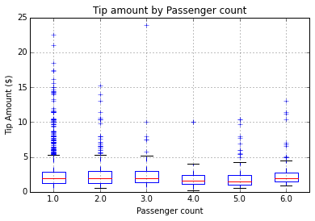
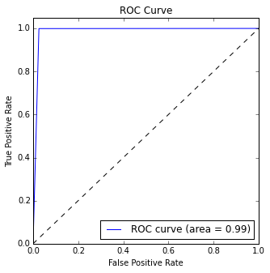

<properties
    pageTitle="資料科學上 Azure 使用 Scala 與火花 |Microsoft Azure"
    description="如何使用 Scala 火花調整 MLlib 和火花毫升封裝 Azure HDInsight 火花叢集上受監督的電腦學習工作。"  
    services="machine-learning"
    documentationCenter=""
    authors="bradsev"
    manager="jhubbard"
    editor="cgronlun" />

<tags
    ms.service="machine-learning"
    ms.workload="data-services"
    ms.tgt_pltfrm="na"
    ms.devlang="na"
    ms.topic="article"
    ms.date="08/01/2016"
    ms.author="bradsev;deguhath"/>

# 使用上 Azure Scala 和火花資料科學

本文將示範如何使用 Scala 火花調整 MLlib 和火花毫升封裝 Azure HDInsight 火花叢集上受監督的電腦學習工作。 會引導您完成工作構成[資料科學程序](http://aka.ms/datascienceprocess)︰ 資料 ingestion 及探索、 視覺效果、 功能工程、 模型、 和模型消耗。 文件中的模型包含後勤和線性迴歸、 隨機樹系及漸層提高樹 (GBTs)，除了兩個常見的受監督的電腦學習工作︰

- 迴歸問題︰ 預測的計程車差旅費提示金額 （$）
- 二進位分類︰ 預測的秘訣或計程車差旅費用沒有提示 (1/0)

模型程序需要訓練與評估測試資料集和相關的精確度單位。 本文中，您可以瞭解如何 Azure Blob 儲存體中儲存這些模型以及如何分數，並在評估其預測的效能。 本文也說明如何使用交叉驗證和超參數到最佳化模型的更進階的主題。 使用的資料是 2013 NYC 計程車差旅費和 fare 資料集的 GitHub 提供範例。

[Scala](http://www.scala-lang.org/)，根據 Java 虛擬機器中，以語言整合物件導向與功能性語言的概念。 它是可調整的語言，相當適合分散式處理在雲端，並執行 Azure 火花叢集上。

[火花](http://spark.apache.org/)是支援在記憶體中處理提高顯示較大的資料分析應用程式的效能開啟來源平行處理架構。 火花處理引擎內建的速度，以便於使用及複雜的分析。 火花的記憶體內分散式的計算功能讓您更適合反覆運算演算法電腦學習及圖形計算中。 [Spark.ml](http://spark.apache.org/docs/latest/ml-guide.html)套件提供一組一致的內建的資料圖文框，可協助您建立及調整實務電腦學習管線最上方的高層級 Api。 [MLlib](http://spark.apache.org/mllib/)是火花的調整電腦學習文件庫，要對此分散式環境的模型功能。

[HDInsight 火花](../hdinsight/hdinsight-apache-spark-overview.md)是開啟來源火花的 Azure 裝載提供。 也包含支援 Jupyter Scala 火花叢集上的筆記本，可以執行火花 SQL 互動式查詢轉換、 篩選和 Azure Blob 儲存體中儲存的資料以視覺化方式呈現。 在安裝火花叢集 Jupyter 筆記本中，執行 Scala 程式碼片段本文中提供的方案，並顯示相關的圖呈現資料。 模型中的步驟進行這些主題有示範如何訓練、 評估、 儲存及使用每種類型的模型的程式碼。

設定步驟和本文中的程式碼是 Azure HDInsight 3.4 火花 1.6。 不過，這份文件和[Scala Jupyter 筆記本](https://github.com/Azure/Azure-MachineLearning-DataScience/blob/master/Misc/Spark/Scala/Exploration%20Modeling%20and%20Scoring%20using%20Scala.ipynb)中的程式碼是一般，應該處理任何火花叢集。 叢集設定與管理步驟可能稍有不同的如果您不使用 HDInsight 火花顯示在本文中。

> [AZURE.NOTE] 說明如何使用 Python，而不是 Scala 完成工作的端對端資料科學程序的主題，請參閱[使用火花上 Azure HDInsight 的資料科學](machine-learning-data-science-spark-overview.md)。

## 必要條件

-   您必須擁有 Azure 訂閱。 如果您還沒有一個[取得 Azure 的免費試用版](https://azure.microsoft.com/documentation/videos/get-azure-free-trial-for-testing-hadoop-in-hdinsight/)。

-   您必須完成下列程序 Azure HDInsight 3.4 火花 1.6 叢集。 若要建立叢集，請參閱中的指示進行[快速入門︰ 建立 Apache 火花上 Azure HDInsight](../hdinsight/hdinsight-apache-spark-jupyter-spark-sql.md)。 在 [**選取叢集類型**] 功能表上，設定叢集類型和版本。

>[AZURE.INCLUDE [delete-cluster-warning](../../includes/hdinsight-delete-cluster-warning.md)]

NYC 計程車差旅費資料和 Jupyter 筆記本火花叢集上執行的程式碼指示的說明，請參閱相關的章節中[概觀資料科學使用火花上 Azure HDInsight](machine-learning-data-science-spark-overview.md)。  

## 從 Jupyter 筆記本火花叢集上執行 Scala 程式碼

您可以在啟動 Jupyter 筆記本從 Azure 入口網站。 尋找您的儀表板上火花叢集，然後按一下以輸入您的叢集 [管理] 頁面。 接下來，按一下 [**叢集儀表板**，，然後按一下 [開啟筆記本火花叢集相關聯的**Jupyter 筆記本**。

您也可以存取 Jupyter 筆記本在 https://&lt;clustername&gt;.azurehdinsight.net/jupyter。 *Clustername*換成您叢集的名稱。 您需要存取 Jupyter 筆記本您系統管理員帳戶的密碼。

選取 [ **Scala**若要查看的目錄，有幾個範例使用 PySpark API 的預先封裝筆記本]。 探索模型和計分使用這套火花主題的程式碼範例 Scala.ipynb 筆記本會出現在[GitHub](https://github.com/Azure/Azure-MachineLearning-DataScience/tree/master/Misc/Spark/Scala)。

您可以在火花叢集上載直接從 GitHub Jupyter 筆記本伺服器的筆記本。 在您的 Jupyter 首頁上，按一下 [**上傳**] 按鈕。 在 [檔案總管] 中，貼上 GitHub （未經處理的內容） 的 URL Scala 筆記本，然後再按一下 [**開啟**。 Scala 筆記本位於下列 URL:

[Exploration-Modeling-and-Scoring-using-Scala.ipynb](https://github.com/Azure/Azure-MachineLearning-DataScience/blob/master/Misc/Spark/Scala/Exploration-Modeling-and-Scoring-using-Scala.ipynb)

## 安裝︰ 預設火花和登錄區內容、 火花我們和火花文件庫

### 預設火花和登錄區內容

    # SET THE START TIME
    import java.util.Calendar
    val beginningTime = Calendar.getInstance().getTime()

Jupyter 筆記本會提供火花核心有預設的內容。 您不需要明確設定盡如或開發登錄區內容，然後才能開始使用應用程式。 預設的內容是︰

- `sc`針對 SparkContext
- `sqlContext`針對 HiveContext

### 火花我們

火花核心提供預先定義的 「 我們 」，這是您可以使用呼叫的特殊命令`%%`。 下列程式碼範例使用兩個這些命令。

- `%%local`指定後續幾行中的程式碼會在本機上執行。 程式碼，必須是有效的 Scala 程式碼。
- `%%sql -o <variable name>`執行登錄區查詢`sqlContext`。 如果`-o`傳遞的參數，查詢的結果保存在`%%local`Scala 做為火花資料圖文框的內容。

使用電話的詳細資訊 Jupyter 筆記本和其預先定義的核心 」 magics 」 的`%%`(例如， `%%local`)，請參閱[適用於 Jupyter 的筆記本，與 HDInsight HDInsight 火花 Linux 叢集核心](../hdinsight/hdinsight-apache-spark-jupyter-notebook-kernels.md)。

### 匯入文件庫

匯入盡如 MLlib，與其他文件庫，您必須使用下列程式碼。

    # IMPORT SPARK AND JAVA LIBRARIES
    import org.apache.spark.sql.SQLContext
    import org.apache.spark.sql.functions._
    import java.text.SimpleDateFormat
    import java.util.Calendar
    import sqlContext.implicits._
    import org.apache.spark.sql.Row

    # IMPORT SPARK SQL FUNCTIONS
    import org.apache.spark.sql.types.{StructType, StructField, StringType, IntegerType, FloatType, DoubleType}
    import org.apache.spark.sql.functions.rand

    # IMPORT SPARK ML FUNCTIONS
    import org.apache.spark.ml.Pipeline
    import org.apache.spark.ml.feature.{StringIndexer, VectorAssembler, OneHotEncoder, VectorIndexer, Binarizer}
    import org.apache.spark.ml.tuning.{ParamGridBuilder, TrainValidationSplit, CrossValidator}
    import org.apache.spark.ml.regression.{LinearRegression, LinearRegressionModel, RandomForestRegressor, RandomForestRegressionModel, GBTRegressor, GBTRegressionModel}
    import org.apache.spark.ml.classification.{LogisticRegression, LogisticRegressionModel, RandomForestClassifier, RandomForestClassificationModel, GBTClassifier, GBTClassificationModel}
    import org.apache.spark.ml.evaluation.{BinaryClassificationEvaluator, RegressionEvaluator, MulticlassClassificationEvaluator}

    # IMPORT SPARK MLLIB FUNCTIONS
    import org.apache.spark.mllib.linalg.{Vector, Vectors}
    import org.apache.spark.mllib.util.MLUtils
    import org.apache.spark.mllib.classification.{LogisticRegressionWithLBFGS, LogisticRegressionModel}
    import org.apache.spark.mllib.regression.{LabeledPoint, LinearRegressionWithSGD, LinearRegressionModel}
    import org.apache.spark.mllib.tree.{GradientBoostedTrees, RandomForest}
    import org.apache.spark.mllib.tree.configuration.BoostingStrategy
    import org.apache.spark.mllib.tree.model.{GradientBoostedTreesModel, RandomForestModel, Predict}
    import org.apache.spark.mllib.evaluation.{BinaryClassificationMetrics, MulticlassMetrics, RegressionMetrics}

    # SPECIFY SQLCONTEXT
    val sqlContext = new SQLContext(sc)

## 資料 ingestion

資料科學程序中的第一個步驟是內嵌您要分析的資料。 您將資料帶入外部來源或系統所在的資料探索與模型環境。 本文中，您內嵌的資料是計程車差旅費和 fare 檔案 （儲存為.tsv 檔案） 的連接的 0.1%樣本。 資料探索與模型環境是火花。 本節中的程式碼，請完成以下一系列的工作︰

1. 設定目錄路徑資料與模型的儲存空間。
2. 請閱讀在輸入的資料集 （儲存為.tsv 檔案）。
3. 定義資料結構描述，讓資料更簡潔。
4. 建立已清除的資料範圍，並在記憶體中快取。
5. 註冊以暫時 SQLContext 表格的資料。
6. 查詢的資料表，將資料框架匯入結果。

### Azure Blob 儲存體中設定目錄的儲存位置的路徑

火花可以讀取和寫入 Azure Blob 儲存體。 您可以使用火花處理任何現有資料，並再將結果儲存一次在 Blob 儲存體。

若要儲存 Blob 儲存體模型或檔案，必須正確地指定的路徑。 參照附加至火花叢集的路徑，以開始的預設容器`wasb:///`。 使用參考其他位置`wasb://`。

下列程式碼範例指定儲存模型的輸入的資料以讀取和其路徑 Blob 儲存體連接至火花叢集的位置。

    # SET PATHS TO DATA AND MODEL FILE LOCATIONS
    # INGEST DATA AND SPECIFY HEADERS FOR COLUMNS
    val taxi_train_file = sc.textFile("wasb://mllibwalkthroughs@cdspsparksamples.blob.core.windows.net/Data/NYCTaxi/JoinedTaxiTripFare.Point1Pct.Train.tsv")
    val header = taxi_train_file.first;

    # SET THE MODEL STORAGE DIRECTORY PATH
    # NOTE THAT THE FINAL BACKSLASH IN THE PATH IS REQUIRED.
    val modelDir = "wasb:///user/remoteuser/NYCTaxi/Models/";

### 匯入資料、 建立 RDD，並定義的結構描述根據資料圖文框

    # RECORD THE START TIME
    val starttime = Calendar.getInstance().getTime()

    # DEFINE THE SCHEMA BASED ON THE HEADER OF THE FILE
    val sqlContext = new SQLContext(sc)
    val taxi_schema = StructType(
        Array(
            StructField("medallion", StringType, true),
            StructField("hack_license", StringType, true),
            StructField("vendor_id", StringType, true),
            StructField("rate_code", DoubleType, true),
            StructField("store_and_fwd_flag", StringType, true),
            StructField("pickup_datetime", StringType, true),
            StructField("dropoff_datetime", StringType, true),
            StructField("pickup_hour", DoubleType, true),
            StructField("pickup_week", DoubleType, true),
            StructField("weekday", DoubleType, true),
            StructField("passenger_count", DoubleType, true),
            StructField("trip_time_in_secs", DoubleType, true),
            StructField("trip_distance", DoubleType, true),
            StructField("pickup_longitude", DoubleType, true),
            StructField("pickup_latitude", DoubleType, true),
            StructField("dropoff_longitude", DoubleType, true),
            StructField("dropoff_latitude", DoubleType, true),
            StructField("direct_distance", StringType, true),
            StructField("payment_type", StringType, true),
            StructField("fare_amount", DoubleType, true),
            StructField("surcharge", DoubleType, true),
            StructField("mta_tax", DoubleType, true),
            StructField("tip_amount", DoubleType, true),
            StructField("tolls_amount", DoubleType, true),
            StructField("total_amount", DoubleType, true),
            StructField("tipped", DoubleType, true),
            StructField("tip_class", DoubleType, true)
            )
        )

    # CAST VARIABLES ACCORDING TO THE SCHEMA
    val taxi_temp = (taxi_train_file.map(_.split("\t"))
                            .filter((r) => r(0) != "medallion")
                            .map(p => Row(p(0), p(1), p(2),
                                p(3).toDouble, p(4), p(5), p(6), p(7).toDouble, p(8).toDouble, p(9).toDouble, p(10).toDouble,
                                p(11).toDouble, p(12).toDouble, p(13).toDouble, p(14).toDouble, p(15).toDouble, p(16).toDouble,
                                p(17), p(18), p(19).toDouble, p(20).toDouble, p(21).toDouble, p(22).toDouble,
                                p(23).toDouble, p(24).toDouble, p(25).toDouble, p(26).toDouble)))

    # CREATE AN INITIAL DATA FRAME AND DROP COLUMNS, AND THEN CREATE A CLEANED DATA FRAME BY FILTERING FOR UNWANTED VALUES OR OUTLIERS
    val taxi_train_df = sqlContext.createDataFrame(taxi_temp, taxi_schema)

    val taxi_df_train_cleaned = (taxi_train_df.drop(taxi_train_df.col("medallion"))
            .drop(taxi_train_df.col("hack_license")).drop(taxi_train_df.col("store_and_fwd_flag"))
            .drop(taxi_train_df.col("pickup_datetime")).drop(taxi_train_df.col("dropoff_datetime"))
            .drop(taxi_train_df.col("pickup_longitude")).drop(taxi_train_df.col("pickup_latitude"))
            .drop(taxi_train_df.col("dropoff_longitude")).drop(taxi_train_df.col("dropoff_latitude"))
            .drop(taxi_train_df.col("surcharge")).drop(taxi_train_df.col("mta_tax"))
            .drop(taxi_train_df.col("direct_distance")).drop(taxi_train_df.col("tolls_amount"))
            .drop(taxi_train_df.col("total_amount")).drop(taxi_train_df.col("tip_class"))
            .filter("passenger_count > 0 and passenger_count < 8 AND payment_type in ('CSH', 'CRD') AND tip_amount >= 0 AND tip_amount < 30 AND fare_amount >= 1 AND fare_amount < 150 AND trip_distance > 0 AND trip_distance < 100 AND trip_time_in_secs > 30 AND trip_time_in_secs < 7200"));

    # CACHE AND MATERIALIZE THE CLEANED DATA FRAME IN MEMORY
    taxi_df_train_cleaned.cache()
    taxi_df_train_cleaned.count()

    # REGISTER THE DATA FRAME AS A TEMPORARY TABLE IN SQLCONTEXT
    taxi_df_train_cleaned.registerTempTable("taxi_train")

    # GET THE TIME TO RUN THE CELL
    val endtime = Calendar.getInstance().getTime()
    val elapsedtime =  ((endtime.getTime() - starttime.getTime())/1000).toString;
    println("Time taken to run the above cell: " + elapsedtime + " seconds.");

**輸出︰**

若要執行的儲存格的時間︰ 8 的秒數。

### 查詢的資料表，並匯入資料框架中的結果

接下來，查詢的資料表 fare、 旅客，以及秘訣資料;篩選出損毀外, 圍資料。及列印多個資料列。

    # QUERY THE DATA
    val sqlStatement = """
        SELECT fare_amount, passenger_count, tip_amount, tipped
        FROM taxi_train
        WHERE passenger_count > 0 AND passenger_count < 7
        AND fare_amount > 0 AND fare_amount < 200
        AND payment_type in ('CSH', 'CRD')
        AND tip_amount > 0 AND tip_amount < 25
    """
    val sqlResultsDF = sqlContext.sql(sqlStatement)

    # SHOW ONLY THE TOP THREE ROWS
    sqlResultsDF.show(3)

**輸出︰**

fare_amount|passenger_count|tip_amount|雪人
-----------|---------------|----------|------
       13.5|            1.0|       2.9|   1.0
       16.0|            2.0|       3.4|   1.0
       10.5|            2.0|       1.0|   1.0

## 資料瀏覽和視覺效果

資料帶入火花後，資料科學程序中的下一個步驟是更深入瞭解透過探索和視覺效果的資料。 在此區段中，您可以檢查計程車資料使用的 SQL 查詢。 將資料範圍，來使用自動視覺效果的功能來 Jupyter 繪製的目標變數和視覺檢查預期的功能，然後匯入結果。

### 若要繪製的資料使用本機和 SQL 魔術

根據預設，任何您從 Jupyter 筆記本執行的程式碼片段的輸出位於工作者節點保存工作階段的內容中。 如果您想要儲存旅行工作者節點的每個的計算，而且如果您需要您計算的所有資料都位於本機上 Jupyter 伺服器節點 （這都是主節點），您可以使用`%%local`個神奇 Jupyter 伺服器上執行的程式碼片段。

- **SQL 魔術**(`%%sql`). HDInsight 火花核心支援 SQLContext 輕鬆內嵌 HiveQL 查詢。 (`-o VARIABLE_NAME`) 引數的輸出保存在 SQL 查詢做為熊資料的圖文框 Jupyter 伺服器上。 這表示之後便能在本機模式中使用。
- `%%local`**個神奇**。 `%%local`個神奇程式碼本機 Jupyter 在伺服器上執行，也就是 HDInsight 叢集的標頭。 通常您會使用`%%local`神奇搭配`%%sql`神奇與`-o`參數。 `-o`參數想要保存在本機的 SQL 查詢輸出然後`%%local`個神奇會觸發下對保存在本機的 SQL 查詢輸出本機執行的程式碼片段一組。

### 使用 SQL 查詢的資料
此查詢會擷取計程車往返 fare 量、 旅客計數，並提示量。

    # RUN THE SQL QUERY
    %%sql -q -o sqlResults
    SELECT fare_amount, passenger_count, tip_amount, tipped FROM taxi_train WHERE passenger_count > 0 AND passenger_count < 7 AND fare_amount > 0 AND fare_amount < 200 AND payment_type in ('CSH', 'CRD') AND tip_amount > 0 AND tip_amount < 25

下列程式碼，`%%local`個神奇會建立本機資料框架，sqlResults。 若要使用 matplotlib 繪製，您可以使用 sqlResults。

> [AZURE.TIP] 本機個神奇是重複使用本文中。 如果您的資料集很大，請在本機的記憶體中建立可容納資料框架範例。

### 繪製資料

您可以使用 Python 程式碼後資料圖文框做為熊資料圖文框的本機內容中繪製。

    # RUN THE CODE LOCALLY ON THE JUPYTER SERVER
    %%local

    # USE THE JUPYTER AUTO-PLOTTING FEATURE TO CREATE INTERACTIVE FIGURES.
    # CLICK THE TYPE OF PLOT TO GENERATE (LINE, AREA, BAR, ETC.)
    sqlResults

 火花核心自動文章 SQL (HiveQL) 查詢的輸出後執行的程式碼。 您可以選擇數種類型的視覺效果︰
 
- 表格
- 圓形圖
- 線條
- 區域
- 列

以下是要繪製資料的程式碼︰

    # RUN THE CODE LOCALLY ON THE JUPYTER SERVER AND IMPORT LIBRARIES
    %%local
    import matplotlib.pyplot as plt
    %matplotlib inline

    # PLOT TIP BY PAYMENT TYPE AND PASSENGER COUNT
    ax1 = sqlResults[['tip_amount']].plot(kind='hist', bins=25, facecolor='lightblue')
    ax1.set_title('Tip amount distribution')
    ax1.set_xlabel('Tip Amount ($)')
    ax1.set_ylabel('Counts')
    plt.suptitle('')
    plt.show()

    # PLOT TIP BY PASSENGER COUNT
    ax2 = sqlResults.boxplot(column=['tip_amount'], by=['passenger_count'])
    ax2.set_title('Tip amount by Passenger count')
    ax2.set_xlabel('Passenger count')
    ax2.set_ylabel('Tip Amount ($)')
    plt.suptitle('')
    plt.show()

    # PLOT TIP AMOUNT BY FARE AMOUNT; SCALE POINTS BY PASSENGER COUNT
    ax = sqlResults.plot(kind='scatter', x= 'fare_amount', y = 'tip_amount', c='blue', alpha = 0.10, s=5*(sqlResults.passenger_count))
    ax.set_title('Tip amount by Fare amount')
    ax.set_xlabel('Fare Amount ($)')
    ax.set_ylabel('Tip Amount ($)')
    plt.axis([-2, 80, -2, 20])
    plt.show()

**輸出︰**

## 建立的功能和轉換功能，然後準備模型函數將輸入的資料

從火花毫升和 MLlib 樹狀型模型函數，您必須使用各種不同的方法，例如 binning、 編製索引作業、 一個熱編碼，以及向量化準備目標和功能。 以下是要遵循此區段中的程序︰

1. 將流量時間值區**binning**小時建立的新功能。
2. 套用**編製索引和一個熱編碼**分類的功能。
3. **範例與分割資料集**訓練和測試分數。
4. **指定訓練變數和功能**，然後建立索引，或按一下 [項目熱編碼訓練並測試輸入標籤的點同時分佈的資料集 (RDDs) 或資料框架。
5. 自動**分類和 vectorize 功能與目標**作為電腦學習模型的輸入。

### 將流量時間值區 binning 小時建立的新功能

若要將流量時間值區 binning 小時建立的新功能及快取結果資料框架在記憶體中的，此程式碼會顯示您。 重複使用 RDDs 和資料框架會快取以改善的執行時間的潛在客戶。 因此，您會快取 RDDs 和資料框架下列程序中的多個階段。

    # CREATE FOUR BUCKETS FOR TRAFFIC TIMES
    val sqlStatement = """
        SELECT *,
        CASE
         WHEN (pickup_hour <= 6 OR pickup_hour >= 20) THEN "Night"
         WHEN (pickup_hour >= 7 AND pickup_hour <= 10) THEN "AMRush"
         WHEN (pickup_hour >= 11 AND pickup_hour <= 15) THEN "Afternoon"
         WHEN (pickup_hour >= 16 AND pickup_hour <= 19) THEN "PMRush"
        END as TrafficTimeBins
        FROM taxi_train
    """
    val taxi_df_train_with_newFeatures = sqlContext.sql(sqlStatement)

    # CACHE THE DATA FRAME IN MEMORY AND MATERIALIZE THE DATA FRAME IN MEMORY
    taxi_df_train_with_newFeatures.cache()
    taxi_df_train_with_newFeatures.count()

### 編製索引及一個熱編碼的分類的功能

模型和預測函數的 MLlib 需要功能與編製索引或之前使用編碼分類輸入資料。 本節說明如何建立索引或編碼輸入到模型功能分類的功能。

您要編製索引，或根據模型的不同方式編碼模型。 例如，後勤和線性迴歸模型需要一個熱編碼。 例如，可以到三個功能欄展開三個類別的功能。 每一欄都包含 0 或 1 根據觀察值的類別。 MLlib 提供一個熱編碼[OneHotEncoder](http://scikit-learn.org/stable/modules/generated/sklearn.preprocessing.OneHotEncoder.html#sklearn.preprocessing.OneHotEncoder)函數。 這個編碼器二進位向量與最多為單一項目值的資料行對應標籤索引資料的行。 編碼，演算法的預期數值重要的功能的詳細資訊，例如後勤迴歸分析，可以套用分類的功能。

以下您轉換只有四個變數來顯示範例，也就是字元的字串。 您也可以索引其他變數，例如工作日，表示數值，為分類的變數。

編製索引，使用`StringIndexer()`，及一熱編碼方式，使用`OneHotEncoder()`從 MLlib 函數。 以下是要編製索引和編碼分類功能的程式碼︰

    # CREATE INDEXES AND ONE-HOT ENCODED VECTORS FOR SEVERAL CATEGORICAL FEATURES

    # RECORD THE START TIME
    val starttime = Calendar.getInstance().getTime()

    # INDEX AND ENCODE VENDOR_ID
    val stringIndexer = new StringIndexer().setInputCol("vendor_id").setOutputCol("vendorIndex").fit(taxi_df_train_with_newFeatures)
    val indexed = stringIndexer.transform(taxi_df_train_with_newFeatures)
    val encoder = new OneHotEncoder().setInputCol("vendorIndex").setOutputCol("vendorVec")
    val encoded1 = encoder.transform(indexed)

    # INDEX AND ENCODE RATE_CODE
    val stringIndexer = new StringIndexer().setInputCol("rate_code").setOutputCol("rateIndex").fit(encoded1)
    val indexed = stringIndexer.transform(encoded1)
    val encoder = new OneHotEncoder().setInputCol("rateIndex").setOutputCol("rateVec")
    val encoded2 = encoder.transform(indexed)

    # INDEX AND ENCODE PAYMENT_TYPE
    val stringIndexer = new StringIndexer().setInputCol("payment_type").setOutputCol("paymentIndex").fit(encoded2)
    val indexed = stringIndexer.transform(encoded2)
    val encoder = new OneHotEncoder().setInputCol("paymentIndex").setOutputCol("paymentVec")
    val encoded3 = encoder.transform(indexed)

    # INDEX AND TRAFFIC TIME BINS
    val stringIndexer = new StringIndexer().setInputCol("TrafficTimeBins").setOutputCol("TrafficTimeBinsIndex").fit(encoded3)
    val indexed = stringIndexer.transform(encoded3)
    val encoder = new OneHotEncoder().setInputCol("TrafficTimeBinsIndex").setOutputCol("TrafficTimeBinsVec")
    val encodedFinal = encoder.transform(indexed)

    # GET THE TIME TO RUN THE CELL
    val endtime = Calendar.getInstance().getTime()
    val elapsedtime =  ((endtime.getTime() - starttime.getTime())/1000).toString;
    println("Time taken to run the above cell: " + elapsedtime + " seconds.");

**輸出︰**

若要執行的儲存格的時間︰ 4 秒鐘。

### 範例與分割成訓練和測試分數資料集

將此程式碼會建立隨機範例的資料 （在此範例中，25%)。 雖然不需要大小由於此範例資料集的範例，本文會顯示如何可以讓您知道如何使用它自己的問題時所需的範例。 大型範例時，這可將儲存大量的時間訓練模型。 接下來，分割的範例訓練課程的一部分 （在此範例中，75%) 和測試的組件 （在此範例中，25%) 分類和迴歸模型中使用。

加入每個資料列 （「 rand 」 欄），可以用來訓練時，請選取交叉驗證動作 （0 和 1） 之間的隨機數字。

    # RECORD THE START TIME
    val starttime = Calendar.getInstance().getTime()

    # SPECIFY SAMPLING AND SPLITTING FRACTIONS
    val samplingFraction = 0.25;
    val trainingFraction = 0.75;
    val testingFraction = (1-trainingFraction);
    val seed = 1234;
    val encodedFinalSampledTmp = encodedFinal.sample(withReplacement = false, fraction = samplingFraction, seed = seed)
    val sampledDFcount = encodedFinalSampledTmp.count().toInt

    val generateRandomDouble = udf(() => {
        scala.util.Random.nextDouble
    })

    # ADD A RANDOM NUMBER FOR CROSS-VALIDATION
    val encodedFinalSampled = encodedFinalSampledTmp.withColumn("rand", generateRandomDouble());

    # SPLIT THE SAMPLED DATA FRAME INTO TRAIN AND TEST, WITH A RANDOM COLUMN ADDED FOR DOING CROSS-VALIDATION (SHOWN LATER)
    # INCLUDE A RANDOM COLUMN FOR CREATING CROSS-VALIDATION FOLDS
    val splits = encodedFinalSampled.randomSplit(Array(trainingFraction, testingFraction), seed = seed)
    val trainData = splits(0)
    val testData = splits(1)

    # GET THE TIME TO RUN THE CELL
    val endtime = Calendar.getInstance().getTime()
    val elapsedtime =  ((endtime.getTime() - starttime.getTime())/1000).toString;
    println("Time taken to run the above cell: " + elapsedtime + " seconds.");

**輸出︰**

若要執行的儲存格的時間︰ 2 秒鐘。

### 指定訓練課程的變數和功能]，然後建立索引，或按一下 [項目熱編碼訓練及測試輸入標示點 RDDs 或資料的圖文框

本節說明如何為標記的點的資料類型，分類文字資料索引和編碼後，您可以使用它來進行訓練的建議和測試 MLlib 後勤迴歸與其他分類模型的程式碼。 標記的點的物件是電腦的 RDDs 格式化所需的大部分學習中 MLlib 演算法做為輸入資料的方式。 [標示為 [點](https://spark.apache.org/docs/latest/mllib-data-types.html#labeled-point)是本機向量，[緊密] 或 [疏鬆，標籤/回應相關聯。

在這個程式碼，您可以指定目標 （從屬參照） 變數和訓練模型所使用的功能。 然後，您在此建立索引，或按一下 [項目熱編碼訓練及測試輸入標示點 RDDs 或資料的圖文框上。

    # RECORD THE START TIME
    val starttime = Calendar.getInstance().getTime()

    # MAP NAMES OF FEATURES AND TARGETS FOR CLASSIFICATION AND REGRESSION PROBLEMS
    val featuresIndOneHot = List("paymentVec", "vendorVec", "rateVec", "TrafficTimeBinsVec", "pickup_hour", "weekday", "passenger_count", "trip_time_in_secs", "trip_distance", "fare_amount").map(encodedFinalSampled.columns.indexOf(_))
    val featuresIndIndex = List("paymentIndex", "vendorIndex", "rateIndex", "TrafficTimeBinsIndex", "pickup_hour", "weekday", "passenger_count", "trip_time_in_secs", "trip_distance", "fare_amount").map(encodedFinalSampled.columns.indexOf(_))

    # SPECIFY THE TARGET FOR CLASSIFICATION ('tipped') AND REGRESSION ('tip_amount') PROBLEMS
    val targetIndBinary = List("tipped").map(encodedFinalSampled.columns.indexOf(_))
    val targetIndRegression = List("tip_amount").map(encodedFinalSampled.columns.indexOf(_))

    # CREATE INDEXED LABELED POINT RDD OBJECTS
    val indexedTRAINbinary = trainData.rdd.map(r => LabeledPoint(r.getDouble(targetIndBinary(0).toInt), Vectors.dense(featuresIndIndex.map(r.getDouble(_)).toArray)))
    val indexedTESTbinary = testData.rdd.map(r => LabeledPoint(r.getDouble(targetIndBinary(0).toInt), Vectors.dense(featuresIndIndex.map(r.getDouble(_)).toArray)))
    val indexedTRAINreg = trainData.rdd.map(r => LabeledPoint(r.getDouble(targetIndRegression(0).toInt), Vectors.dense(featuresIndIndex.map(r.getDouble(_)).toArray)))
    val indexedTESTreg = testData.rdd.map(r => LabeledPoint(r.getDouble(targetIndRegression(0).toInt), Vectors.dense(featuresIndIndex.map(r.getDouble(_)).toArray)))

    # CREATE INDEXED DATA FRAMES THAT YOU CAN USE TO TRAIN BY USING SPARK ML FUNCTIONS
    val indexedTRAINbinaryDF = indexedTRAINbinary.toDF()
    val indexedTESTbinaryDF = indexedTESTbinary.toDF()
    val indexedTRAINregDF = indexedTRAINreg.toDF()
    val indexedTESTregDF = indexedTESTreg.toDF()

    # CREATE ONE-HOT ENCODED (VECTORIZED) DATA FRAMES THAT YOU CAN USE TO TRAIN BY USING SPARK ML FUNCTIONS
    val assemblerOneHot = new VectorAssembler().setInputCols(Array("paymentVec", "vendorVec", "rateVec", "TrafficTimeBinsVec", "pickup_hour", "weekday", "passenger_count", "trip_time_in_secs", "trip_distance", "fare_amount")).setOutputCol("features")
    val OneHotTRAIN = assemblerOneHot.transform(trainData)
    val OneHotTEST = assemblerOneHot.transform(testData)

    # GET THE TIME TO RUN THE CELL
    val endtime = Calendar.getInstance().getTime()
    val elapsedtime =  ((endtime.getTime() - starttime.getTime())/1000).toString;
    println("Time taken to run the above cell: " + elapsedtime + " seconds.");

**輸出︰**

若要執行的儲存格的時間︰ 4 秒鐘。

### 自動分類和 vectorize 功能和目標作為電腦學習模型的輸入

使用火花毫升分類的目標及樹狀為基礎的模型功能中使用的功能。 在程式碼完成兩項工作︰

-   建立分類的二進位目標指派給每個資料點，0 和 1 之間的值為 0 或 1，使用 0.5 的臨界值。
- 自動分類的功能。 如果任何功能的不同數值的數字小於 32，這項功能分類。

以下是兩個任務的程式碼。

    # CATEGORIZE FEATURES AND BINARIZE THE TARGET FOR THE BINARY CLASSIFICATION PROBLEM

    # TRAIN DATA
    val indexer = new VectorIndexer().setInputCol("features").setOutputCol("featuresCat").setMaxCategories(32)
    val indexerModel = indexer.fit(indexedTRAINbinaryDF)
    val indexedTrainwithCatFeat = indexerModel.transform(indexedTRAINbinaryDF)
    val binarizer: Binarizer = new Binarizer().setInputCol("label").setOutputCol("labelBin").setThreshold(0.5)
    val indexedTRAINwithCatFeatBinTarget = binarizer.transform(indexedTrainwithCatFeat)

    # TEST DATA
    val indexerModel = indexer.fit(indexedTESTbinaryDF)
    val indexedTrainwithCatFeat = indexerModel.transform(indexedTESTbinaryDF)
    val binarizer: Binarizer = new Binarizer().setInputCol("label").setOutputCol("labelBin").setThreshold(0.5)
    val indexedTESTwithCatFeatBinTarget = binarizer.transform(indexedTrainwithCatFeat)

    # CATEGORIZE FEATURES FOR THE REGRESSION PROBLEM
    # CREATE PROPERLY INDEXED AND CATEGORIZED DATA FRAMES FOR TREE-BASED MODELS

    # TRAIN DATA
    val indexer = new VectorIndexer().setInputCol("features").setOutputCol("featuresCat").setMaxCategories(32)
    val indexerModel = indexer.fit(indexedTRAINregDF)
    val indexedTRAINwithCatFeat = indexerModel.transform(indexedTRAINregDF)

    # TEST DATA
    val indexerModel = indexer.fit(indexedTESTbinaryDF)
    val indexedTESTwithCatFeat = indexerModel.transform(indexedTESTregDF)

## 二進位分類模型︰ 預測是否應該所支付的秘訣

在此區段中，您可以建立三種類型的預測提示應該所支付的二進位分類模型︰

- 使用火花毫升**後勤迴歸模型**`LogisticRegression()`函數
- 使用火花毫升**隨機樹系分類模型**`RandomForestClassifier()`函數
- 使用 MLlib 的**漸層促進樹狀分類模型**`GradientBoostedTrees()`函數

### 建立後勤迴歸模型

接下來，請使用火花毫升建立後勤迴歸模型`LogisticRegression()`函數。 您建立模型建立一系列的步驟中的程式碼︰

1. 設定一個參數使用的**訓練模型**資料。
2. 測試資料集的指標在**評估模型**。
3. **儲存模型**以供日後使用 Blob 儲存體。
4. 針對測試資料，**分數模型**。
5. 使用收件者作業系統特性 （巨鵬） 曲線上**繪製結果**。

以下是這些程序的程式碼︰

    # CREATE A LOGISTIC REGRESSION MODEL
    val lr = new LogisticRegression().setLabelCol("tipped").setFeaturesCol("features").setMaxIter(10).setRegParam(0.3).setElasticNetParam(0.8)
    val lrModel = lr.fit(OneHotTRAIN)

    # PREDICT ON THE TEST DATA SET
    val predictions = lrModel.transform(OneHotTEST)

    # SELECT `BinaryClassificationEvaluator()` TO COMPUTE THE TEST ERROR
    val evaluator = new BinaryClassificationEvaluator().setLabelCol("tipped").setRawPredictionCol("probability").setMetricName("areaUnderROC")
    val ROC = evaluator.evaluate(predictions)
    println("ROC on test data = " + ROC)

    # SAVE THE MODEL
    val datestamp = Calendar.getInstance().getTime().toString.replaceAll(" ", ".").replaceAll(":", "_");
    val modelName = "LogisticRegression__"
    val filename = modelDir.concat(modelName).concat(datestamp)
    lrModel.save(filename);

載入、 分數，並將結果儲存。

    # RECORD THE START TIME
    val starttime = Calendar.getInstance().getTime()

    # LOAD THE SAVED MODEL AND SCORE THE TEST DATA SET
    val savedModel = org.apache.spark.ml.classification.LogisticRegressionModel.load(filename)
    println(s"Coefficients: ${savedModel.coefficients} Intercept: ${savedModel.intercept}")

    # SCORE THE MODEL ON THE TEST DATA
    val predictions = savedModel.transform(OneHotTEST).select("tipped","probability","rawPrediction")
    predictions.registerTempTable("testResults")

    # SELECT `BinaryClassificationEvaluator()` TO COMPUTE THE TEST ERROR
    val evaluator = new BinaryClassificationEvaluator().setLabelCol("tipped").setRawPredictionCol("probability").setMetricName("areaUnderROC")
    val ROC = evaluator.evaluate(predictions)

    # GET THE TIME TO RUN THE CELL
    val endtime = Calendar.getInstance().getTime()
    val elapsedtime =  ((endtime.getTime() - starttime.getTime())/1000).toString;
    println("Time taken to run the above cell: " + elapsedtime + " seconds.");

    # PRINT THE ROC RESULTS
    println("ROC on test data = " + ROC)

**輸出︰**

測試資料巨鵬 = 0.9827381497557599

使用本機熊資料圖文框上的 Python，若要繪製巨鵬曲線。

    # QUERY THE RESULTS
    %%sql -q -o sqlResults
    SELECT tipped, probability from testResults

    # RUN THE CODE LOCALLY ON THE JUPYTER SERVER AND IMPORT LIBRARIES
    %%local
    %matplotlib inline
    from sklearn.metrics import roc_curve,auc

    sqlResults['probFloat'] = sqlResults.apply(lambda row: row['probability'].values()[0][1], axis=1)
    predictions_pddf = sqlResults[["tipped","probFloat"]]

    # PREDICT THE ROC CURVE
    # predictions_pddf = sqlResults.rename(columns={'_1': 'probability', 'tipped': 'label'})
    prob = predictions_pddf["probFloat"]
    fpr, tpr, thresholds = roc_curve(predictions_pddf['tipped'], prob, pos_label=1);
    roc_auc = auc(fpr, tpr)

    # PLOT THE ROC CURVE
    plt.figure(figsize=(5,5))
    plt.plot(fpr, tpr, label='ROC curve (area = %0.2f)' % roc_auc)
    plt.plot([0, 1], [0, 1], 'k--')
    plt.xlim([0.0, 1.0])
    plt.ylim([0.0, 1.05])
    plt.xlabel('False Positive Rate')
    plt.ylabel('True Positive Rate')
    plt.title('ROC Curve')
    plt.legend(loc="lower right")
    plt.show()

**輸出︰**

### 建立的隨機樹系分類模型

接下來，請使用火花毫升建立的隨機樹系分類模型`RandomForestClassifier()`運作，並且然後評估測試資料模型。

    # RECORD THE START TIME
    val starttime = Calendar.getInstance().getTime()

    # CREATE THE RANDOM FOREST CLASSIFIER MODEL
    val rf = new RandomForestClassifier().setLabelCol("labelBin").setFeaturesCol("featuresCat").setNumTrees(10).setSeed(1234)

    # FIT THE MODEL
    val rfModel = rf.fit(indexedTRAINwithCatFeatBinTarget)
    val predictions = rfModel.transform(indexedTESTwithCatFeatBinTarget)

    # EVALUATE THE MODEL
    val evaluator = new MulticlassClassificationEvaluator().setLabelCol("label").setPredictionCol("prediction").setMetricName("f1")
    val Test_f1Score = evaluator.evaluate(predictions)
    println("F1 score on test data: " + Test_f1Score);

    # GET THE TIME TO RUN THE CELL
    val endtime = Calendar.getInstance().getTime()
    val elapsedtime =  ((endtime.getTime() - starttime.getTime())/1000).toString;
    println("Time taken to run the above cell: " + elapsedtime + " seconds.");

    # CALCULATE BINARY CLASSIFICATION EVALUATION METRICS
    val evaluator = new BinaryClassificationEvaluator().setLabelCol("label").setRawPredictionCol("probability").setMetricName("areaUnderROC")
    val ROC = evaluator.evaluate(predictions)
    println("ROC on test data = " + ROC)

**輸出︰**

測試資料巨鵬 = 0.9847103571552683

### 建立 GBT 分類模型

接下來，請使用 MLlib 的建立 GBT 分類模型`GradientBoostedTrees()`運作，並且然後評估測試資料模型。

    # TRAIN A GBT CLASSIFICATION MODEL BY USING MLLIB AND A LABELED POINT

    # RECORD THE START TIME
    val starttime = Calendar.getInstance().getTime()

    # DEFINE THE GBT CLASSIFICATION MODEL
    val boostingStrategy = BoostingStrategy.defaultParams("Classification")
    boostingStrategy.numIterations = 20
    boostingStrategy.treeStrategy.numClasses = 2
    boostingStrategy.treeStrategy.maxDepth = 5
    boostingStrategy.treeStrategy.categoricalFeaturesInfo = Map[Int, Int]((0,2),(1,2),(2,6),(3,4))

    # TRAIN THE MODEL
    val gbtModel = GradientBoostedTrees.train(indexedTRAINbinary, boostingStrategy)

    # SAVE THE MODEL IN BLOB STORAGE
    val datestamp = Calendar.getInstance().getTime().toString.replaceAll(" ", ".").replaceAll(":", "_");
    val modelName = "GBT_Classification__"
    val filename = modelDir.concat(modelName).concat(datestamp)
    gbtModel.save(sc, filename);

    # EVALUATE THE MODEL ON TEST INSTANCES AND THE COMPUTE TEST ERROR
    val labelAndPreds = indexedTESTbinary.map { point =>
      val prediction = gbtModel.predict(point.features)
      (point.label, prediction)
    }
    val testErr = labelAndPreds.filter(r => r._1 != r._2).count.toDouble / indexedTRAINbinary.count()
    //println("Learned classification GBT model:\n" + gbtModel.toDebugString)
    println("Test Error = " + testErr)

    # USE BINARY AND MULTICLASS METRICS TO EVALUATE THE MODEL ON THE TEST DATA
    val metrics = new MulticlassMetrics(labelAndPreds)
    println(s"Precision: ${metrics.precision}")
    println(s"Recall: ${metrics.recall}")
    println(s"F1 Score: ${metrics.fMeasure}")

    val metrics = new BinaryClassificationMetrics(labelAndPreds)
    println(s"Area under PR curve: ${metrics.areaUnderPR}")
    println(s"Area under ROC curve: ${metrics.areaUnderROC}")

    # GET THE TIME TO RUN THE CELL
    val endtime = Calendar.getInstance().getTime()
    val elapsedtime =  ((endtime.getTime() - starttime.getTime())/1000).toString;
    println("Time taken to run the above cell: " + elapsedtime + " seconds.");

    # PRINT THE ROC METRIC
    println(s"Area under ROC curve: ${metrics.areaUnderROC}")

**輸出︰**

下巨鵬曲線區域︰ 0.9846895479241554

## 迴歸模型︰ 預測提示量

在此區段中，您可以建立兩種類型的預測提示量的迴歸模型︰

- **Regularized 線性迴歸模型**使用火花毫升`LinearRegression()`函數。 將儲存模型和評估測試資料模型。
- 使用火花毫升**漸層促進樹狀迴歸模型**`GBTRegressor()`函數。

### 建立 regularized 線性迴歸模型

    # RECORD THE START TIME
    val starttime = Calendar.getInstance().getTime()

    # CREATE A REGULARIZED LINEAR REGRESSION MODEL BY USING THE SPARK ML FUNCTION AND DATA FRAMES
    val lr = new LinearRegression().setLabelCol("tip_amount").setFeaturesCol("features").setMaxIter(10).setRegParam(0.3).setElasticNetParam(0.8)

    # FIT THE MODEL BY USING DATA FRAMES
    val lrModel = lr.fit(OneHotTRAIN)
    println(s"Coefficients: ${lrModel.coefficients} Intercept: ${lrModel.intercept}")

    # SUMMARIZE THE MODEL OVER THE TRAINING SET AND PRINT METRICS
    val trainingSummary = lrModel.summary
    println(s"numIterations: ${trainingSummary.totalIterations}")
    println(s"objectiveHistory: ${trainingSummary.objectiveHistory.toList}")
    trainingSummary.residuals.show()
    println(s"RMSE: ${trainingSummary.rootMeanSquaredError}")
    println(s"r2: ${trainingSummary.r2}")

    # SAVE THE MODEL IN AZURE BLOB STORAGE
    val datestamp = Calendar.getInstance().getTime().toString.replaceAll(" ", ".").replaceAll(":", "_");
    val modelName = "LinearRegression__"
    val filename = modelDir.concat(modelName).concat(datestamp)
    lrModel.save(filename);

    # PRINT THE COEFFICIENTS
    println(s"Coefficients: ${lrModel.coefficients} Intercept: ${lrModel.intercept}")

    # SCORE THE MODEL ON TEST DATA
    val predictions = lrModel.transform(OneHotTEST)

    # EVALUATE THE MODEL ON TEST DATA
    val evaluator = new RegressionEvaluator().setLabelCol("tip_amount").setPredictionCol("prediction").setMetricName("r2")
    val r2 = evaluator.evaluate(predictions)
    println("R-sqr on test data = " + r2)

    # GET THE TIME TO RUN THE CELL
    val endtime = Calendar.getInstance().getTime()
    val elapsedtime =  ((endtime.getTime() - starttime.getTime())/1000).toString;
    println("Time taken to run the above cell: " + elapsedtime + " seconds.");

**輸出︰**

若要執行的儲存格的時間︰ 13 的秒數。

    # LOAD A SAVED LINEAR REGRESSION MODEL FROM BLOB STORAGE AND SCORE A TEST DATA SET

    # RECORD THE START TIME
    val starttime = Calendar.getInstance().getTime()

    # LOAD A SAVED LINEAR REGRESSION MODEL FROM AZURE BLOB STORAGE
    val savedModel = org.apache.spark.ml.regression.LinearRegressionModel.load(filename)
    println(s"Coefficients: ${savedModel.coefficients} Intercept: ${savedModel.intercept}")

    # SCORE THE MODEL ON TEST DATA
    val predictions = savedModel.transform(OneHotTEST).select("tip_amount","prediction")
    predictions.registerTempTable("testResults")

    # EVALUATE THE MODEL ON TEST DATA
    val evaluator = new RegressionEvaluator().setLabelCol("tip_amount").setPredictionCol("prediction").setMetricName("r2")
    val r2 = evaluator.evaluate(predictions)
    println("R-sqr on test data = " + r2)

    # GET THE TIME TO RUN THE CELL
    val endtime = Calendar.getInstance().getTime()
    val elapsedtime =  ((endtime.getTime() - starttime.getTime())/1000).toString;
    println("Time taken to run the above cell: " + elapsedtime + " seconds.");

    # PRINT THE RESULTS
    println("R-sqr on test data = " + r2)

**輸出︰**

測試資料的 R sqr = 0.5960320470835743

接下來，查詢做為資料圖文框的測試結果，並使用 AutoVizWidget 和 matplotlib，以視覺化方式呈現。

    # RUN A SQL QUERY
    %%sql -q -o sqlResults
    select * from testResults

    # RUN THE CODE LOCALLY ON THE JUPYTER SERVER
    %%local

    # USE THE JUPYTER AUTO-PLOTTING FEATURE TO CREATE INTERACTIVE FIGURES
    # CLICK THE TYPE OF PLOT TO GENERATE (LINE, AREA, BAR, AND SO ON)
    sqlResults

程式碼會建立本機資料框架從查詢輸出，並繪製的資料。 `%%local`個神奇會建立本機資料框架， `sqlResults`，您可以用來繪製與 matplotlib。

>[AZURE.NOTE] 此火花個神奇是重複使用本文中。 如果資料量很大，您應該在本機的記憶體中建立可容納資料圖文框的範例。

使用 Python matplotlib 建立繪圖。

    # RUN THE CODE LOCALLY ON THE JUPYTER SERVER AND IMPORT LIBRARIES
    %%local
    sqlResults
    %matplotlib inline
    import numpy as np

    # PLOT THE RESULTS
    ax = sqlResults.plot(kind='scatter', figsize = (6,6), x='tip_amount', y='prediction', color='blue', alpha = 0.25, label='Actual vs. predicted');
    fit = np.polyfit(sqlResults['tip_amount'], sqlResults['prediction'], deg=1)
    ax.set_title('Actual vs. Predicted Tip Amounts ($)')
    ax.set_xlabel("Actual")
    ax.set_ylabel("Predicted")
    #ax.plot(sqlResults['tip_amount'], fit[0] * sqlResults['prediction'] + fit[1], color='magenta')
    plt.axis([-1, 15, -1, 8])
    plt.show(ax)

**輸出︰**

### 建立 GBT 迴歸模型

使用火花毫升建立 GBT 迴歸模型`GBTRegressor()`運作，並且然後評估測試資料模型。

[漸層提高樹狀結構](http://spark.apache.org/docs/latest/ml-classification-regression.html#gradient-boosted-trees-gbts)(GBTs) 是 ensembles 的決策樹。 GBTs 訓練反覆以縮小的遺失函數的決策樹。 您可以使用 GBTs 迴歸和分類。 他們可以處理分類的功能、 不需要縮放功能，並且可以擷取非線性及功能互動。 您也可以使用這些中 multiclass 分類設定。

    # RECORD THE START TIME
    val starttime = Calendar.getInstance().getTime()

    # TRAIN A GBT REGRESSION MODEL
    val gbt = new GBTRegressor().setLabelCol("label").setFeaturesCol("featuresCat").setMaxIter(10)
    val gbtModel = gbt.fit(indexedTRAINwithCatFeat)

    # MAKE PREDICTIONS
    val predictions = gbtModel.transform(indexedTESTwithCatFeat)

    # COMPUTE TEST SET R2
    val evaluator = new RegressionEvaluator().setLabelCol("label").setPredictionCol("prediction").setMetricName("r2")
    val Test_R2 = evaluator.evaluate(predictions)

    # GET THE TIME TO RUN THE CELL
    val endtime = Calendar.getInstance().getTime()
    val elapsedtime =  ((endtime.getTime() - starttime.getTime())/1000).toString;
    println("Time taken to run the above cell: " + elapsedtime + " seconds.");

    # PRINT THE RESULTS
    println("Test R-sqr is: " + Test_R2);

**輸出︰**

測試 R sqr 是︰ 0.7655383534596654

## 最佳化的進階的模型公用程式

在此區段中，您可以使用電腦學習公用程式開發人員經常使用的模型最佳化。 具體來說，您也可以使用參數到和交叉驗證最佳化電腦學習模型三個不同的方式︰

-   將資料分割成訓練和驗證設定、 最佳化模型上訓練設定中，使用超參數到及評估在驗證設定 （線性迴歸）
-   使用跨驗證和超參數全面使用火花毫升 CrossValidator 函數 （二進位分類） 最佳化的模型。
-   若要使用任何電腦學習函數參數及參數的設定 （線性迴歸） 使用自訂交叉驗證和參數到程式碼最佳化模型

**跨驗證**是技術的評估方式訓練上一組已知的資料模型會一般化預測在它尚未訓練資料集的功能。 這個方法的一般概念是模型訓練資料集的已知的資料，並在然後測試的預測精確度是針對獨立的資料集。 常見的實作會將資料集分成*k*-將摺疊，然後訓練中所有但其中一項動作遞迴方式的模型。

選擇一組超參數學習演算法，通常與最佳化演算法獨立的資料集的量值的目標的問題是效能的**超參數最佳化**。 超參數是模型訓練程序之外，您必須指定的值。 彈性和模型的精確度，可能會影響假設超參數值。 決策樹有超參數，例如，例如您要的深度和樹葉樹狀目錄中的數字。 您必須設定 misclassification 負面影響字詞支援向量機器 (SVM)。

若要執行超參數最佳化常見的方式是使用格線搜尋，也稱為**參數整理**。 在格線搜尋，大規模的搜尋經過子集超參數的空間學習演算法的指定的值。 跨驗證可以提供效能公制出最佳的結果所產生的格線搜尋演算法的排序。 如果您使用跨驗證超參數到，您可以協助限制問題，例如 overfitting 訓練資料模型。 如此一來，模型會保留套用至的一般資料要從中擷取訓練資料集的容量。

### 最佳化與超參數到線性迴歸模型

接下來，分割成訓練和驗證集]，使用超參數全面最佳化模型，並在驗證設定 （線性迴歸） 評估訓練組的資料。

    # RECORD THE START TIME
    val starttime = Calendar.getInstance().getTime()

    # RENAME `tip_amount` AS A LABEL
    val OneHotTRAINLabeled = OneHotTRAIN.select("tip_amount","features").withColumnRenamed(existingName="tip_amount",newName="label")
    val OneHotTESTLabeled = OneHotTEST.select("tip_amount","features").withColumnRenamed(existingName="tip_amount",newName="label")
    OneHotTRAINLabeled.cache()
    OneHotTESTLabeled.cache()

    # DEFINE THE ESTIMATOR FUNCTION: `THE LinearRegression()` FUNCTION
    val lr = new LinearRegression().setLabelCol("label").setFeaturesCol("features").setMaxIter(10)

    # DEFINE THE PARAMETER GRID
    val paramGrid = new ParamGridBuilder().addGrid(lr.regParam, Array(0.1, 0.01, 0.001)).addGrid(lr.fitIntercept).addGrid(lr.elasticNetParam, Array(0.1, 0.5, 0.9)).build()

    # DEFINE THE PIPELINE WITH A TRAIN/TEST VALIDATION SPLIT (75% IN THE TRAINING SET), AND THEN THE SPECIFY ESTIMATOR, EVALUATOR, AND PARAMETER GRID
    val trainPct = 0.75
    val trainValidationSplit = new TrainValidationSplit().setEstimator(lr).setEvaluator(new RegressionEvaluator).setEstimatorParamMaps(paramGrid).setTrainRatio(trainPct)

    # RUN THE TRAIN VALIDATION SPLIT AND CHOOSE THE BEST SET OF PARAMETERS
    val model = trainValidationSplit.fit(OneHotTRAINLabeled)

    # MAKE PREDICTIONS ON THE TEST DATA BY USING THE MODEL WITH THE COMBINATION OF PARAMETERS THAT PERFORMS THE BEST
    val testResults = model.transform(OneHotTESTLabeled).select("label", "prediction")

    # COMPUTE TEST SET R2
    val evaluator = new RegressionEvaluator().setLabelCol("label").setPredictionCol("prediction").setMetricName("r2")
    val Test_R2 = evaluator.evaluate(testResults)

    # GET THE TIME TO RUN THE CELL
    val endtime = Calendar.getInstance().getTime()
    val elapsedtime =  ((endtime.getTime() - starttime.getTime())/1000).toString;
    println("Time taken to run the above cell: " + elapsedtime + " seconds.");

    println("Test R-sqr is: " + Test_R2);

**輸出︰**

測試 R sqr 是︰ 0.6226484708501209

### 使用跨驗證和超參數到最佳化的二進位分類模型

本節說明如何使用交叉驗證和超參數到最佳化二進位分類模型。 這是使用火花毫升`CrossValidator`函數。

    # RECORD THE START TIME
    val starttime = Calendar.getInstance().getTime()

    # CREATE DATA FRAMES WITH PROPERLY LABELED COLUMNS TO USE WITH THE TRAIN AND TEST SPLIT
    val indexedTRAINwithCatFeatBinTargetRF = indexedTRAINwithCatFeatBinTarget.select("labelBin","featuresCat").withColumnRenamed(existingName="labelBin",newName="label").withColumnRenamed(existingName="featuresCat",newName="features")
    val indexedTESTwithCatFeatBinTargetRF = indexedTESTwithCatFeatBinTarget.select("labelBin","featuresCat").withColumnRenamed(existingName="labelBin",newName="label").withColumnRenamed(existingName="featuresCat",newName="features")
    indexedTRAINwithCatFeatBinTargetRF.cache()
    indexedTESTwithCatFeatBinTargetRF.cache()

    # DEFINE THE ESTIMATOR FUNCTION
    val rf = new RandomForestClassifier().setLabelCol("label").setFeaturesCol("features").setImpurity("gini").setSeed(1234).setFeatureSubsetStrategy("auto").setMaxBins(32)

    # DEFINE THE PARAMETER GRID
    val paramGrid = new ParamGridBuilder().addGrid(rf.maxDepth, Array(4,8)).addGrid(rf.numTrees, Array(5,10)).addGrid(rf.minInstancesPerNode, Array(100,300)).build()

    # SPECIFY THE NUMBER OF FOLDS
    val numFolds = 3

    # DEFINE THE TRAIN/TEST VALIDATION SPLIT (75% IN THE TRAINING SET)
    val CrossValidator = new CrossValidator().setEstimator(rf).setEvaluator(new BinaryClassificationEvaluator).setEstimatorParamMaps(paramGrid).setNumFolds(numFolds)

    # RUN THE TRAIN VALIDATION SPLIT AND CHOOSE THE BEST SET OF PARAMETERS
    val model = CrossValidator.fit(indexedTRAINwithCatFeatBinTargetRF)

    # MAKE PREDICTIONS ON THE TEST DATA BY USING THE MODEL WITH THE COMBINATION OF PARAMETERS THAT PERFORMS THE BEST
    val testResults = model.transform(indexedTESTwithCatFeatBinTargetRF).select("label", "prediction")

    # COMPUTE THE TEST F1 SCORE
    val evaluator = new MulticlassClassificationEvaluator().setLabelCol("label").setPredictionCol("prediction").setMetricName("f1")
    val Test_f1Score = evaluator.evaluate(testResults)

    # GET THE TIME TO RUN THE CELL
    val endtime = Calendar.getInstance().getTime()
    val elapsedtime =  ((endtime.getTime() - starttime.getTime())/1000).toString;
    println("Time taken to run the above cell: " + elapsedtime + " seconds.");

**輸出︰**

若要執行的儲存格的時間︰ 33 秒。

### 使用自訂交叉驗證和參數到程式碼最佳化線性迴歸模型

接下來，請使用自訂程式碼，最佳化模型，並使用準則的最高的正確性，找出最佳的模型參數。 然後，最後一個模型、 評估測試資料模型中建立與儲存模型 Blob 儲存體。 最後，載入模型、 分數測試資料，以及評估精確度。

    # RECORD THE START TIME
    val starttime = Calendar.getInstance().getTime()

    # DEFINE THE PARAMETER GRID AND THE NUMBER OF FOLDS
    val paramGrid = new ParamGridBuilder().addGrid(rf.maxDepth, Array(5,10)).addGrid(rf.numTrees, Array(10,25,50)).build()

    val nFolds = 3
    val numModels = paramGrid.size
    val numParamsinGrid = 2

    # SPECIFY THE NUMBER OF CATEGORIES FOR CATEGORICAL VARIABLES
    val categoricalFeaturesInfo = Map[Int, Int]((0,2),(1,2),(2,6),(3,4))

    var maxDepth = -1
    var numTrees = -1
    var param = ""
    var paramval = -1
    var validateLB = -1.0
    var validateUB = -1.0
    val h = 1.0 / nFolds;
    val RMSE  = Array.fill(numModels)(0.0)

    # CREATE K-FOLDS
    val splits = MLUtils.kFold(indexedTRAINbinary, numFolds = nFolds, seed=1234)

    # LOOP THROUGH K-FOLDS AND THE PARAMETER GRID TO GET AND IDENTIFY THE BEST PARAMETER SET BY LEVEL OF ACCURACY
    for (i <- 0 to (nFolds-1)) {
        validateLB = i * h
        validateUB = (i + 1) * h
        val validationCV = trainData.filter($"rand" >= validateLB  && $"rand" < validateUB)
        val trainCV = trainData.filter($"rand" < validateLB  || $"rand" >= validateUB)
        val validationLabPt = validationCV.rdd.map(r => LabeledPoint(r.getDouble(targetIndRegression(0).toInt), Vectors.dense(featuresIndIndex.map(r.getDouble(_)).toArray)));
        val trainCVLabPt = trainCV.rdd.map(r => LabeledPoint(r.getDouble(targetIndRegression(0).toInt), Vectors.dense(featuresIndIndex.map(r.getDouble(_)).toArray)));
        validationLabPt.cache()
        trainCVLabPt.cache()

        for (nParamSets <- 0 to (numModels-1)) {
            for (nParams <- 0 to (numParamsinGrid-1)) {
                param = paramGrid(nParamSets).toSeq(nParams).param.toString.split("__")(1)
                paramval = paramGrid(nParamSets).toSeq(nParams).value.toString.toInt
                if (param == "maxDepth") {maxDepth = paramval}
                if (param == "numTrees") {numTrees = paramval}
            }
            val rfModel = RandomForest.trainRegressor(trainCVLabPt, categoricalFeaturesInfo=categoricalFeaturesInfo,
                                                      numTrees=numTrees, maxDepth=maxDepth,
                                                      featureSubsetStrategy="auto",impurity="variance", maxBins=32)
            val labelAndPreds = validationLabPt.map { point =>
                                                     val prediction = rfModel.predict(point.features)
                                                     ( prediction, point.label )
                                                    }
            val validMetrics = new RegressionMetrics(labelAndPreds)
            val rmse = validMetrics.rootMeanSquaredError
            RMSE(nParamSets) += rmse
        }
        validationLabPt.unpersist();
        trainCVLabPt.unpersist();
    }
    val minRMSEindex = RMSE.indexOf(RMSE.min)

    # GET THE BEST PARAMETERS FROM A CROSS-VALIDATION AND PARAMETER SWEEP
    var best_maxDepth = -1
    var best_numTrees = -1
    for (nParams <- 0 to (numParamsinGrid-1)) {
        param = paramGrid(minRMSEindex).toSeq(nParams).param.toString.split("__")(1)
        paramval = paramGrid(minRMSEindex).toSeq(nParams).value.toString.toInt
        if (param == "maxDepth") {best_maxDepth = paramval}
        if (param == "numTrees") {best_numTrees = paramval}
    }

    # CREATE THE BEST MODEL WITH THE BEST PARAMETERS AND A FULL TRAINING DATA SET
    val best_rfModel = RandomForest.trainRegressor(indexedTRAINreg, categoricalFeaturesInfo=categoricalFeaturesInfo,
                                                      numTrees=best_numTrees, maxDepth=best_maxDepth,
                                                      featureSubsetStrategy="auto",impurity="variance", maxBins=32)

    # SAVE THE BEST RANDOM FOREST MODEL IN BLOB STORAGE
    val datestamp = Calendar.getInstance().getTime().toString.replaceAll(" ", ".").replaceAll(":", "_");
    val modelName = "BestCV_RF_Regression__"
    val filename = modelDir.concat(modelName).concat(datestamp)
    best_rfModel.save(sc, filename);

    # PREDICT ON THE TRAINING SET WITH THE BEST MODEL AND THEN EVALUATE
    val labelAndPreds = indexedTESTreg.map { point =>
                                            val prediction = best_rfModel.predict(point.features)
                                            ( prediction, point.label )
                                           }

    val test_rmse = new RegressionMetrics(labelAndPreds).rootMeanSquaredError
    val test_rsqr = new RegressionMetrics(labelAndPreds).r2

    # GET THE TIME TO RUN THE CELL
    val endtime = Calendar.getInstance().getTime()
    val elapsedtime =  ((endtime.getTime() - starttime.getTime())/1000).toString;
    println("Time taken to run the above cell: " + elapsedtime + " seconds.");

    # LOAD THE MODEL
    val savedRFModel = RandomForestModel.load(sc, filename)

    val labelAndPreds = indexedTESTreg.map { point =>
                                            val prediction = savedRFModel.predict(point.features)
                                            ( prediction, point.label )
                                           }
    # TEST THE MODEL
    val test_rmse = new RegressionMetrics(labelAndPreds).rootMeanSquaredError
    val test_rsqr = new RegressionMetrics(labelAndPreds).r2

**輸出︰**

若要執行的儲存格的時間︰ 61 秒。

## 使用自動與 Scala 火花內建電腦學習模型

主題會引導您完成工作構成 Azure 中的資料科學程序的概觀，請參閱[小組資料科學程序](http://aka.ms/datascienceprocess)。

[小組資料科學程序的逐步解說](data-science-process-walkthroughs.md)說明其他示範特定案例小組資料科學程序中的步驟的端對端逐步解說。 逐步解說也會說明如何將工作流程或建立智慧應用程式的管線合併雲端和內部部署的工具和服務。

[成績火花內建電腦學習模型](machine-learning-data-science-spark-model-consumption.md)示範如何使用 Scala 程式碼會自動載入及電腦學習模型內建於火花並儲存於 Azure Blob 儲存體分數新的資料集。 您可以依照，提供的指示，及只要取代 Scala 程式碼，在自動化消耗本文中的 [Python 程式碼。
