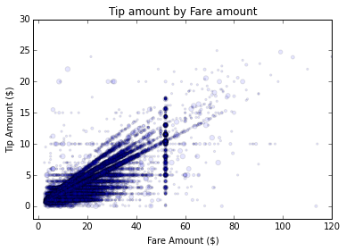
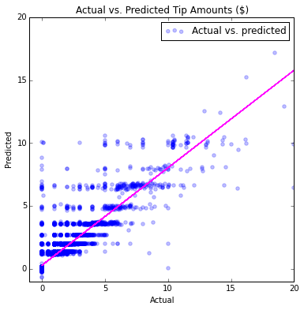

<properties
    pageTitle="資料探索和火花與模型 |Microsoft Azure"
    description="展示火花 MLlib 工具組資料探索與模型功能。"
    services="machine-learning"
    documentationCenter=""
    authors="bradsev"
    manager="jhubbard"
    editor="cgronlun" />

<tags
    ms.service="machine-learning"
    ms.workload="data-services"
    ms.tgt_pltfrm="na"
    ms.devlang="na"
    ms.topic="article"
    ms.date="10/07/2016"
    ms.author="deguhath;bradsev;gokuma" />

# 資料探索和火花與模型

[AZURE.INCLUDE [machine-learning-spark-modeling](../../includes/machine-learning-spark-modeling.md)]

這個逐步解說使用 HDInsight 火花執行資料探索並二進位分類和 NYC 範例模型工作的迴歸計程車差旅費最好 2013年資料集。  它會引導您完成[資料科學程序](http://aka.ms/datascienceprocess)的步驟、 HDInsight 火花使用叢集端對端處理和 Azure blob 儲存資料和模型。 程序瀏覽文章引進從 Azure 儲存體 Blob 的資料，並準備資料來建立預測模型。 這些模型是使用火花 MLlib 工具組執行二進位分類和迴歸模型工作的建立。

- **二進位分類**工作是預測所支付的出差行程井然有序的提示。 
- **迴歸分析**任務是秘訣的預測根據其他秘訣功能。 

我們會使用模型包含後勤和線性迴歸、 隨機樹系及漸層提高樹︰

- [使用 SGD 線性迴歸](https://spark.apache.org/docs/latest/api/python/pyspark.mllib.html#pyspark.mllib.regression.LinearRegressionWithSGD)使用 Stochastic 漸層深度 (SGD) 方法的線性迴歸模型，而縮放預測提示金額支付用於最佳化與功能。 
- [使用 LBFGS 後勤迴歸](https://spark.apache.org/docs/latest/api/python/pyspark.mllib.html#pyspark.mllib.classification.LogisticRegressionWithLBFGS)或 「 logit 」 迴歸分析，是分類執行資料分類因變數時，可以使用的迴歸模型。 LBFGS 是牛頓最佳化演算法的估計使用一段有限的電腦記憶體 Broyden – Fletcher – Goldfarb – Shanno (BFGS) 演算法及的廣泛用於電腦學習。
- [隨機樹系](http://spark.apache.org/docs/latest/mllib-ensembles.html#Random-Forests)是 ensembles 的決策樹。  結合來降低風險的膨脹許多決策樹。 隨機樹系的迴歸分析及分類可以處理分類的功能，並可延伸到 multiclass 分類設定。 他們不需要功能縮放比例，並且可以擷取非 linearities 和功能互動。 隨機樹系是最成功電腦學習分類和迴歸模型。
- [漸層提高樹狀結構](http://spark.apache.org/docs/latest/ml-classification-regression.html#gradient-boosted-trees-gbts)(GBTs) 是 ensembles 的決策樹。 GBTs 訓練反覆以縮小的遺失函數的決策樹。 GBTs 的迴歸分析及分類可以處理分類的功能，不需要縮放功能，並可以擷取非 linearities 和功能互動。 他們也可在 multiclass 分類設定。

模型步驟也包含顯示如何訓練、 評估，和儲存每個類型的模型的程式碼。 已使用 Python 程式碼解決方案，並顯示相關的繪圖。   

>[AZURE.NOTE] 雖然火花 MLlib 工具組設計用來處理大型資料集，較小的範例 (使用 170 K 列關於原始 NYC 資料集的 0.1%~ 30 Mb) 用於以下便利性。 有效率地 （在 10 分鐘） 的以下練習是 2 的工作者節點的 HDInsight 叢集上執行。 相同的程式碼，稍微修改，可用來處理較大資料集，以適當的修改快取中記憶體的資料，及變更叢集大小。

## 必要條件

您需要 Azure 帳戶和 HDInsight 火花您需要 HDInsight 3.4 火花 1.6 叢集完成此逐步解說。 如何符合這些需求，請參閱[概觀資料科學使用火花 Azure HDInsight 上](machine-learning-data-science-spark-overview.md)的指示。 該主題也包含以下所用的 NYC 2013 計程車資料和指示 Jupyter 筆記本火花叢集上執行程式碼的描述。 本主題中的程式碼範例**pySpark-machine-learning-data-science-spark-data-exploration-modeling.ipynb**筆記本中會有[Github](https://github.com/Azure/Azure-MachineLearning-DataScience/tree/master/Misc/Spark/pySpark)。 

[AZURE.INCLUDE [delete-cluster-warning](../../includes/hdinsight-delete-cluster-warning.md)]

## 安裝︰ 儲存位置、 文件庫，預設的火花內容

火花都可以讀取和寫入 Azure 儲存體 Blob (也稱為 WASB)。 因此您現有的資料的任何儲存那里可以處理使用火花和 WASB 中一次儲存的結果。

若要儲存 WASB 模型或檔案，必須正確地指定路徑。 預設的容器附加至火花叢集可以使用路徑開頭為的參考: 「 wasb: / / 」。 其他位置所參考 」 wasb: / / 」。

### 在 [WASB 中設定目錄的儲存位置的路徑

下列程式碼範例指定的資料供讀取及儲存模型輸出模型儲存目錄的路徑的位置︰

    # SET PATHS TO FILE LOCATIONS: DATA AND MODEL STORAGE

    # LOCATION OF TRAINING DATA
    taxi_train_file_loc = "wasb://mllibwalkthroughs@cdspsparksamples.blob.core.windows.net/Data/NYCTaxi/JoinedTaxiTripFare.Point1Pct.Train.tsv";

    # SET THE MODEL STORAGE DIRECTORY PATH 
    # NOTE THAT THE FINAL BACKSLASH IN THE PATH IS NEEDED.
    modelDir = "wasb:///user/remoteuser/NYCTaxi/Models/" 

### 匯入文件庫

設定也需要匯入所需的文件庫。 設定火花內容並匯入所需的文件庫，下列程式碼︰

    # IMPORT LIBRARIES
    import pyspark
    from pyspark import SparkConf
    from pyspark import SparkContext
    from pyspark.sql import SQLContext
    import matplotlib
    import matplotlib.pyplot as plt
    from pyspark.sql import Row
    from pyspark.sql.functions import UserDefinedFunction
    from pyspark.sql.types import *
    import atexit
    from numpy import array
    import numpy as np
    import datetime

### 預設火花內容和 PySpark 我們

Jupyter 筆記本會提供 PySpark 核心有預設的內容。 因此您不需要設定盡如或開發您開始使用應用程式之前，明確的登錄區內容。 這些內容，可讓您依預設。 這些內容是︰

- sc-的火花 
- sqlContext-的登錄區

PySpark 核心提供預先定義的 「 我們 」，這是您可以使用呼叫的特殊命令 %。 有兩個這類這些程式碼範例中所使用的命令。

- **%本機**指定要在本機上執行的後續幾行中的程式碼。 程式碼，必須是有效的 Python 程式碼。
- **%%sql -o <variable name>**執行 sqlContext 登錄區查詢。 如果 command 和 o 參數傳遞，查詢的結果就會保存在 %熊 DataFrame 本機 Python 內容。
 

如需更多有關 Jupyter 筆記本和預先定義的核心 」 magics 」 的他們提供，請參閱[適用於 Jupyter 的筆記本，與 HDInsight HDInsight 火花 Linux 叢集核心](../hdinsight/hdinsight-apache-spark-jupyter-notebook-kernels.md)。
 

## 從公用 blob 資料 ingestion

資料科學程序中的第一個步驟是內嵌的資料來源的資料分析位置是位於您的資料探索與模型環境。 環境是火花在此逐步解說。 本節中的程式碼，完成一系列的任務︰

- 內嵌資料模型範例
- 閱讀中輸入資料集 （儲存為.tsv 檔案）
- 設定格式，讓資料更簡潔
- 建立並快取記憶體中的物件 （RDDs 或資料框架）
- 登錄 SQL 內容中的 temp 資料表。

以下是資料 ingestion 的程式碼。

    # INGEST DATA

    # RECORD START TIME
    timestart = datetime.datetime.now()

    # IMPORT FILE FROM PUBLIC BLOB
    taxi_train_file = sc.textFile(taxi_train_file_loc)
    
    # GET SCHEMA OF THE FILE FROM HEADER
    schema_string = taxi_train_file.first()
    fields = [StructField(field_name, StringType(), True) for field_name in schema_string.split('\t')]
    fields[7].dataType = IntegerType() #Pickup hour
    fields[8].dataType = IntegerType() # Pickup week
    fields[9].dataType = IntegerType() # Weekday
    fields[10].dataType = IntegerType() # Passenger count
    fields[11].dataType = FloatType() # Trip time in secs
    fields[12].dataType = FloatType() # Trip distance
    fields[19].dataType = FloatType() # Fare amount
    fields[20].dataType = FloatType() # Surcharge
    fields[21].dataType = FloatType() # Mta_tax
    fields[22].dataType = FloatType() # Tip amount
    fields[23].dataType = FloatType() # Tolls amount
    fields[24].dataType = FloatType() # Total amount
    fields[25].dataType = IntegerType() # Tipped or not
    fields[26].dataType = IntegerType() # Tip class
    taxi_schema = StructType(fields)
    
    # PARSE FIELDS AND CONVERT DATA TYPE FOR SOME FIELDS
    taxi_header = taxi_train_file.filter(lambda l: "medallion" in l)
    taxi_temp = taxi_train_file.subtract(taxi_header).map(lambda k: k.split("\t"))\
            .map(lambda p: (p[0],p[1],p[2],p[3],p[4],p[5],p[6],int(p[7]),int(p[8]),int(p[9]),int(p[10]),
                            float(p[11]),float(p[12]),p[13],p[14],p[15],p[16],p[17],p[18],float(p[19]),
                            float(p[20]),float(p[21]),float(p[22]),float(p[23]),float(p[24]),int(p[25]),int(p[26])))
    
    
    # CREATE DATA FRAME
    taxi_train_df = sqlContext.createDataFrame(taxi_temp, taxi_schema)
    
    # CREATE A CLEANED DATA-FRAME BY DROPPING SOME UN-NECESSARY COLUMNS & FILTERING FOR UNDESIRED VALUES OR OUTLIERS
    taxi_df_train_cleaned = taxi_train_df.drop('medallion').drop('hack_license').drop('store_and_fwd_flag').drop('pickup_datetime')\
        .drop('dropoff_datetime').drop('pickup_longitude').drop('pickup_latitude').drop('dropoff_latitude')\
        .drop('dropoff_longitude').drop('tip_class').drop('total_amount').drop('tolls_amount').drop('mta_tax')\
        .drop('direct_distance').drop('surcharge')\
        .filter("passenger_count > 0 and passenger_count < 8 AND payment_type in ('CSH', 'CRD') AND tip_amount >= 0 AND tip_amount < 30 AND fare_amount >= 1 AND fare_amount < 150 AND trip_distance > 0 AND trip_distance < 100 AND trip_time_in_secs > 30 AND trip_time_in_secs < 7200" )

    
    # CACHE DATA-FRAME IN MEMORY & MATERIALIZE DF IN MEMORY
    taxi_df_train_cleaned.cache()
    taxi_df_train_cleaned.count()
    
    # REGISTER DATA-FRAME AS A TEMP-TABLE IN SQL-CONTEXT
    taxi_df_train_cleaned.registerTempTable("taxi_train")
    
    # PRINT HOW MUCH TIME IT TOOK TO RUN THE CELL
    timeend = datetime.datetime.now()
    timedelta = round((timeend-timestart).total_seconds(), 2) 
    print "Time taken to execute above cell: " + str(timedelta) + " seconds";

**輸出︰**

執行儲存格上方時所需的時間︰ 51.72 （秒)

## 資料瀏覽與視覺效果

後資料已被納入火花，資料科學程序中的下一個步驟是將更深入的瞭解透過探索和視覺效果的資料。 在此區段中，我們會檢查使用 SQL 查詢的計程車資料，並繪製的目標變數和視覺檢查預期的功能。 具體來說，我們繪製計程車往返、 提示金額的頻率和秘訣，視情況而定的付款金額]，然後輸入旅客計算的頻率。

### 繪製直方圖的旅客計程車往返範例中的計算頻率

此程式碼及後續程式碼片段使用 SQL 個神奇查詢範例，並繪製資料的本機個神奇。

- **SQL 個神奇 (`%%sql`)**HDInsight PySpark 核心支援 sqlContext 輕鬆內嵌 HiveQL 查詢。 (-O VARIABLE_NAME) 引數的輸出保存在 SQL 查詢以熊 DataFrame Jupyter 伺服器上。 這表示在本機模式中使用。
- **`%%local`個神奇**用來在 Jupyter 伺服器上，也就是在 HDInsight 叢集 headnode 本機執行程式碼。 通常您會使用`%%local`神奇搭配`%%sql`神奇與 command 和 o 參數。 Command 和 o 參數想要保存在本機的 SQL 查詢輸出然後 %本機個神奇會觸發下一組對保存在本機的 SQL 查詢輸出本機執行的程式碼片段

您執行的程式碼之後，會自動的視覺化成果。

此查詢會擷取依旅客計數往返。 

    # PLOT FREQUENCY OF PASSENGER COUNTS IN TAXI TRIPS

    # HIVEQL QUERY AGAINST THE sqlContext
    %%sql -q -o sqlResults
    SELECT passenger_count, COUNT(*) as trip_counts 
    FROM taxi_train 
    WHERE passenger_count > 0 and passenger_count < 7 
    GROUP BY passenger_count 

將此程式碼從查詢輸出建立本機資料範圍，並繪製的資料。 `%%local`個神奇會建立本機資料-框架， `sqlResults`，它可以用來繪製與 matplotlib。 

>[AZURE.NOTE] 此 PySpark 個神奇此逐步解說中使用多個時間。 如果資料量很大，您應該在本機的記憶體中建立可容納資料框架的範例。

    #CREATE LOCAL DATA-FRAME AND USE FOR MATPLOTLIB PLOTTING

    # RUN THE CODE LOCALLY ON THE JUPYTER SERVER
    %%local
    
    # USE THE JUPYTER AUTO-PLOTTING FEATURE TO CREATE INTERACTIVE FIGURES. 
    # CLICK ON THE TYPE OF PLOT TO BE GENERATED (E.G. LINE, AREA, BAR ETC.)
    sqlResults

以下是要繪製的旅客計數往返的程式碼

    # PLOT PASSENGER NUMBER VS. TRIP COUNTS
    %%local
    import matplotlib.pyplot as plt
    %matplotlib inline
    
    x_labels = sqlResults['passenger_count'].values
    fig = sqlResults[['trip_counts']].plot(kind='bar', facecolor='lightblue')
    fig.set_xticklabels(x_labels)
    fig.set_title('Counts of trips by passenger count')
    fig.set_xlabel('Passenger count in trips')
    fig.set_ylabel('Trip counts')
    plt.show()

**輸出︰**

您可以選取許多不同類型的視覺效果 （資料表、 圓形圖、 折線圖、 區域中或列） 之間使用的筆記本中的 [**類型**] 功能表按鈕。 列繪製如下所示。
    
### 繪製直方圖的提示數量與提示量不盡相同，旅客 count 和 fare 金額。

使用範例資料的 SQL 查詢。

    #PLOT HISTOGRAM OF TIP AMOUNTS AND VARIATION BY PASSENGER COUNT AND PAYMENT TYPE
    
    # HIVEQL QUERY AGAINST THE sqlContext
    %%sql -q -o sqlResults
    SELECT fare_amount, passenger_count, tip_amount, tipped 
    FROM taxi_train 
    WHERE passenger_count > 0 
    AND passenger_count < 7 
    AND fare_amount > 0 
    AND fare_amount < 200 
    AND payment_type in ('CSH', 'CRD') 
    AND tip_amount > 0 
    AND tip_amount < 25

此程式碼儲存格會用來建立三個繪圖資料的 SQL 查詢。

    # RUN THE CODE LOCALLY ON THE JUPYTER SERVER
    %%local
    
    # HISTOGRAM OF TIP AMOUNTS AND PASSENGER COUNT
    ax1 = sqlResults[['tip_amount']].plot(kind='hist', bins=25, facecolor='lightblue')
    ax1.set_title('Tip amount distribution')
    ax1.set_xlabel('Tip Amount ($)')
    ax1.set_ylabel('Counts')
    plt.suptitle('')
    plt.show()
    
    # TIP BY PASSENGER COUNT
    ax2 = sqlResults.boxplot(column=['tip_amount'], by=['passenger_count'])
    ax2.set_title('Tip amount by Passenger count')
    ax2.set_xlabel('Passenger count')
    ax2.set_ylabel('Tip Amount ($)')
    plt.suptitle('')
    plt.show()
    
    # TIP AMOUNT BY FARE AMOUNT, POINTS ARE SCALED BY PASSENGER COUNT
    ax = sqlResults.plot(kind='scatter', x= 'fare_amount', y = 'tip_amount', c='blue', alpha = 0.10, s=5*(sqlResults.passenger_count))
    ax.set_title('Tip amount by Fare amount')
    ax.set_xlabel('Fare Amount ($)')
    ax.set_ylabel('Tip Amount ($)')
    plt.axis([-2, 100, -2, 20])
    plt.show()

**輸出︰** 

## 工程、 轉換與資料模型準備的功能
本節說明，並準備用於毫升模型中的資料使用的程序提供的程式碼。 它會顯示如何執行下列工作︰

- 將流量時間值區 binning 小時建立的新功能
- 編製索引和編碼分類的功能
- 建立到毫升函數輸入標籤的點物件
- 建立隨機子範例的資料，並將其分割成訓練及測試設定
- 縮放功能
- 在記憶體中的快取物件

### 將流量時間值區 binning 小時建立的新功能

若要將流量時間值區 binning 小時建立的新功能的方式，然後如何快取結果資料框架在記憶體中的，則會顯示此程式碼。 同時分散式資料集 (RDDs) 和資料框架使用重複，快取通往改良的執行時間。 因此，我們快取 RDDs 和資料圖文框的逐步解說中的多個階段。 

    # CREATE FOUR BUCKETS FOR TRAFFIC TIMES
    sqlStatement = """
        SELECT *,
        CASE
         WHEN (pickup_hour <= 6 OR pickup_hour >= 20) THEN "Night" 
         WHEN (pickup_hour >= 7 AND pickup_hour <= 10) THEN "AMRush" 
         WHEN (pickup_hour >= 11 AND pickup_hour <= 15) THEN "Afternoon"
         WHEN (pickup_hour >= 16 AND pickup_hour <= 19) THEN "PMRush"
        END as TrafficTimeBins
        FROM taxi_train 
    """
    taxi_df_train_with_newFeatures = sqlContext.sql(sqlStatement)
    
    # CACHE DATA-FRAME IN MEMORY & MATERIALIZE DF IN MEMORY
    # THE .COUNT() GOES THROUGH THE ENTIRE DATA-FRAME,
    # MATERIALIZES IT IN MEMORY, AND GIVES THE COUNT OF ROWS.
    taxi_df_train_with_newFeatures.cache()
    taxi_df_train_with_newFeatures.count()

**輸出︰** 

126050

### 編製索引和編碼到模型函數輸入類別的功能

本節說明如何建立索引或編碼輸入到模型功能分類的功能。 模型和預測函數的 MLlib 需要功能與編製索引或之前使用編碼分類輸入資料。 根據模型，您需要編製索引，或將它們編碼不同的方式︰  

- **樹狀型模型**需要編碼為數值的類別 （例如，三個類別的功能可能會編碼 0、 1、 2）。 這會提供 MLlib 的[StringIndexer](http://spark.apache.org/docs/latest/ml-features.html#stringindexer)函數。 此函數會編碼字串資料行的資料行的標籤頻率根據排列的標籤索引標籤。 雖然輸入和資料處理數值與編製索引，可以指定樹狀演算法適當地將其視為類別。 

- **Logistic 與線性迴歸模型**需要一個熱編碼，位置，三個類別的功能，例如可展開到三個功能欄，每個包含 0 或 1 根據觀察值的類別。 MLlib 提供[OneHotEncoder](http://scikit-learn.org/stable/modules/generated/sklearn.preprocessing.OneHotEncoder.html#sklearn.preprocessing.OneHotEncoder)函數，請執行一個熱編碼。 這個編碼器地圖標籤索引資料行的二進位向量，最多為單一項目值的資料行。 這個編碼方式可讓演算法的預期數值重要的功能的詳細資訊，例如後勤迴歸分析，可套用到分類的功能。

以下是要編製索引和編碼分類功能的程式碼︰

    # INDEX AND ENCODE CATEGORICAL FEATURES

    # RECORD START TIME
    timestart = datetime.datetime.now()

    # LOAD PYSPARK LIBRARIES    
    from pyspark.ml.feature import OneHotEncoder, StringIndexer, VectorAssembler, VectorIndexer
    
    # INDEX AND ENCODE VENDOR_ID
    stringIndexer = StringIndexer(inputCol="vendor_id", outputCol="vendorIndex")
    model = stringIndexer.fit(taxi_df_train_with_newFeatures) # Input data-frame is the cleaned one from above
    indexed = model.transform(taxi_df_train_with_newFeatures)
    encoder = OneHotEncoder(dropLast=False, inputCol="vendorIndex", outputCol="vendorVec")
    encoded1 = encoder.transform(indexed)
    
    # INDEX AND ENCODE RATE_CODE
    stringIndexer = StringIndexer(inputCol="rate_code", outputCol="rateIndex")
    model = stringIndexer.fit(encoded1)
    indexed = model.transform(encoded1)
    encoder = OneHotEncoder(dropLast=False, inputCol="rateIndex", outputCol="rateVec")
    encoded2 = encoder.transform(indexed)
    
    # INDEX AND ENCODE PAYMENT_TYPE
    stringIndexer = StringIndexer(inputCol="payment_type", outputCol="paymentIndex")
    model = stringIndexer.fit(encoded2)
    indexed = model.transform(encoded2)
    encoder = OneHotEncoder(dropLast=False, inputCol="paymentIndex", outputCol="paymentVec")
    encoded3 = encoder.transform(indexed)
    
    # INDEX AND TRAFFIC TIME BINS
    stringIndexer = StringIndexer(inputCol="TrafficTimeBins", outputCol="TrafficTimeBinsIndex")
    model = stringIndexer.fit(encoded3)
    indexed = model.transform(encoded3)
    encoder = OneHotEncoder(dropLast=False, inputCol="TrafficTimeBinsIndex", outputCol="TrafficTimeBinsVec")
    encodedFinal = encoder.transform(indexed)
    
    # PRINT ELAPSED TIME
    timeend = datetime.datetime.now()
    timedelta = round((timeend-timestart).total_seconds(), 2) 
    print "Time taken to execute above cell: " + str(timedelta) + " seconds"; 

**輸出︰**

執行儲存格上方時所需的時間︰ 1.28 （秒)

### 建立到毫升函數輸入標籤的點物件

本節說明如何編製索引的標記的點的資料類型的分類文字資料，編碼後，這樣就可以使用訓練並測試 MLlib 後勤迴歸與其他分類模型的程式碼。 標記的點的物件會同時分散式資料集 (RDD) 格式所需的大部分的毫升演算法 MLlib 中做為輸入資料的方式。 [標示為 [點](https://spark.apache.org/docs/latest/mllib-data-types.html#labeled-point)是本機向量，[緊密] 或 [疏鬆，標籤/回應相關聯。  

本節說明如何索引分類的文字[標示為 [點](https://spark.apache.org/docs/latest/mllib-data-types.html#labeled-point)的資料類型的資料，讓它可以用來訓練並測試 MLlib 後勤迴歸分析及其他分類模型經過編碼的程式碼。 標記的點的物件會同時分散式資料集 (RDD) 的標籤 （目標/回應變數） 和向量功能所組成。 此格式所需 MLlib 中的許多毫升演算法做為輸入。

以下是要編製索引和編碼的二進位分類的文字功能的程式碼。

    # FUNCTIONS FOR BINARY CLASSIFICATION

    # LOAD LIBRARIES
    from pyspark.mllib.regression import LabeledPoint
    from numpy import array

    # INDEXING CATEGORICAL TEXT FEATURES FOR INPUT INTO TREE-BASED MODELS
    def parseRowIndexingBinary(line):
        features = np.array([line.paymentIndex, line.vendorIndex, line.rateIndex, line.TrafficTimeBinsIndex,
                             line.pickup_hour, line.weekday, line.passenger_count, line.trip_time_in_secs, 
                             line.trip_distance, line.fare_amount])
        labPt = LabeledPoint(line.tipped, features)
        return  labPt
    
    # ONE-HOT ENCODING OF CATEGORICAL TEXT FEATURES FOR INPUT INTO LOGISTIC RERESSION MODELS
    def parseRowOneHotBinary(line):
        features = np.concatenate((np.array([line.pickup_hour, line.weekday, line.passenger_count,
                                            line.trip_time_in_secs, line.trip_distance, line.fare_amount]), 
                                            line.vendorVec.toArray(), line.rateVec.toArray(), 
                                            line.paymentVec.toArray(), line.TrafficTimeBinsVec.toArray()), axis=0)
        labPt = LabeledPoint(line.tipped, features)
        return  labPt

以下是要編碼及編製索引的線性迴歸分析的分類文字功能的程式碼。

    # FUNCTIONS FOR REGRESSION WITH TIP AMOUNT AS TARGET VARIABLE

    # ONE-HOT ENCODING OF CATEGORICAL TEXT FEATURES FOR INPUT INTO TREE-BASED MODELS
    def parseRowIndexingRegression(line):
        features = np.array([line.paymentIndex, line.vendorIndex, line.rateIndex, line.TrafficTimeBinsIndex, 
                             line.pickup_hour, line.weekday, line.passenger_count, line.trip_time_in_secs, 
                             line.trip_distance, line.fare_amount])

        labPt = LabeledPoint(line.tip_amount, features)
        return  labPt
    
    # INDEXING CATEGORICAL TEXT FEATURES FOR INPUT INTO LINEAR REGRESSION MODELS
    def parseRowOneHotRegression(line):
        features = np.concatenate((np.array([line.pickup_hour, line.weekday, line.passenger_count,
                                            line.trip_time_in_secs, line.trip_distance, line.fare_amount]), 
                                            line.vendorVec.toArray(), line.rateVec.toArray(), 
                                            line.paymentVec.toArray(), line.TrafficTimeBinsVec.toArray()), axis=0)
        labPt = LabeledPoint(line.tip_amount, features)
        return  labPt

### 建立隨機子範例的資料，並將其分割成訓練及測試設定

將此程式碼會建立隨機範例的資料 （以下使用 25%）。 雖然您不需要的大小由於此範例資料集的但我們會示範如何您可以範例以下，讓您瞭解如何使用它自己的問題時所需。 大型範例時，如此可節省大量時間訓練模型時。 接下來我們分割樣本訓練課程的一部分 （以下 75%) 和測試的部分 （以下 25%) 分類和迴歸模型中使用。

    # RECORD START TIME
    timestart = datetime.datetime.now()
    
    # LOAD PYSPARK LIBRARIES
    from pyspark.sql.functions import rand

    # SPECIFY SAMPLING AND SPLITTING FRACTIONS
    samplingFraction = 0.25;
    trainingFraction = 0.75; testingFraction = (1-trainingFraction);
    seed = 1234;
    encodedFinalSampled = encodedFinal.sample(False, samplingFraction, seed=seed)
    
    # SPLIT SAMPLED DATA-FRAME INTO TRAIN/TEST
    # INCLUDE RAND COLUMN FOR CREATING CROSS-VALIDATION FOLDS (FOR USE LATER IN AN ADVANCED TOPIC)
    dfTmpRand = encodedFinalSampled.select("*", rand(0).alias("rand"));
    trainData, testData = dfTmpRand.randomSplit([trainingFraction, testingFraction], seed=seed);
    
    # FOR BINARY CLASSIFICATION TRAINING AND TESTING
    indexedTRAINbinary = trainData.map(parseRowIndexingBinary)
    indexedTESTbinary = testData.map(parseRowIndexingBinary)
    oneHotTRAINbinary = trainData.map(parseRowOneHotBinary)
    oneHotTESTbinary = testData.map(parseRowOneHotBinary)
    
    # FOR REGRESSION TRAINING AND TESTING
    indexedTRAINreg = trainData.map(parseRowIndexingRegression)
    indexedTESTreg = testData.map(parseRowIndexingRegression)
    oneHotTRAINreg = trainData.map(parseRowOneHotRegression)
    oneHotTESTreg = testData.map(parseRowOneHotRegression)
    
    # PRINT ELAPSED TIME
    timeend = datetime.datetime.now()
    timedelta = round((timeend-timestart).total_seconds(), 2) 
    print "Time taken to execute above cell: " + str(timedelta) + " seconds"; 

**輸出︰**

執行儲存格上方時所需的時間︰ 0.24 （秒)

### 縮放功能

縮放功能，也稱為資料正常化確保的功能與廣泛 disbursed 值不指定過多衡量目標函數中。 縮放功能的程式碼會使用[StandardScaler](https://spark.apache.org/docs/latest/api/python/pyspark.mllib.html#pyspark.mllib.feature.StandardScaler)來調整功能單位變異數。 MLlib 提供用於線性迴歸與 Stochastic 漸層深度 (SGD)，常用的演算法的訓練大範圍的其他電腦學習模型，例如 regularized 的回復或支援向量機器 (SVM)。

>[AZURE.NOTE] 我們發現 LinearRegressionWithSGD 演算法的機密按比例縮放的功能。

以下是要用於線性的 regularized SGD 演算法的縮放比例變數的程式碼。

    # FEATURE SCALING

    # RECORD START TIME
    timestart = datetime.datetime.now()

    # LOAD PYSPARK LIBRARIES
    from pyspark.mllib.regression import LabeledPoint
    from pyspark.mllib.linalg import Vectors
    from pyspark.mllib.feature import StandardScaler, StandardScalerModel
    from pyspark.mllib.util import MLUtils
    
    # SCALE VARIABLES FOR REGULARIZED LINEAR SGD ALGORITHM
    label = oneHotTRAINreg.map(lambda x: x.label)
    features = oneHotTRAINreg.map(lambda x: x.features)
    scaler = StandardScaler(withMean=False, withStd=True).fit(features)
    dataTMP = label.zip(scaler.transform(features.map(lambda x: Vectors.dense(x.toArray()))))
    oneHotTRAINregScaled = dataTMP.map(lambda x: LabeledPoint(x[0], x[1]))
    
    label = oneHotTESTreg.map(lambda x: x.label)
    features = oneHotTESTreg.map(lambda x: x.features)
    scaler = StandardScaler(withMean=False, withStd=True).fit(features)
    dataTMP = label.zip(scaler.transform(features.map(lambda x: Vectors.dense(x.toArray()))))
    oneHotTESTregScaled = dataTMP.map(lambda x: LabeledPoint(x[0], x[1]))
    
    # PRINT ELAPSED TIME
    timeend = datetime.datetime.now()
    timedelta = round((timeend-timestart).total_seconds(), 2) 
    print "Time taken to execute above cell: " + str(timedelta) + " seconds"; 

**輸出︰**

執行儲存格上方時所需的時間︰ 13.17 （秒)

### 在記憶體中的快取物件

快取輸入的資料框架物件用於分類，迴歸分析，以及縮放功能，可以縮小訓練及測試毫升演算法的所需的時間。

    # RECORD START TIME
    timestart = datetime.datetime.now()
    
    # FOR BINARY CLASSIFICATION TRAINING AND TESTING
    indexedTRAINbinary.cache()
    indexedTESTbinary.cache()
    oneHotTRAINbinary.cache()
    oneHotTESTbinary.cache()
    
    # FOR REGRESSION TRAINING AND TESTING
    indexedTRAINreg.cache()
    indexedTESTreg.cache()
    oneHotTRAINreg.cache()
    oneHotTESTreg.cache()
    
    # SCALED FEATURES
    oneHotTRAINregScaled.cache()
    oneHotTESTregScaled.cache()
    
    # PRINT ELAPSED TIME
    timeend = datetime.datetime.now()
    timedelta = round((timeend-timestart).total_seconds(), 2) 
    print "Time taken to execute above cell: " + str(timedelta) + " seconds"; 

**輸出︰** 

執行儲存格上方時所需的時間︰ 0.15 （秒)

## 預測二進位分類模型已付款秘訣

本節說明如何使用三個模型的預測二進位分類工作，無論提示所支付的計程車出差行程井然有序。 呈現的模型有︰

- Regularized 後勤迴歸分析 
- 隨機樹系模型
- 漸層促進樹狀結構

每一個建立的程式碼區段的模型分割成步驟︰ 

1. 一個參數設**模型訓練**資料
2. **模型評估**測試資料集的指標
3. Blob 供日後使用中的 [**儲存模型**

### 使用後勤迴歸分類

本節中的程式碼會顯示如何訓練、 評估，和儲存後勤迴歸模型[LBFGS](https://en.wikipedia.org/wiki/Broyden%E2%80%93Fletcher%E2%80%93Goldfarb%E2%80%93Shanno_algorithm)預測所支付的旅行 NYC 計程車差旅費和 fare 資料集內的提示。

**訓練使用 CV 和 hyperparameter 到後勤迴歸模型**

    # LOGISTIC REGRESSION CLASSIFICATION WITH CV AND HYPERPARAMETER SWEEPING

    # GET ACCURACY FOR HYPERPARAMETERS BASED ON CROSS-VALIDATION IN TRAINING DATA-SET

    # RECORD START TIME
    timestart = datetime.datetime.now()
    
    # LOAD LIBRARIES
    from pyspark.mllib.classification import LogisticRegressionWithLBFGS 
    from sklearn.metrics import roc_curve,auc
    from pyspark.mllib.evaluation import BinaryClassificationMetrics
    from pyspark.mllib.evaluation import MulticlassMetrics
    
    
    # CREATE MODEL WITH ONE SET OF PARAMETERS
    logitModel = LogisticRegressionWithLBFGS.train(oneHotTRAINbinary, iterations=20, initialWeights=None, 
                                                   regParam=0.01, regType='l2', intercept=True, corrections=10, 
                                                   tolerance=0.0001, validateData=True, numClasses=2)
    
    # PRINT COEFFICIENTS AND INTERCEPT OF THE MODEL
    # NOTE: There are 20 coefficient terms for the 10 features, 
    #       and the different categories for features: vendorVec (2), rateVec, paymentVec (6), TrafficTimeBinsVec (4)
    print("Coefficients: " + str(logitModel.weights))
    print("Intercept: " + str(logitModel.intercept))
    
    # PRINT ELAPSED TIME
    timeend = datetime.datetime.now()
    timedelta = round((timeend-timestart).total_seconds(), 2) 
    print "Time taken to execute above cell: " + str(timedelta) + " seconds"; 

**輸出︰** 

係數: [0.0082065285375-0.0223675576104、-0.0183812028036、-3.48124578069e-05-0.00247646947233、-0.00165897881503、 0.0675394837328、-0.111823113101、-0.324609912762、-0.204549780032、-1.36499216354、 0.591088507921、-0.664263411392、-1.00439726852、 3.46567827545、-3.51025855172、-0.0471341112232、-0.043521833294、 0.000243375810385、 0.054518719222]

Intercept:-0.0111216486893

執行儲存格上方時所需的時間︰ 14.43 （秒)

**評估二進位分類模型與標準的指標**

    #EVALUATE LOGISTIC REGRESSION MODEL WITH LBFGS

    # RECORD START TIME
    timestart = datetime.datetime.now()

    # PREDICT ON TEST DATA WITH MODEL
    predictionAndLabels = oneHotTESTbinary.map(lambda lp: (float(logitModel.predict(lp.features)), lp.label))
    
    # INSTANTIATE METRICS OBJECT
    metrics = BinaryClassificationMetrics(predictionAndLabels)

    # AREA UNDER PRECISION-RECALL CURVE
    print("Area under PR = %s" % metrics.areaUnderPR)

    # AREA UNDER ROC CURVE
    print("Area under ROC = %s" % metrics.areaUnderROC)
    metrics = MulticlassMetrics(predictionAndLabels)

    # OVERALL STATISTICS
    precision = metrics.precision()
    recall = metrics.recall()
    f1Score = metrics.fMeasure()
    print("Summary Stats")
    print("Precision = %s" % precision)
    print("Recall = %s" % recall)
    print("F1 Score = %s" % f1Score)

    ## SAVE MODEL WITH DATE-STAMP
    datestamp = unicode(datetime.datetime.now()).replace(' ','').replace(':','_');
    logisticregressionfilename = "LogisticRegressionWithLBFGS_" + datestamp;
    dirfilename = modelDir + logisticregressionfilename;
    logitModel.save(sc, dirfilename);
    
    # OUTPUT PROBABILITIES AND REGISTER TEMP TABLE
    logitModel.clearThreshold(); # This clears threshold for classification (0.5) and outputs probabilities
    predictionAndLabelsDF = predictionAndLabels.toDF()
    predictionAndLabelsDF.registerTempTable("tmp_results");
    
    # PRINT ELAPSED TIME
    timeend = datetime.datetime.now()
    timedelta = round((timeend-timestart).total_seconds(), 2) 
    print "Time taken to execute above cell: " + str(timedelta) + " seconds";

**輸出︰** 

區域下 PR = 0.985297691373

區域下巨鵬 = 0.983714670256

摘要統計

精確度 = 0.984304060189

回收 = 0.984304060189

F1 分數 = 0.984304060189

執行儲存格上方時所需的時間︰ 57.61 （秒)

**繪製巨鵬曲線。**

*PredictionAndLabelsDF*已註冊為表格， *tmp_results*，在一個儲存格。 *tmp_results*可用於執行查詢並輸出結果的 sqlResults 資料框架繪製。 以下是程式碼。

    # QUERY RESULTS                              
    %%sql -q -o sqlResults
    SELECT * from tmp_results

以下是進行預測和繪製巨鵬曲線的程式碼。

    # MAKE PREDICTIONS AND PLOT ROC-CURVE

    # RUN THE CODE LOCALLY ON THE JUPYTER SERVER AND IMPORT LIBRARIES
    %%local
    %matplotlib inline
    from sklearn.metrics import roc_curve,auc

    # MAKE PREDICTIONS
    predictions_pddf = test_predictions.rename(columns={'_1': 'probability', '_2': 'label'})
    prob = predictions_pddf["probability"] 
    fpr, tpr, thresholds = roc_curve(predictions_pddf['label'], prob, pos_label=1);
    roc_auc = auc(fpr, tpr)

    # PLOT ROC CURVE
    plt.figure(figsize=(5,5))
    plt.plot(fpr, tpr, label='ROC curve (area = %0.2f)' % roc_auc)
    plt.plot([0, 1], [0, 1], 'k--')
    plt.xlim([0.0, 1.0])
    plt.ylim([0.0, 1.05])
    plt.xlabel('False Positive Rate')
    plt.ylabel('True Positive Rate')
    plt.title('ROC Curve')
    plt.legend(loc="lower right")
    plt.show()
    

**輸出︰**

### 隨機樹系分類

本節中的程式碼會顯示如何訓練、 評估，和儲存預測提示所支付的旅行 NYC 計程車差旅費和 fare 資料集內的隨機樹系模型。
    
    #PREDICT WHETHER A TIP IS PAID OR NOT USING RANDOM FOREST

    # RECORD START TIME
    timestart = datetime.datetime.now()
    
    # LOAD PYSPARK LIBRARIES
    from pyspark.mllib.tree import RandomForest, RandomForestModel
    from pyspark.mllib.util import MLUtils
    from pyspark.mllib.evaluation import BinaryClassificationMetrics
    from pyspark.mllib.evaluation import MulticlassMetrics
    
    # SPECIFY NUMBER OF CATEGORIES FOR CATEGORICAL FEATURES. FEATURE #0 HAS 2 CATEGORIES, FEATURE #2 HAS 2 CATEGORIES, AND SO ON
    categoricalFeaturesInfo={0:2, 1:2, 2:6, 3:4}
    
    # TRAIN RANDOMFOREST MODEL
    rfModel = RandomForest.trainClassifier(indexedTRAINbinary, numClasses=2, 
                                           categoricalFeaturesInfo=categoricalFeaturesInfo,
                                           numTrees=25, featureSubsetStrategy="auto",
                                           impurity='gini', maxDepth=5, maxBins=32)
    ## UN-COMMENT IF YOU WANT TO PRINT TREES
    #print('Learned classification forest model:')
    #print(rfModel.toDebugString())
    
    # PREDICT ON TEST DATA AND EVALUATE
    predictions = rfModel.predict(indexedTESTbinary.map(lambda x: x.features))
    predictionAndLabels = indexedTESTbinary.map(lambda lp: lp.label).zip(predictions)
    
    # AREA UNDER ROC CURVE
    metrics = BinaryClassificationMetrics(predictionAndLabels)
    print("Area under ROC = %s" % metrics.areaUnderROC)
    
    # PERSIST MODEL IN BLOB
    datestamp = unicode(datetime.datetime.now()).replace(' ','').replace(':','_');
    rfclassificationfilename = "RandomForestClassification_" + datestamp;
    dirfilename = modelDir + rfclassificationfilename;
    
    rfModel.save(sc, dirfilename);
    
    # PRINT ELAPSED TIME
    timeend = datetime.datetime.now()
    timedelta = round((timeend-timestart).total_seconds(), 2) 
    print "Time taken to execute above cell: " + str(timedelta) + " seconds"; 

**輸出︰**

區域下巨鵬 = 0.985297691373

執行儲存格上方時所需的時間︰ 31.09 （秒)

### 漸層促進樹分類

本節中的程式碼會顯示如何訓練、 評估，和儲存預測提示所支付的 NYC 計程車差旅費在出差行程井然有序的漸層 boosting 樹模型和最好資料集。

    #PREDICT WHETHER A TIP IS PAID OR NOT USING GRADIENT BOOSTING TREES

    # RECORD START TIME
    timestart = datetime.datetime.now()
    
    # LOAD PYSPARK LIBRARIES
    from pyspark.mllib.tree import GradientBoostedTrees, GradientBoostedTreesModel
    
    # SPECIFY NUMBER OF CATEGORIES FOR CATEGORICAL FEATURES. FEATURE #0 HAS 2 CATEGORIES, FEATURE #2 HAS 2 CATEGORIES, AND SO ON
    categoricalFeaturesInfo={0:2, 1:2, 2:6, 3:4}
    
    gbtModel = GradientBoostedTrees.trainClassifier(indexedTRAINbinary, categoricalFeaturesInfo=categoricalFeaturesInfo, numIterations=5)
    ## UNCOMMENT IF YOU WANT TO PRINT TREE DETAILS
    #print('Learned classification GBT model:')
    #print(bgtModel.toDebugString())
    
    # PREDICT ON TEST DATA AND EVALUATE
    predictions = gbtModel.predict(indexedTESTbinary.map(lambda x: x.features))
    predictionAndLabels = indexedTESTbinary.map(lambda lp: lp.label).zip(predictions)
    
    # AREA UNDER ROC CURVE
    metrics = BinaryClassificationMetrics(predictionAndLabels)
    print("Area under ROC = %s" % metrics.areaUnderROC)
    
    # PERSIST MODEL IN A BLOB
    datestamp = unicode(datetime.datetime.now()).replace(' ','').replace(':','_');
    btclassificationfilename = "GradientBoostingTreeClassification_" + datestamp;
    dirfilename = modelDir + btclassificationfilename;
    
    gbtModel.save(sc, dirfilename)
    
    # PRINT ELAPSED TIME
    timeend = datetime.datetime.now()
    timedelta = round((timeend-timestart).total_seconds(), 2) 
    print "Time taken to execute above cell: " + str(timedelta) + " seconds"; 

**輸出︰**

區域下巨鵬 = 0.985297691373

執行儲存格上方時所需的時間︰ 19.76 （秒)

## 預測迴歸模型與計程車往返的提示的數量

本節說明如何使用三個模型的預測的秘訣迴歸工作付費計程車旅行根據其他秘訣功能。 呈現的模型有︰

- Regularized 線性迴歸
- 隨機樹系
- 漸層促進樹狀結構

這些模型所述簡介。 每一個建立的程式碼區段的模型分割成步驟︰ 

1. 一個參數設**模型訓練**資料
2. **模型評估**測試資料集的指標
3. Blob 供日後使用中的 [**儲存模型**

### 使用 SGD 線性迴歸 

本節中的程式碼會顯示如何使用縮放的功能來訓練線性迴歸 stochastic 漸層深度 (SGD) 用於最佳化，以及如何分數、 評估，和儲存模型中 Azure Blob 儲存體 (WASB)。

>[AZURE.TIP] 在我們的經驗，可以有問題的 LinearRegressionWithSGD 模型交集，參數必須謹慎可以取得有效的模型變更/最佳化。 按比例縮放的變數大幅有助於交集。 

    #PREDICT TIP AMOUNTS USING LINEAR REGRESSION WITH SGD

    # RECORD START TIME
    timestart = datetime.datetime.now()
    
    # LOAD LIBRARIES
    from pyspark.mllib.regression import LabeledPoint, LinearRegressionWithSGD, LinearRegressionModel
    from pyspark.mllib.evaluation import RegressionMetrics
    from scipy import stats
    
    # USE SCALED FEATURES TO TRAIN MODEL
    linearModel = LinearRegressionWithSGD.train(oneHotTRAINregScaled, iterations=100, step = 0.1, regType='l2', regParam=0.1, intercept = True)

    # PRINT COEFFICIENTS AND INTERCEPT OF THE MODEL
    # NOTE: There are 20 coefficient terms for the 10 features, 
    #       and the different categories for features: vendorVec (2), rateVec, paymentVec (6), TrafficTimeBinsVec (4)
    print("Coefficients: " + str(linearModel.weights))
    print("Intercept: " + str(linearModel.intercept))
    
    # SCORE ON SCALED TEST DATA-SET & EVALUATE
    predictionAndLabels = oneHotTESTregScaled.map(lambda lp: (float(linearModel.predict(lp.features)), lp.label))
    testMetrics = RegressionMetrics(predictionAndLabels)
    
    # PRINT TEST METRICS
    print("RMSE = %s" % testMetrics.rootMeanSquaredError)
    print("R-sqr = %s" % testMetrics.r2)
    
    # SAVE MODEL WITH DATE-STAMP IN THE DEFAULT BLOB FOR THE CLUSTER
    datestamp = unicode(datetime.datetime.now()).replace(' ','').replace(':','_');
    linearregressionfilename = "LinearRegressionWithSGD_" + datestamp;
    dirfilename = modelDir + linearregressionfilename;
    
    linearModel.save(sc, dirfilename)
    
    # PRINT ELAPSED TIME
    timeend = datetime.datetime.now()
    timedelta = round((timeend-timestart).total_seconds(), 2) 
    print "Time taken to execute above cell: " + str(timedelta) + " seconds"; 

**輸出︰**

係數: [0.00457675809917、-0.0226314167349、-0.0191910355236、 0.246793409578、 0.312047890459、 0.359634405999、 0.00928692253981、-0.000987181489428、-0.0888306617845、 0.0569376211553、 0.115519551711、 0.149250164995、-0.00990211159703、-0.00637410344522、 0.545083566179、-0.536756072402、 0.0105762393099、-0.0130117577055、 0.0129304737772、-0.00171065945959]

Intercept: 0.853872718283

RMSE = 1.24190115863

R sqr = 0.608017146081

執行儲存格上方時所需的時間︰ 58.42 （秒)

### 隨機樹系迴歸分析

本節中的程式碼會顯示如何訓練、 評估，和儲存預測 NYC 計程車差旅費資料的秘訣金額隨機樹系迴歸分析。

    #PREDICT TIP AMOUNTS USING RANDOM FOREST

    # RECORD START TIME
    timestart= datetime.datetime.now()

    # LOAD PYSPARK LIBRARIES
    from pyspark.mllib.tree import RandomForest, RandomForestModel
    from pyspark.mllib.util import MLUtils
    from pyspark.mllib.evaluation import RegressionMetrics
    
    
    ## TRAIN MODEL
    categoricalFeaturesInfo={0:2, 1:2, 2:6, 3:4}
    rfModel = RandomForest.trainRegressor(indexedTRAINreg, categoricalFeaturesInfo=categoricalFeaturesInfo,
                                        numTrees=25, featureSubsetStrategy="auto",
                                        impurity='variance', maxDepth=10, maxBins=32)
    ## UN-COMMENT IF YOU WANT TO PRING TREES
    #print('Learned classification forest model:')
    #print(rfModel.toDebugString())
    
    ## PREDICT AND EVALUATE ON TEST DATA-SET
    predictions = rfModel.predict(indexedTESTreg.map(lambda x: x.features))
    predictionAndLabels = oneHotTESTreg.map(lambda lp: lp.label).zip(predictions)

    # TEST METRICS
    testMetrics = RegressionMetrics(predictionAndLabels)
    print("RMSE = %s" % testMetrics.rootMeanSquaredError)
    print("R-sqr = %s" % testMetrics.r2)
    
    # SAVE MODEL IN BLOB
    datestamp = unicode(datetime.datetime.now()).replace(' ','').replace(':','_');
    rfregressionfilename = "RandomForestRegression_" + datestamp;
    dirfilename = modelDir + rfregressionfilename;
    
    rfModel.save(sc, dirfilename);
    
    # PRINT ELAPSED TIME
    timeend = datetime.datetime.now()
    timedelta = round((timeend-timestart).total_seconds(), 2) 
    print "Time taken to execute above cell: " + str(timedelta) + " seconds"; 

**輸出︰**

RMSE = 0.891209218139

R sqr = 0.759661334921

執行儲存格上方時所需的時間︰ 49.21 （秒)

### 漸層的促進樹迴歸

本節中的程式碼會顯示如何訓練、 評估，和儲存預測 NYC 計程車差旅費資料的秘訣金額的漸層 boosting 樹模型。

**訓練，以及評估**

    #PREDICT TIP AMOUNTS USING GRADIENT BOOSTING TREES

    # RECORD START TIME
    timestart= datetime.datetime.now()
    
    # LOAD PYSPARK LIBRARIES
    from pyspark.mllib.tree import GradientBoostedTrees, GradientBoostedTreesModel
    from pyspark.mllib.util import MLUtils
    
    ## TRAIN MODEL
    categoricalFeaturesInfo={0:2, 1:2, 2:6, 3:4}
    gbtModel = GradientBoostedTrees.trainRegressor(indexedTRAINreg, categoricalFeaturesInfo=categoricalFeaturesInfo, 
                                                    numIterations=10, maxBins=32, maxDepth = 4, learningRate=0.1)
    
    ## EVALUATE A TEST DATA-SET
    predictions = gbtModel.predict(indexedTESTreg.map(lambda x: x.features))
    predictionAndLabels = indexedTESTreg.map(lambda lp: lp.label).zip(predictions)

    # TEST METRICS
    testMetrics = RegressionMetrics(predictionAndLabels)
    print("RMSE = %s" % testMetrics.rootMeanSquaredError)
    print("R-sqr = %s" % testMetrics.r2)

    # SAVE MODEL IN BLOB
    datestamp = unicode(datetime.datetime.now()).replace(' ','').replace(':','_');
    btregressionfilename = "GradientBoostingTreeRegression_" + datestamp;
    dirfilename = modelDir + btregressionfilename;
    gbtModel.save(sc, dirfilename)
    
    # CONVER RESULTS TO DF AND REGISER TEMP TABLE
    test_predictions = sqlContext.createDataFrame(predictionAndLabels)
    test_predictions.registerTempTable("tmp_results");
    
    # PRINT ELAPSED TIME
    timeend = datetime.datetime.now()
    timedelta = round((timeend-timestart).total_seconds(), 2) 
    print "Time taken to execute above cell: " + str(timedelta) + " seconds"; 

**輸出︰**

RMSE = 0.908473148639

R sqr = 0.753835096681

執行儲存格上方時所需的時間︰ 34.52 （秒)

**繪製**

*tmp_results*已註冊為登錄區資料表中的上一個儲存格。 從資料表的結果會轉換為繪製*sqlResults*資料圖文框的輸出。 以下是程式碼

    # PLOT SCATTER-PLOT BETWEEN ACTUAL AND PREDICTED TIP VALUES

    # SELECT RESULTS
    %%sql -q -o sqlResults
    SELECT * from tmp_results

以下是要繪製的資料使用 Jupyter 伺服器的程式碼。

    # RUN THE CODE LOCALLY ON THE JUPYTER SERVER AND IMPORT LIBRARIES
    %%local
    %matplotlib inline
    import numpy as np

    # PLOT 
    ax = test_predictions_pddf.plot(kind='scatter', figsize = (6,6), x='_1', y='_2', color='blue', alpha = 0.25, label='Actual vs. predicted');
    fit = np.polyfit(test_predictions_pddf['_1'], test_predictions_pddf['_2'], deg=1)
    ax.set_title('Actual vs. Predicted Tip Amounts ($)')
    ax.set_xlabel("Actual")
    ax.set_ylabel("Predicted")
    ax.plot(test_predictions_pddf['_1'], fit[0] * test_predictions_pddf['_1'] + fit[1], color='magenta')
    plt.axis([-1, 20, -1, 20])
    plt.show(ax)
    

**輸出︰**

    
## 清理記憶體物件

使用`unpersist()`若要刪除快取在記憶體中的物件。
        
    # REMOVE ORIGINAL DFs
    taxi_df_train_cleaned.unpersist()
    taxi_df_train_with_newFeatures.unpersist()
    
    # FOR BINARY CLASSIFICATION TRAINING AND TESTING
    indexedTRAINbinary.unpersist()
    indexedTESTbinary.unpersist()
    oneHotTRAINbinary.unpersist()
    oneHotTESTbinary.unpersist()
    
    # FOR REGRESSION TRAINING AND TESTING
    indexedTRAINreg.unpersist()
    indexedTESTreg.unpersist()
    oneHotTRAINreg.unpersist()
    oneHotTESTreg.unpersist()
    
    # SCALED FEATURES
    oneHotTRAINregScaled.unpersist()
    oneHotTESTregScaled.unpersist()

## 模型消耗和計分記錄儲存位置

使用和分數所述獨立資料集[分數和評估火花內建電腦學習模型](machine-learning-data-science-spark-model-consumption.md)主題中，您需要複製並貼上包含已儲存的模型到消耗 Jupyter 筆記本，在此建立這些檔案名稱。 以下是要列印有您所需要的模型檔案的路徑的程式碼。

    # MODEL FILE LOCATIONS FOR CONSUMPTION
    print "logisticRegFileLoc = modelDir + \"" + logisticregressionfilename + "\"";
    print "linearRegFileLoc = modelDir + \"" + linearregressionfilename + "\"";
    print "randomForestClassificationFileLoc = modelDir + \"" + rfclassificationfilename + "\"";
    print "randomForestRegFileLoc = modelDir + \"" + rfregressionfilename + "\"";
    print "BoostedTreeClassificationFileLoc = modelDir + \"" + btclassificationfilename + "\"";
    print "BoostedTreeRegressionFileLoc = modelDir + \"" + btregressionfilename + "\"";

**輸出**

logisticRegFileLoc = modelDir + 」 LogisticRegressionWithLBFGS_2016-05-0317_03_23.516568 」

linearRegFileLoc = modelDir + 」 LinearRegressionWithSGD_2016-05-0317_05_21.577773 」

randomForestClassificationFileLoc = modelDir + 」 RandomForestClassification_2016-05-0317_04_11.950206 」

randomForestRegFileLoc = modelDir + 」 RandomForestRegression_2016-05-0317_06_08.723736 」

BoostedTreeClassificationFileLoc = modelDir + 」 GradientBoostingTreeClassification_2016-05-0317_04_36.346583 」

BoostedTreeRegressionFileLoc = modelDir + 」 GradientBoostingTreeRegression_2016-05-0317_06_51.737282 」

## 下一步是什麼？

現在您已經建立迴歸分析及分類模型與火花 MlLib，是準備好了解如何分數，以及評估這些模型。 進階的資料探索、 模型筆記本探討瞭解包括交叉驗證，超參數全面，與模型評估。 

**模型消耗︰**若要瞭解如何分數，並在評估分類和迴歸模型建立本主題中，請參閱[分數和評估火花內建電腦學習模型](machine-learning-data-science-spark-model-consumption.md)。

**跨驗證和 hyperparameter 全面**︰ 請參閱[進階資料瀏覽和模型火花與](machine-learning-data-science-spark-advanced-data-exploration-modeling.md)模型的可訓練使用跨驗證和超參數到

