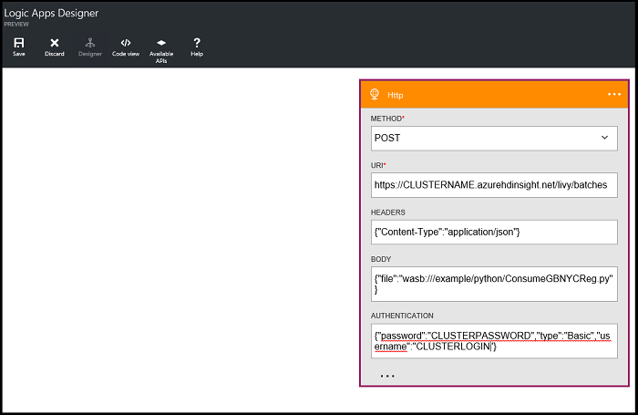

<properties
    pageTitle="分數火花內建電腦學習模型 |Microsoft Azure"
    description="如何儲存 Azure Blob 儲存體 (WASB) 中的成績學習模型。"
    services="machine-learning"
    documentationCenter=""
    authors="bradsev"
    manager="jhubbard"
    editor="cgronlun" />

<tags
    ms.service="machine-learning"
    ms.workload="data-services"
    ms.tgt_pltfrm="na"
    ms.devlang="na"
    ms.topic="article"
    ms.date="10/07/2016"
    ms.author="deguhath;bradsev;gokuma" />

# 分數火花內建電腦學習模型 

[AZURE.INCLUDE [machine-learning-spark-modeling](../../includes/machine-learning-spark-modeling.md)]

本主題說明如何載入電腦學習 （毫升） 模型已使用火花 MLlib 建置並儲存於 Azure Blob 儲存體 (WASB)，以及如何分數他們也 WASB 中所儲存的資料集。 它會顯示如何將預先處理輸入的資料、 轉換功能使用編製索引及編碼函數中的 MLlib 工具組，以及如何建立可用於輸入計分毫升模型與標記的點資料物件。 用於計分模型包含線性迴歸、 後勤迴歸、 隨機樹系模型，與漸層促進樹狀模型。

## 必要條件

1. 您需要 Azure 帳戶和 HDInsight 火花您需要 HDInsight 3.4 火花 1.6 叢集完成此逐步解說。 如何符合這些需求，請參閱[概觀資料科學使用火花 Azure HDInsight 上](machine-learning-data-science-spark-overview.md)的指示。 該主題也包含以下所用的 NYC 2013 計程車資料和指示 Jupyter 筆記本火花叢集上執行程式碼的描述。 本主題中的程式碼範例**pySpark-machine-learning-data-science-spark-model-consumption.ipynb**筆記本中會有[Github](https://github.com/Azure/Azure-MachineLearning-DataScience/tree/master/Misc/Spark/pySpark)。

2. 您必須同時建立電腦學習模型，以下分數，透過[資料探索和火花與模型](machine-learning-data-science-spark-data-exploration-modeling.md)主題的工作。   

[AZURE.INCLUDE [delete-cluster-warning](../../includes/hdinsight-delete-cluster-warning.md)]
 

## 安裝︰ 儲存位置、 文件庫，預設的火花內容

火花都可以讀取和寫入到 Azure 儲存體 Blob (WASB)。 因此您現有的資料的任何儲存那里可以處理使用火花和 WASB 中一次儲存的結果。

若要儲存 WASB 模型或檔案，必須正確地指定路徑。 預設的容器附加至火花叢集可以使用路徑開頭為的參考︰ *」 wasb / / 「*。 下列程式碼範例指定的資料供讀取及儲存模型輸出模型儲存目錄的路徑的位置。 

### 在 [WASB 中設定目錄的儲存位置的路徑

模型會儲存在: 「 wasb: / 使用者/remoteuser/NYCTaxi/模型 」。 此路徑的設定不正確、 模型並不會載入計分。

已經儲存 scored 的結果: 「 wasb: / 使用者/remoteuser/NYCTaxi/ScoredResults 」。 如果資料夾的路徑不正確，並不會將結果儲存該資料夾中。   

>[AZURE.NOTE] 檔案路徑位置可以複製並貼上此**machine-learning-data-science-spark-data-exploration-modeling.ipynb**筆記本的最後一個儲存格的輸出的程式碼中的版面配置區。   

以下是設定目錄路徑的程式碼︰ 

    # LOCATION OF DATA TO BE SCORED (TEST DATA)
    taxi_test_file_loc = "wasb://mllibwalkthroughs@cdspsparksamples.blob.core.windows.net/Data/NYCTaxi/JoinedTaxiTripFare.Point1Pct.Test.tsv";
    
    # SET THE MODEL STORAGE DIRECTORY PATH 
    # NOTE THE LAST BACKSLASH IN THIS PATH IS NEEDED
    modelDir = "wasb:///user/remoteuser/NYCTaxi/Models/" 
    
    # SET SCORDED RESULT DIRECTORY PATH
    # NOTE THE LAST BACKSLASH IN THIS PATH IS NEEDED
    scoredResultDir = "wasb:///user/remoteuser/NYCTaxi/ScoredResults/"; 
    
    # FILE LOCATIONS FOR THE MODELS TO BE SCORED
    logisticRegFileLoc = modelDir + "LogisticRegressionWithLBFGS_2016-04-1817_40_35.796789"
    linearRegFileLoc = modelDir + "LinearRegressionWithSGD_2016-04-1817_44_00.993832"
    randomForestClassificationFileLoc = modelDir + "RandomForestClassification_2016-04-1817_42_58.899412"
    randomForestRegFileLoc = modelDir + "RandomForestRegression_2016-04-1817_44_27.204734"
    BoostedTreeClassificationFileLoc = modelDir + "GradientBoostingTreeClassification_2016-04-1817_43_16.354770"
    BoostedTreeRegressionFileLoc = modelDir + "GradientBoostingTreeRegression_2016-04-1817_44_46.206262"

    # RECORD START TIME
    import datetime
    datetime.datetime.now()

**輸出︰**

datetime.datetime (2016年 4、 25、 23、 56、 19、 229403)

### 匯入文件庫

設定火花內容及匯入所需的文件庫，下列程式碼

    #IMPORT LIBRARIES
    import pyspark
    from pyspark import SparkConf
    from pyspark import SparkContext
    from pyspark.sql import SQLContext
    import matplotlib
    import matplotlib.pyplot as plt
    from pyspark.sql import Row
    from pyspark.sql.functions import UserDefinedFunction
    from pyspark.sql.types import *
    import atexit
    from numpy import array
    import numpy as np
    import datetime

### 預設火花內容和 PySpark 我們

Jupyter 筆記本會提供 PySpark 核心有預設的內容。 因此您不需要設定盡如或開發您開始使用應用程式之前，明確的登錄區內容。 以下是可供您預設的。 這些內容是︰

- sc-的火花 
- sqlContext-的登錄區

PySpark 核心提供預先定義的 「 我們 」，這是您可以使用呼叫的特殊命令 %。 有兩個這類這些程式碼範例中所使用的命令。

- **%本機**指定後續幾行中的程式碼會在本機執行。 程式碼，必須是有效的 Python 程式碼。
- **%sql o<variable name>** 
- 執行 sqlContext 登錄區查詢。 如果 command 和 o 參數傳遞，查詢的結果就會保存在 %熊 dataframe 本機 Python 內容。
 

如需更多有關 Jupyter 筆記本和預先定義的核心 」 magics 」 的他們提供，請參閱[適用於 Jupyter 的筆記本，與 HDInsight HDInsight 火花 Linux 叢集核心](../hdinsight/hdinsight-apache-spark-jupyter-notebook-kernels.md)。

## 內嵌的資料，並建立已清除的資料圖文框

本節中的一系列的任務內嵌的資料會計分所需的程式碼。 讀取連接 0.1%範例計程車差旅費和 fare 儲存的檔案 （另存為.tsv 檔案），在格式資料，並將然後建立全新的資料範圍。

計程車差旅費和 fare 檔案已聯結根據中提供的程序:[小組資料科學處理程序] 動作︰ 使用 HDInsight Hadoop 叢集](machine-learning-data-science-process-hive-walkthrough.md)主題。

    # INGEST DATA AND CREATE A CLEANED DATA FRAME

    # RECORD START TIME
    timestart = datetime.datetime.now()
    
    # IMPORT FILE FROM PUBLIC BLOB
    taxi_test_file = sc.textFile(taxi_test_file_loc)
    
    # GET SCHEMA OF THE FILE FROM HEADER
    taxi_header = taxi_test_file.filter(lambda l: "medallion" in l)
    
    # PARSE FIELDS AND CONVERT DATA TYPE FOR SOME FIELDS
    taxi_temp = taxi_test_file.subtract(taxi_header).map(lambda k: k.split("\t"))\
            .map(lambda p: (p[0],p[1],p[2],p[3],p[4],p[5],p[6],int(p[7]),int(p[8]),int(p[9]),int(p[10]),
                            float(p[11]),float(p[12]),p[13],p[14],p[15],p[16],p[17],p[18],float(p[19]),
                            float(p[20]),float(p[21]),float(p[22]),float(p[23]),float(p[24]),int(p[25]),int(p[26])))
        
    # GET SCHEMA OF THE FILE FROM HEADER
    schema_string = taxi_test_file.first()
    fields = [StructField(field_name, StringType(), True) for field_name in schema_string.split('\t')]
    fields[7].dataType = IntegerType() #Pickup hour
    fields[8].dataType = IntegerType() # Pickup week
    fields[9].dataType = IntegerType() # Weekday
    fields[10].dataType = IntegerType() # Passenger count
    fields[11].dataType = FloatType() # Trip time in secs
    fields[12].dataType = FloatType() # Trip distance
    fields[19].dataType = FloatType() # Fare amount
    fields[20].dataType = FloatType() # Surcharge
    fields[21].dataType = FloatType() # Mta_tax
    fields[22].dataType = FloatType() # Tip amount
    fields[23].dataType = FloatType() # Tolls amount
    fields[24].dataType = FloatType() # Total amount
    fields[25].dataType = IntegerType() # Tipped or not
    fields[26].dataType = IntegerType() # Tip class
    taxi_schema = StructType(fields)
    
    # CREATE DATA FRAME
    taxi_df_test = sqlContext.createDataFrame(taxi_temp, taxi_schema)
    
    # CREATE A CLEANED DATA-FRAME BY DROPPING SOME UN-NECESSARY COLUMNS & FILTERING FOR UNDESIRED VALUES OR OUTLIERS
    taxi_df_test_cleaned = taxi_df_test.drop('medallion').drop('hack_license').drop('store_and_fwd_flag').drop('pickup_datetime')\
        .drop('dropoff_datetime').drop('pickup_longitude').drop('pickup_latitude').drop('dropoff_latitude')\
        .drop('dropoff_longitude').drop('tip_class').drop('total_amount').drop('tolls_amount').drop('mta_tax')\
        .drop('direct_distance').drop('surcharge')\
        .filter("passenger_count > 0 and passenger_count < 8 AND payment_type in ('CSH', 'CRD') AND tip_amount >= 0 AND tip_amount < 30 AND fare_amount >= 1 AND fare_amount < 150 AND trip_distance > 0 AND trip_distance < 100 AND trip_time_in_secs > 30 AND trip_time_in_secs < 7200" )
    
    # CACHE DATA-FRAME IN MEMORY & MATERIALIZE DF IN MEMORY
    taxi_df_test_cleaned.cache()
    taxi_df_test_cleaned.count()
    
    # REGISTER DATA-FRAME AS A TEMP-TABLE IN SQL-CONTEXT
    taxi_df_test_cleaned.registerTempTable("taxi_test")
    
    # PRINT HOW MUCH TIME IT TOOK TO RUN THE CELL
    timeend = datetime.datetime.now()
    timedelta = round((timeend-timestart).total_seconds(), 2) 
    print "Time taken to execute above cell: " + str(timedelta) + " seconds"; 

**輸出︰**

執行儲存格上方時所需的時間︰ 46.37 （秒)

## 準備計分火花中的資料 

本節說明如何建立索引、 編碼和不按比例縮放分類的功能，以供用於 MLlib 指導的學習演算法分類和迴歸分析。

### 轉換的功能︰ 編製索引和編碼分類的功能，將計分模型的輸入 

本節說明如何使用的資料分類索引`StringIndexer`和編碼功能與`OneHotEncoder`輸入到模型。

[StringIndexer](http://spark.apache.org/docs/latest/ml-features.html#stringindexer)編碼字串資料行的資料行的索引標籤的標籤。 索引標籤的頻率根據排列。 

[OneHotEncoder](http://scikit-learn.org/stable/modules/generated/sklearn.preprocessing.OneHotEncoder.html#sklearn.preprocessing.OneHotEncoder)地圖標籤索引資料行的二進位向量，最多為單一項目值的資料行。 這個編碼方式可讓演算法的預期連續重要的功能的詳細資訊，例如後勤迴歸分析，可套用到分類的功能。
    
    #INDEX AND ONE-HOT ENCODE CATEGORICAL FEATURES

    # RECORD START TIME
    timestart = datetime.datetime.now()
    
    # LOAD PYSPARK LIBRARIES
    from pyspark.ml.feature import OneHotEncoder, StringIndexer, VectorAssembler, VectorIndexer
    
    # CREATE FOUR BUCKETS FOR TRAFFIC TIMES
    sqlStatement = """
        SELECT *,
        CASE
         WHEN (pickup_hour <= 6 OR pickup_hour >= 20) THEN "Night" 
         WHEN (pickup_hour >= 7 AND pickup_hour <= 10) THEN "AMRush" 
         WHEN (pickup_hour >= 11 AND pickup_hour <= 15) THEN "Afternoon"
         WHEN (pickup_hour >= 16 AND pickup_hour <= 19) THEN "PMRush"
        END as TrafficTimeBins
        FROM taxi_test 
    """
    taxi_df_test_with_newFeatures = sqlContext.sql(sqlStatement)
    
    # CACHE DATA-FRAME IN MEMORY & MATERIALIZE DF IN MEMORY
    taxi_df_test_with_newFeatures.cache()
    taxi_df_test_with_newFeatures.count()
    
    # INDEX AND ONE-HOT ENCODING
    stringIndexer = StringIndexer(inputCol="vendor_id", outputCol="vendorIndex")
    model = stringIndexer.fit(taxi_df_test_with_newFeatures) # Input data-frame is the cleaned one from above
    indexed = model.transform(taxi_df_test_with_newFeatures)
    encoder = OneHotEncoder(dropLast=False, inputCol="vendorIndex", outputCol="vendorVec")
    encoded1 = encoder.transform(indexed)
    
    # INDEX AND ENCODE RATE_CODE
    stringIndexer = StringIndexer(inputCol="rate_code", outputCol="rateIndex")
    model = stringIndexer.fit(encoded1)
    indexed = model.transform(encoded1)
    encoder = OneHotEncoder(dropLast=False, inputCol="rateIndex", outputCol="rateVec")
    encoded2 = encoder.transform(indexed)
    
    # INDEX AND ENCODE PAYMENT_TYPE
    stringIndexer = StringIndexer(inputCol="payment_type", outputCol="paymentIndex")
    model = stringIndexer.fit(encoded2)
    indexed = model.transform(encoded2)
    encoder = OneHotEncoder(dropLast=False, inputCol="paymentIndex", outputCol="paymentVec")
    encoded3 = encoder.transform(indexed)
    
    # INDEX AND ENCODE TRAFFIC TIME BINS
    stringIndexer = StringIndexer(inputCol="TrafficTimeBins", outputCol="TrafficTimeBinsIndex")
    model = stringIndexer.fit(encoded3)
    indexed = model.transform(encoded3)
    encoder = OneHotEncoder(dropLast=False, inputCol="TrafficTimeBinsIndex", outputCol="TrafficTimeBinsVec")
    encodedFinal = encoder.transform(indexed)
    
    # PRINT HOW MUCH TIME IT TOOK TO RUN THE CELL
    timeend = datetime.datetime.now()
    timedelta = round((timeend-timestart).total_seconds(), 2) 
    print "Time taken to execute above cell: " + str(timedelta) + " seconds"; 

**輸出︰**

執行儲存格上方時所需的時間︰ 5.37 （秒)

### 使用功能陣列輸入到模型建立 RDD 物件

本節中的程式碼，示範如何分類文字資料，以 RDD 物件索引和一個熱編碼，讓它可以用來訓練並測試 MLlib 後勤迴歸分析及樹狀為基礎的模型。 索引的資料會儲存於[同時分散式資料集 (RDD)](http://spark.apache.org/docs/latest/api/java/org/apache/spark/rdd/RDD.html)物件。 這些是火花基本抽象。 RDD 物件代表不變，分割的集合，可以使用火花平行營運上的項目。

同時也包含說明如何使用的資料不按比例縮放的程式碼`StandardScalar`MLlib 提供用於線性迴歸與 Stochastic 漸層深度 (SGD)，常用的演算法的訓練課程的各種電腦學習模型中。 [StandardScaler](https://spark.apache.org/docs/latest/api/python/pyspark.mllib.html#pyspark.mllib.feature.StandardScaler)用來調整功能單位變異數。 縮放功能，也稱為資料正常化確保的功能與廣泛 disbursed 值不指定過多衡量目標函數中。 

    # CREATE RDD OBJECTS WITH FEATURE ARRAYS FOR INPUT INTO MODELS

    # RECORD START TIME
    timestart = datetime.datetime.now()

    # IMPORT LIBRARIES
    from pyspark.mllib.linalg import Vectors
    from pyspark.mllib.feature import StandardScaler, StandardScalerModel
    from pyspark.mllib.util import MLUtils
    from numpy import array
    
    # INDEXING CATEGORICAL TEXT FEATURES FOR INPUT INTO TREE-BASED MODELS
    def parseRowIndexingBinary(line):
        features = np.array([line.paymentIndex, line.vendorIndex, line.rateIndex, line.TrafficTimeBinsIndex,
                             line.pickup_hour, line.weekday, line.passenger_count, line.trip_time_in_secs, 
                             line.trip_distance, line.fare_amount])
        return  features
    
    # ONE-HOT ENCODING OF CATEGORICAL TEXT FEATURES FOR INPUT INTO LOGISTIC RERESSION MODELS
    def parseRowOneHotBinary(line):
        features = np.concatenate((np.array([line.pickup_hour, line.weekday, line.passenger_count,
                                            line.trip_time_in_secs, line.trip_distance, line.fare_amount]), 
                                            line.vendorVec.toArray(), line.rateVec.toArray(), 
                                            line.paymentVec.toArray(), line.TrafficTimeBinsVec.toArray()), axis=0)
        return  features
    
    # ONE-HOT ENCODING OF CATEGORICAL TEXT FEATURES FOR INPUT INTO TREE-BASED MODELS
    def parseRowIndexingRegression(line):
        features = np.array([line.paymentIndex, line.vendorIndex, line.rateIndex, line.TrafficTimeBinsIndex, 
                             line.pickup_hour, line.weekday, line.passenger_count, line.trip_time_in_secs, 
                             line.trip_distance, line.fare_amount])
        return  features
    
    # INDEXING CATEGORICAL TEXT FEATURES FOR INPUT INTO LINEAR REGRESSION MODELS
    def parseRowOneHotRegression(line):
        features = np.concatenate((np.array([line.pickup_hour, line.weekday, line.passenger_count,
                                            line.trip_time_in_secs, line.trip_distance, line.fare_amount]), 
                                            line.vendorVec.toArray(), line.rateVec.toArray(), 
                                            line.paymentVec.toArray(), line.TrafficTimeBinsVec.toArray()), axis=0)
        return  features

    # FOR BINARY CLASSIFICATION TRAINING AND TESTING
    indexedTESTbinary = encodedFinal.map(parseRowIndexingBinary)
    oneHotTESTbinary = encodedFinal.map(parseRowOneHotBinary)
    
    # FOR REGRESSION CLASSIFICATION TRAINING AND TESTING
    indexedTESTreg = encodedFinal.map(parseRowIndexingRegression)
    oneHotTESTreg = encodedFinal.map(parseRowOneHotRegression)
    
    # SCALING FEATURES FOR LINEARREGRESSIONWITHSGD MODEL
    scaler = StandardScaler(withMean=False, withStd=True).fit(oneHotTESTreg)
    oneHotTESTregScaled = scaler.transform(oneHotTESTreg)
    
    # CACHE RDDS IN MEMORY
    indexedTESTbinary.cache();
    oneHotTESTbinary.cache();
    indexedTESTreg.cache();
    oneHotTESTreg.cache();
    oneHotTESTregScaled.cache();
    
    # PRINT HOW MUCH TIME IT TOOK TO RUN THE CELL
    timeend = datetime.datetime.now()
    timedelta = round((timeend-timestart).total_seconds(), 2) 
    print "Time taken to execute above cell: " + str(timedelta) + " seconds"; 

**輸出︰**

執行儲存格上方時所需的時間︰ 11.72 （秒)

## 分數後勤迴歸模型，並將輸出至 blob 儲存

本節中的程式碼會顯示載入已經儲存到 Azure blob 儲存體後勤迴歸模型，並使用它來預測計程車旅行支付提示、 分數，使用標準分類指標，然後儲存並繪製 blob 儲存體結果的方式。 Scored 的結果會儲存在 RDD 物件。 

    # SCORE AND EVALUATE LOGISTIC REGRESSION MODEL

    # RECORD START TIME
    timestart = datetime.datetime.now()
    
    # IMPORT LIBRARIES
    from pyspark.mllib.classification import LogisticRegressionModel
    
    ## LOAD SAVED MODEL
    savedModel = LogisticRegressionModel.load(sc, logisticRegFileLoc)
    predictions = oneHotTESTbinary.map(lambda features: (float(savedModel.predict(features))))
    
    ## SAVE SCORED RESULTS (RDD) TO BLOB
    datestamp = unicode(datetime.datetime.now()).replace(' ','').replace(':','_');
    logisticregressionfilename = "LogisticRegressionWithLBFGS_" + datestamp + ".txt";
    dirfilename = scoredResultDir + logisticregressionfilename;
    predictions.saveAsTextFile(dirfilename)
    
    
    # PRINT HOW MUCH TIME IT TOOK TO RUN THE CELL
    timeend = datetime.datetime.now()
    timedelta = round((timeend-timestart).total_seconds(), 2) 
    print "Time taken to execute above cell: " + str(timedelta) + " seconds";

**輸出︰**

執行儲存格上方時所需的時間︰ 19.22 （秒)

## 分數線性迴歸模型

我們使用[LinearRegressionWithSGD](https://spark.apache.org/docs/latest/api/python/pyspark.mllib.html#pyspark.mllib.regression.LinearRegressionWithSGD)訓練預測提示所支付的金額使用 Stochastic 漸層深度 (SGD) 進行最佳化的線性迴歸模型。 

本節中的程式碼會顯示如何從 Azure blob 儲存體載入線性迴歸模型、 分數使用不按比例縮放的變數，然後回到 blob 儲存結果。

    #SCORE LINEAR REGRESSION MODEL

    # RECORD START TIME
    timestart = datetime.datetime.now()
    
    #LOAD LIBRARIES
    from pyspark.mllib.regression import LinearRegressionWithSGD, LinearRegressionModel
    
    # LOAD MODEL AND SCORE USING ** SCALED VARIABLES **
    savedModel = LinearRegressionModel.load(sc, linearRegFileLoc)
    predictions = oneHotTESTregScaled.map(lambda features: (float(savedModel.predict(features))))
    
    # SAVE RESULTS
    datestamp = unicode(datetime.datetime.now()).replace(' ','').replace(':','_');
    linearregressionfilename = "LinearRegressionWithSGD_" + datestamp;
    dirfilename = scoredResultDir + linearregressionfilename;
    predictions.saveAsTextFile(dirfilename)
    
    # PRINT HOW MUCH TIME IT TOOK TO RUN THE CELL
    timeend = datetime.datetime.now()
    timedelta = round((timeend-timestart).total_seconds(), 2) 
    print "Time taken to execute above cell: " + str(timedelta) + " seconds"; 

**輸出︰**

執行儲存格上方時所需的時間︰ 16.63 （秒)

## 分數分類和迴歸隨機樹系模型

本節中的程式碼會顯示如何載入儲存的分類迴歸隨機樹系模型中並儲存 Azure blob 儲存體分數標準器與迴歸量值，其效能，再將結果存回 blob 儲存體。

[隨機樹系](http://spark.apache.org/docs/latest/mllib-ensembles.html#Random-Forests)是 ensembles 的決策樹。  結合來降低風險的膨脹許多決策樹。 隨機樹系可以處理分類的功能，可延伸至 multiclass 分類設定，不需要縮放功能，並且可以擷取非 linearities 和功能互動。 隨機樹系是最成功電腦學習分類和迴歸模型。

二進位和 multiclass 分類和迴歸分析，使用連續和分類的功能， [spark.mllib](http://spark.apache.org/mllib/)支援隨機樹系。 

    # SCORE RANDOM FOREST MODELS FOR CLASSIFICATION AND REGRESSION

    # RECORD START TIME
    timestart = datetime.datetime.now()

    #IMPORT MLLIB LIBRARIES 
    from pyspark.mllib.tree import RandomForest, RandomForestModel
    
    
    # CLASSIFICATION: LOAD SAVED MODEL, SCORE AND SAVE RESULTS BACK TO BLOB
    savedModel = RandomForestModel.load(sc, randomForestClassificationFileLoc)
    predictions = savedModel.predict(indexedTESTbinary)
    
    # SAVE RESULTS
    datestamp = unicode(datetime.datetime.now()).replace(' ','').replace(':','_');
    rfclassificationfilename = "RandomForestClassification_" + datestamp + ".txt";
    dirfilename = scoredResultDir + rfclassificationfilename;
    predictions.saveAsTextFile(dirfilename)
    

    # REGRESSION: LOAD SAVED MODEL, SCORE AND SAVE RESULTS BACK TO BLOB
    savedModel = RandomForestModel.load(sc, randomForestRegFileLoc)
    predictions = savedModel.predict(indexedTESTreg)
    
    # SAVE RESULTS
    datestamp = unicode(datetime.datetime.now()).replace(' ','').replace(':','_');
    rfregressionfilename = "RandomForestRegression_" + datestamp + ".txt";
    dirfilename = scoredResultDir + rfregressionfilename;
    predictions.saveAsTextFile(dirfilename)

    # PRINT HOW MUCH TIME IT TOOK TO RUN THE CELL
    timeend = datetime.datetime.now()
    timedelta = round((timeend-timestart).total_seconds(), 2) 
    print "Time taken to execute above cell: " + str(timedelta) + " seconds";

**輸出︰**

執行儲存格上方時所需的時間︰ 31.07 （秒)

## 分數分類和迴歸漸層促進樹狀模型

本節中的程式碼會顯示如何從 Azure blob 儲存體載入分類和迴歸漸層促進樹狀模型、 分數標準器與迴歸量值，其效能及再將結果存回 blob 儲存體。 

**spark.mllib**支援 GBTs，二進位分類和迴歸分析，使用連續和分類的功能。 

[漸層促進樹狀結構](http://spark.apache.org/docs/latest/ml-classification-regression.html#gradient-boosted-trees-gbts)(GBTs) 是 ensembles 的決策樹。 GBTs 訓練反覆以縮小的遺失函數的決策樹。 GBTs 可以處理分類的功能，不需要縮放功能，並且可以擷取非 linearities 和功能互動。 他們也可在 multiclass 分類設定。

    # SCORE GRADIENT BOOSTING TREE MODELS FOR CLASSIFICATION AND REGRESSION

    # RECORD START TIME
    timestart = datetime.datetime.now()

    #IMPORT MLLIB LIBRARIES
    from pyspark.mllib.tree import GradientBoostedTrees, GradientBoostedTreesModel
    
    # CLASSIFICATION: LOAD SAVED MODEL, SCORE AND SAVE RESULTS BACK TO BLOB

    #LOAD AND SCORE THE MODEL
    savedModel = GradientBoostedTreesModel.load(sc, BoostedTreeClassificationFileLoc)
    predictions = savedModel.predict(indexedTESTbinary)
    
    # SAVE RESULTS
    datestamp = unicode(datetime.datetime.now()).replace(' ','').replace(':','_');
    btclassificationfilename = "GradientBoostingTreeClassification_" + datestamp + ".txt";
    dirfilename = scoredResultDir + btclassificationfilename;
    predictions.saveAsTextFile(dirfilename)
    

    # REGRESSION: LOAD SAVED MODEL, SCORE AND SAVE RESULTS BACK TO BLOB

    # LOAD AND SCORE MODEL 
    savedModel = GradientBoostedTreesModel.load(sc, BoostedTreeRegressionFileLoc)
    predictions = savedModel.predict(indexedTESTreg)
    
    # SAVE RESULTS
    datestamp = unicode(datetime.datetime.now()).replace(' ','').replace(':','_');
    btregressionfilename = "GradientBoostingTreeRegression_" + datestamp + ".txt";
    dirfilename = scoredResultDir + btregressionfilename;
    predictions.saveAsTextFile(dirfilename)

    # PRINT HOW MUCH TIME IT TOOK TO RUN THE CELL
    timeend = datetime.datetime.now()
    timedelta = round((timeend-timestart).total_seconds(), 2) 
    print "Time taken to execute above cell: " + str(timedelta) + " seconds"; 
    
**輸出︰**

執行儲存格上方時所需的時間︰ 14.6 （秒)

## 清理記憶體物件及列印計分檔案位置

    # UNPERSIST OBJECTS CACHED IN MEMORY
    taxi_df_test_cleaned.unpersist()
    indexedTESTbinary.unpersist();
    oneHotTESTbinary.unpersist();
    indexedTESTreg.unpersist();
    oneHotTESTreg.unpersist();
    oneHotTESTregScaled.unpersist();

    # PRINT OUT PATH TO SCORED OUTPUT FILES
    print "logisticRegFileLoc: " + logisticregressionfilename;
    print "linearRegFileLoc: " + linearregressionfilename;
    print "randomForestClassificationFileLoc: " + rfclassificationfilename;
    print "randomForestRegFileLoc: " + rfregressionfilename;
    print "BoostedTreeClassificationFileLoc: " + btclassificationfilename;
    print "BoostedTreeRegressionFileLoc: " + btregressionfilename;

**輸出︰**

logisticRegFileLoc: LogisticRegressionWithLBFGS_2016-05-0317_22_38.953814.txt

linearRegFileLoc: LinearRegressionWithSGD_2016-05-0317_22_58.878949

randomForestClassificationFileLoc: RandomForestClassification_2016-05-0317_23_15.939247.txt

randomForestRegFileLoc: RandomForestRegression_2016-05-0317_23_31.459140.txt

BoostedTreeClassificationFileLoc: GradientBoostingTreeClassification_2016 05 0317_23_49.648334.txt

BoostedTreeRegressionFileLoc: GradientBoostingTreeRegression_2016 05 0317_23_56.860740.txt

## Web 介面到消耗火花模型

火花提供遠端呼叫晚總元件送出批次工作或透過其餘介面互動式查詢機制。 HDInsight 火花叢集上的預設會啟用晚總。 如需更多有關晚總請參閱︰[使用遠端晚總提交火花工作](../hdinsight/hdinsight-apache-spark-livy-rest-interface.md)。 

您可以使用晚總遠端提交批次成績的工作會儲存在 Azure blob，再將結果寫入另一個 blob 的檔案。 若要這麼做上, 傳的 Python 指令碼  
以火花叢集的 blob [Github](https://raw.githubusercontent.com/Azure/Azure-MachineLearning-DataScience/master/Misc/Spark/Python/ConsumeGBNYCReg.py) 。 若要將指令碼複製叢集 blob，您可以使用的工具，例如**Microsoft Azure 儲存檔案總管**或**AzCopy** 。 在此例中，我們上將指令碼傳到***wasb:///example/python/ConsumeGBNYCReg.py***。   

>[AZURE.NOTE] 您需要可以找到儲存帳戶火花叢集相關聯的入口網站便捷鍵。 

上傳到此位置後這個指令碼執行火花叢集分散式內容中。 它會載入模型，並執行預測輸入模型為基礎的檔案。  

您可以叫用這個指令碼遠端晚總上進行簡單的 HTTPS/其餘要求。  以下是捲曲命令，以建構遠端呼叫 Python 指令碼 HTTP 要求。 CLUSTERLOGIN CLUSTERPASSWORD、 CLUSTERNAME 取代火花叢集適當的值。

    # CURL COMMAND TO INVOKE PYTHON SCRIPT WITH HTTP REQUEST

    curl -k --user "CLUSTERLOGIN:CLUSTERPASSWORD" -X POST --data "{\"file\": \"wasb:///example/python/ConsumeGBNYCReg.py\"}" -H "Content-Type: application/json" https://CLUSTERNAME.azurehdinsight.net/livy/batches

您可以使用遠端系統上的任何語言來進行簡單 HTTPS 通話基本驗證來啟動晚總火花工作。   

>[AZURE.NOTE] 將會方便使用 Python 要求文件庫時進行此 HTTP 通話，但其目前未安裝 Azure 函數中的預設。 因此會改為使用較舊的 HTTP 文件庫。   

以下是在 HTTP 呼叫 Python 程式碼︰

    #MAKE AN HTTPS CALL ON LIVY. 

    import os

    # OLDER HTTP LIBRARIES USED HERE INSTEAD OF THE REQUEST LIBRARY AS THEY ARE AVAILBLE BY DEFAULT
    import httplib, urllib, base64
    
    # REPLACE VALUE WITH ONES FOR YOUR SPARK CLUSTER
    host = '<spark cluster name>.azurehdinsight.net:443'
    username='<username>'
    password='<password>'
    
    #AUTHORIZATION
    conn = httplib.HTTPSConnection(host)
    auth = base64.encodestring('%s:%s' % (username, password)).replace('\n', '')
    headers = {'Content-Type': 'application/json', 'Authorization': 'Basic %s' % auth}
    
    # SPECIFY THE PYTHON SCRIPT TO RUN ON THE SPARK CLUSTER
    # IN THE FILE PARAMETER OF THE JSON POST REQUEST BODY
    r=conn.request("POST", '/livy/batches', '{"file": "wasb:///example/python/ConsumeGBNYCReg.py"}', headers )
    response = conn.getresponse().read()
    print(response)
    conn.close()

您也可以新增此 Python 程式碼[Azure 函數](https://azure.microsoft.com/documentation/services/functions/)來觸發火花工作送出的分數 blob 根據計時器、 建立或更新的 blob 的各種事件。 

如果您偏好的程式碼免費的用戶端體驗，可用於[Azure 邏輯應用程式](https://azure.microsoft.com/documentation/services/app-service/logic/)叫用計分**邏輯應用程式的設計工具**上定義 HTTP 動作，並設定其參數的火花批次。 

- 從 Azure 入口網站，請選取 [ **+ 新增**，新的邏輯應用程式建立 -> **Web + 行動** -> **邏輯應用程式**。 
- 若要顯示**邏輯應用程式的設計工具**，輸入邏輯應用程式和應用程式服務方案名稱。
- 選取 HTTP 動作]，然後輸入參數，如下圖所示︰

## 下一步是什麼？ 

**跨驗證和 hyperparameter 全面**︰ 請參閱[進階資料瀏覽和模型火花與](machine-learning-data-science-spark-advanced-data-exploration-modeling.md)模型的可訓練使用跨驗證和超參數到。
