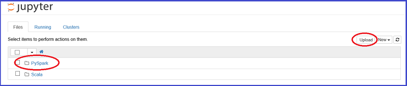

<properties
    pageTitle="使用火花 Azure HDInsight 的資料科學概觀 |Microsoft Azure"
    description="火花 MLlib 工具組會相當大的電腦學習模型分散式 HDInsight 環境的功能。"
    services="machine-learning"
    documentationCenter=""
    authors="bradsev"
    manager="jhubbard"
    editor="cgronlun"  />

<tags
    ms.service="machine-learning"
    ms.workload="data-services"
    ms.tgt_pltfrm="na"
    ms.devlang="na"
    ms.topic="article"
    ms.date="10/07/2016"
    ms.author="deguhath;bradsev;gokuma" />

# 使用火花 Azure HDInsight 的資料科學的概觀

[AZURE.INCLUDE [machine-learning-spark-modeling](../../includes/machine-learning-spark-modeling.md)]

此主題的套件會顯示如何使用 HDInsight 火花完成常見的資料科學工作，例如資料 ingestion 與功能工程、 模型、 模型評估。 使用的資料是 2013 NYC 計程車差旅費和 fare 資料集的範例。 內建模型包含後勤和線性迴歸、 隨機樹系和漸層提高樹狀目錄。 主題也會顯示如何 Azure blob 儲存體 (WASB) 中儲存這些模型以及如何分數，並在評估其預測的效能。 更多進階的主題涵蓋模型的可訓練使用跨驗證和超參數到。 概觀本文也說明如何設定火花叢集，您必須完成三個所提供的逐步解說中的步驟進行。 

[火花](http://spark.apache.org/)是處理架構，可支援提高大型資料分析應用程式的效能的記憶體內處理開啟來源平行。 火花處理引擎內建的速度，以便於使用及複雜的分析。 火花的記憶體內分散式的計算功能讓您更適合反覆運算演算法電腦學習及圖形計算中。 [MLlib](http://spark.apache.org/mllib/)是火花的調整電腦學習的文件庫的模型功能為此分散式環境。 

[HDInsight 火花](../hdinsight/hdinsight-apache-spark-overview.md)是 Azure 的裝載的提供的開啟來源火花。 也包含支援**Jupyter PySpark 筆記本**火花叢集，可以執行火花 SQL 互動式查詢轉換、 篩選和以視覺化方式檢視資料儲存在 Azure Blob (WASB)。 PySpark 是火花 Python API。 提供解決方案，並顯示相關的繪圖呈現以下火花叢集上所安裝的 Jupyter 筆記本中執行程式碼片段。 模型中的步驟進行這些主題包含示範如何訓練、 評估、 儲存及使用每種類型的模型的程式碼。 

設定步驟，在此逐步解說提供程式碼是 HDInsight 3.4 火花 1.6。 不過，程式碼以下在筆記本中一般與任何火花叢集應該使用。 如果您不使用 HDInsight 火花，叢集設定與管理步驟可能稍有不同的內容如下所示。

## 必要條件

1.必須 Azure 的訂閱。 如果您還沒有其中一個，請參閱[取得 Azure 免費試用版](https://azure.microsoft.com/documentation/videos/get-azure-free-trial-for-testing-hadoop-in-hdinsight/)。

2.您需要的 HDInsight 3.4 火花 1.6 叢集，才能完成此逐步解說。 若要建立一個，請參閱中所提供的指示[快速入門︰ 建立 Azure HDInsight Apache 火花](../hdinsight/hdinsight-apache-spark-jupyter-spark-sql.md)。 從功能表**選取叢集類型**指定叢集類型和版本。 

<!-- -->

> [AZURE.NOTE] 顯示如何使用 Scala，而不是 Python 完成工作的端對端資料科學程序的主題，請參閱[資料科學使用 Scala 火花 Azure 上使用](machine-learning-data-science-process-scala-walkthrough.md)。

<!-- -->

>[AZURE.INCLUDE [delete-cluster-warning](../../includes/hdinsight-delete-cluster-warning.md)]

## NYC 2013 計程車資料

NYC 計程車差旅費資料是關於的 20 GB 壓縮的逗點分隔值 (CSV) 檔案 (未壓縮 ~ 48 GB)，可包含多個 173 百萬個別往返和 fares 所支付的每個出差行程井然有序。 每個旅行記錄包括收取和下車地點和時間、 匿名駭客 （驅動程式的） 授權數字及 medallion （計程車的唯一識別碼） 編號。 資料在 2013年年涵蓋所有往返和每個月提供下列兩個資料集︰

1. 「 Trip_data' CSV 檔案包含出差的詳細資訊，例如乘客數、 拿起，dropoff 點，成為工期和旅行長度。 以下是一些範例記錄中︰

        medallion,hack_license,vendor_id,rate_code,store_and_fwd_flag,pickup_datetime,dropoff_datetime,passenger_count,trip_time_in_secs,trip_distance,pickup_longitude,pickup_latitude,dropoff_longitude,dropoff_latitude
        89D227B655E5C82AECF13C3F540D4CF4,BA96DE419E711691B9445D6A6307C170,CMT,1,N,2013-01-01 15:11:48,2013-01-01 15:18:10,4,382,1.00,-73.978165,40.757977,-73.989838,40.751171
        0BD7C8F5BA12B88E0B67BED28BEA73D8,9FD8F69F0804BDB5549F40E9DA1BE472,CMT,1,N,2013-01-06 00:18:35,2013-01-06 00:22:54,1,259,1.50,-74.006683,40.731781,-73.994499,40.75066
        0BD7C8F5BA12B88E0B67BED28BEA73D8,9FD8F69F0804BDB5549F40E9DA1BE472,CMT,1,N,2013-01-05 18:49:41,2013-01-05 18:54:23,1,282,1.10,-74.004707,40.73777,-74.009834,40.726002
        DFD2202EE08F7A8DC9A57B02ACB81FE2,51EE87E3205C985EF8431D850C786310,CMT,1,N,2013-01-07 23:54:15,2013-01-07 23:58:20,2,244,.70,-73.974602,40.759945,-73.984734,40.759388
        DFD2202EE08F7A8DC9A57B02ACB81FE2,51EE87E3205C985EF8431D850C786310,CMT,1,N,2013-01-07 23:25:03,2013-01-07 23:34:24,1,560,2.10,-73.97625,40.748528,-74.002586,40.747868

2. 「 Trip_fare' CSV 檔案包含所支付的每個出差行程井然有序，例如付款類型、 fare 量、 銷售稅和稅金、 秘訣及 tolls，fare 和付款的詳細資料。 以下是一些範例記錄中︰

        medallion, hack_license, vendor_id, pickup_datetime, payment_type, fare_amount, surcharge, mta_tax, tip_amount, tolls_amount, total_amount
        89D227B655E5C82AECF13C3F540D4CF4,BA96DE419E711691B9445D6A6307C170,CMT,2013-01-01 15:11:48,CSH,6.5,0,0.5,0,0,7
        0BD7C8F5BA12B88E0B67BED28BEA73D8,9FD8F69F0804BDB5549F40E9DA1BE472,CMT,2013-01-06 00:18:35,CSH,6,0.5,0.5,0,0,7
        0BD7C8F5BA12B88E0B67BED28BEA73D8,9FD8F69F0804BDB5549F40E9DA1BE472,CMT,2013-01-05 18:49:41,CSH,5.5,1,0.5,0,0,7
        DFD2202EE08F7A8DC9A57B02ACB81FE2,51EE87E3205C985EF8431D850C786310,CMT,2013-01-07 23:54:15,CSH,5,0.5,0.5,0,0,6
        DFD2202EE08F7A8DC9A57B02ACB81FE2,51EE87E3205C985EF8431D850C786310,CMT,2013-01-07 23:25:03,CSH,9.5,0.5,0.5,0,0,10.5

我們已採取這些檔案的 0.1%樣本，並加入旅行\_資料和旅行\_最好 CVS 檔案到單一資料集以作為此逐步解說中輸入資料集。 若要加入出差的唯一索引鍵\_資料和旅行\_fare 組成欄位︰ medallion，具 「 可回復\_授權與收取\_datetime。 資料集的每一筆記錄包含代表 NYC 計程車出差的下列屬性︰

|功能變數| 簡短描述
|------|---------------------------------
| medallion |匿名計程車 medallion (唯一計程車 id)
| hack_license |    匿名 Hackney 換行字元授權數字
| vendor_id |   計程車廠商識別碼
| rate_code | Fare NYC 計程車工資率
| store_and_fwd_flag | 儲存及轉寄旗標
| pickup_datetime | 選擇 [日期及時間
| dropoff_datetime | Dropoff 日期及時間
| pickup_hour | 選擇 [小時
| pickup_week | 選擇 [一年週
| weekday | Weekday （範圍 1-7）
| passenger_count | 乘客計程車差旅費中的數字
| trip_time_in_secs | 來回時間 （秒）
| trip_distance | 在英哩的旅行距離
| pickup_longitude | 選擇 [經度
| pickup_latitude | 選擇 [緯度
| dropoff_longitude | Dropoff 經度
| dropoff_latitude | Dropoff 緯度
| direct_distance | 設定指示挑選之間的距離及 dropoff 位置
| payment_type | 付款類型 （ca、 信用卡卡等）。
| fare_amount | 在 [fare 量
| 銷售稅 | 銷售稅
| mta_tax | Mta 稅金
| tip_amount | 提示量
| tolls_amount | Tolls 量
| total_amount | 總金額
| 雪人 | （雪人） （0/1 否] 或 [是]）
| tip_class | 提示類別 (0: $0、 1: $0-5，2: $6-10，3: $11-20，4: > $20)

## 從 Jupyter 筆記本火花叢集上執行程式碼 

您可以在啟動 Jupyter 筆記本從 Azure 入口網站。 尋找您的儀表板上火花叢集，然後按一下該叢集輸入管理頁面。 若要開啟火花叢集相關聯的筆記本，請按一下 [**叢集儀表板** -> **Jupyter 筆記本**。

您也可以瀏覽至***https://CLUSTERNAME.azurehdinsight.net/jupyter***存取 Jupyter 筆記本。 此 URL CLUSTERNAME 部分換成您自己的叢集的名稱。 您需要您存取的筆記本的管理員帳戶的密碼。

選取 PySpark 若要查看含有一些範例使用 PySpark API 的預先封裝筆記本的目錄。包含的火花主題此套件的程式碼範例的筆記本，可在[Github](https://github.com/Azure/Azure-MachineLearning-DataScience/tree/master/Misc/Spark/pySpark)

您可以在火花叢集上載直接從 Github Jupyter 筆記本伺服器的筆記本。 在您 Jupyter 首頁上，按一下右邊的畫面上的 [**上傳**] 按鈕。 它會開啟檔案總管]。 在此貼上 Github （未經處理的內容） URL 的筆記本，按一下 [**開啟**]。 PySpark 筆記本，可在下列 Url:

1.  [pySpark-machine-learning-data-science-spark-data-exploration-modeling.ipynb](https://github.com/Azure/Azure-MachineLearning-DataScience/blob/master/Misc/Spark/pySpark/pySpark-machine-learning-data-science-spark-data-exploration-modeling.ipynb)
2.  [pySpark-machine-learning-data-science-spark-model-consumption.ipynb](https://github.com/Azure/Azure-MachineLearning-DataScience/blob/master/Misc/Spark/pySpark/pySpark-machine-learning-data-science-spark-model-consumption.ipynb)
3.  [pySpark-machine-learning-data-science-spark-advanced-data-exploration-modeling.ipynb](https://github.com/Azure/Azure-MachineLearning-DataScience/blob/master/Misc/Spark/pySpark/pySpark-machine-learning-data-science-spark-advanced-data-exploration-modeling.ipynb)

再次 Jupyter 檔案清單與 [**上傳**] 按鈕上看到的檔案名稱。 按一下此 [**上傳**] 按鈕。 現在您已匯入筆記本。 重複這些步驟來上傳此逐步解說中的其他筆記本。

> [AZURE.TIP] 您可以用滑鼠右鍵按一下您的瀏覽器的連結，並選取 [**複製連結**，以取得 github 原始內容的 URL。 您可以將此 URL 貼到 [Jupyter 上傳檔案總管] 對話方塊。

您現在可以︰

- 按一下筆記本，請參閱程式碼。
- 按下**SHIFT ENTER**來執行每個儲存格。
- 在**儲存格**上按一下 [執行整個筆記本 -> **執行**。
- 使用自動視覺效果的查詢。

> [AZURE.TIP] PySpark 核心自動文章 SQL (HiveQL) 查詢的輸出。 您有許多不同類型的視覺效果 （資料表、 圓形圖、 折線圖、 區域中或列） 之間，使用來選取 [**類型**] 功能表按鈕在筆記本中的選項︰

## 下一步是什麼？

既然您已設定與 HDInsight 火花叢集並上傳 Jupyter 筆記本時，就可以開始執行會對應到三個 PySpark 筆記本的主題。 即會顯示如何瀏覽您的資料，然後建立並使用模型。 進階的資料探索與模型筆記本會顯示如何包含交叉驗證，超參數全面，以及模型評估。 

**資料探索和火花與模型︰**探索資料集及建立，分數，以及評估電腦學習模型透過[建立二進位分類和火花 MLlib 工具組資料的迴歸模型](machine-learning-data-science-spark-data-exploration-modeling.md)主題中的工作。

**模型消耗︰**若要瞭解如何分數分類和迴歸模型建立本主題中，請參閱[分數和評估火花內建電腦學習模型](machine-learning-data-science-spark-model-consumption.md)。

**跨驗證和 hyperparameter 全面**︰ 請參閱[進階資料瀏覽和模型火花與](machine-learning-data-science-spark-advanced-data-exploration-modeling.md)模型的可訓練使用跨驗證和超參數到

