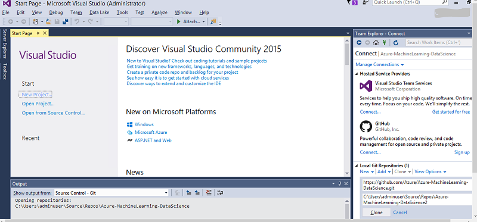
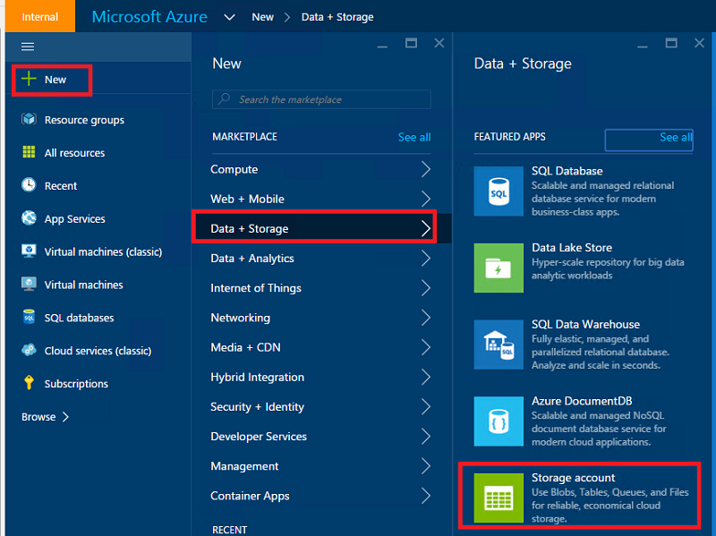
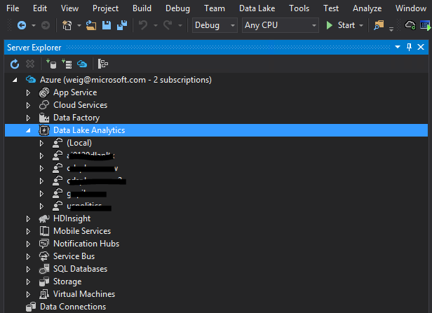
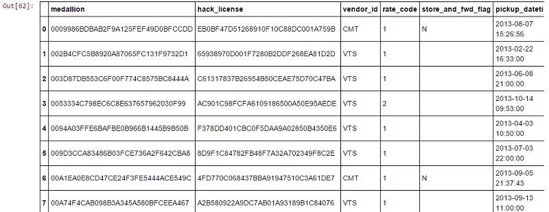
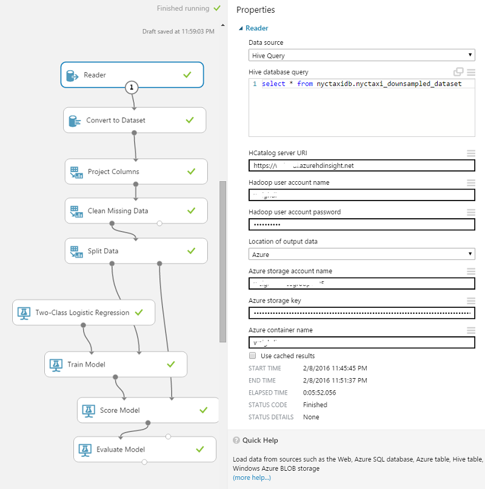
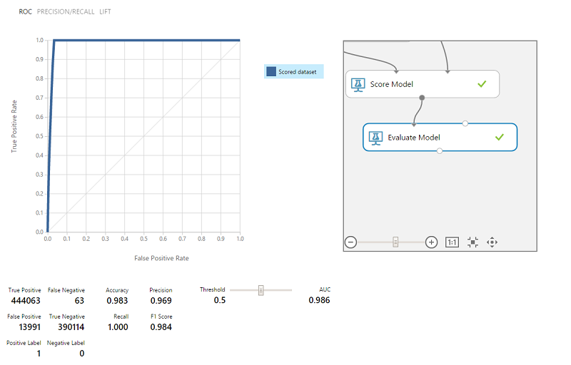

<properties
    pageTitle="您可以在 [資料科學虛擬機器執行的 10 個項目 |Microsoft Azure"
    description="在資料科學虛擬機器上執行各種資料瀏覽與模型任務。"
    services="machine-learning"
    documentationCenter=""
    authors="bradsev"
    manager="jhubbard"
    editor="cgronlun"  />

<tags
    ms.service="machine-learning"
    ms.workload="data-services"
    ms.tgt_pltfrm="na"
    ms.devlang="na"
    ms.topic="article"
    ms.date="08/29/2016"
    ms.author="gokuma;weig;bradsev" />

# <a name="ten-things-you-can-do-on-the-data-science-virtual-machine"></a>您可以在 [資料科學虛擬機器的 10 個項目

Microsoft 資料科學虛擬機器 (DSVM) 是可讓您執行各種不同的資料探索與模型工作的強大資料科學開發環境。 環境已有建立並使用數個常用的資料分析工具，可讓您更輕鬆地快速開始使用您的內部部署，分析搭售雲端或混合式部署。 DSVM 許多 Azure 服務與密切合作，可以讀取和處理 Azure Azure SQL Data Warehouse、 Azure 資料湖 Azure 儲存空間，或 DocumentDB 已儲存的資料。 它也可以運用 Azure 電腦學習和 Azure 資料工廠等其他分析工具。


本文中我們逐步引導您完成如何使用您 DSVM 執行各種資料科學工作並與其互動其他 Azure 服務。 以下是一些您可以在 DSVM 執行的動作︰

1. 探索資料，以及開發本機上使用 Microsoft R 伺服器，Python DSVM 模型
2. 若要嘗試使用您的資料，在瀏覽器使用 Python 2，Python 3 Microsoft R R 專為延展性和效能的企業好版本中使用 Jupyter 筆記本
3. Operationalize 模型內建 R 上使用與 Python Azure 電腦學習，用戶端應用程式都能存取您使用簡單的 web 服務介面的模型
4. 管理您使用 Azure 入口網站或 Powershell 的 Azure 資源
5. 延長您的儲存空間及共用大型資料集/藉由建立 Azure 檔案儲存為可裝載磁碟機上您 DSVM 過您整個小組程式碼
6. 與使用 Github 小組共用的程式碼，存取您使用的預先安裝的給用戶端-給艦隊給 GUI 的存放庫。
7. 存取各種 Azure 資料和分析等服務 Azure blob 儲存體，Azure 資料湖 Azure HDInsight (Hadoop)、 Azure DocumentDB Azure SQL Data Warehouse 及資料庫
8. 建立報表和儀表板使用 DSVM 上已預先安裝 Power BI Desktop 及部署雲端
9. 動態不按比例縮放以符合您的專案需求您 DSVM
10. 在您的虛擬機器上安裝其他工具   


>[AZURE.NOTE] 其他使用費用會套用的本文中所列的其他資料儲存和分析服務。 請參閱[Azure 定價](https://azure.microsoft.com/pricing/)詳細資料頁面。


**必要條件**

- 您必須 Azure 的訂閱。 您可以註冊免費試用版[以下](https://azure.microsoft.com/free/)。

- 佈建資料科學虛擬機器 Azure 入口網站上的指示，可在[建立虛擬機器](https://portal.azure.com/#create/microsoft-ads.standard-data-science-vmstandard-data-science-vm)。

## <a name="1-explore-data-and-develop-models-using-microsoft-r-server-or-python"></a>1.探索資料，以及開發使用 Microsoft R 伺服器或 Python 模型

您可以使用的語言，如 R 和 Python 執行 DSVM 上您的資料分析。

，您可以使用位於 [開始] 功能表或桌面 IDE 稱為 「 大革命 R 企業 8.0 」。 Microsoft 提供其他的文件庫的上方開啟來源/CRAN-R 啟用可調整分析及分析資料大於執行平行區塊的分析，以允許的記憶體大小的能力。 您也可以安裝您選擇，例如[RStudio](https://www.rstudio.com/products/rstudio-desktop/)R IDE。

Python，您可以使用 Visual Studio 社群版具有已預先安裝的 Visual Studio (PTVS) 副檔名的 Python 工具像 IDE。 根據預設，基本 Python 2.7 沒有設定 PTVS 上 （例如 SciKit，熊任何分析文件庫中）。 若要啟用 Anaconda Python 2.7 和 3.5，您需要執行下列動作︰

* 瀏覽至**工具**中建立自訂的環境，每個版本 -> **Python 工具** -> **Python 環境**，然後按一下 [」**+ 自訂**「 Visual Studio 2015 社群版本中
* 授與描述和設定環境首碼路徑為*c:\anaconda*的 Anaconda Python 2.7 或*c:\anaconda\envs\py35* Anaconda Python 3.5
* 按一下 [**自動偵測**再**套用**至儲存環境。

以下是自訂環境設定 Visual Studio 中的外觀。


如何建立 Python 環境，請參閱其他詳細資料的[PTVS 文件](https://github.com/Microsoft/PTVS/wiki/Selecting-and-Installing-Python-Interpreters#hey-i-already-have-an-interpreter-on-my-machine-but-ptvs-doesnt-seem-to-know-about-it)。

現在您已設定來建立新的 Python 專案。 瀏覽至**檔案** -> **新增** -> **專案** -> **Python**並選取您要建立的 Python 應用程式類型。 您可以將目前專案的 Python 環境為所要的版本 (Anaconda 2.7 或 3.5): 以滑鼠右鍵按一下**Python 環境**，選取 [**新增/移除 Python 環境**中，，然後選取所需的環境，與專案建立關聯。 您可以找到有關使用 PTVS 產品[文件](https://github.com/Microsoft/PTVS/wiki)頁面上的詳細資訊。

## <a name="2-using-a-jupyter-notebook-to-explore-and-model-your-data-with-python-or-r"></a>2.瀏覽並模型 Python 或 R 資料使用 Jupyter 筆記本

Jupyter 筆記本是一個功能強大的環境，提供資料瀏覽和建立模型的瀏覽器型 」 IDE 」。 Jupyter 筆記本中，您可以使用 Python 2、 Python 3 或 R （同時開啟來源與 Microsoft R 伺服器）。

若要啟動 [Jupyter 筆記本，按一下 [開始] 功能表圖示 / 桌面圖示標題**Jupyter 筆記本**。 在 DSVM 您也可以瀏覽至 「 https://localhost:9999 / 「 存取木星筆記本。 它會提示您輸入密碼，如果使用[佈建 Microsoft 資料科學虛擬機器](machine-learning-data-science-provision-vm.md)主題***如何建立強式密碼 Jupyter 筆記本伺服器上的***一節中提供的指示建立強式密碼來存取 Jupyter 筆記本。 

一旦您已開啟筆記本，您會看到包含預先封裝 DSVM 到的一些範例筆記本的目錄。 您現在可以︰

- 按一下筆記本，請參閱程式碼。
- 按下**SHIFT ENTER**來執行每個儲存格。
- 在**儲存格**上按一下 [執行整個筆記本 -> **執行**
- 按一下 Jupyter 圖示 （左上角），然後按一下 [在右側的 [**新增**] 按鈕，然後選擇筆記本語言 （也稱為核心） 建立新的筆記本。   


>[AZURE.NOTE] 目前我們支援 Python 2.7、 Python 3.5 和。R 核心支援程式設計開啟來源 R 以及企業中可調整 Microsoft R 伺服器。   


當您在筆記本中您可以瀏覽您的資料，建立模型，測試使用您所選擇的文件庫的模型。


## <a name="3-build-models-using-r-or-python-and-operationalize-them-using-azure-machine-learning"></a>3.建立模型使用 R 或 Python 以及 Operationalize 使用 Azure 電腦學習

當您建立並驗證您的模型下一步通常是將其部署到生產環境。 這可讓您的用戶端叫用模型預測即時或批次模式為基礎的應用程式。 Azure 電腦學習提供機制 operationalize R 或 Python 內建的模型。

當您 operationalize 中 Azure 電腦學習模型時，web 服務被公開允許打電話，在 [輸入參數中傳送及接收預測模型輸出的其餘部分的用戶端。   


>[AZURE.NOTE] 如果您還沒有註冊 AzureML，您可以取得免費的工作區或標準的工作區瀏覽[AzureML Studio](https://studio.azureml.net/)首頁上，按一下 [開始]。   


### <a name="build-and-operationalize-python-models"></a>建立與 Operationalize Python 模型

以下是開發 Python Jupyter 筆記本的建立簡單的模型使用 SciKit 瞭解文件庫中的程式碼的程式碼片段。

    #IRIS classification
    from sklearn import datasets
    from sklearn import svm
    clf = svm.SVC()
    iris = datasets.load_iris()
    X, y = iris.data, iris.target
    clf.fit(X, y)

用來將您 python 模型部署至 Azure 電腦學習的方法包裝的模型預測函數將，並會將其裝飾與預先安裝的 Azure 電腦學習 python 文件庫所提供的屬性，代表您 Azure 電腦學習的工作區識別碼 API 金鑰與輸入，並傳回參數。  

    from azureml import services
    @services.publish(workspaceid, auth_token)
    @services.types(sep_l = float, sep_w = float, pet_l=float, pet_w=float)
    @services.returns(int) #0, or 1, or 2
    def predictIris(sep_l, sep_w, pet_l, pet_w):
    inputArray = [sep_l, sep_w, pet_l, pet_w]
    return clf.predict(inputArray)

用戶端現在可以撥打 web 服務。 有便利性包裝函式的建構 REST API 邀請。 以下是使用 web 服務的範例。

    # Consume through web service URL and keys
    from azureml import services
    @services.service(url, api_key)
    @services.types(sep_l = float, sep_w = float, pet_l=float, pet_w=float)
    @services.returns(float)
    def IrisPredictor(sep_l, sep_w, pet_l, pet_w):
    pass

    IrisPredictor(3,2,3,4)


>[AZURE.NOTE] Azure 電腦學習文件庫不支援 Python 2.7 目前。   


### <a name="build-and-operationalize-r-models"></a>建立與 Operationalize R 模型

您可以部署 R 模型內建資料科學虛擬機器上其他位置放置或 Azure 電腦學習如何完成 python 類似的方式。 她的步驟︰

- 建立 settings.json 檔案下提供您的工作區識別碼和驗證 token。
- 撰寫包裝紙的模型的預測函數。
- 通話```publishWebService```傳入函數包裝紙 Azure 電腦學習文件庫中。  

以下是可用於設定、 建立、 發佈及使用模型中 Azure 電腦學習的 web 服務的程序和程式碼片段。

#### <a name="setup"></a>設定

1.  輸入安裝 AzureML R 套件```install.packages("AzureML")```大革命 R 企業 8.0 IDE 或您的 R IDE 中。
2.  從 [[在這裡](https://cran.r-project.org/bin/windows/Rtools/)下載 RTools。 您必須在路徑 （和命名的 zip.exe） 若要將 AzureML operationalize R 套件壓縮工具。
3.  建立目錄，稱為下的 settings.json 檔案```.azureml```下您的主目錄，並從 Azure 毫升工作區中輸入參數︰

settings.json 檔案結構︰

    {"workspace":{
    "id"                  : "ENTER YOUR AZUREML WORKSPACE ID",
    "authorization_token" : "ENTER YOUR AZUREML AUTH TOKEN"
    }}


#### <a name="build-a-model-in-r-and-publish-it-in-azure-ml"></a>建立模型中 R，並將其發佈 Azure 毫升中

    library(AzureML)
    ws <- workspace(config="~/.azureml/settings.json")

    if(!require("lme4")) install.packages("lme4")
    library(lme4)
    set.seed(1)
    train <- sleepstudy[sample(nrow(sleepstudy), 120),]
    m <- lm(Reaction ~ Days + Subject, data = train)

    # Define a prediction function to publish based on the model:
    sleepyPredict <- function(newdata){
        predict(m, newdata=newdata)
    }

    ep <- publishWebService(ws, fun = sleepyPredict, name="sleepy lm", inputSchema = sleepstudy, data.frame=TRUE)

#### <a name="consume-the-model-deployed-in-azure-ml"></a>使用 Azure 毫升中部署模型

若要使用的模型，用戶端應用程式，使用 Azure 電腦學習文件庫來查詢名稱使用已發佈的 web 服務`services`API 通話，來判斷端點。 然後您撥打`consume`函數並傳遞中的資料範圍，來預測。
下列程式碼用來取用發佈為 Azure 電腦學習 web 服務的模型。


    library(AzureML)
    library(lme4)
    ws <- workspace(config="~/.azureml/settings.json")

    s <-  services(ws, name = "sleepy lm")
    s <- tail(s, 1) # use the last published function, in case of duplicate function names

    ep <- endpoints(ws, s)

    # OK, try this out, and compare with raw data
    ans = consume(ep, sleepstudy)$ans

您可以找到關於 Azure 電腦學習 R 文件庫的詳細資訊[以下](https://cran.r-project.org/web/packages/AzureML/AzureML.pdf)。


## <a name="4-administer-your-azure-resources-using-azure-portal-or-powershell"></a>4.管理您使用 Azure 入口網站或 Powershell 的 Azure 資源

DSVM 不僅可讓您在本機虛擬機器中，建立分析解決方案，也可讓您存取 Microsoft Azure 雲端服務。 Azure 提供數種計算、 儲存、 資料分析服務及其他服務，您可以管理及存取來自您 DSVM。

若要管理您 Azure 的訂閱和雲端資源，您可以使用瀏覽器，然後指向 [ [Azure 入口網站](https://portal.azure.com)。 您也可以使用 Powershell 的 Azure 來管理您的 Azure 訂閱和指令碼的資源。
從桌面捷徑或標題為 「 Microsoft Azure Powershell 」 的 [開始] 功能表，您可以執行 Powershell 的 Azure。 如需有關如何您可以在其中管理您的 Azure 訂閱和使用 Windows Powershell 指令碼的資源，請參閱[Microsoft Azure Powershell](../powershell-azure-resource-manager.md)文件。


## <a name="5-extend-your-storage-space-with-a-shared-file-system"></a>5。 延長您的儲存空間，以共用的檔案系統

大型資料集、 程式碼或其他資源小組內，可以共用資料科學家。 DSVM 本身有關於 70 GB 的可用空間。 若要延長您的儲存空間，您可以使用 Azure 檔案的服務，請裝載它 DSVM 或者透過 REST API 來存取。   


>[AZURE.NOTE] Azure 檔案服務共用的最大空間是 5 TB 及個別檔案大小限制為 1 TB。   


您可以使用 Powershell 的 Azure 建立 Azure 檔案服務共用。 以下是下建立 Azure 檔案的服務共用 PowerShell 的 Azure 執行指令碼。

    # Authenticate to Azure.
    Login-AzureRmAccount
    # Select your subscription
    Get-AzureRmSubscription –SubscriptionName "<your subscription name>" | Select-AzureRmSubscription
    # Create a new resource group.
    New-AzureRmResourceGroup -Name <dsvmdatarg>
    # Create a new storage account. You can reuse existing storage account if you wish.
    New-AzureRmStorageAccount -Name <mydatadisk> -ResourceGroupName <dsvmdatarg> -Location "<Azure Data Center Name For eg. South Central US>" -Type "Standard_LRS"
    # Set your current working storage account
    Set-AzureRmCurrentStorageAccount –ResourceGroupName "<dsvmdatarg>" –StorageAccountName <mydatadisk>

    # Create a Azure File Service Share
    $s = New-AzureStorageShare <<teamsharename>>
    # Create a directory under the FIle share. You can give it any name
    New-AzureStorageDirectory -Share $s -Path <directory name>
    # List the share to confirm that everything worked
    Get-AzureStorageFile -Share $s


既然您已建立的 Azure 檔案共用區，您可以連接 Azure 中的任何虛擬機器中。 強烈建議 VM 位於相同的 Azure 資料中心，以避免延遲和資料傳輸費用儲存帳戶。 以下是裝載在您可以在 Powershell 的 Azure 執行 DSVM 的磁碟機的命令。


    # Get storage key of the storage account that has the Azure file share from Azure portal. Store it securely on the VM to avoid prompted in next command.
    cmdkey /add:<<mydatadisk>>.file.core.windows.net /user:<<mydatadisk>> /pass:<storage key>

    # Mount the Azure file share as Z: drive on the VM. You can chose another drive letter if you wish
    net use z:  \\<mydatadisk>.file.core.windows.net\<<teamsharename>>


現在您可以存取此磁碟機，即 VM 上的任何標準磁碟機。

## <a name="6-share-code-with-your-team-using-github"></a>6.與您的小組使用 Github 共用的程式碼

Github 是您可以在其中找到不同工具使用各種不同的技術，由開發人員社群共用的程式碼範例和來源大量的程式碼儲存機制。 使用給為的技術來追蹤及儲存檔案的版本。 Github 也是平台您可以在其中建立您自己存放庫來儲存您的小組共用的程式碼和文件、 實作版本控制項和控制有權存取檢視和參與程式碼。 請造訪使用給的[Github 說明頁面](https://help.github.com/)的詳細資訊。 您可以使用 Github 為其中一個方法以與您的小組共同作業，請使用開發社群的程式碼的程式碼參與社群。

DSVM 已經是以用戶端工具載入兩個命令列上好 GUI 存取 Github 存放庫。 命令列工具處理給和 Github 稱為給艦隊。 DSVM 上安裝的 visual Studio 有給副檔名。 您可以找到這些工具在 [開始] 功能表和桌面啟動圖示。

若要從您會使用 Github 存放庫下載的程式碼```git clone```] 命令。 如要下載 microsoft 發佈至目前的目錄資料科學存放庫您可以執行下列命令在```git-bash```。

    git clone https://github.com/Azure/Azure-MachineLearning-DataScience.git

在 Visual Studio 中，您可以執行相同的複製操作。 -畫面下方顯示如何存取給和 Github Visual Studio 中的工具。




您可以找到使用給若要使用的一些資源可以從您 Github 存放庫 github.com 的詳細資訊。 [使用密技工作表](https://training.github.com/kit/downloads/github-git-cheat-sheet.pdf)是很有用的參考。


## <a name="7-access-various-azure-data-and-analytics-services"></a>7。 存取各種 Azure 資料和分析服務

### <a name="azure-blob"></a>Azure Blob

Azure blob 是大，並在小型可靠、 經濟雲端儲存空間。 讓我們看看您可以將資料移到 Azure Blob 和 access 資料中 Azure Blob 儲存的方式。

**必要條件**

- **從[Azure 入口網站](https://portal.azure.com)中建立您的 Azure Blob 儲存體帳戶。**




- 確認已預先安裝的命令列 AzCopy 工具位於```C:\Program Files (x86)\Microsoft SDKs\Azure\AzCopy\azcopy.exe```。 您可以新增至您的 PATH 環境變數，若要避免執行這項工具時，輸入完整的指令路徑 azcopy.exe 的目錄。 取得 AzCopy 工具的詳細資訊請參閱[AzCopy 文件](../storage/storage-use-azcopy.md)

- 啟動 Azure 儲存檔案總管] 工具。 可以從[Microsoft Azure 儲存檔案總管](http://storageexplorer.com/)下載它。 


**將資料移 Azure Blob VM: AzCopy**

您的本機檔案和 blob 儲存體之間移動資料，您可以使用 AzCopy PowerShell 命令列中︰

    AzCopy /Source:C:\myfolder /Dest:https://<mystorageaccount>.blob.core.windows.net/<mycontainer> /DestKey:<storage account key> /Pattern:abc.txt

取代**C:\myfolder**至您的檔案的儲存位置，路徑**mystorageaccount**為您 blob 儲存體帳戶名稱， **mycontainer**容器名稱，而**儲存空間的 [帳戶金鑰**]，以您 blob 儲存體便捷鍵。 您可以在[Azure 入口網站](https://portal.azure.com)尋找您儲存的帳戶認證。


在 PowerShell 中或在命令提示字元，請執行 AzCopy 命令。 以下是使用 AzCopy] 命令的一些範例︰


    # Copy *.sql from local machine to a Azure Blob
    "C:\Program Files (x86)\Microsoft SDKs\Azure\AzCopy\azcopy" /Source:"c:\Aaqs\Data Science Scripts" /Dest:https://[ENTER STORAGE ACCOUNT].blob.core.windows.net/[ENTER CONTAINER] /DestKey:[ENTER STORAGE KEY] /S /Pattern:*.sql

    # Copy back all files from Azure Blob container to Local machine

    "C:\Program Files (x86)\Microsoft SDKs\Azure\AzCopy\azcopy" /Dest:"c:\Aaqs\Data Science Scripts\temp" /Source:https://[ENTER STORAGE ACCOUNT].blob.core.windows.net/[ENTER CONTAINER] /SourceKey:[ENTER STORAGE KEY] /S


當您執行您 AzCopy] 命令，複製到 Azure blob 您看到 Azure 儲存檔案總管中設定您的檔案會顯示。


**將資料移 Azure Blob VM: Azure 儲存檔案總管**

您也可以在使用 Azure 儲存檔案總管您 VM 上載資料的本機檔案︰

- 若要將資料上傳至容器，選取目標容器，然後按一下 [**上傳**] 按鈕。
- 按一下右邊的 [**檔案**] 方塊的**...**上，選取一或多個檔案上傳檔案系統中，按一下 [開始上傳檔案的 [**上傳**]。


**從 Azure Blob 讀取資料︰ AML 讀者模組**

Azure 電腦學習 Studio 中您可以使用 [**匯入資料模組**讀取您 blob 的資料。


**從 Azure Blob 讀取資料︰ Python ODBC**

您可以直接從 blob Jupyter 筆記本或 Python 程式讀取資料使用**BlobService**文件庫。

首先，匯入所需的封裝︰

    import pandas as pd
    from pandas import Series, DataFrame
    import numpy as np
    import matplotlib.pyplot as plt
    from time import time
    import pyodbc
    import os
    from azure.storage.blob import BlobService
    import tables
    import time
    import zipfile
    import random

然後插入您 Azure Blob 的帳戶認證，並從 Blob 讀取資料︰

    CONTAINERNAME = 'xxx'
    STORAGEACCOUNTNAME = 'xxxx'
    STORAGEACCOUNTKEY = 'xxxxxxxxxxxxxxxx'
    BLOBNAME = 'nyctaxidataset/nyctaxitrip/trip_data_1.csv'
    localfilename = 'trip_data_1.csv'
    LOCALDIRECTORY = os.getcwd()
    LOCALFILE =  os.path.join(LOCALDIRECTORY, localfilename)

    #download from blob
    t1 = time.time()
    blob_service = BlobService(account_name=STORAGEACCOUNTNAME,account_key=STORAGEACCOUNTKEY)
    blob_service.get_blob_to_path(CONTAINERNAME,BLOBNAME,LOCALFILE)
    t2 = time.time()
    print(("It takes %s seconds to download "+BLOBNAME) % (t2 - t1))

    #unzipping downloaded files if needed
    #with zipfile.ZipFile(ZIPPEDLOCALFILE, "r") as z:
    #    z.extractall(LOCALDIRECTORY)

    df1 = pd.read_csv(LOCALFILE, header=0)
    df1.columns = ['medallion','hack_license','vendor_id','rate_code','store_and_fwd_flag','pickup_datetime','dropoff_datetime','passenger_count','trip_time_in_secs','trip_distance','pickup_longitude','pickup_latitude','dropoff_longitude','dropoff_latitude']
    print 'the size of the data is: %d rows and  %d columns' % df1.shape

在 [讀取資料，做為資料圖文框︰


### <a name="azure-data-lake"></a>Azure 資料湖

Azure 資料湖儲存是顯示較大的資料分析工作量及相容的 Hadoop 分散式檔案系統 (HDFS) 超比例存放庫。 其運作方式與 Hadoop 生態和 Azure 資料湖分析。 我們會示範如何將資料移到 Azure 資料湖存放區，並執行分析使用 Azure 資料湖分析。

**必要條件**

- [Azure 入口網站](https://portal.azure.com)中建立您 Azure 資料湖分析。


- Visual Studio 社群版的虛擬機器上已安裝在**Visual Studio**這個[連結](https://www.microsoft.com/download/details.aspx?id=49504)，請參閱**Azure 資料湖工具**。 啟動 [Visual Studio 與後登入您的 Azure 訂閱，您會看到您的 Azure 資料分析帳戶和 Visual Studio 的 [左] 面板中的儲存空間。




**將資料移資料湖 VM: Azure 資料總管湖**

您可以使用**Azure 資料湖檔案總管**上傳到資料湖存放虛擬機器中的本機檔案中的資料。


您也可以建立資料管線 productionize 將資料移動，或從 Azure 資料湖使用[Azure 資料 Factory(ADF)](https://azure.microsoft.com/services/data-factory/)。 我們會讓您將 [此[文件](https://azure.microsoft.com/blog/creating-big-data-pipelines-using-azure-data-lake-and-azure-data-factory/)引導您完成建立資料管線步驟。

**從 Azure Blob 讀取資料，以資料湖︰ U SQL**

如果您的資料位於 Azure Blob 儲存體，所以您可以直接從 U SQL 查詢中的儲存空間 Azure blob 讀取資料。 前撰寫 U SQL 查詢，請確定您 blob 儲存體帳戶已連結至您的 Azure 資料湖。 移至**Azure 入口網站**尋找您 Azure 資料湖分析儀表板、**新增資料來源**、 選取要**Azure 儲存體**的儲存空間類型，然後按一下插入 Azure 儲存體帳戶名稱與索引鍵。 然後您可以參照的儲存空間帳戶中儲存的資料。


在 Visual Studio 中，您可以讀取 blob 儲存體中的資料、 執行某些資料管理、 功能工程和輸出 Azure 資料普萊西德或 Azure Blob 儲存體產生的資料。 當您參考 blob 儲存體中的資料時，使用**wasb: / /**;當您參考 Azure 資料湖中的資料時，使用**swbhdfs: / /**


在 Visual Studio 中，您可以使用下列 U SQL 查詢︰

    @a =
        EXTRACT medallion string,
                hack_license string,
                vendor_id string,
                rate_code string,
                store_and_fwd_flag string,
                pickup_datetime string,
                dropoff_datetime string,
                passenger_count int,
                trip_time_in_secs double,
                trip_distance double,
                pickup_longitude string,
                pickup_latitude string,
                dropoff_longitude string,
                dropoff_latitude string

        FROM "wasb://<Container name>@<Azure Blob Storage Account Name>.blob.core.windows.net/<Input Data File Name>"
        USING Extractors.Csv();

    @b =
        SELECT vendor_id,
        COUNT(medallion) AS cnt_medallion,
        SUM(passenger_count) AS cnt_passenger,
        AVG(trip_distance) AS avg_trip_dist,
        MIN(trip_distance) AS min_trip_dist,
        MAX(trip_distance) AS max_trip_dist,
        AVG(trip_time_in_secs) AS avg_trip_time
        FROM @a
        GROUP BY vendor_id;

    OUTPUT @b   
    TO "swebhdfs://<Azure Data Lake Storage Account Name>.azuredatalakestore.net/<Folder Name>/<Output Data File Name>"
    USING Outputters.Csv();

    OUTPUT @b   
    TO "wasb://<Container name>@<Azure Blob Storage Account Name>.blob.core.windows.net/<Output Data File Name>"
    USING Outputters.Csv();


您的查詢傳送到伺服器之後，將會顯示圖表以顯示工作的狀態。


**查詢資料湖中的資料︰ U SQL**

資料集 ingested 到 Azure 資料湖之後，您可以使用[U SQL 語言](../data-lake-analytics/data-lake-analytics-u-sql-get-started.md)查詢，並瀏覽資料。 U SQL 語言 T SQL 類似，但結合從 C# 的一些功能，讓使用者能夠撰寫自訂的模組、 使用者定義函數和等。您可以使用指令碼在先前的步驟。

查詢提交到伺服器，tripdata_summary。CSV 引進了集中**Azure 資料總管湖**，您可能會預覽資料，以滑鼠右鍵按一下檔案]。


若要查看檔案資訊︰


### <a name="hdinsight-hadoop-clusters"></a>HDInsight Hadoop 叢集

Azure HDInsight] 是受管理的 Apache Hadoop、 火花、 HBase，以及大量服務在雲端上。 您可以輕鬆地處理資料科學虛擬機器從 Azure HDInsight 叢集。

**必要條件**

- 從[Azure 入口網站](https://portal.azure.com)中建立您的 Azure Blob 儲存體帳戶。 此儲存帳戶用來儲存資料的 HDInsight 叢集。


- 自訂 Azure HDInsight Hadoop 叢集從[Azure 入口網站](machine-learning-data-science-customize-hadoop-cluster.md)

  - 您必須連結建立時所建立的 HDInsight 叢集的儲存空間帳戶。 此儲存帳戶用來存取可以處理叢集內的資料。


  - 建立後，您必須啟用**遠端存取**叢集標頭節點。 記住您在這裡指定 （不同於其建立叢集指定） 遠端存取認證︰ 將需要下方。


  - 建立 Azure 毫升工作區。 您的電腦學習實驗會儲存在此毫升工作區。 在下面的螢幕擷取畫面所示的入口網站中，選取醒目提示的選項。


  - 然後輸入您的 Azure 毫升工作區的參數


  - 上傳使用 IPython 筆記本的資料。 第一次匯入所需的封裝、 認證插入、 建立資料庫，在您儲存的帳戶，然後載入 HDI 叢集的資料。


        #Import required Packages
        import pyodbc
        import time as time
        import json
        import os
        import urllib
        import urllib2
        import warnings
        import re
        import pandas as pd
        import matplotlib.pyplot as plt
        from azure.storage.blob import BlobService
        warnings.filterwarnings("ignore", category=UserWarning, module='urllib2')


        #Create the connection to Hive using ODBC
        SERVER_NAME='xxx.azurehdinsight.net'
        DATABASE_NAME='nyctaxidb'
        USERID='xxx'
        PASSWORD='xxxx'
        DB_DRIVER='Microsoft Hive ODBC Driver'
        driver = 'DRIVER={' + DB_DRIVER + '}'
        server = 'Host=' + SERVER_NAME + ';Port=443'
        database = 'Schema=' + DATABASE_NAME
        hiveserv = 'HiveServerType=2'
        auth = 'AuthMech=6'
        uid = 'UID=' + USERID
        pwd = 'PWD=' + PASSWORD
        CONNECTION_STRING = ';'.join([driver,server,database,hiveserv,auth,uid,pwd])
        connection = pyodbc.connect(CONNECTION_STRING, autocommit=True)
        cursor=connection.cursor()


        #Create Hive database and tables
        queryString = "create database if not exists nyctaxidb;"
        cursor.execute(queryString)

        queryString = """
                        create external table if not exists nyctaxidb.trip
                        (
                            medallion string,
                            hack_license string,
                            vendor_id string,
                            rate_code string,
                            store_and_fwd_flag string,
                            pickup_datetime string,
                            dropoff_datetime string,
                            passenger_count int,
                            trip_time_in_secs double,
                            trip_distance double,
                            pickup_longitude double,
                            pickup_latitude double,
                            dropoff_longitude double,
                            dropoff_latitude double)  
                        PARTITIONED BY (month int)
                        ROW FORMAT DELIMITED FIELDS TERMINATED BY ',' lines terminated by '\\n'
                        STORED AS TEXTFILE LOCATION 'wasb:///nyctaxidbdata/trip' TBLPROPERTIES('skip.header.line.count'='1');
                    """
        cursor.execute(queryString)

        queryString = """
                        create external table if not exists nyctaxidb.fare
                        (
                            medallion string,
                            hack_license string,
                            vendor_id string,
                            pickup_datetime string,
                            payment_type string,
                            fare_amount double,
                            surcharge double,
                            mta_tax double,
                            tip_amount double,
                            tolls_amount double,
                            total_amount double)
                        PARTITIONED BY (month int)
                        ROW FORMAT DELIMITED FIELDS TERMINATED BY ',' lines terminated by '\\n'
                        STORED AS TEXTFILE LOCATION 'wasb:///nyctaxidbdata/fare' TBLPROPERTIES('skip.header.line.count'='1');
                    """
        cursor.execute(queryString)


        #Upload data from blob storage to HDI cluster
        for i in range(1,13):
            queryString = "LOAD DATA INPATH 'wasb:///nyctaxitripraw2/trip_data_%d.csv' INTO TABLE nyctaxidb2.trip PARTITION (month=%d);"%(i,i)
            cursor.execute(queryString)
            queryString = "LOAD DATA INPATH 'wasb:///nyctaxifareraw2/trip_fare_%d.csv' INTO TABLE nyctaxidb2.fare PARTITION (month=%d);"%(i,i)  
            cursor.execute(queryString)


- 或者，您可以遵循上載 NYC 計程車資料 HDI 叢集此[逐步解說](machine-learning-data-science-process-hive-walkthrough.md)。 包含的主要步驟︰

    - AzCopy︰ 從公用 blob 下載壓縮的 CSV 本機資料夾
    - AzCopy︰ 上傳解壓縮的 CSV 的本機資料夾中 HDI 叢集
    - 登入 Hadoop 叢集主節點並準備探資料分析

將資料載入到 HDI 叢集之後，您可以檢查 Azure 儲存檔案總管中的資料。 您可以建立 HDI 叢集資料庫 nyctaxidb。


**資料瀏覽︰ Python 中的登錄區查詢**

因為資料是在 Hadoop 叢集，您可以使用 pyodbc 套件連線到使用登錄區執行探索及功能工程 Hadoop 叢集和查詢的資料庫。 您可以檢視現有的資料表中的必要步驟我們所建立。

    queryString = """
        show tables in nyctaxidb2;
        """
    pd.read_sql(queryString,connection)


讓我們來看的記錄數目，在每個月和的頻率 （雪人） 或不在出差資料表︰

    queryString = """
        select month, count(*) from nyctaxidb.trip group by month;
        """
    results = pd.read_sql(queryString,connection)

    %matplotlib inline

    results.columns = ['month', 'trip_count']
    df = results.copy()
    df.index = df['month']
    df['trip_count'].plot(kind='bar')


    queryString = """
        SELECT tipped, COUNT(*) AS tip_freq
        FROM
        (
            SELECT if(tip_amount > 0, 1, 0) as tipped, tip_amount
            FROM nyctaxidb.fare
        )tc
        GROUP BY tipped;
        """
    results = pd.read_sql(queryString,connection)

    results.columns = ['tipped', 'trip_count']
    df = results.copy()
    df.index = df['tipped']
    df['trip_count'].plot(kind='bar')


我們可以也計算收取位置和 dropoff 位置之間的距離，然後將其比較差旅費距離。

    queryString = """
                    select pickup_longitude, pickup_latitude, dropoff_longitude, dropoff_latitude, trip_distance, trip_time_in_secs,
                        3959*2*2*atan((1-sqrt(1-pow(sin((dropoff_latitude-pickup_latitude)
                        *radians(180)/180/2),2)-cos(pickup_latitude*radians(180)/180)
                        *cos(dropoff_latitude*radians(180)/180)*pow(sin((dropoff_longitude-pickup_longitude)*radians(180)/180/2),2)))
                        /sqrt(pow(sin((dropoff_latitude-pickup_latitude)*radians(180)/180/2),2)
                        +cos(pickup_latitude*radians(180)/180)*cos(dropoff_latitude*radians(180)/180)*
                        pow(sin((dropoff_longitude-pickup_longitude)*radians(180)/180/2),2))) as direct_distance
                        from nyctaxidb.trip
                        where month=1
                            and pickup_longitude between -90 and -30
                            and pickup_latitude between 30 and 90
                            and dropoff_longitude between -90 and -30
                            and dropoff_latitude between 30 and 90;
                """
    results = pd.read_sql(queryString,connection)
    results.head(5)


    results.columns = ['pickup_longitude', 'pickup_latitude', 'dropoff_longitude',
                       'dropoff_latitude', 'trip_distance', 'trip_time_in_secs', 'direct_distance']
    df = results.loc[results['trip_distance']<=100] #remove outliers
    df = df.loc[df['direct_distance']<=100] #remove outliers
    plt.scatter(df['direct_distance'], df['trip_distance'])


現在讓我們來準備模型中的向下取樣 （1%) 的資料集 」。 我們可以使用此資料中 AML 讀者模組。


        queryString = """
        create  table if not exists nyctaxi_downsampled_dataset_testNEW (
        medallion string,
        hack_license string,
        vendor_id string,
        rate_code string,
        store_and_fwd_flag string,
        pickup_datetime string,
        dropoff_datetime string,
        pickup_hour string,
        pickup_week string,
        weekday string,
        passenger_count int,
        trip_time_in_secs double,
        trip_distance double,
        pickup_longitude double,
        pickup_latitude double,
        dropoff_longitude double,
        dropoff_latitude double,
        direct_distance double,
        payment_type string,
        fare_amount double,
        surcharge double,
        mta_tax double,
        tip_amount double,
        tolls_amount double,
        total_amount double,
        tipped string,
        tip_class string
        )
        row format delimited fields terminated by ','
        lines terminated by '\\n'
        stored as textfile;
        """
        cursor.execute(queryString)

        --- now insert contents of the join into the above internal table

        queryString = """
        insert overwrite table nyctaxi_downsampled_dataset_testNEW
        select
        t.medallion,
        t.hack_license,
        t.vendor_id,
        t.rate_code,
        t.store_and_fwd_flag,
        t.pickup_datetime,
        t.dropoff_datetime,
        hour(t.pickup_datetime) as pickup_hour,
        weekofyear(t.pickup_datetime) as pickup_week,
        from_unixtime(unix_timestamp(t.pickup_datetime, 'yyyy-MM-dd HH:mm:ss'),'u') as weekday,
        t.passenger_count,
        t.trip_time_in_secs,
        t.trip_distance,
        t.pickup_longitude,
        t.pickup_latitude,
        t.dropoff_longitude,
        t.dropoff_latitude,
        t.direct_distance,
        f.payment_type,
        f.fare_amount,
        f.surcharge,
        f.mta_tax,
        f.tip_amount,
        f.tolls_amount,
        f.total_amount,
        if(tip_amount>0,1,0) as tipped,
        if(tip_amount=0,0,
        if(tip_amount>0 and tip_amount<=5,1,
        if(tip_amount>5 and tip_amount<=10,2,
        if(tip_amount>10 and tip_amount<=20,3,4)))) as tip_class
        from
        (
        select
        medallion,
        hack_license,
        vendor_id,
        rate_code,
        store_and_fwd_flag,
        pickup_datetime,
        dropoff_datetime,
        passenger_count,
        trip_time_in_secs,
        trip_distance,
        pickup_longitude,
        pickup_latitude,
        dropoff_longitude,
        dropoff_latitude,
        3959*2*2*atan((1-sqrt(1-pow(sin((dropoff_latitude-pickup_latitude)
        radians(180)/180/2),2)-cos(pickup_latitude*radians(180)/180)
        *cos(dropoff_latitude*radians(180)/180)*pow(sin((dropoff_longitude-pickup_longitude)*radians(180)/180/2),2)))
        /sqrt(pow(sin((dropoff_latitude-pickup_latitude)*radians(180)/180/2),2)
        +cos(pickup_latitude*radians(180)/180)*cos(dropoff_latitude*radians(180)/180)*pow(sin((dropoff_longitude-pickup_longitude)*radians(180)/180/2),2))) as direct_distance,
        rand() as sample_key

        from trip
        where pickup_latitude between 30 and 90
            and pickup_longitude between -90 and -30
            and dropoff_latitude between 30 and 90
            and dropoff_longitude between -90 and -30
        )t
        join
        (
        select
        medallion,
        hack_license,
        vendor_id,
        pickup_datetime,
        payment_type,
        fare_amount,
        surcharge,
        mta_tax,
        tip_amount,
        tolls_amount,
        total_amount
        from fare
        )f
        on t.medallion=f.medallion and t.hack_license=f.hack_license and t.pickup_datetime=f.pickup_datetime
        where t.sample_key<=0.01
        """
        cursor.execute(queryString)

在一段時間之後，您可以看到 Hadoop 叢集載入資料︰

    queryString = """
        select * from nyctaxi_downsampled_dataset limit 10;
        """
    cursor.execute(queryString)
    pd.read_sql(queryString,connection)





**從使用 AML HDI 讀取資料︰ 讀者模組**

您也可以使用 AML studio 中的 [**讀取**] 模組存取 Hadoop 叢集資料庫。 插入的 HDI 叢集和 Azure 儲存體帳戶認證，您可以建立電腦學習模型 HDI 叢集中使用資料庫。



然後可以檢視 scored 資料集︰




### <a name="azure-sql-data-warehouse--databases"></a>Azure SQL Data Warehouse 及資料庫

Azure SQL Data Warehouse 做彈性資料倉庫為企業級 SQL Server 體驗的服務。

您可以提供您 Azure SQL Data Warehouse 中，這篇[文章](../sql-data-warehouse/sql-data-warehouse-get-started-provision.md)提供的指示。 一旦您佈建您 Azure SQL Data Warehouse，您可以使用此[逐步解說](machine-learning-data-science-process-sqldw-walkthrough.md)做資料上傳、 探索及 SQL Data Warehouse 中使用資料模型。

#### <a name="azure-documentdb"></a>Azure DocumentDB

Azure DocumentDB 是在雲端 NoSQL 資料庫。 它可讓您使用 JSON 等文件，並可讓您儲存及查詢的文件。

您需要執行下列的必要條件每個步驟，以從 DSVM 存取 DocumentDB。

1. 安裝 DocumentDB Python SDK (執行```pip install pydocumentdb```的命令提示字元)
1. 從[Azure 入口網站](https://portal.azure.com)建立 DocumentDB 帳戶和文件 DB 資料庫
1. 從 [[以下](http://www.microsoft.com/downloads/details.aspx?FamilyID=cda7703a-2774-4c07-adcc-ad02ddc1a44d)下載 「 DocumentDB 移轉工具 」，並擷取到您所選擇的目錄
1. 匯入儲存在[公用 blob](https://cahandson.blob.core.windows.net/samples/volcano.json) DocumentDB 將以下列命令參數至移轉工具 (從安裝 DocumentDB 移轉工具的目錄 dtui.exe) JSON 資料 （火山資料）。 輸入的來源，從下面目標位置參數。

    /s:JsonFile /s.Files:https://cahandson.blob.core.windows.net/samples/volcano.json /t:DocumentDBBulk /t.ConnectionString:AccountEndpoint=https://[DocDBAccountName].documents.azure.com:443/;AccountKey = [[重要]; 資料庫 = 火山 /t.Collection:volcano1

當您匯入資料時，您可以移至 Jupyter，然後開啟筆記本標題*DocumentDBSample*包含 python 程式碼，若要存取 DocumentDB 並執行一些基本查詢。 您可以進一步瞭解 DocumentDB 瀏覽[文件] 頁面](https://azure.microsoft.com/documentation/learning-paths/documentdb/)上的 [服務]


## <a name="8-build-reports-and-dashboard-using-the-power-bi-desktop"></a>8.建立報表和儀表板使用 Power BI Desktop

讓我們以視覺化方式呈現我們看到 DocumentDB 範例上方 Power bi 中取得資料的視覺見解火山 JSON 檔案。 詳細的步驟，可在[Power BI 文件](../documentdb/documentdb-powerbi-visualize.md)中。 高層級的步驟如下︰

1. 開啟 Power BI Desktop，然後執行 「 取得資料 」。 指定為 URL: https://cahandson.blob.core.windows.net/samples/volcano.json
2. 您應該會看到 [匯入到清單的 JSON 記錄
3. 將清單轉換為表格，讓中可以使用相同
4. 展開圖示 （項目右邊的欄 「 向的左鍵和向右箭號 」 圖示） 上的 [展開資料行
5. 請注意位置是 「 記錄 」 的欄位。 展開記錄，並選取 [只座標。 就是 [清單] 欄
6. 新增欄至清單座標資料行轉換為逗號分開 LatLong 資料行串連兩個欄位中的元素座標清單使用公式```Text.From([coordinates]{1})&","&Text.From([coordinates]{0})```。
7. 轉換```Elevation```欄以小數點並選取 [**關閉**] 和 [**套用]**。

而不是上述的步驟，您可以貼上下列的程式碼，指令碼分門別類上述的步驟，在 [進階編輯器] 中，可讓您的查詢語言撰寫資料轉換作業。


    let
        Source = Json.Document(Web.Contents("https://cahandson.blob.core.windows.net/samples/volcano.json")),
        #"Converted to Table" = Table.FromList(Source, Splitter.SplitByNothing(), null, null, ExtraValues.Error),
        #"Expanded Column1" = Table.ExpandRecordColumn(#"Converted to Table", "Column1", {"Volcano Name", "Country", "Region", "Location", "Elevation", "Type", "Status", "Last Known Eruption", "id"}, {"Volcano Name", "Country", "Region", "Location", "Elevation", "Type", "Status", "Last Known Eruption", "id"}),
        #"Expanded Location" = Table.ExpandRecordColumn(#"Expanded Column1", "Location", {"coordinates"}, {"coordinates"}),
        #"Added Custom" = Table.AddColumn(#"Expanded Location", "LatLong", each Text.From([coordinates]{1})&","&Text.From([coordinates]{0})),
        #"Changed Type" = Table.TransformColumnTypes(#"Added Custom",{{"Elevation", type number}})
    in
        #"Changed Type"


現在，您會有資料在 Power BI 資料模型中。 Power BI 桌面外觀應如下所示。


您可以開始建立報表和視覺效果，請使用資料模型。 您可以遵循此[Power BI 文章](../documentdb/documentdb-powerbi-visualize.md#build-the-reports)，以建立報表中的步驟進行。 最後的結果會類似下列所示的報表。


## <a name="9-dynamically-scale-your-dsvm-to-meet-your-project-needs"></a>9。 動態不按比例縮放以符合您的專案需求您 DSVM

您可以不按比例縮放以符合您的專案需求 DSVM 上下。 如果您不需要使用 VM 夜間或週末中，您可以只關閉 VM 從[Azure 入口網站](https://portal.azure.com)。

>[AZURE.NOTE]  如果您是使用 VM 上只作業系統關機] 按鈕，您會對計算費用。  

如果您需要處理某些大型分析，需要更多 CPU 及/或記憶體及/或磁碟容量您可以找到大型 CPU 核心、 記憶體容量及磁碟類型 （包括實心狀態磁碟機），符合您的計算和預算方面的需求 VM 大小的選擇。 Vm 的完整清單，以及其小時計算出價格位於[Azure 虛擬機器價格](https://azure.microsoft.com/pricing/details/virtual-machines/)] 頁面上。

同樣地，如果您需要使用 VM 處理容量減少 (例如︰ 您移到 Hadoop 或火花叢集的主要的工作量)，可以縮小從[Azure 入口網站](https://portal.azure.com)和移叢集 VM 執行個體的設定。 以下是螢幕擷取畫面。


## <a name="10-install-additional-tools-on-your-virtual-machine"></a>10。 在您的虛擬機器上安裝的其他工具

我們有封裝數種相信都能提供許多相同的資料分析需求的工具和就應該節省時間，避免必須安裝並設定您的環境一個接一個節省考慮僅適用於您所使用的資源的成本。

您可以使用本文強化您的狀況分析環境中設定其他 Azure 資料和分析服務。 我們了解，在某些情況下您的需求可能需要額外的工具，包括一些專屬的協力廠商工具。 您有安裝您需要的新工具虛擬機器完整系統管理存取權。 您也可以安裝其他封包 Python 和未預先安裝的 R。 Python 您可以使用```conda```或```pip```。 您可以使用 R```install.packages()```中 R 主控台或使用 IDE 並選擇 [」**封包** -> **安裝封包**」。

## <a name="summary"></a>摘要
這些是只是一些您可以在 Microsoft 資料科學虛擬機器中的項目。 還有更多項目，您可以執行，使其更有效率的分析環境。
