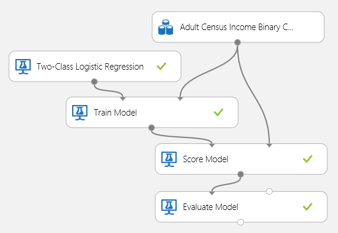
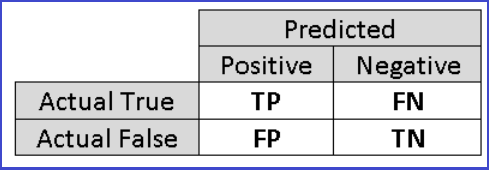

<properties 
    pageTitle="評估電腦學習模型效能 |Microsoft Azure" 
    description="說明如何評估 Azure 電腦學習模型效能。" 
    services="machine-learning"
    documentationCenter="" 
    authors="garyericson" 
    manager="jhubbard" 
    editor="cgronlun"/>

<tags 
    ms.service="machine-learning" 
    ms.workload="data-services" 
    ms.tgt_pltfrm="na" 
    ms.devlang="na" 
    ms.topic="article" 
    ms.date="08/19/2016" 
    ms.author="bradsev;garye" />

# 評估 Azure 電腦學習模型效能的方式

本主題將示範如何評估 Azure 電腦學習 Studio 中的模型的效能，並提供這項工作的可用的度量資訊的簡短說明。 顯示三個常見的受監督的學習案例︰ 

* 迴歸分析
* 二進位分類 
* multiclass 分類

[AZURE.INCLUDE [machine-learning-free-trial](../../includes/machine-learning-free-trial.md)]

評估模型的效能是一種資料科學程序中的核心階段。 表示如何成功計分 （預測） 的資料集已由訓練模型。 

Azure 電腦學習支援透過其主要的電腦學習模組的兩個模型評估︰[評估模型][evaluate-model]和[交叉驗證模型][cross-validate-model]。 這些模組可允許您看到您的模型而言電腦學習和統計資料中常用的指標的數字的執行方式。

##評估與跨驗證##
評估和交叉驗證方式標準測量模型的效能。 這兩個產生評估指標，您可以檢查或比較這些其他模型。

[評估模型][evaluate-model]預期 scored 資料集，以輸入 （或您想要比較的 2 的不同模型效能的大小寫的 2）。 這表示您需要進行訓練的建議使用[訓練模型]模型[train-model]模組，並使用[分數模型]某些資料集預測[score-model]模組，您可以評估結果之前。 評估是根據 scored 以及，則為 true 的標籤，都是由[分數模型]輸出標籤/機率[score-model]模組。

或者，您可以使用跨驗證執行訓練分數評估作業 （10 動作） 的數字會自動在不同的輸入資料的子集。 輸入的資料分割成 10 的組件，其中一個保留以進行測試，與其他 9 訓練課程。 10 次重複此程序和平均評估指標。 如此有助於判斷模型想一般化至新的資料集的程度。 [跨驗證模型][cross-validate-model]模組會使用中的非專業的模型和部分標記的資料集，並將輸出的每個 10 的動作，除了平均結果評估結果。

在下列區段中，我們會建立簡單的迴歸與分類模型，並評估其效能，使用兩個[評估模型][evaluate-model]和[交叉驗證模型][cross-validate-model]模組。

##評估迴歸模型##
假設我們想要預測的汽車價格，使用部分功能，例如維度、 威力、 引擎規格等等。 這是標準的迴歸問題，目標變數 （*price*） 所在的連續數字的值。 我們可以容納的簡單的線性迴歸模型，已知功能值的特定汽車，可以預測的汽車的價格。 此迴歸模型可以用於分數我們訓練相同的資料集。 就可以針對您所有的汽車預測的價格，我們就可以查看多少預測與不符合實際價格平均來評估模型的效能。 若要描繪出這種情況，我們會使用*汽車價格資料 (Raw) 資料集*可用 Azure 電腦學習 Studio 中的 [**儲存資料集**] 區段中。
 
###建立實驗###
新增下列模組至 Azure 電腦學習 Studio 中的工作區︰

- 汽車價格資料 (Raw)
- [線性迴歸][linear-regression]
- [訓練模型][train-model]
- [成績模型][score-model]
- [評估模型][evaluate-model]

連線的連接埠，如下所示圖 1，並設定[訓練模型]的 [標籤] 資料行[train-model]*價格*的模組。
 

圖 1。 評估迴歸模型。

###透過檢查評估結果###
執行之後實驗，您可以按一下[評估模型]的輸出連接埠[evaluate-model]模組，並選取*視覺效果*，以查看評估結果。 可用的迴歸模型評估度量︰*意義絕對錯誤*、*根意義絕對錯誤*、*相對絕對錯誤*、*相對平方錯誤*及*係數的決策*。

字詞的 「 錯誤 」 以下代表預測的值，則為 true 的值之間的差異。 絕對值或此差異的平方通常計算所有執行個體，擷取錯誤的總大小為預測與，則為 true 的值之間的差異可能是負數，在某些情況下。 錯誤指標測量而言，則為 true 的值從預測平均數差的迴歸模型的預測效能。 較低的錯誤值代表模型是更精確中進行預測。 模型完全符合資料的 0 表示整體錯誤度量資訊。

決定係數，也就是也稱為 R 平方，同時也是測量模型資料的搭配程度的標準的方式。 它可能會解讀為說明模型的變化的比例。 較高的比例會更好，如此一來，其中 1 會指出完美最適大小。
 

圖 2。 線性迴歸評估指標。

###使用跨驗證###
如先前所述，您可以執行重複的訓練、 分數和評估自動使用[跨驗證模型][cross-validate-model]模組。 您只需要在此情況下是資料集、 非專業的模型，以及[跨驗證模型][cross-validate-model]模組 （請參閱下圖）。 請注意，您需要設定*價格*[交叉驗證模型]中的 [標籤] 資料[cross-validate-model]模組的屬性。

圖 3。 跨驗證迴歸模型。

執行之後實驗，您可以檢查評估結果[交叉驗證模型]的右輸出連接埠上的 [[cross-validate-model]模組。 這會提供詳細的檢視指標的每個反覆運算 （摺疊），以及每個指標 (圖 4) 的平均的結果。
 

圖 4。 迴歸模型的跨驗證結果。

##評估二進位分類模型##
二進位分類案例中，在目標變數有只有兩個可能的結果，例如: {0、 1} 或 {false，則為 true}，{負數，正數}。 假設您有一些限制級員工的資料集人口年資變數和，要求您預測收入層級，值的二進位變數 {「 < = 50 K 「，」 > 50 K 」}。 換句話說，負數的類別代表進行小於或等於 50 K 每年的員工，而正類別代表所有其他員工。 與迴歸案例中，我們會訓練模型、 分數部分資料，並評估結果。 主要差異是的指標 Azure 電腦學習計算和輸出的選擇。 若要描繪出收入層級的預測狀況，我們將使用[限制級](http://archive.ics.uci.edu/ml/datasets/Adult)的資料集，來建立 Azure 電腦學習實驗，並在評估兩個類別後勤迴歸模型，常用的二進位器的效能。

###建立實驗###
新增下列模組至 Azure 電腦學習 Studio 中的工作區︰

- 限制級人口普查收入二進位分類資料集
- [兩個類別後勤迴歸][two-class-logistic-regression]
- [訓練模型][train-model]
- [成績模型][score-model]
- [評估模型][evaluate-model]

連線的連接埠，如下所示圖 5，並設定[訓練模型]的 [標籤] 資料行[train-model]*收入*模組。

圖 5。 評估二進位分類模型。

###透過檢查評估結果###
執行之後實驗，您可以按一下[評估模型]的輸出連接埠[evaluate-model]模組，並選取*視覺效果*，以查看評估結果 (圖 7)。 可用的二進位分類模型評估度量︰*正確性*、*精確度*、*回收*、 *F1 分數*，與*AUC*。 此外，模組輸出混淆矩陣顯示正數，則為 true、 false 負片、 誤判，true 否定，以及*巨鵬*、*精確度/回收*，以及*拿起*曲線的數目。

正確性是正確的分類的執行個體的比例。 通常是您查看評估類別器時的第一個公制。 不過，當測試資料是不對稱 （在大部分的執行個體隸屬於其中一個類別），或其他想要在其中一個類別的效能，正確性不是真正擷取的類別器。 在收入層級的分類案例中，假設您正在測試一些資料的執行個體 99%代表贏得小於或等於 50 K 每一年的人員的位置上。 可以預測類別來達成 0.99 的正確性 」 < = 50 K 」 的所有例項。 類別器在此情況下會做好整體，但是實際上，無法正確分類任何 high-income 個人 （1%)。

因此，還是有幫助來擷取其他方面的評估的其他指標的計算項目。 之前將這類指標的詳細資料，請務必瞭解二進位分類評估混淆矩陣。 為正值或負值 2 的可能值，我們通常是指可以採取類別標籤集的訓練課程。 類別器正確預測負值執行個體稱為 true 測 (TP) 與 true 否定 (TN)，分別。 同樣地，不正確的方式分類的執行個體稱為誤判 (FP) 與 false 否定 (FN)。 混淆矩陣是直接表格顯示每個 4 分類] 底下的執行個體數目。 Azure 電腦學習自動決定哪一項資料集內的兩個類別是正數的類別。 如果類別標籤是布林值或整數，「 true' 或 '1' 標記的執行個體會指派正數的類別。 如果標籤是字串，收入資料集的情況下，與標籤依字母順序排序，然後的第一層選擇第二層級時正類別是負數的類別。

圖 6。 二進位分類混淆矩陣。

回到收入分類問題，我們會想要問協助我們的幾個評估問題了解使用的類別器的效能。 非常自然問題是: 「 出誰模型預測到會以年收益的每個人 > 50 K (TP + FP) 多少歸類正確 (TP) 嗎？ 」 可以回答這個問題，查看**精確度**的模型，這是正確分類的正數的比例︰ TP/(TP+FP)。 其他常見的問題是 「 不在所有高贏得收入的員工 > 50 k (TP + FN) 多少未類別器分類正確 (TP) 」。 這是實際**回收**，或為 true 的正數工資率︰ TP/(TP+FN) 類別器。 您可能會發現有精確度和回收明顯取捨。 例如指定以往對稱資料集，預測大多正執行個體、 分類器想高的回收，但是而低的精確度，最多的負數的執行個體就會被歸類大量誤判的結果。 若要查看的方式下列兩個度量視情況而定，您可以按一下 「 精確度/回收 ' 曲線在評估結果輸出頁面 （左上角的 [圖 7 的組件）。

圖 7。 二進位分類評估結果。

經常使用的其他相關的公制是**F1 分數**，會同時精確度和回收考量。 它是這些 2 計量調和平均數，因此計算︰ F1 = 2 （精確度 x 回收） / （精確度 + 回收）。 F1 分數摘要單一數字，評估的好方法，但一定是好的做法，看精確度和回收放在一起，進一步了解類別器的行為方式。

此外，其中一個可以檢查與**收件者作業系統特性 （巨鵬）**曲線和對應**區域下曲線 (AUC)**值的 false 正率，則為 true 的正數工資率。 深入瞭解此曲線的左上角，即可更好的分類器效能是 （的最大化，則為 true 的正數工資率時最小化 false 正數的工資率）。 曲線的圖表，從似乎經常犯靠近隨機猜測的預測的相關性結果對角線接近。

###使用交叉驗證###
迴歸範例中，我們可以執行交叉驗證重複訓練，分數，並自動評估不同的資料子集。 同樣地，我們可以使用[交叉驗證模型][cross-validate-model]模組、 非專業後勤迴歸模型與資料集。 [標籤] 資料行必須設定為 [[跨驗證模型]中的*收入*[cross-validate-model]模組的屬性。 執行實驗，並按一下[交叉驗證模型]的右輸出連接埠後[cross-validate-model]模組，我們可以平均值和標準差，每個，此外看到每個摺疊] 的二進位分類度量值。 
 

圖 8。 跨驗證二進位分類模型。

圖 9。 二進位類別器交叉驗證結果。

##評估 Multiclass 分類模型##
在這項實驗中，我們將使用常用[虹彩](http://archive.ics.uci.edu/ml/datasets/Iris "虹彩")資料集含有 3 個不同類型 （類別） 虹彩植物的執行個體。 有 4 功能值 （sepal 長度或寬度和瓣花瓣長度或寬度） 每個執行個體。 在上一個實驗中，我們訓練並測試使用相同的資料集的模型。 在這裡，我們將使用[分割的資料][split]建立 2 的資料子集訓練第一天，和分數，評估第二個模組。 虹彩資料集同等上[UCI 電腦學習存放庫](http://archive.ics.uci.edu/ml/index.html)中，而且可以使用[匯入資料]下載[import-data]模組。

###建立實驗###
新增下列模組至 Azure 電腦學習 Studio 中的工作區︰

- [匯入資料][import-data]
- [Multiclass 決策樹系][multiclass-decision-forest]
- [分割的資料][split]
- [訓練模型][train-model]
- [成績模型][score-model]
- [評估模型][evaluate-model]

連線的連接埠，如下所示，在 [圖 10。

設定標籤的欄索引[訓練模型][train-model]模組至 5。 資料集有沒有標題列，但我們知道，類別標籤是在第五欄。

按一下 [[匯入資料][import-data]模組並設定 [*資料來源*] 屬性，以*透過 HTTP 的 Web URL*，以及 http://archive.ics.uci.edu/ml/machine-learning-databases/iris/iris.data 的*URL* 。

設定用於[分割的資料]中的訓練課程的執行個體的[split]模組 (例如 0.7)。
 

圖 10。 評估 Multiclass 類別器

###透過檢查評估結果###
執行實驗，並按一下[評估模型]的輸出連接埠[evaluate-model]。 評估結果會顯示在表單中的混淆矩陣，在此情況下。 矩陣會顯示實際與 3 的所有類別的預測執行個體。
 

圖 11。 Multiclass 分類評估結果。

###使用交叉驗證###
如先前所述，您可以執行重複的訓練、 分數和評估自動使用[跨驗證模型][cross-validate-model]模組。 您所需資料集、 非專業的模型，以及[跨驗證模型][cross-validate-model]模組 （請參閱下圖）。 您必須重新設定[跨驗證模型]的 [標籤] 資料行[cross-validate-model]模組 （欄索引 5 在此例）。 執行實驗，並按一下向右輸出的[交叉驗證模型]的連接埠後[cross-validate-model]，您可以檢查每個式摺卡]，以及平均值和標準差的度量值。 在此顯示指標類似討論二進位分類大小寫。 不過，請注意，，在 multiclass 分類，如不有任何整體是正值或負值類別運算的則為 true 的正數否定與 false 的正數否定完成，來計算每個類別基礎。 例如，計算精確度或回收的 「 虹彩 setosa 」 類別時，則假設這是正數類別及所有其他人為負數。
 

圖 12。 跨驗證 Multiclass 分類模型。

圖 13。 跨驗證模型的結果 Multiclass 分類。

<!-- Module References -->
[cross-validate-model]: https://msdn.microsoft.com/library/azure/75fb875d-6b86-4d46-8bcc-74261ade5826/
[evaluate-model]: https://msdn.microsoft.com/library/azure/927d65ac-3b50-4694-9903-20f6c1672089/
[linear-regression]: https://msdn.microsoft.com/library/azure/31960a6f-789b-4cf7-88d6-2e1152c0bd1a/
[multiclass-decision-forest]: https://msdn.microsoft.com/library/azure/5e70108d-2e44-45d9-86e8-94f37c68fe86/
[import-data]: https://msdn.microsoft.com/library/azure/4e1b0fe6-aded-4b3f-a36f-39b8862b9004/
[score-model]: https://msdn.microsoft.com/library/azure/401b4f92-e724-4d5a-be81-d5b0ff9bdb33/
[split]: https://msdn.microsoft.com/library/azure/70530644-c97a-4ab6-85f7-88bf30a8be5f/
[train-model]: https://msdn.microsoft.com/library/azure/5cc7053e-aa30-450d-96c0-dae4be720977/
[two-class-logistic-regression]: https://msdn.microsoft.com/library/azure/b0fd7660-eeed-43c5-9487-20d9cc79ed5d/
 
