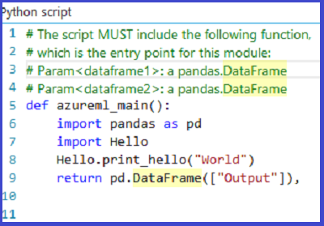
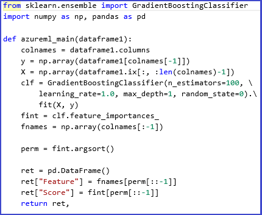

<properties 
    pageTitle="執行 Python 電腦學習指令碼 |Microsoft Azure" 
    description="大綱設計原則支援 Python 指令碼 Azure 電腦學習和基本的使用狀況、 功能和限制。" 
    keywords="python 電腦學習，熊、 python 熊 python 指令碼執行 python 指令碼"
    services="machine-learning"
    documentationCenter="" 
    authors="bradsev" 
    manager="jhubbard" 
    editor="cgronlun"/>

<tags 
    ms.service="machine-learning" 
    ms.workload="data-services" 
    ms.tgt_pltfrm="na" 
    ms.devlang="na" 
    ms.topic="article" 
    ms.date="09/12/2016" 
    ms.author="bradsev" />

# Azure 電腦學習 Studio 中執行 Python 電腦學習指令碼

本主題說明基礎 Python 指令碼中 Azure 電腦學習目前支援的設計原則。 也大綱的主要功能，包括支援匯入現有的程式碼，匯出視覺效果，最後，討論的一些限制和進行中的工作。

[Python](https://www.python.org/)是不可或缺的工具中的多個資料科學家工具箱的利器。 有︰

-  典雅及精簡語法， 
-  跨平台支援 
-  大量功能強大的文件庫，和 
-  成熟開發工具。 

正在 Python 所有階段通常在電腦學習模型中使用工作流程中使用，從資料內嵌和處理，功能建築與模型訓練課程，然後驗證並部署模型。 

Azure 電腦學習 Studio 支援內嵌 Python 指令碼至學習實驗，並流暢地也能將它們發佈 Microsoft Azure 上的縮放、 operationalized web 服務為電腦的各種不同的組件。

[AZURE.INCLUDE [machine-learning-free-trial](../../includes/machine-learning-free-trial.md)]

## 在電腦學習 Python 指令碼的設計原則
Azure 電腦學習 Studio 中 Python 主要介面是透過[執行 Python 指令碼][execute-python-script]圖 1 的模組。

圖 1。 **執行 Python 指令碼**的模組。

[執行 Python 指令碼][execute-python-script]模組接受最多三個輸入，並產生兩個輸出 （討論下方），就像其 R 普通，[執行 R 指令碼][execute-r-script]模組。 Python 執行的程式碼輸入到 [參數] 方塊，為特殊命名項目點函數呼叫`azureml_main`。 以下是用來執行本單元的金鑰設計原則︰

1.  *必須是慣用的 Python 使用者。* 大多數的 Python 使用者，將可執行陳述式許多放在最上層的模組中是很少，以便為函數內模組，其程式碼因素。 如此一來，指令碼] 方塊也會特殊命名的 Python 函數，而不是只陳述式的順序。 公開函數中的物件是標準的 Python 文件庫類型，例如[熊](http://pandas.pydata.org/)資料外框] 和 [ [NumPy](http://www.numpy.org/)陣列。
2.  *必須具備本機之間高畫質與雲端執行。* 用來執行 Python 程式碼後端為基礎[Anaconda](https://store.continuum.io/cshop/anaconda/) 2.1，常用跨平台科學 Python 分配。 它隨附接近最常見的 Python 套件的 200。 因此，資料科學家可以偵錯並限定在其本機 Azure 電腦學習相容 Anaconda 環境其程式碼。 然後使用現有的開發環境，例如[IPython](http://ipython.org/)筆記本或[Visual Studio Python 工具](http://aka.ms/ptvs)高放心執行 Azure 電腦學習實驗的一部分。 進一步，`azureml_main`進入點香草 Python 函數，並可以撰寫沒有 Azure 電腦學習特定的程式碼或 SDK 安裝。
3.  *必須與其他 Azure 電腦學習模組完美可撰寫。* [執行 Python 指令碼][execute-python-script]模組接受，輸入和輸出，為標準 Azure 電腦學習資料集。 基礎架構無障礙並有效率地等 Azure 電腦學習及 Python 執行階段 （支援功能，例如缺少值）。 Python 因此用於現有 Azure 電腦學習工作流程，包括撥入 R 和 SQLite 搭配使用。 因此，其中一個可以 envisage 工作流程的︰
  * 使用預先處理資料，並清除、 Python 和熊 
  * SQL 轉換，表單功能加入多個資料集至摘要資料 
  * 訓練模型中 Azure 電腦學習，使用演算法的大量的集合， 
  * 評估，和後續處理結果使用。

## 基本的使用狀況分析藍本中電腦學習 Python 指令碼
在此區段中，我們問卷的部分的[執行 Python 指令碼]基本使用[execute-python-script]模組。
如先前所述，為熊資料框架公開 Python 模組的任何輸入。 Python 熊，以及如何使用它有效率地處理資料的詳細資訊可以找到中*進行資料分析 Python* (O'Reilly，2012年)，以西部 McKinney。 函數必須傳回封裝 Python[順序](https://docs.python.org/2/c-api/sequence.html)例如 tuple、] 清單中或 NumPy 陣列在單一熊資料框架。 此序列的第一個項目，然後會傳回模組的第一個輸出連接埠。 圖 2] 中顯示此配置。

圖 2。 對應的輸入參數的連接埠，並返回輸出連接埠的值。

更詳細的方式輸入的連接埠對應至參數的語意`azureml_main`函數會顯示在表格 1:

資料表 1。 函數參數輸入連接埠的對應。

輸入的連接埠和函數參數之間的對應是位置。 第一個連線輸入連接埠] 已對應至函數的第一個參數，第二個輸入的值 （如果連線）] 已對應至第二個參數的函數。

## 輸入與輸出類型的翻譯
如先前所述，Azure 電腦學習中輸入的資料集會轉換為圖文框中熊和輸出資料框架會轉換回 Azure 電腦學習資料集的資料中。 執行下列轉換︰

1.  字串和數字的資料行轉換成-是而遺失資料集內的值會轉換成熊 'NA 」 值。 相同的轉換會發生下列情況回傳 （熊 NA 值會轉換成 Azure 電腦學習缺少值）。
2.  索引向量熊中的不支援的 Azure 電腦學習。 Python 函數中的所有輸入的資料框架一律會有 64 位元數字索引從 0 到減 1 的資料列數目。 
3.  重複的資料行名稱並不是字串的資料行名稱，不能有 azure 電腦學習資料集。 如果輸出資料框架包含非數值的資料行，架構呼叫`str`資料行名稱。 同樣地，以確保是唯一的名稱會自動受損任何重複的資料行名稱。 後置字元 (2) 會新增至第一個複製] (3) 至第二個重複，等等。

## 另尋高就 Python 指令碼
任何[執行 Python 指令碼][execute-python-script]發佈為 web 服務時，會呼叫計分的實驗中使用的模組。 例如，圖 3 顯示計分實驗，其中包含要評估的單一 Python 運算式的程式碼。 

圖 3。 Web 服務為 Python 運算式評估。

從這個實驗建立 web 服務會採用做為輸入 Python 運算式 （做為字串），將其傳送至 Python 手語翻譯，傳回資料表，同時包含運算式及計算的結果。

## 匯入現有的 Python 指令碼模組
將現有的 Python 指令碼合併到 Azure 電腦學習實驗是常見的多個資料科學家使用-案例。 而非串連，並將所有的程式碼貼到單一指令碼] 方塊中，[執行 Python 指令碼][execute-python-script]模組接受 zip 檔案中含有 Python 模組可以連線到第三個輸入連接埠。 檔案然後解壓縮執行架構在執行階段並將內容新增至文件庫的路徑 Python 手語翻譯。 `azureml_main`函數可以再匯入這些模組直接進入點。

例如，請考慮檔案 Hello.py 包含簡單的 「 Hello，World 」 函數。

圖 4。 使用者定義的函數。

接下來，我們會建立包含 Hello.py Hello.zip 檔案︰

圖 5。 Zip 檔案包含使用者定義 Python 程式碼。

然後上, 傳此以資料集至 Azure 電腦學習 Studio。 建立並執行簡單的實驗中使用的 Python 程式碼 Hello.zip 檔案附加在執行 Python 指令碼，第三個輸入連接埠本圖所示。

圖 6。 另存為 zip 檔案上傳的使用者定義 Python 程式碼範例體驗。

在模組輸出顯示 zip 檔案已 unpackaged 及函數`print_hello`已確實執行。
 

 
圖 7。 [執行 Python 指令碼]內的使用中的使用者定義函數[execute-python-script]模組。

## 使用視覺效果
在瀏覽器上使用 MatplotLib 的視覺化可以建立的繪圖可以傳回之[執行 Python 指令碼][execute-python-script]。 但繪圖不會自動重新導向至圖像和使用。因此，使用者必須明確儲存任何繪圖 PNG 檔案時要傳回回到 Azure 電腦學習。 

若要從 MatplotLib 產生圖像，您必須完成下列程序︰

* 切換至 「 附加 」 的後端，從預設 Qt 為基礎的產生器 
* 建立新的圖表物件 
* 取得座標軸，並將其產生所有繪圖 
* 將圖表儲存為 PNG 檔案 

此程序中建立散佈圖繪圖矩陣中熊使用 scatter_matrix 函數下列圖 8 說明。
 

圖 8。 將 MatplotLib 圖表儲存為圖像。

圖 9 顯示使用回到先前顯示的指令碼的實驗繪製透過第二個輸出連接埠。

 
     
 

圖 9。 視覺化 Python 程式碼所產生的繪圖。

可傳回多個圖表儲存到不同的圖像，Azure 電腦學習 runtime 挑選所有圖像，並且串連視覺效果。

## 進階的範例
安裝在 Azure 電腦學習 Anaconda 環境包含常見的套件，例如 NumPy、 SciPy，及 Scikits 瞭解以及這些有效可一般電腦學習管道的郵件中的各種資料處理任務。 作為範例，以下試驗和指令碼說明中以計算資料集的功能重要性分數 Scikits 瞭解 ensemble 學習的使用方式。 成績可用來執行受監督的功能之前裝入另一台電腦學習模型的選取範圍。

Python 函數來計算的重要性分數及順序它為基礎的功能如下所示︰

圖 10。 Rank 功能函數的分數。
 以下試驗然後計算，並傳回 「 Pima 印度 Diabetes 」 中的資料集 Azure 電腦學習重要性分數的功能︰

    
    
圖 11。 嘗試 Pima 印度 Diabetes 資料集中的排名功能。

## 限制 
[執行 Python 指令碼][execute-python-script]目前有以下的限制︰

1.  *沙箱化執行。* Python 執行階段目前沙箱化，如此一來，不允許存取網路或本機檔案系統中持續的方式。 儲存在本機的所有檔案都隔離，並刪除後模組完成。 Python 程式碼無法存取其在執行，在目前的目錄及其子目錄的例外狀況的電腦上大部分的目錄。
2.  *缺少的複雜的開發和偵錯支援。* Python 模組目前不支援 IDE 功能，例如 intellisense 偵錯。 此外，如果模組無法在執行階段，完整 Python 堆疊追蹤可供使用，但必須模組輸出記錄檔中的檢視。 目前建議開發和偵錯其 Python 指令碼，例如 IPython 環境，然後再匯入到模組的程式碼。
3.  *單一資料框架成果。* 若要傳回單一資料圖文框做為輸出只允許 Python 進入點。 您無法目前可能返回任意 Python 物件，例如訓練模型直接回 Azure 電腦學習執行階段。 要[執行 R 指令碼][execute-r-script]、 擁有相同的限制，不過可能有許多情況下 pickle 物件將位元組陣列，然後傳回的資料範圍的內部。
4.  *無法將自訂 Python 安裝*。 目前，若要新增自訂 Python 模組的唯一方法是透過稍早所述的 zip 檔案機制。 雖然這是可行的小型模組，則麻煩大型模組 （特別是原生 dll） 或大量的模組。 

##結論
[執行 Python 指令碼][execute-python-script]模組，可讓資料科學家併入中 Azure 電腦學習的雲端裝載於電腦學習工作流程中的現有 Python 程式碼，並流暢地 operationalize 其做為 web 服務的一部分。 Python 指令碼模組自然可與其他模組中 Azure 電腦學習，可用來測試處理、 以功能擷取，評估和結果的後續處理從資料瀏覽工作的範圍。 執行所使用的後端執行階段根據 Anaconda，完善測試和常用 Python 分配。 這可以方便您板現有的程式碼資產到雲端。

我們預期[執行 Python 指令碼]提供的其他功能[execute-python-script]模組，例如訓練與 operationalize Python 的模型，並新增較好的支援開發和 Azure 電腦學習 Studio 中的程式碼偵錯的能力。

## 後續步驟

如需詳細資訊，請參閱[Python 開發人員中心](/develop/python/)。

<!-- Module References -->
[execute-python-script]: https://msdn.microsoft.com/library/azure/cdb56f95-7f4c-404d-bde7-5bb972e6f232/
[execute-r-script]: https://msdn.microsoft.com/library/azure/30806023-392b-42e0-94d6-6b775a6e0fd5/
