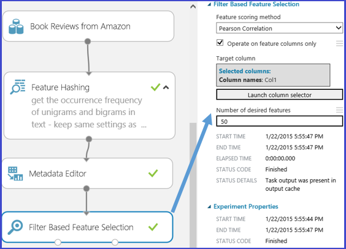

<properties
    pageTitle="工程和 Azure 電腦學習中的選取範圍的功能 |Microsoft Azure"
    description="說明的功能選取項目和功能工程，並提供其角色的電腦學習加強資料程序中的範例。"
    services="machine-learning"
    documentationCenter=""
    authors="bradsev"
    manager="jhubbard"
    editor="cgronlun"/>

<tags
    ms.service="machine-learning"
    ms.workload="data-services"
    ms.tgt_pltfrm="na"
    ms.devlang="na"
    ms.topic="article"
    ms.date="09/12/2016"
    ms.author="zhangya;bradsev" />

# 工程和 Azure 電腦學習中的選取範圍的功能

本主題說明的功能工程和功能電腦學習加強資料程序中的選取範圍。 它會說明這些處理程序牽涉使用 Azure 電腦學習 Studio 所提供的範例。

[AZURE.INCLUDE [machine-learning-free-trial](../../includes/machine-learning-free-trial.md)]

電腦學習的訓練資料經常增強型的選取範圍或擷取的功能收集的原始資料。 學習如何分類的手寫字元圖像的內容中進行反向工程功能的範例是使用元密度地圖建構從原始元分佈資料。 地圖可以協助您找出字元的邊緣效率原始的通訊群組。

工程和所選的功能會增加效率的訓練課程的程序，以嘗試擷取資料中所包含的重要資訊。 他們也改善 power，這些模型對於分類輸入的資料與其他強行預測感興趣的結果。 功能工程和選取範圍也可以讓更多運算容易處理學習合併。 它會以增強與然後減少的校正或訓練模型所需的功能。 以數學方式讀出]，選取訓練模型的功能是變數的一組最小獨立說明資料中的模式和成功預測結果。

工程和選取範圍的功能是一組件的較大的程序，通常包含四個步驟︰

* 資料收集
* 加強資料
* 模型建築
* 後續處理

工程和選擇構成電腦學習的資料增強步驟。 此程序的三個層面可能進行區分我們的用途︰

* **資料預先處理**︰ 確保收集的資料會清除與一致性嘗試此程序。 其包含工作，例如整合多個資料集處理遺失資料、 處理不一致的資料，並將資料類型轉換。
* **工程的功能**︰ 從現有的原始資料功能建立其他的相關功能，以增加至學習演算法的預測 power，嘗試此程序。
* **功能選項**︰ 此程序會選取以減少訓練問題的維度的原始資料功能鍵子集。

本主題只會說明功能工程和資料增強程序] 功能選取特性。 在 [資料] 前置處理步驟的詳細資訊，請參閱[預先處理 Azure 電腦學習 Studio 中的資料](https://azure.microsoft.com/documentation/videos/preprocessing-data-in-azure-ml-studio/)。

## 建立功能從您的資料-工程的功能

矩陣組成的範例 （記錄或儲存在列中的觀察值），每一個都有一組的功能變數的儲存在欄中包含訓練資料。 指定實驗設計中的功能都必須描述資料中的模式。 雖然許多原始資料欄位可直接納入用來訓練模型的所選的功能集，其他工程的功能通常需要建構從產生增強型的訓練資料集的原始資料中的功能。

當訓練模型時，提升資料集建立哪一類的功能？ 工程增強訓練課程的功能，可提供更佳的差異資料中的模式的資訊。 您希望提供其他資訊擷取不明確的新功能或輕鬆明顯原始的或現有的功能集，但此程序圖案的項目。 音效和生產力的決策通常需要一些網域專業知識。

開始使用 Azure 電腦學習，時最簡單的方法具體掌握此程序，使用電腦學習 Studio 中所提供的範例。 此處所提供兩個範例︰

* 在受監督項實驗中稱為目標值的迴歸範例 （[預測的 safetystockllevel 租金數](http://gallery.cortanaintelligence.com/Experiment/Regression-Demand-estimation-4)）
* 使用[功能雜湊]文字採礦分類範例[feature-hashing]

### 範例 1︰ 新增迴歸模型暫時功能 ###

若要示範如何工程迴歸分析任務的功能，讓我們來使用實驗 」 Demand 預測的自行車 」 Azure 電腦學習 Studio 中。 這項實驗的目標是預測的 bikes，也就是日] 或小時在特定月份中的 safetystockllevel 租金數目。 原始的輸入資料作為資料集**Safetystockllevel 租賃 UCI 資料集**。

此資料集根據會保留在 [美國華盛頓州 DC safetystockllevel 租賃網路首都 Bikeshare 公司的實際資料。 資料集，一天的特定小時內表示的 safetystockllevel 租金數，從 2012，2011年，其中包含 17379 列和欄 17。 原始的功能集包含天氣條件的溫度、 濕度 （風速）]，然後輸入每日 （假日或 weekday）。 預測欄位是**計數通知:**，在特定的小時內代表的 safetystockllevel 租金及的範圍是介於 1 到 977 計數。

若要建構更有效率訓練資料中的功能，四個迴歸模型內建使用相同的演算法，但四個不同的訓練資料集。 四個資料集代表相同的原始輸入的資料，但功能的遞增數字設定。 這些功能會分組為四種類別︰

1. A = 天氣 + 假日 + weekday + 週末功能預測的日期
2. B = 已在每一個先前 12 小時出租的自行車的數字
3. C = 已出租在每一個在同一個小時前 12 天的自行車的數字
4. D = 自行車的已出租在每一個在同一個小時] 及 [的同一天之前 12 週數

除了功能設定 A 中的原始的原始資料已存在，其他三個功能組會建立透過工程程序的功能。 功能設定 B 擷取 bikes 最近的需求。 功能設定在特定的小時 C 擷取自行車的要求。 功能在特定的小時] 及 [一週的特定日期設定 bikes D 擷取需求。 四個訓練資料集的各個包含功能集 A、 A + B、 A + B + C，以及 A + B + C + D，分別。

Azure 電腦學習實驗中，下列四個訓練資料集的正確透過預先處理輸入資料集的四個分支。 除了最左邊的分支，這些分支都包含[執行 R 指令碼][execute-r-script]分別建構及附加至匯入的資料集的一組衍生功能 （功能設定 B、 C 和 D） 的模組。 下圖示範用來建立第二個左分支中的功能集 B R 指令碼。

下表摘要列出的四個模型效能結果的比較。 獲得最佳的結果會顯示由功能 A + B + C。 請注意，訓練資料中包含其他的功能集，將會減少錯誤工資率。 這會驗證我們 presumption B 和 C 的功能集提供的迴歸分析任務的其他相關資訊。 新增 D 功能集似乎不提供任何其他減少錯誤工資率。

### 範例 2︰ 在文字採礦建立功能  

功能工程廣泛會套用文字採礦，例如 [文件分類和舉動分析相關的基本工作。 例如，若您想要分類成多個類別的文件，一般的假設是單字或片語包含在一個文件類別較不可能會發生在另一個文件的類別。 換句話說，單字或片語的通訊群組的頻率 is able to 特性不同的文件的類別。 文字採礦應用程式中，若要建立包含單字或片語的頻率，因為文字內容的各個部分通常作為輸入資料的功能需要工程程序的功能。

若要完成這項工作，稱為*功能雜湊*技術會套用至有效率地變成索引中的任意文字功能。 而非特定的索引，此方法的功能套用雜湊函數的功能及為索引中直接使用其雜湊值關聯每個文字功能 （單字或片語）。

Azure 電腦學習，則為[功能雜湊][feature-hashing]模組，可建立這些單字或片語的功能。 下圖顯示使用本單元的範例。 輸入的資料集包含兩個資料行︰ 活頁簿評等介於 1 到 5 和實際檢閱的內容。 此[功能雜湊]目標[feature-hashing]模組是擷取顯示相對應的單字或片語內特定活頁簿檢閱的項目頻率的新功能。 若要使用此模組，您必須完成下列步驟︰

1. 選取包含輸入的文字 (在此範例中的**第 2 欄**) 的資料行。
2. 將*Hashing bitsize*為 8，這表示 2 ^8 = 256 建立功能。 以 256 索引然後雜湊的單字或片語，在文字]。 參數*Hashing bitsize*範圍是介於 1 到 31。 如果將參數設定為較大的數字，單字或片語較不可能會被雜湊至相同的索引。
3. 設定參數*N 克*為 2。 這會擷取 unigrams （每個單字的功能） 和 bigrams （一對相鄰文字功能） 的項目頻率所輸入的文字。 參數*N 克*範圍從 0 到 10，亦即指出連續的文字功能中所包含的最大數目。  

下圖顯示這些新功能的外觀。

## 從您的資料，功能選取範圍的篩選功能  ##

*功能選項*是通常會套用至訓練資料集的預測模型工作，例如分類或迴歸工作的建築的程序。 目標是要從原始資料集使用一組最小的功能來代表資料中的變異數的最大量減少其尺寸選取功能的子集合。 此功能的子集包含只包含訓練模型功能。 功能選項有兩個主要的目的︰

* 功能選項通常會增加分類正確性消除無關、 多餘或高度相關功能。
* 功能選項，數目會減少功能，讓模型訓練程序更有效率。 這是的例如支援向量機器訓練成本的學習特別重要。

雖然功能選擇搜尋可減少中用來訓練模型的資料集的功能，但不通常就是依字詞*維度縮減。* 功能選取方法會擷取原始的功能，在資料的子集，而不變更其。  維度縮減方法採用工程可以轉換的原始的功能，因此加以修改的功能。 維度縮減方法包括本金元件分析、 標準的相互關聯分析及單數值分解。

一個廣泛套用的類別，功能選取範圍中的方法受監督的內容是篩選依據] 功能選取範圍。 評估每一個功能與目標屬性之間的關聯性，這些方法套用統計的量值，以將分數指派給每個功能。 然後，您可以使用來設定或排除特定功能的臨界值的成績排名功能。 使用這些方法統計量值的範例包含 Pearson 相互關聯、 相互的詳細資訊及卡方測試。

Azure 電腦學習 Studio 提供功能選擇模組。 下圖所示，這些模組包含[篩選型功能選擇][filter-based-feature-selection]及[Fisher 線性判別分析][fisher-linear-discriminant-analysis]。

例如，使用 [[篩選型功能選擇][filter-based-feature-selection]先前的大綱文字採礦範例的模組。 假設您想要透過[功能雜湊]建立一組 256 功能之後建立迴歸模型[feature-hashing]模組和回應變數是**欄 1** ，並代表活頁簿檢閱評等範圍從 1 到 5。 將**功能計分方法**為**Pearson 相互關聯**、**目標資料行****欄 1**，而**想要的功能數目**， **50**。 模組[篩選型功能選擇][filter-based-feature-selection]然後產生包含 50 功能與目標屬性**欄 1**的資料集。 下圖顯示這項實驗中，輸入的參數的流程。

下圖顯示結果的資料集。 每個功能會根據 Pearson 間的關聯性它本身和目標屬性**欄 1**計分。 使用上方的分數功能會保留。

![篩選依據] 功能選取資料集](./media/machine-learning-feature-selection-and-engineering/feature-Selection2.png)

下圖顯示所選的功能的相對應的分數。

套用此[篩選型功能選擇][filter-based-feature-selection]模組，50 的 256，因為它們最相互關聯到變數**欄 1**根據計分方法**Pearson 相互關聯**的目標的功能，已選取功能。

## 結束時
功能工程和功能選取兩個步驟經常執行時建立電腦學習模型準備訓練資料。 一般而言，功能工程會先套用至產生其他功能，而且再功能選取步驟以利消除無關、 多餘或高度的關聯的功能。

不一定一定執行功能工程或功能的選項。 是否需要取決於您擁有或收集的資料與您挑選，請演算法實驗的目標。

<!-- Module References -->
[execute-r-script]: https://msdn.microsoft.com/library/azure/30806023-392b-42e0-94d6-6b775a6e0fd5/
[feature-hashing]: https://msdn.microsoft.com/library/azure/c9a82660-2d9c-411d-8122-4d9e0b3ce92a/
[filter-based-feature-selection]: https://msdn.microsoft.com/library/azure/918b356b-045c-412b-aa12-94a1d2dad90f/
[fisher-linear-discriminant-analysis]: https://msdn.microsoft.com/library/azure/dcaab0b2-59ca-4bec-bb66-79fd23540080/
