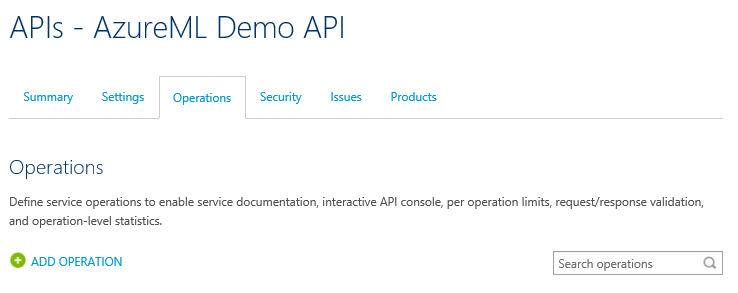

<properties
    pageTitle="瞭解如何管理 AzureML web 服務使用 API 管理 |Microsoft Azure"
    description="顯示如何管理 AzureML web 服務使用 API 管理指南。"
    keywords="電腦學習，api 管理"
    services="machine-learning"
    documentationCenter=""
    authors="roalexan"
    manager="jhubbard"
    editor=""/>

<tags
    ms.service="machine-learning"
    ms.workload="data-services"
    ms.tgt_pltfrm="na"
    ms.devlang="na"
    ms.topic="article"
    ms.date="09/16/2016"
    ms.author="roalexan" />

# 瞭解如何管理 AzureML web 服務使用 API 管理

##概觀

本指南為您示範如何快速開始使用 API 管理管理 AzureML web 服務。

##什麼是 Azure API 管理？

Azure API 管理是 Azure 服務可讓您定義使用者存取權限、 使用節流和儀表板監控來管理您 REST API 結束點。 按一下[這裡](https://azure.microsoft.com/services/api-management/)以取得詳細資料的 Azure API 管理。 按一下[這裡](../api-management/api-management-get-started.md)如何開始使用 Azure API 管理的指南。 此其他指南，本指南為基礎，其中涵蓋更多的主題，包括通知設定、 層價格、 回應處理、 使用者驗證]，建立產品、 開發人員訂閱] 及使用方式 dashboarding。

##什麼是 AzureML？

AzureML 是電腦學習可讓您輕鬆建立、 部署及共用進階的分析解決方案 Azure 服務。 按一下[這裡](https://azure.microsoft.com/services/machine-learning/)取得 AzureML 的詳細資訊。

##必要條件

若要完成本指南，您需要︰

* Azure 帳戶。 如果您沒有安裝 Azure 帳戶，請按一下[這裡](https://azure.microsoft.com/pricing/free-trial/)取得詳細說明如何建立的免費的試用帳戶。
* AzureML 帳戶。 如果您沒有安裝 AzureML 帳戶，請按一下[這裡](https://studio.azureml.net/)取得詳細說明如何建立的免費的試用帳戶。
* 工作區、 服務和 api_key 的部署 web 服務為 AzureML 實驗中。 按一下[這裡](machine-learning-create-experiment.md)如需如何建立 AzureML 實驗的詳細資訊。 按一下[這裡](machine-learning-publish-a-machine-learning-web-service.md)取得如何部署 AzureML 實驗的 web 服務的詳細資訊。 或者，附錄 A 有建立並測試簡單的 AzureML 實驗，並將其部署為 web 服務的相關指示。

##建立 API 管理執行個體

以下是使用 API 管理管理 AzureML web 服務的步驟。 第一次建立服務執行個體。 登入[傳統入口網站](https://manage.windowsazure.com/)，並按一下 [**新增** > **應用程式服務** > **API 管理** > **建立**。

指定唯一的**URL**。 本指南使用**demoazureml** – 您將需要選擇不同的項目。 選擇您要**訂閱**與**地區**服務執行個體。 後進行選取項目，請按一下 [下一步] 按鈕。

**組織名稱**中指定的值。 本指南使用**demoazureml** – 您將需要選擇不同的項目。 在 [**系統管理員的電子郵件**] 欄位中輸入您的電子郵件地址。 此電子郵件地址用於從 API 管理系統的通知。

按一下 [建立您的服務執行個體] 核取方塊。 *需要 30 分鐘，針對要建立新的服務*。

##建立 API

服務執行個體建立後下, 一步是建立 API。 API 由組成的一組可以叫用戶端應用程式的作業。 API 作業是代理到現有的 web 服務。 本指南所建立的 Api 現有 AzureML 給及 BES web 服務 proxy。

建立並設定從存取透過 Azure 傳統入口網站的 API publisher 入口網站的 Api。 若要達到 publisher 入口網站，請選取您的服務執行個體。

按一下 [**管理**您的 API 管理服務 Azure 傳統入口網站中。

從**API 管理**左側功能表上，按一下 [ **Api** ，然後按一下 [**新增 API**。

輸入**AzureML 示範 API**作為**Web API 名稱**。 輸入**https://ussouthcentral.services.azureml.net**為**Web 服務的 URL**。 輸入**azureml 示範**為**網址 API 後置字元**。 檢查**HTTPS**為**網址 API**配置。 選取**產品****入門**。 完成後，按一下 [建立 API 的 [**儲存**]。

##新增作業

按一下 [**新增作業**到此 API 新增作業]。

[**新的 [運算**] 視窗隨即出現，預設會選取 [**簽名**] 索引標籤。

##新增給作業

第一次建立 AzureML 給服務的作業。 您可以選取 [**張貼**為**HTTP 動作**。 輸入**/workspaces/ {工作區} /services/ {服務} / execute?api 版本 = {apiversion} & 詳細資料 = {詳細資料}**另存為**範本的 URL**。 輸入**給執行**作為的**顯示名稱**。

按一下 [**回覆**] > 的左側，然後選取 [**新增** **200 確定**。 按一下 [儲存此作業的 [**儲存**]。

##新增 BES 作業

螢幕擷取畫面不會包含 BES 作業的因為它們是非常類似於新增給作業。

###提交 （但不是啟動） 批次執行工作

按一下 [新增 AzureML BES 作業對 API 的 [**新增作業**]。 您可以選取 [**張貼** **HTTP 動作**。 輸入**/workspaces/ {工作區} /services/ {服務} / jobs?api 版本 = {apiversion}** **URL 範本**。 輸入**BES 送出****的顯示名稱**。 按一下 [**回覆**] > 的左側，然後選取 [**新增** **200 確定**。 按一下 [儲存此作業的 [**儲存**]。

###啟動批次執行工作

按一下 [新增 AzureML BES 作業對 API 的 [**新增作業**]。 您可以選取 [**張貼** **HTTP 動作**。 輸入**/workspaces/ {工作區} {服務} /services/ /jobs/ {jobid} / start?api 版本 = {apiversion}** **URL 範本**。 輸入**BES 開始****顯示名稱**。 按一下 [**回覆**] > 的左側，然後選取 [**新增** **200 確定**。 按一下 [儲存此作業的 [**儲存**]。

###取得狀態或批次執行工作的結果

按一下 [新增 AzureML BES 作業對 API 的 [**新增作業**]。 選取 [**取得** **HTTP 動作**。 輸入**/workspaces/ {工作區} /services/ {服務} {jobid} /jobs/ ?api 版本 = {apiversion}** **URL 範本**。 輸入**顯示名稱** **BES 狀態**。 按一下 [**回覆**] > 的左側，然後選取 [**新增** **200 確定**。 按一下 [儲存此作業的 [**儲存**]。

###刪除批次執行工作

按一下 [新增 AzureML BES 作業對 API 的 [**新增作業**]。 選取 [ **HTTP 動作**的 [**刪除**]。 輸入**/workspaces/ {工作區} /services/ {服務} {jobid} /jobs/ ?api 版本 = {apiversion}** **URL 範本**。 輸入**BES 刪除****顯示名稱**。 按一下 [**回覆**] > 的左側，然後選取 [**新增** **200 確定**。 按一下 [儲存此作業的 [**儲存**]。

##呼叫作業，從開發人員入口網站

作業可直接從 [開發人員] 入口網站提供方便的方式來檢視並測試 API 的作業。 在此步驟中指南您會呼叫已新增至**AzureML 示範 API****給執行**方法。 從功能表頂端按一下 [**開發人員入口網站**的 [傳統] 入口網站。

從上方的功能表中，按一下 [ **Api** ，然後按一下 [ **AzureML 示範 API**以查看可用的作業。

選取 [**給執行**的作業。 按一下 [**試試看**]。

要求參數，輸入您**的工作區**、**服務**、 **2.0**的**apiversion**，以及**，則為 true**的**詳細資料**。 您可以在 AzureML web 服務的儀表板中找到您的**工作區**及**服務**（請參閱**測試 web 服務**附錄 A）。

要求標題，按一下 [**新增標題**和輸入**的內容類型**] 及 [**應用程式/json**，按一下 [**新增頁首**，輸入**授權**及**承載者<YOUR AZUREML SERVICE API-KEY>**。 您可以尋找您的**api 金鑰**AzureML web 服務的儀表板 （請參閱**測試 web 服務**附錄 A）。

類型**{」 輸入 「: {「 input1 」: {「 ColumnNames 」: [「 欄 2 」]，[值]: [[」 這是很好的日 」]]}}，「 GlobalParameters 」: {}}**邀請內文。

按一下 [**傳送**]。

呼叫作業之後，開發人員入口網站會顯示的後端服務、**回覆狀態**、**回應標頭**中，與任何**回應內容****要求的 URL** 。

##附錄-建立並測試簡單的 AzureML web 服務

###建立實驗

以下是建立簡單的 AzureML 實驗，並將其部署為 web 服務的步驟。 Web 服務當成輸入任意文字資料行，並傳回一組表示為整數的功能。 例如︰

文字 | 雜湊的文字
--- | ---
這是很好的一天 | 1 1 2 2 0 2 0 1

首先，請使用您選擇的瀏覽器瀏覽至︰ [https://studio.azureml.net/](https://studio.azureml.net/) ，並輸入您的認證登入。 接下來，建立新的空白實驗。

重新命名為**SimpleFeatureHashingExperiment**。 展開**儲存的資料集**，然後拖曳實驗的**活頁簿檢閱從 Amazon** 。

展開**資料轉換**及**操作**，並拖曳實驗**資料集中的 [選取資料行**。 將**活頁簿檢閱從 Amazon**連線到**選取資料集內的資料行**。

按一下**資料集中的 [選取資料行**，然後按一下 [**啟動] 欄選擇器**] 並選取**欄 2**。 按一下要套用這些變更核取記號。

展開**文字分析**，並拖曳**功能雜湊**實驗。 連線**選取資料集內的資料行**至**雜湊功能**。

輸入**Hashing bitsize** **3** 。 這會建立 8 (23) 資料行。

此時，您可以按一下 [測試實驗的 [**執行**]。

###建立 web 服務

現在建立 web 服務。 展開**Web 服務**和**輸入**拖曳實驗。 將**輸入**連線到**雜湊功能**。 也拖曳到您的實驗的**輸出**。 將**輸出**連線到**雜湊功能**。

按一下 [**發佈 web 服務**]。

按一下 [ **]**發佈實驗。

###測試 web 服務

AzureML web 服務包含 RSS （要求/回應服務） 和 BES （批次執行服務） 結束點。 RSS 適用於同步執行。 BES 適用於非同步作業執行中。 若要測試您的 web 服務與下面的範例 Python 來源，您可能需要下載並安裝 Azure SDK python (請參閱︰[如何安裝 Python](../python-how-to-install.md))。

您也必須**工作區**、**服務**及**api_key**的實驗下面的範例來源。 您可以找到的工作區及服務 」 實驗 web 服務的儀表板中，按一下 [**要求/回應**] 或 [**批次執行**。

您可以按一下 web 服務的儀表板中實驗來尋找**api_key** 。

####測試給端點

#####[測試] 按鈕

測試給端點簡單的方法是按一下 [web 服務的儀表板上的 [**測試**。

輸入**這是很好的日期****欄 2**。 按一下 [核取記號。

您會看到類似

#####程式碼範例

若要測試您給另一種方法是從您的用戶端程式碼。 如果您按一下儀表板，捲動到底部**要求/回應**，則會看到範例 C#、 Python 和。您也會看到的給邀請，包括要求 URI，其語法標題和本文。

本指南會顯示工作 Python 範例。 您必須使用**工作區**、**服務**及**api_key**的實驗加以修改。

    import urllib2
    import json
    workspace = "<REPLACE WITH YOUR EXPERIMENT’S WEB SERVICE WORKSPACE ID>"
    service = "<REPLACE WITH YOUR EXPERIMENT’S WEB SERVICE SERVICE ID>"
    api_key = "<REPLACE WITH YOUR EXPERIMENT’S WEB SERVICE API KEY>"
    data = {
    "Inputs": {
        "input1": {
            "ColumnNames": ["Col2"],
            "Values": [ [ "This is a good day" ] ]
        },
    },
    "GlobalParameters": { }
    }
    url = "https://ussouthcentral.services.azureml.net/workspaces/" + workspace + "/services/" + service + "/execute?api-version=2.0&details=true"
    headers = {'Content-Type':'application/json', 'Authorization':('Bearer '+ api_key)}
    body = str.encode(json.dumps(data))
    try:
        req = urllib2.Request(url, body, headers)
        response = urllib2.urlopen(req)
        result = response.read()
        print "result:" + result
            except urllib2.HTTPError, error:
        print("The request failed with status code: " + str(error.code))
        print(error.info())
        print(json.loads(error.read()))

####測試 BES 端點
在儀表板捲動至底部，按一下 [**批次執行**。 您會看到 [程式碼範例 C#、 Python 和。您也會看到 BES 要求提交工作開始工作、 狀態或的工作，結果與刪除工作的語法。

本指南會顯示工作 Python 範例。 您需要加以修改**工作區**、**服務**，及**api_key**的實驗。 此外，您需要修改**儲存體帳戶名稱**、**儲存帳戶金鑰]**，以及**儲存容器的名稱**。 最後，您必須修改**輸入的檔案**的位置和**輸出檔案**的位置。

    import urllib2
    import json
    import time
    from azure.storage import *
    workspace = "<REPLACE WITH YOUR WORKSPACE ID>"
    service = "<REPLACE WITH YOUR SERVICE ID>"
    api_key = "<REPLACE WITH THE API KEY FOR YOUR WEB SERVICE>"
    storage_account_name = "<REPLACE WITH YOUR AZURE STORAGE ACCOUNT NAME>"
    storage_account_key = "<REPLACE WITH YOUR AZURE STORAGE KEY>"
    storage_container_name = "<REPLACE WITH YOUR AZURE STORAGE CONTAINER NAME>"
    input_file = "<REPLACE WITH THE LOCATION OF YOUR INPUT FILE>" # Example: C:\\mydata.csv
    output_file = "<REPLACE WITH THE LOCATION OF YOUR OUTPUT FILE>" # Example: C:\\myresults.csv
    input_blob_name = "mydatablob.csv"
    output_blob_name = "myresultsblob.csv"
    def printHttpError(httpError):
    print("The request failed with status code: " + str(httpError.code))
    print(httpError.info())
    print(json.loads(httpError.read()))
    return
    def saveBlobToFile(blobUrl, resultsLabel):
    print("Reading the result from " + blobUrl)
    try:
        response = urllib2.urlopen(blobUrl)
    except urllib2.HTTPError, error:
        printHttpError(error)
        return
    with open(output_file, "w+") as f:
        f.write(response.read())
    print(resultsLabel + " have been written to the file " + output_file)
    return
    def processResults(result):
    first = True
    results = result["Results"]
    for outputName in results:
        result_blob_location = results[outputName]
        sas_token = result_blob_location["SasBlobToken"]
        base_url = result_blob_location["BaseLocation"]
        relative_url = result_blob_location["RelativeLocation"]
        print("The results for " + outputName + " are available at the following Azure Storage location:")
        print("BaseLocation: " + base_url)
        print("RelativeLocation: " + relative_url)
        print("SasBlobToken: " + sas_token)
        if (first):
            first = False
            url3 = base_url + relative_url + sas_token
            saveBlobToFile(url3, "The results for " + outputName)
    return

    def invokeBatchExecutionService():
    url = "https://ussouthcentral.services.azureml.net/workspaces/" + workspace +"/services/" + service +"/jobs"
    blob_service = BlobService(account_name=storage_account_name, account_key=storage_account_key)
    print("Uploading the input to blob storage...")
    data_to_upload = open(input_file, "r").read()
    blob_service.put_blob(storage_container_name, input_blob_name, data_to_upload, x_ms_blob_type="BlockBlob")
    print "Uploaded the input to blob storage"
    input_blob_path = "/" + storage_container_name + "/" + input_blob_name
    connection_string = "DefaultEndpointsProtocol=https;AccountName=" + storage_account_name + ";AccountKey=" + storage_account_key
    payload =  {
        "Input": {
            "ConnectionString": connection_string,
            "RelativeLocation": input_blob_path
        },
        "Outputs": {
            "output1": { "ConnectionString": connection_string, "RelativeLocation": "/" + storage_container_name + "/" + output_blob_name },
        },
        "GlobalParameters": {
        }
    }
        body = str.encode(json.dumps(payload))
    headers = { "Content-Type":"application/json", "Authorization":("Bearer " + api_key)}
    print("Submitting the job...")
    # submit the job
    req = urllib2.Request(url + "?api-version=2.0", body, headers)
    try:
        response = urllib2.urlopen(req)
    except urllib2.HTTPError, error:
        printHttpError(error)
        return
    result = response.read()
    job_id = result[1:-1] # remove the enclosing double-quotes
    print("Job ID: " + job_id)
    # start the job
    print("Starting the job...")
    req = urllib2.Request(url + "/" + job_id + "/start?api-version=2.0", "", headers)
    try:
        response = urllib2.urlopen(req)
    except urllib2.HTTPError, error:
        printHttpError(error)
        return
    url2 = url + "/" + job_id + "?api-version=2.0"

    while True:
        print("Checking the job status...")
        # If you are using Python 3+, replace urllib2 with urllib.request in the follwing code
        req = urllib2.Request(url2, headers = { "Authorization":("Bearer " + api_key) })
        try:
            response = urllib2.urlopen(req)
        except urllib2.HTTPError, error:
            printHttpError(error)
            return
        result = json.loads(response.read())
        status = result["StatusCode"]
        print "status:" + status
        if (status == 0 or status == "NotStarted"):
            print("Job " + job_id + " not yet started...")
        elif (status == 1 or status == "Running"):
            print("Job " + job_id + " running...")
        elif (status == 2 or status == "Failed"):
            print("Job " + job_id + " failed!")
            print("Error details: " + result["Details"])
            break
        elif (status == 3 or status == "Cancelled"):
            print("Job " + job_id + " cancelled!")
            break
        elif (status == 4 or status == "Finished"):
            print("Job " + job_id + " finished!")
            processResults(result)
            break
        time.sleep(1) # wait one second
    return
    invokeBatchExecutionService()
