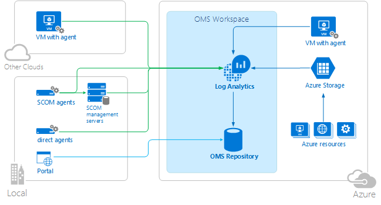
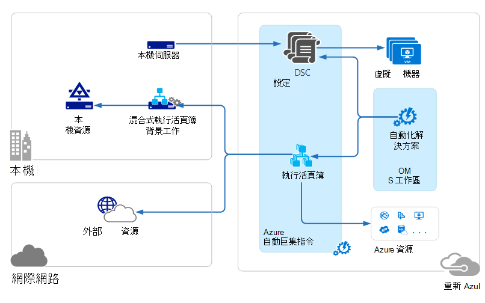

<properties 
   pageTitle="作業管理套件 (OMS) 架構 |Microsoft Azure"
   description="Microsoft 作業管理套件 (OMS) 是 Microsoft 的雲端 IT 管理解決方案，可協助您管理及保護您的內部部署與雲端基礎結構。  本文會識別不同 OMS 中包含的服務，並提供其詳細內容的連結。"
   services="operations-management-suite"
   documentationCenter=""
   authors="bwren"
   manager="jwhit"
   editor="tysonn" />
<tags 
   ms.service="operations-management-suite"
   ms.devlang="na"
   ms.topic="get-started-article"
   ms.tgt_pltfrm="na"
   ms.workload="infrastructure-services"
   ms.date="10/27/2016"
   ms.author="bwren" />

# OMS 架構

[作業管理套件 (OMS)](https://azure.microsoft.com/documentation/services/operations-management-suite/)是集合雲端服務，來管理您的內部部署與雲端環境。  本文將說明的不同內部部署和雲端元件 OMS 和其高等級的雲端運算架構。  您可以參考的文件，每一項服務，如需詳細資訊。

## 記錄狀況分析

收集[記錄分析](https://azure.microsoft.com/documentation/services/log-analytics/)的所有資料會都儲存於其裝載於 Azure OMS 存放庫。  連線的來源產生收集到 OMS 存放庫的資料。  目前有三種類型的連線支援的來源。

- 在[Windows](../log-analytics/log-analytics-windows-agents.md)或[Linux](../log-analytics/log-analytics-linux-agents.md)電腦上安裝代理程式直接連接到 OMS。
- 是系統管理中心的作業管理員 (SCOM) 管理群組[連線到記錄分析](../log-analytics/log-analytics-om-agents.md)。  是 SCOM 代理程式繼續與將事件和效能資料轉寄給記錄分析管理伺服器進行通訊。
- [Azure 儲存體帳戶](../log-analytics/log-analytics-azure-storage.md)工作者角色、 網頁角色或中 Azure 虛擬機器收集[Azure 診斷](../cloud-services/cloud-services-dotnet-diagnostics.md)資料。

資料來源定義記錄分析會從包括事件記錄檔和正在連線來源的資料。  解決方案將功能新增至 OMS，可以輕鬆地新增至您的工作區[OMS 方案庫](../log-analytics/log-analytics-add-solutions.md)。  某些解決方案可能會要求直接連接到記錄分析是 SCOM 代理程式而有些則可能需要安裝的其他代理人。

記錄檔分析具有管理 OMS 資源、 新增及設定 OMS 解決方案，並檢視和分析 OMS 存放庫中的資料，您可以使用的 web 式入口網站。

## Azure 自動化

[Azure 自動化 runbooks](http://azure.microsoft.com/documentation/services/automation) Azure 雲端中執行，並且可以存取 Azure 其他雲端服務，或從公用網際網路存取中的資源。  您也可以指定在您使用[混合式 Runbook 工作者](../automation/automation-hybrid-runbook-worker.md)，以便 runbooks 能夠存取本機資源的區域資料中心的內部部署電腦。

[DSC 設定](../automation/automation-dsc-overview.md)儲存在 Azure 自動化可以直接套用至 Azure 虛擬機器。  其他實體與虛擬機器可以要求從 Azure 自動化 DSC 提取伺服器的設定。

Azure 自動化有 OMS 解決方案的統計資料和啟動任何作業的 Azure 入口網站的連結會顯示。

## Azure 的備份

[Azure 備份](http://azure.microsoft.com/documentation/services/backup)受保護的資料會儲存於特定地理區域中的備份保存庫。  資料複製相同的區域內，根據保存庫的類型，可能也複製到另一個區域進一步重複。

Azure 備份有三個基本案例。

- Windows Azure 備份代理程式的電腦。  這可讓您備份檔案和資料夾的任何 Windows 伺服器或用戶端直接到您 Azure 備份保存庫。  
- 系統管理中心資料保護管理員 (DPM) 或 Microsoft Azure 備份伺服器。 這個選項可讓您運用 DPM 或 Microsoft Azure 備份伺服器備份檔案和資料夾，例如 SQL 和 SharePoint 本機存放區的應用程式工作負載除了，然後複製到您 Azure 備份保存庫。
- Azure 虛擬機器副檔名。  這個選項可讓您備份您 Azure 備份保存庫 Azure 虛擬機器。

Azure 備份有 OMS 解決方案的統計資料和啟動任何作業的 Azure 入口網站的連結會顯示。

## Azure 網站復原

[Azure 網站復原](http://azure.microsoft.com/documentation/services/site-recovery)協調複寫、 容錯移轉，以及回復的虛擬機器和實體伺服器。 複寫資料交換 HYPER-V 主機、 VMware hypervisors 和主要和次要資料中心的實體伺服器或之間的資料中心和 Azure 儲存空間。  網站復原會將中繼資料儲存保存庫中的特定的地理 Azure 區域。 沒有複製的資料會儲存網站復原服務。

Azure 網站復原有三個基本複寫案例。

**HYPER-V 虛擬機器的複寫**
- 如果 HYPER-V 虛擬機器中 VMM 雲朵管理，您可以複製次要資料中心或 Azure 儲存空間。  Azure 複寫是透過安全的網際網路連線。  次要資料中心的複寫是透過 LAN。
- 如果 HYPER-V 虛擬機器不由 VMM 管理，您可以複製到只 Azure 儲存體。  Azure 複寫是透過安全的網際網路連線。
 
**VMWare 虛擬機器的複寫**
- 執行 VMware 次要資料中心或 Azure 儲存空間，您可以複製 VMware 虛擬機器。  Azure 複寫可能是透過網站-VPN 或 Azure ExpressRoute 或安全的網際網路連線。 InMage 搜索資料頻道發生複寫到第二個資料中心。
 
**實體 Windows 和 Linux 伺服器的複寫** 
- 次要資料中心或 Azure 儲存空間，您可以複製實體伺服器。 Azure 複寫可能是透過網站-VPN 或 Azure ExpressRoute 或安全的網際網路連線。 InMage 搜索資料頻道發生複寫到第二個資料中心。  Azure 網站復原有一種 OMS 解決方案，會顯示一些統計資料，但您必須使用 Azure 入口網站的任何作業。

## 後續步驟

- 深入了解[記錄分析](http://azure.microsoft.com/documentation/services/log-analytics)。
- 深入了解[Azure 自動化](https://azure.microsoft.com/documentation/services/automation)。
- 深入了解[Azure 備份](http://azure.microsoft.com/documentation/services/backup)。
- 深入了解[Azure 網站復原](http://azure.microsoft.com/documentation/services/site-recovery)。
