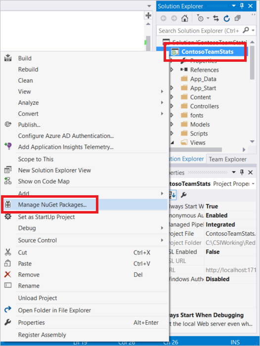

<properties
    pageTitle="快取 ASP.NET 輸出快取提供者"
    description="瞭解如何使用 Azure Redis 快取 ASP.NET 網頁輸出的快取"
    services="redis-cache"
    documentationCenter="na"
    authors="steved0x"
    manager="douge"
    editor="tysonn" />
<tags
    ms.service="cache"
    ms.devlang="na"
    ms.topic="article"
    ms.tgt_pltfrm="cache-redis"
    ms.workload="tbd"
    ms.date="09/27/2016"
    ms.author="sdanie" />

# ASP.NET 輸出快取提供者 Azure Redis 快取

Redis 輸出快取提供者是輸出快取資料的出程序儲存機制。 此資料是專為完整 HTTP 回應 （網頁輸出快取）。 提供者插入的新輸出快取提供者擴充點在 ASP.NET 4。

若要使用 Redis 輸出快取提供者，請先設定您的快取，然後設定 ASP.NET 應用程式使用 Redis 輸出快取提供者 NuGet 套件。 本主題提供指示設定應用程式使用 Redis 輸出快取提供者。 如需有關建立和設定 Azure Redis 快取執行個體的詳細資訊，請參閱[建立快取](cache-dotnet-how-to-use-azure-redis-cache.md#create-a-cache)。

## 儲存 ASP.NET 網頁輸出快取中

若要在 Visual Studio 中使用 Redis 輸出快取提供者 NuGet 封裝設定用戶端應用程式，以滑鼠右鍵按一下 [專案**總管**] 中的，然後選擇 [**管理 NuGet 套件**。

搜尋文字] 方塊中輸入**RedisOutputCacheProvider**從結果]，選取它，按一下 [**安裝**]。

Redis 輸出快取提供者 NuGet 套件 StackExchange.Redis.StrongName 套件上有相依性。 如果您將會安裝在 project 中沒有 StackExchange.Redis.StrongName 套件。 請注意，除了強式 StackExchange.Redis.StrongName 套件也 StackExchange.Redis 非-強式版本。 如果您的專案使用的您必須解除安裝之前, 或之後安裝 Redis 輸出快取提供者 NuGet 套件的非-強式 StackExchange.Redis 版本，否則您將會取得命名衝突您專案中。 如需有關這些套件的詳細資訊，請參閱[設定.NET 快取用戶端](cache-dotnet-how-to-use-azure-redis-cache.md#configure-the-cache-clients)。

NuGet 套件下載新增必要的組件參照，並將 web.config 檔案包含 ASP.NET 應用程式使用 Redis 輸出快取提供者所需的設定新增下一節。

    <caching>
      <outputCachedefault Provider="MyRedisOutputCache">
        <providers>
          <!--
          <add name="MyRedisOutputCache"
            host = "127.0.0.1" [String]
            port = "" [number]
            accessKey = "" [String]
            ssl = "false" [true|false]
            databaseId = "0" [number]
            applicationName = "" [String]
            connectionTimeoutInMilliseconds = "5000" [number]
            operationTimeoutInMilliseconds = "5000" [number]
          />
          -->
          <add name="MyRedisOutputCache" type="Microsoft.Web.Redis.RedisOutputCacheProvider" host="127.0.0.1" accessKey="" ssl="false"/>
        </providers>
      </outputCache>
    </caching>

[註解] 區段中提供的每個屬性的範例設定屬性的範例。

設定屬性與您在 Microsoft Azure 入口網站中的快取刀中的值，並設定其他的值，視。 如需存取您的快取屬性的指示，請參閱[設定 Redis 快取設定](cache-configure.md#configure-redis-cache-settings)。

-   **host （主機）** – 指定您快取結束點。
-   **連接埠**– 使用非 SSL 連接埠或 SSL 連接埠，ssl 而定。
-   **accessKey** – 使用快取的主要或次要鍵。
-   **ssl** – 如果您想要保護快取/用戶端通訊與 ssl; 則為 true否則為 false。 請務必指定正確的連接埠。
    -   新的快取的預設為停用非 SSL 連接埠。 指定為 true，此設定為使用 SSL 連接埠。 如需有關如何啟用非 SSL 連接埠的詳細資訊，請參閱[設定快取](cache-configure.md)主題中的 [[存取連接埠](cache-configure.md#access-ports)] 區段。
-   **databaseId** – 指定要使用的快取輸出資料的資料庫。 如果未指定會使用預設值 0。
-   **applicationName** – 鍵會儲存在為意指<AppName>_<SessionId>_Data。 這可讓多個應用程式共用相同的金鑰。 此為選用參數，如果您不提供其使用預設值。
-   **connectionTimeoutInMilliseconds** – 此設定可讓您覆寫 connectTimeout StackExchange.Redis 用戶端的設定。 如果未指定預設 connectTimeout 的 5000 使用設定。 如需詳細資訊，請參閱[StackExchange.Redis 設定模型](http://go.microsoft.com/fwlink/?LinkId=398705)。
-   **operationTimeoutInMilliseconds** – 此設定可讓您覆寫 syncTimeout StackExchange.Redis 用戶端的設定。 如果未指定會使用預設 syncTimeout 設定為 1000年。 如需詳細資訊，請參閱[StackExchange.Redis 設定模型](http://go.microsoft.com/fwlink/?LinkId=398705)。

將網頁或指示詞至您要快取輸出每個頁面。

    <%@ OutputCache Duration="60" VaryByParam="*" %>

在此範例中的快取] 頁面的資料會快取中保留 60 秒，而不同版本的頁面會快取的每個參數的組合。 更多的網頁或指示詞的詳細資訊，請參閱[@OutputCache](http://go.microsoft.com/fwlink/?linkid=320837)。

之後，請執行下列步驟，會將您的應用程式設定為使用 Redis 輸出快取提供者。

## 後續步驟

請參閱[Azure Redis 快取的 ASP.NET 工作階段狀態提供者](cache-aspnet-session-state-provider.md)。
