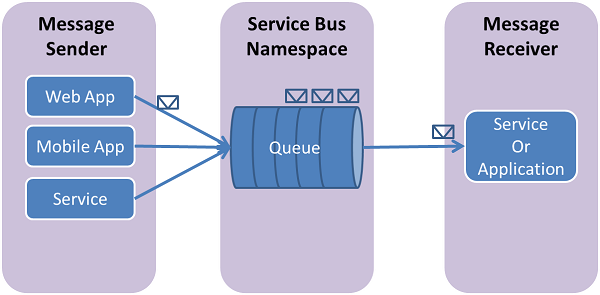

<properties
    pageTitle="如何使用服務匯流排佇列 java |Microsoft Azure"
    description="瞭解如何使用服務匯流排佇列 Azure 中。 Java 以撰寫程式碼範例。"
    services="service-bus"
    documentationCenter="java"
    authors="sethmanheim"
    manager="timlt"
    />

<tags
    ms.service="service-bus"
    ms.workload="na"
    ms.tgt_pltfrm="na"
    ms.devlang="Java"
    ms.topic="article"
    ms.date="10/04/2016"
    ms.author="sethm"/>

# <a name="how-to-use-service-bus-queues"></a>如何使用服務匯流排佇列

[AZURE.INCLUDE [service-bus-selector-queues](../../includes/service-bus-selector-queues.md)]

本文將說明如何使用服務匯流排佇列。 範例 Java 撰寫，並使用[Java Azure SDK][]。 涵蓋的案例包含**建立佇列**、**傳送及接收訊息**，然後**刪除佇列**。

## <a name="what-are-service-bus-queues"></a>服務匯流排佇列是什麼？

服務匯流排佇列支援**仲介訊息**的通訊模型。 使用時佇列，分散式應用程式的元件不彼此直接;請改為交換透過佇列中，做為媒介 （代理人） 的郵件。 郵件產生者 （寄件者） 交出佇列中的訊息，然後再繼續處理。
非同步，訊息消費者 （接收器） 會提取佇列中的訊息，並加以處理。 產生者沒有等待消費者回覆，才能繼續處理程序，並進一步傳送訊息。 佇列提供**第一個中，第一個查看 (FIFO)**的郵件傳送給一或多個競爭消費者。 也就是說，郵件會通常收到，且由順序的佇列中，加入與每一封郵件接收，並處理只有一封郵件消費者接收器處理。



服務匯流排佇列是用途技術，可以用於各種情況︰

- 在多層 Azure 應用程式中的網頁和背景工作角色之間的通訊。
- 內部部署的應用程式和 Azure 之間的通訊裝載在混合式解決方案的應用程式。
- 執行在不同的組織或組織的部門的內部部署的分散式應用程式的元件之間的通訊。

使用佇列可讓您更輕鬆地擴展您的應用程式，並啟用恢復您架構中。

## <a name="create-a-service-namespace"></a>建立服務命名空間

若要開始使用服務匯流排佇列 Azure 中，您必須先建立命名空間。 命名空間提供範圍容器來處理您的應用程式中的服務匯流排資源。

若要建立命名空間︰

[AZURE.INCLUDE [service-bus-create-namespace-portal](../../includes/service-bus-create-namespace-portal.md)]

## <a name="configure-your-application-to-use-service-bus"></a>設定您的應用程式使用服務匯流排

請確定您有安裝[Java Azure SDK][]建置這個範例之前。 如果您使用的蝕，您可以安裝包含 java Azure SDK[的蝕 Azure 工具組][]。 您可以新增**Microsoft Azure java 的文件庫**至您的專案︰


新增下列`import`陳述式以 Java 檔案頂端︰

```
// Include the following imports to use Service Bus APIs
import com.microsoft.windowsazure.services.servicebus.*;
import com.microsoft.windowsazure.services.servicebus.models.*;
import com.microsoft.windowsazure.core.*;
import javax.xml.datatype.*;
```

## <a name="create-a-queue"></a>建立佇列

透過**ServiceBusContract**類別，才能執行服務匯流排佇列管理作業。 使用適當的設定封裝權限管理，為 SA 權杖建構**ServiceBusContract**物件和**ServiceBusContract**類別是唯一的通訊與 Azure 點。

**ServiceBusService**課程提供方法來建立、 列舉和刪除佇列。 下列範例會顯示如何**ServiceBusService**物件可用於建立名為 「 TestQueue 」，名為 「 HowToSample 」 的命名空間佇列中︰

```
Configuration config =
    ServiceBusConfiguration.configureWithSASAuthentication(
            "HowToSample",
            "RootManageSharedAccessKey",
            "SAS_key_value",
            ".servicebus.windows.net"
            );

ServiceBusContract service = ServiceBusService.create(config);
QueueInfo queueInfo = new QueueInfo("TestQueue");
try
{
    CreateQueueResult result = service.createQueue(queueInfo);
}
catch (ServiceException e)
{
    System.out.print("ServiceException encountered: ");
    System.out.println(e.getMessage());
    System.exit(-1);
}
```

有**QueueInfo**的方法，讓要微調佇列中的屬性 (例如︰ 若要設定預設存留時間 (TTL) 值，可套用至佇列中的郵件)。 下列範例會示範如何建立名為佇列`TestQueue`的 5 GB 的最大︰

````
long maxSizeInMegabytes = 5120;
QueueInfo queueInfo = new QueueInfo("TestQueue");
queueInfo.setMaxSizeInMegabytes(maxSizeInMegabytes);
CreateQueueResult result = service.createQueue(queueInfo);
````

請注意，您可以使用**listQueues**方法**ServiceBusContract**物件上檢查是否佇列中，以指定名稱已經存在服務命名空間內。

## <a name="send-messages-to-a-queue"></a>傳送郵件給佇列中

若要將訊息傳送給服務匯流排佇列中，您的應用程式會取得**ServiceBusContract**物件。 下列程式碼示範如何傳送郵件`TestQueue`佇列中先前建立`HowToSample`命名空間︰

```
try
{
    BrokeredMessage message = new BrokeredMessage("MyMessage");
    service.sendQueueMessage("TestQueue", message);
}
catch (ServiceException e)
{
    System.out.print("ServiceException encountered: ");
    System.out.println(e.getMessage());
    System.exit(-1);
}
```

郵件傳送到，，從服務匯流排收到佇列是[BrokeredMessage][]類別的執行個體。 用來保留自訂的應用程式的特定屬性，字典和本文任意應用程式的資料， [BrokeredMessage][]物件都有一組標準的屬性 （例如[標籤](https://msdn.microsoft.com/library/azure/microsoft.servicebus.messaging.brokeredmessage.label.aspx)和[TimeToLive](https://msdn.microsoft.com/library/azure/microsoft.servicebus.messaging.brokeredmessage.timetolive.aspx)）。 應用程式，可以藉由將任何序列化物件傳遞到建構函式的[BrokeredMessage][]中，設定郵件的本文，然後將用於適當的序列化程式序列化物件。 或者，您也可以提供**java。IO。InputStream**物件。

下列範例會示範如何傳送五個測試郵件`TestQueue` **MessageSender**我們在先前的程式碼片段取得︰

```
for (int i=0; i<5; i++)
{
     // Create message, passing a string message for the body.
     BrokeredMessage message = new BrokeredMessage("Test message " + i);
     // Set an additional app-specific property.
     message.setProperty("MyProperty", i);
     // Send message to the queue
     service.sendQueueMessage("TestQueue", message);
}
```

服務匯流排佇列中[進階版層](service-bus-premium-messaging.md)支援的郵件大小上限 256 KB[標準層](service-bus-premium-messaging.md)和 1 MB。 頁首，其中包含標準和自訂應用程式屬性，可以有 64 KB 的大小上限。 沒有限制的郵件保留在佇列數但還有首字放大的總大小由佇列中的郵件。 在建立時，使用 5 GB 的上限定義此佇列大小。

## <a name="receive-messages-from-a-queue"></a>從佇列中接收郵件

從佇列中接收郵件的主要方式是使用**ServiceBusContract**物件。 收到的郵件可使用兩種不同的模式︰ **ReceiveAndDelete**和**PeekLock**。

使用 「 **ReceiveAndDelete**模式時，收到時是單一擷取作業-也就是說，當服務匯流排佇列中收到郵件的讀取的要求，並標示該郵件為所使用且傳回應用程式。 （這是預設的模式） **ReceiveAndDelete**模式最簡單的模型，最適合的案例的應用程式可容許不處理失敗訊息。 若要了解，請考慮消費者接收邀請中發生的問題，然後當機處理之前，先情況。
因為服務匯流排會有將郵件標示為所使用，然後重新啟動應用程式，然後開始一次使用訊息，它會有未接來電之前損毀的使用狀況的訊息。

在**PeekLock**模式中，會收到變成兩個階段作業，讓它可能不允許遺失郵件的支援應用程式。 服務匯流排收到要求時，它會找出要使用下一封郵件、 鎖定，防止其他消費者接收，然後傳回應用程式。 應用程式完成處理郵件 （或供未來處理可靠的方式將它儲存之後），藉由呼叫 [收到的郵件上的 [**刪除**完成接收程序的第二個階段。 當服務匯流排看到**刪除**通話時，它會將時所使用的郵件標示，並將它從佇列中移除。

下列範例會示範如何能接收的郵件，並處理使用**PeekLock**模式 （非預設模式）。 下列範例會無限迴圈，並處理郵件到達時將我們 「 TestQueue 」:

```
try
{
    ReceiveMessageOptions opts = ReceiveMessageOptions.DEFAULT;
    opts.setReceiveMode(ReceiveMode.PEEK_LOCK);

    while(true)  {
         ReceiveQueueMessageResult resultQM =
                service.receiveQueueMessage("TestQueue", opts);
        BrokeredMessage message = resultQM.getValue();
        if (message != null && message.getMessageId() != null)
        {
            System.out.println("MessageID: " + message.getMessageId());
            // Display the queue message.
            System.out.print("From queue: ");
            byte[] b = new byte[200];
            String s = null;
            int numRead = message.getBody().read(b);
            while (-1 != numRead)
            {
                s = new String(b);
                s = s.trim();
                System.out.print(s);
                numRead = message.getBody().read(b);
            }
            System.out.println();
            System.out.println("Custom Property: " +
                message.getProperty("MyProperty"));
            // Remove message from queue.
            System.out.println("Deleting this message.");
            //service.deleteMessage(message);
        }  
        else  
        {
            System.out.println("Finishing up - no more messages.");
            break;
            // Added to handle no more messages.
            // Could instead wait for more messages to be added.
        }
    }
}
catch (ServiceException e) {
    System.out.print("ServiceException encountered: ");
    System.out.println(e.getMessage());
    System.exit(-1);
}
catch (Exception e) {
    System.out.print("Generic exception encountered: ");
    System.out.println(e.getMessage());
    System.exit(-1);
}
```

## <a name="how-to-handle-application-crashes-and-unreadable-messages"></a>如何處理應用程式當機和無法讀取的郵件

服務匯流排提供的功能，可協助您順利復原錯誤，在您的應用程式或處理郵件的問題。 如果無法基於某種原因處理郵件的收件者的應用程式，就可以收到的郵件 （而非**deleteMessage**方法） 上呼叫**unlockMessage**方法。 這會導致服務匯流排，若要解除鎖定訊息佇列中的，使其可接收一次，相同的使用應用程式或另一個使用應用程式。

也有佇列中，在鎖定訊息相關聯的逾時，如果應用程式無法處理之前訊息鎖定逾 （例如，如果應用程式當機），然後服務匯流排會自動解除鎖定訊息，使其可接收一次。

應用程式當機之後處理郵件，但發行**deleteMessage**要求之前，然後郵件會被重新傳遞至應用程式時，重新啟動。 這通常稱為**至少後處理**，也就是將至少一次處理每一封郵件，但在某些情況下可能會被重新傳遞相同的郵件。 如果此案例不允許重複處理，應用程式開發人員應該將其他邏輯新增至其應用程式來處理重複的郵件傳遞。 這通常被達成使用該郵件，仍在嘗試傳遞常數**getMessageId**方法。

## <a name="next-steps"></a>後續步驟

現在，您學到的服務匯流排佇列基本概念，請參閱[佇列主題，以及訂閱][]，如需詳細資訊。

如需詳細資訊，請參閱[Java 開發人員中心](/develop/java/)。


  [Java azure SDK]: http://azure.microsoft.com/develop/java/
  [針對蝕 azure 工具組]: https://msdn.microsoft.com/library/azure/hh694271.aspx
  [佇列、 主題及訂閱]: service-bus-queues-topics-subscriptions.md
  [BrokeredMessage]: https://msdn.microsoft.com/library/azure/microsoft.servicebus.messaging.brokeredmessage.aspx

