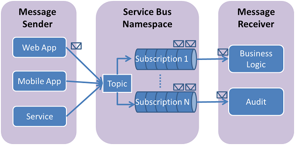

<properties
    pageTitle="如何使用服務匯流排主題 （[注音標示） |Microsoft Azure"
    description="瞭解如何使用中 Azure 服務匯流排主題和訂閱。 並列文字的應用程式撰寫程式碼範例。"
    services="service-bus"
    documentationCenter="ruby"
    authors="sethmanheim"
    manager="timlt"
    editor=""/>

<tags
    ms.service="service-bus"
    ms.workload="na"
    ms.tgt_pltfrm="na"
    ms.devlang="ruby"
    ms.topic="article"
    ms.date="10/04/2016"
    ms.author="sethm"/>

# <a name="how-to-use-service-bus-topicssubscriptions"></a>如何使用服務匯流排主題/訂閱

[AZURE.INCLUDE [service-bus-selector-topics](../../includes/service-bus-selector-topics.md)]

本文將說明如何使用服務匯流排主題和從並列文字的應用程式的訂閱。 涵蓋的案例，包括主題、**接收來自訂閱的郵件**，以及**刪除主題和訂閱**的 [**建立主題和訂閱]，建立訂閱篩選，傳送郵件**。 如需有關主題和訂閱的詳細資訊，請參閱[下一步](#next-steps)] 區段。

## <a name="service-bus-topics-and-subscriptions"></a>服務匯流排主題和訂閱

服務匯流排主題及訂閱支援*發佈/訂閱*訊息通訊模型。 使用主題和訂閱時，分散式應用程式的元件不彼此直接;請改為交換透過主題，做為中間的訊息。



相較於服務匯流排佇列，其中每一封郵件處理單一使用者，主題和訂閱提供**一個一對多**表單的通訊，使用發佈/訂閱模式。 請可註冊主題的多個訂閱。 當郵件傳送主題時，它就可供每個訂閱獨立處理。

主題訂閱類似虛擬佇列接收主題已傳送的郵件的複本。 您可以選擇性地註冊篩選規則，根據每個訂閱，這可讓您篩選器/限制主題的郵件都會收到哪些主題訂閱主題。

服務匯流排主題和訂閱可讓您不按比例縮放過大量使用者和應用程式處理大量郵件。

## <a name="create-a-namespace"></a>建立命名空間

若要開始使用服務匯流排佇列 Azure 中，您必須先建立命名空間。 命名空間提供範圍容器來處理您的應用程式中的服務匯流排資源。 因為[Azure 入口網站][]不會建立命名空間 ACS 連線，您必須建立透過命令列介面的命名空間。

若要建立命名空間︰

1. 開啟 Azure Powershell 主控台視窗。

2. 輸入下列命令以建立命名空間。 提供您自己的命名空間值，並為您的應用程式中指定的相同的地區。

    ```
    New-AzureSBNamespace -Name 'yourexamplenamespace' -Location 'West US' -NamespaceType 'Messaging' -CreateACSNamespace $true
    ```

    

## <a name="obtain-default-management-credentials-for-the-namespace"></a>取得預設管理認證的命名空間

若要執行管理作業，例如佇列中建立新的命名空間，您必須取得管理認證的命名空間。

您已建立的服務匯流排命名空間的 PowerShell 指令程式會顯示可用來管理命名空間的鍵。 複製 [ **DefaultKey**值。 稍後在本教學課程，您會在您的程式碼中使用此值。


> [AZURE.NOTE]
> 如果您登入[Azure 入口網站][]，瀏覽至 [連線資訊，為您的命名空間，您也可以找到此按鍵。

## <a name="create-a-ruby-application"></a>建立拼音應用程式

如需相關指示，請參閱[建立並列文字上的應用程式 Azure](../virtual-machines/linux/classic/virtual-machines-linux-classic-ruby-rails-web-app.md)。

## <a name="configure-your-application-to-use-service-bus"></a>設定使用服務匯流排應用程式

若要使用服務匯流排，請下載並使用 [注音標示 Azure 套件，其中包含一組方便時觀看文件庫與儲存其他服務。

### <a name="use-rubygems-to-obtain-the-package"></a>使用 RubyGems 取得套件

1. 使用**PowerShell** (Windows)、**終端機**(Mac)，或**被**(Unix) 等命令列介面。

2. 安裝健身和相依性的 [命令] 視窗中，輸入 「 健身安裝 azure 」。

### <a name="import-the-package"></a>匯入套件

使用您偏好使用的文字編輯器，移至您要使用儲存空間的並列文字檔案頂端新增下列動作︰

```
require "azure"
```

## <a name="set-up-a-service-bus-connection"></a>設定服務匯流排連線

Azure 模組讀取環境變數**AZURE\_SERVICEBUS\_命名空間**和**AZURE\_SERVICEBUS\_存取\_鍵**連線到您的命名空間所需的資訊。 如果沒有設定這些環境變數，您必須指定之前**Azure::ServiceBusService**使用下列程式碼的命名空間資訊︰

```
Azure.config.sb_namespace = "<your azure service bus namespace>"
Azure.config.sb_access_key = "<your azure service bus access key>"
```

您可以設定命名空間值為您建立而不是整個 URL 的值。 例如，使用**「 yourexamplenamespace 」**，不是 「 yourexamplenamespace.servicebus.windows.net 」。

## <a name="create-a-topic"></a>建立主題

**Azure::ServiceBusService**物件可讓您使用的主題。 下列程式碼會建立**Azure::ServiceBusService**物件。 若要建立主題，請使用**建立\_topic()**方法。 下列範例會建立主題，或列印錯誤，如果有的話。

```
azure_service_bus_service = Azure::ServiceBusService.new
begin
  topic = azure_service_bus_service.create_queue("test-topic")
rescue
  puts $!
end
```

您也可以將傳遞的其他選項，可讓您覆寫預設主題設定，例如訊息時間至即時**Azure::ServiceBus::Topic**物件或佇列最大值。 下列範例顯示至 5 GB 並 live 1 分鐘的時間設定佇列最大值︰

```
topic = Azure::ServiceBus::Topic.new("test-topic")
topic.max_size_in_megabytes = 5120
topic.default_message_time_to_live = "PT1M"

topic = azure_service_bus_service.create_topic(topic)
```

## <a name="create-subscriptions"></a>建立訂閱

主題訂閱也會建立**Azure::ServiceBusService**物件。 訂閱名稱，並且可以有限制的郵件傳遞到訂閱的虛擬佇列中一組選擇性篩選。

訂閱會持續，並會繼續存在，直到任一他們，或有相關聯的主題，會刪除。 如果您的應用程式中包含邏輯來建立的訂閱，它應該先檢查是否訂閱已經存在使用 getSubscription 方法。

### <a name="create-a-subscription-with-the-default-matchall-filter"></a>使用預設 (MatchAll) 篩選器建立訂閱

**MatchAll**是如果建立新的訂閱時指定沒有篩選條件，則會使用預設篩選器。 使用**MatchAll**篩選時，發佈至主題中的所有郵件都會都放在訂閱的虛擬佇列中。 下列範例會建立名為 「 所有郵件 」 的訂閱，並使用預設**MatchAll**篩選器。

```
subscription = azure_service_bus_service.create_subscription("test-topic", "all-messages")
```

### <a name="create-subscriptions-with-filters"></a>建立篩選的訂閱

您也可以定義篩選可讓您指定主題的郵件應該顯示特定的訂閱中。

最有彈性的訂閱支援類型是篩選的**Azure::ServiceBus::SqlFilter**，來實作 SQL92 子集。 SQL 篩選運作內容的發佈至主題的郵件。 如需可供使用 SQL 篩選運算式的詳細資訊，檢閱[SqlFilter.SqlExpression](http://msdn.microsoft.com/library/azure/microsoft.servicebus.messaging.sqlfilter.sqlexpression.aspx)語法。

您也可以使用的訂閱新增篩選**建立\_rule()** **Azure::ServiceBusService**物件的方法。 這個方法可讓您新增至現有訂閱的篩選器。

由於預設篩選器會自動套用到所有的新訂閱，您必須先移除預設篩選器，或**MatchAll**會覆寫任何其他您可能會指定的篩選。 您可以移除預設規則使用**刪除\_rule()** **Azure::ServiceBusService**物件上的方法。

下列範例會建立一個名為 「 最高-郵件 「 只會選取含有自訂郵件**Azure::ServiceBus::SqlFilter**的訂閱**訊息\_數字**大於 3 的屬性︰

```
subscription = azure_service_bus_service.create_subscription("test-topic", "high-messages")
azure_service_bus_service.delete_rule("test-topic", "high-messages", "$Default")

rule = Azure::ServiceBus::Rule.new("high-messages-rule")
rule.topic = "test-topic"
rule.subscription = "high-messages"
rule.filter = Azure::ServiceBus::SqlFilter.new({
  :sql_expression => "message_number > 3" })
rule = azure_service_bus_service.create_rule(rule)
```

同樣地，下列範例會建立名為 「 低-郵件 「 只會選取郵件的**message_number**屬性小於或等於 3 **Azure::ServiceBus::SqlFilter**訂閱︰

```
subscription = azure_service_bus_service.create_subscription("test-topic", "low-messages")
azure_service_bus_service.delete_rule("test-topic", "low-messages", "$Default")

rule = Azure::ServiceBus::Rule.new("low-messages-rule")
rule.topic = "test-topic"
rule.subscription = "low-messages"
rule.filter = Azure::ServiceBus::SqlFilter.new({
  :sql_expression => "message_number <= 3" })
rule = azure_service_bus_service.create_rule(rule)
```

當郵件立即傳送到 「 測試主題 」 時，它會永遠傳遞至接收器訂閱 「 所有郵件 」 主題訂閱]，及選擇性地傳遞到接收器訂閱 （視郵件內容） 的 「 最高-訊息 」 和 「 低訊息 」 主題訂閱。

## <a name="send-messages-to-a-topic"></a>傳送郵件給主題

若要將訊息傳送給服務匯流排主題，您的應用程式必須使用**傳送\_主題\_message()** **Azure::ServiceBusService**物件上的方法。 傳送給服務匯流排主題的郵件是**Azure::ServiceBus::BrokeredMessage**物件的執行個體。 **Azure::ServiceBus::BrokeredMessage**物件都有一組標準的屬性 (例如**標籤**和**時間\_至\_live**)，用來保留自訂的應用程式的特定屬性，字典和本文字串資料。 應用程式，可以設定郵件的本文傳送到的字串值**傳送\_主題\_message()**方法和任何必要的標準的內容便會填入預設值。

下列範例會示範如何傳送五個測試 「 測試主題 」 的訊息。 請注意，每一封郵件的**message_number**自訂屬性值不盡相同上的循環播放反覆運算 （這個選項會決定哪些訂閱異）︰

```
5.times do |i|
  message = Azure::ServiceBus::BrokeredMessage.new("test message " + i,
    { :message_number => i })
  azure_service_bus_service.send_topic_message("test-topic", message)
end
```

服務匯流排主題支援[進階版層](service-bus-premium-messaging.md)中的郵件大小上限 256 KB[標準層](service-bus-premium-messaging.md)和 1 MB。 頁首，其中包含標準和自訂應用程式屬性，可以有 64 KB 的大小上限。 沒有限制的主題中的郵件數但還有首字放大的總大小由主題的郵件。 此主題檔案大小定義在建立時，使用 5 GB 的上限。

## <a name="receive-messages-from-a-subscription"></a>從訂閱接收郵件

從訂閱使用接收訊息**接收\_訂閱\_message()** **Azure::ServiceBusService**物件上的方法。 根據預設，郵件 read(peak) 而不刪除其從訂閱鎖定。 您可以讀取及從訂閱刪除的郵件，藉由設定**預覽\_鎖定**為 [ **false**] 選項。

讀取和刪除的兩個階段作業，也能夠在支援的不允許遺失的郵件應用程式，可讓您的預設行為。 服務匯流排收到要求時，它會找出要使用下一封郵件、 鎖定，防止其他消費者接收，然後傳回應用程式。 應用程式完成處理郵件 （或供未來處理可靠的方式將它儲存之後），完成接收程序的第二個階段，則可電話**刪除\_訂閱\_message()**方法，並提供要做為參數刪除訊息。 **刪除\_訂閱\_message()**方法將訊息標示為所使用，並將它從訂閱移除。

如果**︰ 預覽\_鎖定**參數設定為**false**，閱讀並刪除訊息會變成最簡單的模型，最適合用於案例的應用程式可容許不處理失敗訊息。 若要了解，請考慮消費者接收邀請中發生的問題，然後當機處理之前，先情況。 因為服務匯流排會有將郵件標示為所使用，然後重新啟動應用程式，然後開始一次使用訊息，它會有未接來電之前損毀的使用狀況的訊息。

下列範例會示範如何能接收的郵件，以及處理使用**接收\_訂閱\_message()**。 範例第一次接收，並從 「 低郵件 」 的訂閱刪除的郵件，使用**︰ 預覽\_鎖定**設為**false**，它會收到 「 最高-郵件 」 的另一封郵件，並刪除訊息使用**刪除\_訂閱\_message()**:

```
message = azure_service_bus_service.receive_subscription_message(
  "test-topic", "low-messages", { :peek_lock => false })
message = azure_service_bus_service.receive_subscription_message(
  "test-topic", "high-messages")
azure_service_bus_service.delete_subscription_message(message)
```

## <a name="handle-application-crashes-and-unreadable-messages"></a>處理應用程式當機和無法讀取的郵件

服務匯流排提供的功能，可協助您順利復原錯誤，在您的應用程式或處理郵件的問題。 如果基於某種原因，處理郵件的收件者的應用程式無法再它可呼叫**解除鎖定\_訂閱\_message()** **Azure::ServiceBusService**物件上的方法。 這會使服務匯流排，若要解除鎖定訂閱中的訊息，使其可接收一次，相同的使用應用程式或另一個使用應用程式。

也有訂閱，請在鎖定訊息相關聯的逾時，如果應用程式無法處理之前訊息鎖定逾 （例如，如果應用程式當機），然後服務匯流排會自動解除鎖定訊息，使其可接收一次。

應用程式當機之後但之前處理郵件**刪除\_訂閱\_message()**呼叫方法，然後訊息重新應用程式時，重新啟動傳遞。 這通常稱為**至少一次處理**;就是將至少一次處理每一封郵件，但在某些情況下可能會被重新傳遞相同的郵件。 如果此案例不允許重複處理，應用程式開發人員應該將其他邏輯新增至其應用程式來處理重複的郵件傳遞。 使用通常達成此邏輯**訊息\_識別碼**郵件中，將會保持不變跨嘗試傳遞的屬性。

## <a name="delete-topics-and-subscriptions"></a>刪除主題及訂閱

主題和訂閱常設，而必須在 [透過[Azure 入口網站][]或以程式設計方式明確刪除。 下列範例會示範如何刪除名為 「 測試主題 」 的主題。

```
azure_service_bus_service.delete_topic("test-topic")
```

刪除主題時，也會刪除任何訂閱註冊的主題。 您也可以個別刪除訂閱。 下列程式碼會說明如何刪除名為 「 高郵件 」，從 「 測試主題 」 主題的訂閱︰

```
azure_service_bus_service.delete_subscription("test-topic", "high-messages")
```

## <a name="next-steps"></a>後續步驟

現在，您學到服務匯流排主題的基本概念，請遵循這些連結，瞭解更多。

- 請參閱[佇列主題，以及訂閱](service-bus-queues-topics-subscriptions.md)。
- [SqlFilter](http://msdn.microsoft.com/library/azure/microsoft.servicebus.messaging.sqlfilter.aspx)API 參考。
- 瀏覽 GitHub[注音 Azure SDK](https://github.com/Azure/azure-sdk-for-ruby)存放庫。
 
[Azure 入口網站]: https://portal.azure.com
