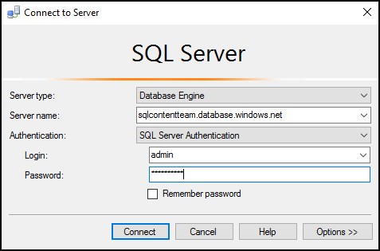

<properties
    pageTitle="使用 C# 查詢連線到 SQL 資料庫 |Microsoft Azure"
    description="撰寫 C# 查詢並連線到 SQL 資料庫中的程式。 IP 位址、 連接字串，secure store 及免費的 Visual Studio 的相關資訊。"
    services="sql-database"
    keywords="c# 資料庫查詢、 c# 查詢，連接至資料庫，SQL C#"
    documentationCenter=""
    authors="stevestein"
    manager="jhubbard"
    editor=""/>

<tags
    ms.service="sql-database"
    ms.workload="data-management"
    ms.tgt_pltfrm="na"
    ms.devlang="dotnet"
    ms.topic="get-started-article"
    ms.date="08/17/2016"
    ms.author="stevestein"/>

# 連線到 Visual Studio 與 SQL 資料庫

> [AZURE.SELECTOR]
- [Visual Studio](sql-database-connect-query.md)
- [SSMS](sql-database-connect-query-ssms.md)
- [Excel](sql-database-connect-excel.md)

瞭解如何連線到 Visual Studio 中 Azure SQL 資料庫。 

## 必要條件

若要使用 Visual Studio SQL 資料庫連線，您需要下列項目︰ 

- 連線至 SQL 資料庫。 本文會使用**AdventureWorks**範例資料庫。 若要取得 AdventureWorks 範例資料庫，請參閱[建立示範資料庫](sql-database-get-started.md)。

- Visual Studio 2013 更新 4 （或更新版本）。 Microsoft 現在提供的*免費*的 Visual Studio 社群。
 - [Visual Studio 社群、 下載](http://www.visualstudio.com/products/visual-studio-community-vs)
 - [更多選項來免費 Visual Studio](http://www.visualstudio.com/products/free-developer-offers-vs.aspx)

## 開啟 Visual Studio 從 Azure 入口網站

1. [Azure 入口網站](https://portal.azure.com/)登入。

2. 按一下 [**更多服務** > **SQL 資料庫**
3. **AdventureWorks**資料庫刀找出並按一下以開啟*AdventureWorks*資料庫。

6. 按一下 [資料庫刀頂端的 [**工具**] 按鈕︰

    

7. 按一下 [**開啟 Visual Studio 中**（如果您需要 Visual Studio，請按一下 [下載] 連結）︰

    

8. Visual Studio 已設定連線到伺服器，並在入口網站中選取的資料庫**連線到伺服器**視窗隨即開啟。  （按一下 [**選項**]，確認已設定連線到正確的資料庫）。輸入您的伺服器管理員密碼，然後按一下 [**連線**]。

    

8. 如果您沒有設定防火牆規則為電腦的 IP 位址，您收到*無法連線*訊息以下。 若要建立防火牆規則，請參閱[設定 Azure SQL 資料庫伺服器層級的防火牆規則](sql-database-configure-firewall-settings.md)。

9. 成功連接之後，連線到您的資料庫會開啟 [ **SQL Server 物件總管**] 視窗。

    

## 執行查詢的範例

現在，我們已連線至資料庫，下列步驟會顯示如何執行簡單的查詢︰

2. 以滑鼠右鍵按一下資料庫，然後選取 [**新的查詢**。

    

3. 在 [查詢] 視窗中，複製並貼上下列的程式碼。

        SELECT
        CustomerId
        ,Title
        ,FirstName
        ,LastName
        ,CompanyName
        FROM SalesLT.Customer;

4. 按一下 [**執行**] 按鈕來執行查詢︰

    

## 後續步驟

- 在 Visual Studio 中開啟 SQL 資料庫使用 SQL Server Data Tools。 如需詳細資訊，請參閱[SQL Server Data Tools](https://msdn.microsoft.com/library/hh272686.aspx)。
- 若要連線到 SQL 資料庫使用的程式碼，請參閱[連線至 SQL 資料庫使用.NET (C#)](sql-database-develop-dotnet-simple.md)。

