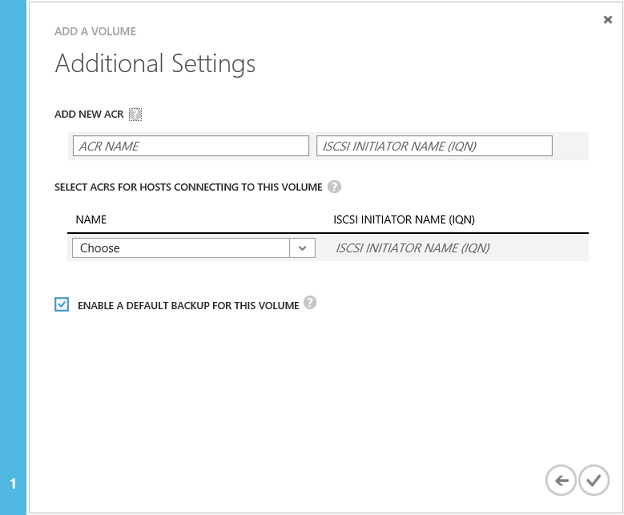

<properties
   pageTitle="管理 StorSimple 區 |Microsoft Azure"
   description="說明如何新增、 修改、 監控及刪除 StorSimple 區，以及如何讓他們離線必要。"
   services="storsimple"
   documentationCenter="NA"
   authors="SharS"
   manager="carmonm"
   editor="" />
<tags
   ms.service="storsimple"
   ms.devlang="NA"
   ms.topic="article"
   ms.tgt_pltfrm="NA"
   ms.workload="TBD"
   ms.date="05/11/2016"
   ms.author="v-sharos" />

# 若要管理區使用 StorSimple 管理員服務

[AZURE.INCLUDE [storsimple-version-selector-manage-volumes](../../includes/storsimple-version-selector-manage-volumes.md)]

## 概觀

本教學課程說明如何建立及管理區 StorSimple 裝置和 StorSimple 虛擬裝置上的使用 StorSimple 管理員服務。

StorSimple 管理員服務是 Azure 傳統入口網站，可讓您管理 StorSimple 解決方案以單一網頁介面擴充。 除了管理區，您可以使用 「 StorSimple 管理員服務建立和管理 StorSimple 服務、 檢視和管理裝置、 檢視通知，並檢視和管理備份的原則和類別目錄。

> [AZURE.NOTE] Azure StorSimple 可以建立只有狗熊能夠的區。 您無法建立能夠完全或部分能夠 Azure StorSimple 系統上的區。
>
> 型佈建是出現超過實體資源的可用儲存空間的虛擬化技術。 事先預約足夠的儲存空間，而不是 Azure StorSimple 使用型佈建配置只足夠的空間以符合目前的需求。 彈性的雲端儲存空間性質協助這種方法，因為 Azure StorSimple 可以增加或減少符合變更要求的雲端儲存空間。

## [區] 頁面

[**區**] 頁面可讓您管理佈建您啟動器 （伺服器） 的 Microsoft Azure StorSimple 裝置的存放區。 會顯示 StorSimple 裝置上的 [區] 清單。

 

大量組成一系列的屬性︰

- **名稱**– 必須是唯一的可協助您識別大量的描述性名稱。 此名稱也用於監控報告，當您篩選特定的音量。

- **狀態**-可以線上或離線。 如果 [音量] 如果離線，它看不到所允許的存取權才能使用大量的啟動器 （伺服器）。

- **容量**– 指定如何大型音量，觀察得到的啟動器 （伺服器）。 容量指定總數可以儲存啟動器 （伺服器） 的資料。 區狗熊佈建後，並為 deduplicated 資料。 這表示您的裝置沒有預先配置實體儲存容量內部或設定的大量容量根據 cloud。 配置並視需要使用大量容量。

- **輸入**– 大量類型可以分層或保存 （子類型層）

- **存取**– 指定允許存取此大量的啟動器 （伺服器）。 無法存取控制記錄 (ACR) 音量與相關聯的成員的啟動器看不到音量。

- **監控**– 指定監視音量。 監控建立時，啟用預設不會有大量。 監控會，不過，停用的大量複製。 若要啟用監控來調整音量，請遵循監視器區中的指示進行。

大量相關聯的常見工作如下︰

- 新增大量
- 修改音量
- 刪除區
- 離線工作區
- 監控音量

## 新增大量

您[建立大量](storsimple-deployment-walkthrough-u1.md#step-6-create-a-volume)期間 StorSimple 解決方案的部署。 新增大量是類似的程序。

### 若要新增的音量

1. 在 [**裝置**] 頁面上選取的裝置，連按兩下，，然後按一下**音量容器**] 索引標籤。

2. 選取音量容器，然後按一下 [存取與容器相關聯的區對應列中的箭號。

3. 按一下 [**新增**頁面的底部。 [新增大量精靈] 隨即啟動。

     

4. 在 [新增大量精靈，在 [**基本設定**] 底下，執行下列動作︰

  1. 提供您大量的**名稱**。
  2. 指定您大量**佈建容量**GB 或 TB。 容量必須介於 1 GB 和 64 TB 實體裝置。 可以佈建後 StorSimple 虛擬裝置上區的最大容量是 30 TB。
  3. 選取您大量**使用類型**。 如果您使用保存資料分層的音量，選取 [**使用此大量較少存取保存資料**] 核取方塊變更您大量的 deduplication 區塊大小為 512 KB。 如果您未選取這個選項，將對應的分層的音量會使用區塊大小為 64 KB。 較大的 deduplication 區塊大小可讓促進至雲端的大型保存資料傳送的裝置。（分層的區已之前稱為主要區）。
  5. 按一下箭號圖示，前往 [**其他設定**] 頁面。

        

5. 在 [**其他設定**] 新增新的 access 控制項記錄 (ACR):

  1. 從下拉式清單中選取的 access 控制項的記錄 (ACR)。 或者，您可以新增新的 ACR。 ACRs 決定哪些主機可以存取區比對主機 IQN 用列在記錄中。
  2. 我們建議您選取 [**啟用此大量的預設備份**] 核取方塊以啟用預設備份。
   3. 按一下 [檢查] 圖示  若要建立音量與指定的設定。

您的新音量現在已可供使用。

## 修改音量

當您需要將其展開，或變更存取音量主機時，請修改音量。

> [AZURE.IMPORTANT]
>
> - 如果您要修改的裝置上的大量大小，大量大小需要 「 」 主機上變更。
> - 此處所述主機端步驟適用於 Windows Server 2012 (2012R2)。 Linux 或其他主機作業系統的程序可能會不同。 修改音量主機執行其他的作業系統上時，請參閱您主機作業系統的指示。

### 若要修改的音量

1. 在 [**裝置**] 頁面上選取的裝置，連按兩下，，然後按一下**音量容器**] 索引標籤。 此頁面會列出表格式的裝置與相關聯的所有大量容器。

2. 選取音量容器，然後按一下它即可顯示容器內的所有磁碟區清單]。

3. 在 [**區**] 頁面中，選取區，然後按一下 [**修改**]。

4. 在修改大量精靈中，在 [**基本設定**，您可以執行下列動作︰

  - 如果您想要修改保存大量分層的區選取 [**使用此大量較少存取保存資料**] 核取方塊，若要變更您的音量 deduplication 區塊大小為 512 KB，編輯**名稱**與**類型**。
  - 增加**佈建容量**。 只可以增加**佈建後的容量**。 建立後，您無法壓縮音量。

    > [AZURE.NOTE] 您無法變更大量容器之後會被指派到音量。

5. 在 [**其他設定**，您可以執行下列動作︰

  - 修改 ACRs，提供音量離線。 如果音量在線上，您必須離線第一次。 修改 ACR 之前，請參閱[採取離線大量](#take-a-volume-offline)的步驟執行。
  - 音量離線之後，請修改 ACRs 的清單。

    > [AZURE.NOTE] 您無法變更音量**啟用此大量的預設備份**選項。

6. 儲存您的變更，即可檢查圖示 . Azure 傳統入口網站會顯示在更新大量郵件。 音量已成功更新時，它會顯示成功的訊息。

7. 如果您要擴充音量，完成 Windows 主機電腦上的下列步驟︰

   1. 移至 [**電腦管理** ->**磁碟管理**。
   2. 以滑鼠右鍵按一下**磁碟管理**，然後選取 [**重新掃描磁碟**。
   3. 在磁碟的清單中，選取您要更新的大量滑鼠右鍵，然後再選取**延伸音量**。 延伸大量精靈] 啟動。 按一下 [**下一步**]。
   4. 完成精靈，接受預設值。 完成精靈後，音量應該會顯示增加的大小。

**可用的視訊**

若要觀看影片示範如何以展開磁碟區，請按一下[這裡](https://azure.microsoft.com/documentation/videos/expand-a-storsimple-volume/)。

## 離線工作區

若要讓大量離線時您打算加以修改，或將其刪除。 大量離線時，其不適用於讀取寫入存取權。 您會需要採取音量離線主機及裝置上。 執行下列步驟，以離線工作區。

### 若要離線工作區

1. 請確定音量問題沒有之前離線使用。

2. 請先音量離線主機上。 如此上大量的資料損毀的任何潛在風險。 如需特定的步驟，請參閱主機作業系統的指示進行。

3. 離線主應用程式後，請離線裝置上進行音量，藉由執行下列步驟︰

  1. 在 [**裝置**] 頁面上選取的裝置，連按兩下，，然後按一下**音量容器**] 索引標籤。 **大量容器**] 索引標籤會列出表格式的裝置與相關聯的所有大量容器。
  2. 選取音量容器，然後按一下它即可顯示容器內的所有磁碟區清單]。
  3. 選取區，然後按一下 [**離線**]。
  4. 當畫面提示您確認，按一下 [**是**]。 音量現在應該離線。

    離線大量後，就可以使用 [**連線**的選項。

> [AZURE.NOTE] **需要離線**] 命令會傳送要求裝置的離線音量。 如果主機仍在使用大量，這會導致中斷連線，但離線音量不會失敗。

## 刪除區

> [AZURE.IMPORTANT] 您可以在離線時，才刪除音量。

完成下列步驟，以刪除音量。

### 若要刪除的音量

1. 在 [**裝置**] 頁面上選取的裝置，連按兩下，，然後按一下**音量容器**] 索引標籤。

2. 選取具有您想要刪除的音量大量容器。 按一下 [大量容器存取**區**頁面。

3. 此容器相關聯的所有磁碟區會顯示在表格的格式。 核取您要刪除大量的狀態。 如果您想要刪除的音量不是離線，讓網站離線，[需要大量離線](#take-a-volume-offline)中的步驟進行。

4. 音量離線之後，按一下 [在頁面底部的 [**刪除**]。

5. 當畫面提示您確認，按一下 [**是**]。 現在會刪除音量和 [**區**] 頁面會顯示容器內的磁碟區更新的清單。

## 監控音量

大量監控可讓您收集大量我/O 相關統計資料。 根據預設，您建立的第一次 32 區啟用監視。 監控其他區的預設為停用。 複製區的監控也預設為停用。

執行下列步驟，以啟用或停用監控來調整音量。

### 若要啟用或停用大量監視

1. 在 [**裝置**] 頁面上選取的裝置，連按兩下，，然後按一下**音量容器**] 索引標籤。

2. 選取的音量所在的大量容器，然後按一下 [大量容器存取**區**頁面。

3. 此容器相關聯的所有磁碟區會列在表格式顯示。 按一下，然後選取音量或大量複製。

4. 在頁面底部，按一下 [**修改**]。

5. 在 [修改大量精靈] 的 [**基本設定**] 底下選取**啟用**或**停用**從 [**監控**] 下拉式清單。

    

## 後續步驟

- 瞭解如何[複製 StorSimple 音量](storsimple-clone-volume.md)。

- 瞭解如何[使用 StorSimple 管理員服務，來管理您的 StorSimple 裝置](storsimple-manager-service-administration.md)。
