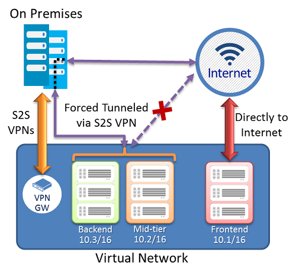

<properties 
   pageTitle="設定為使用資源管理員部署模型至網站連線強制通道 |Microsoft Azure"
   description="如何重新導向或所有的網際網路繫結流量 ' 強制' 返回您內部部署的位置。"
   services="vpn-gateway"
   documentationCenter="na"
   authors="cherylmc"
   manager="carmonm"
   editor=""
   tags="azure-resource-manager"/>
<tags 
   ms.service="vpn-gateway"
   ms.devlang="na"
   ms.topic="article"
   ms.tgt_pltfrm="na"
   ms.workload="infrastructure-services"
   ms.date="08/10/2016"
   ms.author="cherylmc" />

# 設定使用 Azure 資源管理員部署模型強制通道

> [AZURE.SELECTOR]
- [PowerShell-傳統](vpn-gateway-about-forced-tunneling.md)
- [PowerShell-資源管理員](vpn-gateway-forced-tunneling-rm.md)

強制通道可讓您重新導向或 「 強制 」 的所有網際網路繫結流量透過檢查及稽核網站-VPN 通道都返回您內部部署的位置。 這是大部分的企業 IT 重要的安全性需求原則。

不強制通道，從您的 Vm Azure 中的網際網路繫結流量會永遠從 Azure 網路基礎結構直接出往返至網際網路，而不允許您檢查或稽核流量的選項。 未經授權的存取網際網路造成資訊公開或其他類型的安全性漏洞

本文會引導您設定強制通道虛擬網路使用的資源管理員部署模型建立。

**關於 Azure 部署模型**

[AZURE.INCLUDE [vpn-gateway-clasic-rm](../../includes/vpn-gateway-classic-rm-include.md)] 

**部署模型和工具強制通道**

您可以設定強制通道連線傳統部署模型和資源管理員部署模型兩者均適用。 請參閱下表中的詳細資訊。 為新的文章，新的部署模型和其他工具會變成適用於此設定，我們就會更新此表格。 使用文件時，我們直接從連結資料表。

[AZURE.INCLUDE [vpn-gateway-table-forced-tunneling](../../includes/vpn-gateway-table-forcedtunnel-include.md)] 

## 關於強制通道

下圖說明如何強制通道運作。 

在上述範例中，不會被強迫子網路 Frontend 通道。 接受和回應客戶要求從網際網路直接可以繼續 Frontend 子網路中的工作量。 在多層和後端子網路強制通道。 從下列兩個子網路任何輸出連線到網際網路會強制或重新導向到其中一個 S2S VPN 通道透過內部部署網站。

這個選項可讓您限制，並檢查您的虛擬機器中的網際網路存取或同時，繼續啟用您所需的多層服務架構在雲端中 Azure 服務。 您也可以套用強制通道到整個虛擬網路如果虛擬網路中不有任何網際網路的工作量。

## 需求和考量

強制通道 Azure 中設定透過虛擬網路使用者定義的路徑。 Azure VPN 閘道器的預設路由，就會將流量重新導向至內部部署網站來表示。 如需有關使用者定義路由及虛擬網路的詳細資訊，請參閱[使用者定義的路徑及 IP 轉寄](../virtual-network/virtual-networks-udr-overview.md)。

- 每個虛擬網路的子網路會有一個內建的系統路由的資料表。 系統路由表有下列三個群組的路由︰

    - **本機 VNet 路由︰**直接到目的地 Vm 中相同的虛擬網路
    
    - **內部路由︰**Azure VPN 閘道
    
    - **預設路由︰**直接至網際網路。 指向 [私用的 IP 位址未涵蓋的上一個兩個路由封包會遭到捨棄。

-  此程序您 VNet 之後，若要啟用這些子網路強制通道建立路由資料表新增預設路由，並將產生關聯路由表使用使用者定義路由 (UDR)。

- 強制通道必須具有路由型閘道 VNet 與相關聯。 您需要設定 「 預設網站 」 之間跨內部部署本機網站連線至虛擬網路。

- 強制通道 ExpressRoute 未設定這個機制，透過，但反而會啟用通知的預設路由，透過 ExpressRoute BGP 對等工作階段。 請參閱[ExpressRoute 文件](https://azure.microsoft.com/documentation/services/expressroute/)，詳細的資訊。

## 設定概觀

下列程序可協助您建立資源群組及 VNet。 然後，您會建立 VPN 閘道器，並設定強制通道。 此程序，虛擬網路 「 多層 VNet 」 有 3 的子網路︰ *Frontend* *Midtier*，與*後端*，4 跨內部部署連線︰ *DefaultSiteHQ*和 3 的*分支*。

程序步驟*DefaultSiteHQ*設為預設網站連線強制通道，並設定 Midtier，若要使用的後端子網路強制通道。

    
## 開始之前

確認您有下列項目，才能開始您的設定。

- Azure 的訂閱。 如果您還沒有 Azure 的訂閱，您可以啟動您的[MSDN 訂閱者優惠](https://azure.microsoft.com/pricing/member-offers/msdn-benefits-details/)或註冊設定[免費的帳戶](https://azure.microsoft.com/pricing/free-trial/)。

- 您需要安裝最新版的 （1.0 或更新版本） 的 Azure 資源管理員 PowerShell 指令程式。 如需安裝的 PowerShell 指令程式的相關資訊，請參閱[如何安裝和設定 PowerShell 的 Azure](../powershell-install-configure.md) 。

## 設定 [強制通道

1. 在 PowerShell 主控台中，登入您的 Azure 帳戶。 這個指令程式會提示您登入認證，Azure 帳戶。 登入之後，下載您的帳戶設定，使其使用 PowerShell 的 Azure。

        Login-AzureRmAccount 

2. 取得您 Azure 訂閱的清單。

        Get-AzureRmSubscription

2. 指定您想要使用的訂閱。 

        Select-AzureRmSubscription -SubscriptionName "Replace_with_your_subscription_name"
        
3. 建立資源群組。

        New-AzureRmResourceGroup -Name "ForcedTunneling" -Location "North Europe"

4. 建立虛擬網路，並指定子網路。 

        $s1 = New-AzureRmVirtualNetworkSubnetConfig -Name "Frontend" -AddressPrefix "10.1.0.0/24"
        $s2 = New-AzureRmVirtualNetworkSubnetConfig -Name "Midtier" -AddressPrefix "10.1.1.0/24"
        $s3 = New-AzureRmVirtualNetworkSubnetConfig -Name "Backend" -AddressPrefix "10.1.2.0/24"
        $s4 = New-AzureRmVirtualNetworkSubnetConfig -Name "GatewaySubnet" -AddressPrefix "10.1.200.0/28"
        $vnet = New-AzureRmVirtualNetwork -Name "MultiTier-VNet" -Location "North Europe" -ResourceGroupName "ForcedTunneling" -AddressPrefix "10.1.0.0/16" -Subnet $s1,$s2,$s3,$s4

5. 建立區域網路閘道器。

        $lng1 = New-AzureRmLocalNetworkGateway -Name "DefaultSiteHQ" -ResourceGroupName "ForcedTunneling" -Location "North Europe" -GatewayIpAddress "111.111.111.111" -AddressPrefix "192.168.1.0/24"
        $lng2 = New-AzureRmLocalNetworkGateway -Name "Branch1" -ResourceGroupName "ForcedTunneling" -Location "North Europe" -GatewayIpAddress "111.111.111.112" -AddressPrefix "192.168.2.0/24"
        $lng3 = New-AzureRmLocalNetworkGateway -Name "Branch2" -ResourceGroupName "ForcedTunneling" -Location "North Europe" -GatewayIpAddress "111.111.111.113" -AddressPrefix "192.168.3.0/24"
        $lng4 = New-AzureRmLocalNetworkGateway -Name "Branch3" -ResourceGroupName "ForcedTunneling" -Location "North Europe" -GatewayIpAddress "111.111.111.114" -AddressPrefix "192.168.4.0/24"
        
6. 建立路由表和路由規則。

        New-AzureRmRouteTable –Name "MyRouteTable" -ResourceGroupName "ForcedTunneling" –Location "North Europe"
        $rt = Get-AzureRmRouteTable –Name "MyRouteTable" -ResourceGroupName "ForcedTunneling" 
        Add-AzureRmRouteConfig -Name "DefaultRoute" -AddressPrefix "0.0.0.0/0" -NextHopType VirtualNetworkGateway -RouteTable $rt
        Set-AzureRmRouteTable -RouteTable $rt

7. 建立 Midtier 和後端子網路路由表格之間的關聯。

        $vnet = Get-AzureRmVirtualNetwork -Name "MultiTier-Vnet" -ResourceGroupName "ForcedTunneling"
        Set-AzureRmVirtualNetworkSubnetConfig -Name "MidTier" -VirtualNetwork $vnet -AddressPrefix "10.1.1.0/24" -RouteTable $rt
        Set-AzureRmVirtualNetworkSubnetConfig -Name "Backend" -VirtualNetwork $vnet -AddressPrefix "10.1.2.0/24" -RouteTable $rt
        Set-AzureRmVirtualNetwork -VirtualNetwork $vnet

8. 使用預設網站建立閘道器。 這個步驟需要一些時間才能完成，有時候 45 分鐘或更多]，因為您建立並的閘道器設定。  `-GatewayDefaultSite`是 cmdlet 的參數，可讓強制路由設定行不通，因此請注意設定此設定正確。 使用 PowerShell 1.0 或更新版本，則此參數。

        $pip = New-AzureRmPublicIpAddress -Name "GatewayIP" -ResourceGroupName "ForcedTunneling" -Location "North Europe" -AllocationMethod Dynamic
        $gwsubnet = Get-AzureRmVirtualNetworkSubnetConfig -Name "GatewaySubnet" -VirtualNetwork $vnet
        $ipconfig = New-AzureRmVirtualNetworkGatewayIpConfig -Name "gwIpConfig" -SubnetId $gwsubnet.Id -PublicIpAddressId $pip.Id
        New-AzureRmVirtualNetworkGateway -Name "Gateway1" -ResourceGroupName "ForcedTunneling" -Location "North Europe" -IpConfigurations $ipconfig -GatewayType Vpn -VpnType RouteBased -GatewayDefaultSite $lng1 -EnableBgp $false

9. 建立網站-VPN 連線。

        $gateway = Get-AzureRmVirtualNetworkGateway -Name "Gateway1" -ResourceGroupName "ForcedTunneling"
        $lng1 = Get-AzureRmLocalNetworkGateway -Name "DefaultSiteHQ" -ResourceGroupName "ForcedTunneling" 
        $lng2 = Get-AzureRmLocalNetworkGateway -Name "Branch1" -ResourceGroupName "ForcedTunneling" 
        $lng3 = Get-AzureRmLocalNetworkGateway -Name "Branch2" -ResourceGroupName "ForcedTunneling" 
        $lng4 = Get-AzureRmLocalNetworkGateway -Name "Branch3" -ResourceGroupName "ForcedTunneling" 

        New-AzureRmVirtualNetworkGatewayConnection -Name "Connection1" -ResourceGroupName "ForcedTunneling" -Location "North Europe" -VirtualNetworkGateway1 $gateway -LocalNetworkGateway2 $lng1 -ConnectionType IPsec -SharedKey "preSharedKey"
        New-AzureRmVirtualNetworkGatewayConnection -Name "Connection2" -ResourceGroupName "ForcedTunneling" -Location "North Europe" -VirtualNetworkGateway1 $gateway -LocalNetworkGateway2 $lng2 -ConnectionType IPsec -SharedKey "preSharedKey"
        New-AzureRmVirtualNetworkGatewayConnection -Name "Connection3" -ResourceGroupName "ForcedTunneling" -Location "North Europe" -VirtualNetworkGateway1 $gateway -LocalNetworkGateway2 $lng3 -ConnectionType IPsec -SharedKey "preSharedKey"
        New-AzureRmVirtualNetworkGatewayConnection -Name "Connection4" -ResourceGroupName "ForcedTunneling" -Location "North Europe" -VirtualNetworkGateway1 $gateway -LocalNetworkGateway2 $lng4 -ConnectionType IPsec -SharedKey "preSharedKey"

        Get-AzureRmVirtualNetworkGatewayConnection -Name "Connection1" -ResourceGroupName "ForcedTunneling"
        

