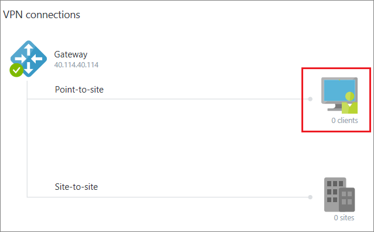
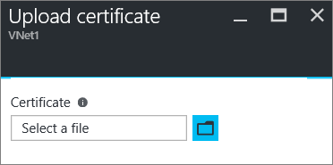

<properties
   pageTitle="設定點為網站 VPN 閘道器連線到使用 Azure 入口網站 Azure 虛擬網路 |Microsoft Azure"
   description="安全地連結至 Azure 虛擬網路藉由建立使用 Azure 中心點為網站 VPN 閘道器連線。"
   services="vpn-gateway"
   documentationCenter="na"
   authors="cherylmc"
   manager="carmonm"
   editor=""
   tags="azure-service-management"/>

<tags
   ms.service="vpn-gateway"
   ms.devlang="na"
   ms.topic="hero-article"
   ms.tgt_pltfrm="na"
   ms.workload="infrastructure-services"
   ms.date="10/17/2016"
   ms.author="cherylmc"/>

# 設定點為網站連線至 VNet，使用 [Azure 入口網站

> [AZURE.SELECTOR]
- [資源管理員-Azure 入口網站](vpn-gateway-howto-point-to-site-resource-manager-portal.md)
- [資源管理員-PowerShell](vpn-gateway-howto-point-to-site-rm-ps.md)
- [傳統-Azure 入口網站](vpn-gateway-howto-point-to-site-classic-azure-portal.md)

本文會引導您以點為網站連線在傳統的部署模型中使用 [Azure 入口網站中建立 VNet。 點網站 (P2S) 設定，可讓您建立虛擬網路個別的用戶端電腦從安全的連線。 P2S 連線時，您要連線到您 VNet 從遠端位置，例如從家用版或會議。 或者，當您只需要幾個需要連線到虛擬網路的用戶端。

點-網站的連線不需要 VPN 裝置或-在公開的 IP 位址搭配使用。 從用戶端電腦開始連線建立 VPN 連線時。 如需有關點為網站連線的詳細資訊，請參閱[VPN 閘道器常見問題集](vpn-gateway-vpn-faq.md#point-to-site-connections)和[VPN 閘道器相關](vpn-gateway-about-vpngateways.md#point-to-site)。

### 部署模型和 P2S 連線的方法

[AZURE.INCLUDE [deployment models](../../includes/vpn-gateway-deployment-models-include.md)] 

下表顯示的兩種部署模型及部署 P2S 設定的方法。 當有包含設定步驟的文章時，我們連結直接從這個資料表。

[AZURE.INCLUDE [vpn-gateway-clasic-rm](../../includes/vpn-gateway-table-point-to-site-include.md)] 

## 基本的工作流程 

下列各節會引導您完成建立安全點為網站連線至虛擬網路的步驟。 

1. 建立一個虛擬網路和 VPN 閘道器
2. 產生的憑證
3. .Cer 檔案上傳
4. 產生 VPN 用戶端設定套件
5. 設定用戶端電腦
6. 連線至 Azure

### 範例設定

您可以使用下列範例設定︰

- **名稱︰ VNet1**
- **地址空間︰ 192.168.0.0/16**
- **子網路名稱︰ 主選單**
- **子網路位址範圍︰ 192.168.1.0/24**
- **訂閱︰**如果您有多個訂閱，請確認您使用的正確的項目。
- **資源群組︰ TestRG**
- **位置︰ 東亞美國**
- **連線類型︰ 點-網站**
- **用戶端位址空間︰ 172.16.201.0/24**。 使用此點為網站連線 VNet 連線的 VPN 用戶端從指定的集區接收 IP 位址。
- **GatewaySubnet: 192.168.200.0/24**。 閘道器子網路必須使用 「 GatewaySubnet 」 的名稱。
- **大小︰**選取您想要使用的 SKU 的閘道器。
- **路由類型︰ 動態**

## 區段 1-建立虛擬網路和 VPN 閘道器

### 第 1 部分︰ 建立虛擬網路

如果您還沒有虛擬網路，建立一個。 螢幕擷取畫面所提供的範例。 請務必的值取代為您自己。 若要建立 VNet 使用 Azure 入口網站，請使用下列步驟︰ 

1. 從瀏覽器中，瀏覽至[Azure 入口網站](http://portal.azure.com)，如果有需要，請登入您的 Azure 帳戶。

2. 按一下 [**新增**]。 在 [**搜尋服務商場**] 欄位中，輸入 「 虛擬網路 」。 從 [傳回] 清單中尋找**虛擬網路**，然後按一下以開啟**虛擬網路**刀。

    

3. 靠近底部的虛擬網路刀，從**選取的部署模型**] 清單中，選取**傳統**，然後再按一下 [**建立**]。

    

4. 在**建立虛擬網路**防禦，以設定 VNet 設定。 在此刀，您可以新增您的第一個位址空間] 和 [單一子位址範圍。 建立 VNet 完成之後，您可以返回並新增其他的子網路和地址空格。

    

5. 確認**訂閱**正確。 您可以使用下拉式清單，以變更訂閱。

6. 按一下 [**資源群組**，然後選取現有的資源群組，或建立新輸入新的資源群組的名稱。 如果您要建立新的群組，名稱會依據您計劃的設定值的 [資源] 群組。 如需有關資源群組的詳細資訊，請造訪[Azure 資源管理員的概觀](azure-resource-manager/resource-group-overview.md#resource-groups)。

7. 接下來，請選取您 VNet 的**位置**設定。 位置會決定您部署到此 VNet 資源所在的位置。

8. 如果您想要能夠輕鬆地在儀表板上尋找您 VNet，然後按一下 [**建立**，請選取 [**固定至儀表板**。
    
    

9. 後按一下 [建立]，您會看到一個磚會反映您 VNet 的進度您儀表板上。 正在建立 VNet 變成磚。

    

10. 建立虛擬網路之後，您可以新增 DNS 伺服器 IP 的位址，才能處理名稱解析。 開啟 [虛擬網路設定 DNS 伺服器，然後按一下新增的 DNS 伺服器，您想要使用的 IP 位址。 此設定不會建立新的 DNS 伺服器。 請確定您要新增您的資源可以與通訊的 DNS 伺服器。

一旦建立虛擬網路，您會看到**建立**列出 [Azure 傳統入口網站中的 [網路] 頁面上的 [**狀態**] 下。

### 第 2 部分︰ 建立閘道器子網路和動態路由閘道器

在此步驟中，您將建立閘道器子網路和動態路由閘道器。 在傳統部署模型 Azure 入口網站，可以透過相同的設定刀完成建立閘道器子網路和閘道器。

1. 在入口網站，瀏覽至您要建立閘道器的虛擬網路。

2. 在刀虛擬網路，在**概觀**刀，在 [VPN 連線] 區段中，按一下 [**閘道器**]。

    

3. 在**新的 VPN 連線**刀中，選取 [**點-網站**。

    

4. 如需**用戶端位址空間**，新增 [IP 位址範圍。 這是從 VPN 用戶端會收到的 IP 位址連線時的範圍。 刪除自動填滿的範圍，然後新增您自己。

    

5. 選取**立即建立閘道器**核取方塊。

    

6. 按一下以開啟 [**閘道器組態**刀**選擇性的閘道器設定**。

    

7. 按一下 [新增**閘道器子網路**的**子網路設定所需的設定**。 雖然可以建立閘道器子網路 /29 小，我們建議您建立較大的子網路選取至少 /28 或 /27 包含多個地址。 這可讓足夠的地址，以容納，您可以在未來可能額外設定。

    >[AZURE.IMPORTANT] 使用 [閘道器子網路工作時，避免建立關聯的閘道器子網路網路安全性群組 (NSG)。 建立子網路網路安全性群組的關聯，可能會導致 VPN 閘道停止如預期般運作。 如需有關網路安全性群組的詳細資訊，請參閱[什麼是網路安全性群組？](../articles/virtual-network/virtual-networks-nsg.md)

    

8. 選取 [閘道器的 [**大小**]。 這是您將會用來建立您的虛擬網路閘道器的 SKU 的閘道器。 在入口網站中，預設的 SKU 是**基本**。 如需有關閘道器 Sku 的詳細資訊，請參閱[關於 VPN 閘道器設定](../articles/vpn-gateway/vpn-gateway-about-vpn-gateway-settings.md#gwsku)。

    

9. 選取您的閘道器的**路由類型**。 P2S 設定需要**動態**路由類型。 當您完成設定此刀時，請按一下**[確定]** 。

    

10. 在**新 VPN 連線**刀中，按一下 [**確定**刀底部，開始建立您的虛擬網路閘道器。 此花費 45 分鐘才能完成。 

## 第 2 節-產生的憑證

Azure 會使用憑證驗證的點為網站 Vpn VPN 用戶端。 為 64 基本編碼 X.509.cer 檔案從企業憑證解決方案，所產生的根憑證或自我簽署的根憑證，您就會匯出公用憑證資料 （非私密金鑰）。 您然後資料匯入公用憑證根憑證至 Azure。 此外，您需要從根憑證的用戶端憑證產生的用戶端。 想要連線至虛擬網路使用 P2S 連線每個用戶端必須從根憑證產生的用戶端憑證安裝。

### 第 1 部分︰ 取得根憑證.cer 檔案

如果您使用的企業方案，您可以使用您現有的憑證鏈結。 如果您不使用企業 CA 解決方案，您可以建立自我簽署的根憑證。 建立自我簽署的憑證的其中一個方法是 makecert。

- 如果您使用的企業憑證系統，取得您想要使用的根憑證的.cer 檔案。 

- 如果您不使用企業憑證解決方案，您需要產生自我簽署的根憑證。 在 Windows 10 的步驟，您可以使用[自我簽署的根憑證點為網站設定](vpn-gateway-certificates-point-to-site.md)參考。

1. 若要取得.cer 檔案從憑證，請開啟**certmgr.msc**並找出根憑證。 以滑鼠右鍵按一下自我簽署的根憑證，按一下 [**全部任務**]，再按一下 [**匯出**。 這會開啟 [**憑證匯出精靈**]。

2. 在精靈中，按一下 [**下一步****否，不會匯出私密金鑰**]，然後選取然後按 [**下一步**。

3. 在 [**匯出檔案格式**] 頁面上選取**64 基本編碼 X.509 (。CER)。** 然後，請按一下 [**下一步**]。 

4. 在**[要匯出的檔案**，**瀏覽**到您要匯出的憑證的位置。 [**檔案名稱**] 中，名稱憑證檔案。 然後按一下 [**下一步**。

5. 按一下 [**完成**]，匯出的憑證。

### 第 2 部分︰ 產生的用戶端憑證

您可以產生的唯一的憑證每個用戶端連線，或您可以在多個用戶端上使用相同的憑證。 產生唯一的用戶端憑證的優點是撤銷單一憑證，如有需要的能力。 否則，如果每個人都使用相同的用戶端憑證，而您找到您需要撤銷一部用戶端的憑證，您必須以產生及所有使用該憑證驗證的用戶端安裝新的憑證。

- 如果您使用的企業憑證解決方案，產生的常見的名稱值格式的用戶端憑證'name@yourdomain.com',而不是 「 網域 name\username 」 格式。 

- 如果您使用自我簽署的憑證，請參閱[使用點為網站設定自我簽署的根憑證](vpn-gateway-certificates-point-to-site.md)產生的用戶端憑證。

### 第 3 部分︰ 匯出用戶端憑證

在每個您想要連線至虛擬網路的電腦上安裝的用戶端憑證。 需要驗證的用戶端憑證。 您可以自動安裝用戶端憑證，或者您可以手動安裝。 下列步驟會引導您匯出及手動安裝用戶端憑證。

1. 若要匯出的用戶端憑證，您可以使用*certmgr.msc*。 以滑鼠右鍵按一下您想要匯出，按一下 [**所有任務**，再按一下 [**匯出**用戶端憑證。
2. 匯出私密金鑰的用戶端憑證。 這是*.pfx*檔。 請務必記錄，或請記住，您設定這個憑證的密碼 （按鍵）。

## 第 3 節-上傳根憑證.cer 檔案

在建立閘道器之後，您可以為受信任的根憑證.cer 檔案上傳至 Azure。 您可以上傳檔案的 20 個根憑證。 您不上載至 Azure 私密金鑰的根憑證。 上傳的.cer 檔案後 Azure 會用它來驗證連線至虛擬網路的用戶端。

1. 在針對您 VNet 刀**VPN 連線**區段中，按一下 [**用戶端**圖片來開啟**點對網站 VPN 連線**刀。

    

2. **點-網站連線**刀，按一下 [開啟**憑證**刀**管理憑證**。 

      

3. 在 [**憑證**刀中，按一下 [開啟**上傳憑證**刀的 [**上傳**]。 

     

4. 按一下以瀏覽.cer 檔案的資料夾圖片。 選取檔案，然後按一下**[確定**]。 重新整理頁面，若要查看**憑證**刀上傳的憑證。

     
    

## 區段 4-產生 VPN 用戶端設定套件

若要連線至虛擬網路，您也需要 VPN 用戶端設定。 用戶端電腦需要用戶端憑證和適當的 VPN 用戶端設定套件，才能將連線。

VPN 用戶端套件包含設定 Windows 的內建的 VPN 用戶端軟體的設定資訊。 封裝不會安裝其他軟體。 設定專屬於您要連線至虛擬網路。 用戶端支援的作業系統的清單，請參閱[點-網站連線](vpn-gateway-vpn-faq.md#point-to-site-connections)VPN 閘道器常見問題集的一部分。 

### 若要產生 VPN 用戶端設定套件

1. Azure 入口網站，在您 VNet，在**VPN 連線**] 中的**概觀**刀中按一下 [用戶端圖片來開啟**點對網站 VPN 連線**刀。
2. 按一下頂端的**點對網站 VPN 連線**刀，按一下 [對應至用戶端的作業系統，將會安裝下載套件︰

 - 64 位元的用戶端，請選取 [ **VPN 用戶端 （64 位元）**]。
 - 32 位元的用戶端，請選取 [ **VPN 用戶端 （32 位元）**]。

     

3. 您會看到 Azure 產生的虛擬網路 VPN 用戶端設定套件的訊息。 請稍候幾分鐘套件會產生且套件已下載的本機電腦上，就會顯示一則訊息。 儲存設定套件檔案。 您將會安裝此每個用戶端電腦會連線到使用 P2S 虛擬網路上。

## 步驟 5-設定用戶端電腦

### 第 1 部分︰ 安裝用戶端憑證

每個用戶端電腦必須用戶端憑證以進行驗證。 安裝用戶端憑證，您必須匯出用戶端憑證時所建立的密碼。

1. 將.pfx 檔複製到 [用戶端電腦。
2. 按兩下.pfx 檔，進行安裝。 請勿修改安裝位置。

### 第 2 部分︰ 安裝 VPN 用戶端設定套件

所提供的版本符合架構的用戶端，您可以在每個用戶端電腦上使用相同的 VPN 用戶端設定套件。

1. 將設定檔複製到您要連線到您的虛擬網路並按兩下.exe 檔案的電腦的本機。 

2. 套件已安裝後，您就可以開始 VPN 連線。 設定封裝不是由 Microsoft 簽署。 您可能會想要簽署的套件使用貴組織的簽章的服務，或您自己使用[簽署工具]( http://go.microsoft.com/fwlink/p/?LinkId=699327)登。 是 [確定] 以使用封裝沒有登入。 不過，如果未簽署套件，當您安裝套件時就會出現警告。

3. 用戶端電腦上，瀏覽至 [**網路設定**，然後按一下 [ **VPN**]。 您會看到所列的連線。 它會顯示虛擬網路的名稱，並將連接到且看起來像這樣︰ 

    

## 區段 6-連線至 Azure

### 連線到您 VNet

1. 若要連線到您 VNet，用戶端電腦上，瀏覽至 VPN 連線，找出您建立 VPN 連線。 名稱虛擬網路相同的名稱。 按一下 [**連線**]。 可能會出現快顯的訊息參照到使用的憑證。 如果這種情況，請按一下 [**繼續**] 以使用提高權限的權限。 

2. 在 [**連線**狀態] 頁面中，按一下 [**連線**]，開始連線。 如果您看到**選取憑證]**畫面，請確認顯示的用戶端憑證的您要用來連線。 如果不是，選取正確的認證，請使用下拉式箭號，然後按一下**[確定]**。

    

3. 現在應該建立您的連線。

    

### 確認 VPN 連線

1. 若要確認您的 VPN 連線作用中，開啟提高權限的命令提示字元中，並執行*ipconfig/所有*。
2. 檢視結果。 請注意，您所收到的 IP 位址是其中一個指定當您建立您 VNet 點為網站連線的地址範圍內的地址。 結果應該是類似以下內容︰

範例︰

    PPP adapter VNet1:
        Connection-specific DNS Suffix .:
        Description.....................: VNet1
        Physical Address................:
        DHCP Enabled....................: No
        Autoconfiguration Enabled.......: Yes
        IPv4 Address....................: 192.168.130.2(Preferred)
        Subnet Mask.....................: 255.255.255.255
        Default Gateway.................:
        NetBIOS over Tcpip..............: Enabled

## 後續步驟

您可以新增虛擬機器至虛擬網路。 瞭解[如何建立自訂的虛擬機器](../virtual-machines/virtual-machines-windows-classic-createportal.md)。