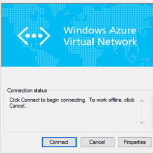

<properties 
   pageTitle="設定點為網站 VPN 閘道器連線到使用資源管理員部署模型和 Azure 入口網站的虛擬網路 |Microsoft Azure"
   description="安全地連結至 Azure 虛擬網路藉由建立點為網站 VPN 閘道器連線使用資源管理員和 Azure 入口網站。"
   services="vpn-gateway"
   documentationCenter="na"
   authors="cherylmc"
   manager="carmonm"
   editor=""
   tags="azure-resource-manager"/>
<tags 
   ms.service="vpn-gateway"
   ms.devlang="na"
   ms.topic="hero-article"
   ms.tgt_pltfrm="na"
   ms.workload="infrastructure-services"
   ms.date="10/17/2016"
   ms.author="cherylmc" />

# 設定點為網站連線至 VNet，使用 [Azure 入口網站

> [AZURE.SELECTOR]
- [資源管理員-Azure 入口網站](vpn-gateway-howto-point-to-site-resource-manager-portal.md)
- [資源管理員-PowerShell](vpn-gateway-howto-point-to-site-rm-ps.md)
- [傳統-Azure 入口網站](vpn-gateway-howto-point-to-site-classic-azure-portal.md)

點網站 (P2S) 設定，可讓您建立虛擬網路個別的用戶端電腦從安全的連線。 當您要連線到您 VNet 從遠端位置，例如從家用版或會議，或您只需要幾個需要連線到虛擬網路的用戶端，P2S 連線相當實用。 

點-網站的連線不需要 VPN 裝置或-在公開的 IP 位址搭配使用。 從用戶端電腦開始連線建立 VPN 連線時。 如需有關點為網站連線的詳細資訊，請參閱[VPN 閘道器常見問題集](vpn-gateway-vpn-faq.md#point-to-site-connections)和[規劃及設計](vpn-gateway-plan-design.md)。

本文會引導您以點為網站連線資源管理員部署模型使用 Azure 入口網站中建立 VNet。

### 部署模型和 P2S 連線的方法

[AZURE.INCLUDE [deployment models](../../includes/vpn-gateway-deployment-models-include.md)] 

下表顯示的兩種部署模型及部署 P2S 設定的方法。 當有包含設定步驟的文章時，我們連結直接從這個資料表。

[AZURE.INCLUDE [vpn-gateway-clasic-rm](../../includes/vpn-gateway-table-point-to-site-include.md)] 

## 基本的工作流程 

### 範例值

- **名稱︰ VNet1**
- **地址空間︰ 192.168.0.0/16** 例如，我們使用只有一個位址空間。 您可以針對您 VNet 有一個以上的地址空格。
- **子網路名稱︰ 主選單**
- **子網路位址範圍︰ 192.168.1.0/24**
- **訂閱︰**如果您有多個訂閱，請確認您使用的正確的項目。
- **資源群組︰ TestRG**
- **位置︰ 東亞美國**
- **GatewaySubnet: 192.168.200.0/24**
- **虛擬網路閘道器名稱︰ VNet1GW**
- **閘道器類型︰ VPN**
- **VPN 類型︰ 傳送型**
- **公用 IP 位址︰ VNet1GWpip**
- **連線類型︰ 點-網站**
- **用戶端位址集區︰ 172.16.201.0/24** 使用此點為網站連線 VNet 連線的 VPN 用戶端收到 IP 位址從用戶端位址集區。

## 在開始之前

- 請確認您擁有 Azure 訂閱。 如果您還沒有 Azure 的訂閱，您可以啟動您的[MSDN 訂閱者優惠](https://azure.microsoft.com/pricing/member-offers/msdn-benefits-details/)或註冊設定[免費的帳戶](https://azure.microsoft.com/pricing/free-trial/)。
    
## 第 1 部分-建立虛擬網路

如果您正在建立練習此設定，您可以參照的[範例值](#example)。

[AZURE.INCLUDE [vpn-gateway-basic-vnet-rm-portal](../../includes/vpn-gateway-basic-vnet-rm-portal-include.md)]  

### 2.新增額外的位址空間和子網路

您可以新增額外的位址空間和子網路您 VNet，只要建立之後。

[AZURE.INCLUDE [vpn-gateway-additional-address-space](../../includes/vpn-gateway-additional-address-space-include.md)] 

### 3.建立閘道器子網路

之前將虛擬的網路連線到閘道器，您必須建立閘道器網路的子虛擬您要連線。 如果可能的話，最好建立閘道器子網路使用 CIDR 區塊 /28 或 /27 才能提供足夠的 IP 位址，以容納其他未來設定需求。

本節中的螢幕擷取畫面會提供參照範例。 請務必對應的 GatewaySubnet 位址範圍使用您設定的必要的值。

#### 若要建立閘道器子網路

[AZURE.INCLUDE [vpn-gateway-add-gwsubnet-rm-portal](../../includes/vpn-gateway-add-gwsubnet-rm-portal-include.md)]

### 4.指定 DNS 伺服器 （選用）

[AZURE.INCLUDE [vpn-gateway-add-dns-rm-portal](../../includes/vpn-gateway-add-dns-rm-portal-include.md)]

## 第 2 部分-建立虛擬網路閘道器

點-網站的連線需要下列設定︰

- 閘道器類型︰ VPN
- VPN 類型︰ 傳送型

### 若要建立虛擬網路閘道器

[AZURE.INCLUDE [vpn-gateway-add-gw-rm-portal](../../includes/vpn-gateway-add-gw-rm-portal-include.md)]

## 第 3 部分-產生的憑證

Azure 會使用憑證驗證的點為網站 Vpn VPN 用戶端。 為 64 基本編碼 X.509.cer 檔案從企業憑證解決方案，所產生的根憑證或自我簽署的根憑證，您就會匯出公用憑證資料 （非私密金鑰）。 您然後資料匯入公用憑證根憑證至 Azure。 此外，您需要從根憑證的用戶端憑證產生的用戶端。 想要連線至虛擬網路使用 P2S 連線每個用戶端必須從根憑證產生的用戶端憑證安裝。

### 1.取得根憑證的.cer 檔案

如果您使用的企業方案，您可以使用您現有的憑證鏈結。 如果您不使用企業 CA 解決方案，您可以建立自我簽署的根憑證。 建立自我簽署的憑證的其中一個方法是 makecert。

- 如果您使用的企業憑證系統，取得您想要使用的根憑證的.cer 檔案。 

- 如果您不使用企業憑證解決方案，您需要產生自我簽署的根憑證。 在 Windows 10 的步驟，您可以使用[自我簽署的根憑證點為網站設定](vpn-gateway-certificates-point-to-site.md)參考。

1. 若要取得.cer 檔案從憑證，請開啟**certmgr.msc**並找出根憑證。 以滑鼠右鍵按一下自我簽署的根憑證，按一下 [**全部任務**]，再按一下 [**匯出**。 這會開啟 [**憑證匯出精靈**]。

2. 在精靈中，按一下 [**下一步****否，不會匯出私密金鑰**]，然後選取然後按 [**下一步**。

3. 在 [**匯出檔案格式**] 頁面上選取**64 基本編碼 X.509 (。CER)。** 然後，請按一下 [**下一步**]。 

4. 在**[要匯出的檔案**，**瀏覽**到您要匯出的憑證的位置。 [**檔案名稱**] 中，名稱憑證檔案。 然後按一下 [**下一步**。

5. 按一下 [**完成**]，匯出的憑證。

### 2.產生的用戶端憑證

您可以產生的唯一的憑證每個用戶端連線，或您可以在多個用戶端上使用相同的憑證。 產生唯一的用戶端憑證的優點是撤銷單一憑證，如有需要的能力。 否則，如果每個人都使用相同的用戶端憑證，而您找到您需要撤銷一部用戶端的憑證，您必須以產生及所有使用該憑證驗證的用戶端安裝新的憑證。

- 如果您使用的企業憑證解決方案，產生的常見的名稱值格式的用戶端憑證'name@yourdomain.com',而不是 「 網域 name\username 」 格式。 

- 如果您使用自我簽署的憑證，請參閱[使用點為網站設定自我簽署的根憑證](vpn-gateway-certificates-point-to-site.md)產生的用戶端憑證。

### 3.匯出用戶端憑證

需要驗證的用戶端憑證。 產生之後的用戶端憑證，請將其匯出。 將每個用戶端電腦上稍後安裝您匯出的用戶端憑證。

1. 若要匯出的用戶端憑證，您可以使用*certmgr.msc*。 以滑鼠右鍵按一下您想要匯出，按一下 [**所有任務**，再按一下 [**匯出**用戶端憑證。
2. 匯出私密金鑰的用戶端憑證。 這是*.pfx*檔。 請務必記錄，或請記住，您設定這個憑證的密碼 （按鍵）。

## 第 4 部分-新增用戶端位址集區

1. 一旦建立虛擬網路閘道器，瀏覽至 [**設定**] 區段的虛擬網路閘道器刀。 在 [**設定**] 區段中，按一下 [**點-網站設定**開啟**設定**刀。

    

2. **地址集區**是從連線的用戶端會收到的 IP 位址的 IP 位址的資料庫。 新增地址集區，然後再按一下 [**儲存**]。

    

## 第 5 部分-上傳的根憑證.cer 檔案

在建立閘道器之後，您可以為受信任的根憑證.cer 檔案上傳至 Azure。 您可以上傳檔案的 20 個根憑證。 您不上載至 Azure 私密金鑰的根憑證。 上傳的.cer 檔案後 Azure 會用它來驗證連線至虛擬網路的用戶端。

1. 瀏覽至**點-網站組態**刀。 在此刀的**根憑證**區段中，您將加入.cer 檔案。

    

2. 請確定您匯出的根憑證，因為 64 基本編碼 X.509 (.cer) 檔案。 您需要將其匯出此格式，讓您可以使用文字編輯器中開啟憑證。
3. 使用 「 記事本 」 等文字編輯器中開啟憑證。 複製 [下一節︰

    

4. 將憑證資料貼到 [**公用憑證資料**區段中的入口網站。 **名稱**空格中，將憑證的名稱，然後再按一下 [**儲存**。 您可以新增 20 個信任的根憑證。

    

## 組件 6-下載並安裝 VPN 用戶端設定套件

用戶端連線至 Azure 使用 P2S 必須有一個用戶端憑證和安裝 VPN 用戶端設定套件。 VPN 用戶端設定套件可供 Windows 用戶端。 

VPN 用戶端套件包含設定 Windows 內建的 VPN 用戶端軟體的資訊。 設定是 VPN 連線到您想要的特定項目。 封裝不會安裝其他軟體。 請參閱[VPN 閘道器常見問題集](vpn-gateway-vpn-faq.md#point-to-site-connections)的詳細資訊。

1. **點-網站設定**刀，按一下 [開啟**下載的 VPN 用戶端**刀**下載 VPN 用戶端**。

    

2. 針對您的用戶端中，選取正確的套件，然後按一下 [**下載**]。 64 位元的用戶端，請選取 [ **AMD64**]。 32 位元的用戶端，請選取 [ **x86**]。

3. 用戶端電腦上安裝套件。 如果您收到 SmartScreen 快顯視窗，請按一下 [**詳細資訊**，然後才能安裝套件的 [**繼續執行**。

4. 用戶端電腦上，瀏覽至 [**網路設定**，然後按一下 [ **VPN**]。 您會看到所列的連線。 隨即會顯示的名稱會連線至的虛擬網路和看起來類似此範例中︰ 

    

## 第 7-安裝用戶端憑證

每個用戶端電腦必須用戶端憑證以進行驗證。 安裝用戶端憑證，您必須匯出用戶端憑證時所建立的密碼。

1. 將.pfx 檔複製到 [用戶端電腦。
2. 按兩下.pfx 檔，進行安裝。 請勿修改安裝位置。

## 第 8-連線至 Azure

1. 若要連線到您 VNet，用戶端電腦上，瀏覽至 VPN 連線，找出您建立 VPN 連線。 名稱虛擬網路相同的名稱。 按一下 [**連線**]。 可能會出現快顯的訊息參照到使用的憑證。 如果這種情況，請按一下 [**繼續**] 以使用提高權限的權限。 

2. 在 [**連線**狀態] 頁面中，按一下 [**連線**]，開始連線。 如果您看到**選取憑證]**畫面，請確認顯示的用戶端憑證的您要用來連線。 如果不是，選取正確的認證，請使用下拉式箭號，然後按一下**[確定]**。

    

3. 現在應該建立您的連線。

    

## 第 9-驗證您的連線

1. 若要確認您的 VPN 連線作用中，開啟提高權限的命令提示字元中，並執行*ipconfig/所有*。

2. 檢視結果。 請注意，您所收到的 IP 位址是其中一個中點對網站 VPN 用戶端位址集區設定中指定的地址。 結果應該是類似以下內容︰
    
        PPP adapter VNet1:
            Connection-specific DNS Suffix .:
            Description.....................: VNet1
            Physical Address................:
            DHCP Enabled....................: No
            Autoconfiguration Enabled.......: Yes
            IPv4 Address....................: 172.16.201.3(Preferred)
            Subnet Mask.....................: 255.255.255.255
            Default Gateway.................:
            NetBIOS over Tcpip..............: Enabled

## 若要新增或移除受信任的根憑證

您可以從 Azure 移除受信任的根憑證。 當您移除受信任的憑證時，從根憑證產生的用戶端憑證會無法連線至 Azure 透過點到網站。 如果您想用戶端連線時，他們必須安裝新的用戶端憑證產生從 Azure 中信任的憑證。

您可以管理撤銷的用戶端憑證**點-網站設定清單**刀。 這是您用來[上傳信任的根憑證](#uploadfile)刀。

## 若要管理的清單已撤銷用戶端憑證

您可以撤銷用戶端憑證。 憑證撤銷清單可讓您可以選擇性地拒絕個別的用戶端憑證以點為網站連線。 如果您是從 Azure 移除根憑證.cer，它會撤銷所有用戶端憑證產生/簽章來撤銷的根憑證存取。 如果您想要撤銷特定的用戶端憑證，不根目錄，您可以執行此作業。 如此一來從根憑證產生的憑證仍會是有效的。 

常見的做法是使用根憑證時使用的個別使用者的微調存取控制撤銷的用戶端憑證管理小組或組織層級的存取權。

您可以管理撤銷的用戶端憑證**點-網站設定清單**刀。 這是您用來[上傳信任的根憑證](#uploadfile)刀。

## 後續步驟

您可以新增虛擬機器至虛擬網路。 如需的步驟，請參閱[建立虛擬機器](../virtual-machines/virtual-machines-windows-hero-tutorial.md)。