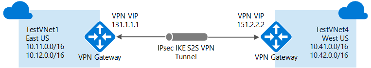

<properties
   pageTitle="連線 VNets 資源管理員部署模型和 Azure 入口網站使用 |Microsoft Azure"
   description="建立 VPN 閘道器之間的連線 VNets 使用資源管理員和 Azure 入口網站。"
   services="vpn-gateway"
   documentationCenter="na"
   authors="cherylmc"
   manager="carmonm"
   editor=""
   tags="azure-resource-manager"/>
<tags
   ms.service="vpn-gateway"
   ms.devlang="na"
   ms.topic="hero-article"
   ms.tgt_pltfrm="na"
   ms.workload="infrastructure-services"
   ms.date="10/25/2016"
   ms.author="cherylmc" />

# 使用 [Azure 入口網站 VNet-VNet 連線的設定

> [AZURE.SELECTOR]
- [資源管理員-Azure 入口網站](vpn-gateway-howto-vnet-vnet-resource-manager-portal.md)
- [資源管理員-PowerShell](vpn-gateway-vnet-vnet-rm-ps.md)
- [傳統-傳統入口網站](virtual-networks-configure-vnet-to-vnet-connection.md)

本文會引導您將建立在資源管理員部署模型中使用 VPN 閘道和 Azure 入口網站的 VNets 之間的連線的步驟。

當您使用 Azure 入口網站虛擬網路連線時，VNets 必須在同一份訂閱。 如果您的虛擬網路在不同的訂閱，您還是可以連接他們使用[PowerShell](vpn-gateway-vnet-vnet-rm-ps.md)步驟。

### 部署模型和 VNet-VNet 連線的方法

[AZURE.INCLUDE [deployment models](../../includes/vpn-gateway-deployment-models-include.md)]

下表顯示目前可用的部署模型和 VNet-VNet 設定的方法。 當有包含設定步驟的文章時，我們連結直接從這個資料表。

[AZURE.INCLUDE [vpn-gateway-table-vnet-vnet](../../includes/vpn-gateway-table-vnet-to-vnet-include.md)]

#### 對等 VNet

[AZURE.INCLUDE [vpn-gateway-vnetpeeringlink](../../includes/vpn-gateway-vnetpeeringlink-include.md)]

## 關於 VNet-VNet 連線

虛擬網路連線到另一個虛擬網路 (VNet-VNet) 很類似 VNet 連線至內部部署網站位置。 這兩種連線類型使用 Azure VPN 閘道器提供使用 IPsec/IKE 的安全通道。 您連線 VNets 可以在不同區域，或在不同的訂閱。

您甚至可以結合多網站組態 VNet-VNet 通訊。 此可讓，您建立合併的網路拓撲跨內部部署與虛擬間的網路連線的連線，如下圖所示︰

### 為什麼連線虛擬網路？

若要將虛擬網路連線，原因如下︰

- **跨地區地理重複性和地理目前狀態**
    - 您可以設定您自己的地理複寫或同步處理使用安全連線不透過網際網路的結束點。
    - Azure 流量管理員及負載平衡器，您可以設定跨多個 Azure 區域高度可用地理重複使用的工作量。 其中一個重要的範例是設定 SQL 永遠分配跨多個 Azure 區域的可用群組。

- **隔離或管理邊界的地區多層應用程式**
    - 在同一個區域中，您可以設定多層應用程式使用多個連接在一起，因為隔離或管理需求的虛擬網路。

如需有關 VNet-VNet 連線的詳細資訊，請參閱本文結尾的[VNet-VNet 常見問題集](#faq)。

### 範例設定

練習使用這些步驟，您可以使用範例設定值。 為了範例，我們使用每個 VNet 地址的多個空格。 不過，VNet-VNet 設定不需要多個地址空格。

**TestVNet1 值︰**

- VNet 名稱︰ TestVNet1
- 地址空間︰ 10.11.0.0/16
    - 子網路名稱︰ 主選單
    - 子網路位址範圍︰ 10.11.0.0/24
- 資源群組︰ TestRG1
- 位置︰ 東亞美國
- 地址空間︰ 10.12.0.0/16
    - 子網路名稱︰ 後端
    - 子網路位址範圍︰ 10.12.0.0/24
- 閘道器子網路名稱︰ GatewaySubnet （這會自動填滿入口網站中）
    - 閘道器子網路位址範圍︰ 10.11.255.0/27
- DNS 伺服器︰ 使用您的 DNS 伺服器的 IP 位址
- 虛擬網路閘道器名稱︰ TestVNet1GW
- 閘道器類型︰ VPN
- VPN 類型︰ 傳送型
- SKU︰ 選取您想要使用的閘道器 SKU
- 公用 IP 位址名稱︰ TestVNet1GWIP
- 連線的值︰
    - 名稱︰ TestVNet1toTestVNet4
    - 共用索引鍵︰ 您可以自行建立共用的金鑰。 例如，我們將使用 abc123。 重要的是當您建立 VNets 之間的連線，必須符合的值。

**TestVNet4 值︰**

- VNet 名稱︰ TestVNet4
- 地址空間︰ 10.41.0.0/16
    - 子網路名稱︰ 主選單
    - 子網路位址範圍︰ 10.41.0.0/24
- 資源群組︰ TestRG1
- 位置︰ 西美國
- 地址空間︰ 10.42.0.0/16
    - 子網路名稱︰ 後端
    - 子網路位址範圍︰ 10.42.0.0/24
- GatewaySubnet 名稱︰ GatewaySubnet （這會自動填滿入口網站中）
    - GatewaySubnet 位址範圍︰ 10.41.255.0/27
- DNS 伺服器︰ 使用您的 DNS 伺服器的 IP 位址
- 虛擬網路閘道器名稱︰ TestVNet4GW
- 閘道器類型︰ VPN
- VPN 類型︰ 傳送型
- SKU︰ 選取您想要使用的閘道器 SKU
- 公用 IP 位址名稱︰ TestVNet4GWIP
- 連線的值︰
    - 名稱︰ TestVNet4toTestVNet1
    - 共用索引鍵︰ 您可以自行建立共用的金鑰。 例如，我們將使用 abc123。 重要的是當您建立 VNets 之間的連線，必須符合的值。

## 1.建立及設定 TestVNet1

如果您已經有 VNet，確認您要有 vpn 才能閘道設計與相容的設定。 注意特定可能會與其他網路重疊任何子網路。 如果您有重疊的子網路，您的連線無法正常運作。 如果您 VNet 設定以正確的設定，您就可以開始在[指定的 DNS 伺服器](#dns)] 區段中的步驟。

### 若要建立虛擬網路

[AZURE.INCLUDE [vpn-gateway-basic-vnet-rm-portal](../../includes/vpn-gateway-basic-vnet-rm-portal-include.md)]  

## 2.新增額外的位址空間，並建立子網路

您可以新增額外的位址空間，並建立您 VNet 之後，請建立子網路。
[AZURE.INCLUDE [vpn-gateway-additional-address-space](../../includes/vpn-gateway-additional-address-space-include.md)]

## 3.建立閘道器子網路

之前將虛擬的網路連線到閘道器，您必須建立閘道器網路的子虛擬您要連線。 如果可能的話，最好建立閘道器子網路使用 CIDR 區塊 /28 或 /27 才能提供足夠的 IP 位址，以容納其他未來設定需求。

如果您正在建立練習此設定，請參閱這些[範例設定](#values)建立閘道器子網路時。

[AZURE.INCLUDE [vpn-gateway-no-nsg](../../includes/vpn-gateway-no-nsg-include.md)]

### 若要建立閘道器子網路

[AZURE.INCLUDE [vpn-gateway-add-gwsubnet-rm-portal](../../includes/vpn-gateway-add-gwsubnet-rm-portal-include.md)]

## 4.指定 DNS 伺服器 （選用）

如果您想要有的虛擬機器已部署至您 VNets 名稱解析時，您應該指定 DNS 伺服器。

[AZURE.INCLUDE [vpn-gateway-add-dns-rm-portal](../../includes/vpn-gateway-add-dns-rm-portal-include.md)]

## 5。 建立虛擬網路閘道器

在此步驟中，您會為您 VNet 建立虛擬網路閘道器。 此步驟中花費 45 分鐘才能完成。 如果您正在建立練習此設定，您可以參照的[範例設定](#values)。

### 若要建立虛擬網路閘道器

[AZURE.INCLUDE [vpn-gateway-add-gw-rm-portal](../../includes/vpn-gateway-add-gw-rm-portal-include.md)]

## 6.建立及設定 TestVNet4

一旦您設定 TestVNet1，請重複先前的步驟，使用這些 TestVNet4 取代值以建立 TestVNet4。 您不需要稍待完成設定 TestVNet4 前請先建立 TestVNet1 的虛擬網路閘道。 如果您使用自己的值，請確定位址空間不致重疊任何您要連線至 VNets。

## 7。 設定 TestVNet1 連線

當虛擬網路閘道器 TestVNet1 和 TestVNet4 完成後時，您可以建立虛擬網路閘道器的連線。 在此區段中，您將建立從 VNet1 連線至 VNet4。

1. 在**所有資源**]，瀏覽至虛擬網路閘道器的您 VNet。 例如， **TestVNet1GW**。 按一下 [開啟虛擬網路閘道器刀**TestVNet1GW** ]。

    

2. 按一下 [ **+ 新增]**以開啟 [**新增連線**刀]。

3. 在**新增連線**刀中，在 [名稱] 欄位中，輸入您的連線的名稱。 例如， **TestVNet1toTestVNet4**。

    

4. **連線類型**。 從下拉式清單中選取**VNet-VNet** 。

5. **第一個虛擬網路閘道**欄位值會自動填入因為您正在建立此連線從指定的虛擬網路閘道器。

6. [**第二個虛擬網路閘道**] 欄位是您想要建立的連線，VNet 的虛擬網路閘道。 按一下以開啟 [**選擇虛擬網路閘道器**的刀的 [**選擇另一個虛擬網路閘道器**。

    

7. 檢視此刀虛擬網路閘道器所列。 請注意，列出您的訂閱中的虛擬網路閘道器。 如果您要連線至虛擬網路閘道器的不是您的訂閱，請使用[PowerShell 文章](vpn-gateway-vnet-vnet-rm-ps.md)。 

8. 按一下您要連線的虛擬網路閘道器。
 
9. **共用索引鍵**欄位中，輸入您的連線的共用索引鍵。 您可以產生或自行建立此按鍵。 在網站的連線，您使用的鍵會完全相同的內部部署裝置與您的虛擬網路閘道器連線。 概念類似以下，以外的點，而不需連線至 VPN 裝置，您連線到另一個虛擬網路閘道器。

    

10. 按一下**[確定]**底部的刀儲存變更]。

## 8。 設定 TestVNet4 連線

接下來，建立 TestVNet4 至 TestVNet1 的連線。 使用您用來建立 TestVNet4 TestVNet1 從連線的同一個方法。 請確定您使用相同的共用的金鑰。

## 9。 確認您的連線

確認連線。 每個虛擬網路閘道器中，執行下列動作︰

1. 找出虛擬網路閘道器的刀。 例如， **TestVNet4GW**。 
2. 在虛擬網路閘道器刀中，按一下 [**連線**]，檢視連線刀虛擬網路閘道器]。

檢視連線，並確認狀態。 連線建立之後，您會看到**成功**和**已連線**的狀態值。

您可以按兩下每個連線分別檢視連線的相關資訊。

## VNet-VNet 常見問題集

檢視 VNet-VNet 連線的其他資訊的常見問題集詳細資料。

[AZURE.INCLUDE [vpn-gateway-vnet-vnet-faq](../../includes/vpn-gateway-vnet-vnet-faq-include.md)]

## 後續步驟

完成您的連線之後，您可以新增到您的虛擬網路的虛擬機器。 如需的步驟，請參閱[建立虛擬機器](../virtual-machines/virtual-machines-windows-hero-tutorial.md)。
